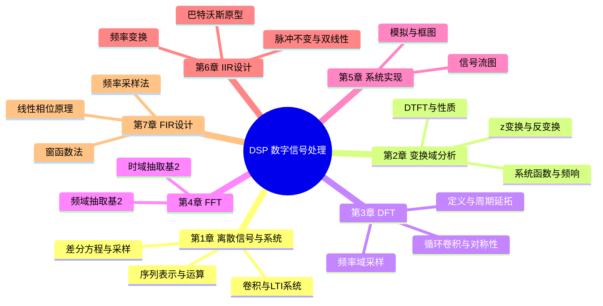
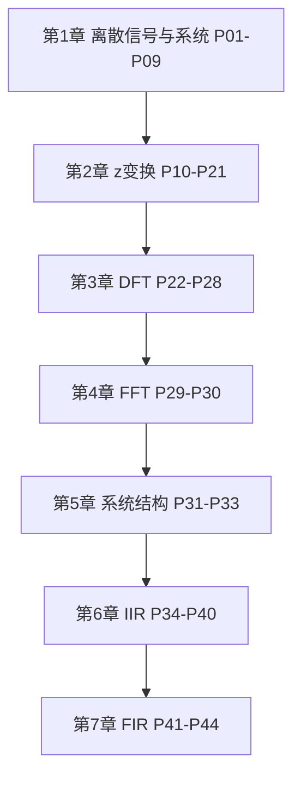

# [DSP]数字信号处理（超浓缩版）

> 西安电子科技大学出版社《数字信号处理》教材配套浓缩教程，共 **44** 个分 P（约 9h 15m 19s）。UP **讲信号与系统的潘老师** 从初学者角度编排，精炼必考知识点，侧重应用数学解决问题的能力。
>
> 各分 P 笔记已补充 **西电教材知识点实质内容**（约 800–1500 字/篇，2026-06-06）。B 站 API 无外挂字幕，逐字稿可后续用 Whisper/BiliNote 补充。

## 视频简介（B 站原文）

视频以西安电子科技大学出版社的数字信号处理为教材，通过42个视频浓缩地讲解该课程主体内容。

本教程充分考虑了本科低年级学生的数学基础，从初学者的角度去编排讲述顺序和内容，尽可能精炼地选择教学大纲要求的必考知识点来讲解，忽略了繁杂的推导，删减了与后续课程交叉部分知识，利于本科学生理解和掌握数字信号处理最基本的理论知识框架，重点培养学生的应用数学知识解决问题的能力。精选的例题能起到解释该知识点的用法和算法的作用。同学们学完了视频的内容，还要系统地研究课本的公式与推导，把教程的内容从薄扩展到厚，从公式的内涵中理解那些可以为未来通信技术实现创新的根本。

## 视频数据

| 字段 | 内容 |
|------|------|
| BV 号 | BV127411M7BU |
| UP 主 | 讲信号与系统的潘老师 |
| 总时长 | 9h 15m 19s（33319 秒） |
| 分 P 数 | 44 |
| 播放量 | 5,084,799（抓取时） |
| 收藏 | 139,926 |
| 投币 | 75,019 |
| 标签 | 教程、数字信号处理 |
| 教材 | 西安电子科技大学出版社《数字信号处理》 |
| 字幕状态 | 无外挂字幕轨（视频为内嵌配音字幕，API 返回空列表） |

## 思维导图

## 分 P 索引

| 分 P | B 站分集标题 | 时长 | 笔记 |
|------|-------------|------|------|
| P01 | 1-1绪论 | 8分50秒 | [[P01-绪论]] |
| P02 | 1-2序列的表示 | 7分49秒 | [[P02-序列的表示]] |
| P03 | 1-3常用典型序列及基本运算 | 12分42秒 | [[P03-常用典型序列及基本运算]] |
| P04 | 序列卷积和（新版重传） | 17分13秒 | [[P04-序列卷积和]] |
| P05 | 1-4系统的分类（新版重传） | 13分37秒 | [[P05-系统的分类]] |
| P06 | 1-5线性时不变系统（新版重传） | 16分22秒 | [[P06-线性时不变系统]] |
| P07 | 1-6系统的因果性和稳定性（最清楚的离散系统的因果稳定性判断剖析） | 9分56秒 | [[P07-系统的因果性和稳定性]] |
| P08 | 1-7离散LTI系统的数学模型（差分方程） | 11分16秒 | [[P08-离散LTI系统的数学模型]] |
| P09 | 1-8模拟信号数字化（采样的数学过程） | 10分38秒 | [[P09-模拟信号数字化]] |
| P10 | 2-1序列傅里叶变换（重传） | 12分02秒 | [[P10-序列傅里叶变换]] |
| P11 | 2-2傅里叶变换的性质 | 10分05秒 | [[P11-傅里叶变换的性质]] |
| P12 | 2-3-1z变换的定义 | 8分54秒 | [[P12-z变换的定义]] |
| P13 | 2-3-2z变换的收敛域 | 10分04秒 | [[P13-z变换的收敛域]] |
| P14 | 2-6z变换解差分方程（新版） | 15分03秒 | [[P14-z变换解差分方程]] |
| P15 | 2-4 z变换的性质 | 14分23秒 | [[P15-z变换的性质]] |
| P16 | 2-5-1z反变换1观察法 | 14分37秒 | [[P16-z反变换1观察法]] |
| P17 | 2-5-2z反变换2留数法 | 10分52秒 | [[P17-z反变换2留数法]] |
| P18 | 2-5-3Z反变换（3部分分式展开法） | 14分35秒 | [[P18-Z反变换]] |
| P19 | 2-6系统函数的极点分布与系统因果稳定性 | 13分46秒 | [[P19-系统函数的极点分布与系统因果稳定性]] |
| P20 | 2-7z变换与系统频响 | 15分53秒 | [[P20-z变换与系统频响]] |
| P21 | 2-8频响特性的几何确定法 | 10分54秒 | [[P21-频响特性的几何确定法]] |
| P22 | 3-1-1离散傅里叶变换的定义 | 14分27秒 | [[P22-离散傅里叶变换的定义]] |
| P23 | 3-1-2周期延拓 | 14分02秒 | [[P23-周期延拓]] |
| P24 | 3-1-3周期序列的傅里叶级数系数及旋转因子计算技巧 | 10分03秒 | [[P24-周期序列的傅里叶级数系数及旋转因子计算技巧]] |
| P25 | 3-2-1离散傅里叶变换线性特性及循环移位特性 | 14分22秒 | [[P25-离散傅里叶变换线性特性及循环移位特性]] |
| P26 | 3-2-2循环卷积 | 12分50秒 | [[P26-循环卷积]] |
| P27 | 3-2-3复共轭的DFT和DFT的共轭对称性 | 12分07秒 | [[P27-复共轭的DFT和DFT的共轭对称性]] |
| P28 | 3-3频率域采样定理 | 3分59秒 | [[P28-频率域采样定理]] |
| P29 | 4-1时域抽取的基2FFT算法原理及运算流图 | 14分51秒 | [[P29-时域抽取的基2FFT算法原理及运算流图]] |
| P30 | 4-2频域抽取的基2-FFT算法原理及运算流图（修改重传） | 13分23秒 | [[P30-频域抽取的基2-FFT算法原理及运算流图]] |
| P31 | 5-1离散时间系统的模拟及基本原理 | 16分32秒 | [[P31-离散时间系统的模拟及基本原理]] |
| P32 | 5-2系统框图及其结构形式 | 12分43秒 | [[P32-系统框图及其结构形式]] |
| P33 | 5-3信号流图 | 13分32秒 | [[P33-信号流图]] |
| P34 | 6-1巴特沃斯模拟低通滤波器设计 | 14分55秒 | [[P34-巴特沃斯模拟低通滤波器设计]] |
| P35 | 6-2数字滤波器及原理 | 12分55秒 | [[P35-数字滤波器及原理]] |
| P36 | 6-3脉冲响应不变法设计IIR数字滤波器 | 15分44秒 | [[P36-脉冲响应不变法设计IIR数字滤波器]] |
| P37 | 双线性变换法设计IIR滤波器 | 9分09秒 | [[P37-双线性变换法设计IIR滤波器]] |
| P38 | 6-5频率变换法设计高通滤波器 | 11分49秒 | [[P38-频率变换法设计高通滤波器]] |
| P39 | 6-6频率变换法设计带通滤波器（很少考） | 10分48秒 | [[P39-频率变换法设计带通滤波器]] |
| P40 | 6-7IIR滤波器的基本网络结构 | 14分33秒 | [[P40-IIR滤波器的基本网络结构]] |
| P41 | 7-1FIR滤波器的基本原理 | 10分50秒 | [[P41-FIR滤波器的基本原理]] |
| P42 | 7-2FIR滤波器的频响特性与分类 | 7分38秒 | [[P42-FIR滤波器的频响特性与分类]] |
| P43 | 7-3窗函数法设计FIR滤波器改 | 17分08秒 | [[P43-窗函数法设计FIR滤波器改]] |
| P44 | 7-4频率采样法设计FIR滤波器 | 17分28秒 | [[P44-频率采样法设计FIR滤波器]] |

## 学习路径

1. **第 1 章（P01–P09）** — 建立离散信号、卷积、LTI 系统与采样基础
2. **第 2 章（P10–P21）** — 掌握 DTFT、z 变换及系统频响分析
3. **第 3 章（P22–P28）** — 理解 DFT 及其循环性质
4. **第 4 章（P29–P30）** — 学习基 2 FFT 算法
5. **第 5 章（P31–P33）** — 系统结构与信号流图
6. **第 6 章（P34–P40）** — IIR 滤波器设计方法
7. **第 7 章（P41–P44）** — FIR 滤波器设计方法

> 建议按 P01→P44 顺序学习；每看完一 P，对照教材相应章节补全推导。

## 关联资源

- 原始 API 数据：`Tools/BV127411M7BU-full.json`
- 笔记生成脚本：`Tools/bili-fetch/generate-dsp-notes.js`
- 封面目录：[[../../06-资源附件/video-notes-images/]]
- 思维导图专页：[[思维导图]]

## 工具与数据文件

| 工具 | 路径 | 用途 |
|------|------|------|
| bilibili-obsidian-notes | `D:\\solidworks\\Tools\\bilibili-obsidian-notes\\` | 字幕/关键帧/笔记工作流 |
| Node 抓取脚本 | `D:\\solidworks\\Tools\\bili-fetch\\fetch-bilibili.js` | 无 Key 拉取元数据 + 首帧封面 |
| 结构化摘要 | `D:\\solidworks\\Tools\\BV127411M7BU-full.json` | 整理后的分 P 数据 |

## 待 Whisper 补充

- [ ] P01–P44 逐字转写与时间戳
- [ ] 板书/公式关键帧截图（需 ffmpeg）
- [ ] 精选例题完整推导同步至笔记
