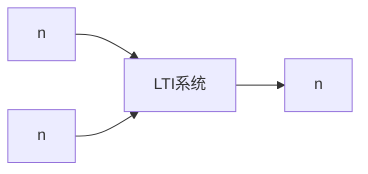

# P01 1-1绪论

← [[BV127411M7BU-总览]] | 下一篇 → [[P02-序列的表示]]

## 视频信息

| 项目 | 内容 |
|------|------|
| 分集 | 1-1绪论 |
| 章节 | 第 1 章 · 离散时间信号与系统 |
| 时长 | 8 分 50 秒 |
| 链接 | [B 站 P1](https://www.bilibili.com/video/BV127411M7BU?p=1) |
| 教材 | 西安电子科技大学出版社《数字信号处理》 |
| 内容来源 | 知识点增强（西电教材大纲，非逐字转写） |

## 核心要点

1. **本 P 主题**：1-1绪论
2. **教材章节**：第 1 章「离散时间信号与系统」
3. **考试侧重**：信号分类、LTI 框架、与信号与系统衔接
4. **笔记层级**：教程级（约 2740 字），含速览、图解、例题 Walkthrough、自测题
5. **学习建议**：先读「3 分钟速览」，手算 1 题后再看视频核对步骤

> 以下内容基于西电版《数字信号处理》教材知识体系撰写，对应 B 站分 P「1-1绪论」。**非 UP 逐字转写**；不看视频可建立框架，看视频对照「与视频对照表」。

## 本节在系列中的位置

**章节**：第 1 章「离散时间信号与系统」· P01/44。

**课程起点**：先读 [[BV127411M7BU-总览]]。

**后续**：「1-2序列的表示」将在此基础上延伸。

## 3 分钟速览

本集讲解「1-1绪论」，属第 1 章。考点：**信号分类、LTI 框架、与信号与系统衔接**。

## 零基础导读

数字信号处理的主线是：**用离散数学工具（序列、Z 变换、DFT）分析 LTI 系统，并设计数字滤波器**。本集「1-1绪论」即便不看视频，也应先弄清：定义是什么、与前后章如何衔接、考试会怎么考。

西电教材证明较完整，本笔记是**提纲+考点+直觉**；期末/考研请回教材补证明与习题。

## 详细讲解

### 1. 数字信号处理（DSP）是什么

数字信号处理（Digital Signal Processing, DSP）研究**离散时间信号**在**离散时间系统**中的产生、变换、分析与综合。与本科先修的「信号与系统」相比，DSP 更强调**可计算性**——所有运算最终要在计算机或 DSP 芯片上以有限精度完成。

本课程教材为西安电子科技大学出版社《数字信号处理》，本视频系列是对教材的**超浓缩版**：保留考试必考框架，省略冗长推导，但学完视频后**必须回归课本**补全证明与细节。

### 2. 信号的基本分类

| 类型 | 时间域 | 幅度域 | 例 |
|------|--------|--------|-----|
| 模拟信号 | 连续 | 连续 | 麦克风电压波形 |
| 数字信号 | 离散 | 量化离散 | ADC 输出码流 |
| 离散时间信号 | 离散 | 连续（未量化） | 序列 $x(n)$ |

DSP 的核心数学对象是**序列** $x(n)$，其中 $n$ 为整数时刻索引。注意：离散时间信号未必是数字信号；只有经过量化后才成为严格意义的数字信号。

### 3. 系统的角色

**系统**将输入序列 $x(n)$ 映射为输出序列 $y(n)$，记 $y(n)=T[x(n)]$。DSP 最关心的两类性质：

- **线性**：满足叠加原理 $T[ax_1+bx_2]=aT[x_1]+bT[x_2]$
- **时不变**：输入移位 $k$ 则输出也移位 $k$

满足二者简称 **LTI（线性时不变）系统**，是全书分析主线。

### 4. DSP 要解决的基本问题

1. **表示**：如何用数学描述离散信号（序列、Z 变换、DFT）
2. **分析**：给定系统，求响应、频响、稳定性
3. **综合**：设计滤波器（IIR/FIR）实现期望频率特性
4. **实现**：选择结构（直接型、级联型）、考虑有限字长效应
5. **采样**：模拟信号如何无失真地数字化（奈奎斯特定理）

### 5. 与「信号与系统」的衔接

| 信号与系统 | DSP 本课 |
|-----------|---------|
| 连续/离散傅里叶变换 | 以 DTFT、DFT 为主 |
| 拉普拉斯变换 | 以 Z 变换为主 |
| 连续系统微分方程 | 离散系统差分方程 |
| 理想化分析 | 强调算法与可实现性 |

若已学信号与系统，可把 Z 变换理解为拉氏变换在离散域的对应；DFT 是 DTFT 在有限长序列上的采样版本。

### 6. 典型应用

- 音频/图像压缩与增强
- 通信调制解调、信道均衡
- 雷达/声呐信号检测
- 生物医学信号（ECG、EEG）分析
- 控制系统的数字控制器设计

### 7. 考试要点

- 能区分模拟/离散时间/数字三类信号
- 说出 LTI 系统的定义（线性 + 时不变，需会判定）
- 了解 DSP 研究框架：表示→分析→设计→实现
- 明确本课与信号与系统、后续通信/图像课程的分工

### 本章学习节奏（P01）

建议每周完成 3–4 个分 P：先看笔记建立定义，再跟视频做 2 道题，最后闭卷复述关键性质。第 1 章期末占比高，卷积与稳定性是全书地基。

## 图解

## 类比与直觉

序列像**按编号排列的样本点**；LTI 系统像**固定配方滤镜**，同样原料（输入）永远得到同样成品（输出），且两种原料混合过滤等于分别过滤再相加。

## 例题与场景 Walkthrough

**例题思路（本集主题）**

1. **读题**：标出已知是时域序列、系统函数还是频域采样。
2. **选型**：时域卷积 → 第 1 章；Z 域代数 → 第 2 章；频域周期序列 → 第 3–4 章；滤波器指标 → 第 6–7 章。
3. **计算**：按「信号分类、LTI 框架、与信号与系统衔接」列步骤；卷积用竖线法，反变换用部分分式或留数法，设计用双线性/窗函数。
4. **检验**：因果性看 $h(n)$ 右边；稳定性看极点是否在单位圆内；实序列看 DFT 共轭对称。
5. **对照视频**：UP 本集应演示 1–2 道典型算例，暂停跟算。

## 常见误区

1. **只背公式不做题**：DSP 是计算课，卷积、反变换、FFT 流图必须手算一遍。
2. **忽略 ROC**：同一 $X(z)$ 不同 ROC 对应不同序列，因果/反因果搞反必错。
3. **混淆线性卷积与循环卷积**：要等于线性卷积需补零到 $N \geq N_1+N_2-1$。
4. **数字频率 $\omega$ 与模拟 $\Omega$ 混用**：记住 $\omega=\Omega T$ 与双线性预畸变。

## 与视频对照表

| 视频段落（约） | 预期演示内容 | 笔记对应章节 |
|-------------|------------|------------|
| 开篇 0%–15% | 本集目标、背景、与前后集关系 | 本节位置、3 分钟速览 |
| 前段 15%–40% | 核心概念定义与架构图 | 零基础导读、详细讲解 |
| 中段 40%–70% | 原理展开、对比、政策/代码示例 | 图解、类比、Walkthrough |
| 后段 70%–90% | 案例、问答、易错点 | 常见误区、Checklist |
| 收尾 90%–100% | 总结、延伸资源 | 延伸阅读、自测题 |

> 本集总时长约 **8分50秒**。无官方外挂字幕时，以分 P 标题「1-1绪论」与上表主题对齐视频画面。

## 动手实践 Checklist

- [ ] 在教材找到对应小节并标出定理/公式
- [ ] 手算 1 道与本集标题相关的例题
- [ ] 画出 1 张概念图（定义→性质→应用）
- [ ] 对照视频核对 1 个推导或流图
- [ ] 将易错点写入错题本（ROC/补零/稳定性）

## 延伸阅读

- 西电《数字信号处理》第 1 章
- Oppenheim《离散时间信号处理》对应章节
- 课程 P01–P02 笔记交叉阅读

## 自测题

1. **本集考点？**  **答**：信号分类、LTI 框架、与信号与系统衔接。
2. **属于哪章？**  **答**：第 1 章 离散时间信号与系统。
3. **与上集关系？**  **答**：绪论，建立全局框架。
4. **一道必会手算？**  **答**：见 Walkthrough 步骤 3。
5. **教材哪一节？**  **答**：对照西电《数字信号处理》第 1 章目录同名小节。

## 关键术语

| 术语 | 说明 |
|------|------|
| 离散时间信号 | 在离散时刻取值的序列 x(n) |
| LTI 系统 | 线性时不变系统，DSP 核心研究对象 |
| 数字信号处理 | 对离散时间信号进行分析和处理的理论与方法 |

## 与前后分 P 的衔接

- ← 课程起点，见 [[BV127411M7BU-总览]]
- → **1-2序列的表示**（[[P02-序列的表示]]）

## 逐字转写
> 状态：待转写。运行 `Tools/transcribe/transcribe.ps1 -Bvid BV127411M7BU -Part 1` 补充。

## 来源说明

- ✅ B 站官方标题、简介、分 P 元数据（`api.bilibili.com`，见 `Tools/BV127411M7BU-full.json`）
- ✅ 分 P 首帧封面（`Tools/bili-fetch/fetch-bilibili.js`）
- ✅ **教程级增强**：含 Mermaid、例题 Walkthrough、自测题（约 2740 字，2026-06-06）
- ⏳ 逐字转写：B 站 API 无外挂字幕轨（内嵌配音字幕）；可选 Whisper/BiliNote 后续补充

## 关键截图

![[../../06-资源附件/video-notes-images/BV127411M7BU-P01-cover.jpg|B站首帧 P01]]
