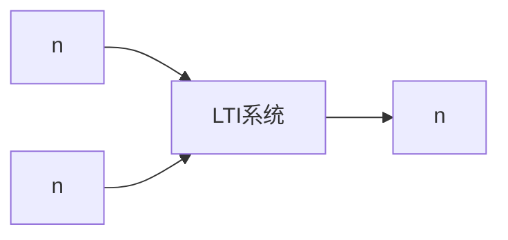

# P02 1-2序列的表示

← [[BV127411M7BU-总览]] | ← [[P01-绪论]] | 下一篇 → [[P03-常用典型序列及基本运算]]

## 视频信息

| 项目 | 内容 |
|------|------|
| 分集 | 1-2序列的表示 |
| 章节 | 第 1 章 · 离散时间信号与系统 |
| 时长 | 7 分 49 秒 |
| 链接 | [B 站 P2](https://www.bilibili.com/video/BV127411M7BU?p=2) |
| 教材 | 西安电子科技大学出版社《数字信号处理》 |
| 内容来源 | 知识点增强（西电教材大纲，非逐字转写） |

## 核心要点

1. **本 P 主题**：1-2序列的表示
2. **教材章节**：第 1 章「离散时间信号与系统」
3. **考试侧重**：序列三种表示、因果性、箭头标注
4. **笔记层级**：教程级（约 2605 字），含速览、图解、例题 Walkthrough、自测题
5. **学习建议**：先读「3 分钟速览」，手算 1 题后再看视频核对步骤

> 以下内容基于西电版《数字信号处理》教材知识体系撰写，对应 B 站分 P「1-2序列的表示」。**非 UP 逐字转写**；不看视频可建立框架，看视频对照「与视频对照表」。

## 本节在系列中的位置

**章节**：第 1 章「离散时间信号与系统」· P02/44。

**前置**：建议掌握「1-1绪论」中的公式与定义。

**后续**：「1-3常用典型序列及基本运算」将在此基础上延伸。

## 3 分钟速览

本集讲解「1-2序列的表示」，属第 1 章。考点：**序列三种表示、因果性、箭头标注**。

## 零基础导读

数字信号处理的主线是：**用离散数学工具（序列、Z 变换、DFT）分析 LTI 系统，并设计数字滤波器**。本集「1-2序列的表示」即便不看视频，也应先弄清：定义是什么、与前后章如何衔接、考试会怎么考。

西电教材证明较完整，本笔记是**提纲+考点+直觉**；期末/考研请回教材补证明与习题。

## 详细讲解

### 1. 序列的数学表示

离散时间信号称为**序列**，记 $x(n)$ 或 $\{x(n)\}$，$n\in\mathbb{Z}$。与连续信号 $x(t)$ 不同，自变量只能取整数值。

**两种等价视角**：
- **函数观点**：$n\mapsto x(n)$，适合写表达式
- **数据观点**：$\{x(-2),x(-1),x(0),x(1),\ldots\}$，适合画图与编程

### 2. 序列的图形表示

在 $n$ 轴上，用**竖线（茎状图）**表示各时刻幅度。横轴为 $n$，纵轴为 $x(n)$ 值。例如 $x(n)=\delta(n-2)$ 仅在 $n=2$ 处为 1，其余为 0。

**绘图技巧**：先标单位脉冲位置，再叠加各分量；有限长序列可直接列表。

### 3. 序列的解析表示

常见写法：

$$x(n)=\begin{cases} 2^n, & n\ge 0 \\ 0, & n<0 \end{cases}$$

或

$$x(n)=\{1,\,3,\,-2,\,0,\,5\}$$

约定：**箭头** $\uparrow$ 指向 $n=0$ 位置，如 $x(n)=\{1,\,3,\,\overset{\uparrow}{-2},\,0,\,5\}$ 表示 $x(-1)=1,x(0)=3,x(1)=-2,\ldots$

### 4. 因果序列与反因果序列

- **因果序列**：$x(n)=0$ 当 $n<0$（仅非负时刻有值）
- **反因果序列**：$x(n)=0$ 当 $n\ge 0$
- **双边序列**：$n$ 正负两侧均可能非零

因果性在系统分析中与「输出不依赖未来输入」对应，后续 P07 详述。

### 5. 序列的有界性

若存在常数 $M$ 使 $|x(n)|\le M$ 对所有 $n$ 成立，则 $x(n)$ **有界**。有界输入有界输出（BIBO）稳定性的判定会用到冲激响应是否绝对可和。

### 6. 典型例题思路

**例**：写出 $x(n)=u(n)-u(n-4)$ 在各 $n$ 的值。

- $n<0$：$u(n)=0$，故 $x(n)=0$
- $0\le n\le 3$：$u(n)=1,u(n-4)=0$，故 $x(n)=1$
- $n\ge 4$：两者均为 1，故 $x(n)=0$

结论：长度为 4 的矩形窗序列。

### 7. 考试要点

- 熟练在解析式、序列列表、图形三种表示间转换
- 会用 $\delta(n)$、$u(n)$ 构造任意有限长序列
- 区分因果/反因果/双边序列
- 注意 $n=0$ 时刻箭头标注规范

### 本章学习节奏（P02）

建议每周完成 3–4 个分 P：先看笔记建立定义，再跟视频做 2 道题，最后闭卷复述关键性质。第 1 章期末占比高，卷积与稳定性是全书地基。

## 图解

## 类比与直觉

序列像**按编号排列的样本点**；LTI 系统像**固定配方滤镜**，同样原料（输入）永远得到同样成品（输出），且两种原料混合过滤等于分别过滤再相加。

## 例题与场景 Walkthrough

**例题思路（本集主题）**

1. **读题**：标出已知是时域序列、系统函数还是频域采样。
2. **选型**：时域卷积 → 第 1 章；Z 域代数 → 第 2 章；频域周期序列 → 第 3–4 章；滤波器指标 → 第 6–7 章。
3. **计算**：按「序列三种表示、因果性、箭头标注」列步骤；卷积用竖线法，反变换用部分分式或留数法，设计用双线性/窗函数。
4. **检验**：因果性看 $h(n)$ 右边；稳定性看极点是否在单位圆内；实序列看 DFT 共轭对称。
5. **对照视频**：UP 本集应演示 1–2 道典型算例，暂停跟算。

## 常见误区

1. **只背公式不做题**：DSP 是计算课，卷积、反变换、FFT 流图必须手算一遍。
2. **忽略 ROC**：同一 $X(z)$ 不同 ROC 对应不同序列，因果/反因果搞反必错。
3. **混淆线性卷积与循环卷积**：要等于线性卷积需补零到 $N \geq N_1+N_2-1$。
4. **数字频率 $\omega$ 与模拟 $\Omega$ 混用**：记住 $\omega=\Omega T$ 与双线性预畸变。

## 与视频对照表

| 视频段落（约） | 预期演示内容 | 笔记对应章节 |
|-------------|------------|------------|
| 开篇 0%–15% | 本集目标、背景、与前后集关系 | 本节位置、3 分钟速览 |
| 前段 15%–40% | 核心概念定义与架构图 | 零基础导读、详细讲解 |
| 中段 40%–70% | 原理展开、对比、政策/代码示例 | 图解、类比、Walkthrough |
| 后段 70%–90% | 案例、问答、易错点 | 常见误区、Checklist |
| 收尾 90%–100% | 总结、延伸资源 | 延伸阅读、自测题 |

> 本集总时长约 **7分49秒**。无官方外挂字幕时，以分 P 标题「1-2序列的表示」与上表主题对齐视频画面。

## 动手实践 Checklist

- [ ] 在教材找到对应小节并标出定理/公式
- [ ] 手算 1 道与本集标题相关的例题
- [ ] 画出 1 张概念图（定义→性质→应用）
- [ ] 对照视频核对 1 个推导或流图
- [ ] 将易错点写入错题本（ROC/补零/稳定性）

## 延伸阅读

- 西电《数字信号处理》第 1 章
- Oppenheim《离散时间信号处理》对应章节
- 课程 P01–P03 笔记交叉阅读

## 自测题

1. **本集考点？**  **答**：序列三种表示、因果性、箭头标注。
2. **属于哪章？**  **答**：第 1 章 离散时间信号与系统。
3. **与上集关系？**  **答**：在「1-1绪论」基础上扩展。
4. **一道必会手算？**  **答**：见 Walkthrough 步骤 3。
5. **教材哪一节？**  **答**：对照西电《数字信号处理》第 1 章目录同名小节。

## 关键术语

| 术语 | 说明 |
|------|------|
| 离散时间信号 | 在离散时刻取值的序列 x(n) |
| LTI 系统 | 线性时不变系统，DSP 核心研究对象 |
| 序列表示 | 解析式、图形、数据列表三种等价形式 |

## 与前后分 P 的衔接

- ← **1-1绪论**（[[P01-绪论]]）
- → **1-3常用典型序列及基本运算**（[[P03-常用典型序列及基本运算]]）

## 逐字转写
> 状态：待转写。运行 `Tools/transcribe/transcribe.ps1 -Bvid BV127411M7BU -Part 2` 补充。

## 来源说明

- ✅ B 站官方标题、简介、分 P 元数据（`api.bilibili.com`，见 `Tools/BV127411M7BU-full.json`）
- ✅ 分 P 首帧封面（`Tools/bili-fetch/fetch-bilibili.js`）
- ✅ **教程级增强**：含 Mermaid、例题 Walkthrough、自测题（约 2605 字，2026-06-06）
- ⏳ 逐字转写：B 站 API 无外挂字幕轨（内嵌配音字幕）；可选 Whisper/BiliNote 后续补充

## 关键截图

![[../../06-资源附件/video-notes-images/BV127411M7BU-P02-cover.jpg|B站首帧 P02]]
