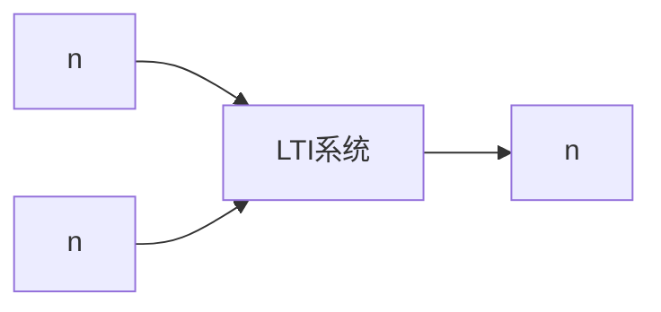

# P06 1-5线性时不变系统（新版重传）

← [[BV127411M7BU-总览]] | ← [[P05-系统的分类]] | 下一篇 → [[P07-系统的因果性和稳定性]]

## 视频信息

| 项目 | 内容 |
|------|------|
| 分集 | 1-5线性时不变系统（新版重传） |
| 章节 | 第 1 章 · 离散时间信号与系统 |
| 时长 | 16 分 22 秒 |
| 链接 | [B 站 P6](https://www.bilibili.com/video/BV127411M7BU?p=6) |
| 教材 | 西安电子科技大学出版社《数字信号处理》 |
| 内容来源 | 知识点增强（西电教材大纲，非逐字转写） |

## 核心要点

1. **本 P 主题**：1-5线性时不变系统
2. **教材章节**：第 1 章「离散时间信号与系统」
3. **考试侧重**：LTI 定义、卷积求输出
4. **笔记层级**：教程级（约 2585 字），含速览、图解、例题 Walkthrough、自测题
5. **学习建议**：先读「3 分钟速览」，手算 1 题后再看视频核对步骤

> 以下内容基于西电版《数字信号处理》教材知识体系撰写，对应 B 站分 P「1-5线性时不变系统（新版重传）」。**非 UP 逐字转写**；不看视频可建立框架，看视频对照「与视频对照表」。

## 本节在系列中的位置

**章节**：第 1 章「离散时间信号与系统」· P06/44。

**前置**：建议掌握「1-4系统的分类（新版重传）」中的公式与定义。

**后续**：「1-6系统的因果性和稳定性（最清楚的离散系统的因果稳定性判断剖析）」将在此基础上延伸。

## 3 分钟速览

本集讲解「1-5线性时不变系统（新版重传）」，属第 1 章。考点：**LTI 定义、卷积求输出**。

## 零基础导读

数字信号处理的主线是：**用离散数学工具（序列、Z 变换、DFT）分析 LTI 系统，并设计数字滤波器**。本集「1-5线性时不变系统（新版重传）」即便不看视频，也应先弄清：定义是什么、与前后章如何衔接、考试会怎么考。

西电教材证明较完整，本笔记是**提纲+考点+直觉**；期末/考研请回教材补证明与习题。

## 详细讲解

### 1. LTI 系统的定义

系统同时满足：

**线性**：$T[ax_1+bx_2]=aT[x_1]+bT[x_2]$

**时不变**：$T[x(n-k)]=y(n-k)$

则称 **LTI（Linear Time-Invariant）系统**，是 DSP 分析的核心对象。

### 2. 冲激响应

LTI 系统对单位脉冲 $\delta(n)$ 的响应：

$$h(n)=T[\delta(n)]$$

**完全表征**：已知 $h(n)$ 则对任意输入

$$y(n)=x(n)*h(n)=\sum_k x(k)h(n-k)$$

### 3. 卷积和描述系统

时域：$y(n)=x(n)*h(n)$

频域（Z 域）：$Y(z)=X(z)H(z)$

频域（DTFT）：$Y(e^{j\omega})=X(e^{j\omega})H(e^{j\omega})$

### 4. LTI 系统的差分方程

一般形式：

$$\sum_{k=0}^{N}a_k y(n-k)=\sum_{r=0}^{M}b_r x(n-r)$$

有反馈项（$a_k$ 不全为零）→ IIR 型；仅 Feedforward（$a_0=1$ 其余 $a_k=0$）→ FIR 型。

### 5. 因果 LTI 系统

$h(n)=0$ 当 $n<0$。此时卷积求和从 $k=0$ 到 $n$：

$$y(n)=\sum_{k=0}^{n}x(k)h(n-k)$$

可实时递推计算。

### 6. 典型例题

**例**：$h(n)=a^n u(n)$，$|a|<1$，输入 $x(n)=u(n)$，求 $y(n)$。

$$y(n)=\sum_{k=0}^{n}a^k=\frac{1-a^{n+1}}{1-a},\quad n\ge 0$$

几何级数求和，收敛因 $|a|<1$。

### 7. LTI 级联与并联

- **级联**：$h(n)=h_1(n)*h_2(n)$，$H(z)=H_1(z)H_2(z)$
- **并联**：$h(n)=h_1(n)+h_2(n)$，$H(z)=H_1(z)+H_2(z)$

### 8. 考试要点

- 由差分方程求 $h(n)$（齐次解+特解，或 Z 变换）
- 用卷积求 LTI 系统输出
- 判定系统是否 LTI（线性+时不变缺一不可）
- 理解 $h(n)$、$H(z)$、$H(e^{j\omega})$ 三者关系

### 本章学习节奏（P06）

建议每周完成 3–4 个分 P：先看笔记建立定义，再跟视频做 2 道题，最后闭卷复述关键性质。第 1 章期末占比高，卷积与稳定性是全书地基。

## 图解

## 类比与直觉

序列像**按编号排列的样本点**；LTI 系统像**固定配方滤镜**，同样原料（输入）永远得到同样成品（输出），且两种原料混合过滤等于分别过滤再相加。

## 例题与场景 Walkthrough

**例题思路（本集主题）**

1. **读题**：标出已知是时域序列、系统函数还是频域采样。
2. **选型**：时域卷积 → 第 1 章；Z 域代数 → 第 2 章；频域周期序列 → 第 3–4 章；滤波器指标 → 第 6–7 章。
3. **计算**：按「LTI 定义、卷积求输出」列步骤；卷积用竖线法，反变换用部分分式或留数法，设计用双线性/窗函数。
4. **检验**：因果性看 $h(n)$ 右边；稳定性看极点是否在单位圆内；实序列看 DFT 共轭对称。
5. **对照视频**：UP 本集应演示 1–2 道典型算例，暂停跟算。

## 常见误区

1. **只背公式不做题**：DSP 是计算课，卷积、反变换、FFT 流图必须手算一遍。
2. **忽略 ROC**：同一 $X(z)$ 不同 ROC 对应不同序列，因果/反因果搞反必错。
3. **混淆线性卷积与循环卷积**：要等于线性卷积需补零到 $N \geq N_1+N_2-1$。
4. **数字频率 $\omega$ 与模拟 $\Omega$ 混用**：记住 $\omega=\Omega T$ 与双线性预畸变。

## 与视频对照表

| 视频段落（约） | 预期演示内容 | 笔记对应章节 |
|-------------|------------|------------|
| 开篇 0%–15% | 本集目标、背景、与前后集关系 | 本节位置、3 分钟速览 |
| 前段 15%–40% | 核心概念定义与架构图 | 零基础导读、详细讲解 |
| 中段 40%–70% | 原理展开、对比、政策/代码示例 | 图解、类比、Walkthrough |
| 后段 70%–90% | 案例、问答、易错点 | 常见误区、Checklist |
| 收尾 90%–100% | 总结、延伸资源 | 延伸阅读、自测题 |

> 本集总时长约 **16分22秒**。无官方外挂字幕时，以分 P 标题「1-5线性时不变系统」与上表主题对齐视频画面。

## 动手实践 Checklist

- [ ] 在教材找到对应小节并标出定理/公式
- [ ] 手算 1 道与本集标题相关的例题
- [ ] 画出 1 张概念图（定义→性质→应用）
- [ ] 对照视频核对 1 个推导或流图
- [ ] 将易错点写入错题本（ROC/补零/稳定性）

## 延伸阅读

- 西电《数字信号处理》第 1 章
- Oppenheim《离散时间信号处理》对应章节
- 课程 P05–P07 笔记交叉阅读

## 自测题

1. **本集考点？**  **答**：LTI 定义、卷积求输出。
2. **属于哪章？**  **答**：第 1 章 离散时间信号与系统。
3. **与上集关系？**  **答**：在「1-4系统的分类（新版重传）」基础上扩展。
4. **一道必会手算？**  **答**：见 Walkthrough 步骤 3。
5. **教材哪一节？**  **答**：对照西电《数字信号处理》第 1 章目录同名小节。

## 关键术语

| 术语 | 说明 |
|------|------|
| 离散时间信号 | 在离散时刻取值的序列 x(n) |
| LTI 系统 | 线性时不变系统，DSP 核心研究对象 |
| 冲激响应 h(n) | 系统对 δ(n) 的响应，完全表征 LTI 系统 |

## 与前后分 P 的衔接

- ← **1-4系统的分类（新版重传）**（[[P05-系统的分类]]）
- → **1-6系统的因果性和稳定性（最清楚的离散系统的因果稳定性判断剖析）**（[[P07-系统的因果性和稳定性]]）

## 逐字转写
> 状态：待转写。运行 `Tools/transcribe/transcribe.ps1 -Bvid BV127411M7BU -Part 6` 补充。

## 来源说明

- ✅ B 站官方标题、简介、分 P 元数据（`api.bilibili.com`，见 `Tools/BV127411M7BU-full.json`）
- ✅ 分 P 首帧封面（`Tools/bili-fetch/fetch-bilibili.js`）
- ✅ **教程级增强**：含 Mermaid、例题 Walkthrough、自测题（约 2585 字，2026-06-06）
- ⏳ 逐字转写：B 站 API 无外挂字幕轨（内嵌配音字幕）；可选 Whisper/BiliNote 后续补充

## 关键截图

![[../../06-资源附件/video-notes-images/BV127411M7BU-P06-cover.jpg|B站首帧 P06]]
