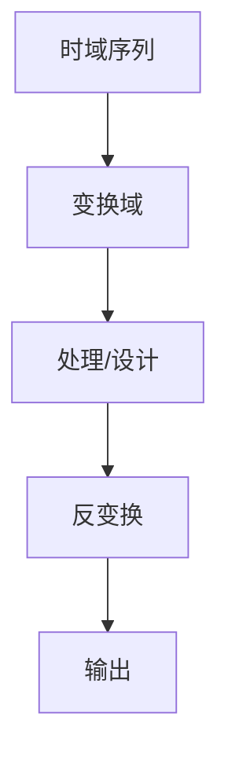

# P23 3-1-2周期延拓

← [[BV127411M7BU-总览]] | ← [[P22-离散傅里叶变换的定义]] | 下一篇 → [[P24-周期序列的傅里叶级数系数及旋转因子计算技巧]]

## 视频信息

| 项目 | 内容 |
|------|------|
| 分集 | 3-1-2周期延拓 |
| 章节 | 第 3 章 · 离散傅里叶变换（DFT） |
| 时长 | 14 分 02 秒 |
| 链接 | [B 站 P23](https://www.bilibili.com/video/BV127411M7BU?p=23) |
| 教材 | 西安电子科技大学出版社《数字信号处理》 |
| 内容来源 | 知识点增强（西电教材大纲，非逐字转写） |

## 核心要点

1. **本 P 主题**：3-1-2周期延拓
2. **教材章节**：第 3 章「离散傅里叶变换（DFT）」
3. **考试侧重**：周期延拓、循环移位
4. **笔记层级**：教程级（约 2453 字），含速览、图解、例题 Walkthrough、自测题
5. **学习建议**：先读「3 分钟速览」，手算 1 题后再看视频核对步骤

> 以下内容基于西电版《数字信号处理》教材知识体系撰写，对应 B 站分 P「3-1-2周期延拓」。**非 UP 逐字转写**；不看视频可建立框架，看视频对照「与视频对照表」。

## 本节在系列中的位置

**章节**：第 3 章「离散傅里叶变换（DFT）」· P23/44。

**前置**：建议掌握「3-1-1离散傅里叶变换的定义」中的公式与定义。

**后续**：「3-1-3周期序列的傅里叶级数系数及旋转因子计算技巧」将在此基础上延伸。

## 3 分钟速览

本集讲解「3-1-2周期延拓」，属第 3 章。考点：**周期延拓、循环移位**。

## 零基础导读

数字信号处理的主线是：**用离散数学工具（序列、Z 变换、DFT）分析 LTI 系统，并设计数字滤波器**。本集「3-1-2周期延拓」即便不看视频，也应先弄清：定义是什么、与前后章如何衔接、考试会怎么考。

西电教材证明较完整，本笔记是**提纲+考点+直觉**；期末/考研请回教材补证明与习题。

## 详细讲解

### 1. 周期延拓

有限长 $x(n)$，$0\le n\le N-1$，DFT 将其视为周期序列 $\tilde{x}(n)=x(n\mod N)$ 的一个周期。

### 2. 时域周期延拓

$$x((-n))_N = x((N-n)\mod N)$$

**循环移位**与线性移位的区别：超出 $[0,N-1]$ 的部分**折回**。

### 3. 频域周期延拓

$X(k)$ 以 $N$ 为周期：$X(k+N)=X(k)$。

### 4. 混叠效应

若 $x(n)$ 实际长度 $L>N$，以 $N$ 点 DFT 则时域混叠（高频折叠）。应选 $N\ge L$ 或补零至足够长。

### 5. 补零与分辨率

补零不改变原序列频谱包络，但使 DFT 采样点更密，**频谱看起来更细**，不增加真实频率分辨率（需更长观测时间）。

### 6. 典型例题

**例**：$x(n)=\{1,2,3\}$，做 $N=4$ DFT，等价周期序列？

$\tilde{x}(n)=\{1,2,3,0,1,2,3,0,\ldots\}$

### 7. 考试要点

- 理解 DFT 的隐含周期假设
- 区分线性移位与循环移位
- 解释补零的作用与局限
- 时域截断 → 频域泄漏

### 8. 周期延拓图示理解

将有限长 $x(n)$ 画在 $n=0,\ldots,N-1$，DFT 默认将其向左向右每 $N$ 点重复，形成周期 $\tilde{x}(n)$。若原序列非周期，频谱泄漏来自「强行周期化」——窗函数法 FIR 设计实质是选窗控制泄漏。

### 9. 循环移位公式

$$x((n+m))_N = x((n+m)\bmod N)$$

与线性移位 $x(n-m)$ 区别：索引超出 $[0,N-1]$ 时**折回**。DFT 时移性质：$x((n+m))_N \leftrightarrow W_N^{-km}X(k)$。

### 9. 补零与混叠辨析

补零不改变原序列 DTFT 包络，只增加 DFT 采样密度；若真实长度 $L>N$ 却做 $N$ 点 DFT，则时域发生**混叠**——二者切勿混淆。

### 本章学习节奏（P23）

建议每周完成 3–4 个分 P：先看笔记建立定义，再跟视频做 2 道题，最后闭卷复述关键性质。第 3 章期末占比高，DFT/FFT 是频域算法核心。

## 图解

## 类比与直觉

DFT 像**对一段乐曲做有限个频谱采样**；循环卷积像**把曲子首尾相接成环再混响**——不补零就会「绕回」产生失真。

## 例题与场景 Walkthrough

**例题思路（本集主题）**

1. **读题**：标出已知是时域序列、系统函数还是频域采样。
2. **选型**：时域卷积 → 第 1 章；Z 域代数 → 第 2 章；频域周期序列 → 第 3–4 章；滤波器指标 → 第 6–7 章。
3. **计算**：按「周期延拓、循环移位」列步骤；卷积用竖线法，反变换用部分分式或留数法，设计用双线性/窗函数。
4. **检验**：因果性看 $h(n)$ 右边；稳定性看极点是否在单位圆内；实序列看 DFT 共轭对称。
5. **对照视频**：UP 本集应演示 1–2 道典型算例，暂停跟算。

## 常见误区

1. **只背公式不做题**：DSP 是计算课，卷积、反变换、FFT 流图必须手算一遍。
2. **忽略 ROC**：同一 $X(z)$ 不同 ROC 对应不同序列，因果/反因果搞反必错。
3. **混淆线性卷积与循环卷积**：要等于线性卷积需补零到 $N \geq N_1+N_2-1$。
4. **数字频率 $\omega$ 与模拟 $\Omega$ 混用**：记住 $\omega=\Omega T$ 与双线性预畸变。

## 与视频对照表

| 视频段落（约） | 预期演示内容 | 笔记对应章节 |
|-------------|------------|------------|
| 开篇 0%–15% | 本集目标、背景、与前后集关系 | 本节位置、3 分钟速览 |
| 前段 15%–40% | 核心概念定义与架构图 | 零基础导读、详细讲解 |
| 中段 40%–70% | 原理展开、对比、政策/代码示例 | 图解、类比、Walkthrough |
| 后段 70%–90% | 案例、问答、易错点 | 常见误区、Checklist |
| 收尾 90%–100% | 总结、延伸资源 | 延伸阅读、自测题 |

> 本集总时长约 **14分02秒**。无官方外挂字幕时，以分 P 标题「3-1-2周期延拓」与上表主题对齐视频画面。

## 动手实践 Checklist

- [ ] 在教材找到对应小节并标出定理/公式
- [ ] 手算 1 道与本集标题相关的例题
- [ ] 画出 1 张概念图（定义→性质→应用）
- [ ] 对照视频核对 1 个推导或流图
- [ ] 将易错点写入错题本（ROC/补零/稳定性）

## 延伸阅读

- 西电《数字信号处理》第 3 章
- Oppenheim《离散时间信号处理》对应章节
- 课程 P22–P24 笔记交叉阅读

## 自测题

1. **本集考点？**  **答**：周期延拓、循环移位。
2. **属于哪章？**  **答**：第 3 章 离散傅里叶变换（DFT）。
3. **与上集关系？**  **答**：在「3-1-1离散傅里叶变换的定义」基础上扩展。
4. **一道必会手算？**  **答**：见 Walkthrough 步骤 3。
5. **教材哪一节？**  **答**：对照西电《数字信号处理》第 3 章目录同名小节。

## 关键术语

| 术语 | 说明 |
|------|------|
| 离散时间信号 | 在离散时刻取值的序列 x(n) |
| LTI 系统 | 线性时不变系统，DSP 核心研究对象 |
| 循环移位 | x((n+m))_N，索引模 N 折回 |

## 与前后分 P 的衔接

- ← **3-1-1离散傅里叶变换的定义**（[[P22-离散傅里叶变换的定义]]）
- → **3-1-3周期序列的傅里叶级数系数及旋转因子计算技巧**（[[P24-周期序列的傅里叶级数系数及旋转因子计算技巧]]）

## 来源说明

- ✅ B 站官方标题、简介、分 P 元数据（`api.bilibili.com`，见 `Tools/BV127411M7BU-full.json`）
- ✅ 分 P 首帧封面（`Tools/bili-fetch/fetch-bilibili.js`）
- ✅ **教程级增强**：含 Mermaid、例题 Walkthrough、自测题（约 2453 字，2026-06-06）
- ⏳ 逐字转写：B 站 API 无外挂字幕轨（内嵌配音字幕）；可选 Whisper/BiliNote 后续补充

## 关键截图

![[../../06-资源附件/video-notes-images/BV127411M7BU-P23-cover.jpg|B站首帧 P23]]
