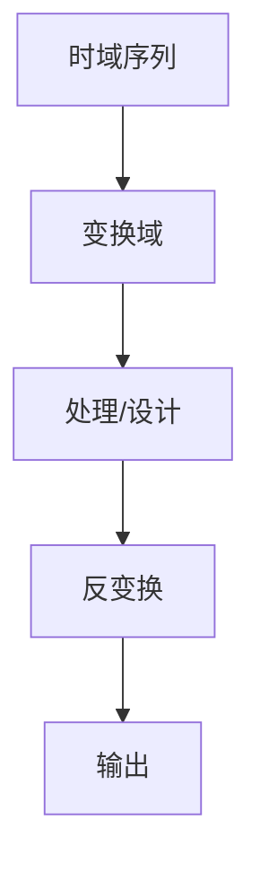

# P26 3-2-2循环卷积

← [[BV127411M7BU-总览]] | ← [[P25-离散傅里叶变换线性特性及循环移位特性]] | 下一篇 → [[P27-复共轭的DFT和DFT的共轭对称性]]

## 视频信息

| 项目 | 内容 |
|------|------|
| 分集 | 3-2-2循环卷积 |
| 章节 | 第 3 章 · 离散傅里叶变换（DFT） |
| 时长 | 12 分 50 秒 |
| 链接 | [B 站 P26](https://www.bilibili.com/video/BV127411M7BU?p=26) |
| 教材 | 西安电子科技大学出版社《数字信号处理》 |
| 内容来源 | 知识点增强（西电教材大纲，非逐字转写） |

## 核心要点

1. **本 P 主题**：3-2-2循环卷积
2. **教材章节**：第 3 章「离散傅里叶变换（DFT）」
3. **考试侧重**：循环卷积 vs 线性卷积
4. **笔记层级**：教程级（约 2509 字），含速览、图解、例题 Walkthrough、自测题
5. **学习建议**：先读「3 分钟速览」，手算 1 题后再看视频核对步骤

> 以下内容基于西电版《数字信号处理》教材知识体系撰写，对应 B 站分 P「3-2-2循环卷积」。**非 UP 逐字转写**；不看视频可建立框架，看视频对照「与视频对照表」。

## 本节在系列中的位置

**章节**：第 3 章「离散傅里叶变换（DFT）」· P26/44。

**前置**：建议掌握「3-2-1离散傅里叶变换线性特性及循环移位特性」中的公式与定义。

**后续**：「3-2-3复共轭的DFT和DFT的共轭对称性」将在此基础上延伸。

## 3 分钟速览

本集讲解「3-2-2循环卷积」，属第 3 章。考点：**循环卷积 vs 线性卷积**。

## 零基础导读

数字信号处理的主线是：**用离散数学工具（序列、Z 变换、DFT）分析 LTI 系统，并设计数字滤波器**。本集「3-2-2循环卷积」即便不看视频，也应先弄清：定义是什么、与前后章如何衔接、考试会怎么考。

西电教材证明较完整，本笔记是**提纲+考点+直觉**；期末/考研请回教材补证明与习题。

## 详细讲解

### 1. 循环卷积定义

$$y(n)=x_1(n)\circledast_N x_2(n)=\sum_{m=0}^{N-1}x_1(m)x_2((n-m)_N)$$

$(n-m)_N$ 表示模 $N$ 运算，**折回**索引。

### 2. 与线性卷积关系

若 $x_1$、$x_2$ 长度分别为 $N_1$、$N_2$，线性卷积长 $N_1+N_2-1$。

**当 $N\ge N_1+N_2-1$** 时，$N$ 点循环卷积 = 线性卷积（补零至 $N$）。

若 $N$ 不足，循环卷积 = 线性卷积的**混叠**版本。

### 3. DFT 实现循环卷积

1. 计算 $X_1(k)$、$X_2(k)$
2. $Y(k)=X_1(k)X_2(k)$
3. IDFT 得 $y(n)$

$O(N\log N)$ 若用 FFT。

### 4. 快速卷积

长序列线性卷积：分段 + FFT，选 $N$ 为 2 的幂。

### 5. 典型例题

**例**：$x_1=\{1,2,0\}$，$x_2=\{1,1,1\}$，$N=3$ 循环卷积。

| $n$ | 计算 | $y(n)$ |
|-----|------|--------|
| 0 | $1\times1+2\times1+0\times1$ | 3 |
| 1 | $0\times1+1\times1+2\times1$ | 3 |
| 2 | $2\times1+0\times1+1\times1$ | 3 |

（索引折回：$x_2((-m)_3)$ 等）

### 6. 考试要点

- 会算 $N=4$ 或 $N=8$ 循环卷积
- 掌握 $N\ge N_1+N_2-1$ 条件
- 用 DFT 求循环卷积流程
- 区分线性卷积与循环卷积（必考）

### 8. 循环卷积计算

1. 将 $x_1,x_2$ 补零至长度 $N$；2. 分别 DFT 得 $X_1,X_2$；3. 逐点相乘；4. IDFT。或直接按定义 $y(n)=\sum_{m=0}^{N-1}x_1(m)x_2((n-m))_N$ 竖线法（模 $N$ 折回）。

### 9. 与线性卷积关系

当 $N\ge L_1+L_2-1$ 时循环卷积结果与线性卷积前 $N$ 点一致——FFT 卷积法的理论依据。

### 本章学习节奏（P26）

建议每周完成 3–4 个分 P：先看笔记建立定义，再跟视频做 2 道题，最后闭卷复述关键性质。第 3 章期末占比高，DFT/FFT 是频域算法核心。

## 图解

## 类比与直觉

DFT 像**对一段乐曲做有限个频谱采样**；循环卷积像**把曲子首尾相接成环再混响**——不补零就会「绕回」产生失真。

## 例题与场景 Walkthrough

**例题思路（本集主题）**

1. **读题**：标出已知是时域序列、系统函数还是频域采样。
2. **选型**：时域卷积 → 第 1 章；Z 域代数 → 第 2 章；频域周期序列 → 第 3–4 章；滤波器指标 → 第 6–7 章。
3. **计算**：按「循环卷积 vs 线性卷积」列步骤；卷积用竖线法，反变换用部分分式或留数法，设计用双线性/窗函数。
4. **检验**：因果性看 $h(n)$ 右边；稳定性看极点是否在单位圆内；实序列看 DFT 共轭对称。
5. **对照视频**：UP 本集应演示 1–2 道典型算例，暂停跟算。

## 常见误区

1. **只背公式不做题**：DSP 是计算课，卷积、反变换、FFT 流图必须手算一遍。
2. **忽略 ROC**：同一 $X(z)$ 不同 ROC 对应不同序列，因果/反因果搞反必错。
3. **混淆线性卷积与循环卷积**：要等于线性卷积需补零到 $N \geq N_1+N_2-1$。
4. **数字频率 $\omega$ 与模拟 $\Omega$ 混用**：记住 $\omega=\Omega T$ 与双线性预畸变。

## 与视频对照表

| 视频段落（约） | 预期演示内容 | 笔记对应章节 |
|-------------|------------|------------|
| 开篇 0%–15% | 本集目标、背景、与前后集关系 | 本节位置、3 分钟速览 |
| 前段 15%–40% | 核心概念定义与架构图 | 零基础导读、详细讲解 |
| 中段 40%–70% | 原理展开、对比、政策/代码示例 | 图解、类比、Walkthrough |
| 后段 70%–90% | 案例、问答、易错点 | 常见误区、Checklist |
| 收尾 90%–100% | 总结、延伸资源 | 延伸阅读、自测题 |

> 本集总时长约 **12分50秒**。无官方外挂字幕时，以分 P 标题「3-2-2循环卷积」与上表主题对齐视频画面。

## 动手实践 Checklist

- [ ] 在教材找到对应小节并标出定理/公式
- [ ] 手算 1 道与本集标题相关的例题
- [ ] 画出 1 张概念图（定义→性质→应用）
- [ ] 对照视频核对 1 个推导或流图
- [ ] 将易错点写入错题本（ROC/补零/稳定性）

## 延伸阅读

- 西电《数字信号处理》第 3 章
- Oppenheim《离散时间信号处理》对应章节
- 课程 P25–P27 笔记交叉阅读

## 自测题

1. **本集考点？**  **答**：循环卷积 vs 线性卷积。
2. **属于哪章？**  **答**：第 3 章 离散傅里叶变换（DFT）。
3. **与上集关系？**  **答**：在「3-2-1离散傅里叶变换线性特性及循环移位特性」基础上扩展。
4. **一道必会手算？**  **答**：见 Walkthrough 步骤 3。
5. **教材哪一节？**  **答**：对照西电《数字信号处理》第 3 章目录同名小节。

## 关键术语

| 术语 | 说明 |
|------|------|
| 离散时间信号 | 在离散时刻取值的序列 x(n) |
| LTI 系统 | 线性时不变系统，DSP 核心研究对象 |
| 卷积和 | y(n)=Σx(k)h(n-k)，LTI 系统输出 |

## 与前后分 P 的衔接

- ← **3-2-1离散傅里叶变换线性特性及循环移位特性**（[[P25-离散傅里叶变换线性特性及循环移位特性]]）
- → **3-2-3复共轭的DFT和DFT的共轭对称性**（[[P27-复共轭的DFT和DFT的共轭对称性]]）

## 逐字转写
> 状态：待转写。运行 `Tools/transcribe/transcribe.ps1 -Bvid BV127411M7BU -Part 26` 补充。

## 来源说明

- ✅ B 站官方标题、简介、分 P 元数据（`api.bilibili.com`，见 `Tools/BV127411M7BU-full.json`）
- ✅ 分 P 首帧封面（`Tools/bili-fetch/fetch-bilibili.js`）
- ✅ **教程级增强**：含 Mermaid、例题 Walkthrough、自测题（约 2509 字，2026-06-06）
- ⏳ 逐字转写：B 站 API 无外挂字幕轨（内嵌配音字幕）；可选 Whisper/BiliNote 后续补充

## 关键截图

![[../../06-资源附件/video-notes-images/BV127411M7BU-P26-cover.jpg|B站首帧 P26]]
