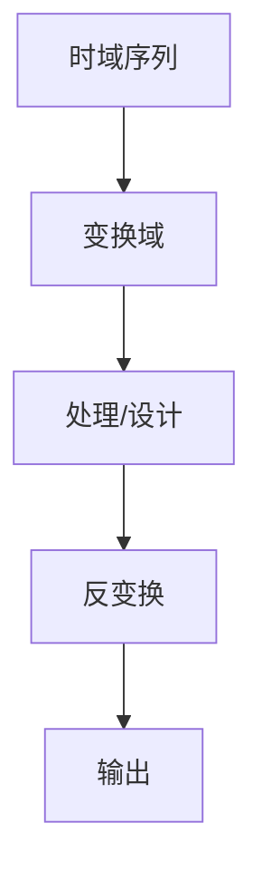

# P28 3-3频率域采样定理

← [[BV127411M7BU-总览]] | ← [[P27-复共轭的DFT和DFT的共轭对称性]] | 下一篇 → [[P29-时域抽取的基2FFT算法原理及运算流图]]

## 视频信息

| 项目 | 内容 |
|------|------|
| 分集 | 3-3频率域采样定理 |
| 章节 | 第 3 章 · 离散傅里叶变换（DFT） |
| 时长 | 3 分 59 秒 |
| 链接 | [B 站 P28](https://www.bilibili.com/video/BV127411M7BU?p=28) |
| 教材 | 西安电子科技大学出版社《数字信号处理》 |
| 内容来源 | 知识点增强（西电教材大纲，非逐字转写） |

## 核心要点

1. **本 P 主题**：3-3频率域采样定理
2. **教材章节**：第 3 章「离散傅里叶变换（DFT）」
3. **考试侧重**：频率域采样定理
4. **笔记层级**：教程级（约 2473 字），含速览、图解、例题 Walkthrough、自测题
5. **学习建议**：先读「3 分钟速览」，手算 1 题后再看视频核对步骤

> 以下内容基于西电版《数字信号处理》教材知识体系撰写，对应 B 站分 P「3-3频率域采样定理」。**非 UP 逐字转写**；不看视频可建立框架，看视频对照「与视频对照表」。

## 本节在系列中的位置

**章节**：第 3 章「离散傅里叶变换（DFT）」· P28/44。

**前置**：建议掌握「3-2-3复共轭的DFT和DFT的共轭对称性」中的公式与定义。

**后续**：「4-1时域抽取的基2FFT算法原理及运算流图」将在此基础上延伸。

## 3 分钟速览

本集讲解「3-3频率域采样定理」，属第 3 章。考点：**频率域采样定理**。

## 零基础导读

数字信号处理的主线是：**用离散数学工具（序列、Z 变换、DFT）分析 LTI 系统，并设计数字滤波器**。本集「3-3频率域采样定理」即便不看视频，也应先弄清：定义是什么、与前后章如何衔接、考试会怎么考。

西电教材证明较完整，本笔记是**提纲+考点+直觉**；期末/考研请回教材补证明与习题。

## 详细讲解

### 1. 频率域采样定理

若 $x(n)$ 为**有限长**序列，长度 $\le N$，则 $N$ 点 DFT 的 $N$ 个频域样本 $X(k)$ **唯一确定** $x(n)$。

$$x(n)=\frac{1}{N}\sum_{k=0}^{N-1}X(k)W_N^{-kn}$$

时域有限 ⇔ 频域可采样重建。

### 2. 对偶关系

| 时域 | 频域 |
|------|------|
| 时域采样定理（奈奎斯特） | 频域采样定理 |
| 带限连续信号 | 有限长离散序列 |
| $f_s>2f_m$ | $N\ge$ 序列长度 |

### 3. 隐含条件

- $x(n)$ 在 $n\ge N$ 为零（或 $N$ 点外视为 0）
- $X(k)$ 以 $N$ 为周期（DFT 自然满足）

### 4. 应用

- 说明为何 $N$ 点 DFT 足以表示 $N$ 点序列
- FIR 滤波：频域设计 $H(k)$ 后 IDFT 得 $h(n)$（长度 $\le N$）
- 频率采样法设计滤波器（第 7 章）

### 5. 典型例题

**例**：证明 $N$ 点 DFT 可逆。

由 IDFT 定义，代入 $X(k)=\sum x(m)W_N^{km}$ 可证 $x(n)$ 恢复（正交性）。

### 6. 考试要点

- 叙述频率域采样定理
- 与时域奈奎斯特定理对偶理解
- 知道 $N$ 点 DFT ↔ $N$ 点时域一一对应
- 为 FIR 频率采样设计铺垫

### 8. 时域-频域对偶

时域采样间隔 $T_s$ 决定频谱周期 $2\pi/T_s$；频域采样间隔 $2\pi/NT_s$ 决定时域周期 $NT_s$。二者对偶是理解 DFT 长度选取、零填充、谱估计的基础，与第 9 讲奈奎斯特采样形成完整闭环。

### 9. 频率域采样定理

$N$ 点频域采样 $X(k)$ **唯一确定** $N$ 点时域序列 $x(n)$（隐含周期为 $N$）。时域采样定理：$f_s>2f_{\max}$；频域对应：采样点数 $N$ 须覆盖时域长度。

### 9. 与内插关系

由 $X(k)$ 经 IDFT 得 $x(n)$，再通过内插公式可恢复 $H(z)$ 的频响采样型实现——频率采样法 FIR 设计的数学基础。

### 本章学习节奏（P28）

建议每周完成 3–4 个分 P：先看笔记建立定义，再跟视频做 2 道题，最后闭卷复述关键性质。第 3 章期末占比高，DFT/FFT 是频域算法核心。

## 图解

## 类比与直觉

DFT 像**对一段乐曲做有限个频谱采样**；循环卷积像**把曲子首尾相接成环再混响**——不补零就会「绕回」产生失真。

## 例题与场景 Walkthrough

**例题思路（本集主题）**

1. **读题**：标出已知是时域序列、系统函数还是频域采样。
2. **选型**：时域卷积 → 第 1 章；Z 域代数 → 第 2 章；频域周期序列 → 第 3–4 章；滤波器指标 → 第 6–7 章。
3. **计算**：按「频率域采样定理」列步骤；卷积用竖线法，反变换用部分分式或留数法，设计用双线性/窗函数。
4. **检验**：因果性看 $h(n)$ 右边；稳定性看极点是否在单位圆内；实序列看 DFT 共轭对称。
5. **对照视频**：UP 本集应演示 1–2 道典型算例，暂停跟算。

## 常见误区

1. **只背公式不做题**：DSP 是计算课，卷积、反变换、FFT 流图必须手算一遍。
2. **忽略 ROC**：同一 $X(z)$ 不同 ROC 对应不同序列，因果/反因果搞反必错。
3. **混淆线性卷积与循环卷积**：要等于线性卷积需补零到 $N \geq N_1+N_2-1$。
4. **数字频率 $\omega$ 与模拟 $\Omega$ 混用**：记住 $\omega=\Omega T$ 与双线性预畸变。

## 与视频对照表

| 视频段落（约） | 预期演示内容 | 笔记对应章节 |
|-------------|------------|------------|
| 开篇 0%–15% | 本集目标、背景、与前后集关系 | 本节位置、3 分钟速览 |
| 前段 15%–40% | 核心概念定义与架构图 | 零基础导读、详细讲解 |
| 中段 40%–70% | 原理展开、对比、政策/代码示例 | 图解、类比、Walkthrough |
| 后段 70%–90% | 案例、问答、易错点 | 常见误区、Checklist |
| 收尾 90%–100% | 总结、延伸资源 | 延伸阅读、自测题 |

> 本集总时长约 **3分59秒**。无官方外挂字幕时，以分 P 标题「3-3频率域采样定理」与上表主题对齐视频画面。

## 动手实践 Checklist

- [ ] 在教材找到对应小节并标出定理/公式
- [ ] 手算 1 道与本集标题相关的例题
- [ ] 画出 1 张概念图（定义→性质→应用）
- [ ] 对照视频核对 1 个推导或流图
- [ ] 将易错点写入错题本（ROC/补零/稳定性）

## 延伸阅读

- 西电《数字信号处理》第 3 章
- Oppenheim《离散时间信号处理》对应章节
- 课程 P27–P29 笔记交叉阅读

## 自测题

1. **本集考点？**  **答**：频率域采样定理。
2. **属于哪章？**  **答**：第 3 章 离散傅里叶变换（DFT）。
3. **与上集关系？**  **答**：在「3-2-3复共轭的DFT和DFT的共轭对称性」基础上扩展。
4. **一道必会手算？**  **答**：见 Walkthrough 步骤 3。
5. **教材哪一节？**  **答**：对照西电《数字信号处理》第 3 章目录同名小节。

## 关键术语

| 术语 | 说明 |
|------|------|
| 离散时间信号 | 在离散时刻取值的序列 x(n) |
| LTI 系统 | 线性时不变系统，DSP 核心研究对象 |
| 奈奎斯特采样定理 | fs>2fmax 可无混叠恢复 |
| 混叠 | fs 不足时高频折叠到低频 |

## 与前后分 P 的衔接

- ← **3-2-3复共轭的DFT和DFT的共轭对称性**（[[P27-复共轭的DFT和DFT的共轭对称性]]）
- → **4-1时域抽取的基2FFT算法原理及运算流图**（[[P29-时域抽取的基2FFT算法原理及运算流图]]）

## 逐字转写
> 状态：待转写。运行 `Tools/transcribe/transcribe.ps1 -Bvid BV127411M7BU -Part 28` 补充。

## 来源说明

- ✅ B 站官方标题、简介、分 P 元数据（`api.bilibili.com`，见 `Tools/BV127411M7BU-full.json`）
- ✅ 分 P 首帧封面（`Tools/bili-fetch/fetch-bilibili.js`）
- ✅ **教程级增强**：含 Mermaid、例题 Walkthrough、自测题（约 2473 字，2026-06-06）
- ⏳ 逐字转写：B 站 API 无外挂字幕轨（内嵌配音字幕）；可选 Whisper/BiliNote 后续补充

## 关键截图

![[../../06-资源附件/video-notes-images/BV127411M7BU-P28-cover.jpg|B站首帧 P28]]
