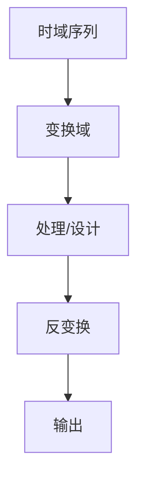

# P29 4-1时域抽取的基2FFT算法原理及运算流图

← [[BV127411M7BU-总览]] | ← [[P28-频率域采样定理]] | 下一篇 → [[P30-频域抽取的基2-FFT算法原理及运算流图]]

## 视频信息

| 项目 | 内容 |
|------|------|
| 分集 | 4-1时域抽取的基2FFT算法原理及运算流图 |
| 章节 | 第 4 章 · 快速傅里叶变换（FFT） |
| 时长 | 14 分 51 秒 |
| 链接 | [B 站 P29](https://www.bilibili.com/video/BV127411M7BU?p=29) |
| 教材 | 西安电子科技大学出版社《数字信号处理》 |
| 内容来源 | 知识点增强（西电教材大纲，非逐字转写） |

## 核心要点

1. **本 P 主题**：4-1时域抽取的基2FFT算法原理及运算流图
2. **教材章节**：第 4 章「快速傅里叶变换（FFT）」
3. **考试侧重**：DIT 基 2 FFT 流图
4. **笔记层级**：教程级（约 2532 字），含速览、图解、例题 Walkthrough、自测题
5. **学习建议**：先读「3 分钟速览」，手算 1 题后再看视频核对步骤

> 以下内容基于西电版《数字信号处理》教材知识体系撰写，对应 B 站分 P「4-1时域抽取的基2FFT算法原理及运算流图」。**非 UP 逐字转写**；不看视频可建立框架，看视频对照「与视频对照表」。

## 本节在系列中的位置

**章节**：第 4 章「快速傅里叶变换（FFT）」· P29/44。

**前置**：建议掌握「3-3频率域采样定理」中的公式与定义。

**后续**：「4-2频域抽取的基2-FFT算法原理及运算流图（修改重传）」将在此基础上延伸。

## 3 分钟速览

本集讲解「4-1时域抽取的基2FFT算法原理及运算流图」，属第 4 章。考点：**DIT 基 2 FFT 流图**。

## 零基础导读

数字信号处理的主线是：**用离散数学工具（序列、Z 变换、DFT）分析 LTI 系统，并设计数字滤波器**。本集「4-1时域抽取的基2FFT算法原理及运算流图」即便不看视频，也应先弄清：定义是什么、与前后章如何衔接、考试会怎么考。

西电教材证明较完整，本笔记是**提纲+考点+直觉**；期末/考研请回教材补证明与习题。

## 详细讲解

### 1. 基 2 FFT 基本思想

$N=2^M$ 时，将 DFT 分解为两个 $N/2$ 点 DFT，**分治**降低复杂度：

$$O(N^2) \to O(N\log_2 N)$$

### 2. 时域抽取（DIT）原理

将 $x(n)$ 按**偶/奇**分为两组：

$$x(2m)=x_1(m),\quad x(2m+1)=x_2(m),\quad m=0,\ldots,N/2-1$$

$$X(k)=X_1(k)+W_N^k X_2(k)$$
$$X(k+N/2)=X_1(k)-W_N^k X_2(k)$$

$k=0,\ldots,N/2-1$。

### 3. 蝶形运算

基本单元：

$$\begin{cases} A'=A+W B \\ B'=A-W B \end{cases}$$

一次蝶形：1 次复乘 + 2 次复加。

### 4. 运算流图

- 输入**位倒序**排列（DIT）
- $\log_2 N$ 级，每级 $N/2$ 个蝶形
- 总复乘约 $\frac{N}{2}\log_2 N$，复加 $N\log_2 N$

### 5. 典型例题

**例**：$N=8$ DIT-FFT，第一级蝶形输入组合？

第一级：$x(0)$ 与 $x(4)$、$x(1)$ 与 $x(5)$、$x(2)$ 与 $x(6)$、$x(3)$ 与 $x(7)$ 各做蝶形（间距 $N/2=4$）。

### 6. 位倒序

$n=6=(110)_2$ → 位倒序 $(011)_2=3$，故 $x(6)$ 在输入排第 3 位（DIT）。

### 7. 考试要点

- 理解 DIT 时域抽取公式
- 会画 $N=8$ 蝶形流图（必考）
- 计算 $N=2^M$ 时复乘次数
- 区分 DIT 与 DIF 输入输出顺序

### 8. $N=8$ 流图默写要点

三级蝶形：间距 $4\to 2\to 1$；旋转因子 $W_8^0,W_8^1,W_8^2$ 逐级出现。输入位倒序（DIT）或输出位倒序（DIF）。考试常考画流图或标旋转因子指数。

### 9. 复杂度对比

直接 DFT：$N^2$ 次复乘；基 2 FFT：约 $\frac{N}{2}\log_2 N$。$N=1024$ 时约 $5\times 10^5$ vs $10^6$，工程实现必选 FFT。

### 本章学习节奏（P29）

建议每周完成 3–4 个分 P：先看笔记建立定义，再跟视频做 2 道题，最后闭卷复述关键性质。第 4 章期末占比高，DFT/FFT 是频域算法核心。

## 图解

## 类比与直觉

FFT 像**分治求和**：把 N 点 DFT 拆成两个 N/2 点，复杂度从 N² 降到 N log N，是工程可算的关键。

## 例题与场景 Walkthrough

**例题思路（本集主题）**

1. **读题**：标出已知是时域序列、系统函数还是频域采样。
2. **选型**：时域卷积 → 第 1 章；Z 域代数 → 第 2 章；频域周期序列 → 第 3–4 章；滤波器指标 → 第 6–7 章。
3. **计算**：按「DIT 基 2 FFT 流图」列步骤；卷积用竖线法，反变换用部分分式或留数法，设计用双线性/窗函数。
4. **检验**：因果性看 $h(n)$ 右边；稳定性看极点是否在单位圆内；实序列看 DFT 共轭对称。
5. **对照视频**：UP 本集应演示 1–2 道典型算例，暂停跟算。

## 常见误区

1. **只背公式不做题**：DSP 是计算课，卷积、反变换、FFT 流图必须手算一遍。
2. **忽略 ROC**：同一 $X(z)$ 不同 ROC 对应不同序列，因果/反因果搞反必错。
3. **混淆线性卷积与循环卷积**：要等于线性卷积需补零到 $N \geq N_1+N_2-1$。
4. **数字频率 $\omega$ 与模拟 $\Omega$ 混用**：记住 $\omega=\Omega T$ 与双线性预畸变。

## 与视频对照表

| 视频段落（约） | 预期演示内容 | 笔记对应章节 |
|-------------|------------|------------|
| 开篇 0%–15% | 本集目标、背景、与前后集关系 | 本节位置、3 分钟速览 |
| 前段 15%–40% | 核心概念定义与架构图 | 零基础导读、详细讲解 |
| 中段 40%–70% | 原理展开、对比、政策/代码示例 | 图解、类比、Walkthrough |
| 后段 70%–90% | 案例、问答、易错点 | 常见误区、Checklist |
| 收尾 90%–100% | 总结、延伸资源 | 延伸阅读、自测题 |

> 本集总时长约 **14分51秒**。无官方外挂字幕时，以分 P 标题「4-1时域抽取的基2FFT算法原理及运算流图」与上表主题对齐视频画面。

## 动手实践 Checklist

- [ ] 在教材找到对应小节并标出定理/公式
- [ ] 手算 1 道与本集标题相关的例题
- [ ] 画出 1 张概念图（定义→性质→应用）
- [ ] 对照视频核对 1 个推导或流图
- [ ] 将易错点写入错题本（ROC/补零/稳定性）

## 延伸阅读

- 西电《数字信号处理》第 4 章
- Oppenheim《离散时间信号处理》对应章节
- 课程 P28–P30 笔记交叉阅读

## 自测题

1. **本集考点？**  **答**：DIT 基 2 FFT 流图。
2. **属于哪章？**  **答**：第 4 章 快速傅里叶变换（FFT）。
3. **与上集关系？**  **答**：在「3-3频率域采样定理」基础上扩展。
4. **一道必会手算？**  **答**：见 Walkthrough 步骤 3。
5. **教材哪一节？**  **答**：对照西电《数字信号处理》第 4 章目录同名小节。

## 关键术语

| 术语 | 说明 |
|------|------|
| 离散时间信号 | 在离散时刻取值的序列 x(n) |
| LTI 系统 | 线性时不变系统，DSP 核心研究对象 |
| 基 2 FFT | O(N log N)，分治分解 DFT |
| 蝶形运算 | FFT 基本计算单元 |

## 与前后分 P 的衔接

- ← **3-3频率域采样定理**（[[P28-频率域采样定理]]）
- → **4-2频域抽取的基2-FFT算法原理及运算流图（修改重传）**（[[P30-频域抽取的基2-FFT算法原理及运算流图]]）

## 来源说明

- ✅ B 站官方标题、简介、分 P 元数据（`api.bilibili.com`，见 `Tools/BV127411M7BU-full.json`）
- ✅ 分 P 首帧封面（`Tools/bili-fetch/fetch-bilibili.js`）
- ✅ **教程级增强**：含 Mermaid、例题 Walkthrough、自测题（约 2532 字，2026-06-06）
- ⏳ 逐字转写：B 站 API 无外挂字幕轨（内嵌配音字幕）；可选 Whisper/BiliNote 后续补充

## 关键截图

![[../../06-资源附件/video-notes-images/BV127411M7BU-P29-cover.jpg|B站首帧 P29]]
