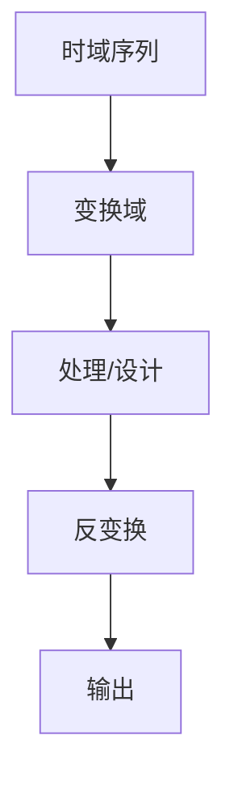

# P32 5-2系统框图及其结构形式

← [[BV127411M7BU-总览]] | ← [[P31-离散时间系统的模拟及基本原理]] | 下一篇 → [[P33-信号流图]]

## 视频信息

| 项目 | 内容 |
|------|------|
| 分集 | 5-2系统框图及其结构形式 |
| 章节 | 第 5 章 · 离散时间系统结构与实现 |
| 时长 | 12 分 43 秒 |
| 链接 | [B 站 P32](https://www.bilibili.com/video/BV127411M7BU?p=32) |
| 教材 | 西安电子科技大学出版社《数字信号处理》 |
| 内容来源 | 知识点增强（西电教材大纲，非逐字转写） |

## 核心要点

1. **本 P 主题**：5-2系统框图及其结构形式
2. **教材章节**：第 5 章「离散时间系统结构与实现」
3. **考试侧重**：直接/级联/并联结构
4. **笔记层级**：教程级（约 2443 字），含速览、图解、例题 Walkthrough、自测题
5. **学习建议**：先读「3 分钟速览」，手算 1 题后再看视频核对步骤

> 以下内容基于西电版《数字信号处理》教材知识体系撰写，对应 B 站分 P「5-2系统框图及其结构形式」。**非 UP 逐字转写**；不看视频可建立框架，看视频对照「与视频对照表」。

## 本节在系列中的位置

**章节**：第 5 章「离散时间系统结构与实现」· P32/44。

**前置**：建议掌握「5-1离散时间系统的模拟及基本原理」中的公式与定义。

**后续**：「5-3信号流图」将在此基础上延伸。

## 3 分钟速览

本集讲解「5-2系统框图及其结构形式」，属第 5 章。考点：**直接/级联/并联结构**。

## 零基础导读

数字信号处理的主线是：**用离散数学工具（序列、Z 变换、DFT）分析 LTI 系统，并设计数字滤波器**。本集「5-2系统框图及其结构形式」即便不看视频，也应先弄清：定义是什么、与前后章如何衔接、考试会怎么考。

西电教材证明较完整，本笔记是**提纲+考点+直觉**；期末/考研请回教材补证明与习题。

## 详细讲解

### 1. 系统框图

用框图表示 $H(z)$：$X(z)\to\boxed{H(z)}\to Y(z)$，内部展开为基本单元。

### 2. 直接型结构

**直接 I 型**：先实现零点（$B(z)$），再极点（$1/A(z)$）。  
**直接 II 型**：共用延时链，**更省延时**（$\max(M,N)$ vs $M+N$）。

$$H(z)=\frac{\sum_{r=0}^{M}b_r z^{-r}}{1+\sum_{k=1}^{N}a_k z^{-k}}$$

### 3. 级联型

$$H(z)=\prod_{i=1}^{K} H_i(z)$$

二阶节 $H_i(z)$ 对应共轭极点对，**数值稳定**好于高阶直接型。

### 4. 并联型

$$H(z)=\sum_{i=1}^{K} H_i(z)$$

适合实现窄带滤波器组；部分分式展开自然得并联。

### 5. 结构选择

| 结构 | 优点 | 缺点 |
|------|------|------|
| 直接 II | 延时少 | 高阶量化敏感 |
| 级联 | 稳定、调参方便 | 阶数高 |
| 并联 | 并行实现 | 设计稍繁 |

### 6. 典型例题

**例**：$H(z)=\frac{1+2z^{-1}+z^{-2}}{1-z^{-1}+0.25z^{-2}}$，化为二阶节。

分子 $(1+z^{-1})^2$，分母 $(1-0.5z^{-1})^2$，可写为两个相同二阶节级联。

### 7. 考试要点

- 会画直接 I/II 型
- 理解级联型用二阶节的原因
- 由 $H(z)$ 选择结构形式
- 比较延时单元数量

### 8. 三种结构选型

- **直接 II**：代码简洁、延时少，适合低阶；
- **级联二阶节**：高阶 IIR 首选，量化鲁棒；
- **并联**：便于并行处理、调谐单频点。

FIR 多用直接型或转置直接型；线性相位 FIR 可折叠对称减少一半乘法。

### 9. 转置结构

转置直接 II 型利于流水线 DSP 实现，同一 $H(z)$ 多种流图——信号流图章节的综合应用。

### 本章学习节奏（P32）

建议每周完成 3–4 个分 P：先看笔记建立定义，再跟视频做 2 道题，最后闭卷复述关键性质。第 5 章期末占比高，滤波器设计要结合指标表与 MATLAB 验证。

## 图解

## 类比与直觉

FFT 像**分治求和**：把 N 点 DFT 拆成两个 N/2 点，复杂度从 N² 降到 N log N，是工程可算的关键。

## 例题与场景 Walkthrough

**例题思路（本集主题）**

1. **读题**：标出已知是时域序列、系统函数还是频域采样。
2. **选型**：时域卷积 → 第 1 章；Z 域代数 → 第 2 章；频域周期序列 → 第 3–4 章；滤波器指标 → 第 6–7 章。
3. **计算**：按「直接/级联/并联结构」列步骤；卷积用竖线法，反变换用部分分式或留数法，设计用双线性/窗函数。
4. **检验**：因果性看 $h(n)$ 右边；稳定性看极点是否在单位圆内；实序列看 DFT 共轭对称。
5. **对照视频**：UP 本集应演示 1–2 道典型算例，暂停跟算。

## 常见误区

1. **只背公式不做题**：DSP 是计算课，卷积、反变换、FFT 流图必须手算一遍。
2. **忽略 ROC**：同一 $X(z)$ 不同 ROC 对应不同序列，因果/反因果搞反必错。
3. **混淆线性卷积与循环卷积**：要等于线性卷积需补零到 $N \geq N_1+N_2-1$。
4. **数字频率 $\omega$ 与模拟 $\Omega$ 混用**：记住 $\omega=\Omega T$ 与双线性预畸变。

## 与视频对照表

| 视频段落（约） | 预期演示内容 | 笔记对应章节 |
|-------------|------------|------------|
| 开篇 0%–15% | 本集目标、背景、与前后集关系 | 本节位置、3 分钟速览 |
| 前段 15%–40% | 核心概念定义与架构图 | 零基础导读、详细讲解 |
| 中段 40%–70% | 原理展开、对比、政策/代码示例 | 图解、类比、Walkthrough |
| 后段 70%–90% | 案例、问答、易错点 | 常见误区、Checklist |
| 收尾 90%–100% | 总结、延伸资源 | 延伸阅读、自测题 |

> 本集总时长约 **12分43秒**。无官方外挂字幕时，以分 P 标题「5-2系统框图及其结构形式」与上表主题对齐视频画面。

## 动手实践 Checklist

- [ ] 在教材找到对应小节并标出定理/公式
- [ ] 手算 1 道与本集标题相关的例题
- [ ] 画出 1 张概念图（定义→性质→应用）
- [ ] 对照视频核对 1 个推导或流图
- [ ] 将易错点写入错题本（ROC/补零/稳定性）

## 延伸阅读

- 西电《数字信号处理》第 5 章
- Oppenheim《离散时间信号处理》对应章节
- 课程 P31–P33 笔记交叉阅读

## 自测题

1. **本集考点？**  **答**：直接/级联/并联结构。
2. **属于哪章？**  **答**：第 5 章 离散时间系统结构与实现。
3. **与上集关系？**  **答**：在「5-1离散时间系统的模拟及基本原理」基础上扩展。
4. **一道必会手算？**  **答**：见 Walkthrough 步骤 3。
5. **教材哪一节？**  **答**：对照西电《数字信号处理》第 5 章目录同名小节。

## 关键术语

| 术语 | 说明 |
|------|------|
| 离散时间信号 | 在离散时刻取值的序列 x(n) |
| LTI 系统 | 线性时不变系统，DSP 核心研究对象 |
| 直接 II 型 | 共用延时链，延时数 max(M,N) |

## 与前后分 P 的衔接

- ← **5-1离散时间系统的模拟及基本原理**（[[P31-离散时间系统的模拟及基本原理]]）
- → **5-3信号流图**（[[P33-信号流图]]）

## 来源说明

- ✅ B 站官方标题、简介、分 P 元数据（`api.bilibili.com`，见 `Tools/BV127411M7BU-full.json`）
- ✅ 分 P 首帧封面（`Tools/bili-fetch/fetch-bilibili.js`）
- ✅ **教程级增强**：含 Mermaid、例题 Walkthrough、自测题（约 2443 字，2026-06-06）
- ⏳ 逐字转写：B 站 API 无外挂字幕轨（内嵌配音字幕）；可选 Whisper/BiliNote 后续补充

## 关键截图

![[../../06-资源附件/video-notes-images/BV127411M7BU-P32-cover.jpg|B站首帧 P32]]
