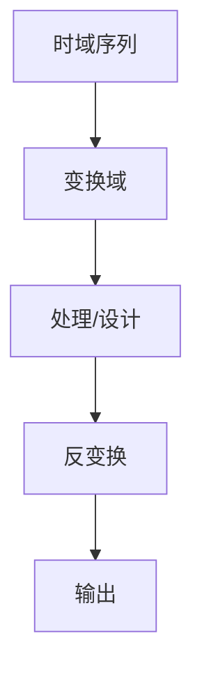

# P34 6-1巴特沃斯模拟低通滤波器设计

← [[BV127411M7BU-总览]] | ← [[P33-信号流图]] | 下一篇 → [[P35-数字滤波器及原理]]

## 视频信息

| 项目 | 内容 |
|------|------|
| 分集 | 6-1巴特沃斯模拟低通滤波器设计 |
| 章节 | 第 6 章 · IIR 数字滤波器设计 |
| 时长 | 14 分 55 秒 |
| 链接 | [B 站 P34](https://www.bilibili.com/video/BV127411M7BU?p=34) |
| 教材 | 西安电子科技大学出版社《数字信号处理》 |
| 内容来源 | 知识点增强（西电教材大纲，非逐字转写） |

## 核心要点

1. **本 P 主题**：6-1巴特沃斯模拟低通滤波器设计
2. **教材章节**：第 6 章「IIR 数字滤波器设计」
3. **考试侧重**：巴特沃斯设计
4. **笔记层级**：教程级（约 2487 字），含速览、图解、例题 Walkthrough、自测题
5. **学习建议**：先读「3 分钟速览」，手算 1 题后再看视频核对步骤

> 以下内容基于西电版《数字信号处理》教材知识体系撰写，对应 B 站分 P「6-1巴特沃斯模拟低通滤波器设计」。**非 UP 逐字转写**；不看视频可建立框架，看视频对照「与视频对照表」。

## 本节在系列中的位置

**章节**：第 6 章「IIR 数字滤波器设计」· P34/44。

**前置**：建议掌握「5-3信号流图」中的公式与定义。

**后续**：「6-2数字滤波器及原理」将在此基础上延伸。

## 3 分钟速览

本集讲解「6-1巴特沃斯模拟低通滤波器设计」，属第 6 章。考点：**巴特沃斯设计**。

## 零基础导读

数字信号处理的主线是：**用离散数学工具（序列、Z 变换、DFT）分析 LTI 系统，并设计数字滤波器**。本集「6-1巴特沃斯模拟低通滤波器设计」即便不看视频，也应先弄清：定义是什么、与前后章如何衔接、考试会怎么考。

西电教材证明较完整，本笔记是**提纲+考点+直觉**；期末/考研请回教材补证明与习题。

## 详细讲解

### 1. 巴特沃斯低通特性

**最大平坦**幅频：通带内无波纹，单调下降。

$$|H_a(j\Omega)|^2=\frac{1}{1+(\Omega/\Omega_c)^{2N}}$$

$N$ 为阶数，$\Omega_c$ 为 3 dB 截止频率。

### 2. 极点分布

$s$ 平面上极点均匀分布在左半平面圆上：

$$s_k=\Omega_c e^{j\pi(2k+N+1)/(2N)},\quad k=0,\ldots,N-1$$

### 3. 设计步骤

1. 给定 $\Omega_p,\Omega_s, A_p, A_s$（通带/阻带指标）
2. 求最小阶数 $N$ 和 $\Omega_c$
3. 查表或公式得 $H_a(s)$ 极点
4. 得 $H_a(s)=\frac{\Omega_c^N}{\prod(s-s_k)}$

### 4. 阶数公式

$$N\ge \frac{\log[(10^{0.1A_s}-1)/(10^{0.1A_p}-1)]}{2\log(\Omega_s/\Omega_p)}$$

### 5. 典型例题

**例**：$N=2$ 巴特沃斯，$\Omega_c=1$，求 $|H_a(j\Omega)|^2$。

$$|H|^2=\frac{1}{1+\Omega^4}$$

极点 $s=\pm e^{\pm j3\pi/4}$（在 $s$ 平面左半圆）。

### 6. 考试要点

- 掌握巴特沃斯幅平方函数
- 会求极点位置（低阶）
- 理解「最大平坦」含义
- 由指标求阶数 $N$

### 8. 巴特沃斯设计算例框架

给定 $\Omega_p,\Omega_s, A_p, A_s$：1. 用阶数公式求 $N$；2. 查表或算 $\Omega_c$；3. 写 $H_a(s)=\frac{\Omega_c^N}{\prod(s-s_k)}$；4. 双线性+预畸变得 $H(z)$。$N=2$ 时 $|H|^2=1/(1+(\Omega/\Omega_c)^4)$ 应能默写。

### 9. 与切比雪夫对比

切比雪夫通带有波纹但过渡带更陡；巴特沃斯通带最平坦。西电考题以巴特沃斯为主，理解「最大平坦」物理含义即可。

### 本章学习节奏（P34）

建议每周完成 3–4 个分 P：先看笔记建立定义，再跟视频做 2 道题，最后闭卷复述关键性质。第 6 章期末占比高，滤波器设计要结合指标表与 MATLAB 验证。

## 图解

## 类比与直觉

IIR/FIR 滤波器设计像**调 EQ**：IIR 用反馈（省阶数但可能不稳），FIR 无反馈（稳定且可线性相位但阶数高）。

## 例题与场景 Walkthrough

**例题思路（本集主题）**

1. **读题**：标出已知是时域序列、系统函数还是频域采样。
2. **选型**：时域卷积 → 第 1 章；Z 域代数 → 第 2 章；频域周期序列 → 第 3–4 章；滤波器指标 → 第 6–7 章。
3. **计算**：按「巴特沃斯设计」列步骤；卷积用竖线法，反变换用部分分式或留数法，设计用双线性/窗函数。
4. **检验**：因果性看 $h(n)$ 右边；稳定性看极点是否在单位圆内；实序列看 DFT 共轭对称。
5. **对照视频**：UP 本集应演示 1–2 道典型算例，暂停跟算。

## 常见误区

1. **只背公式不做题**：DSP 是计算课，卷积、反变换、FFT 流图必须手算一遍。
2. **忽略 ROC**：同一 $X(z)$ 不同 ROC 对应不同序列，因果/反因果搞反必错。
3. **混淆线性卷积与循环卷积**：要等于线性卷积需补零到 $N \geq N_1+N_2-1$。
4. **数字频率 $\omega$ 与模拟 $\Omega$ 混用**：记住 $\omega=\Omega T$ 与双线性预畸变。

## 与视频对照表

| 视频段落（约） | 预期演示内容 | 笔记对应章节 |
|-------------|------------|------------|
| 开篇 0%–15% | 本集目标、背景、与前后集关系 | 本节位置、3 分钟速览 |
| 前段 15%–40% | 核心概念定义与架构图 | 零基础导读、详细讲解 |
| 中段 40%–70% | 原理展开、对比、政策/代码示例 | 图解、类比、Walkthrough |
| 后段 70%–90% | 案例、问答、易错点 | 常见误区、Checklist |
| 收尾 90%–100% | 总结、延伸资源 | 延伸阅读、自测题 |

> 本集总时长约 **14分55秒**。无官方外挂字幕时，以分 P 标题「6-1巴特沃斯模拟低通滤波器设计」与上表主题对齐视频画面。

## 动手实践 Checklist

- [ ] 在教材找到对应小节并标出定理/公式
- [ ] 手算 1 道与本集标题相关的例题
- [ ] 画出 1 张概念图（定义→性质→应用）
- [ ] 对照视频核对 1 个推导或流图
- [ ] 将易错点写入错题本（ROC/补零/稳定性）

## 延伸阅读

- 西电《数字信号处理》第 6 章
- Oppenheim《离散时间信号处理》对应章节
- 课程 P33–P35 笔记交叉阅读

## 自测题

1. **本集考点？**  **答**：巴特沃斯设计。
2. **属于哪章？**  **答**：第 6 章 IIR 数字滤波器设计。
3. **与上集关系？**  **答**：在「5-3信号流图」基础上扩展。
4. **一道必会手算？**  **答**：见 Walkthrough 步骤 3。
5. **教材哪一节？**  **答**：对照西电《数字信号处理》第 6 章目录同名小节。

## 关键术语

| 术语 | 说明 |
|------|------|
| 离散时间信号 | 在离散时刻取值的序列 x(n) |
| LTI 系统 | 线性时不变系统，DSP 核心研究对象 |
| 差分方程 | 离散系统数学模型 |

## 与前后分 P 的衔接

- ← **5-3信号流图**（[[P33-信号流图]]）
- → **6-2数字滤波器及原理**（[[P35-数字滤波器及原理]]）

## 来源说明

- ✅ B 站官方标题、简介、分 P 元数据（`api.bilibili.com`，见 `Tools/BV127411M7BU-full.json`）
- ✅ 分 P 首帧封面（`Tools/bili-fetch/fetch-bilibili.js`）
- ✅ **教程级增强**：含 Mermaid、例题 Walkthrough、自测题（约 2487 字，2026-06-06）
- ⏳ 逐字转写：B 站 API 无外挂字幕轨（内嵌配音字幕）；可选 Whisper/BiliNote 后续补充

## 关键截图

![[../../06-资源附件/video-notes-images/BV127411M7BU-P34-cover.jpg|B站首帧 P34]]
