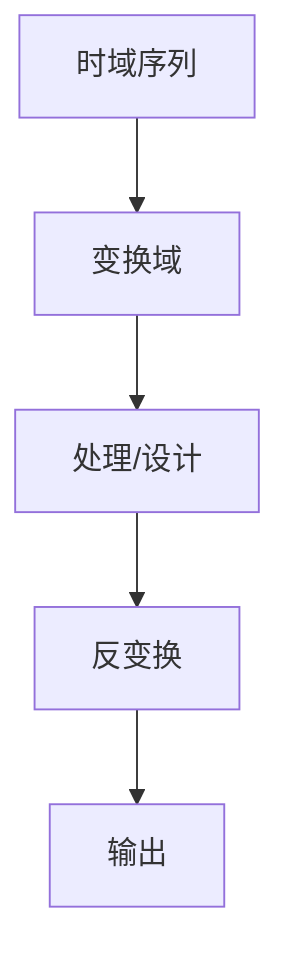

# P36 6-3脉冲响应不变法设计IIR数字滤波器

← [[BV127411M7BU-总览]] | ← [[P35-数字滤波器及原理]] | 下一篇 → [[P37-双线性变换法设计IIR滤波器]]

## 视频信息

| 项目 | 内容 |
|------|------|
| 分集 | 6-3脉冲响应不变法设计IIR数字滤波器 |
| 章节 | 第 6 章 · IIR 数字滤波器设计 |
| 时长 | 15 分 44 秒 |
| 链接 | [B 站 P36](https://www.bilibili.com/video/BV127411M7BU?p=36) |
| 教材 | 西安电子科技大学出版社《数字信号处理》 |
| 内容来源 | 知识点增强（西电教材大纲，非逐字转写） |

## 核心要点

1. **本 P 主题**：6-3脉冲响应不变法设计IIR数字滤波器
2. **教材章节**：第 6 章「IIR 数字滤波器设计」
3. **考试侧重**：脉冲响应不变法
4. **笔记层级**：教程级（约 2499 字），含速览、图解、例题 Walkthrough、自测题
5. **学习建议**：先读「3 分钟速览」，手算 1 题后再看视频核对步骤

> 以下内容基于西电版《数字信号处理》教材知识体系撰写，对应 B 站分 P「6-3脉冲响应不变法设计IIR数字滤波器」。**非 UP 逐字转写**；不看视频可建立框架，看视频对照「与视频对照表」。

## 本节在系列中的位置

**章节**：第 6 章「IIR 数字滤波器设计」· P36/44。

**前置**：建议掌握「6-2数字滤波器及原理」中的公式与定义。

**后续**：「双线性变换法设计IIR滤波器」将在此基础上延伸。

## 3 分钟速览

本集讲解「6-3脉冲响应不变法设计IIR数字滤波器」，属第 6 章。考点：**脉冲响应不变法**。

## 零基础导读

数字信号处理的主线是：**用离散数学工具（序列、Z 变换、DFT）分析 LTI 系统，并设计数字滤波器**。本集「6-3脉冲响应不变法设计IIR数字滤波器」即便不看视频，也应先弄清：定义是什么、与前后章如何衔接、考试会怎么考。

西电教材证明较完整，本笔记是**提纲+考点+直觉**；期末/考研请回教材补证明与习题。

## 详细讲解

### 1. 脉冲响应不变法原理

$$h(n)=T\,h_a(nT)$$

直接对模拟冲激响应 $h_a(t)$ **采样**得数字 $h(n)$。

$$H(z)=\sum_{n=0}^{\infty}h(n)z^{-n}$$

### 2. $s$ 到 $z$ 映射

$$z=e^{sT}$$

左半 $s$ 平面 → 单位圆内（多值映射，**混叠**）。

### 3. 混叠问题

模拟滤波器阻带不完全衰减时，采样导致**频谱重叠**，数字滤波器阻带变差。

**适用**：带限模拟原型，或阻带衰减足够大。

### 4. 极点映射

$$s=s_k \Rightarrow z_k=e^{s_k T}$$

模拟极点直接指数映射到 $z$ 平面。

### 5. 典型例题

**例**：$H_a(s)=\frac{1}{s+a}$，用脉冲不变法，$T=1$。

$h_a(t)=e^{-at}u(t)$，$h(n)=e^{-an}u(n)$，$H(z)=\frac{1}{1-e^{-a}z^{-1}}$。

### 6. 考试要点

- 掌握 $h(n)=Th_a(nT)$ 关系
- 理解混叠成因与限制
- 会映射一阶、二阶模拟极点
- 与双线性法对比（频率轴扭曲）

### 8. $s$ 平面到 $z$ 平面映射

竖轴 $j\Omega$ 映射为 $|z|=1$ 单位圆；左半平面映射到单位圆内，但呈**梳状重叠**（$\Omega$ 与 $\Omega+2\pi/T$ 折叠到同一点）。故仅当原型**严格带限**时脉冲不变才可靠，否则高频阻带能量混叠回通带。

### 9. 脉冲不变完整例题

$H_a(s)=\frac{\Omega_c}{s+\Omega_c}$（一阶低通），$T=1/T_s$：$h(n)=\Omega_c e^{-\Omega_c nT}u(n)$，$H(z)=\frac{\Omega_c}{1-e^{-\Omega_c T}z^{-1}}$。注意增益 $T$ 因子与频率尺度。

### 9. 混叠抑制

原型阻带衰减 $>60$ dB 时常可忽略混叠；否则改用双线性变换。带通/高通设计较少单独用脉冲不变。

### 本章学习节奏（P36）

建议每周完成 3–4 个分 P：先看笔记建立定义，再跟视频做 2 道题，最后闭卷复述关键性质。第 6 章期末占比高，滤波器设计要结合指标表与 MATLAB 验证。

## 图解

## 类比与直觉

IIR/FIR 滤波器设计像**调 EQ**：IIR 用反馈（省阶数但可能不稳），FIR 无反馈（稳定且可线性相位但阶数高）。

## 例题与场景 Walkthrough

**例题思路（本集主题）**

1. **读题**：标出已知是时域序列、系统函数还是频域采样。
2. **选型**：时域卷积 → 第 1 章；Z 域代数 → 第 2 章；频域周期序列 → 第 3–4 章；滤波器指标 → 第 6–7 章。
3. **计算**：按「脉冲响应不变法」列步骤；卷积用竖线法，反变换用部分分式或留数法，设计用双线性/窗函数。
4. **检验**：因果性看 $h(n)$ 右边；稳定性看极点是否在单位圆内；实序列看 DFT 共轭对称。
5. **对照视频**：UP 本集应演示 1–2 道典型算例，暂停跟算。

## 常见误区

1. **只背公式不做题**：DSP 是计算课，卷积、反变换、FFT 流图必须手算一遍。
2. **忽略 ROC**：同一 $X(z)$ 不同 ROC 对应不同序列，因果/反因果搞反必错。
3. **混淆线性卷积与循环卷积**：要等于线性卷积需补零到 $N \geq N_1+N_2-1$。
4. **数字频率 $\omega$ 与模拟 $\Omega$ 混用**：记住 $\omega=\Omega T$ 与双线性预畸变。

## 与视频对照表

| 视频段落（约） | 预期演示内容 | 笔记对应章节 |
|-------------|------------|------------|
| 开篇 0%–15% | 本集目标、背景、与前后集关系 | 本节位置、3 分钟速览 |
| 前段 15%–40% | 核心概念定义与架构图 | 零基础导读、详细讲解 |
| 中段 40%–70% | 原理展开、对比、政策/代码示例 | 图解、类比、Walkthrough |
| 后段 70%–90% | 案例、问答、易错点 | 常见误区、Checklist |
| 收尾 90%–100% | 总结、延伸资源 | 延伸阅读、自测题 |

> 本集总时长约 **15分44秒**。无官方外挂字幕时，以分 P 标题「6-3脉冲响应不变法设计IIR数字滤波器」与上表主题对齐视频画面。

## 动手实践 Checklist

- [ ] 在教材找到对应小节并标出定理/公式
- [ ] 手算 1 道与本集标题相关的例题
- [ ] 画出 1 张概念图（定义→性质→应用）
- [ ] 对照视频核对 1 个推导或流图
- [ ] 将易错点写入错题本（ROC/补零/稳定性）

## 延伸阅读

- 西电《数字信号处理》第 6 章
- Oppenheim《离散时间信号处理》对应章节
- 课程 P35–P37 笔记交叉阅读

## 自测题

1. **本集考点？**  **答**：脉冲响应不变法。
2. **属于哪章？**  **答**：第 6 章 IIR 数字滤波器设计。
3. **与上集关系？**  **答**：在「6-2数字滤波器及原理」基础上扩展。
4. **一道必会手算？**  **答**：见 Walkthrough 步骤 3。
5. **教材哪一节？**  **答**：对照西电《数字信号处理》第 6 章目录同名小节。

## 关键术语

| 术语 | 说明 |
|------|------|
| 离散时间信号 | 在离散时刻取值的序列 x(n) |
| LTI 系统 | 线性时不变系统，DSP 核心研究对象 |
| IIR | 含反馈，有理 H(z) |
| FIR | 无反馈，仅零点 |

## 与前后分 P 的衔接

- ← **6-2数字滤波器及原理**（[[P35-数字滤波器及原理]]）
- → **双线性变换法设计IIR滤波器**（[[P37-双线性变换法设计IIR滤波器]]）

## 来源说明

- ✅ B 站官方标题、简介、分 P 元数据（`api.bilibili.com`，见 `Tools/BV127411M7BU-full.json`）
- ✅ 分 P 首帧封面（`Tools/bili-fetch/fetch-bilibili.js`）
- ✅ **教程级增强**：含 Mermaid、例题 Walkthrough、自测题（约 2499 字，2026-06-06）
- ⏳ 逐字转写：B 站 API 无外挂字幕轨（内嵌配音字幕）；可选 Whisper/BiliNote 后续补充

## 关键截图

![[../../06-资源附件/video-notes-images/BV127411M7BU-P36-cover.jpg|B站首帧 P36]]
