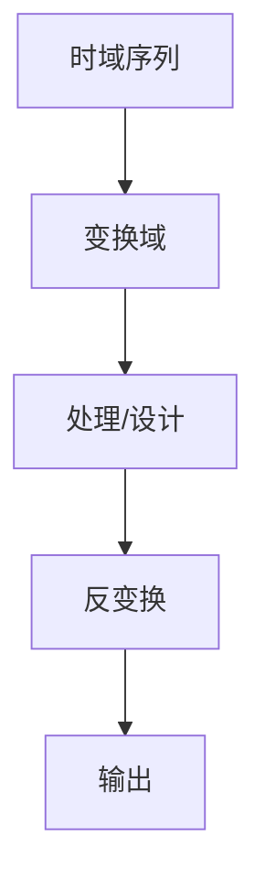

# P44 7-4频率采样法设计FIR滤波器

← [[BV127411M7BU-总览]] | ← [[P43-窗函数法设计FIR滤波器改]]

## 视频信息

| 项目 | 内容 |
|------|------|
| 分集 | 7-4频率采样法设计FIR滤波器 |
| 章节 | 第 7 章 · FIR 数字滤波器设计 |
| 时长 | 17 分 28 秒 |
| 链接 | [B 站 P44](https://www.bilibili.com/video/BV127411M7BU?p=44) |
| 教材 | 西安电子科技大学出版社《数字信号处理》 |
| 内容来源 | 知识点增强（西电教材大纲，非逐字转写） |

## 核心要点

1. **本 P 主题**：7-4频率采样法设计FIR滤波器
2. **教材章节**：第 7 章「FIR 数字滤波器设计」
3. **考试侧重**：频率采样法
4. **笔记层级**：教程级（约 2533 字），含速览、图解、例题 Walkthrough、自测题
5. **学习建议**：先读「3 分钟速览」，手算 1 题后再看视频核对步骤

> 以下内容基于西电版《数字信号处理》教材知识体系撰写，对应 B 站分 P「7-4频率采样法设计FIR滤波器」。**非 UP 逐字转写**；不看视频可建立框架，看视频对照「与视频对照表」。

## 本节在系列中的位置

**章节**：第 7 章「FIR 数字滤波器设计」· P44/44。

**前置**：建议掌握「7-3窗函数法设计FIR滤波器改」中的公式与定义。

**第 7 章终点**：建议做一套历年 DSP 考研真题。

## 3 分钟速览

本集讲解「7-4频率采样法设计FIR滤波器」，属第 7 章。考点：**频率采样法**。

## 零基础导读

数字信号处理的主线是：**用离散数学工具（序列、Z 变换、DFT）分析 LTI 系统，并设计数字滤波器**。本集「7-4频率采样法设计FIR滤波器」即便不看视频，也应先弄清：定义是什么、与前后章如何衔接、考试会怎么考。

西电教材证明较完整，本笔记是**提纲+考点+直觉**；期末/考研请回教材补证明与习题。

## 详细讲解

### 1. 频率采样法原理

在 $\omega_k=2\pi k/N$ 指定理想 $|H_d(k)|$ 和 $\angle H_d(k)$，IDFT 得 $h(n)$：

$$h(n)=\frac{1}{N}\sum_{k=0}^{N-1}H_d(k)W_N^{-kn}$$

### 2. 内插恢复

$$H(z)=\sum_{n=0}^{N-1}h(n)z^{-n}$$

或

$$H(z)=\frac{1-z^{-N}}{N}\sum_{k=0}^{N-1}\frac{H_d(k)}{1-W_N^k z^{-1}}$$

（内插型结构）

### 3. 过渡带优化

理想 $|H_d(k)|$ 在通阻带边界加**过渡点**（如 0.5、0.1095），改善波纹。

### 4. 线性相位约束

$H_d(k)$ 需满足与 $h(n)$ 实对称一致的**相位约束**，否则 $h(n)$ 复系数或非线性相位。

对 Type I：$H_d(N-k)=H_d^*(k)$ 等。

### 5. 与窗函数法对比

| | 窗函数法 | 频率采样 |
|--|---------|---------|
| 设计域 | 时域截断 | 频域采样 |
| 控制 | 过渡带靠 $N$ 和窗 | 直接指定 $H(k)$ |
| 实现 | 直接型 | 可内插结构 |

### 6. 典型例题

**例**：$N=16$ 低通，通带 $k=0,1,2,3$，阻带 $k=8,\ldots,15$ 为 0，中间过渡点设 0.5，求 $h(n)$。

对 $H_d(k)$ 做 16 点 IDFT（需满足线性相位对称）。

### 7. 考试要点

- 频率采样法步骤
- 过渡点优化思想
- 线性相位对 $H_d(k)$ 的约束
- 与窗函数法、IIR 设计对比

### 8. 频率采样设计流程

1. 定 $N$ 与理想 $|H_d(k)|$；2. 设过渡带采样点（如 0.5、0.1095）抑波纹；3. 补相位使 $H_d(k)$ 满足线性相位对称；4. IDFT 得 $h(n)$；5. 仿真 $|H(e^{j\omega})|$ 验证。

### 9. 内插型实现

$H(z)=\frac{1-z^{-N}}{N}\sum_k\frac{H_d(k)}{1-W_N^k z^{-1}}$ 每频点一支路，适合 FPGA 并行；与直接型 FIR 等价但结构不同。

### 本章学习节奏（P44）

建议每周完成 3–4 个分 P：先看笔记建立定义，再跟视频做 2 道题，最后闭卷复述关键性质。第 7 章期末占比高，滤波器设计要结合指标表与 MATLAB 验证。

## 图解

## 类比与直觉

IIR/FIR 滤波器设计像**调 EQ**：IIR 用反馈（省阶数但可能不稳），FIR 无反馈（稳定且可线性相位但阶数高）。

## 例题与场景 Walkthrough

**例题思路（本集主题）**

1. **读题**：标出已知是时域序列、系统函数还是频域采样。
2. **选型**：时域卷积 → 第 1 章；Z 域代数 → 第 2 章；频域周期序列 → 第 3–4 章；滤波器指标 → 第 6–7 章。
3. **计算**：按「频率采样法」列步骤；卷积用竖线法，反变换用部分分式或留数法，设计用双线性/窗函数。
4. **检验**：因果性看 $h(n)$ 右边；稳定性看极点是否在单位圆内；实序列看 DFT 共轭对称。
5. **对照视频**：UP 本集应演示 1–2 道典型算例，暂停跟算。

## 常见误区

1. **只背公式不做题**：DSP 是计算课，卷积、反变换、FFT 流图必须手算一遍。
2. **忽略 ROC**：同一 $X(z)$ 不同 ROC 对应不同序列，因果/反因果搞反必错。
3. **混淆线性卷积与循环卷积**：要等于线性卷积需补零到 $N \geq N_1+N_2-1$。
4. **数字频率 $\omega$ 与模拟 $\Omega$ 混用**：记住 $\omega=\Omega T$ 与双线性预畸变。

## 与视频对照表

| 视频段落（约） | 预期演示内容 | 笔记对应章节 |
|-------------|------------|------------|
| 开篇 0%–15% | 本集目标、背景、与前后集关系 | 本节位置、3 分钟速览 |
| 前段 15%–40% | 核心概念定义与架构图 | 零基础导读、详细讲解 |
| 中段 40%–70% | 原理展开、对比、政策/代码示例 | 图解、类比、Walkthrough |
| 后段 70%–90% | 案例、问答、易错点 | 常见误区、Checklist |
| 收尾 90%–100% | 总结、延伸资源 | 延伸阅读、自测题 |

> 本集总时长约 **17分28秒**。无官方外挂字幕时，以分 P 标题「7-4频率采样法设计FIR滤波器」与上表主题对齐视频画面。

## 动手实践 Checklist

- [ ] 在教材找到对应小节并标出定理/公式
- [ ] 手算 1 道与本集标题相关的例题
- [ ] 画出 1 张概念图（定义→性质→应用）
- [ ] 对照视频核对 1 个推导或流图
- [ ] 将易错点写入错题本（ROC/补零/稳定性）

## 延伸阅读

- 西电《数字信号处理》第 7 章
- Oppenheim《离散时间信号处理》对应章节
- 课程 P43–P44 笔记交叉阅读

## 自测题

1. **本集考点？**  **答**：频率采样法。
2. **属于哪章？**  **答**：第 7 章 FIR 数字滤波器设计。
3. **与上集关系？**  **答**：在「7-3窗函数法设计FIR滤波器改」基础上扩展。
4. **一道必会手算？**  **答**：见 Walkthrough 步骤 3。
5. **教材哪一节？**  **答**：对照西电《数字信号处理》第 7 章目录同名小节。

## 关键术语

| 术语 | 说明 |
|------|------|
| 离散时间信号 | 在离散时刻取值的序列 x(n) |
| LTI 系统 | 线性时不变系统，DSP 核心研究对象 |
| 奈奎斯特采样定理 | fs>2fmax 可无混叠恢复 |
| 混叠 | fs 不足时高频折叠到低频 |

## 与前后分 P 的衔接

- ← **7-3窗函数法设计FIR滤波器改**（[[P43-窗函数法设计FIR滤波器改]]）
- → 课程终点

## 逐字转写
> 状态：待转写。运行 `Tools/transcribe/transcribe.ps1 -Bvid BV127411M7BU -Part 44` 补充。

## 来源说明

- ✅ B 站官方标题、简介、分 P 元数据（`api.bilibili.com`，见 `Tools/BV127411M7BU-full.json`）
- ✅ 分 P 首帧封面（`Tools/bili-fetch/fetch-bilibili.js`）
- ✅ **教程级增强**：含 Mermaid、例题 Walkthrough、自测题（约 2533 字，2026-06-06）
- ⏳ 逐字转写：B 站 API 无外挂字幕轨（内嵌配音字幕）；可选 Whisper/BiliNote 后续补充

## 关键截图

![[../../06-资源附件/video-notes-images/BV127411M7BU-P44-cover.jpg|B站首帧 P44]]
