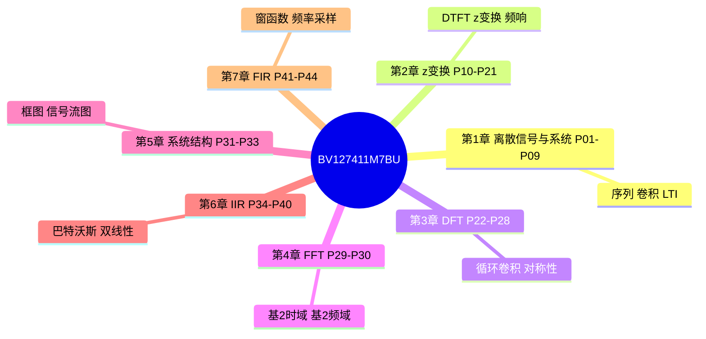

# DSP 数字信号处理 · 思维导图

← [[BV127411M7BU-总览]]



## 分 P 详图

```mermaid
mindmap
  root((DSP数字信号处理（超浓缩版）))
    P01 1-1绪论 8m50秒
      [[P01-绪论]]
    P02 1-2序列的表示 7m49秒
      [[P02-序列的表示]]
    P03 1-3常用典型序列及基本运算 12m42秒
      [[P03-常用典型序列及基本运算]]
    P04 序列卷积和 17m13秒
      [[P04-序列卷积和]]
    P05 1-4系统的分类 13m37秒
      [[P05-系统的分类]]
    P06 1-5线性时不变系统 16m22秒
      [[P06-线性时不变系统]]
    P07 1-6系统的因果性和稳定性 9m56秒
      [[P07-系统的因果性和稳定性]]
    P08 1-7离散LTI系统的数学模型 11m16秒
      [[P08-离散LTI系统的数学模型]]
    P09 1-8模拟信号数字化 10m38秒
      [[P09-模拟信号数字化]]
    P10 2-1序列傅里叶变换 12m02秒
      [[P10-序列傅里叶变换]]
    P11 2-2傅里叶变换的性质 10m05秒
      [[P11-傅里叶变换的性质]]
    P12 2-3-1z变换的定义 8m54秒
      [[P12-z变换的定义]]
    P13 2-3-2z变换的收敛域 10m04秒
      [[P13-z变换的收敛域]]
    P14 2-6z变换解差分方程 15m03秒
      [[P14-z变换解差分方程]]
    P15 2-4 z变换的性质 14m23秒
      [[P15-z变换的性质]]
    P16 2-5-1z反变换1观察法 14m37秒
      [[P16-z反变换1观察法]]
    P17 2-5-2z��变换2留数法 10m52秒
      [[P17-z反变换2留数法]]
    P18 2-5-3Z反变换 14m35秒
      [[P18-Z反变换]]
    P19 2-6系统函数的极点分布与系统因果稳定性 13m46秒
      [[P19-系统函数的极点分布与系统因果稳定性]]
    P20 2-7z变换与系统频响 15m53秒
      [[P20-z变换与系统频响]]
    P21 2-8频响特性的几何确定法 10m54秒
      [[P21-频响特性的几何确定法]]
    P22 3-1-1离散傅里叶变换的定义 14m27秒
      [[P22-离散傅里叶变换的定义]]
    P23 3-1-2周期延拓 14m02秒
      [[P23-周期延拓]]
    P24 3-1-3周期序列的傅里叶级数系数及旋转 10m03秒
      [[P24-周期序列的傅里叶级数系数及旋转因子计算技巧]]
    P25 3-2-1离散傅里叶变换线性特性及循环移 14m22秒
      [[P25-离散傅里叶变换线性特性及循环移位特性]]
    P26 3-2-2循环卷积 12m50秒
      [[P26-循环卷积]]
    P27 3-2-3复共轭的DFT和DFT的共轭对 12m07秒
      [[P27-复共轭的DFT和DFT的共轭对称性]]
    P28 3-3频率域采样定理 3m59秒
      [[P28-频率域采样定理]]
    P29 4-1时域抽取的基2FFT算法原理及运算 14m51秒
      [[P29-时域抽取的基2FFT算法原理及运算流图]]
    P30 4-2频域抽取的基2-FFT算法原理及运 13m23秒
      [[P30-频域抽取的基2-FFT算法原理及运算流图]]
    P31 5-1离散时间系统的模拟及基本原理 16m32秒
      [[P31-离散时间系统的模拟及基本原理]]
    P32 5-2系统框图及其结构形式 12m43秒
      [[P32-系统框图及其结构形式]]
    P33 5-3信号流图 13m32秒
      [[P33-信号流图]]
    P34 6-1巴特沃斯模拟低通滤波器设计 14m55秒
      [[P34-巴特沃斯模拟低通滤波器设计]]
    P35 6-2数字滤波器及原理 12m55秒
      [[P35-数字滤波器及原理]]
    P36 6-3脉冲响应不变法设计IIR数字滤波器 15m44秒
      [[P36-脉冲响应不变法设计IIR数字滤波器]]
    P37 双线性变换法设计IIR滤波器 9m09秒
      [[P37-双线性变换法设计IIR滤波器]]
    P38 6-5频率变换法设计高通滤波器 11m49秒
      [[P38-频率变换法设计高通滤波器]]
    P39 6-6频率变换法设计带通滤波器 10m48秒
      [[P39-频率变换法设计带通滤波器]]
    P40 6-7IIR滤波器的基本网络结构 14m33秒
      [[P40-IIR滤波器的基本网络结构]]
    P41 7-1FIR滤波器的基本原理 10m50秒
      [[P41-FIR滤波器的基本原理]]
    P42 7-2FIR滤波器的频响特性与分类 7m38秒
      [[P42-FIR滤波器的频响特性与分类]]
    P43 7-3窗函数法设计FIR滤波器改 17m08秒
      [[P43-窗函数法设计FIR滤波器改]]
    P44 7-4频率采样法设计FIR滤波器 17m28秒
      [[P44-频率采样法设计FIR滤波器]]
```

> 时长来自 B 站 API（2026-06-06 抓取）。子节点基于官方简介 + 分 P 标题整理；首帧封面已下载至 `06-资源附件/video-notes-images/`。Whisper 转写后可继续扩展子节点。
