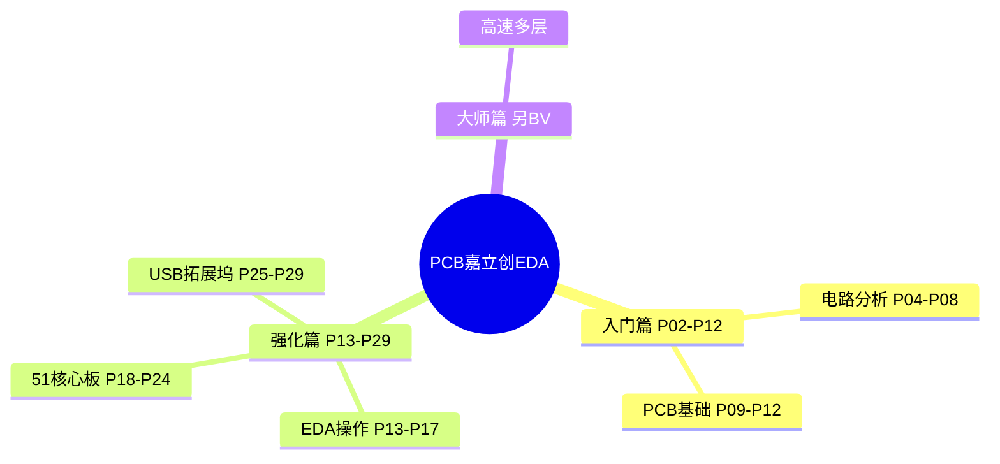
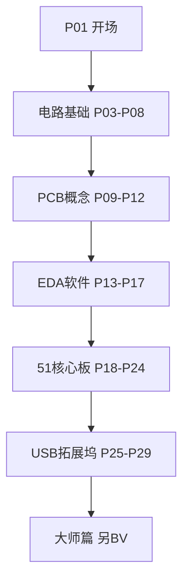

# 【教程】零基础入门PCB设计-国一学长带你学嘉立创EDA专业版 全程保姆级教学 中文字幕（大师篇已更新）

> **Expert电子实验室（国一学长）** 嘉立创 EDA 专业版 PCB 保姆级教程，本 BV 含 **入门篇 + 强化篇** 共 **29** 分 P（约 7h 20m 44s / 440分44秒）。
>
> 各分 P 笔记已升级为 **教程级**（约 2500–3500 字/篇，含 Mermaid、Walkthrough、自测题，2026-06-06）。**大师篇**为独立视频合集，见下文链接。

## 视频简介（B 站原文）

零基础入门PCB设计教程保姆级教学，期待你的一键三连！
【入门篇】【强化篇】【大师篇】已经全部上传
课程资料获取地址：https://pan.quark.cn/s/05650fad6466

## 课程资料

📦 **[夸克网盘课程资料](https://pan.quark.cn/s/05650fad6466)**（原理图工程、封装库、BOM 等）

## 大师篇

本 BV（BV1At421h7Ui）覆盖**入门篇 P02–P12** 与 **强化篇 P13–P29**。**大师篇**（高速、多层板等进阶内容）为 UP 主**独立上传**的合集，推荐学完本 BV 后继续：

- 🔗 [大师篇合集](https://www.bilibili.com/video/BV1m441157T7)（嘉立创EDA 教程关联推荐，标题含「大师篇」）
- 在 B 站搜索 UP **Expert电子实验室** → 视频列表 →「大师篇」

## 视频数据

| 字段 | 内容 |
|------|------|
| BV 号 | BV1At421h7Ui |
| UP 主 | Expert电子实验室 |
| 总时长 | 7h 20m 44s（26444 秒） |
| 分 P 数 | 29 |
| 播放量 | 3,531,188（抓取时） |
| 收藏 | 178,400 |
| 标签 | 视频教程、入门、学习、教程、保姆级教学、零基础入门、PCB、PCB设计、立创EDA专业版 |
| 字幕状态 | 无外挂字幕轨（视频为内嵌配音字幕，API 返回空列表） |

## 思维导图

## 分 P 索引

| 分 P | B 站分集标题 | 时长 | 字数 | 笔记 |
|------|-------------|------|------|------|
| P01 | 开场白：一起来学PCB！ | 1m40s | ~2542 | [[P01-开场白-一起来学PCB！]] |
| P02 | 课程介绍 | 5m59s | ~2603 | [[P02-课程介绍]] |
| P03 | PCB技术发展历程 | 10m02s | ~2688 | [[P03-PCB技术发展历程]] |
| P04 | 电路分析基础-基本元件（电阻电容电感） | 19m30s | ~2847 | [[P04-电路分析基础-基本元件电阻电容电感]] |
| P05 | 电路分析基础-基本元件（二极管三极管场效应管） | 20m08s | ~2796 | [[P05-电路分析基础-基本元件二极管三极管场效应管]] |
| P06 | 电路分析基础-元件数据手册 | 27m28s | ~2782 | [[P06-电路分析基础-元件数据手册]] |
| P07 | 电路分析基础-电路定理 | 25m58s | ~2636 | [[P07-电路分析基础-电路定理]] |
| P08 | 电路分析基础-读懂原理图 | 18m52s | ~2653 | [[P08-电路分析基础-读懂原理图]] |
| P09 | PCB设计基础-PCB结构与组成 | 8m55s | ~2766 | [[P09-PCB设计基础-PCB结构与组成]] |
| P10 | PCB设计基础-PCB叠层结构 | 5m55s | ~2692 | [[P10-PCB设计基础-PCB叠层结构]] |
| P11 | PCB设计基础-元件符号与封装 | 3m57s | ~2677 | [[P11-PCB设计基础-元件符号与封装]] |
| P12 | PCB设计基础-PCB设计流程 | 3m40s | ~2695 | [[P12-PCB设计基础-PCB设计流程]] |
| P13 | 立创EDA专业版软件下载 | 2m42s | ~2974 | [[P13-立创EDA专业版软件下载]] |
| P14 | 熟悉软件操作界面 | 13m07s | ~2978 | [[P14-熟悉软件操作界面]] |
| P15 | 设计环境设置 | 12m08s | ~2998 | [[P15-设计环境设置]] |
| P16 | 元件符号绘制 | 6m26s | ~2925 | [[P16-元件符号绘制]] |
| P17 | 元件封装绘制 | 11m52s | ~2971 | [[P17-元件封装绘制]] |
| P18 | 51单片机核心板元件选型 | 5m57s | ~3328 | [[P18-51单片机核心板元件选型]] |
| P19 | 51核心板电源&最小系统原理图设计 | 26m09s | ~3296 | [[P19-51核心板电源最小系统原理图设计]] |
| P20 | 51核心板外围功能电路原理图设计&DRC | 20m07s | ~3280 | [[P20-51核心板外围功能电路原理图设计DRC]] |
| P21 | 51单片机核心板PCB布局 | 29m36s | ~3236 | [[P21-51单片机核心板PCB布局]] |
| P22 | PCB板布线原则 | 6m35s | ~3219 | [[P22-PCB板布线原则]] |
| P23 | 51单片机核心板PCB布线 | 48m47s | ~3200 | [[P23-51单片机核心板PCB布线]] |
| P24 | 51核心板丝印&DRC&生产文件导出 | 27m35s | ~3284 | [[P24-51核心板丝印DRC生产文件导出]] |
| P25 | USB拓展坞元件选型 | 10m40s | ~3196 | [[P25-USB拓展坞元件选型]] |
| P26 | USB拓展坞原理图设计 | 22m32s | ~3139 | [[P26-USB拓展坞原理图设计]] |
| P27 | USB拓展坞PCB布局 | 14m06s | ~3117 | [[P27-USB拓展坞PCB布局]] |
| P28 | USB拓展坞PCB布线 | 24m38s | ~3141 | [[P28-USB拓展坞PCB布线]] |
| P29 | USB拓展坞DRC和导出生产文件 | 5m43s | ~3154 | [[P29-USB拓展坞DRC和导出生产文件]] |

## 学习路径

### 按主题分组

1. **课程导览（P01–P02）** — 学习路线、资料获取
2. **电路分析基础（P03–P08）** — 阻容感、半导体、Datasheet、电路定理、读原理图
3. **PCB 设计基础（P09–P12）** — 板层结构、叠层、符号封装、设计流程
4. **嘉立创 EDA 操作（P13–P17）** — 安装、界面、规则、符号/封装绘制
5. **51 核心板实战（P18–P24）** — 选型、原理图、布局、布线、导出
6. **USB 拓展坞实战（P25–P29）** — Hub 选型、原理图、差分布线、DRC 下单

> 建议：零基础从 P01 顺序学习；有模电基础可从 P09 切入；每集配合夸克资料包工程跟画。

## 关联资源

- 原始 API 数据：`Tools/BV1At421h7Ui-full.json`
- 笔记生成：`Tools/bili-fetch/generate-pcb-notes.js`
- 教程级增强：`Tools/bili-fetch/enhance-pcb-notes.js`
- 知识点库：`Tools/bili-fetch/content/pcb-knowledge.js`
- 教程深化：`Tools/bili-fetch/content/pcb-tutorial-detail.js`
- 内容构建：`Tools/bili-fetch/build-pcb-content.js`
- 封面目录：[[../../06-资源附件/video-notes-images/]]
- 思维导图：[[思维导图]]

## 工具与数据文件

| 工具 | 路径 | 用途 |
|------|------|------|
| Node 抓取脚本 | `Tools/bili-fetch/fetch-bilibili.js` | 元数据 + 首帧封面 |
| 结构化摘要 | `Tools/BV1At421h7Ui-full.json` | 分 P 数据 |
| 教程深化 | `Tools/bili-fetch/content/pcb-tutorial-detail.js` | 分页 Walkthrough/自测 |
