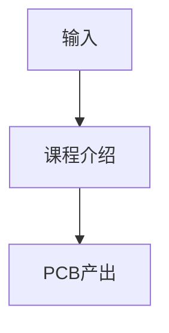

# P02 课程介绍

← [[BV1At421h7Ui-总览]] | ← [[P01-开场白-一起来学PCB！]] | 下一篇 → [[P03-PCB技术发展历程]]

## 视频信息

| 项目 | 内容 |
|------|------|
| 分集 | 课程介绍 |
| 模块 | 课程导览（P01–P02） |
| 时长 | 5 分 59 秒 |
| 链接 | [B 站 P2](https://www.bilibili.com/video/BV1At421h7Ui?p=2) |
| 课程资料 | [夸克网盘](https://pan.quark.cn/s/05650fad6466) |
| 内容来源 | 教程级知识点增强（非逐字转写） |

## 核心要点

1. **本 P 主题**：课程介绍
2. **模块定位**：课程导览（P01–P02）
3. **实操/考试侧重**：三篇课程结构、学习前置、配套资料用法
4. **笔记层级**：教程级（约 2603 字），含速览、Mermaid、Walkthrough、自测题
5. **学习建议**：P13 起请安装嘉立创 EDA 专业版跟画；资料包工程与视频同步打开

> 以下内容基于 Expert电子实验室 PCB 课程体系撰写，对应 B 站分 P「【入门篇】1-课程介绍」。**非 UP 逐字转写**；不看视频也可建立框架，看视频可对照「与视频对照表」深化。

## 本节在系列中的位置

**模块**：课程导览（P01–P02）· 系列第 **P02/29** 集。

**建议前置**：学完「开场白-一起来学PCB！」再读本集。

**建议后续**：继续「PCB技术发展历程」。

主线：电路基础(P03–P08) → PCB概念(P09–P12) → EDA操作(P13–P17) → 51板(P18–P24) → USB板(P25–P29)。

## 3 分钟速览

**课程介绍** 是本课程关键一讲。读完应能：① 复述核心概念与参数；② 在嘉立创 EDA 中完成对应操作；③ 通过自测题检验。侧重：**三篇课程结构、学习前置（高中物理+基本电脑操作）、配套资料用法**。

## 零基础导读

本节「课程介绍」属于 **课程导览**。国一学长课程强调**动手跟画**，本笔记补齐文字细节与菜单路径，便于暂停视频时查阅。

第一遍：理解概念框架；第二遍：打开 EDA 跟操作；第三遍：对照资料包工程查缺补漏。

## 详细讲解

### 1. 课程定位与受众

本课程假设你具备**高中物理**电学基础（电压、电流、电阻），会使用电脑，但**从未画过 PCB**。不讲深奥射频理论，重在**能画、能下单、能焊接调试**。

### 2. 三篇学习顺序

**不可跳过入门篇**：P04–P08 电路基础是读原理图的钥匙；P09–P12 PCB 概念是后面布局布线的语言。

**强化篇分两项目**：
1. **51 核心板**（P18–P24）：经典 8 位 MCU，电路简单，练熟全流程
2. **USB 拓展坞**（P25–P29）：接口电路 + 差分布线，进阶

**大师篇**：独立 BV，讲解多层板、高速信号等，本 BV 学完后再进入。

### 3. 推荐学习节奏

| 周次 | 内容 | 时间投入 |
|------|------|----------|
| 第 1 周 | P01–P08 电路基础 | 每天 1–2 集 |
| 第 2 周 | P09–P17 EDA 操作 | 边学边跟画 |
| 第 3–4 周 | P18–P24 51 板全流程 | 完成一块实物 |
| 第 5 周 | P25–P29 USB 板 | 进阶布线 |

### 4. 资料包使用方法

资料包内含：示例工程、封装库、BOM 表、原理图 PDF。建议流程：
1. 先看视频理解步骤
2. 暂停视频，在 EDA 中复现操作
3. 对比资料包工程查缺补漏

### 5. 嘉立创 EDA 专业版优势

- 国产自主，中文界面
- 与嘉立创 PCB/SMT 下单数据直连
- 专业版支持复杂规则、3D 预览、团队协作

### 6. 学前准备清单

| 项目 | 要求 | 备注 |
|------|------|------|
| 操作系统 | Windows 10+ | 课程演示环境 |
| 浏览器 | Chrome/Edge 最新版 | 在线版 EDA |
| 磁盘空间 | ≥ 2 GB | 客户端+工程 |
| 基础知识 | 高中物理电学 | 电压电流电阻 |
| 可选硬件 | 电烙铁+万用表 | P24 后焊接验证 |

### 深化理解（课程介绍）

**工程经验**：入门板优先 2 层 1.6mm 1oz 工艺，线宽线距 6/6 mil，成本低、嘉立创免费打样友好。电源网络线宽按电流估算：1A 约需 20–40 mil（视铜厚与温升）。

**预习 EDA**：P13 前可先行注册 lceda.cn 账号，熟悉浏览器/客户端安装方式，减少上手摩擦。

**与大师篇衔接**：本 BV 强化篇完成后，可学习大师篇合集（[BV1m441157T7](https://www.bilibili.com/video/BV1m441157T7)）中的高速、多层与复杂项目设计。

**资料同步**：每集操作与[夸克资料包](https://pan.quark.cn/s/05650fad6466)工程编号对应，建议 Obsidian 记录每版 DRC 截图与 BOM 变更。

## 图解

## 类比与直觉

PCB 设计像**城市规划**：原理图是功能分区图纸，布局是用地规划，布线是道路网络，DRC 是消防验收。

## 例题与场景 Walkthrough

**Walkthrough：理论到实践**

1. 阅读本集「详细讲解」建立概念
2. 观看视频前 40% 确认定义
3. 用自测题 1/3 检验理解
4. 在下一集 EDA 课程中落地操作
5. 整理术语表到 Obsidian

## 常见误区

1. **「看懂原理图 = 会画 PCB」**：还需封装、布局、布线、DRC、工艺规则，本课程 P13 起系统训练。
2. **「仿真通过就不用 DRC」**：DRC 检查制造规则，仿真检查电气功能，二者互补。
3. **「地线随便连」**：高频/USB 项目地回流路径决定信号质量，需完整地平面。
4. **「地线随便连」**：高频/USB 项目地回流路径决定信号质量，需完整地平面。

## 与视频对照表

| 视频段落（约） | 预期演示内容 | 笔记对应章节 |
|-------------|------------|------------|
| 开篇 0%–15% | 本集目标与回顾 | 本节位置、3 分钟速览 |
| 前段 15%–40% | 核心概念/原理图讲解 | 零基础导读、详细讲解 |
| 中段 40%–70% | EDA 实操演示 | 图解、Walkthrough |
| 后段 70%–90% | 易错点、参数总结 | 常见误区、Checklist |
| 收尾 90%–100% | 总结与下集预告 | 延伸阅读、自测题 |

> 本集总时长约 **5分59秒**。视频含内嵌中文字幕，API 无外挂字幕轨；以画面操作为主对照。

## 动手实践 Checklist

- [ ] 通读笔记「详细讲解」
- [ ] 对照视频确认 1 处演示细节
- [ ] 完成 3 道自测题
- [ ] 预习下一集主题
- [ ] 在 Obsidian 更新学习进度

## 延伸阅读

- [嘉立创 EDA 专业版文档](https://prodocs.lceda.cn/)
- [立创商城](https://www.szlcsc.com/)
- [课程资料夸克盘](https://pan.quark.cn/s/05650fad6466)
- 本系列前后分 P 交叉引用

## 自测题

1. **本集核心考点？**  
   **答**：三篇课程结构、学习前置（高中物理+基本电脑操作）、配套资料用法。

2. **本集属于哪个模块？**  
   **答**：课程导览（P01–P02）。

3. **嘉立创 EDA 相关菜单？**  
   **答**：见「详细讲解」EDA 操作表；本集重点为 课程介绍 对应菜单项。

4. **一项实操验收标准？**  
   **答**：能口述核心概念并完成自测。

5. **30 分钟复习计划？**  
   **答**：速览 + 图解 + Walkthrough 跟做一遍 + 自测 Q1/Q3。

## 逐字转写

> ⏳ **待转写**（`transcript_status: 待转写`）
>
> B 站 API 无外挂字幕轨（视频为内嵌中文字幕）。可使用 `Tools/transcribe/` 下 Whisper/BiliNote 工作流后续补充。转写完成后在此节粘贴全文并更新 frontmatter `transcript_status: 已完成`。
>
> **课程资料**：[夸克网盘](https://pan.quark.cn/s/05650fad6466)（原理图工程、封装库、BOM）

## 关键术语

| 术语 | 说明 |
|------|------|
| PCB | 印刷电路板，承载元器件与走线 |
| 嘉立创 EDA | 国产 PCB 设计软件，lceda.cn |
| DRC | Design Rule Check，设计规则检查 |
| 本讲关键词 | 课程介绍 |

## 与前后分 P 的衔接

- ← **开场白：一起来学PCB！**（[[P01-开场白-一起来学PCB！]]）
- → **PCB技术发展历程**（[[P03-PCB技术发展历程]]）

## 来源说明

- ✅ B 站官方元数据（`Tools/BV1At421h7Ui-full.json`）
- ✅ 分 P 首帧封面（`06-资源附件/video-notes-images/BV1At421h7Ui-P02-cover.jpg`）
- ✅ **教程级增强**：含 Mermaid、Walkthrough、自测题（约 2603 字，2026-06-06）
- ✅ 课程资料：[夸克网盘](https://pan.quark.cn/s/05650fad6466)
- ⏳ 逐字转写：待 Whisper/BiliNote

## 关键截图

![[../../06-资源附件/video-notes-images/BV1At421h7Ui-P02-cover.jpg|B站首帧 P02]]
