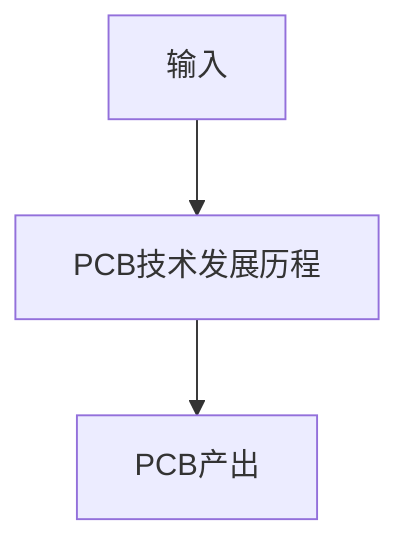

# P03 PCB技术发展历程

← [[BV1At421h7Ui-总览]] | ← [[P02-课程介绍]] | 下一篇 → [[P04-电路分析基础-基本元件电阻电容电感]]

## 视频信息

| 项目 | 内容 |
|------|------|
| 分集 | PCB技术发展历程 |
| 模块 | 电路分析基础（P03–P08） |
| 时长 | 10 分 02 秒 |
| 链接 | [B 站 P3](https://www.bilibili.com/video/BV1At421h7Ui?p=3) |
| 课程资料 | [夸克网盘](https://pan.quark.cn/s/05650fad6466) |
| 内容来源 | 教程级知识点增强（非逐字转写） |

## 核心要点

1. **本 P 主题**：PCB技术发展历程
2. **模块定位**：电路分析基础（P03–P08）
3. **实操/考试侧重**：PCB 发展史、IPC 标准、嘉立创 EDA+制造生态
4. **笔记层级**：教程级（约 2688 字），含速览、Mermaid、Walkthrough、自测题
5. **学习建议**：P13 起请安装嘉立创 EDA 专业版跟画；资料包工程与视频同步打开

> 以下内容基于 Expert电子实验室 PCB 课程体系撰写，对应 B 站分 P「【入门篇】2-PCB技术发展历程」。**非 UP 逐字转写**；不看视频也可建立框架，看视频可对照「与视频对照表」深化。

## 本节在系列中的位置

**模块**：电路分析基础（P03–P08）· 系列第 **P03/29** 集。

**建议前置**：学完「课程介绍」再读本集。

**建议后续**：继续「电路分析基础-基本元件（电阻电容电感）」。

主线：电路基础(P03–P08) → PCB概念(P09–P12) → EDA操作(P13–P17) → 51板(P18–P24) → USB板(P25–P29)。

## 3 分钟速览

**PCB技术发展历程** 是本课程关键一讲。读完应能：① 复述核心概念与参数；② 在嘉立创 EDA 中完成对应操作；③ 通过自测题检验。侧重：**PCB 从单面板到 HDI 的演进、IPC 标准、国内 EDA 生态（嘉立创/JLC）**。

## 零基础导读

本节「PCB技术发展历程」属于 **电路分析基础**。国一学长课程强调**动手跟画**，本笔记补齐文字细节与菜单路径，便于暂停视频时查阅。

第一遍：理解概念框架；第二遍：打开 EDA 跟操作；第三遍：对照资料包工程查缺补漏。

## 详细讲解

### 1. PCB 诞生简史

**1950 年代**：电子管时代用点对点焊接，体积大、可靠性差。

**1960 年代**：印制电路技术成熟——在绝缘基板上腐蚀出铜箔走线，元器件穿孔焊接（**THT，通孔插件**）。

**1990 年代**：**SMT 表面贴装**成为主流，元器件变小、自动化贴片。

**2000 年代至今**：多层板、HDI（高密度互连）、柔性板、刚柔结合板普及；手机主板可达 10+ 层。

### 2. 关键里程碑

| 年代 | 技术 | 影响 |
|------|------|------|
| 1980s | 双层板普及 | 成本下降，消费电子爆发 |
| 1990s | 四层板 + SMT | 电脑主板复杂化 |
| 2000s | 无铅焊、RoHS | 环保法规驱动工艺变革 |
| 2010s | HDI + 微盲孔 | 智能手机超薄化 |
| 2020s | 国产 EDA 崛起 | 嘉立创、华大等降低入门门槛 |

### 3. 行业标准 IPC

**IPC**（Association Connecting Electronics Industries）制定 PCB 设计与可制造性标准：
- **IPC-2221**：通用 PCB 设计标准
- **IPC-7351**：焊盘图形标准（封装设计必查）
- **IPC-A-600**：PCB 验收标准

嘉立创默认工艺参数对齐 IPC Class 2（一般电子产品）。

### 4. 国内 EDA 与制造生态

**嘉立创**形成「EDA 设计 → PCB 打样 → SMT 贴片 → 元器件商城」闭环：
- 设计用嘉立创 EDA 专业版
- 下单用嘉立创 PCB（5 元 10 片促销）
- 元件用立创商城 LCSC

这是本课程选型的核心原因：**学完即可低成本打样验证**。

### 5. 从设计到实物流程预览

```
需求分析 → 原理图 → 封装 → PCB布局 → 布线 → DRC → Gerber → 打样 → 焊接 → 调试
```

后续 P12 会展开每一步；P18 起用真实项目走通。

### 深化理解（PCB技术发展历程）

**工程经验**：入门板优先 2 层 1.6mm 1oz 工艺，线宽线距 6/6 mil，成本低、嘉立创免费打样友好。电源网络线宽按电流估算：1A 约需 20–40 mil（视铜厚与温升）。

**预习 EDA**：P13 前可先行注册 lceda.cn 账号，熟悉浏览器/客户端安装方式，减少上手摩擦。

**与大师篇衔接**：本 BV 强化篇完成后，可学习大师篇合集（[BV1m441157T7](https://www.bilibili.com/video/BV1m441157T7)）中的高速、多层与复杂项目设计。

**资料同步**：每集操作与[夸克资料包](https://pan.quark.cn/s/05650fad6466)工程编号对应，建议 Obsidian 记录每版 DRC 截图与 BOM 变更。

## 图解



## 类比与直觉

电路基础像**学字母再组词**：电阻电容是字母，RC 电路是单词，原理图是文章。

## 例题与场景 Walkthrough

**Walkthrough：理论到实践**

1. 阅读本集「详细讲解」建立概念
2. 观看视频前 40% 确认定义
3. 用自测题 1/3 检验理解
4. 在下一集 EDA 课程中落地操作
5. 整理术语表到 Obsidian

## 常见误区

1. **「看懂原理图 = 会画 PCB」**：还需封装、布局、布线、DRC、工艺规则，本课程 P13 起系统训练。
2. **「仿真通过就不用 DRC」**：DRC 检查制造规则，仿真检查电气功能，二者互补。
3. **「地线随便连」**：高频/USB 项目地回流路径决定信号质量，需完整地平面。
4. **「地线随便连」**：高频/USB 项目地回流路径决定信号质量，需完整地平面。

## 与视频对照表

| 视频段落（约） | 预期演示内容 | 笔记对应章节 |
|-------------|------------|------------|
| 开篇 0%–15% | 本集目标与回顾 | 本节位置、3 分钟速览 |
| 前段 15%–40% | 核心概念/原理图讲解 | 零基础导读、详细讲解 |
| 中段 40%–70% | EDA 实操演示 | 图解、Walkthrough |
| 后段 70%–90% | 易错点、参数总结 | 常见误区、Checklist |
| 收尾 90%–100% | 总结与下集预告 | 延伸阅读、自测题 |

> 本集总时长约 **10分02秒**。视频含内嵌中文字幕，API 无外挂字幕轨；以画面操作为主对照。

## 动手实践 Checklist

- [ ] 通读笔记「详细讲解」
- [ ] 对照视频确认 1 处演示细节
- [ ] 完成 3 道自测题
- [ ] 预习下一集主题
- [ ] 在 Obsidian 更新学习进度

## 延伸阅读

- [嘉立创 EDA 专业版文档](https://prodocs.lceda.cn/)
- [立创商城](https://www.szlcsc.com/)
- [课程资料夸克盘](https://pan.quark.cn/s/05650fad6466)
- 《模拟电子技术基础》电阻电容电感章节
- 元件数据手册阅读指南（本课程 P06）

## 自测题

1. **本集核心考点？**  
   **答**：PCB 从单面板到 HDI 的演进、IPC 标准、国内 EDA 生态（嘉立创/JLC）。

2. **本集属于哪个模块？**  
   **答**：电路分析基础（P03–P08）。

3. **嘉立创 EDA 相关菜单？**  
   **答**：见「详细讲解」EDA 操作表；本集重点为 PCB技术发展历程 对应菜单项。

4. **一项实操验收标准？**  
   **答**：能口述核心概念并完成自测。

5. **30 分钟复习计划？**  
   **答**：速览 + 图解 + Walkthrough 跟做一遍 + 自测 Q1/Q3。

## 逐字转写

> ⏳ **待转写**（`transcript_status: 待转写`）
>
> B 站 API 无外挂字幕轨（视频为内嵌中文字幕）。可使用 `Tools/transcribe/` 下 Whisper/BiliNote 工作流后续补充。转写完成后在此节粘贴全文并更新 frontmatter `transcript_status: 已完成`。
>
> **课程资料**：[夸克网盘](https://pan.quark.cn/s/05650fad6466)（原理图工程、封装库、BOM）

## 关键术语

| 术语 | 说明 |
|------|------|
| PCB | 印刷电路板，承载元器件与走线 |
| 嘉立创 EDA | 国产 PCB 设计软件，lceda.cn |
| DRC | Design Rule Check，设计规则检查 |
| 本讲关键词 | PCB技术发展历程 |

## 与前后分 P 的衔接

- ← **课程介绍**（[[P02-课程介绍]]）
- → **电路分析基础-基本元件（电阻电容电感）**（[[P04-电路分析基础-基本元件电阻电容电感]]）

## 来源说明

- ✅ B 站官方元数据（`Tools/BV1At421h7Ui-full.json`）
- ✅ 分 P 首帧封面（`06-资源附件/video-notes-images/BV1At421h7Ui-P03-cover.jpg`）
- ✅ **教程级增强**：含 Mermaid、Walkthrough、自测题（约 2688 字，2026-06-06）
- ✅ 课程资料：[夸克网盘](https://pan.quark.cn/s/05650fad6466)
- ⏳ 逐字转写：待 Whisper/BiliNote

## 关键截图

![[../../06-资源附件/video-notes-images/BV1At421h7Ui-P03-cover.jpg|B站首帧 P03]]
