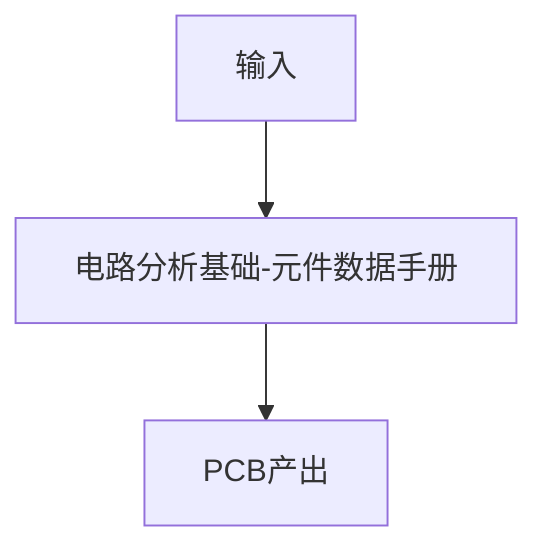

# P06 电路分析基础-元件数据手册

← [[BV1At421h7Ui-总览]] | ← [[P05-电路分析基础-基本元件二极管三极管场效应管]] | 下一篇 → [[P07-电路分析基础-电路定理]]

## 视频信息

| 项目 | 内容 |
|------|------|
| 分集 | 电路分析基础-元件数据手册 |
| 模块 | 电路分析基础（P03–P08） |
| 时长 | 27 分 28 秒 |
| 链接 | [B 站 P6](https://www.bilibili.com/video/BV1At421h7Ui?p=6) |
| 课程资料 | [夸克网盘](https://pan.quark.cn/s/05650fad6466) |
| 内容来源 | 教程级知识点增强（非逐字转写） |

## 核心要点

1. **本 P 主题**：电路分析基础-元件数据手册
2. **模块定位**：电路分析基础（P03–P08）
3. **实操/考试侧重**：Datasheet 阅读、极限参数、封装页
4. **笔记层级**：教程级（约 2782 字），含速览、Mermaid、Walkthrough、自测题
5. **学习建议**：P13 起请安装嘉立创 EDA 专业版跟画；资料包工程与视频同步打开

> 以下内容基于 Expert电子实验室 PCB 课程体系撰写，对应 B 站分 P「【入门篇】5-电路分析基础-元件数据手册」。**非 UP 逐字转写**；不看视频也可建立框架，看视频可对照「与视频对照表」深化。

## 本节在系列中的位置

**模块**：电路分析基础（P03–P08）· 系列第 **P06/29** 集。

**建议前置**：学完「电路分析基础-基本元件（二极管三极管场效应管）」再读本集。

**建议后续**：继续「电路分析基础-电路定理」。

主线：电路基础(P03–P08) → PCB概念(P09–P12) → EDA操作(P13–P17) → 51板(P18–P24) → USB板(P25–P29)。

## 3 分钟速览

**电路分析基础-元件数据手册** 是本课程关键一讲。读完应能：① 复述核心概念与参数；② 在嘉立创 EDA 中完成对应操作；③ 通过自测题检验。侧重：**Datasheet 结构、Absolute Maximum/电气特性表、封装页、选型决策树**。

## 零基础导读

本节「电路分析基础-元件数据手册」属于 **电路分析基础**。国一学长课程强调**动手跟画**，本笔记补齐文字细节与菜单路径，便于暂停视频时查阅。

第一遍：理解概念框架；第二遍：打开 EDA 跟操作；第三遍：对照资料包工程查缺补漏。

## 详细讲解

### 1. 本集主题：电路分析基础-元件数据手册

本集归属 **电路分析基础**（P03–P08），是 Expert电子实验室嘉立创 EDA 保姆级课程的第 **P06** 集。

**实践/考试侧重**：Datasheet 结构、Absolute Maximum/电气特性表、封装页、选型决策树

### 2. 核心知识框架

#### 2.1 概念定义

**Datasheet** 是元器件的「说明书」：Pin Definition（引脚）、Absolute Maximum Ratings（极限参数）、Recommended Operating Conditions（工作条件）、Typical Application（典型电路）、Package（封装尺寸）。

#### 2.2 设计/分析步骤

1. 阅读本集「核心知识框架」
2. 观看视频对应段落（见对照表）
3. 用自测题检验理解
4. 在下一集实操前完成 Checklist

#### 2.3 元件选型要点

选型顺序：电气参数 → 封装 → 供货/价格 → 参考设计。立创商城搜索型号，对比库存与数据手册一致性。

### 3. 硬件实操清单

- [ ] 通读本集笔记
- [ ] 对照视频 1 遍
- [ ] 完成自测题
- [ ] 预习下一集主题

### 4. 与前后课程衔接

承接 P05 内容，电路分析基础模块核心环节，为 P07 铺垫。大师篇（独立合集）将进阶高速与多层设计。

### 5. 常见参数速查

| 参数 | 典型值 | 说明 |
|------|--------|------|
| 板厚 | 1.6 mm | 常用 |
| 铜厚 | 1 oz | 35μm |

### 6. 实操拓展与验收

**本集练习**：暂停视频，在笔记「Walkthrough」节逐步打勾；完成后用文末 3 道自测题检验。**验收标准**：能独立复述「电路分析基础-元件数据手册」3 个关键要点，并在 EDA 或草稿纸完成 1 项小练习。

> **学习提示**：本集建议打开课程资料包对应工程，在嘉立创 EDA 专业版中同步操作。遇到 DRC 报错先查「设计规则」与「网络标号」是否一致。

### 深化理解（电路分析基础-元件数据手册）

**工程经验**：入门板优先 2 层 1.6mm 1oz 工艺，线宽线距 6/6 mil，成本低、嘉立创免费打样友好。电源网络线宽按电流估算：1A 约需 20–40 mil（视铜厚与温升）。

**预习 EDA**：P13 前可先行注册 lceda.cn 账号，熟悉浏览器/客户端安装方式，减少上手摩擦。

**与大师篇衔接**：本 BV 强化篇完成后，可学习大师篇合集（[BV1m441157T7](https://www.bilibili.com/video/BV1m441157T7)）中的高速、多层与复杂项目设计。

**资料同步**：每集操作与[夸克资料包](https://pan.quark.cn/s/05650fad6466)工程编号对应，建议 Obsidian 记录每版 DRC 截图与 BOM 变更。

## 图解

## 类比与直觉

电路基础像**学字母再组词**：电阻电容是字母，RC 电路是单词，原理图是文章。

## 例题与场景 Walkthrough

**Walkthrough：理论到实践**

1. 阅读本集「详细讲解」建立概念
2. 观看视频前 40% 确认定义
3. 用自测题 1/3 检验理解
4. 在下一集 EDA 课程中落地操作
5. 整理术语表到 Obsidian

## 常见误区

1. **「看懂原理图 = 会画 PCB」**：还需封装、布局、布线、DRC、工艺规则，本课程 P13 起系统训练。
2. **「仿真通过就不用 DRC」**：DRC 检查制造规则，仿真检查电气功能，二者互补。
3. **「地线随便连」**：高频/USB 项目地回流路径决定信号质量，需完整地平面。
4. **「地线随便连」**：高频/USB 项目地回流路径决定信号质量，需完整地平面。

## 与视频对照表

| 视频段落（约） | 预期演示内容 | 笔记对应章节 |
|-------------|------------|------------|
| 开篇 0%–15% | 本集目标与回顾 | 本节位置、3 分钟速览 |
| 前段 15%–40% | 核心概念/原理图讲解 | 零基础导读、详细讲解 |
| 中段 40%–70% | EDA 实操演示 | 图解、Walkthrough |
| 后段 70%–90% | 易错点、参数总结 | 常见误区、Checklist |
| 收尾 90%–100% | 总结与下集预告 | 延伸阅读、自测题 |

> 本集总时长约 **27分28秒**。视频含内嵌中文字幕，API 无外挂字幕轨；以画面操作为主对照。

## 动手实践 Checklist

- [ ] 通读笔记「详细讲解」
- [ ] 对照视频确认 1 处演示细节
- [ ] 完成 3 道自测题
- [ ] 预习下一集主题
- [ ] 在 Obsidian 更新学习进度

## 延伸阅读

- [嘉立创 EDA 专业版文档](https://prodocs.lceda.cn/)
- [立创商城](https://www.szlcsc.com/)
- [课程资料夸克盘](https://pan.quark.cn/s/05650fad6466)
- 《模拟电子技术基础》电阻电容电感章节
- 元件数据手册阅读指南（本课程 P06）

## 自测题

1. **本集核心考点？**  
   **答**：Datasheet 结构、Absolute Maximum/电气特性表、封装页、选型决策树。

2. **本集属于哪个模块？**  
   **答**：电路分析基础（P03–P08）。

3. **嘉立创 EDA 相关菜单？**  
   **答**：见「详细讲解」EDA 操作表；本集重点为 电路分析基础-元件数据手册 对应菜单项。

4. **一项实操验收标准？**  
   **答**：能口述核心概念并完成自测。

5. **30 分钟复习计划？**  
   **答**：速览 + 图解 + Walkthrough 跟做一遍 + 自测 Q1/Q3。

## 逐字转写

> ⏳ **待转写**（`transcript_status: 待转写`）
>
> B 站 API 无外挂字幕轨（视频为内嵌中文字幕）。可使用 `Tools/transcribe/` 下 Whisper/BiliNote 工作流后续补充。转写完成后在此节粘贴全文并更新 frontmatter `transcript_status: 已完成`。
>
> **课程资料**：[夸克网盘](https://pan.quark.cn/s/05650fad6466)（原理图工程、封装库、BOM）

## 关键术语

| 术语 | 说明 |
|------|------|
| PCB | 印刷电路板，承载元器件与走线 |
| 嘉立创 EDA | 国产 PCB 设计软件，lceda.cn |
| DRC | Design Rule Check，设计规则检查 |
| Datasheet | 元器件官方规格书 |
| Absolute Maximum | 绝对最大额定值 |

## 与前后分 P 的衔接

- ← **电路分析基础-基本元件（二极管三极管场效应管）**（[[P05-电路分析基础-基本元件二极管三极管场效应管]]）
- → **电路分析基础-电路定理**（[[P07-电路分析基础-电路定理]]）

## 来源说明

- ✅ B 站官方元数据（`Tools/BV1At421h7Ui-full.json`）
- ✅ 分 P 首帧封面（`06-资源附件/video-notes-images/BV1At421h7Ui-P06-cover.jpg`）
- ✅ **教程级增强**：含 Mermaid、Walkthrough、自测题（约 2782 字，2026-06-06）
- ✅ 课程资料：[夸克网盘](https://pan.quark.cn/s/05650fad6466)
- ⏳ 逐字转写：待 Whisper/BiliNote

## 关键截图

![[../../06-资源附件/video-notes-images/BV1At421h7Ui-P06-cover.jpg|B站首帧 P06]]
