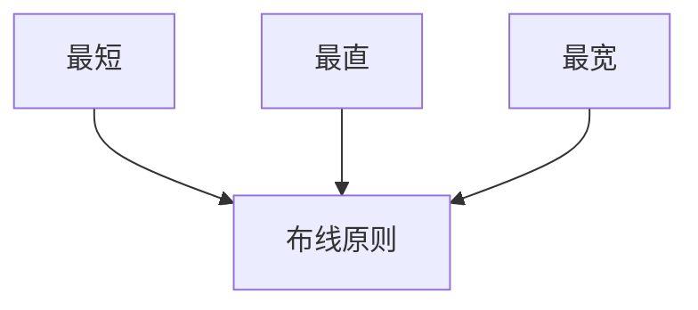

# P22 PCB板布线原则

← [[BV1At421h7Ui-总览]] | ← [[P21-51单片机核心板PCB布局]] | 下一篇 → [[P23-51单片机核心板PCB布线]]

## 视频信息

| 项目 | 内容 |
|------|------|
| 分集 | PCB板布线原则 |
| 模块 | 51核心板实战（P18–P24） |
| 时长 | 6 分 35 秒 |
| 链接 | [B 站 P22](https://www.bilibili.com/video/BV1At421h7Ui?p=22) |
| 课程资料 | [夸克网盘](https://pan.quark.cn/s/05650fad6466) |
| 内容来源 | 教程级知识点增强（非逐字转写） |

## 核心要点

1. **本 P 主题**：PCB板布线原则
2. **模块定位**：51核心板实战（P18–P24）
3. **实操/考试侧重**：3W 布线原则、电源加粗、回流路径
4. **笔记层级**：教程级（约 3219 字），含速览、Mermaid、Walkthrough、自测题
5. **学习建议**：P13 起请安装嘉立创 EDA 专业版跟画；资料包工程与视频同步打开

> 以下内容基于 Expert电子实验室 PCB 课程体系撰写，对应 B 站分 P「【强化篇】21-PCB板布线原则」。**非 UP 逐字转写**；不看视频也可建立框架，看视频可对照「与视频对照表」深化。

## 本节在系列中的位置

**模块**：51核心板实战（P18–P24）· 系列第 **P22/29** 集。

**建议前置**：学完「51单片机核心板PCB布局」再读本集。

**建议后续**：继续「51单片机核心板PCB布线」。

主线：电路基础(P03–P08) → PCB概念(P09–P12) → EDA操作(P13–P17) → 51板(P18–P24) → USB板(P25–P29)。

## 3 分钟速览

**PCB板布线原则** 是本课程关键一讲。读完应能：① 复述核心概念与参数；② 在嘉立创 EDA 中完成对应操作；③ 通过自测题检验。侧重：**3W 原则、45°/蛇形走线、差分对等长、电源线加粗、回流路径最短**。

## 零基础导读

本节「PCB板布线原则」属于 **51核心板实战**。国一学长课程强调**动手跟画**，本笔记补齐文字细节与菜单路径，便于暂停视频时查阅。

第一遍：理解概念框架；第二遍：打开 EDA 跟操作；第三遍：对照资料包工程查缺补漏。

## 详细讲解

### 1. 本集主题：PCB板布线原则

本集归属 **51核心板实战**（P18–P24），是 Expert电子实验室嘉立创 EDA 保姆级课程的第 **P22** 集。

**实践/考试侧重**：3W 原则、45°/蛇形走线、差分对等长、电源线加粗、回流路径最短

### 2. 核心知识框架

#### 2.1 概念定义

布线三原则：**最短**（减小寄生参数）、**最直**（避免锐角，用 45° 或圆弧）、**最宽**（电源/地线加粗）。电源线 > 信号线宽度；模拟与数字地单点连接或完整地平面。

#### 2.2 设计/分析步骤

1. 打开课程资料工程或新建工程
2. 按本集主题完成对应设计步骤
3. 运行 DRC/ERC 并修复全部告警
4. 与资料包参考工程 diff 对照
5. 记录参数（线宽、过孔、电容值）备查

#### 2.3 元件选型要点

优先选立创商城有货、嘉立创 EDA 库内置封装的型号，缩短设计周期。

### 3. 硬件实操清单

- [ ] 在 EDA 中打开 51/USB 工程
- [ ] 完成本集原理图或 PCB 步骤
- [ ] ERC/DRC 检查
- [ ] 与资料包工程对比

### 嘉立创 EDA 专业版操作要点

| 菜单/功能 | 路径 | 本集用途 |
|----------|------|----------|
| 设计规则 | 设计 → 设计规则 | 线宽、间距、过孔 |
| DRC | 工具 → DRC | 电气/间距检查 |
| 铺铜 | 放置 → 铺铜 | 地平面、电源 |
| 导出 Gerber | 制造 → 输出 Gerber | 打样文件 |
| 库管理 | 左侧库面板 | 符号/封装搜索与放置 |

快捷键建议：`V` 选择、`W` 连线、`P` 放置、`G` 栅格切换。

### 51 单片机核心板工程要点

- **MCU**：STC89C52RC（51 内核，DIP-40 或 LQFP-44）
- **时钟**：11.0592 MHz 晶振 + 30pF 负载电容 ×2
- **复位**：10kΩ 上拉 + 10μF 电解 + 复位按键
- **电源**：USB 5V 输入 → AMS1117-3.3 → MCU VCC
- **去耦**：0.1μF 陶瓷电容紧靠 MCU 每对 VCC/GND
- **下载**：CH340G USB-UART，DTR 接 RST 实现自动下载

### 4. 与前后课程衔接

承接 P21 内容，51核心板实战模块核心环节，为 P23 铺垫。大师篇（独立合集）将进阶高速与多层设计。

### 5. 常见参数速查

| 网络类型 | 建议线宽 | 备注 |
|----------|----------|------|
| 电源 5V/3.3V | 20–40 mil | 按电流 |
| 信号 | 8–10 mil | 默认 |
| USB 差分 | 按阻抗 | 90Ω |

### 6. 实操拓展与验收

**本集练习**：暂停视频，在笔记「Walkthrough」节逐步打勾；完成后用文末 3 道自测题检验。**验收标准**：能独立复述「PCB板布线原则」3 个关键要点，并在 EDA 或草稿纸完成 1 项小练习。

> **学习提示**：本集建议打开课程资料包对应工程，在嘉立创 EDA 专业版中同步操作。遇到 DRC 报错先查「设计规则」与「网络标号」是否一致。

### 深化理解（PCB板布线原则）

**工程经验**：入门板优先 2 层 1.6mm 1oz 工艺，线宽线距 6/6 mil，成本低、嘉立创免费打样友好。电源网络线宽按电流估算：1A 约需 20–40 mil（视铜厚与温升）。

**EDA 技巧**：原理图与 PCB 使用同一工程；修改封装后务必「更新 PCB」同步；规则修改后全板 DRC 复检。

**与大师篇衔接**：本 BV 强化篇完成后，可学习大师篇合集（[BV1m441157T7](https://www.bilibili.com/video/BV1m441157T7)）中的高速、多层与复杂项目设计。

**资料同步**：每集操作与[夸克资料包](https://pan.quark.cn/s/05650fad6466)工程编号对应，建议 Obsidian 记录每版 DRC 截图与 BOM 变更。

## 图解

## 类比与直觉

51 核心板像**电子入门驾照**：电路简单、资料多、焊完能亮灯能下载程序。

## 例题与场景 Walkthrough

**Walkthrough：51 核心板本集操作**

1. 打开资料包 51 工程（嘉立创 EDA 专业版）
2. 定位本集对应页面（原理图/PCB）
3. 按视频步骤复现：PCB板布线原则
4. 运行 DRC，记录报错类型与修复方法
5. 截图保存关键界面到 Obsidian

## 常见误区

1. **「看懂原理图 = 会画 PCB」**：还需封装、布局、布线、DRC、工艺规则，本课程 P13 起系统训练。
2. **「仿真通过就不用 DRC」**：DRC 检查制造规则，仿真检查电气功能，二者互补。
3. **「90° 直角走线一定不行」**：低频入门板影响小，但好习惯从 45° 开始；高速板必须避免。
4. **「地线随便连」**：高频/USB 项目地回流路径决定信号质量，需完整地平面。

## 与视频对照表

| 视频段落（约） | 预期演示内容 | 笔记对应章节 |
|-------------|------------|------------|
| 开篇 0%–15% | 本集目标与回顾 | 本节位置、3 分钟速览 |
| 前段 15%–40% | 核心概念/原理图讲解 | 零基础导读、详细讲解 |
| 中段 40%–70% | EDA 实操演示 | 图解、Walkthrough |
| 后段 70%–90% | 易错点、参数总结 | 常见误区、Checklist |
| 收尾 90%–100% | 总结与下集预告 | 延伸阅读、自测题 |

> 本集总时长约 **6分35秒**。视频含内嵌中文字幕，API 无外挂字幕轨；以画面操作为主对照。

## 动手实践 Checklist

- [ ] 打开嘉立创 EDA 专业版并登录
- [ ] 完成本集 Walkthrough 步骤
- [ ] 运行 DRC/ERC 并截图
- [ ] 下载/打开[课程资料](https://pan.quark.cn/s/05650fad6466)
- [ ] 记录 1 个仍不懂的菜单项

## 延伸阅读

- [嘉立创 EDA 专业版文档](https://prodocs.lceda.cn/)
- [立创商城](https://www.szlcsc.com/)
- [课程资料夸克盘](https://pan.quark.cn/s/05650fad6466)
- STC89C52 数据手册
- CH340G 应用笔记

## 自测题

1. **本集核心考点？**  
   **答**：3W 原则、45°/蛇形走线、差分对等长、电源线加粗、回流路径最短。

2. **本集属于哪个模块？**  
   **答**：51核心板实战（P18–P24）。

3. **嘉立创 EDA 相关菜单？**  
   **答**：见「详细讲解」EDA 操作表；本集重点为 PCB板布线原则 对应菜单项。

4. **一项实操验收标准？**  
   **答**：DRC/ERC 无错误，工程可保存打开。

5. **30 分钟复习计划？**  
   **答**：速览 + 图解 + Walkthrough 跟做一遍 + 自测 Q1/Q3。

## 逐字转写

> ⏳ **待转写**（`transcript_status: 待转写`）
>
> B 站 API 无外挂字幕轨（视频为内嵌中文字幕）。可使用 `Tools/transcribe/` 下 Whisper/BiliNote 工作流后续补充。转写完成后在此节粘贴全文并更新 frontmatter `transcript_status: 已完成`。
>
> **课程资料**：[夸克网盘](https://pan.quark.cn/s/05650fad6466)（原理图工程、封装库、BOM）

## 关键术语

| 术语 | 说明 |
|------|------|
| PCB | 印刷电路板，承载元器件与走线 |
| 嘉立创 EDA | 国产 PCB 设计软件，lceda.cn |
| DRC | Design Rule Check，设计规则检查 |
| 3W原则 | 最短最直最宽 |
| 铺铜 | 大面积接地降低阻抗 |

## 与前后分 P 的衔接

- ← **51单片机核心板PCB布局**（[[P21-51单片机核心板PCB布局]]）
- → **51单片机核心板PCB布线**（[[P23-51单片机核心板PCB布线]]）

## 来源说明

- ✅ B 站官方元数据（`Tools/BV1At421h7Ui-full.json`）
- ✅ 分 P 首帧封面（`06-资源附件/video-notes-images/BV1At421h7Ui-P22-cover.jpg`）
- ✅ **教程级增强**：含 Mermaid、Walkthrough、自测题（约 3219 字，2026-06-06）
- ✅ 课程资料：[夸克网盘](https://pan.quark.cn/s/05650fad6466)
- ⏳ 逐字转写：待 Whisper/BiliNote

## 关键截图

![[../../06-资源附件/video-notes-images/BV1At421h7Ui-P22-cover.jpg|B站首帧 P22]]
