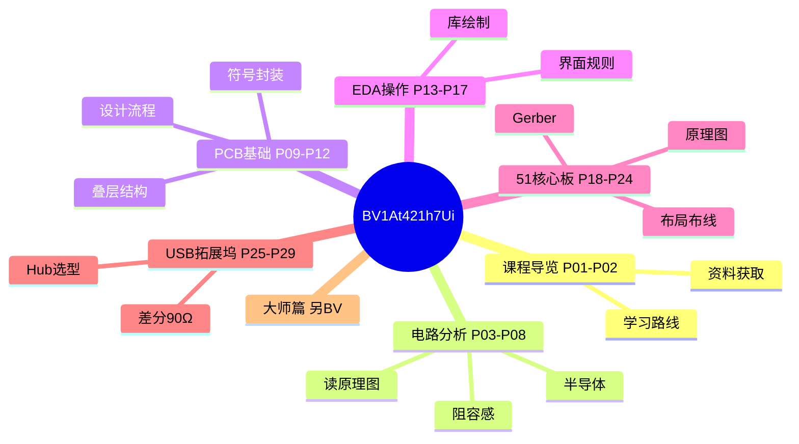

# PCB 设计嘉立创 EDA · 思维导图

← [[BV1At421h7Ui-总览]]



## 分 P 详图

```mermaid
mindmap
  root((PCB保姆级29讲))
    P01 开场白：一起来学PCB！ ~2542字
      [[P01-开场白-一起来学PCB！]]
    P02 课程介绍 ~2603字
      [[P02-课程介绍]]
    P03 PCB技术发展历程 ~2688字
      [[P03-PCB技术发展历程]]
    P04 电路分析基础-基本元件（电阻 ~2847字
      [[P04-电路分析基础-基本元件电阻电容电感]]
    P05 电路分析基础-基本元件（二极 ~2796字
      [[P05-电路分析基础-基本元件二极管三极管场效应管]]
    P06 电路分析基础-元件数据手册 ~2782字
      [[P06-电路分析基础-元件数据手册]]
    P07 电路分析基础-电路定理 ~2636字
      [[P07-电路分析基础-电路定理]]
    P08 电路分析基础-读懂原理图 ~2653字
      [[P08-电路分析基础-读懂原理图]]
    P09 PCB设计基础-PCB结构与 ~2766字
      [[P09-PCB设计基础-PCB结构与组成]]
    P10 PCB设计基础-PCB叠层结 ~2692字
      [[P10-PCB设计基础-PCB叠层结构]]
    P11 PCB设计基础-元件符号与封 ~2677字
      [[P11-PCB设计基础-元件符号与封装]]
    P12 PCB设计基础-PCB设计流 ~2695字
      [[P12-PCB设计基础-PCB设计流程]]
    P13 立创EDA专业版软件下载 ~2974字
      [[P13-立创EDA专业版软件下载]]
    P14 熟悉软件操作界面 ~2978字
      [[P14-熟悉软件操作界面]]
    P15 设计环境设置 ~2998字
      [[P15-设计环境设置]]
    P16 元件符号绘制 ~2925字
      [[P16-元件符号绘制]]
    P17 元件封装绘制 ~2971字
      [[P17-元件封装绘制]]
    P18 51单片机核心板元件选型 ~3328字
      [[P18-51单片机核心板元件选型]]
    P19 51核心板电源&最小系统原理 ~3296字
      [[P19-51核心板电源最小系统原理图设计]]
    P20 51核心板外围功能电路原理图 ~3280字
      [[P20-51核心板外围功能电路原理图设计DRC]]
    P21 51单片机核心板PCB布局 ~3236字
      [[P21-51单片机核心板PCB布局]]
    P22 PCB板布线原则 ~3219字
      [[P22-PCB板布线原则]]
    P23 51单片机核心板PCB布线 ~3200字
      [[P23-51单片机核心板PCB布线]]
    P24 51核心板丝印&DRC&生产 ~3284字
      [[P24-51核心板丝印DRC生产文件导出]]
    P25 USB拓展坞元件选型 ~3196字
      [[P25-USB拓展坞元件选型]]
    P26 USB拓展坞原理图设计 ~3139字
      [[P26-USB拓展坞原理图设计]]
    P27 USB拓展坞PCB布局 ~3117字
      [[P27-USB拓展坞PCB布局]]
    P28 USB拓展坞PCB布线 ~3141字
      [[P28-USB拓展坞PCB布线]]
    P29 USB拓展坞DRC和导出生产 ~3154字
      [[P29-USB拓展坞DRC和导出生产文件]]
```

> 各 P 已按**教程级**增强（2026-06-06，合计约 85813 字，均篇 2959 字）。封面见 `06-资源附件/video-notes-images/BV1At421h7Ui-P*-cover.jpg`。
