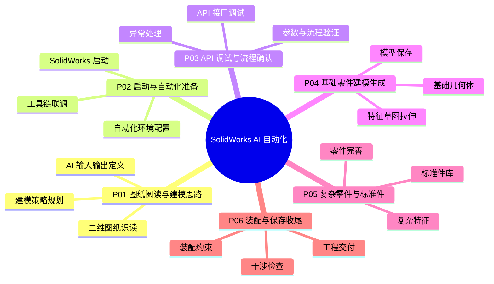

# AI读取机械二维图纸并驱动 SolidWorks 建模装配

> 完整教程分 P 版，共 6 部分。记录 **AI 从机械二维图纸阅读** 开始，到 **调用 SolidWorks 完成零件建模、保存和装配尝试** 的全过程。
>
> 分 P 标题含「带字幕配音」，但 B 站 API 未返回可下载字幕轨；当前笔记基于 **官方简介 + 分 P 结构** 整理，待 Whisper/BiliNote 可继续补充逐字稿。

## 视频简介（B 站原文）

这是完整教程分P版，共6个部分，记录AI从机械二维图纸阅读开始，到调用SolidWorks完成零件建模、保存和装配尝试的全过程。

- P01：图纸阅读与建模思路
- P02：SolidWorks启动与自动化准备
- P03：API调试与流程确认
- P04：基础零件建模生成
- P05：复杂零件与标准件完善
- P06：装配尝试与保存收尾

如果想快速看结果，可以先看 UP 前面发布的精华版；如果想完整了解每一步，建议按 P01→P06 顺序观看。

## 视频数据

| 字段 | 内容 |
|------|------|
| BV 号 | BV1Yo5D6TEVk |
| UP 主 | 夜刀凉宫忧x |
| 总时长 | 3h 10m 41s（11441 秒） |
| 分辨率 | 1920×1080 |
| 合集 | AI读取机械二维图纸并驱动SolidWorks |
| 播放量 | 1915（抓取时） |
| 标签 | 学习、教程、SolidWorks、图纸、机械制图、AI创作者 |
| 字幕状态 | 无外挂字幕轨（内嵌配音；`need_login_subtitle: true`） |

## 思维导图

## 分 P 索引

| 分 P | B 站分集标题 | 时长 | 笔记 |
|------|-------------|------|------|
| P01 | P01_图纸阅读与建模思路_带字幕配音 | 25m01s | [[P01-图纸阅读与建模思路]] |
| P02 | P02_SolidWorks启动与自动化准备_带字幕配音 | 45m03s | [[P02-环境自动化准备]] |
| P03 | P03_API调试与流程确认_带字幕配音 | 30m03s | [[P03-API调用与参数确认]] |
| P04 | P04_基础零件建模生成_带字幕配音 | 40m04s | [[P04-参数化零件建模]] |
| P05 | P05_复杂零件与标准件完善_带字幕配音 | 30m02s | [[P05-装配体标准件生成]] |
| P06 | P06_装配尝试与保存收尾_带字幕配音 | 20m28s | [[P06-装配尝试与保存收尾]] |

## 学习路径

1. **P01** — 读懂二维图纸，确定 AI→SolidWorks 的建模策略
2. **P02** — 启动 SolidWorks，搭建自动化执行环境
3. **P03** — 调试 API，确认端到端流程可跑通
4. **P04** — 生成基础零件模型
5. **P05** — 完善复杂零件并处理标准件
6. **P06** — 尝试装配、检查并保存交付

## 关联资源

- 原始 API 数据：[[../../Tools/bilibili_api_data.json]]（工作区外，可用资源管理器打开）
- 代码脚本：[[../../04-代码脚本/]]
- 项目实践：[[../../05-项目实践/]]
- 关键帧截图：[[../../06-资源附件/video-notes-images/]]
- 思维导图专页：[[思维导图]]

## 工具与数据文件

| 工具 | 路径 | 用途 |
|------|------|------|
| bilibili-obsidian-notes | `D:\solidworks\Tools\bilibili-obsidian-notes\` | 字幕/关键帧/笔记工作流（需 Python 3.9+） |
| Node 抓取脚本 | `D:\solidworks\Tools\bili-fetch\fetch-bilibili.js` | 无 Key 拉取元数据 + 首帧封面 |
| B 站 API 原始数据 | `D:\solidworks\Tools\bilibili_api_data.json` | view/tags/player 完整响应 |
| 结构化摘要 | `D:\solidworks\Downloads\bili-fetch\BV1Yo5D6TEVk-full.json` | 整理后的分 P 数据 |

## 待 Whisper 补充

- [ ] P01–P06 逐字转写与时间戳（视频无外挂字幕轨，需下载音频后 Whisper）
- [ ] 操作界面关键帧（需 ffmpeg）
- [ ] API 示例代码摘录（转写后同步至 `04-代码脚本/`）
