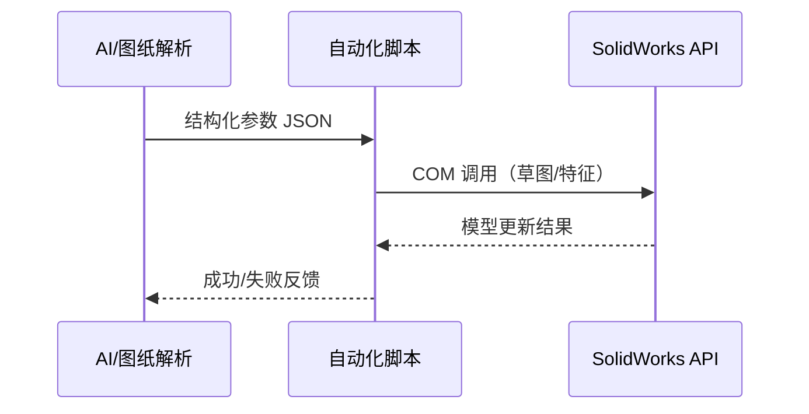

# P03 API 调试与流程确认

← [[P02-环境自动化准备]] | [[BV1Yo5D6TEVk-总览]] | 下一篇 → [[P04-参数化零件建模]]

## 视频信息

| 项目 | 内容 |
|------|------|
| 分集 | P03_API调试与流程确认_带字幕配音 |
| 时长 | 30 分 03 秒 |
| 链接 | [B 站 P3](https://www.bilibili.com/video/BV1Yo5D6TEVk?p=3) |

## 核心要点

1. **API 调试**是打通「AI 图纸理解 → SolidWorks 执行」的核心环节。
2. **流程确认**意味着端到端跑通：输入参数 → API 调用 → 模型变化可验证。
3. 本 P 是从「环境准备」到「实际建模」的桥梁。
4. 应在此 P 固化 **参数 schema**（字段名、单位、特征映射规则）。

## 详细笔记

### 1. API 调试（预期内容）

- 连接 SolidWorks 实例并获取 `ActiveDoc`
- 测试最小 API：新建草图、画矩形、拉伸切除等
- 调试 **图纸解析结果 → API 参数** 的映射
- 日志与断点：记录每次 API 调用的返回值与错误码

### 2. 流程确认（预期内容）

预期确认项：

- [ ] 图纸参数能正确传入脚本
- [ ] 脚本能稳定调用 SolidWorks
- [ ] 模型几何与预期一致（或误差可接受）
- [ ] 失败时有明确回滚/重试策略

### 3. 参数确认清单（建议模板）

| 参数名 | 来源（图纸/AI） | 单位 | 对应特征 |
|--------|----------------|------|----------|
| 示例：长度 L | 主视图尺寸 | mm | 拉伸深度 |
| 示例：直径 D | 剖视图 | mm | 旋转体 |

> 观看视频时在此表补充 UP 实际使用的字段。

### 4. 常见问题（预习）

- COM 对象释放不及时导致 SolidWorks 僵死
- 单位换算错误（mm/inch）
- 草图平面选择错误导致特征失败
- AI 输出缺字段时的默认策略

## 关键术语

| 术语 | 说明 |
|------|------|
| API 调试 | 逐步验证接口调用是否正确 |
| 流程确认 | 端到端验证业务链路 |
| 参数 schema | 参数数据结构约定 |
| FeatureManager | SolidWorks 特征管理 API 入口 |

## 与前后分 P 衔接

- ← **P02**：依赖已配置好的自动化环境
- → **P04**：流程确认后开始真正的零件建模生成

## 来源说明

- ✅ B 站元数据 + 系列逻辑推断 + 分 P 首帧封面
- ⏳ API 代码片段（待 Whisper 转写后摘录至 `04-代码脚本/`）

## 关键截图

![[../../06-资源附件/video-notes-images/BV1Yo5D6TEVk-P03-cover.jpg|B站首帧 P03]]
