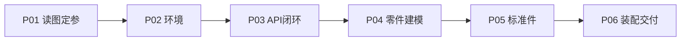

# P06 装配尝试与保存收尾

← [[BV1Yo5D6TEVk-总览]] | ← [[P05-装配体标准件生成]]

## 视频信息

| 项目 | 内容 |
|------|------|
| 分集 | P06_装配尝试与保存收尾_带字幕配音 |
| 时长 | 20 分 28 秒 |
| 链接 | [B 站 P6](https://www.bilibili.com/video/BV1Yo5D6TEVk?p=6) |
| 内容来源 | 知识点增强（SolidWorks API/机械设计体系，非逐字转写） |

## 核心要点

1. **本 P 主题**：装配尝试与保存收尾——系列第 6/6 步
2. **前置依赖**：需完成 P05（[[P05-装配体标准件生成]]）
3. **产出物**：装配体、干涉检查与最终交付
4. **学习侧重**：配合类型与 DOF、干涉检查、Pack and Go、全流程复盘
5. **笔记层级**：教程级（约 3211 字），含流水线图解、实操 Walkthrough、Checklist

> 以下内容基于 SolidWorks API 与机械设计知识体系撰写，对应 B 站分 P「P06_装配尝试与保存收尾_带字幕配音」。**非 UP 逐字转写**；不看视频可按 Walkthrough 纸面演练，看视频对照操作细节。

## 本节在系列中的位置

**系列第 6/6 步**：装配尝试与保存收尾。

**前置产出**：完成 [[P05-装配体标准件生成]] 的交付物。

**终点**：应能复盘 AI+API 全流程。

六步流水线：读图 → 环境 → API/Schema → 零件建模 → 标准件 → 装配交付。

## 3 分钟速览

**装配尝试与保存收尾**——产出：装配体、干涉检查与最终交付。重点：配合类型与 DOF、干涉检查、Pack and Go、全流程复盘。

## 零基础导读

本系列演示 **AI 读工程图 + SolidWorks API 自动建模装配**。P06「装配尝试与保存收尾」即使不看视频，也要弄清：本步**输入是什么、输出交给谁、失败如何排查**。

不要跳步：没有 P01 的参数 JSON，P04 脚本无米下锅；没有 P02 环境，P03 COM 调用必报错。

## 详细讲解

### 1. P06：装配、检查与交付收尾

系列最后一 P：将 P04/P05 零件**插入装配体**，添加配合约束，运行干涉检查，**保存并打包交付**。也是全流程复盘与局限讨论的起点。

### 2. 装配 API 基本流程

| 步骤 | API 思路 | 说明 |
|------|----------|------|
| 1 | NewDocument(.asmdot) | 新建装配体 |
| 2 | AddComponent4(path, x, y, z) | 插入零件，初始位置 |
| 3 | Fix 首个零件 | AssemblyDoc.FixComponent 或固定配合 |
| 4 | AddMate2 | 面重合、同心、距离等 |
| 5 | EditRebuild3 | 重建装配 |
| 6 | InterferenceDetection | 干涉检查 |
| 7 | SaveAs3 | 保存 .SLDASM |
| 8 | 可选 | Pack and Go、导出 STEP、BOM |

**配合前务必固定基准零件**（底座/机架），否则整个装配「飘移」。

### 3. 配合类型与自由度

| 配合 | 约束 DOF | 典型用途 |
|------|----------|----------|
| 重合 Coincident | 法向 + 位置 | 贴合面、共面 |
| 同心 Concentric | 轴线对齐 | 轴与孔、轴承 |
| 距离 Distance | 面间距 | 间隙、止口深度 |
| 平行 Parallel | 方向 | 导轨、侧板 |
| 垂直 Perpendicular | 方向 | 直角支架 |
| 角度 Angle | 转角 | 斜撑 |

**完全定位**：活动件剩余 6 个自由度应全部被配合约束（除故意留旋转的铰链）。**过约束**会报红，需删除冗余配合。

### 4. 推荐装配顺序

1. 固定基础零件（底座、框架）
2. 插入主要大件，添加主定位配合（面贴合 + 销孔同心）
3. 插入次要零件与盖板
4. 插入标准件（螺栓螺母：同心 + 重合，或使用 Smart Fasteners）
5. **干涉检查** InterferenceDetection
6. 爆炸视图（可选，用于说明或动画）

### 5. 干涉检查与验证

| 检查类型 | 工具/方法 |
|----------|-----------|
| 零件干涉 | 工具 → 评估 → 干涉检查 |
| 间隙验证 | 测量最小距离 |
| 质量属性 | 装配体质量、重心（仿真前） |
| 运动检查 | 配合正确时拖动零件应合理 |

API 调用干涉检测后，记录干涉体积与涉及零件，回 P04/P05 修改几何或配合。

### 6. 保存与工程交付

| 交付物 | 格式 | 用途 |
|--------|------|------|
| 装配体 | .SLDASM + 零件文件夹 | SolidWorks 原生编辑 |
| 便携包 | Pack and Go | 路径打包、外发 |
| 中立格式 | STEP / IGES | CAM、仿真、其他 CAD |
| 2D 图纸 | .SLDDRW | 加工图（可后续自动化） |
| 说明 | BOM Excel、截图、eDrawings | 沟通与归档 |

**命名与版本**：`项目号_装配体名_RevA.SLDASM`；重要里程碑 ZIP 备份。

### 7. 全流程回顾（P01–P06）

文字链：**图纸阅读 → 建模思路 JSON → 环境准备 → API 调试 → 参数化零件 → 复杂件/标准件 → 装配约束与保存**。

### 8. 局限与扩展方向

- 本系列为**流程演示**；工业级需 PLM、版本管理、变更流程
- AI 读图错误仍需人工复核，关键安全件必须签审
- 可扩展：有限元分析、工程图自动生成、MCP/Agent 驱动 SolidWorks、与 PLM/ERP 对接

### 9. 实践要点

- 配合前先 Fix 基准件；一次添加一组配合后重建
- 装配失败时 Suppress 配合逐个排查
- 保存前运行干涉检查；导出 STEP 供下游验证
- 写简短**复盘文档**：哪些步骤可全自动、哪些必须人工

### 实操要点（P06）

建议开双屏：左 Obsidian 笔记，右 SolidWorks + IDE。每完成一个 API 调用立即保存宏/脚本版本。遇到 COM 错误先查 `Visible` 与对象是否为 `None`，再查尺寸名是否与草图完全一致（区分大小写）。

## 图解

## 类比与直觉

装配像**拼乐高**：每件有编号（零件文件）和卡扣位置（配合面），干涉就是两块硬塞不进去。

## 例题与场景 Walkthrough

**Walkthrough：本步在流水线中的位置**

- **输入**：全部零件文件
- **操作**：配合类型与 DOF、干涉检查、Pack and Go、全流程复盘
- **输出**：装配体、干涉检查与最终交付
- **验收**：无干涉、配合正确、Pack and Go 可迁移

## 常见误区

1. **AI 读图 100% 准**：必须人工复核关键尺寸与视图对应。
2. **API 版本无关**：不同 SolidWorks 年份接口名可能变化，需查帮助。
3. **跳过草图约束**：未完全定义草图会导致特征失败或下游装配配合不上。
4. **标准件全建模**：螺栓螺母应优先 Toolbox，节省时间。

## 与视频对照表

| 视频段落（约） | 预期演示内容 | 笔记对应章节 |
|-------------|------------|------------|
| 开篇 0%–15% | 本集目标、背景、与前后集关系 | 本节位置、3 分钟速览 |
| 前段 15%–40% | 核心概念定义与架构图 | 零基础导读、详细讲解 |
| 中段 40%–70% | 原理展开、对比、政策/代码示例 | 图解、类比、Walkthrough |
| 后段 70%–90% | 案例、问答、易错点 | 常见误区、Checklist |
| 收尾 90%–100% | 总结、延伸资源 | 延伸阅读、自测题 |

> 本集总时长约 **20分28秒**。无官方外挂字幕时，以分 P 标题「装配尝试与保存收尾」与上表主题对齐视频画面。

## 动手实践 Checklist

- [ ] 完成本步 UP 演示复现
- [ ] 提交/保存本步产出文件
- [ ] 记录 1 个 API 踩坑
- [ ] 阅读 SolidWorks API Help 相关方法
- [ ] 准备下一步输入物

## 延伸阅读

- [SolidWorks API Help](https://help.solidworks.com/)
- pywin32 文档
- GB/T 4458 机械制图标准
- 本系列相邻分 P 笔记

## 自测题

1. **本步产出？**  **答**：装配体、干涉检查与最终交付。
2. **关键 API/概念？**  **答**：配合类型与 DOF、干涉检查、Pack and Go、全流程复盘。
3. **上一步依赖？**  **答**：装配体标准件生成。
4. **常见失败？**  **答**：见「常见误区」与视频排错片段。
5. **如何自测？**  **答**：独立完成 Checklist 第一项。

## 关键术语

| 术语 | 说明 |
|------|------|
| AddMate2 | 添加装配配合约束 |
| 干涉检查 | InterferenceDetection 发现体积重叠 |
| Pack and Go | 打包装配体及引用零件 |
| STEP | 中立 CAD 交换格式 |

## 与前后分 P 的衔接

- ← **P05_复杂零件与标准件完善_带字幕配音**（[[P05-装配体标准件生成]]）
- → 系列终点

## 逐字转写
> 状态：待转写。运行 `Tools/transcribe/transcribe.ps1 -Bvid BV1Yo5D6TEVk -Part 6` 补充。

## 来源说明

- ✅ B 站官方元数据（`Tools/BV1Yo5D6TEVk-full.json`）
- ✅ 分 P 首帧封面（`Tools/bili-fetch/fetch-bilibili.js`）
- ✅ **教程级增强**：含 Mermaid 流水线、实操 Walkthrough、自测题（约 3211 字，2026-06-06）
- ⏳ 逐字转写：API 无外挂字幕轨；可选 Whisper/BiliNote 后续补充

## 关键截图

![[../../06-资源附件/video-notes-images/BV1Yo5D6TEVk-P06-cover.jpg|B站首帧 P06]]
