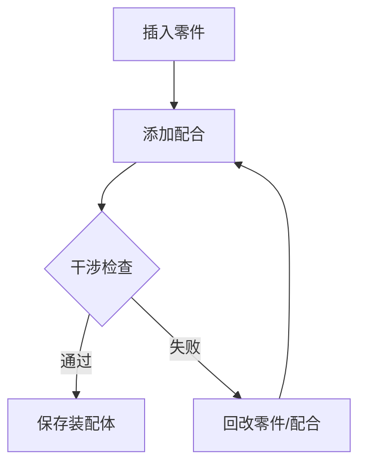

# P06 装配尝试与保存收尾

← [[P05-装配体标准件生成]] | [[BV1Yo5D6TEVk-总览]]

## 视频信息

| 项目 | 内容 |
|------|------|
| 分集 | P06_装配尝试与保存收尾_带字幕配音 |
| 时长 | 20 分 28 秒 |
| 链接 | [B 站 P6](https://www.bilibili.com/video/BV1Yo5D6TEVk?p=6) |

## 核心要点

1. 系列 finale：将前 5 P 产出的零件 **尝试装配** 为总成。
2. 「尝试」表明可能有配合调整、干涉排查、迭代修正。
3. **保存收尾**包括装配体、工程图（若有）、项目归档。
4. 完成后即实现简介所述全流程：**图纸 → AI → SolidWorks 建模 → 装配**。

## 详细笔记

### 1. 装配尝试（预期）

- 新建 `AssemblyDoc`，插入 P04/P05 零件
- 添加配合：重合、同心、距离、角度等
- 使用 **干涉检查** 发现冲突
- 必要时返回零件级修改（参数或特征）

### 2. 保存与收尾（预期）

| 交付物 | 格式 | 建议路径 |
|--------|------|----------|
| 装配体 | `.sldasm` | `Projects/` |
| 零件文件 | `.sldprt` | `Projects/` |
| 项目笔记 | `.md` | `05-项目实践/` |
| 截图/录屏 | 图片 | `06-资源附件/` |

### 3. 流程复盘（预期）

- 回顾 AI 识图准确率与需人工干预的环节
- 总结 API 自动化覆盖率（哪些步骤仍须手动）
- 为下一个图纸案例建立改进清单

### 4. 系列总结

| 阶段 | 分 P | 产出 |
|------|------|------|
| 需求 | P01 | 建模思路 |
| 环境 | P02 | 可编程 SW 环境 |
| 联调 | P03 | 通顺的 API 流程 |
| 建模 | P04 | 基础零件 |
| 完善 | P05 | 复杂件+标准件 |
| 交付 | P06 | 装配体 |

## 关键术语

| 术语 | 说明 |
|------|------|
| 配合 Mate | 定义零件间相对位置关系 |
| 干涉 Interference | 零件体积重叠，装配错误信号 |
| 装配体 | 多零件组合的三维模型 |
| 收尾 | 保存、归档、文档化 |

## 来源说明

- ✅ B 站元数据 + 分 P 首帧封面
- ⏳ 装配操作录屏转写（待 Whisper 转写）

## 关键截图

![[../../06-资源附件/video-notes-images/BV1Yo5D6TEVk-P06-cover.jpg|B站首帧 P06]]
