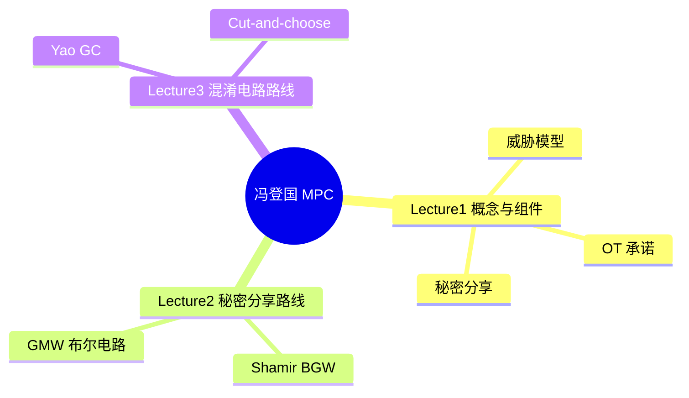
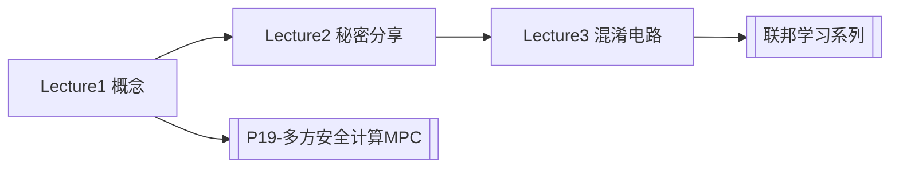

# 安全多方计算（MPC）—— 冯登国原院士

> 冯登国院士系统讲授安全多方计算（MPC）理论与协议，B 站合集共 **3** 讲（约 5h 30m 35s）。
>
> 各分 P 笔记已升级为 **教程级**（约 2500–3500 字/篇，含 Mermaid、Walkthrough、自测题，2026-06-07）。B 站 API 无外挂字幕，逐字稿可后续用 Whisper/BiliNote 补充。

## 视频简介（B 站合集）

网络空间安全领域经典 MPC 课程，涵盖基本概念、秘密分享协议族与混淆电路方法。

## 视频数据

| 字段 | 内容 |
|------|------|
| BV 号（合集入口） | BV16j411q7pf |
| UP 主 | 3cH0_Nu1L |
| 总时长 | 5h 30m 35s（19835 秒） |
| 分 P 数 | 3 |
| 播放量 | 11,494（合集抓取时） |
| 收藏 | 395 |
| 标签 | 人工智能、AI、编程、计算、MPC、计算机科学、安全、密码学、网络空间安全、热议日本排放核废水 |
| 字幕状态 | 无外挂字幕轨（视频为内嵌配音字幕，API 返回空列表） |

## 思维导图

## 分 P 索引

| 分 P | B 站分集标题 | 时长 | 字数 | 笔记 |
|------|-------------|------|------|------|
| P01 | Lecture 1 安全多方计算（MPC）的基本概念及基础组件 —— 冯登国院士 | 88分33秒 | ~4828 | [[P01-安全多方计算的基本概念及基础组件--]] |
| P02 | Lecture 2 基于秘密分享方法的 MPC 协议 —— 冯登国院士 | 130分37秒 | ~4225 | [[P02-基于秘密分享方法的MPC协议--]] |
| P03 | Lecture 3 基于混淆电路方法的 MPC 协议 —— 冯登国院士 | 111分25秒 | ~4782 | [[P03-基于混淆电路方法的MPC协议--]] |

## 学习路径

1. **Lecture 1** — MPC 定义、威胁模型、OT/承诺/秘密分享基础组件
2. **Lecture 2** — Shamir、BGW、GMW 等算术/布尔电路协议
3. **Lecture 3** — Yao 混淆电路、OT 扩展、Cut-and-choose 恶意安全

## 关联资源

- API 数据：`Tools/BV16j411q7pf-full.json`
- 生成脚本：`Tools/bili-fetch/generate-mpc-notes.js`
- 增强脚本：`Tools/bili-fetch/enhance-mpc-notes.js`
- 封面：[[../../06-资源附件/video-notes-images/]]
- 思维导图：[[思维导图]]
- 交叉引用：[[BV1ser5BDESU-总览]] [[P19-多方安全计算MPC]] · [[BV1q4421A72h-总览]] 联邦学习

## 待补充

- [ ] 教程级知识点增强（3 篇）
- [ ] Whisper 逐字转写
- [ ] 板书公式截图
