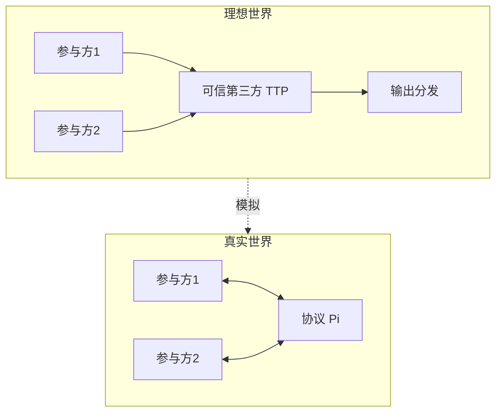

# P01 Lecture 1 安全多方计算（MPC）的基本概念及基础组件 —— 冯登国院士

← [[BV16j411q7pf-总览]] | 下一篇 → [[P02-基于秘密分享方法的MPC协议--]]

## 视频信息

| 项目 | 内容 |
|------|------|
| 分集 | Lecture 1 安全多方计算（MPC）的基本概念及基础组件 —— 冯登国院士 |
| 模块 | MPC 基本概念与基础组件 |
| 时长 | 88 分 33 秒 |
| 链接 | [B 站 Lecture 1](https://www.bilibili.com/video/BV16j411q7pf) |
| 内容来源 | 教程级知识点增强（非 UP 逐字转写） |

## 核心要点

1. **本 P 主题**：Lecture 1 安全多方计算（MPC）的基本概念及基础组件
2. **模块定位**：MPC 基本概念与基础组件
3. **研读侧重**：MPC 定义、理想/真实范式、半诚实/恶意敌手、OT、承诺、秘密分享入门
4. **笔记层级**：教程级（约 4828 字），含速览、Mermaid、Walkthrough、自测题
5. **学习建议**：先读「3 分钟速览」与「图解」，再深入「详细讲解」

> 以下内容基于 MPC 密码学理论体系撰写，对应冯登国院士 B 站课程「Lecture 1 安全多方计算（MPC）的基本概念及基础组件 —— 冯登国院士」。**非 UP 逐字转写**；不看视频可建立框架，看视频对照「与视频对照表」。

## 本节在系列中的位置

**模块**：MPC 基本概念与基础组件 · 系列第 **P01/3** 讲（Lecture 1）。

**系列起点**：建议先浏览 [[BV16j411q7pf-总览]] 把握三讲路线图（概念→秘密分享→混淆电路）。

**建议后续**：[[P02-基于秘密分享方法的MPC协议--]]——在 OT/承诺/分享基础上构建算术与布尔协议。

## 3 分钟速览

**Lecture 1** 建立 MPC 形式化定义、理想/真实范式、半诚实与恶意威胁模型，并介绍 OT、承诺、秘密分享三大基础组件。读完应能：① 口述百万富翁问题；② 区分敌手类型；③ 说明 OT/承诺在协议中的角色。考点：**MPC 定义、威胁模型、OT、承诺、秘密分享入门**。

## 零基础导读

冯登国院士本讲是**理论密码学视角**的 MPC 入门。即便未看视频，也应先建立「理想功能—真实协议—模拟器证明」三段论。第一遍盯住定义与威胁模型；第二遍对照 [[P19-多方安全计算MPC]]（数据要素工程课）看同一概念在 SecretFlow/SPU 中的落点。

## 详细讲解

### 1. 安全多方计算（MPC）定义

**安全多方计算**（Secure Multi-Party Computation, MPC）研究：$n$ 个参与方 $P_1,\ldots,P_n$ 各自持有私有输入 $x_1,\ldots,x_n$，希望联合计算函数

$$f(x_1,\ldots,x_n) = (y_1,\ldots,y_n)$$

使得每方 $P_i$ 仅学到自己的输出 $y_i$，且除 $f$ 所蕴含的信息外，无法推断他人输入的额外内容。

经典动机是姚期智 1982 年提出的**百万富翁问题**：Alice 与 Bob 想知道谁更富有，但不愿透露各自财富数值。形式化后，$f(x_A,x_B)=(x_A>x_B)$，双方只应学到比较结果。

MPC 与「数据不出域联合统计」直接对应：医院、银行、政务机构可在**不汇聚明文**的前提下完成求和、比较、机器学习训练、SQL 查询等。

### 2. 理想功能与真实协议

密码协议设计常用**理想/真实范式**（Ideal/Real Paradigm）：

| 范式 | 含义 |
|------|------|
| 理想世界 | 存在可信第三方 TTP，各方将输入交给 TTP，TTP 计算 $f$ 并分发输出 |
| 真实世界 | 无 TTP，各方运行协议 $\Pi$，通过消息交互模拟理想功能 |
| 安全性 | 真实执行中任意敌手所能学到的信息，不超过理想世界中同等限制 |

**理想功能** $\mathcal{F}$ 是对「可信第三方做什么」的精确描述；协议 $\Pi$ 的目标是**安全实现** $\mathcal{F}$。

### 3. 威胁模型：半诚实与恶意

| 敌手类型 | 行为假设 | 协议代价 | 典型保证 |
|----------|----------|----------|----------|
| **半诚实**（Semi-honest / Honest-but-curious） | 遵守协议步骤，但试图从收到的消息推断秘密 | 较低 | 模拟器存在性证明 |
| **恶意**（Malicious / Byzantine） | 可任意偏离协议、篡改消息、提前中止 | 较高 | 零知识证明、MAC、Cut-and-choose |
| **隐蔽**（Covert） | 作恶会被以一定概率检测 | 中等 | 介于半诚实与恶意之间 |
| **诚实多数** | 少于 $t<n/2$（或 $t<n/3$）方作恶 | 可容错广播 | BGW、GMW 恶意扩展 |

**编译器定理**（半诚实→恶意）：在存在承诺方案与零知识证明的前提下，可将半诚实协议编译为恶意安全协议，代价是通信与轮次显著增加。

### 4. 安全性定义（直观）

对参与方集合 $I \subseteq \{1,\ldots,n\}$ 的**敌手联盟**，若存在**模拟器** $\mathcal{S}$，使得敌手在真实协议中的视图与模拟器仅凭输入/输出生成的视图**计算不可区分**，则称协议对 $I$-敌手安全。

两方情形常写：Alice 的视图 $\mathsf{View}_A^\Pi(x_A,x_B)$ 可由模拟器 $\mathcal{S}_A(x_A,y_A)$ 模拟，其中 $y_A$ 为 Alice 的输出。

### 5. 基础密码组件：不经意传输（OT）

**1-out-of-2 不经意传输** $\binom{2}{1}\text{-OT}$：发送方有两条消息 $m_0,m_1$，接收方有选择位 $b\in\{0,1\}$，接收方仅学到 $m_b$，发送方不知 $b$。

OT 是 MPC 的**完备原语**：理论上可用 OT 实现任意两方计算。工程上 OT 用量巨大，故发展 **OT 扩展**（Ishai-Kilian-Nissim-Petrank）用少量「种子 OT」生成海量 OT。

**茫然传输**（OT 的对称变体）与 **OT 组合** 是 Lecture 3 混淆电路的前置。

### 6. 基础密码组件：承诺方案（Commitment）

承诺方案包含两阶段：

1. **承诺** $\mathsf{Com}(m;r)$：发布绑定于消息 $m$ 的 commitment，随机数 $r$ 保密
2. **打开** $(m,r)$：揭示 $m$，验证与承诺一致

性质：
- **隐藏性**（Hiding）：承诺前敌手无法获知 $m$
- **绑定性**（Binding）：无法对同一承诺打开为两个不同 $m$

在恶意安全 MPC 中，参与方先承诺输入/中间值，再打开验证，防止事后篡改。Pedersen 承诺、Hash 承诺（随机预言机模型）是常见实例。

### 7. 秘密分享入门

**秘密分享**将秘密 $s$ 拆成 $n$ 份份额 $\{s_i\}$，满足：
- **重构**：合法集合 $S$（如 $|S|\geq t+1$）可恢复 $s$
- **隐私**：少于阈值的份额不泄露 $s$ 的任何信息

**加法秘密分享**（Shamir 特例 $t=n-1$）：$s=s_1+\cdots+s_n \pmod p$，各方持 $s_i$，重构时求和。加法本地可算，**乘法**需交互——这是 BGW/GMW 的核心难点。

Lecture 2 将深入 Shamir 门限方案与 BGW 乘法门。

### 8. MPC 两大技术路线预览

| 路线 | 表示 | 强项 | 弱项 |
|------|------|------|------|
| **秘密分享** | 算术/布尔电路，份额上计算 | 多方 $n>2$、加法浅 | 乘法通信轮次多 |
| **混淆电路** | 布尔电路，Yao 加密门 | 两方布尔运算高效 | 电路大小、恶意安全开销 |

冯登国课程第二讲走秘密分享，第三讲走混淆电路；与 [[P19-多方安全计算MPC]]（数据要素课工程视角）形成理论—工程互补。

### 9. 复杂度与工程考量

- **通信量**：与电路规模 $|C|$、域大小、安全参数 $\lambda$ 相关
- **轮次**：BGW 乘法需多轮；GC 常「常数轮」但预处理重
- **参与方数**：GC 天然偏两方；SS 可扩展至多方
- **恶意安全**：常增加 10×–100× 开销

### 10. 本讲学习要点

- 口述 MPC 定义与理想/真实范式
- 区分半诚实与恶意敌手，各举一种防御技术
- 说明 OT 与承诺在协议中的角色
- 画出秘密分享 vs 混淆电路选型决策树

### 与数据要素 / 联邦学习交叉链接

| 本讲概念 | 数据要素课 | 联邦学习课 |
|----------|------------|------------|
| MPC 定义 | [[P19-多方安全计算MPC]] | [[P01-FederatedLearning简介]] 协作学习含 MPC |
| 秘密分享 | [[P27-密态计算单元SPU]] | SecAgg 类似加法分享 |
| OT / PSI | [[P28-隐私集合求交PSI]] | — |
| 威胁模型 | [[P06-数据要素安全分级-隐私计算产品安全能力分级要求]] | [[P09-SimonsInstitute联邦学习&协作学习3SurveyonPrivacy-Secu]] |

### 百万富翁问题 Walkthrough

Alice 输入 $x$，Bob 输入 $y$，目标 $x>y$？

1. 将比较编译为布尔电路或算术比较协议
2. 半诚实：可用 GC 或 OT-based 比较
3. 输出 1 bit，双方仅知比较结果
4. 模拟器：已知 Alice 输出与 $x$，可伪造 Bob 视图

## 图解

## 类比与直觉

MPC 像**蒙眼合唱评分**：评委（协议）只公布加权总分（函数输出），每位歌手（参与方）听不到他人音准（输入），也无法从总分反推别人唱了多少（模拟器不可区分）。

## 例题与场景 Walkthrough

**场景：三家医院求区域患病率（不泄露各院病例数）**

1. **功能定义**：$f(n_1,n_2,n_3)=(n_1+n_2+n_3)/N$，各方只应得聚合率。
2. **威胁建模**：院方半诚实？外包平台恶意？选定 $t<n/2$ 或 Cut-and-choose 路线。
3. **技术选型**：纯加法→秘密分享即可；若需比较阈值→加 OT 或布尔电路。
4. **组件清单**：Shamir 分享患病率分子、承诺各院输入防篡改。
5. **验收**：写模拟器论证「单院视图」仅泄露聚合结果。

## 常见误区

1. **「MPC=联邦学习」**：FL 侧重梯度聚合与 Non-IID；MPC 是更一般的「任意函数」安全计算。
2. **「半诚实够用」**：外包或竞争方场景常需恶意安全。
3. **「OT 只用于 GC」**：OT 也是 GMW、PSI 等的基础（见 [[P28-隐私集合求交PSI]]）。
4. **「承诺可有可无」**：恶意协议中承诺是防止输入替换的关键。

## 与视频对照表

| 视频段落（约） | 预期演示内容 | 笔记对应章节 |
|-------------|------------|------------|
| 开篇 0%–15% | 本集目标、背景、与前后集关系 | 本节位置、3 分钟速览 |
| 前段 15%–40% | 核心概念定义与架构图 | 零基础导读、详细讲解 |
| 中段 40%–70% | 原理展开、对比、政策/代码示例 | 图解、类比、Walkthrough |
| 后段 70%–90% | 案例、问答、易错点 | 常见误区、Checklist |
| 收尾 90%–100% | 总结、延伸资源 | 延伸阅读、自测题 |

> 本集总时长约 **88分33秒**。无官方外挂字幕时，以分 P 标题「Lecture 1 安全多方计算（MPC）的基本概念及基础组件」与上表主题对齐视频画面。

## 动手实践 Checklist

- [ ] 默写百万富翁问题的 $f$ 定义
- [ ] 画理想/真实世界对比表
- [ ] 阅读 [[P19-多方安全计算MPC]] 对照工程术语
- [ ] 列举 OT 在后续 Lecture 2/3 的两处用途
- [ ] 完成自测 Q1–Q5

## 延伸阅读

- Yao, *How to Generate and Exchange Secrets* (1986)
- Goldreich, *Foundations of Cryptography* Vol.2
- [[P19-多方安全计算MPC]] · [[P26-隐私计算密码库YACL]]
- [[BV1q4421A72h-总览]] 联邦学习（协作学习含 MPC 训练）

## 自测题

1. **MPC 形式化目标？**  
   **答**：计算 $f(x_1,\ldots,x_n)$，各方仅得 $y_i$，不泄露超出 $f$ 的额外信息。

2. **半诚实与恶意区别？**  
   **答**：半诚实遵守协议但好奇；恶意可任意偏离，需 ZK/承诺/Cut-and-choose 等。

3. **OT 保证什么？**  
   **答**：接收方只得 $m_b$，发送方不知选择位 $b$。

4. **承诺两性质？**  
   **答**：隐藏性 + 绑定性。

5. **下一讲主题？**  
   **答**：Shamir、BGW、GMW 秘密分享协议。

## 关键术语

| 术语 | 说明 |
|------|------|
| MPC | 多方在不泄露私有输入下联合计算函数 |
| 模拟器 | 证明真实协议不泄露超过理想功能的视图生成器 |
| 半诚实敌手 | 遵守协议但试图推断他人秘密 |
| 恶意敌手 | 可任意偏离协议与篡改消息 |
| OT | 发送方两条消息，接收方择一收取且选择保密 |
| 承诺 | 先承诺后打开，具隐藏性与绑定性 |

## 与前后分 P 的衔接

- ← 系列起点，见 [[BV16j411q7pf-总览]]
- → **Lecture 2 基于秘密分享方法的 MPC 协议 —— 冯登国院士**（[[P02-基于秘密分享方法的MPC协议--]]）

## 逐字转写

> 状态：待转写。运行 `Tools/transcribe/transcribe.ps1 -Bvid BV16j411q7pf -Part 1` 补充（合集 Lecture 1 对应独立 BV）。

## 来源说明

- ✅ B 站官方元数据（`Tools/BV16j411q7pf-full.json`）
- ✅ 分 P 首帧封面（`Tools/bili-fetch/fetch-bilibili.js`）
- ✅ **教程级增强**：含 Mermaid、Walkthrough、自测题（约 4828 字，2026-06-07）
- ⏳ 逐字转写：B 站 API 无外挂字幕轨；可选 Whisper/BiliNote 后续补充

## 关键截图

![[../../06-资源附件/video-notes-images/BV16j411q7pf-P01-cover.jpg|B站首帧 P01]]
