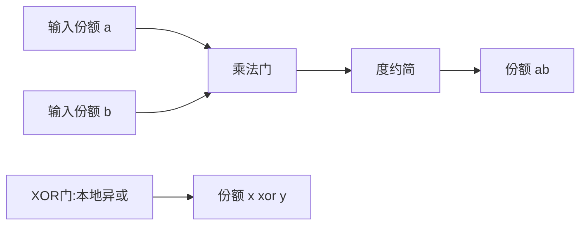

# P02 Lecture 2 基于秘密分享方法的 MPC 协议 —— 冯登国院士

← [[BV16j411q7pf-总览]] | ← [[P01-安全多方计算的基本概念及基础组件--]] | 下一篇 → [[P03-基于混淆电路方法的MPC协议--]]

## 视频信息

| 项目 | 内容 |
|------|------|
| 分集 | Lecture 2 基于秘密分享方法的 MPC 协议 —— 冯登国院士 |
| 模块 | 基于秘密分享的 MPC |
| 时长 | 130 分 37 秒 |
| 链接 | [B 站 Lecture 2](https://www.bilibili.com/video/BV1Z8411Q7Af) |
| 内容来源 | 教程级知识点增强（非 UP 逐字转写） |

## 核心要点

1. **本 P 主题**：Lecture 2 基于秘密分享方法的 MPC 协议
2. **模块定位**：基于秘密分享的 MPC
3. **研读侧重**：Shamir 门限分享、BGW 度约简、GMW AND 门、Beaver 三元组、BGW vs GMW
4. **笔记层级**：教程级（约 4225 字），含速览、Mermaid、Walkthrough、自测题
5. **学习建议**：先读「3 分钟速览」与「图解」，再深入「详细讲解」

> 以下内容基于 MPC 密码学理论体系撰写，对应冯登国院士 B 站课程「Lecture 2 基于秘密分享方法的 MPC 协议 —— 冯登国院士」。**非 UP 逐字转写**；不看视频可建立框架，看视频对照「与视频对照表」。

## 本节在系列中的位置

**模块**：基于秘密分享的 MPC · **P02/3**（Lecture 2，约 2h10m）。

**前置**：[[P01-安全多方计算的基本概念及基础组件--]] 中秘密分享与威胁模型。

**后续**：[[P03-基于混淆电路方法的MPC协议--]]——布尔电路的另一实现路线。

## 3 分钟速览

**Lecture 2** 深入 Shamir 门限分享、BGW 算术电路协议、GMW 布尔电路协议。考点：**$(t,n)$ 门限、度约简、Beaver 三元组、BGW vs GMW 选型**。

## 零基础导读

本讲是 MPC **多方路线**的核心。需熟练有限域运算与多项式插值。阅读时建议手推 $(2,3)$ Shamir 重构，再对照 BGW 乘法门理解「为何本地乘份额不够」。

## 详细讲解

### 1. Shamir 门限秘密分享

设素数 $p > n$，秘密 $s \in \mathbb{F}_p$。随机选取次数 $\leq t$ 的多项式

$$f(x) = s + a_1 x + \cdots + a_t x^t \pmod p$$

第 $i$ 方份额为 $s_i = f(i)$。任意 $t+1$ 个份额可用**拉格朗日插值**重构 $f(0)=s$；$t$ 个或更少份额对 $s$ 提供**信息论零知识**。

**性质**：
- **线性**：若 $s=s^A+s^B$，份额可本地相加
- **乘法困难**：$s_i$ 与 $t_i$ 的乘积一般不是 $st$ 的有效份额，需 **BGW 乘法门**

门限 $t$ 表示最多容忍 $t$ 方合谋不泄露秘密；诚实多数常取 $t < n/2$。

### 2. 算术电路上的 MPC：BGW 协议

Ben-Or-Goldwasser-Wigderson (1988) 在**半诚实、诚实多数**（$t<n/2$）假设下，对域 $\mathbb{F}_p$ 上的算术电路 $C$ 实现 MPC。

**加法门**：各方本地将输入份额相加，零通信。

**乘法门**：输入份额 $[a],[b]$，目标得 $[ab]$。

核心步骤（度约简）：
1. 本地计算 $c_i = a_i \cdot b_i$（度 $2t$ 多项式在 $i$ 点的值）
2. **重分享** / **度约简**：将 $c_i$ 转为次数 $\leq t$ 的 $[ab]$ 份额，需交互与随机化
3. 利用 $t<n/2$ 保证恶意份额可被后续检测（半诚实下直接可行）

**通信复杂度**：电路深度 $d$、乘法门数 $M$ 决定总通信；每层乘法一轮交互。

### 3. BGW 乘法门 Walkthrough（两方简化直觉）

虽 BGW 面向多方，理解两方乘法有助于把握「本地乘份额不够」：

- Alice 持 $[a]$，Bob 持 $[b]$
- 若各自算 $a_i b_i$ 并相加，得到的是交叉项之和，**不等于** $ab$ 的分享
- 需引入**随机掩码**与**重线性化**，使结果多项式次数回到 $t$

多方时，利用 Vandermonde 矩阵与纠错码思想完成度约简。

### 4. GMW 协议（Goldreich-Micali-Wigderson）

GMW 在**布尔电路**上操作，基于 **XOR 秘密分享**（$\mathbb{F}_2$ 加法分享）：

- **XOR 门**：份额异或，本地完成
- **AND 门**：需 **Beaver 三元组** $(a,b,c)$ 其中 $c=ab$，或调用 OT

每遇到一个 AND，参与方通过 OT 交换掩码信息，使得最终得到 $[z]$ 且 $z = x \land y$。

**半诚实 GMW**：通信轮次 $\approx$ 电路深度；门数 $|C|$ 个 AND 即 $|C|$ 次 OT 批量。

**恶意 GMW**：需对 Beaver 三元组做**认证**、对输入做承诺与 ZK 证明，开销跃升。

### 5. BGW vs GMW 对比

| 维度 | BGW（算术） | GMW（布尔） |
|------|-------------|-------------|
| 电路类型 | $+ \times$ 模 $p$ | AND / XOR |
| 域 | 大素数域 $\mathbb{F}_p$ | $\mathbb{F}_2$ |
| 乘法/AND | 度约简 | OT + Beaver |
| 诚实多数 | $t<n/2$ | 可扩展恶意编译 |
| 适用 | 线性代数、ML 多项式 | 比较、位运算 |

现代框架（如 SPDZ、ABY）常**混合**：算术子电路用 BGW/SPDZ，比较子电路用布尔或 Yao。

### 6. 随机掩码与 Beaver 三元组

**Beaver 三元组**预处理：离线生成随机 $[a],[b],[c]$ 满足 $c=ab$。在线计算 $[x],[y]$ 的 AND：

$$[z] = [c] \oplus d \cdot [b] \oplus e \cdot [a] \oplus d \cdot e$$

其中 $d=x\oplus a$，$e=y\oplus b$ 可公开（掩码随机性保证安全）。

预处理可外包或 MPC 自身生成，是**离线/在线**范式核心。

### 7. 恶意安全扩展（概述）

半诚实 BGW/GMW 通过以下技术升级恶意安全：
- **认证秘密分享**（MAC on shares）：每份额带认证标签，检测篡改
- **输入承诺 + 一致性 ZK**：证明份额与承诺一致
- **广播与可验证秘密分享（VSS）**：Dealer 无法分发不一致份额

SPDZ 路线：离线使用 somewhat homomorphic encryption 生成 MAC 分享，在线极快。

### 8. 通信与轮次分析

设电路有 $M$ 个乘/AND 门、深度 $d$：
- BGW：约 $O(M \cdot n^2)$ 域元素通信（常数因实现而异）
- GMW：约 $O(M)$ 次 OT，每批 OT 经扩展可摊销

**瓶颈**：深度深的电路 → 轮次多；宽电路 → 单轮数据量大。工程上需**电路优化**（乘法深度最小化）。

### 9. 与工业实现的衔接

| 理论组件 | 工程对应 |
|----------|----------|
| Shamir/BGW | 多方统计、SPDZ-family |
| GMW + OT | ABY 框架布尔层 |
| 预处理 | Offline phase、密钥材料分发 |
| 恶意安全 | MAC、审计日志 |

数据要素课 [[P26-隐私计算密码库YACL]]、[[P27-密态计算单元SPU]] 在工程层封装上述原语；本讲提供协议层理解。

### 10. 本讲学习要点

- 手推 Shamir $(2,3)$ 门限重构公式
- 解释 BGW 乘法为何需要度约简
- 对比 GMW 中 XOR 与 AND 的通信差异
- 说明 Beaver 三元组在 AND 门中的作用

### BGW 乘法门步骤表

| 步骤 | 参与方操作 | 通信 |
|------|------------|------|
| 1 | 计算 $c_i=a_i b_i$ | 无 |
| 2 | 度约简协议 | $O(n^2)$ 域元素 |
| 3 | 得 $[ab]$ 次数 $\leq t$ | — |

### Beaver 三元组 AND 公式回顾

$d=x\oplus a$，$e=y\oplus b$（公开），$[z]=[c]\oplus d[b]\oplus e[a]\oplus de$。

### 与联邦学习 SecAgg 对比

联邦 [[P05-可扩展且保护隐私的联邦主成分分析]] 中 SecAgg 保护**加法**聚合；BGW 解决**乘法**——ML 中矩阵乘含大量乘法门，故联合训练常结合 FL（本地乘）+ MPC（安全乘）或专用协议。

## 图解

## 类比与直觉

Shamir 分享像**把保险柜密码拆成三把钥匙**：任意两把能开，单把毫无信息。BGW 乘法像**两把钥匙临时拼成新锁**，拼完还得再拆回两把钥匙（度约简）。

## 例题与场景 Walkthrough

**纸面演练：三方安全求 $s=s_1+s_2+s_3$ 的乘积**

1. 各方将 $s_i$ 用 Shamir 分享为 $[s_i]$
2. 本地计算 $[s_1+s_2+s_3]$：份额相加（加法免费）
3. 若需 $[s_1 \cdot s_2]$：执行 BGW 乘法门（度约简 + 随机掩码）
4. 重构得乘积（仅授权方）
5. 恶意情形：为份额加 MAC（SPDZ 思路）

## 常见误区

1. **「Shamir 只能加法」**：可乘法，但需交互。
2. **「BGW 不需诚实多数」**：经典 BGW 半诚实要求 $t<n/2$。
3. **「GMW 只用于两方」**：可多方，AND 门 OT 数量随方数增。
4. **「预处理可忽略」**：Beaver 三元组离线成本常占主导。

## 与视频对照表

| 视频段落（约） | 预期演示内容 | 笔记对应章节 |
|-------------|------------|------------|
| 开篇 0%–15% | 本集目标、背景、与前后集关系 | 本节位置、3 分钟速览 |
| 前段 15%–40% | 核心概念定义与架构图 | 零基础导读、详细讲解 |
| 中段 40%–70% | 原理展开、对比、政策/代码示例 | 图解、类比、Walkthrough |
| 后段 70%–90% | 案例、问答、易错点 | 常见误区、Checklist |
| 收尾 90%–100% | 总结、延伸资源 | 延伸阅读、自测题 |

> 本集总时长约 **130分37秒**。无官方外挂字幕时，以分 P 标题「Lecture 2 基于秘密分享方法的 MPC 协议」与上表主题对齐视频画面。

## 动手实践 Checklist

- [ ] 手推 Shamir 拉格朗日重构 $(2,3)$
- [ ] 列出 BGW 一轮乘法的消息类型
- [ ] 解释 Beaver 三元组在线公式四项含义
- [ ] 对比 BGW 与 GMW 的电路表示
- [ ] 查阅 SPDZ 论文摘要了解 MAC 分享

## 延伸阅读

- Shamir, *How to Share a Secret* (1979)
- Ben-Or-Goldwasser-Wigderson (1988)
- Goldreich-Micali-Wigderson (1987)
- Damgård et al., SPDZ (2012)
- [[P27-密态计算单元SPU]] · [[P29-安全协作查询语言SCQL]]

## 自测题

1. **Shamir $(t,n)$ 含义？**  
   **答**：$n$ 份份额，任意 $t+1$ 份重构，$t$ 份不泄露。

2. **BGW 乘法瓶颈？**  
   **答**：本地乘份额使多项式次数翻倍，需度约简。

3. **GMW 中 AND 门依赖？**  
   **答**：OT 或 Beaver 三元组。

4. **XOR 门为何便宜？**  
   **答**：$\mathbb{F}_2$ 加法分享可本地异或。

5. **与 Lecture 3 分工？**  
   **答**：Lecture 2 多方算术/布尔分享；Lecture 3 两方 GC。

## 关键术语

| 术语 | 说明 |
|------|------|
| MPC | 多方在不泄露私有输入下联合计算函数 |
| 模拟器 | 证明真实协议不泄露超过理想功能的视图生成器 |
| Shamir 分享 | $(t,n)$ 门限，$t+1$ 份重构秘密 |
| BGW | 诚实多数下算术电路 MPC，乘法门需度约简 |
| GMW | 布尔电路 MPC，XOR 本地、AND 用 OT |
| Beaver 三元组 | 离线预处理 $c=ab$ 用于在线 AND |

## 与前后分 P 的衔接

- ← **Lecture 1 安全多方计算（MPC）的基本概念及基础组件 —— 冯登国院士**（[[P01-安全多方计算的基本概念及基础组件--]]）
- → **Lecture 3 基于混淆电路方法的 MPC 协议 —— 冯登国院士**（[[P03-基于混淆电路方法的MPC协议--]]）

## 逐字转写

> 状态：待转写。运行 `Tools/transcribe/transcribe.ps1 -Bvid BV1Z8411Q7Af -Part 1` 补充（合集 Lecture 2 对应独立 BV）。

## 来源说明

- ✅ B 站官方元数据（`Tools/BV16j411q7pf-full.json`）
- ✅ 分 P 首帧封面（`Tools/bili-fetch/fetch-bilibili.js`）
- ✅ **教程级增强**：含 Mermaid、Walkthrough、自测题（约 4225 字，2026-06-07）
- ⏳ 逐字转写：B 站 API 无外挂字幕轨；可选 Whisper/BiliNote 后续补充

## 关键截图

![[../../06-资源附件/video-notes-images/BV16j411q7pf-P02-cover.jpg|B站首帧 P02]]
