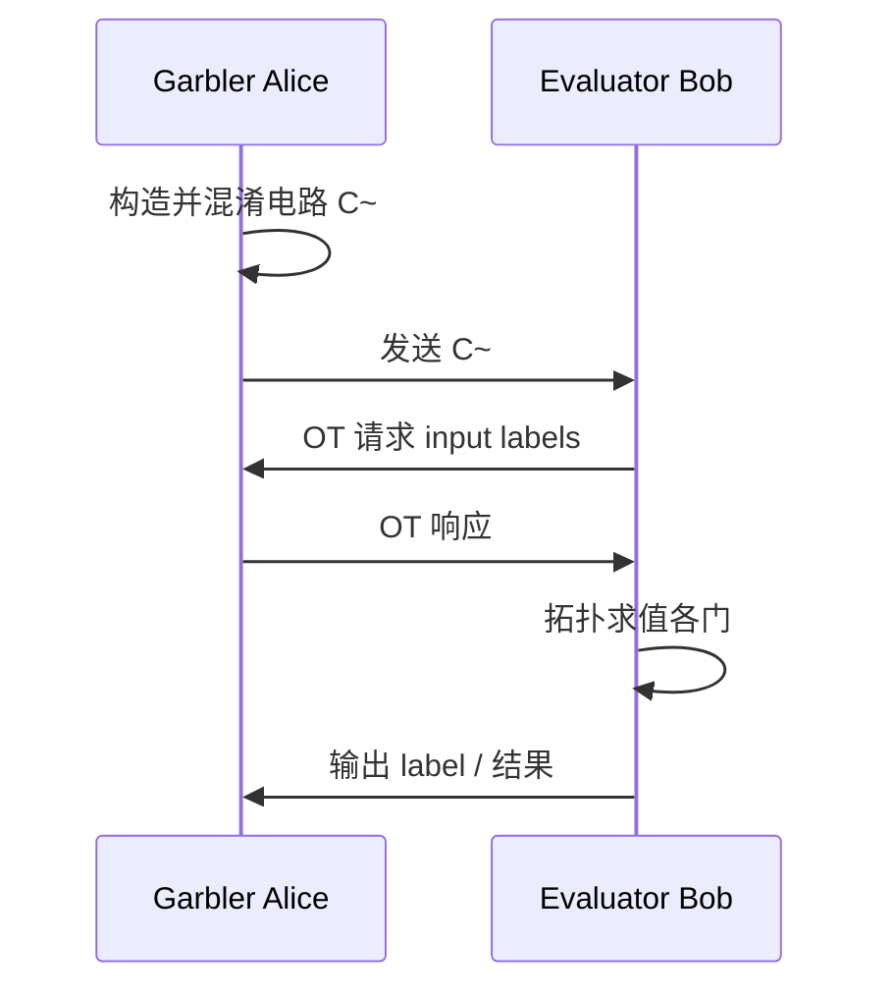

# P03 Lecture 3 基于混淆电路方法的 MPC 协议 —— 冯登国院士

← [[BV16j411q7pf-总览]] | ← [[P02-基于秘密分享方法的MPC协议--]]

## 视频信息

| 项目 | 内容 |
|------|------|
| 分集 | Lecture 3 基于混淆电路方法的 MPC 协议 —— 冯登国院士 |
| 模块 | 基于混淆电路的 MPC |
| 时长 | 111 分 25 秒 |
| 链接 | [B 站 Lecture 3](https://www.bilibili.com/video/BV1Y94y1z7Po) |
| 内容来源 | 教程级知识点增强（非 UP 逐字转写） |

## 核心要点

1. **本 P 主题**：Lecture 3 基于混淆电路方法的 MPC 协议
2. **模块定位**：基于混淆电路的 MPC
3. **研读侧重**：Yao Garbled Circuit、Wire label、Free-XOR、Cut-and-choose、OT 扩展
4. **笔记层级**：教程级（约 4782 字），含速览、Mermaid、Walkthrough、自测题
5. **学习建议**：先读「3 分钟速览」与「图解」，再深入「详细讲解」

> 以下内容基于 MPC 密码学理论体系撰写，对应冯登国院士 B 站课程「Lecture 3 基于混淆电路方法的 MPC 协议 —— 冯登国院士」。**非 UP 逐字转写**；不看视频可建立框架，看视频对照「与视频对照表」。

## 本节在系列中的位置

**模块**：基于混淆电路的 MPC · **P03/3**（Lecture 3，约 1h51m）。

**前置**：Lecture 1 的 OT；Lecture 2 的布尔电路概念（GMW）。

**系列收束**：三讲形成「组件→分享路线→GC 路线」完整图景，建议回到 [[BV16j411q7pf-总览]] 复盘。

## 3 分钟速览

**Lecture 3** 讲授 Yao 混淆电路、Free-XOR/Half-Gates 优化、OT 扩展、Cut-and-choose 恶意安全。考点：**Wire label、AND 门表、Cut-and-choose 参数 $s$、两方选型**。

## 零基础导读

混淆电路是**两方布尔计算**最成熟路线。学习顺序：先理解半诚实 Yao 一张 AND 门表如何工作，再理解恶意 Garbler 如何作弊，最后用 Cut-and-choose 堵住漏洞。

## 详细讲解

### 1. 混淆电路（Garbled Circuit）思想

**Yao 混淆电路**（1986）是两方安全计算的主流路线。将布尔函数 $f$ 表示为电路 $C$，**混淆方**（Garbler，常记 Alice）将电路加密为 **Garbled Circuit** $\widetilde{C}$；**求值方**（Evaluator，Bob）在**不经意传输**帮助下逐门求值，得输出 $f(x,y)$。

核心保证：
- Bob 学不到除输出外的 Alice 输入
- Alice 学不到 Bob 的输入（通过 OT 发送与 Bob 选择对应的 wire label）

### 2. Wire Label 与门表

对每条导线 $w$，生成两个**随机标签** $\lambda_w^0, \lambda_w^1$（语义为 $w=0$ 或 $1$）。

**混淆 XOR 门**（Free-XOR 优化下）：$\lambda_{out}^b = \lambda_a^b \oplus \lambda_b^b \oplus R$（$R$ 全局偏移），无需加密表。

**混淆 AND 门**：加密四条表项，使得 Evaluator 仅能用手中一条输入 label 解开对应输出 label：

$$\text{Table}[i,j] = \mathsf{Enc}_{\lambda_a^i,\lambda_b^j}(\lambda_{out}^{i\land j})$$

Evaluator 通过 OT 获得与真实输入对应的行/列 label，逐门推进。

### 3. Yao 协议执行流程

**离线（混淆）**：
1. Alice 构造电路 $C$ 表示 $f$
2. 为每条 wire 生成 label；构造每个 AND 门的混淆表
3. 将 $\widetilde{C}$ 与输出 wire 的 label 映射发给 Bob

**在线（求值）**：
1. Bob 对每条输入 wire 通过 OT 从 Alice 获取对应 label（Alice 不知 Bob 选了 0 还是 1）
2. Bob 拓扑序求值各门，仅解开与己路径一致的表项
3. 输出 wire label 解码得 $f(x,y)$

Alice 输入 wire 的 label 可直接发送（或经 OT 对称处理）。

### 4. 安全性（半诚实）

半诚实下，Bob 仅持有**一条**贯穿电路的 wire label 路径（其输入所诱导），无法伪造其他路径，故无法解密未访问的表项。Alice 的 OT 视图不泄露 Bob 的选择位。

**模拟器构造**：给定 Bob 输出，可**重编程**未访问的表项使其与模拟视图一致——标准 Yao 安全性证明思路。

### 5. Free-XOR 与 Half-Gates 优化

| 优化 | 效果 |
|------|------|
| **Free-XOR** (Kolesnikov-Schneider) | XOR 门零表项，仅 label 异或 |
| **Row Reduction** | 每 AND 门 3 条表项而非 4 |
| **Half-Gates** (Zahur-Rosulek-Evans) | 每 AND 2 条密文 + 固定密钥 |
| **AES-NI 批量** | 硬件加速混淆与求值 |

优化后 GC 常比朴素 Yao 小 **2–4 倍**，但仍与 AND 门数线性相关。

### 6. OT 扩展与 GC 预处理

朴素 Yao 每比特输入需 OT；电路宽时 OT 数量巨大。**OT 扩展**用 $O(\lambda)$ 次基础 OT 生成 $N \gg \lambda$ 次 OT，摊销成本。

现代 GC 框架（EMP-toolkit、ABY、Yao's GC in MPC）将 OT 扩展与 Half-Gates 结合，达**实用两方**性能（如 AES、编辑距离、机器学习推理）。

### 7. Cut-and-Choose：恶意安全

半诚实 Yao 在恶意 Garbler 面前失效：Alice 可构造**错误表项**，诱导 Bob 接受错误输出或泄露信息。

**Cut-and-Choose**（Lindell-Pinkas 等）思路：
1. Bob 要求 Alice 发送 $s$ 份独立混淆电路（$s \approx 40\sim128$ 与安全参数相关）
2. Bob **随机打开**其中约一半检查构造正确性（输入一致、表项可解密验证）
3. 未打开的电路用于求值；多数正确则恶意修改被检测，概率 $1-2^{-\lambda}$

附加技术：**输入一致性**、**输出认证**、**Bucketing** 合并多份电路求值。

恶意安全 GC 通信与计算约为半诚实 **$s$ 倍**，但仍是实用两方恶意 MPC 的主力。

### 8. 两方 vs 多方 GC

| 场景 | 方法 |
|------|------|
| 两方 | 原生 Yao + Cut-and-choose |
| 多方 | GC + GMW 组合、BMR 协议、或转 SS 路线 |

**BMR**（Beaver-Micali-Rogaway）：多方各自混淆子电路，通过 AND 门 OT 链接——通信随方数增长，工程较少用。

多数 $n>2$ 场景倾向 **秘密分享**（Lecture 2）；两方布尔/混合计算倾向 **GC**。

### 9. GC 与秘密分享选型

```
输入规模小、两方、布尔/比较密集 → Yao GC
多方、算术为主、需诚实多数     → BGW/SPDZ
混合电路                       → ABY (Arithmetic + Boolean + Yao)
```

联邦学习梯度聚合常用加法（FL 或 SS）；隐私集合求交偏 OT/GC；联合 SQL 可能 SCQL 编译到多种后端（见 [[P29-安全协作查询语言SCQL]]）。

### 10. 性能数量级（直觉）

| 任务 | 电路规模 | 半诚实 GC 量级 |
|------|----------|----------------|
| 32-bit 比较 | $\sim 10^3$ AND | 毫秒–秒（LAN） |
| AES-128 | $\sim 10^4$ AND | 秒级 |
| 小型 DNN 推理 | $10^8+$ AND | 分钟–小时（需优化）

恶意 Cut-and-choose 再乘安全系数 $s$。

### 11. 本讲学习要点

- 画出 Yao 协议三方时序（混淆→OT→求值）
- 解释 Free-XOR 为何降低 XOR 门成本
- 口述 Cut-and-choose 如何检测恶意 Garbler
- 对比 GC 与 BGW 的适用参与方数与电路类型

### Cut-and-choose 参数直觉

| 安全参数 $\lambda$ | 电路份数 $s$ | 检测恶意概率 |
|-------------------|-------------|-------------|
| 40 | $\approx 40\sim80$ | $1-2^{-40}$ |
| 80 | $\approx 80\sim160$ | $1-2^{-80}$ |

### 三讲技术选型总表

| 场景 | 推荐 | 本系列位置 |
|------|------|------------|
| 多方求和/线性 | Shamir 加法 | L2 |
| 多方乘积/ML | BGW/SPDZ | L2 |
| 两方比较/PSI | Yao GC | L3 |
| 混合算子 | ABY / SPU | [[P27-密态计算单元SPU]] |

### 与联邦学习系列衔接

[[P02-AvisualIntroductiontoFederatedorCollaborativeLearning]] 将 MPC 列为协作学习子范式；本课程给出 MPC 的**密码学底座**，FL 课程给出**机器学习系统与差分隐私**层，组合可设计「MPC 安全乘 + FL 本地梯度」混合方案。

## 图解



## 类比与直觉

混淆电路像**一次性迷宫**：Garbler 画好只有一条正确路径的地图（表项加密），Evaluator 握 OT 给的「入场券」（input label），走错路就撞墙（解不开密文）。

## 例题与场景 Walkthrough

**半诚实 Yao 求 AES(x, k)（Bob 持 key k）**

1. Alice 将 AES 编译为 $\sim 6\times10^3$ AND 门电路
2. Alice 混淆电路，发送 $\widetilde{C}$
3. Bob 经 OT 获取 key 各 bit 的 wire label
4. Bob 拓扑求值，得密文输出 label
5. 解码得 AES 结果；Alice 从输出 label 映射读结果

## 常见误区

1. **「GC 可无缝扩到 n 方」**：多方常用 BGW/BMR，GC 主战场是两方。
2. **「半诚实 Yao 已够商业」**：恶意 Garbler 可输出错误医疗诊断，需 Cut-and-choose。
3. **「XOR 与 AND 同成本」**：Free-XOR 后 XOR 几乎免费，AND 仍是瓶颈。
4. **「OT 扩展只属理论」**：EMP-toolkit 等已工程化。

## 与视频对照表

| 视频段落（约） | 预期演示内容 | 笔记对应章节 |
|-------------|------------|------------|
| 开篇 0%–15% | 本集目标、背景、与前后集关系 | 本节位置、3 分钟速览 |
| 前段 15%–40% | 核心概念定义与架构图 | 零基础导读、详细讲解 |
| 中段 40%–70% | 原理展开、对比、政策/代码示例 | 图解、类比、Walkthrough |
| 后段 70%–90% | 案例、问答、易错点 | 常见误区、Checklist |
| 收尾 90%–100% | 总结、延伸资源 | 延伸阅读、自测题 |

> 本集总时长约 **111分25秒**。无官方外挂字幕时，以分 P 标题「Lecture 3 基于混淆电路方法的 MPC 协议」与上表主题对齐视频画面。

## 动手实践 Checklist

- [ ] 手绘 1 个 AND 门的 4 行混淆表
- [ ] 写出 Yao 协议三步（混淆-OT-求值）
- [ ] 阅读 Lindell-Pinkas Cut-and-choose 摘要
- [ ] 对比 [[P19-多方安全计算MPC]] 中 GC 工程描述
- [ ] 完成 5 道自测并更新总览

## 延伸阅读

- Yao (1986) · Lindell-Pinkas (2007 Cut-and-choose)
- Kolesnikov-Schneider Free-XOR (2008)
- Zahur-Rosulek-Evans Half-Gates (2015)
- [[P19-多方安全计算MPC]] · [[P28-隐私集合求交PSI]]

## 自测题

1. **Garbler 与 Evaluator 各持什么？**  
   **答**：Garbler 混淆电路+输入 label；Evaluator 输入经 OT 得 label 并求值。

2. **Free-XOR 节省什么？**  
   **答**：XOR 门无需加密表，label 异或即可。

3. **Cut-and-choose 核心？**  
   **答**：发送多份电路，随机打开部分检查，未打开者求值。

4. **恶意安全代价？**  
   **答**：电路份数 $s$ 与安全参数 $\lambda$ 成正比，开销倍增。

5. **何时选 GC 而非 BGW？**  
   **答**：两方、布尔/比较密集、电路可优化时。

## 关键术语

| 术语 | 说明 |
|------|------|
| MPC | 多方在不泄露私有输入下联合计算函数 |
| 模拟器 | 证明真实协议不泄露超过理想功能的视图生成器 |
| Garbled Circuit | Yao 将布尔电路加密供 Evaluator 求值 |
| Free-XOR | XOR 门 label 异或，无需门表 |
| Cut-and-choose | 多发电路随机抽检以防御恶意 Garbler |
| OT 扩展 | 少量种子 OT 扩展为海量 OT |

## 与前后分 P 的衔接

- ← **Lecture 2 基于秘密分享方法的 MPC 协议 —— 冯登国院士**（[[P02-基于秘密分享方法的MPC协议--]]）
- → 系列终点，建议回到总览复盘

## 逐字转写

> 状态：待转写。运行 `Tools/transcribe/transcribe.ps1 -Bvid BV1Y94y1z7Po -Part 1` 补充（合集 Lecture 3 对应独立 BV）。

## 来源说明

- ✅ B 站官方元数据（`Tools/BV16j411q7pf-full.json`）
- ✅ 分 P 首帧封面（`Tools/bili-fetch/fetch-bilibili.js`）
- ✅ **教程级增强**：含 Mermaid、Walkthrough、自测题（约 4782 字，2026-06-07）
- ⏳ 逐字转写：B 站 API 无外挂字幕轨；可选 Whisper/BiliNote 后续补充

## 关键截图

![[../../06-资源附件/video-notes-images/BV16j411q7pf-P03-cover.jpg|B站首帧 P03]]
