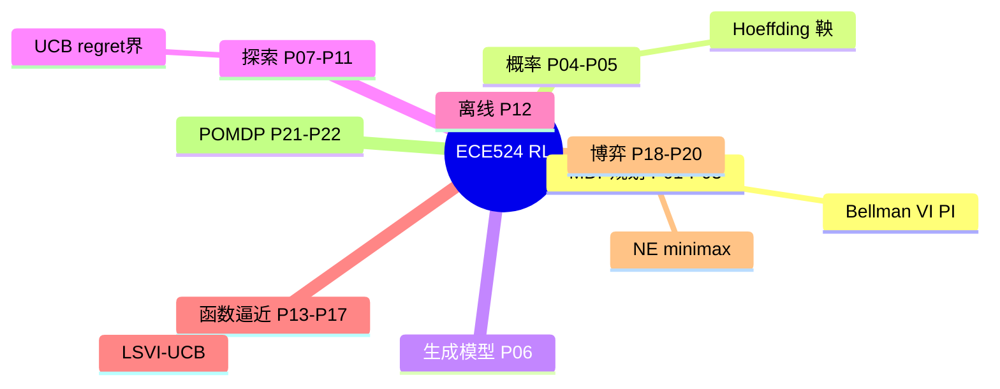
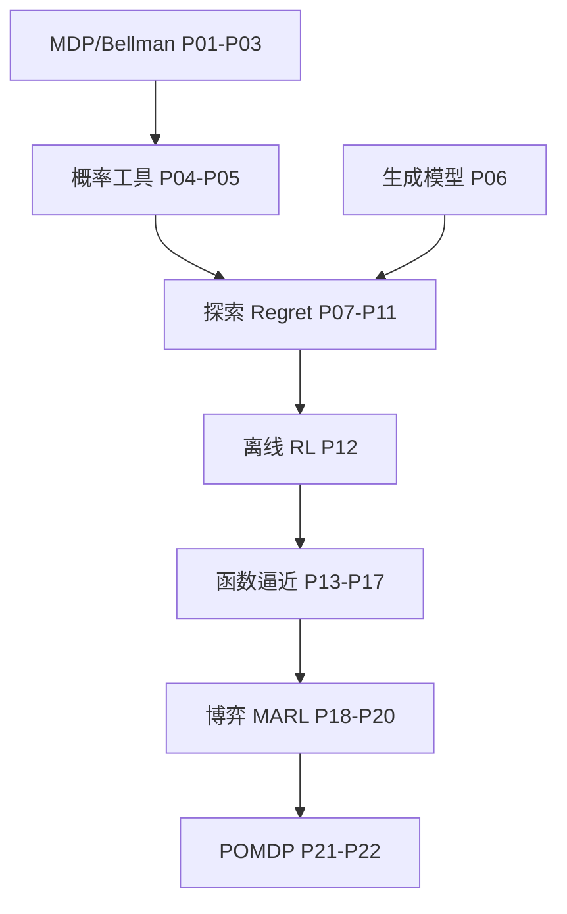

# 【Proof-Trivial】强化学习理论基础 (Princeton ECE524)【金驰(Chi Jin)】

> Princeton **ECE524** 强化学习理论基础（讲师 **Chi Jin**），B 站 **Proof-Trivial** 转载，共 **22** 个分 P（约 28h 28m 6s）。
>
> 各分 P 笔记已升级为 **教程级**（约 2500–3500 字/篇，含 Mermaid、Walkthrough、自测题，2026-06-06）。B 站 API 无外挂字幕，逐字稿可后续用 Whisper/BiliNote 补充。

## 视频简介（B 站原文）

https://www.youtube.com/@chi-jin-princeton
本系列视频来自于普林斯轮大学ECE金驰老师 (Chi Jin)，推荐大家去金老师Youtube个人主页观看，转载视频不会产生任何收益，希望大家多多交流讨论

原视频网站：https://www.youtube.com/@chi-jin-princeton 
课程主页：https://sites.google.com/view/cjin/teaching/ece524

课程主页：[Chi Jin ECE524](https://sites.google.com/view/cjin/teaching/ece524)

## 视频数据

| 字段 | 内容 |
|------|------|
| BV 号 | BV1r6cjeCEkW |
| UP 主 | Proof-Trivial |
| 总时长 | 28h 28m 6s（102486 秒） |
| 分 P 数 | 22 |
| 播放量 | 13,278（抓取时） |
| 收藏 | 1,885 |
| 标签 | 人工智能、生成模型、强化学习理论、ChatGPT、多臂老虎机、Offline Learning、RL、机器学习、博弈论、强化学习 |
| 字幕状态 | 无外挂字幕轨（视频为内嵌配音字幕，API 返回空列表） |

## 思维导图

## 分 P 索引

| 分 P | B 站分集标题 | 时长 | 字数 | 笔记 |
|------|-------------|------|------|------|
| P01 | 马尔科夫决策过程基础 (MDP) | 81m00s | ~3774 | [[P01-马尔科夫决策过程基础]] |
| P02 | 贝尔曼方程 (Bellman Equations) | 81m21s | ~3566 | [[P02-贝尔曼方程]] |
| P03 | 规划 (Planning) | 79m16s | ~3479 | [[P03-规划]] |
| P04 | 集中不等式 (Concentration Inequalities) | 79m25s | ~3479 | [[P04-集中不等式]] |
| P05 | 鞅 (Martingale Concentration) | 79m49s | ~3268 | [[P05-鞅]] |
| P06 | 生成模型 (Generative Models) | 79m30s | ~3283 | [[P06-生成模型]] |
| P07 | 探索 (Exploration) | 75m48s | ~3077 | [[P07-探索]] |
| P08 | 多臂Bandit中的探索 (MAB, UCB算法) | 80m06s | ~3450 | [[P08-多臂Bandit中的探索]] |
| P09 | 强化学习中的探索 (Exploration in RL) | 78m45s | ~3299 | [[P09-强化学习中的探索]] |
| P10 | 多臂Bandit下界 (Lower Bounds for MAB) | 77m50s | ~3366 | [[P10-多臂Bandit下界]] |
| P11 | MDP下界 (Lower Bounds for MDP) | 82m19s | ~3137 | [[P11-MDP下界]] |
| P12 | 离线强化学习 (Offline RL) | 79m58s | ~3128 | [[P12-离线强化学习]] |
| P13 | 大状态空间中的强化学习 (RL in Large State Space) | 78m46s | ~3127 | [[P13-大状态空间中的强化学习]] |
| P14 | 最小二乘值迭代 (Least-Squares Value Iteration) | 77m21s | ~3475 | [[P14-最小二乘值迭代]] |
| P15 | 大状态空间中的探索 (Exploration in Large State) Space | 81m23s | ~3239 | [[P15-大状态空间中的探索Space]] |
| P16 | 一般函数近似 (General Function Approximation) | 79m27s | ~3341 | [[P16-一般函数近似]] |
| P17 | 一般函数逼近中的探索 (Exploration in General Function Approximation) | 73m49s | ~3321 | [[P17-一般函数逼近中的探索]] |
| P18 | 多智能体强化学习 (Multiagent Reinforcement Learning) | 75m04s | ~2933 | [[P18-多智能体强化学习]] |
| P19 | 两玩家零和博弈 (Two-Player Zero-Sum Games) | 77m49s | ~3103 | [[P19-两玩家零和博弈]] |
| P20 | 多人一般和博弈 (Multiplayer General-Sum Games) | 77m27s | ~3027 | [[P20-多人一般和博弈]] |
| P21 | 部分可观测强化学习1 (Partially Observable Reinforcement Learning) I | 81m02s | ~3251 | [[P21-部分可观测强化学习1I]] |
| P22 | 部分可观测强化学习2 (Partially Observable Reinforcement Learning) II | 50m51s | ~3409 | [[P22-部分可观测强化学习2II]] |

## 学习路径

### 按主题分组

1. **MDP 与动态规划（P01–P03）** — MDP 形式化、Bellman 方程、值迭代与策略迭代
2. **概率工具（P04–P05）** — 集中不等式、鞅、为 regret 证明奠基
3. **生成模型（P06）** — MLE/VAE、与 model-based RL 及 RLHF 的桥梁
4. **探索与 Regret（P07–P11）** — MAB、UCB、MDP 探索、上下界
5. **离线 RL（P12）** — 分布偏移、CQL/IQL、coverage
6. **函数逼近（P13–P17）** — 线性 MDP、LSVI-UCB、eluder dimension
7. **博弈与 MARL（P18–P20）** — 零和/一般和、纳什均衡
8. **POMDP（P21–P22）** — 信念规划、POMCP、课程总结

> 建议：有概率论基础从 P01 顺序学习；已熟悉 Sutton & Barto 可从 P07 探索理论切入；配合 Agarwal *RL: Theory and Algorithms* 与课程讲义 PDF。

## 关联资源

- 原始 API 数据：`Tools/BV1r6cjeCEkW-full.json`
- 笔记生成：`Tools/bili-fetch/generate-rl-notes.js`
- 教程级增强：`Tools/bili-fetch/enhance-rl-notes.js`
- 知识点库：`Tools/bili-fetch/content/rl-knowledge.js`
- 封面目录：[[../../06-资源附件/video-notes-images/]]
- 思维导图：[[思维导图]]

## 工具与数据文件

| 工具 | 路径 | 用途 |
|------|------|------|
| Node 抓取脚本 | `Tools/bili-fetch/fetch-bilibili.js` | 元数据 + 首帧封面 |
| 结构化摘要 | `Tools/BV1r6cjeCEkW-full.json` | 分 P 数据 |
| 教程深化 | `Tools/bili-fetch/content/rl-tutorial-detail.js` | 分页 Walkthrough/自测 |
