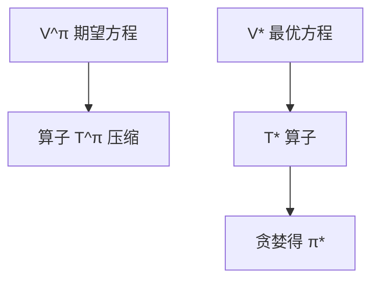

# P02 贝尔曼方程 (Bellman Equations)

← [[BV1r6cjeCEkW-总览]] | ← [[P01-马尔科夫决策过程基础]] | 下一篇 → [[P03-规划]]

## 视频信息

| 项目 | 内容 |
|------|------|
| 分集 | 贝尔曼方程 (Bellman Equations) |
| 模块 | MDP与动态规划 |
| 时长 | 1 小时 21 分 21 秒 |
| 链接 | [B 站 P2](https://www.bilibili.com/video/BV1r6cjeCEkW?p=2) |
| 课程主页 | [Chi Jin ECE524](https://sites.google.com/view/cjin/teaching/ece524) |
| 内容来源 | 知识点增强（RL 理论体系，非逐字转写） |

## 核心要点

1. **本 P 主题**：贝尔曼方程 (Bellman Equations)
2. **模块定位**：MDP与动态规划（P01–P03）
3. **考试/实践侧重**：Bellman 期望/最优方程、压缩映射、贪婪最优策略构造
4. **笔记层级**：教程级（约 3566 字），含速览、图解、Walkthrough、自测题
5. **学习建议**：先通读「3 分钟速览」与「图解」，再读「详细讲解」

> 以下内容基于 Princeton ECE524 强化学习理论课程体系撰写，对应 B 站分 P「【2】贝尔曼方程 (Bellman Equations)」。**非 UP 逐字转写**；不看视频也可建立框架，看视频可对照「与视频对照表」深化。

## 本节在系列中的位置

**模块**：MDP与动态规划（P01–P03）· 系列第 **P02/22** 集。

**建议前置**：[[P01-马尔科夫决策过程基础]]——建立本集所需背景。

**建议后续**：[[P03-规划]]——在本集能力之上继续深入。

依赖主线：MDP/Bellman(P01–P03) → 概率工具(P04–P05) → 探索(P07–P11) → 离线(P12) → 函数逼近(P13–P17) → 博弈(P18–P20) → POMDP(P21–P22)。

## 3 分钟速览

**贝尔曼方程** 是 Princeton ECE524 强化学习理论核心一讲。读完本节你应能：① 复述核心定义与定理；② 说明在探索/逼近/博弈链条中的位置；③ 完成一道典型推导或算法步骤。考试/面试侧重：**Bellman 期望/最优方程、压缩映射、贪婪最优策略构造**。

## 零基础导读

本节「贝尔曼方程」属于 **MDP与动态规划**。Princeton **Chi Jin** 课程强调**可证明的样本复杂度与 regret**，而非仅算法启发式。即便未看视频，也应先建立「定义 → 算法/定理 → 证明 sketch → 与前后讲衔接」四层结构。

第一遍盯住：本讲**解决什么问题**？**关键假设**（表格/线性 MDP/零和等）是什么？**结论的量级**（$\sqrt{T}$、$d$ 依赖等）？第二遍对照课程讲义 PDF 补全证明细节。

## 详细讲解

### 1. Bellman 期望方程

对任意策略 $\pi$，价值函数满足**递归关系**（Bellman expectation equation）：

$$V^\pi(s)=\sum_a\pi(a|s)\left[r(s,a)+\gamma\sum_{s'}P(s'|s,a)V^\pi(s')\right]$$

矩阵形式：$V^\pi=r^\pi+\gamma P^\pi V^\pi$，即 $(I-\gamma P^\pi)V^\pi=r^\pi$。当 $\gamma<1$ 且 $|S|$ 有限时，$V^\pi$ 唯一且可写为 $V^\pi=(I-\gamma P^\pi)^{-1}r^\pi$。

Q 函数形式：
$$Q^\pi(s,a)=r(s,a)+\gamma\sum_{s'}P(s'|s,a)\sum_{a'}\pi(a'|s')Q^\pi(s',a')$$

### 2. Bellman 最优方程

最优价值满足**Bellman optimality equation**：

$$V^*(s)=\max_a\left[r(s,a)+\gamma\sum_{s'}P(s'|s,a)V^*(s')\right]$$

$$Q^*(s,a)=r(s,a)+\gamma\sum_{s'}P(s'|s,a)\max_{a'}Q^*(s',a')$$

这是**非线性**方程组（因 $\max$），但仍是压缩映射，存在唯一不动点 $V^*$。

### 3. 最优策略的构造

**贪婪策略**（greedy w.r.t. $Q$）：
$$\pi^*(s)=\arg\max_a Q^*(s,a)$$

在有限 MDP 中，对 $Q^*$ 贪婪即得最优确定性策略。

### 4. 压缩映射与收敛

定义 Bellman 算子 $(\mathcal{T}^\pi V)(s)=r^\pi(s)+\gamma P^\pi V(s)$。则 $\|\mathcal{T}^\pi V-\mathcal{T}^\pi U\|_\infty\le\gamma\|V-U\|_\infty$，为 $\gamma$-**压缩**。由 Banach 不动点定理，迭代 $V_{k+1}=\mathcal{T}^\pi V_k$ 收敛到 $V^\pi$。

最优算子 $\mathcal{T}^*$ 同理，支撑值迭代（P03）。

### 5. 优势函数与 TD 误差

**优势函数**：$A^\pi(s,a)=Q^\pi(s,a)-V^\pi(s)$，衡量动作相对平均水平的优劣。

**TD 误差**（时序差分）：$\delta_t=r_t+\gamma V(s_{t+1})-V(s_t)$，是 Bellman 残差的无偏样本，连接 P03 规划与后续 RL 算法。

### 6. 证明思路（考试向）

证明 $V^\pi$ 满足 Bellman 期望方程：对轨迹期望做一步展开，利用马尔可夫性与全期望公式。最优方程：对任意 $\pi$ 有 $V^\pi\le V^*$，且存在 $\pi^*$ 达到等号。

### 深化理解（贝尔曼方程）

**证明技巧**：本讲典型用 压缩映射/集中不等式。

**与深度 RL 关系**：理论结果多针对 tabular/linear；PPO/DQN 等工程方法缺乏同样强的 regret 保证，但直觉（探索 bonus、target network 稳定）与理论平行。

**作业建议**：从 [课程主页](https://sites.google.com/view/cjin/teaching/ece524) 下载 homework，将本笔记 Walkthrough 与 official solution 对照。

## 图解

## 类比与直觉

MDP 像**带随机性的棋局规则**：状态是局面，动作是着法，奖励是胜负信号；Bellman 方程是「当前局面价值 = 即时收益 + 折扣后续最优价值」。

## 例题与场景 Walkthrough

**Walkthrough：网格世界 MDP 手算**

1. 定义 $S=\{1,2,3\}$（左、中、右），$A=\{\mathrm{L},\mathrm{R}\}$，目标在 3。
2. 写 $P(s'|s,a)$：撞墙则 $s'=s$。
3. 设 $\gamma=0.9$，$r=1$ 仅 $s=3$。
4. 对策略「总是向右」算 $V^\pi$：解 Bellman 线性方程。
5. 值迭代一步：$V_1(s)=\max_a[r+\gamma\sum P V_0]$，观察收敛方向。

## 常见误区

1. **「Q-learning 总能收敛」**：需表格+适当学习率；函数逼近+离策略可能发散（Deadly Triad）。
2. **「探索就是多随机」**：$\epsilon$-greedy 无 $\sqrt{T}$ regret 保证；UCB/乐观主义才有理论界。
3. **「离线 RL = 在线 RL 少交互」**：核心难在分布偏移，不是样本少而已。
4. **「POMDP 用 LSTM 就等价最优 belief」**：记忆策略一般次优；belief 规划是理论最优基准。

## 与视频对照表

| 视频段落（约） | 预期演示内容 | 笔记对应章节 |
|-------------|------------|------------|
| 开篇 0%–15% | 本集目标、背景、与前后集关系 | 本节位置、3 分钟速览 |
| 前段 15%–40% | 核心概念定义与架构图 | 零基础导读、详细讲解 |
| 中段 40%–70% | 原理展开、对比、政策/代码示例 | 图解、类比、Walkthrough |
| 后段 70%–90% | 案例、问答、易错点 | 常见误区、Checklist |
| 收尾 90%–100% | 总结、延伸资源 | 延伸阅读、自测题 |

> 本集总时长约 **81分21秒**。无官方外挂字幕时，以分 P 标题「贝尔曼方程 (Bellman Equations)」与上表主题对齐视频画面。

## 动手实践 Checklist

- [ ] 手推本讲 1 个核心方程（Bellman/Hoeffding/Azuma）
- [ ] 对照 [Chi Jin 课程主页](https://sites.google.com/view/cjin/teaching/ece524) 讲义
- [ ] 完成 Agarwal *RL: Theory and Algorithms* 对应章节习题 1 道
- [ ] 在 Obsidian 画本讲概念图
- [ ] 向同学 2 分钟口述本讲定理

## 延伸阅读

- Sutton & Barto *Reinforcement Learning* Ch.3–4
- Agarwal et al. *RL: Theory and Algorithms* Ch.1–2
- [ECE524 课程主页](https://sites.google.com/view/cjin/teaching/ece524)

## 自测题

1. **本讲核心考点？**  
   **答**：Bellman 期望/最优方程、压缩映射、贪婪最优策略构造。

2. **本讲在 22 讲中的模块？**  
   **答**：MDP与动态规划（P01–P03）。

3. **关键假设是什么？**  
   **答**：有限 MDP、折扣 γ<1。

4. **与上/下讲关系？**  
   **答**：承接「马尔科夫决策过程基础」；铺垫「规划」。

5. **30 分钟复习计划？**  
   **答**：速览 + 图解 + Walkthrough 手算一遍 + 自测 Q1/Q3。

## 逐字转写

> ⏳ **待转写**（`transcript_status: 待转写`）
>
> B 站 API 无外挂字幕轨（`need_login_subtitle: true`）。可使用 `Tools/transcribe/` 下 Whisper/BiliNote 工作流后续补充。转写完成后在此节粘贴全文并更新 frontmatter `transcript_status: 已完成`。

## 关键术语

| 术语 | 说明 |
|------|------|
| MDP | 马尔可夫决策过程 (S,A,P,r,γ) |
| Regret | 累积遗憾，衡量探索算法样本效率 |
| Chi Jin | Princeton ECE 教授，RL 理论专家 |
| Bellman 方程 | 价值递归关系 |
| 压缩映射 | γ-收缩保证收敛 |

## 与前后分 P 的衔接

- ← **马尔科夫决策过程基础 (MDP)**（[[P01-马尔科夫决策过程基础]]）
- → **规划 (Planning)**（[[P03-规划]]）

## 来源说明

- ✅ B 站官方元数据（`Tools/BV1r6cjeCEkW-full.json`）
- ✅ 分 P 首帧封面（`Tools/bili-fetch/fetch-bilibili.js`）
- ✅ **教程级增强**：含 Mermaid、Walkthrough、自测题（约 3566 字，2026-06-06）
- ⏳ 逐字转写：API 无外挂字幕轨；可选 Whisper/BiliNote 后续补充

## 关键截图

![[../../06-资源附件/video-notes-images/BV1r6cjeCEkW-P02-cover.jpg|B站首帧 P02]]
