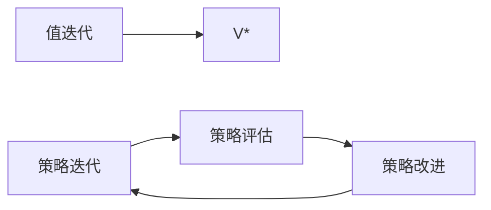

# P03 规划 (Planning)

← [[BV1r6cjeCEkW-总览]] | ← [[P02-贝尔曼方程]] | 下一篇 → [[P04-集中不等式]]

## 视频信息

| 项目 | 内容 |
|------|------|
| 分集 | 规划 (Planning) |
| 模块 | MDP与动态规划 |
| 时长 | 1 小时 19 分 16 秒 |
| 链接 | [B 站 P3](https://www.bilibili.com/video/BV1r6cjeCEkW?p=3) |
| 课程主页 | [Chi Jin ECE524](https://sites.google.com/view/cjin/teaching/ece524) |
| 内容来源 | 知识点增强（RL 理论体系，非逐字转写） |

## 核心要点

1. **本 P 主题**：规划 (Planning)
2. **模块定位**：MDP与动态规划（P01–P03）
3. **考试/实践侧重**：值迭代与策略迭代、策略改进定理、VI/PI 复杂度
4. **笔记层级**：教程级（约 3479 字），含速览、图解、Walkthrough、自测题
5. **学习建议**：先通读「3 分钟速览」与「图解」，再读「详细讲解」

> 以下内容基于 Princeton ECE524 强化学习理论课程体系撰写，对应 B 站分 P「【3】规划 (Planning)」。**非 UP 逐字转写**；不看视频也可建立框架，看视频可对照「与视频对照表」深化。

## 本节在系列中的位置

**模块**：MDP与动态规划（P01–P03）· 系列第 **P03/22** 集。

**建议前置**：[[P02-贝尔曼方程]]——建立本集所需背景。

**建议后续**：[[P04-集中不等式]]——在本集能力之上继续深入。

依赖主线：MDP/Bellman(P01–P03) → 概率工具(P04–P05) → 探索(P07–P11) → 离线(P12) → 函数逼近(P13–P17) → 博弈(P18–P20) → POMDP(P21–P22)。

## 3 分钟速览

**规划** 是 Princeton ECE524 强化学习理论核心一讲。读完本节你应能：① 复述核心定义与定理；② 说明在探索/逼近/博弈链条中的位置；③ 完成一道典型推导或算法步骤。考试/面试侧重：**值迭代与策略迭代、策略改进定理、VI/PI 复杂度**。

## 零基础导读

本节「规划」属于 **MDP与动态规划**。Princeton **Chi Jin** 课程强调**可证明的样本复杂度与 regret**，而非仅算法启发式。即便未看视频，也应先建立「定义 → 算法/定理 → 证明 sketch → 与前后讲衔接」四层结构。

第一遍盯住：本讲**解决什么问题**？**关键假设**（表格/线性 MDP/零和等）是什么？**结论的量级**（$\sqrt{T}$、$d$ 依赖等）？第二遍对照课程讲义 PDF 补全证明细节。

## 详细讲解

### 1. 规划问题设定

**规划**（Planning）：在 MDP 模型 $(P,r)$ **已知**时，求最优策略或 $V^*$。与**学习**（Learning）相对——后者需从交互数据估计模型或价值。

本讲核心算法：**值迭代**（Value Iteration, VI）、**策略迭代**（Policy Iteration, PI）、**截断式动态规划**。

### 2. 值迭代（Value Iteration）

反复应用 Bellman 最优算子：
$$V_{k+1}(s)=\max_a\left[r(s,a)+\gamma\sum_{s'}P(s'|s,a)V_k(s')\right]$$

**收敛性**：$\|V_{k+1}-V^*\|_\infty\le\gamma\|V_k-V^*\|_\infty$，线性速率 $\gamma$。实践中当 $\|V_{k+1}-V_k\|_\infty<\epsilon$ 停止。

**策略提取**：收敛后 $\pi(s)=\arg\max_a[r(s,a)+\gamma\sum_{s'}P(s'|s,a)V(s')]$。

### 3. 策略迭代（Policy Iteration）

交替两步直至策略不变：

1. **策略评估**：解 $(I-\gamma P^\pi)V^\pi=r^\pi$（或迭代至收敛）
2. **策略改进**：$\pi'(s)=\arg\max_a Q^{\pi}(s,a)$

**策略改进定理**：若 $\pi'$ 对 $V^\pi$ 贪婪，则 $V^{\pi'}\ge V^\pi$（分量-wise），严格不等除非 $\pi$ 已最优。

**有限性**：有限 MDP 上策略空间有限，PI 在有限步内收敛到最优（通常远少于 $|S|^{|A|}$ 次迭代）。

### 4. 复杂度与比较

| 算法 | 每轮代价 | 迭代次数 | 备注 |
|------|----------|----------|------|
| VI | $O(|S|^2|A|)$ | $O(\log(1/\epsilon)/\log(1/\gamma))$ | 实现简单 |
| PI | 评估 $O(|S|^3)$ 或迭代 | 通常很少 | 中小规模极快 |

**Modified PI**：评估只做 $m$ 步 Bellman 更新再改进，折中 VI 与 PI。

### 5. 截断 horizon 与折扣

有限步 $H$ 时可用向后归纳（backward induction）。折扣 $\gamma$ 等价于以概率 $1-\gamma$ 每步终止的随机 horizon，连接 episodic 与 continuing 任务。

### 6. 从规划到 RL

真实 RL 中 $P,r$ 未知，**蒙特卡洛**与 **TD 学习**可看作用样本近似 Bellman 备份。P07 起在**无模型**且需**探索**时，样本效率成为核心（regret 分析）。

### 深化理解（规划）

**证明技巧**：本讲典型用 压缩映射/集中不等式。

**与深度 RL 关系**：理论结果多针对 tabular/linear；PPO/DQN 等工程方法缺乏同样强的 regret 保证，但直觉（探索 bonus、target network 稳定）与理论平行。

**作业建议**：从 [课程主页](https://sites.google.com/view/cjin/teaching/ece524) 下载 homework，将本笔记 Walkthrough 与 official solution 对照。

## 图解

## 类比与直觉

MDP 像**带随机性的棋局规则**：状态是局面，动作是着法，奖励是胜负信号；Bellman 方程是「当前局面价值 = 即时收益 + 折扣后续最优价值」。

## 例题与场景 Walkthrough

**Walkthrough：网格世界 MDP 手算**

1. 定义 $S=\{1,2,3\}$（左、中、右），$A=\{\mathrm{L},\mathrm{R}\}$，目标在 3。
2. 写 $P(s'|s,a)$：撞墙则 $s'=s$。
3. 设 $\gamma=0.9$，$r=1$ 仅 $s=3$。
4. 对策略「总是向右」算 $V^\pi$：解 Bellman 线性方程。
5. 值迭代一步：$V_1(s)=\max_a[r+\gamma\sum P V_0]$，观察收敛方向。

## 常见误区

1. **「Q-learning 总能收敛」**：需表格+适当学习率；函数逼近+离策略可能发散（Deadly Triad）。
2. **「探索就是多随机」**：$\epsilon$-greedy 无 $\sqrt{T}$ regret 保证；UCB/乐观主义才有理论界。
3. **「离线 RL = 在线 RL 少交互」**：核心难在分布偏移，不是样本少而已。
4. **「POMDP 用 LSTM 就等价最优 belief」**：记忆策略一般次优；belief 规划是理论最优基准。

## 与视频对照表

| 视频段落（约） | 预期演示内容 | 笔记对应章节 |
|-------------|------------|------------|
| 开篇 0%–15% | 本集目标、背景、与前后集关系 | 本节位置、3 分钟速览 |
| 前段 15%–40% | 核心概念定义与架构图 | 零基础导读、详细讲解 |
| 中段 40%–70% | 原理展开、对比、政策/代码示例 | 图解、类比、Walkthrough |
| 后段 70%–90% | 案例、问答、易错点 | 常见误区、Checklist |
| 收尾 90%–100% | 总结、延伸资源 | 延伸阅读、自测题 |

> 本集总时长约 **79分16秒**。无官方外挂字幕时，以分 P 标题「规划 (Planning)」与上表主题对齐视频画面。

## 动手实践 Checklist

- [ ] 手推本讲 1 个核心方程（Bellman/Hoeffding/Azuma）
- [ ] 对照 [Chi Jin 课程主页](https://sites.google.com/view/cjin/teaching/ece524) 讲义
- [ ] 完成 Agarwal *RL: Theory and Algorithms* 对应章节习题 1 道
- [ ] 在 Obsidian 画本讲概念图
- [ ] 向同学 2 分钟口述本讲定理

## 延伸阅读

- Sutton & Barto *Reinforcement Learning* Ch.3–4
- Agarwal et al. *RL: Theory and Algorithms* Ch.1–2
- [ECE524 课程主页](https://sites.google.com/view/cjin/teaching/ece524)

## 自测题

1. **本讲核心考点？**  
   **答**：值迭代与策略迭代、策略改进定理、VI/PI 复杂度。

2. **本讲在 22 讲中的模块？**  
   **答**：MDP与动态规划（P01–P03）。

3. **关键假设是什么？**  
   **答**：有限 MDP、折扣 γ<1。

4. **与上/下讲关系？**  
   **答**：承接「贝尔曼方程」；铺垫「集中不等式」。

5. **30 分钟复习计划？**  
   **答**：速览 + 图解 + Walkthrough 手算一遍 + 自测 Q1/Q3。

## 逐字转写

> ⏳ **待转写**（`transcript_status: 待转写`）
>
> B 站 API 无外挂字幕轨（`need_login_subtitle: true`）。可使用 `Tools/transcribe/` 下 Whisper/BiliNote 工作流后续补充。转写完成后在此节粘贴全文并更新 frontmatter `transcript_status: 已完成`。

## 关键术语

| 术语 | 说明 |
|------|------|
| MDP | 马尔可夫决策过程 (S,A,P,r,γ) |
| Regret | 累积遗憾，衡量探索算法样本效率 |
| Chi Jin | Princeton ECE 教授，RL 理论专家 |
| 值迭代 VI | 反复 Bellman 最优备份 |
| 策略迭代 PI | 评估+改进交替 |

## 与前后分 P 的衔接

- ← **贝尔曼方程 (Bellman Equations)**（[[P02-贝尔曼方程]]）
- → **集中不等式 (Concentration Inequalities)**（[[P04-集中不等式]]）

## 来源说明

- ✅ B 站官方元数据（`Tools/BV1r6cjeCEkW-full.json`）
- ✅ 分 P 首帧封面（`Tools/bili-fetch/fetch-bilibili.js`）
- ✅ **教程级增强**：含 Mermaid、Walkthrough、自测题（约 3479 字，2026-06-06）
- ⏳ 逐字转写：API 无外挂字幕轨；可选 Whisper/BiliNote 后续补充

## 关键截图

![[../../06-资源附件/video-notes-images/BV1r6cjeCEkW-P03-cover.jpg|B站首帧 P03]]
