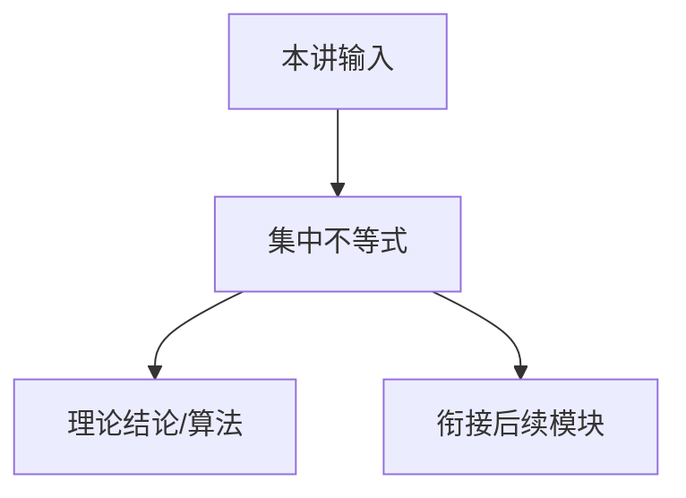

# P04 集中不等式 (Concentration Inequalities)

← [[BV1r6cjeCEkW-总览]] | ← [[P03-规划]] | 下一篇 → [[P05-鞅]]

## 视频信息

| 项目 | 内容 |
|------|------|
| 分集 | 集中不等式 (Concentration Inequalities) |
| 模块 | 概率工具与集中不等式 |
| 时长 | 1 小时 19 分 25 秒 |
| 链接 | [B 站 P4](https://www.bilibili.com/video/BV1r6cjeCEkW?p=4) |
| 课程主页 | [Chi Jin ECE524](https://sites.google.com/view/cjin/teaching/ece524) |
| 内容来源 | 知识点增强（RL 理论体系，非逐字转写） |

## 核心要点

1. **本 P 主题**：集中不等式 (Concentration Inequalities)
2. **模块定位**：概率工具与集中不等式（P04–P05）
3. **考试/实践侧重**：Hoeffding/Chernoff/Bernstein、Union bound、置信区间构造
4. **笔记层级**：教程级（约 3479 字），含速览、图解、Walkthrough、自测题
5. **学习建议**：先通读「3 分钟速览」与「图解」，再读「详细讲解」

> 以下内容基于 Princeton ECE524 强化学习理论课程体系撰写，对应 B 站分 P「【4】集中不等式 (Concentration Inequalities)」。**非 UP 逐字转写**；不看视频也可建立框架，看视频可对照「与视频对照表」深化。

## 本节在系列中的位置

**模块**：概率工具与集中不等式（P04–P05）· 系列第 **P04/22** 集。

**建议前置**：[[P03-规划]]——建立本集所需背景。

**建议后续**：[[P05-鞅]]——在本集能力之上继续深入。

依赖主线：MDP/Bellman(P01–P03) → 概率工具(P04–P05) → 探索(P07–P11) → 离线(P12) → 函数逼近(P13–P17) → 博弈(P18–P20) → POMDP(P21–P22)。

## 3 分钟速览

**集中不等式** 是 Princeton ECE524 强化学习理论核心一讲。读完本节你应能：① 复述核心定义与定理；② 说明在探索/逼近/博弈链条中的位置；③ 完成一道典型推导或算法步骤。考试/面试侧重：**Hoeffding/Chernoff/Bernstein、Union bound、置信区间构造**。

## 零基础导读

本节「集中不等式」属于 **概率工具与集中不等式**。Princeton **Chi Jin** 课程强调**可证明的样本复杂度与 regret**，而非仅算法启发式。即便未看视频，也应先建立「定义 → 算法/定理 → 证明 sketch → 与前后讲衔接」四层结构。

第一遍盯住：本讲**解决什么问题**？**关键假设**（表格/线性 MDP/零和等）是什么？**结论的量级**（$\sqrt{T}$、$d$ 依赖等）？第二遍对照课程讲义 PDF 补全证明细节。

## 详细讲解

### 1. 为什么 RL 理论需要集中不等式

强化学习是**随机过程上的优化**：奖励、转移、策略采样都是随机的。要证明算法以高概率接近最优，必须控制**经验均值与期望的偏差**——集中不等式（Concentration Inequalities）是 P05 鞅方法、P08 UCB、P10–P11 下界证明的基础工具。

### 2. 马尔可夫不等式

若 $X\ge 0$ 且 $\mathbb{E}[X]=\mu$，则对 $t>0$：
$$P(X\ge t)\le\frac{\mu}{t}$$

弱但仅需一阶矩，常作第一步放缩。

### 3. Chebyshev 与 Hoeffding

**Chebyshev**：$P(|X-\mu|\ge t)\le\mathrm{Var}(X)/t^2$。

**Hoeffding**（有界独立和）：设 $X_i\in[a_i,b_i]$ 独立，$S=\sum X_i$，则
$$P(S-\mathbb{E}[S]\ge t)\le\exp\left(-\frac{2t^2}{\sum(b_i-a_i)^2}\right)$$

对称界对 $S-\mathbb{E}[S]\le -t$ 同样成立。RL 中用于有界奖励的回报估计。

### 4. Chernoff / Bernstein 界

**Chernoff**：独立 Bernoulli 或 sub-Gaussian 和的尾概率指数衰减。

**Bernstein**：同时利用方差与有界性，样本量 $n$ 大时更紧：
$$P\left(\left|\frac{1}{n}\sum X_i-\mu\right|\ge\epsilon\right)\le 2\exp\left(-\frac{n\epsilon^2}{2\sigma^2+2M\epsilon/3}\right)$$

### 5. Union Bound 与置信区间

对 $K$ 个事件同时成立：$P(\cup E_i)\le\sum P(E_i)$。在 MAB 中应对 $K$ 个臂的均值估计同时成立，导致 **$\sqrt{\log K}$** 或 **$\log K$** 因子（见 P08 UCB  bonus）。

**置信上界**构造：以 $\hat{\mu}+c\sqrt{\log(1/\delta)/n}$ 作为真均值以概率 $1-\delta$ 的上界——UCB 算法核心。

### 6. 在 RL 中的典型用法

- 估计 $Q(s,a)$ 或模型 $\hat{P}(\cdot|s,a)$ 的误差界
- 证明探索算法 $O(\sqrt{T})$ 或 $O(\log T)$ regret
- 样本复杂度：达到 $\epsilon$-最优所需交互步数

下一讲 P05 将引入**鞅**（Martingale），处理**非独立**但适应滤下的随机和（如 RL 轨迹中的增量）。

### 深化理解（集中不等式）

**证明技巧**：本讲典型用 压缩映射/集中不等式。

**与深度 RL 关系**：理论结果多针对 tabular/linear；PPO/DQN 等工程方法缺乏同样强的 regret 保证，但直觉（探索 bonus、target network 稳定）与理论平行。

**作业建议**：从 [课程主页](https://sites.google.com/view/cjin/teaching/ece524) 下载 homework，将本笔记 Walkthrough 与 official solution 对照。

## 图解

## 类比与直觉

集中不等式像**质检抽样**：有限样本均值离真值多远有概率界；鞅像**公平赌场**，给定历史下一步期望不赚不亏——RL 轨迹分析的基础。

## 例题与场景 Walkthrough

**Walkthrough：Hoeffding 用于 MAB 置信界**

1. 臂 $i$ 有界奖励 $[0,1]$，$n$ 次样本均值 $\hat{\mu}_i$。
2. 令 $\delta=0.05$，Hoeffding 得 $P(|\hat{\mu}_i-\mu_i|\ge\epsilon)\le 2e^{-2n\epsilon^2}$。
3. 令 RHS=$\delta/K$，解 $\epsilon=\sqrt{\log(2K/\delta)/(2n)}$。
4. 这就是 UCB bonus 的来源（P08）。
5. 用 union bound 同时对所有臂成立。

## 常见误区

1. **「Q-learning 总能收敛」**：需表格+适当学习率；函数逼近+离策略可能发散（Deadly Triad）。
2. **「探索就是多随机」**：$\epsilon$-greedy 无 $\sqrt{T}$ regret 保证；UCB/乐观主义才有理论界。
3. **「离线 RL = 在线 RL 少交互」**：核心难在分布偏移，不是样本少而已。
4. **「POMDP 用 LSTM 就等价最优 belief」**：记忆策略一般次优；belief 规划是理论最优基准。

## 与视频对照表

| 视频段落（约） | 预期演示内容 | 笔记对应章节 |
|-------------|------------|------------|
| 开篇 0%–15% | 本集目标、背景、与前后集关系 | 本节位置、3 分钟速览 |
| 前段 15%–40% | 核心概念定义与架构图 | 零基础导读、详细讲解 |
| 中段 40%–70% | 原理展开、对比、政策/代码示例 | 图解、类比、Walkthrough |
| 后段 70%–90% | 案例、问答、易错点 | 常见误区、Checklist |
| 收尾 90%–100% | 总结、延伸资源 | 延伸阅读、自测题 |

> 本集总时长约 **79分25秒**。无官方外挂字幕时，以分 P 标题「集中不等式 (Concentration Inequalities)」与上表主题对齐视频画面。

## 动手实践 Checklist

- [ ] 手推本讲 1 个核心方程（Bellman/Hoeffding/Azuma）
- [ ] 对照 [Chi Jin 课程主页](https://sites.google.com/view/cjin/teaching/ece524) 讲义
- [ ] 完成 Agarwal *RL: Theory and Algorithms* 对应章节习题 1 道
- [ ] 在 Obsidian 画本讲概念图
- [ ] 向同学 2 分钟口述本讲定理

## 延伸阅读

- Vershynin *High-Dimensional Probability* 集中不等式章节
- Agarwal Ch.2–3
- MIT 6.436J 概率论复习

## 自测题

1. **本讲核心考点？**  
   **答**：Hoeffding/Chernoff/Bernstein、Union bound、置信区间构造。

2. **本讲在 22 讲中的模块？**  
   **答**：概率工具与集中不等式（P04–P05）。

3. **关键假设是什么？**  
   **答**：有界奖励、episodic 或 stationary。

4. **与上/下讲关系？**  
   **答**：承接「规划」；铺垫「鞅」。

5. **30 分钟复习计划？**  
   **答**：速览 + 图解 + Walkthrough 手算一遍 + 自测 Q1/Q3。

## 逐字转写

> ⏳ **待转写**（`transcript_status: 待转写`）
>
> B 站 API 无外挂字幕轨（`need_login_subtitle: true`）。可使用 `Tools/transcribe/` 下 Whisper/BiliNote 工作流后续补充。转写完成后在此节粘贴全文并更新 frontmatter `transcript_status: 已完成`。

## 关键术语

| 术语 | 说明 |
|------|------|
| MDP | 马尔可夫决策过程 (S,A,P,r,γ) |
| Regret | 累积遗憾，衡量探索算法样本效率 |
| Chi Jin | Princeton ECE 教授，RL 理论专家 |
| Hoeffding | 有界独立和集中界 |
| Chernoff | 指数尾概率衰减 |

## 与前后分 P 的衔接

- ← **规划 (Planning)**（[[P03-规划]]）
- → **鞅 (Martingale Concentration)**（[[P05-鞅]]）

## 来源说明

- ✅ B 站官方元数据（`Tools/BV1r6cjeCEkW-full.json`）
- ✅ 分 P 首帧封面（`Tools/bili-fetch/fetch-bilibili.js`）
- ✅ **教程级增强**：含 Mermaid、Walkthrough、自测题（约 3479 字，2026-06-06）
- ⏳ 逐字转写：API 无外挂字幕轨；可选 Whisper/BiliNote 后续补充

## 关键截图

![[../../06-资源附件/video-notes-images/BV1r6cjeCEkW-P04-cover.jpg|B站首帧 P04]]
