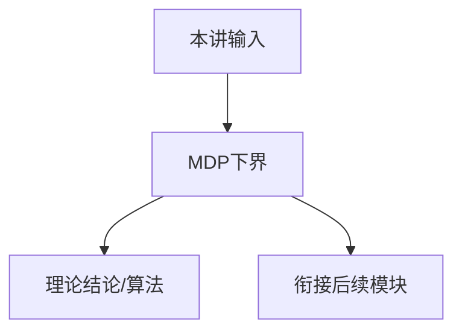

# P11 MDP下界 (Lower Bounds for MDP)

← [[BV1r6cjeCEkW-总览]] | ← [[P10-多臂Bandit下界]] | 下一篇 → [[P12-离线强化学习]]

## 视频信息

| 项目 | 内容 |
|------|------|
| 分集 | MDP下界 (Lower Bounds for MDP) |
| 模块 | 探索与Regret理论 |
| 时长 | 1 小时 22 分 19 秒 |
| 链接 | [B 站 P11](https://www.bilibili.com/video/BV1r6cjeCEkW?p=11) |
| 课程主页 | [Chi Jin ECE524](https://sites.google.com/view/cjin/teaching/ece524) |
| 内容来源 | 知识点增强（RL 理论体系，非逐字转写） |

## 核心要点

1. **本 P 主题**：MDP下界 (Lower Bounds for MDP)
2. **模块定位**：探索与Regret理论（P07–P11）
3. **考试/实践侧重**：MDP regret 下界、change-of-measure、与 UCBVI 上界对照
4. **笔记层级**：教程级（约 3137 字），含速览、图解、Walkthrough、自测题
5. **学习建议**：先通读「3 分钟速览」与「图解」，再读「详细讲解」

> 以下内容基于 Princeton ECE524 强化学习理论课程体系撰写，对应 B 站分 P「【11】MDP下界 (Lower Bounds for MDP)」。**非 UP 逐字转写**；不看视频也可建立框架，看视频可对照「与视频对照表」深化。

## 本节在系列中的位置

**模块**：探索与Regret理论（P07–P11）· 系列第 **P11/22** 集。

**建议前置**：[[P10-多臂Bandit下界]]——建立本集所需背景。

**建议后续**：[[P12-离线强化学习]]——在本集能力之上继续深入。

依赖主线：MDP/Bellman(P01–P03) → 概率工具(P04–P05) → 探索(P07–P11) → 离线(P12) → 函数逼近(P13–P17) → 博弈(P18–P20) → POMDP(P21–P22)。

## 3 分钟速览

**MDP下界** 是 Princeton ECE524 强化学习理论核心一讲。读完本节你应能：① 复述核心定义与定理；② 说明在探索/逼近/博弈链条中的位置；③ 完成一道典型推导或算法步骤。考试/面试侧重：**MDP regret 下界、change-of-measure、与 UCBVI 上界对照**。

## 零基础导读

本节「MDP下界」属于 **探索与Regret理论**。Princeton **Chi Jin** 课程强调**可证明的样本复杂度与 regret**，而非仅算法启发式。即便未看视频，也应先建立「定义 → 算法/定理 → 证明 sketch → 与前后讲衔接」四层结构。

第一遍盯住：本讲**解决什么问题**？**关键假设**（表格/线性 MDP/零和等）是什么？**结论的量级**（$\sqrt{T}$、$d$ 依赖等）？第二遍对照课程讲义 PDF 补全证明细节。

## 详细讲解

### 1. MDP Regret 下界设定

Episodic MDP：$H$ 步回合，$S$ 状态，$A$ 动作，初始 $s_1$ 固定或从 $\mu$ 采样。$K$ 个 episode 的累积 regret 下界常表为 $\Omega(\sqrt{H^2 SAK})$ 或含 $\log$ 因子。

**直径 $D$**：在任意策略下从任意状态到任意状态的最短期望步数上界，影响 regret 与 sample complexity。

### 2. 信息论论证

智能体每步至多获得 $O(\log A)$ bit 关于最优动作的信息（观测奖励+转移）。要在 $S$ 个状态各识别最优需 $\Omega(SA)$ 量级「信息预算」，累积 $K$ 步 → regret 至少 $\Omega(\sqrt{SAK})$ 量级（启发式；严格证明用 change-of-measure）。

### 3. Change-of-Measure 技巧

构造两个 MDP $M_1,M_2$：转移/奖励仅在某 $(s,a)$ 略有不同，最优策略随之不同。若算法 $T$ 步内 regret 小，则无法区分 $M_1$ vs $M_2$ → KL 散度约束 → $T$ 必须足够大。

### 4. 与上界算法匹配

**UCBVI、Euler、UCB-H** 等达到 $\tilde{O}(\sqrt{H^2 SAK})$ regret，与下界差 $\tilde{O}(\sqrt{H\log S})$ 等 polylog 因子，称 **minimax optimal**（近最优）。

### 5. PAC 样本复杂度下界

找到 $\epsilon$-最优策略所需样本 $\Omega(SA/\epsilon^2)$（依赖参数化）。与 R-Max、UCRL 上界多项式样本对应。

### 6. 课程意义

P08–P09 给出**可证好的算法**；P10–P11 证明**不能更好**（在 worst case）。完整理解 RL 探索 = 上界算法 + 下界 + 问题结构（gap、 diameter）如何改善常数。

### 深化理解（MDP下界）

**证明技巧**：本讲典型用 confidence bound + union bound + regret 分解。

**与深度 RL 关系**：理论结果多针对 tabular/linear；PPO/DQN 等工程方法缺乏同样强的 regret 保证，但直觉（探索 bonus、target network 稳定）与理论平行。

**作业建议**：从 [课程主页](https://sites.google.com/view/cjin/teaching/ece524) 下载 homework，将本笔记 Walkthrough 与 official solution 对照。

## 图解

## 类比与直觉

探索像**查字典**：不确定的词（臂/状态-动作）要多查几次；UCB 像「乐观估计 + 查得越少 bonus 越大」，逼你试不确定项。

## 例题与场景 Walkthrough

**Walkthrough：UCB1 一轮决策**

1. $t=10$，臂 1: $\hat{\mu}_1=0.6,N_1=5$；臂 2: $\hat{\mu}_2=0.5,N_2=3$。
2. UCB$_1=0.6+\sqrt{2\log 10/5}\approx 0.6+0.96$。
3. UCB$_2=0.5+\sqrt{2\log 10/3}\approx 0.5+1.24$ → 选臂 2（探索 bonus 大）。
4. 观测 $r_t$，更新 $\hat{\mu}_2,N_2$。
5. 重复；证明次优臂期望拉次 $O(\log T/\Delta^2)$。

## 常见误区

1. **「Q-learning 总能收敛」**：需表格+适当学习率；函数逼近+离策略可能发散（Deadly Triad）。
2. **「探索就是多随机」**：$\epsilon$-greedy 无 $\sqrt{T}$ regret 保证；UCB/乐观主义才有理论界。
3. **「离线 RL = 在线 RL 少交互」**：核心难在分布偏移，不是样本少而已。
4. **「POMDP 用 LSTM 就等价最优 belief」**：记忆策略一般次优；belief 规划是理论最优基准。

## 与视频对照表

| 视频段落（约） | 预期演示内容 | 笔记对应章节 |
|-------------|------------|------------|
| 开篇 0%–15% | 本集目标、背景、与前后集关系 | 本节位置、3 分钟速览 |
| 前段 15%–40% | 核心概念定义与架构图 | 零基础导读、详细讲解 |
| 中段 40%–70% | 原理展开、对比、政策/代码示例 | 图解、类比、Walkthrough |
| 后段 70%–90% | 案例、问答、易错点 | 常见误区、Checklist |
| 收尾 90%–100% | 总结、延伸资源 | 延伸阅读、自测题 |

> 本集总时长约 **82分19秒**。无官方外挂字幕时，以分 P 标题「MDP下界 (Lower Bounds for MDP)」与上表主题对齐视频画面。

## 动手实践 Checklist

- [ ] 实现 UCB1 或 $\epsilon$-greedy 在 Bernoulli MAB 上仿真
- [ ] 绘制 regret 随 $T$ 对数图，与 $\sqrt{T}$ 对照
- [ ] 阅读 UCB 原始论文或 Agarwal 第 7–9 章
- [ ] 完成 Walkthrough 数值例子
- [ ] 总结「上界算法 vs 下界」各 1 条

## 延伸阅读

- Lattimore & Szepesvári *Bandit Algorithms*
- Agarwal Ch.7–9 (UCB/regret)
- Auer et al. UCB1 原始论文

## 自测题

1. **本讲核心考点？**  
   **答**：MDP regret 下界、change-of-measure、与 UCBVI 上界对照。

2. **本讲在 22 讲中的模块？**  
   **答**：探索与Regret理论（P07–P11）。

3. **关键假设是什么？**  
   **答**：有界奖励、episodic 或 stationary。

4. **与上/下讲关系？**  
   **答**：承接「多臂Bandit下界」；铺垫「离线强化学习」。

5. **30 分钟复习计划？**  
   **答**：速览 + 图解 + Walkthrough 手算一遍 + 自测 Q1/Q3。

## 逐字转写

> ⏳ **待转写**（`transcript_status: 待转写`）
>
> B 站 API 无外挂字幕轨（`need_login_subtitle: true`）。可使用 `Tools/transcribe/` 下 Whisper/BiliNote 工作流后续补充。转写完成后在此节粘贴全文并更新 frontmatter `transcript_status: 已完成`。

## 关键术语

| 术语 | 说明 |
|------|------|
| MDP | 马尔可夫决策过程 (S,A,P,r,γ) |
| Regret | 累积遗憾，衡量探索算法样本效率 |
| Chi Jin | Princeton ECE 教授，RL 理论专家 |
| Change-of-measure | 构造难实例证明下界 |
| Diameter D | MDP 直径参数 |

## 与前后分 P 的衔接

- ← **多臂Bandit下界 (Lower Bounds for MAB)**（[[P10-多臂Bandit下界]]）
- → **离线强化学习 (Offline RL)**（[[P12-离线强化学习]]）

## 来源说明

- ✅ B 站官方元数据（`Tools/BV1r6cjeCEkW-full.json`）
- ✅ 分 P 首帧封面（`Tools/bili-fetch/fetch-bilibili.js`）
- ✅ **教程级增强**：含 Mermaid、Walkthrough、自测题（约 3137 字，2026-06-06）
- ⏳ 逐字转写：API 无外挂字幕轨；可选 Whisper/BiliNote 后续补充

## 关键截图

![[../../06-资源附件/video-notes-images/BV1r6cjeCEkW-P11-cover.jpg|B站首帧 P11]]
