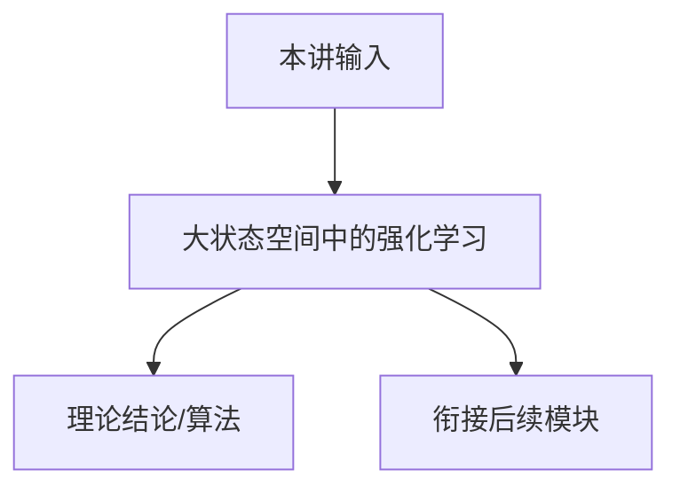

# P13 大状态空间中的强化学习 (RL in Large State Space)

← [[BV1r6cjeCEkW-总览]] | ← [[P12-离线强化学习]] | 下一篇 → [[P14-最小二乘值迭代]]

## 视频信息

| 项目 | 内容 |
|------|------|
| 分集 | 大状态空间中的强化学习 (RL in Large State Space) |
| 模块 | 大状态空间与函数逼近 |
| 时长 | 1 小时 18 分 46 秒 |
| 链接 | [B 站 P13](https://www.bilibili.com/video/BV1r6cjeCEkW?p=13) |
| 课程主页 | [Chi Jin ECE524](https://sites.google.com/view/cjin/teaching/ece524) |
| 内容来源 | 知识点增强（RL 理论体系，非逐字转写） |

## 核心要点

1. **本 P 主题**：大状态空间中的强化学习 (RL in Large State Space)
2. **模块定位**：大状态空间与函数逼近（P13–P17）
3. **考试/实践侧重**：维度灾难、线性 MDP、函数逼近、eluder dimension 预告
4. **笔记层级**：教程级（约 3127 字），含速览、图解、Walkthrough、自测题
5. **学习建议**：先通读「3 分钟速览」与「图解」，再读「详细讲解」

> 以下内容基于 Princeton ECE524 强化学习理论课程体系撰写，对应 B 站分 P「【13】大状态空间中的强化学习 (RL in Large State Space)」。**非 UP 逐字转写**；不看视频也可建立框架，看视频可对照「与视频对照表」深化。

## 本节在系列中的位置

**模块**：大状态空间与函数逼近（P13–P17）· 系列第 **P13/22** 集。

**建议前置**：[[P12-离线强化学习]]——建立本集所需背景。

**建议后续**：[[P14-最小二乘值迭代]]——在本集能力之上继续深入。

依赖主线：MDP/Bellman(P01–P03) → 概率工具(P04–P05) → 探索(P07–P11) → 离线(P12) → 函数逼近(P13–P17) → 博弈(P18–P20) → POMDP(P21–P22)。

## 3 分钟速览

**大状态空间中的强化学习** 是 Princeton ECE524 强化学习理论核心一讲。读完本节你应能：① 复述核心定义与定理；② 说明在探索/逼近/博弈链条中的位置；③ 完成一道典型推导或算法步骤。考试/面试侧重：**维度灾难、线性 MDP、函数逼近、eluder dimension 预告**。

## 零基础导读

本节「大状态空间中的强化学习」属于 **大状态空间与函数逼近**。Princeton **Chi Jin** 课程强调**可证明的样本复杂度与 regret**，而非仅算法启发式。即便未看视频，也应先建立「定义 → 算法/定理 → 证明 sketch → 与前后讲衔接」四层结构。

第一遍盯住：本讲**解决什么问题**？**关键假设**（表格/线性 MDP/零和等）是什么？**结论的量级**（$\sqrt{T}$、$d$ 依赖等）？第二遍对照课程讲义 PDF 补全证明细节。

## 详细讲解

### 1. 维度灾难

表格方法存储 $Q(s,a)$ 需 $O(SA)$ 空间，每 $(s,a)$ 需足够访问次数——当 $S$ 指数级（如 $n$ 位二进制向量 $S=2^n$）不可行。

**大状态空间**：连续控制、棋类、机器人、Atari（像素输入）。需**泛化**：相似状态相似价值。

### 2. 函数逼近

用参数化 $V_\theta(s)$ 或 $Q_\theta(s,a)$，$\theta\in\mathbb{R}^d$，$d\ll SA$。

常见架构：
- **线性**：$V_\theta(s)=\phi(s)^\top\theta$，$\phi$ 为手工或稀疏特征
- **核方法**：RKHS 中的表示
- **神经网络**：Deep RL，非线性但理论分析难

### 3. 线性 MDP 假设

若存在已知特征 $\phi(s,a)\in\mathbb{R}^d$ 使
$$P(s'|s,a)=\phi(s,a)^\top\mu(s'),\quad r(s,a)=\phi(s,a)^\top w$$
则 $Q^*$ 对 $\phi$ **线性**，可多项式样本学习——ECE524 理论分析常用此结构。

### 4. 样本复杂度目标

以 $d$ 替代 $S$：达到 $\epsilon$-最优需 $\mathrm{poly}(d,H,1/\epsilon,\log|\mathcal{A}|)$ 样本，而非 $\mathrm{poly}(S)$。

### 5. 探索再临

大空间中**计数**不可行，需**基于不确定性的 bonus**（eluder dimension、置信集）——P15、P17 主题。

### 6. 与 P14 LSVI 衔接

**Least-Squares Value Iteration** 在已知特征或线性 MDP 下，用岭回归估计 Bellman 备份，是理解 deep RL 之前最重要的可证算法之一。

### 深化理解（大状态空间中的强化学习）

**证明技巧**：本讲典型用 岭回归线性结构 + optimism。

**与深度 RL 关系**：理论结果多针对 tabular/linear；PPO/DQN 等工程方法缺乏同样强的 regret 保证，但直觉（探索 bonus、target network 稳定）与理论平行。

**作业建议**：从 [课程主页](https://sites.google.com/view/cjin/teaching/ece524) 下载 homework，将本笔记 Walkthrough 与 official solution 对照。

## 图解

## 类比与直觉

函数逼近像**用模板拟合地形**：不必记住每块砖（每个状态），用特征/神经网络泛化；但要防「模板在没数据处乱猜」（OOD）。

## 例题与场景 Walkthrough

**Walkthrough：Linear MDP 上 LSVI 一步**

1. 给定 $\phi(s,a)\in\mathbb{R}^d$，累积数据 $\mathcal{D}_h$。
2. 构造 $\Lambda=\sum\phi\phi^\top+\lambda I$，$\hat{w}=\Lambda^{-1}\sum\phi y$。
3. $Q(s,a)=\min\{\phi^\top\hat{w}+\beta\|\phi\|_{\Lambda^{-1}},H-h+1\}$。
4. $\pi_h(s)=\arg\max_a Q(s,a)$， rollout 收集新数据。
5. 反向 $h=H\ldots 1$ 重复；regret 界 $\tilde{O}(\sqrt{d^3H^3K})$。

## 常见误区

1. **「Q-learning 总能收敛」**：需表格+适当学习率；函数逼近+离策略可能发散（Deadly Triad）。
2. **「探索就是多随机」**：$\epsilon$-greedy 无 $\sqrt{T}$ regret 保证；UCB/乐观主义才有理论界。
3. **「离线 RL = 在线 RL 少交互」**：核心难在分布偏移，不是样本少而已。
4. **「POMDP 用 LSTM 就等价最优 belief」**：记忆策略一般次优；belief 规划是理论最优基准。

## 与视频对照表

| 视频段落（约） | 预期演示内容 | 笔记对应章节 |
|-------------|------------|------------|
| 开篇 0%–15% | 本集目标、背景、与前后集关系 | 本节位置、3 分钟速览 |
| 前段 15%–40% | 核心概念定义与架构图 | 零基础导读、详细讲解 |
| 中段 40%–70% | 原理展开、对比、政策/代码示例 | 图解、类比、Walkthrough |
| 后段 70%–90% | 案例、问答、易错点 | 常见误区、Checklist |
| 收尾 90%–100% | 总结、延伸资源 | 延伸阅读、自测题 |

> 本集总时长约 **78分46秒**。无官方外挂字幕时，以分 P 标题「大状态空间中的强化学习 (RL in Large State Space)」与上表主题对齐视频画面。

## 动手实践 Checklist

- [ ] 阅读 LSVI-UCB 原论文 Algorithm 1
- [ ] 理解 ridge regression 置信界推导
- [ ] 对比 tabular UCB 与 LSVI-UCB 复杂度（$S$ vs $d$）
- [ ] 思考 deep RL 缺乏 regret 保证的原因
- [ ] 完成 3 道自测题

## 延伸阅读

- Jin et al. LSVI-UCB (ICML 2020)
- Agarwal Ch.10–12
- Russo & Van Roy eluder dimension

## 自测题

1. **本讲核心考点？**  
   **答**：维度灾难、线性 MDP、函数逼近、eluder dimension 预告。

2. **本讲在 22 讲中的模块？**  
   **答**：大状态空间与函数逼近（P13–P17）。

3. **关键假设是什么？**  
   **答**：线性 MDP 或函数类 F  realizability。

4. **与上/下讲关系？**  
   **答**：承接「离线强化学习」；铺垫「最小二乘值迭代」。

5. **30 分钟复习计划？**  
   **答**：速览 + 图解 + Walkthrough 手算一遍 + 自测 Q1/Q3。

## 逐字转写

> ⏳ **待转写**（`transcript_status: 待转写`）
>
> B 站 API 无外挂字幕轨（`need_login_subtitle: true`）。可使用 `Tools/transcribe/` 下 Whisper/BiliNote 工作流后续补充。转写完成后在此节粘贴全文并更新 frontmatter `transcript_status: 已完成`。

## 关键术语

| 术语 | 说明 |
|------|------|
| MDP | 马尔可夫决策过程 (S,A,P,r,γ) |
| Regret | 累积遗憾，衡量探索算法样本效率 |
| Chi Jin | Princeton ECE 教授，RL 理论专家 |
| 线性 MDP | 转移/奖励对特征线性 |
| Eluder dim | 函数类探索复杂度 |

## 与前后分 P 的衔接

- ← **离线强化学习 (Offline RL)**（[[P12-离线强化学习]]）
- → **最小二乘值迭代 (Least-Squares Value Iteration)**（[[P14-最小二乘值迭代]]）

## 来源说明

- ✅ B 站官方元数据（`Tools/BV1r6cjeCEkW-full.json`）
- ✅ 分 P 首帧封面（`Tools/bili-fetch/fetch-bilibili.js`）
- ✅ **教程级增强**：含 Mermaid、Walkthrough、自测题（约 3127 字，2026-06-06）
- ⏳ 逐字转写：API 无外挂字幕轨；可选 Whisper/BiliNote 后续补充

## 关键截图

![[../../06-资源附件/video-notes-images/BV1r6cjeCEkW-P13-cover.jpg|B站首帧 P13]]
