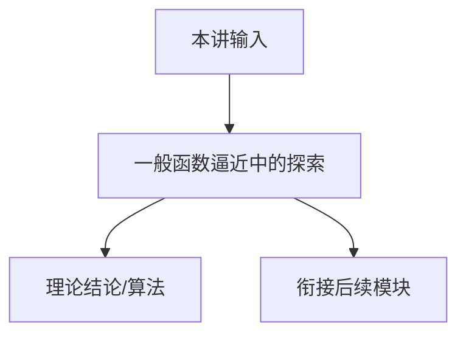

# P17 一般函数逼近中的探索 (Exploration in General Function Approximation)

← [[BV1r6cjeCEkW-总览]] | ← [[P16-一般函数近似]] | 下一篇 → [[P18-多智能体强化学习]]

## 视频信息

| 项目 | 内容 |
|------|------|
| 分集 | 一般函数逼近中的探索 (Exploration in General Function Approximation) |
| 模块 | 大状态空间与函数逼近 |
| 时长 | 1 小时 13 分 49 秒 |
| 链接 | [B 站 P17](https://www.bilibili.com/video/BV1r6cjeCEkW?p=17) |
| 课程主页 | [Chi Jin ECE524](https://sites.google.com/view/cjin/teaching/ece524) |
| 内容来源 | 知识点增强（RL 理论体系，非逐字转写） |

## 核心要点

1. **本 P 主题**：一般函数逼近中的探索 (Exploration in General Function Approximation)
2. **模块定位**：大状态空间与函数逼近（P13–P17）
3. **考试/实践侧重**：一般 F 上 UCB/Thompson、GOLF、reward-free exploration
4. **笔记层级**：教程级（约 3321 字），含速览、图解、Walkthrough、自测题
5. **学习建议**：先通读「3 分钟速览」与「图解」，再读「详细讲解」

> 以下内容基于 Princeton ECE524 强化学习理论课程体系撰写，对应 B 站分 P「【17】一般函数逼近中的探索 (Exploration in General Function Approximation)」。**非 UP 逐字转写**；不看视频也可建立框架，看视频可对照「与视频对照表」深化。

## 本节在系列中的位置

**模块**：大状态空间与函数逼近（P13–P17）· 系列第 **P17/22** 集。

**建议前置**：[[P16-一般函数近似]]——建立本集所需背景。

**建议后续**：[[P18-多智能体强化学习]]——在本集能力之上继续深入。

依赖主线：MDP/Bellman(P01–P03) → 概率工具(P04–P05) → 探索(P07–P11) → 离线(P12) → 函数逼近(P13–P17) → 博弈(P18–P20) → POMDP(P21–P22)。

## 3 分钟速览

**一般函数逼近中的探索** 是 Princeton ECE524 强化学习理论核心一讲。读完本节你应能：① 复述核心定义与定理；② 说明在探索/逼近/博弈链条中的位置；③ 完成一道典型推导或算法步骤。考试/面试侧重：**一般 F 上 UCB/Thompson、GOLF、reward-free exploration**。

## 零基础导读

本节「一般函数逼近中的探索」属于 **大状态空间与函数逼近**。Princeton **Chi Jin** 课程强调**可证明的样本复杂度与 regret**，而非仅算法启发式。即便未看视频，也应先建立「定义 → 算法/定理 → 证明 sketch → 与前后讲衔接」四层结构。

第一遍盯住：本讲**解决什么问题**？**关键假设**（表格/线性 MDP/零和等）是什么？**结论的量级**（$\sqrt{T}$、$d$ 依赖等）？第二遍对照课程讲义 PDF 补全证明细节。

## 详细讲解

### 1. 一般函数逼近下的探索

当 $Q\in\mathcal{F}$ 非线性（如 NN），UCB bonus 需定义在**参数空间**或**函数空间**：

- **置信集** $\mathcal{F}_t=\{f\in\mathcal{F}:\|f-\hat{f}_t\|_\mathcal{D}\le\beta\}$，选 optimistic $f\in\mathcal{F}_t$
- **Thompson sampling**：从后验 over $\theta$ 采样 $Q_\theta$

### 2. Eluder Dimension 再述

序列 $z_1,\ldots,z_n$，$z$ 是 $(s,a)$ 或 $\phi(s,a)$。$z_i$ **eluder** 先前点若：存在 $f,f'\in\mathcal{F}$，在前点一致、在 $z_i$ 差异大。$d_E$ 大 → 需更多探索。

**Regret**：$\tilde{O}(\sqrt{d_E H^3 K})$ 类结果（依赖具体算法 FALCON+、GOLF 等）。

### 3. Reward-free vs Reward-aware

**Reward-free exploration**：先探索覆盖状态，后任意 reward 可快速规划——样本复杂度与 $S$ 或 $d$ 相关。

**Reward-aware**：直接优化 regret，更样本高效当 reward 已知结构。

### 4. 与 P15 对比

P15 偏 linear / 大 $S$ 结构；本讲 **general $\mathcal{F}$** 的复杂度参数与算法（GOLF：global optimism + local regression）。

### 5. 实践启发

**Ensemble / disagreement**：多 Q 网络分歧作 uncertainty proxy（Bootstrapped DQN）。**Intrinsic motivation**：预测误差、计数在潜空间——工程近似 eluder 思想。

### 6. 课程小结（模块）

P13–P17 完成「大状态 + 函数逼近 + 探索」理论链：从 linear MDP（可证）到 general $\mathcal{F}$（部分可证），为理解现代 deep RL 提供数学语言。

### 深化理解（一般函数逼近中的探索）

**证明技巧**：本讲典型用 岭回归线性结构 + optimism。

**与深度 RL 关系**：理论结果多针对 tabular/linear；PPO/DQN 等工程方法缺乏同样强的 regret 保证，但直觉（探索 bonus、target network 稳定）与理论平行。

**作业建议**：从 [课程主页](https://sites.google.com/view/cjin/teaching/ece524) 下载 homework，将本笔记 Walkthrough 与 official solution 对照。

## 图解

## 类比与直觉

函数逼近像**用模板拟合地形**：不必记住每块砖（每个状态），用特征/神经网络泛化；但要防「模板在没数据处乱猜」（OOD）。

## 例题与场景 Walkthrough

**Walkthrough：Linear MDP 上 LSVI 一步**

1. 给定 $\phi(s,a)\in\mathbb{R}^d$，累积数据 $\mathcal{D}_h$。
2. 构造 $\Lambda=\sum\phi\phi^\top+\lambda I$，$\hat{w}=\Lambda^{-1}\sum\phi y$。
3. $Q(s,a)=\min\{\phi^\top\hat{w}+\beta\|\phi\|_{\Lambda^{-1}},H-h+1\}$。
4. $\pi_h(s)=\arg\max_a Q(s,a)$， rollout 收集新数据。
5. 反向 $h=H\ldots 1$ 重复；regret 界 $\tilde{O}(\sqrt{d^3H^3K})$。

## 常见误区

1. **「Q-learning 总能收敛」**：需表格+适当学习率；函数逼近+离策略可能发散（Deadly Triad）。
2. **「探索就是多随机」**：$\epsilon$-greedy 无 $\sqrt{T}$ regret 保证；UCB/乐观主义才有理论界。
3. **「离线 RL = 在线 RL 少交互」**：核心难在分布偏移，不是样本少而已。
4. **「POMDP 用 LSTM 就等价最优 belief」**：记忆策略一般次优；belief 规划是理论最优基准。

## 与视频对照表

| 视频段落（约） | 预期演示内容 | 笔记对应章节 |
|-------------|------------|------------|
| 开篇 0%–15% | 本集目标、背景、与前后集关系 | 本节位置、3 分钟速览 |
| 前段 15%–40% | 核心概念定义与架构图 | 零基础导读、详细讲解 |
| 中段 40%–70% | 原理展开、对比、政策/代码示例 | 图解、类比、Walkthrough |
| 后段 70%–90% | 案例、问答、易错点 | 常见误区、Checklist |
| 收尾 90%–100% | 总结、延伸资源 | 延伸阅读、自测题 |

> 本集总时长约 **73分49秒**。无官方外挂字幕时，以分 P 标题「一般函数逼近中的探索 (Exploration in General Function Approximation)」与上表主题对齐视频画面。

## 动手实践 Checklist

- [ ] 阅读 LSVI-UCB 原论文 Algorithm 1
- [ ] 理解 ridge regression 置信界推导
- [ ] 对比 tabular UCB 与 LSVI-UCB 复杂度（$S$ vs $d$）
- [ ] 思考 deep RL 缺乏 regret 保证的原因
- [ ] 完成 3 道自测题

## 延伸阅读

- Jin et al. LSVI-UCB (ICML 2020)
- Agarwal Ch.10–12
- Russo & Van Roy eluder dimension

## 自测题

1. **本讲核心考点？**  
   **答**：一般 F 上 UCB/Thompson、GOLF、reward-free exploration。

2. **本讲在 22 讲中的模块？**  
   **答**：大状态空间与函数逼近（P13–P17）。

3. **关键假设是什么？**  
   **答**：线性 MDP 或函数类 F  realizability。

4. **与上/下讲关系？**  
   **答**：承接「一般函数近似」；铺垫「多智能体强化学习」。

5. **30 分钟复习计划？**  
   **答**：速览 + 图解 + Walkthrough 手算一遍 + 自测 Q1/Q3。

## 逐字转写

> ⏳ **待转写**（`transcript_status: 待转写`）
>
> B 站 API 无外挂字幕轨（`need_login_subtitle: true`）。可使用 `Tools/transcribe/` 下 Whisper/BiliNote 工作流后续补充。转写完成后在此节粘贴全文并更新 frontmatter `transcript_status: 已完成`。

## 关键术语

| 术语 | 说明 |
|------|------|
| MDP | 马尔可夫决策过程 (S,A,P,r,γ) |
| Regret | 累积遗憾，衡量探索算法样本效率 |
| Chi Jin | Princeton ECE 教授，RL 理论专家 |
| GOLF | 全局乐观局部回归 |
| Reward-free | 先探索后任意 reward |

## 与前后分 P 的衔接

- ← **一般函数近似 (General Function Approximation)**（[[P16-一般函数近似]]）
- → **多智能体强化学习 (Multiagent Reinforcement Learning)**（[[P18-多智能体强化学习]]）

## 来源说明

- ✅ B 站官方元数据（`Tools/BV1r6cjeCEkW-full.json`）
- ✅ 分 P 首帧封面（`Tools/bili-fetch/fetch-bilibili.js`）
- ✅ **教程级增强**：含 Mermaid、Walkthrough、自测题（约 3321 字，2026-06-06）
- ⏳ 逐字转写：API 无外挂字幕轨；可选 Whisper/BiliNote 后续补充

## 关键截图

![[../../06-资源附件/video-notes-images/BV1r6cjeCEkW-P17-cover.jpg|B站首帧 P17]]
