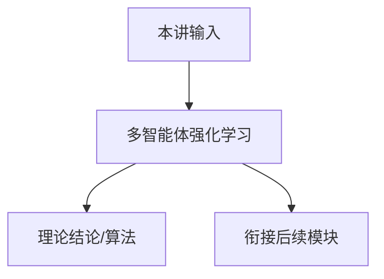

# P18 多智能体强化学习 (Multiagent Reinforcement Learning)

← [[BV1r6cjeCEkW-总览]] | ← [[P17-一般函数逼近中的探索]] | 下一篇 → [[P19-两玩家零和博弈]]

## 视频信息

| 项目 | 内容 |
|------|------|
| 分集 | 多智能体强化学习 (Multiagent Reinforcement Learning) |
| 模块 | 多智能体与博弈论 |
| 时长 | 1 小时 15 分 04 秒 |
| 链接 | [B 站 P18](https://www.bilibili.com/video/BV1r6cjeCEkW?p=18) |
| 课程主页 | [Chi Jin ECE524](https://sites.google.com/view/cjin/teaching/ece524) |
| 内容来源 | 知识点增强（RL 理论体系，非逐字转写） |

## 核心要点

1. **本 P 主题**：多智能体强化学习 (Multiagent Reinforcement Learning)
2. **模块定位**：多智能体与博弈论（P18–P20）
3. **考试/实践侧重**：MARL 设定、非平稳性、NE/CTDE、IQL 局限
4. **笔记层级**：教程级（约 2933 字），含速览、图解、Walkthrough、自测题
5. **学习建议**：先通读「3 分钟速览」与「图解」，再读「详细讲解」

> 以下内容基于 Princeton ECE524 强化学习理论课程体系撰写，对应 B 站分 P「【18】多智能体强化学习 (Multiagent Reinforcement Learning)」。**非 UP 逐字转写**；不看视频也可建立框架，看视频可对照「与视频对照表」深化。

## 本节在系列中的位置

**模块**：多智能体与博弈论（P18–P20）· 系列第 **P18/22** 集。

**建议前置**：[[P17-一般函数逼近中的探索]]——建立本集所需背景。

**建议后续**：[[P19-两玩家零和博弈]]——在本集能力之上继续深入。

依赖主线：MDP/Bellman(P01–P03) → 概率工具(P04–P05) → 探索(P07–P11) → 离线(P12) → 函数逼近(P13–P17) → 博弈(P18–P20) → POMDP(P21–P22)。

## 3 分钟速览

**多智能体强化学习** 是 Princeton ECE524 强化学习理论核心一讲。读完本节你应能：① 复述核心定义与定理；② 说明在探索/逼近/博弈链条中的位置；③ 完成一道典型推导或算法步骤。考试/面试侧重：**MARL 设定、非平稳性、NE/CTDE、IQL 局限**。

## 零基础导读

本节「多智能体强化学习」属于 **多智能体与博弈论**。Princeton **Chi Jin** 课程强调**可证明的样本复杂度与 regret**，而非仅算法启发式。即便未看视频，也应先建立「定义 → 算法/定理 → 证明 sketch → 与前后讲衔接」四层结构。

第一遍盯住：本讲**解决什么问题**？**关键假设**（表格/线性 MDP/零和等）是什么？**结论的量级**（$\sqrt{T}$、$d$ 依赖等）？第二遍对照课程讲义 PDF 补全证明细节。

## 详细讲解

### 1. 多智能体强化学习（MARL）

$N$ 个智能体，联合状态 $s$，各选动作 $a_i$，环境转移 $P(s'|s,a_1,\ldots,a_N)$，各得奖励 $r_i$（可能不同）。

**挑战**：
- **非平稳性**：从 agent $i$ 视角，环境含其他 agent 策略，随训练变化
- **信用分配**：团队 reward 如何归因
- **均衡**：多个 agent 同时学习，收敛到何种解？

### 2. 设定分类

| 类型 | 奖励 | 例 |
|------|------|-----|
| 完全合作 | 共享 $r$ | 团队机器人 |
| 完全竞争 | zero-sum | 围棋、乒乓球 |
| 一般和 | 任意 $r_i$ | 交通、拍卖 |

### 3. 解概念

**纳什均衡**（NE）：无 agent 单方面偏离可增 reward。

**相关均衡**（CE）：可通过公共信号相关策略。

**Stackelberg**：leader 先动，follower 最佳响应。

MARL 算法目标常是**学习 NE** 或 **Pareto 最优**（合作）。

### 4. 独立学习（IQL）

各 agent 独立 Q-learning，把 others 当环境——简单但不收敛 guarantee（一般和）。

**Centralized training decentralized execution (CTDE)**：训练时用全局信息，执行时仅局部观测——MADDPG、QMIX。

### 5. 与博弈论衔接

P19–P20 用博弈论工具分析**零和**与**一般和**矩阵/扩展式博弈，MARL 是「重复/随机扩展式博弈 + 学习动力学」。

### 6. 应用

自动驾驶交互、多无人机、游戏 AI（Dota、StarCraft）、LLM 多 agent 协作。理论仍弱于单 agent RL，active research area。

### 深化理解（多智能体强化学习）

**证明技巧**：本讲典型用 均衡存在性/复杂度归约。

**与深度 RL 关系**：理论结果多针对 tabular/linear；PPO/DQN 等工程方法缺乏同样强的 regret 保证，但直觉（探索 bonus、target network 稳定）与理论平行。

**作业建议**：从 [课程主页](https://sites.google.com/view/cjin/teaching/ece524) 下载 homework，将本笔记 Walkthrough 与 official solution 对照。

## 图解

## 类比与直觉

多 agent 博弈像**交通路口**：每人自私选路可能全体变慢（NE 非最优）；零和像围棋，一人赢即一人输。

## 例题与场景 Walkthrough

**Walkthrough：2×2 零和矩阵博弈**

1. Payoff $A=\begin{pmatrix}1&0\\0&1\end{pmatrix}$（匹配硬币）。
2. Minimax：P1 max min = P2 min max = 0.5。
3. NE：双方各 0.5 混合。
4. 若 P1 用 $(0.6,0.4)$，P2 best response 可 exploit。
5. No-regret 学习平均策略收敛到 NE（P19 定理）。

## 常见误区

1. **「Q-learning 总能收敛」**：需表格+适当学习率；函数逼近+离策略可能发散（Deadly Triad）。
2. **「探索就是多随机」**：$\epsilon$-greedy 无 $\sqrt{T}$ regret 保证；UCB/乐观主义才有理论界。
3. **「离线 RL = 在线 RL 少交互」**：核心难在分布偏移，不是样本少而已。
4. **「POMDP 用 LSTM 就等价最优 belief」**：记忆策略一般次优；belief 规划是理论最优基准。

## 与视频对照表

| 视频段落（约） | 预期演示内容 | 笔记对应章节 |
|-------------|------------|------------|
| 开篇 0%–15% | 本集目标、背景、与前后集关系 | 本节位置、3 分钟速览 |
| 前段 15%–40% | 核心概念定义与架构图 | 零基础导读、详细讲解 |
| 中段 40%–70% | 原理展开、对比、政策/代码示例 | 图解、类比、Walkthrough |
| 后段 70%–90% | 案例、问答、易错点 | 常见误区、Checklist |
| 收尾 90%–100% | 总结、延伸资源 | 延伸阅读、自测题 |

> 本集总时长约 **75分04秒**。无官方外挂字幕时，以分 P 标题「多智能体强化学习 (Multiagent Reinforcement Learning)」与上表主题对齐视频画面。

## 动手实践 Checklist

- [ ] 解一个 2×2 矩阵博弈 NE
- [ ] 阅读 POMDP 经典 Tiger/Labyrinth 例子
- [ ] 了解 Dec-POMDP 与 CTDE 区别
- [ ] 复盘 22 讲知识地图
- [ ] 选 1 篇 Chi Jin 论文精读摘要

## 延伸阅读

- Osborne & Rubinstein *Course in Game Theory*
- Kaelbling et al. POMDP survey
- Agarwal Ch.14–15 + MARL 综述

## 自测题

1. **本讲核心考点？**  
   **答**：MARL 设定、非平稳性、NE/CTDE、IQL 局限。

2. **本讲在 22 讲中的模块？**  
   **答**：多智能体与博弈论（P18–P20）。

3. **关键假设是什么？**  
   **答**：有限玩家/动作、零和或一般和。

4. **与上/下讲关系？**  
   **答**：承接「一般函数逼近中的探索」；铺垫「两玩家零和博弈」。

5. **30 分钟复习计划？**  
   **答**：速览 + 图解 + Walkthrough 手算一遍 + 自测 Q1/Q3。

## 逐字转写

> ⏳ **待转写**（`transcript_status: 待转写`）
>
> B 站 API 无外挂字幕轨（`need_login_subtitle: true`）。可使用 `Tools/transcribe/` 下 Whisper/BiliNote 工作流后续补充。转写完成后在此节粘贴全文并更新 frontmatter `transcript_status: 已完成`。

## 关键术语

| 术语 | 说明 |
|------|------|
| MDP | 马尔可夫决策过程 (S,A,P,r,γ) |
| Regret | 累积遗憾，衡量探索算法样本效率 |
| Chi Jin | Princeton ECE 教授，RL 理论专家 |
| MARL | 多智能体 RL |
| CTDE | 集中训练分散执行 |

## 与前后分 P 的衔接

- ← **一般函数逼近中的探索 (Exploration in General Function Approximation)**（[[P17-一般函数逼近中的探索]]）
- → **两玩家零和博弈 (Two-Player Zero-Sum Games)**（[[P19-两玩家零和博弈]]）

## 来源说明

- ✅ B 站官方元数据（`Tools/BV1r6cjeCEkW-full.json`）
- ✅ 分 P 首帧封面（`Tools/bili-fetch/fetch-bilibili.js`）
- ✅ **教程级增强**：含 Mermaid、Walkthrough、自测题（约 2933 字，2026-06-06）
- ⏳ 逐字转写：API 无外挂字幕轨；可选 Whisper/BiliNote 后续补充

## 关键截图

![[../../06-资源附件/video-notes-images/BV1r6cjeCEkW-P18-cover.jpg|B站首帧 P18]]
