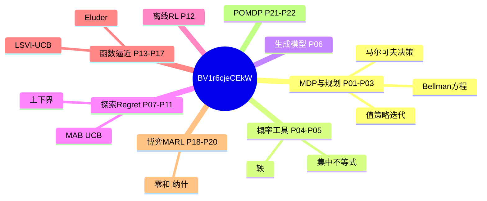

# 强化学习理论基础 · 思维导图

← [[BV1r6cjeCEkW-总览]]



## 分 P 详图

```mermaid
mindmap
  root((【Proof-Trivial】强化学习理))
    P01 马尔科夫决策过程基础 (MDP) ~3774字
      [[P01-马尔科夫决策过程基础]]
    P02 贝尔曼方程 (Bellman E ~3566字
      [[P02-贝尔曼方程]]
    P03 规划 (Planning) ~3479字
      [[P03-规划]]
    P04 集中不等式 (Concentra ~3479字
      [[P04-集中不等式]]
    P05 鞅 (Martingale Co ~3268字
      [[P05-鞅]]
    P06 生成模型 (Generative ~3283字
      [[P06-生成模型]]
    P07 探索 (Exploration) ~3077字
      [[P07-探索]]
    P08 多臂Bandit中的探索 (MA ~3450字
      [[P08-多臂Bandit中的探索]]
    P09 强化学习中的探索 (Explor ~3299字
      [[P09-强化学习中的探索]]
    P10 多臂Bandit下界 (Lowe ~3366字
      [[P10-多臂Bandit下界]]
    P11 MDP下界 (Lower Bou ~3137字
      [[P11-MDP下界]]
    P12 离线强化学习 (Offline  ~3128字
      [[P12-离线强化学习]]
    P13 大状态空间中的强化学习 (RL  ~3127字
      [[P13-大状态空间中的强化学习]]
    P14 最小二乘值迭代 (Least-S ~3475字
      [[P14-最小二乘值迭代]]
    P15 大状态空间中的探索 (Explo ~3239字
      [[P15-大状态空间中的探索Space]]
    P16 一般函数近似 (General  ~3341字
      [[P16-一般函数近似]]
    P17 一般函数逼近中的探索 (Expl ~3321字
      [[P17-一般函数逼近中的探索]]
    P18 多智能体强化学习 (Multia ~2933字
      [[P18-多智能体强化学习]]
    P19 两玩家零和博弈 (Two-Pla ~3103字
      [[P19-两玩家零和博弈]]
    P20 多人一般和博弈 (Multipl ~3027字
      [[P20-多人一般和博弈]]
    P21 部分可观测强化学习1 (Part ~3251字
      [[P21-部分可观测强化学习1I]]
    P22 部分可观测强化学习2 (Part ~3409字
      [[P22-部分可观测强化学习2II]]
```

> 各 P 已按**教程级**增强（2026-06-06，合计约 72532 字，均篇 3297 字）。封面见 `06-资源附件/video-notes-images/`。
