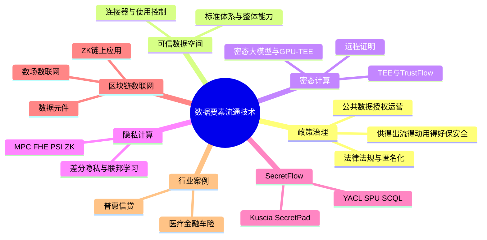
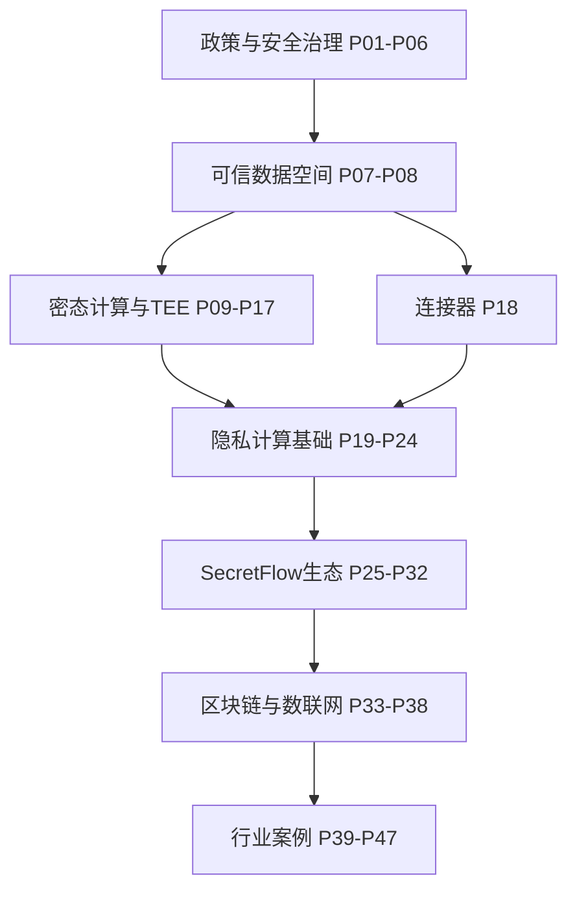

# 数据要素技术

> 隐语 SecretFlow 官方「**数据要素流通技术**」系列教程，共 **47** 个分 P（约 28h 23m 32s）。UP **defa_pro** 从政策解读到 MPC、联邦学习、可信数据空间、区块链与行业案例，系统讲解数据要素流通技术栈。
>
> 各分 P 笔记已补充 **数据要素流通技术知识点实质内容**（约 800–1500 字/篇，2026-06-06）。B 站 API 无外挂字幕，逐字稿可后续用 Whisper/BiliNote 补充。

## 视频简介（B 站原文）

https://www.secretflow.org.cn/zh-CN/docs

官方文档：[SecretFlow 文档](https://www.secretflow.org.cn/zh-CN/docs)

## 视频数据

| 字段 | 内容 |
|------|------|
| BV 号 | BV1ser5BDESU |
| UP 主 | defa_pro |
| 合集 | 数据要素流通技术 |
| 总时长 | 28h 23m 32s（102212 秒） |
| 分 P 数 | 47 |
| 播放量 | 1,151（抓取时） |
| 收藏 | 98 |
| 标签 | 联邦学习、数据交易、隐私计算、数据要素、可信数据空间、数场、区块链、数据资产 |
| 字幕状态 | 无外挂字幕轨（视频为内嵌配音字幕，API 返回空列表） |

## 思维导图

## 分 P 索引

| 分 P | B 站分集标题 | 时长 | 字数 | 笔记 |
|------|-------------|------|------|------|
| P01 | 确保数据资源供得出、流得动、用得好、保安全——国家数据相关政策解读 | 68分35秒 | ~3084 | [[P01-确保数据资源供得出、流得动、用得好、保安全--国家数据相关政策解读]] |
| P02 | 公共数据开发利用及授权运营 | 50分15秒 | ~2887 | [[P02-公共数据开发利用及授权运营]] |
| P03 | 数据安全领域法律法规体系解读 | 49分36秒 | ~3003 | [[P03-数据安全领域法律法规体系解读]] |
| P04 | 个人信息匿名化制度与实践 | 48分51秒 | ~2847 | [[P04-个人信息匿名化制度与实践]] |
| P05 | 数据流通安全治理中的制度与技术问题 | 44分04秒 | ~2908 | [[P05-数据流通安全治理中的制度与技术问题]] |
| P06 | 数据要素安全分级：隐私计算产品安全能力分级要求 | 13分38秒 | ~2905 | [[P06-数据要素安全分级-隐私计算产品安全能力分级要求]] |
| P07 | 可信数据空间标准体系 | 36分54秒 | ~2859 | [[P07-可信数据空间标准体系]] |
| P08 | 可信数据空间整体能力 | 35分15秒 | ~2772 | [[P08-可信数据空间整体能力]] |
| P09 | 密态计算概念介绍 | 42分50秒 | ~3072 | [[P09-密态计算概念介绍]] |
| P10 | 密态底座-密态胶囊 | 11分03秒 | ~3015 | [[P10-密态底座-密态胶囊]] |
| P11 | 深入理解TEE OSes | 72分11秒 | ~2869 | [[P11-深入理解TEEOSes]] |
| P12 | 基于可信硬件的隐私计算框架TrustFlow | 18分48秒 | ~2843 | [[P12-基于可信硬件的隐私计算框架TrustFlow]] |
| P13 | 密态大模型 | 29分43秒 | ~2967 | [[P13-密态大模型]] |
| P14 | 密态大数据安全方案与实践 | 21分59秒 | ~3014 | [[P14-密态大数据安全方案与实践]] |
| P15 | HyperGPU：基于通用硬件构建GPU-TEE底座 | 42分10秒 | ~3079 | [[P15-HyperGPU-基于通用硬件构建GPU-TEE底座]] |
| P16 | 机密容器的安全设计及落地实践 | 28分41秒 | ~3106 | [[P16-机密容器的安全设计及落地实践]] |
| P17 | 星绽机密计算远程证明服务：构建数据要素流通的信任基座 | 27分14秒 | ~3092 | [[P17-星绽机密计算远程证明服务-构建数据要素流通的信任基座]] |
| P18 | 可信数据空间-连接器 | 41分40秒 | ~3024 | [[P18-可信数据空间-连接器]] |
| P19 | 多方安全计算MPC | 52分04秒 | ~3074 | [[P19-多方安全计算MPC]] |
| P20 | 全同态加密基本原理和应用 | 71分39秒 | ~2997 | [[P20-全同态加密基本原理和应用]] |
| P21 | 安全求交和匿踪查询 | 51分37秒 | ~2979 | [[P21-安全求交和匿踪查询]] |
| P22 | 零知识证明ZK | 52分31秒 | ~2969 | [[P22-零知识证明ZK]] |
| P23 | 差分隐私基础理论与核心概念 | 53分10秒 | ~2886 | [[P23-差分隐私基础理论与核心概念]] |
| P24 | 联邦学习FL | 43分18秒 | ~2903 | [[P24-联邦学习FL]] |
| P25 | 通用隐私计算框架 SecretFlow | 24分05秒 | ~4594 | [[P25-通用隐私计算框架SecretFlow]] |
| P26 | 隐私计算密码库 YACL | 21分49秒 | ~3156 | [[P26-隐私计算密码库YACL]] |
| P27 | 密态计算单元 SPU | 20分31秒 | ~3033 | [[P27-密态计算单元SPU]] |
| P28 | 隐私集合求交 PSI | 23分06秒 | ~3114 | [[P28-隐私集合求交PSI]] |
| P29 | 安全协作查询语言 SCQL | 27分51秒 | ~3078 | [[P29-安全协作查询语言SCQL]] |
| P30 | 基于K8S的跨域隐私计算应用编排框架Kuscia | 29分17秒 | ~3248 | [[P30-基于K8S的跨域隐私计算应用编排框架Kuscia]] |
| P31 | 隐语开源版SecretPad导论 | 24分48秒 | ~3171 | [[P31-隐语开源版SecretPad导论]] |
| P32 | KusciaAPI的相关概念和场景实践-正式版 | 26分17秒 | ~3223 | [[P32-KusciaAPI的相关概念和场景实践-正式版]] |
| P33 | 数据元件：安全可信流通的新模式 | 31分36秒 | ~2952 | [[P33-数据元件-安全可信流通的新模式]] |
| P34 | 区块链与数据安全1 | 62分33秒 | ~2921 | [[P34-区块链与数据安全1]] |
| P35 | 区块链与数据安全2 | 59分15秒 | ~2926 | [[P35-区块链与数据安全2]] |
| P36 | 让数据“可流通、可验证、不可泄露”——零知识证明在区块链中的应用探索 | 36分55秒 | ~3010 | [[P36-让数据“可流通、可验证、不可泄露”--零知识证明在区块链中的应用探索]] |
| P37 | 数联网与数据空间：私域数据广域流通及复用的基础设施 | 40分54秒 | ~2999 | [[P37-数联网与数据空间-私域数据广域流通及复用的基础设施]] |
| P38 | 数场技术及架构 | 43分31秒 | ~2869 | [[P38-数场技术及架构]] |
| P39 | 案例：新冠重病预测 | 24分47秒 | ~2973 | [[P39-案例-新冠重病预测]] |
| P40 | 综合案例与实战：金融风控联合建模 | 20分38秒 | ~3014 | [[P40-综合案例与实战-金融风控联合建模]] |
| P41 | 综合案例与实践：跨企业数据查询 | 16分58秒 | ~3067 | [[P41-综合案例与实践-跨企业数据查询]] |
| P42 | 利用隐语在运营商间跨域结算精密对账场景的应用实践 | 21分47秒 | ~2984 | [[P42-利用隐语在运营商间跨域结算精密对账场景的应用实践]] |
| P43 | 隐私计算-隐语护航：医疗健康数据安全协作的架构与实践 | 34分44秒 | ~3037 | [[P43-隐私计算-隐语护航-医疗健康数据安全协作的架构与实践]] |
| P44 | 隐语在新能源车险联合定价中的实践 | 25分12秒 | ~2950 | [[P44-隐语在新能源车险联合定价中的实践]] |
| P45 | 可信数据空间-行业级可信数据空间实践：隐语在汽车流通领域的深度赋能 | 23分27秒 | ~3042 | [[P45-可信数据空间-行业级可信数据空间实践-隐语在汽车流通领域的深度赋能]] |
| P46 | 密态计算技术在车险行业的应用及前景 | 23分40秒 | ~3027 | [[P46-密态计算技术在车险行业的应用及前景]] |
| P47 | 多方联合建模助力普惠信贷 | 32分05秒 | ~3059 | [[P47-多方联合建模助力普惠信贷]] |

## 学习路径

### 按主题分组

1. **政策与安全治理（P01–P06）** — 国家数据政策、公共数据授权、法律法规、匿名化、流通安全、产品分级
2. **可信数据空间（P07–P08、P18）** — 标准体系、整体能力、连接器
3. **密态计算与 TEE（P09–P17）** — 密态概念、密态胶囊、TEE OS、TrustFlow、密态大模型、GPU-TEE、机密容器、远程证明
4. **隐私计算核心技术（P19–P24）** — MPC、FHE、PSI/匿踪查询、ZK、差分隐私、联邦学习
5. **SecretFlow 生态（P25–P32）** — SecretFlow、YACL、SPU、PSI、SCQL、Kuscia、SecretPad、KusciaAPI
6. **数据元件·区块链·数联网（P33–P38）** — 数据元件、区块链与数据安全、ZK 链上应用、数联网与数场
7. **行业实践案例（P39–P47）** — 新冠预测、金融风控、跨企业查询、运营商对账、医疗、车险、汽车流通、普惠信贷

> 建议：零基础先 P01–P08 建立制度框架；有开发基础可 P09 后并行学技术栈；P25 起配合 SecretFlow 本地环境动手实践。

## 关联资源

- 原始 API 数据：`Tools/BV1ser5BDESU-full.json`
- 笔记生成：`Tools/bili-fetch/generate-data-element-notes.js`
- 知识点增强：`Tools/bili-fetch/enhance-data-element-notes.js`
- 封面目录：[[../../06-资源附件/video-notes-images/]]
- 思维导图：[[思维导图]]
- 官方文档：https://www.secretflow.org.cn/zh-CN/docs

## 工具与数据文件

| 工具 | 路径 | 用途 |
|------|------|------|
| Node 抓取脚本 | `Tools/bili-fetch/fetch-bilibili.js` | 元数据 + 首帧封面 |
| 结构化摘要 | `Tools/BV1ser5BDESU-full.json` | 分 P 数据 |
| 知识点库 | `Tools/bili-fetch/content/data-element-knowledge.js` | 批量维护增强内容 |
