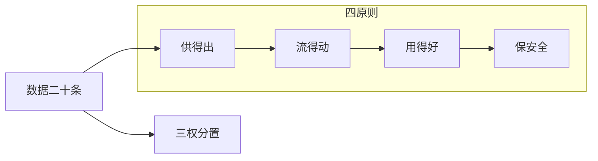

# P01 确保数据资源供得出、流得动、用得好、保安全——国家数据相关政策解读

← [[BV1ser5BDESU-总览]] | 下一篇 → [[P02-公共数据开发利用及授权运营]]

## 视频信息

| 项目 | 内容 |
|------|------|
| 分集 | 确保数据资源供得出、流得动、用得好、保安全——国家数据相关政策解读 |
| 模块 | 政策与安全治理 |
| 时长 | 68 分 35 秒 |
| 链接 | [B 站 P1](https://www.bilibili.com/video/BV1ser5BDESU?p=1) |
| 官方文档 | [SecretFlow 文档](https://www.secretflow.org.cn/zh-CN/docs) |
| 内容来源 | 知识点增强（数据要素流通技术体系，非逐字转写） |

## 核心要点

1. **本 P 主题**：确保数据资源供得出、流得动、用得好、保安全——国家数据相关政策解读
2. **模块定位**：政策与安全治理
3. **考试/实践侧重**：二十条意见、数据二十条、供得出流得动用得好保安全四原则
4. **笔记层级**：教程级（约 3084 字），含速览、图解、场景 Walkthrough、自测题
5. **学习建议**：先通读「3 分钟速览」与「图解」，再读「详细讲解」；动手项见 Checklist

> 以下内容基于数据要素流通与隐私计算技术体系撰写，对应 B 站分 P「确保数据资源供得出、流得动、用得好、保安全——国家数据相关政策解读」。**非 UP 逐字转写**；不看视频也可建立框架，看视频可对照「与视频对照表」深化。

## 本节在系列中的位置

**模块**：政策与安全治理 · 系列第 **P01/47** 集。

**系列起点**：建议先浏览 [[BV1ser5BDESU-总览]] 把握 47 集路线图。

**建议后续**：[[公共数据开发利用及授权运营]]——在本集能力之上继续深入。

依赖关系：政策(P01–P06) → 可信空间(P07–P08,P18) → 密态/隐私技术(P09–P24) → SecretFlow 工程(P25–P32) → 基础设施与案例(P33–P47)。

## 3 分钟速览

**确保数据资源供得出、流得动、用得好、保安全——国家数据相关政策解读** 是数据要素流通体系中的关键一课。读完本节你应能回答：① 核心概念定义；② 在「供得出—流得动—用得好—保安全」链条中的位置；③ 与隐私计算技术栈的衔接。考试/面试侧重：**二十条意见、数据二十条、供得出流得动用得好保安全四原则**。

## 零基础导读

本节「确保数据资源供得出、流得动、用得好、保安全——国家数据相关政策解读」属于 **政策与安全治理**。即便未看视频，也应先建立**制度—技术—场景**三层视角：政策类章节回答「为什么允许流」；技术类章节回答「如何安全地算」；案例类章节回答「真实行业怎么落地」。

第一遍阅读请盯住三个问题：本集**解决什么痛点**？**关键参与方**是谁？**交付物或能力边界**是什么？第二遍阅读时，把术语表抄到 Obsidian 双链笔记，与前后分 P 交叉引用。

## 详细讲解

### 1. 数据要素战略背景

2022 年底「数据二十条」《中共中央 国务院关于构建数据基础制度更好发挥数据要素作用的意见》确立数据作为第五大生产要素的制度框架。2024 年《政府工作报告》提出「健全数据基础制度，做大做强数据要素市场」。本 P 围绕**供得出、流得动、用得好、保安全**四条主线解读国家政策脉络。

### 2. 四原则内涵

| 原则 | 核心要求 | 政策抓手 |
|------|----------|----------|
| 供得出 | 公共数据、企业数据有效供给 | 分类分级、目录登记、授权运营 |
| 流得动 | 合规高效流通 | 交易场所、跨境规则、可信空间 |
| 用得好 | 赋能千行百业 | 场景创新、融合应用、数据元件 |
| 保安全 | 全生命周期安全 | 安全评估、隐私计算、审计溯源 |

### 3. 关键政策文件

- **数据二十条**：产权三权分置（持有权、加工使用权、产品经营权）、流通交易制度、收益分配、安全治理
- **「数据要素×」三年行动计划（2024–2026）**：12 个重点行业场景
- **国家数据局职责**：统筹推进数字中国、数字经济、数字社会、数字政府，协调数据要素基础制度建设

### 4. 数据基础制度体系

1. **产权制度**：淡化所有权、强调使用权，建立数据资源持有权、加工使用权、产品经营权分置
2. **流通制度**：场内场外结合、培育交易生态
3. **分配制度**：按价值贡献参与分配
4. **治理制度**：分类分级、安全评估、跨境管理

### 5. 实践要点

- 企业应建立**数据资产台账**：来源、类型、敏感级别、授权范围
- 参与流通前完成**合规性评估**：合法性、正当性、必要性
- 技术侧部署**隐私计算/可信空间**作为「保安全」基础设施

### 6. 考试/面试要点

- 能阐述四原则及对应制度
- 说出数据二十条「三权分置」含义
- 区分数据局与网信办、工信部在数据治理中的分工

### 7. 地方实践观察

北京、上海、深圳等地已出台数据要素先行先试政策：公共数据专区、国际数据港、数据资产入表试点。企业应跟踪**地方细则**与国家顶层设计衔接。

### 8. 与后续课程衔接

P02 公共数据授权运营是「供得出」的落地机制；P07 可信数据空间是「流得动」的基础设施；P19 起隐私计算技术支撑「保安全」。

### 9. 自测题

1. 数据二十条提出的三权是什么？2. 「数据要素×」覆盖哪些行业？3. 国家数据局成立的意义？

### 深化理解（确保数据资源供得出、流得动、用得好、保安全——国家数据相关政策解读）

将本节概念放入「数据二十条」四原则框架：它主要支撑哪一条原则？若去掉该能力，哪类数据流通场景会受阻？用一句话向非技术经理解释本节价值。

## 图解

## 类比与直觉

数据要素政策像**交通规则**：先定道路（制度）、再发驾照（授权）、最后装护栏（安全技术）。没有规则，车（数据）跑得越快越危险。

## 例题与场景 Walkthrough

**场景：某市大数据局推进公共数据授权运营**

- **政策依据**：数据二十条、公共数据授权运营规范。
- **供得出**：交通局提供路况统计、医保局提供脱敏就诊汇总——先进目录、分级。
- **流得动**：通过可信数据空间连接器登记数据产品，API 或隐私计算方式交付。
- **用得好**：创业公司将路况+人口统计做成选址 SaaS。
- **保安全**：原始明细不出域；运营机构留存审计日志；使用方签署用途限制。
- **本集切入点**：确保数据资源供得出、流得动、用得好、保安全——国家数据相关政策解读 主要约束上述链条中的 **政策与安全治理** 环节。

## 常见误区

1. **「学完本集就会用隐语」**：SecretFlow 生态需多集串联（P19–P32），单集只是拼图一块。
2. **「隐私计算等于不上传数据」**：数据仍以密文、份额或授权方式参与计算，网络与算力开销客观存在。
3. **「TEE 绝对安全」**：TEE 依赖硬件与侧信道防护，需远程证明（P17）与补丁策略。
4. **「区块链解决一切确权」**：链适合存证与交易撮合，大规模计算仍在链下隐私计算引擎。

## 与视频对照表

| 视频段落（约） | 预期演示内容 | 笔记对应章节 |
|-------------|------------|------------|
| 开篇 0%–15% | 本集目标、背景、与前后集关系 | 本节位置、3 分钟速览 |
| 前段 15%–40% | 核心概念定义与架构图 | 零基础导读、详细讲解 |
| 中段 40%–70% | 原理展开、对比、政策/代码示例 | 图解、类比、Walkthrough |
| 后段 70%–90% | 案例、问答、易错点 | 常见误区、Checklist |
| 收尾 90%–100% | 总结、延伸资源 | 延伸阅读、自测题 |

> 本集总时长约 **68分35秒**。无官方外挂字幕时，以分 P 标题「确保数据资源供得出、流得动、用得好、保安全——国家数据相关政策解读」与上表主题对齐视频画面。

## 动手实践 Checklist

- [ ] 精读数据二十条原文 1 遍（国务院公报）
- [ ] 制作「三法」义务对照表
- [ ] 写出四原则各 1 个本地案例
- [ ] 与合规同事确认 1 个业务的数据分类分级
- [ ] 完成 5 道自测并口述给同事听

## 延伸阅读

- 国务院「关于构建数据基础制度更好发挥数据要素作用的意见」
- 《数据安全法》《个人信息保护法》
- 国家数据局「数据要素×」行动计划

## 自测题

1. **本集核心考点？**  
   **答**：二十条意见、数据二十条、供得出流得动用得好保安全四原则。

2. **本集在四原则中的位置？**  
   **答**：主要对应制度与治理（供得出/保安全）。

3. **与 SecretFlow 的关系？**  
   **答**：提供合规与架构前提，后续技术集在其上落地。

4. **一项落地检查？**  
   **答**：是否有授权、是否最小必要、是否可审计——三者缺一不可。

5. **30 秒口述本集？**  
   **答**：用「输入→处理→输出」各一句话概括（见 Walkthrough）。

## 关键术语

| 术语 | 说明 |
|------|------|
| 数据要素 | 可参与社会化配置、创造价值的数字化资源 |
| 隐私计算 | 数据可用不可见前提下实现协作计算的技术体系 |
| 供得出 | 健全供给体系 |
| 流得动 | 建设流通设施 |
| 用得好 | 深化融合应用 |
| 保安全 | 完善治理机制 |

## 与前后分 P 的衔接

- ← 课程起点，见 [[BV1ser5BDESU-总览]]
- → **公共数据开发利用及授权运营**（[[P02-公共数据开发利用及授权运营]]）

## 来源说明

- ✅ B 站官方元数据（`Tools/BV1ser5BDESU-full.json`）
- ✅ 分 P 首帧封面（`Tools/bili-fetch/fetch-bilibili.js`）
- ✅ **教程级增强**：含图解/Mermaid、场景 Walkthrough、自测题（约 3084 字，2026-06-06）
- ⏳ 逐字转写：B 站 API 无外挂字幕轨；可选 Whisper/BiliNote 后续补充

## 关键截图

![[../../06-资源附件/video-notes-images/BV1ser5BDESU-P01-cover.jpg|B站首帧 P01]]
