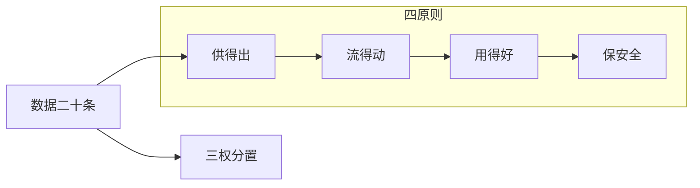

# P01 确保数据资源供得出、流得动、用得好、保安全——国家数据相关政策解读

← [[BV1ser5BDESU-总览]] | 下一篇 → [[P02-公共数据开发利用及授权运营]]

## 视频信息

| 项目 | 内容 |
|------|------|
| 分集 | 确保数据资源供得出、流得动、用得好、保安全——国家数据相关政策解读 |
| 模块 | 政策与安全治理 |
| 时长 | 68 分 35 秒 |
| 链接 | [B 站 P1](https://www.bilibili.com/video/BV1ser5BDESU?p=1) |
| 官方文档 | [SecretFlow 文档](https://www.secretflow.org.cn/zh-CN/docs) |
| 内容来源 | 知识点增强（数据要素流通技术体系，非逐字转写） |

## 核心要点

1. **本 P 主题**：确保数据资源供得出、流得动、用得好、保安全——国家数据相关政策解读
2. **模块定位**：政策与安全治理
3. **考试/实践侧重**：二十条意见、数据二十条、供得出流得动用得好保安全四原则
4. **笔记层级**：教程级（约 3084 字），含速览、图解、场景 Walkthrough、自测题
5. **学习建议**：先通读「3 分钟速览」与「图解」，再读「详细讲解」；动手项见 Checklist

> 以下内容基于数据要素流通与隐私计算技术体系撰写，对应 B 站分 P「确保数据资源供得出、流得动、用得好、保安全——国家数据相关政策解读」。**非 UP 逐字转写**；不看视频也可建立框架，看视频可对照「与视频对照表」深化。

## 本节在系列中的位置

**模块**：政策与安全治理 · 系列第 **P01/47** 集。

**系列起点**：建议先浏览 [[BV1ser5BDESU-总览]] 把握 47 集路线图。

**建议后续**：[[公共数据开发利用及授权运营]]——在本集能力之上继续深入。

依赖关系：政策(P01–P06) → 可信空间(P07–P08,P18) → 密态/隐私技术(P09–P24) → SecretFlow 工程(P25–P32) → 基础设施与案例(P33–P47)。

## 3 分钟速览

**确保数据资源供得出、流得动、用得好、保安全——国家数据相关政策解读** 是数据要素流通体系中的关键一课。读完本节你应能回答：① 核心概念定义；② 在「供得出—流得动—用得好—保安全」链条中的位置；③ 与隐私计算技术栈的衔接。考试/面试侧重：**二十条意见、数据二十条、供得出流得动用得好保安全四原则**。

## 零基础导读

本节「确保数据资源供得出、流得动、用得好、保安全——国家数据相关政策解读」属于 **政策与安全治理**。即便未看视频，也应先建立**制度—技术—场景**三层视角：政策类章节回答「为什么允许流」；技术类章节回答「如何安全地算」；案例类章节回答「真实行业怎么落地」。

第一遍阅读请盯住三个问题：本集**解决什么痛点**？**关键参与方**是谁？**交付物或能力边界**是什么？第二遍阅读时，把术语表抄到 Obsidian 双链笔记，与前后分 P 交叉引用。

## 详细讲解

### 1. 数据要素战略背景

2022 年底「数据二十条」《中共中央 国务院关于构建数据基础制度更好发挥数据要素作用的意见》确立数据作为第五大生产要素的制度框架。2024 年《政府工作报告》提出「健全数据基础制度，做大做强数据要素市场」。本 P 围绕**供得出、流得动、用得好、保安全**四条主线解读国家政策脉络。

### 2. 四原则内涵

| 原则 | 核心要求 | 政策抓手 |
|------|----------|----------|
| 供得出 | 公共数据、企业数据有效供给 | 分类分级、目录登记、授权运营 |
| 流得动 | 合规高效流通 | 交易场所、跨境规则、可信空间 |
| 用得好 | 赋能千行百业 | 场景创新、融合应用、数据元件 |
| 保安全 | 全生命周期安全 | 安全评估、隐私计算、审计溯源 |

### 3. 关键政策文件

- **数据二十条**：产权三权分置（持有权、加工使用权、产品经营权）、流通交易制度、收益分配、安全治理
- **「数据要素×」三年行动计划（2024–2026）**：12 个重点行业场景
- **国家数据局职责**：统筹推进数字中国、数字经济、数字社会、数字政府，协调数据要素基础制度建设

### 4. 数据基础制度体系

1. **产权制度**：淡化所有权、强调使用权，建立数据资源持有权、加工使用权、产品经营权分置
2. **流通制度**：场内场外结合、培育交易生态
3. **分配制度**：按价值贡献参与分配
4. **治理制度**：分类分级、安全评估、跨境管理

### 5. 实践要点

- 企业应建立**数据资产台账**：来源、类型、敏感级别、授权范围
- 参与流通前完成**合规性评估**：合法性、正当性、必要性
- 技术侧部署**隐私计算/可信空间**作为「保安全」基础设施

### 6. 考试/面试要点

- 能阐述四原则及对应制度
- 说出数据二十条「三权分置」含义
- 区分数据局与网信办、工信部在数据治理中的分工

### 7. 地方实践观察

北京、上海、深圳等地已出台数据要素先行先试政策：公共数据专区、国际数据港、数据资产入表试点。企业应跟踪**地方细则**与国家顶层设计衔接。

### 8. 与后续课程衔接

P02 公共数据授权运营是「供得出」的落地机制；P07 可信数据空间是「流得动」的基础设施；P19 起隐私计算技术支撑「保安全」。

### 9. 自测题

1. 数据二十条提出的三权是什么？2. 「数据要素×」覆盖哪些行业？3. 国家数据局成立的意义？

### 深化理解（确保数据资源供得出、流得动、用得好、保安全——国家数据相关政策解读）

将本节概念放入「数据二十条」四原则框架：它主要支撑哪一条原则？若去掉该能力，哪类数据流通场景会受阻？用一句话向非技术经理解释本节价值。

## 图解

## 类比与直觉

数据要素政策像**交通规则**：先定道路（制度）、再发驾照（授权）、最后装护栏（安全技术）。没有规则，车（数据）跑得越快越危险。

## 例题与场景 Walkthrough

**场景：某市大数据局推进公共数据授权运营**

- **政策依据**：数据二十条、公共数据授权运营规范。
- **供得出**：交通局提供路况统计、医保局提供脱敏就诊汇总——先进目录、分级。
- **流得动**：通过可信数据空间连接器登记数据产品，API 或隐私计算方式交付。
- **用得好**：创业公司将路况+人口统计做成选址 SaaS。
- **保安全**：原始明细不出域；运营机构留存审计日志；使用方签署用途限制。
- **本集切入点**：确保数据资源供得出、流得动、用得好、保安全——国家数据相关政策解读 主要约束上述链条中的 **政策与安全治理** 环节。

## 常见误区

1. **「学完本集就会用隐语」**：SecretFlow 生态需多集串联（P19–P32），单集只是拼图一块。
2. **「隐私计算等于不上传数据」**：数据仍以密文、份额或授权方式参与计算，网络与算力开销客观存在。
3. **「TEE 绝对安全」**：TEE 依赖硬件与侧信道防护，需远程证明（P17）与补丁策略。
4. **「区块链解决一切确权」**：链适合存证与交易撮合，大规模计算仍在链下隐私计算引擎。

## 与视频对照表

| 视频段落（约） | 预期演示内容 | 笔记对应章节 |
|-------------|------------|------------|
| 开篇 0%–15% | 本集目标、背景、与前后集关系 | 本节位置、3 分钟速览 |
| 前段 15%–40% | 核心概念定义与架构图 | 零基础导读、详细讲解 |
| 中段 40%–70% | 原理展开、对比、政策/代码示例 | 图解、类比、Walkthrough |
| 后段 70%–90% | 案例、问答、易错点 | 常见误区、Checklist |
| 收尾 90%–100% | 总结、延伸资源 | 延伸阅读、自测题 |

> 本集总时长约 **68分35秒**。无官方外挂字幕时，以分 P 标题「确保数据资源供得出、流得动、用得好、保安全——国家数据相关政策解读」与上表主题对齐视频画面。

## 动手实践 Checklist

- [ ] 精读数据二十条原文 1 遍（国务院公报）
- [ ] 制作「三法」义务对照表
- [ ] 写出四原则各 1 个本地案例
- [ ] 与合规同事确认 1 个业务的数据分类分级
- [ ] 完成 5 道自测并口述给同事听

## 延伸阅读

- 国务院「关于构建数据基础制度更好发挥数据要素作用的意见」
- 《数据安全法》《个人信息保护法》
- 国家数据局「数据要素×」行动计划

## 自测题

1. **本集核心考点？**  
   **答**：二十条意见、数据二十条、供得出流得动用得好保安全四原则。

2. **本集在四原则中的位置？**  
   **答**：主要对应制度与治理（供得出/保安全）。

3. **与 SecretFlow 的关系？**  
   **答**：提供合规与架构前提，后续技术集在其上落地。

4. **一项落地检查？**  
   **答**：是否有授权、是否最小必要、是否可审计——三者缺一不可。

5. **30 秒口述本集？**  
   **答**：用「输入→处理→输出」各一句话概括（见 Walkthrough）。

## 关键术语

| 术语 | 说明 |
|------|------|
| 数据要素 | 可参与社会化配置、创造价值的数字化资源 |
| 隐私计算 | 数据可用不可见前提下实现协作计算的技术体系 |
| 供得出 | 健全供给体系 |
| 流得动 | 建设流通设施 |
| 用得好 | 深化融合应用 |
| 保安全 | 完善治理机制 |

## 与前后分 P 的衔接

- ← 课程起点，见 [[BV1ser5BDESU-总览]]
- → **公共数据开发利用及授权运营**（[[P02-公共数据开发利用及授权运营]]）

## 逐字转写
> 状态：已转写 · 引擎：whisper · BV1ser5BDESU P01

- **[00:01]** 盈予社区的各位朋友 各位同仁 大家好
- **[00:05]** 非常榮幸能在盈予社区平台
- **[00:07]** 跟大家交流国家数据要素的相关政策的一些研究
- **[00:14]** 和参与的一些治理的情况
- **[00:16]** 今天跟大家交流的题目是确保数据资源空得出
- **[00:20]** 流得动 用得好 保安权
- **[00:22]** 有关国家数据要素相关政策的解读
- **[00:26]** 那么今天想跟大家交流
- **[00:31]** 想从四个方面跟大家做一个分享
- **[00:34]** 第一是一个目标
- **[00:36]** 第二是三条思路
- **[00:38]** 第三是三项突破
- **[00:40]** 第四是三个抓手
- **[00:42]** 就是从一 三 三 三 四个方面跟大家做一个分享
- **[00:47]** 所谓一个目标就是
- **[00:49]** 我们国家数据要素化 价值化的整个这个一个
- **[00:55]** 总体的目标就是要确保数据要素
- **[00:57]** 要共得出 流得动 用得好 保安权
- **[01:00]** 所谓的三条思路
- **[01:02]** 就是要促进数据要素
- **[01:04]** 共得出 流得动 用得好 保安权
- **[01:06]** 目前来看 主要是要统筹发展越安全
- **[01:10]** 第二个是要激发共书的动力
- **[01:13]** 第三是要释放用数的活力
- **[01:15]** 那么三项突破就是要通过数据运营
- **[01:19]** 资源登记 数据定价
- **[01:21]** 三个方面的对数据
- **[01:24]** 特别是对国务数据的供给
- **[01:26]** 要进行一些突破
- **[01:28]** 三个抓手就是针对目前数据资源开发利用
- **[01:32]** 在产业技术和安全方面的一些瓶颈
- **[01:37]** 通过大力犯的数据产业
- **[01:40]** 购借数据基础设施
- **[01:42]** 已经促进城市权益数捉转型的进行突破
- **[01:46]** OK 那么现在我们进入第一个单元
- **[01:48]** 就是一个目标
- **[01:50]** 那么一个目标呢
- **[01:52]** 或者叫一条主线
- **[01:54]** 就是国家数据局在成立的
- **[01:57]** 不久的时候就确定了
- **[01:59]** 数据要素市场化配置改革的这条主线
- **[02:03]** 那么确定了沿着数据市场
- **[02:07]** 市场配置改革的这条主线
- **[02:10]** 要确保数据要供得出
- **[02:13]** 留子洞用逃不安全
- **[02:15]** 那么为什么要确定这个目标呢
- **[02:18]** 我们从几个维度呢
- **[02:19]** 跟大家做一个分享
- **[02:21]** 第一呢 这是党中央国务院
- **[02:24]** 对数据要素市场化
- **[02:27]** 对数据要素的要素化和价值化
- **[02:31]** 提出一个战略要求
- **[02:33]** 大家都知道呢
- **[02:35]** 我国是第一个提出
- **[02:38]** 数据是生产要素的国家
- **[02:40]** 到目前为止呢
- **[02:41]** 也是唯一的一个
- **[02:43]** 所以我们叫首创
- **[02:45]** 到目前为止仍然是独创
- **[02:47]** 那么数据作为生产要素呢
- **[02:49]** 是早在2019年的时候
- **[02:52]** 是在党的19届四中全会上提出的
- **[02:56]** 那么从2019年提出
- **[02:58]** 数据是生产要素以来以后呢
- **[03:01]** 那么分别在2020年
- **[03:03]** 又到2022年
- **[03:05]** 最后到2023年呢
- **[03:07]** 历经了4到5年的时间呢
- **[03:10]** 党中央国务院发布了一系列的
- **[03:13]** 这个大的政策和文件
- **[03:15]** 比如说数据要素配置的文件
- **[03:17]** 比如说全国统一市场的文件
- **[03:20]** 以及数据要素基础制度
- **[03:23]** 所谓的四两八组
- **[03:24]** 也就是数据二十条的文件
- **[03:27]** 以及数据中国介绍的总体框架
- **[03:29]** 这些以党中央国务院的名义
- **[03:32]** 发布的在我国呢
- **[03:34]** 应该是最高成绩的文件呢
- **[03:36]** 都对数据的有效配置
- **[03:39]** 都对数据的流通
- **[03:41]** 数据的应用呢
- **[03:43]** 提出了 应该说
- **[03:45]** 战略的要求
- **[03:46]** 要求了数据必须要
- **[03:48]** 数据流动用得好不安全
- **[03:50]** 充分发挥了数据在数据经济中的
- **[03:52]** 关键要素作用
- **[03:54]** 这是第一个方面
- **[03:56]** 第二个方面呢
- **[03:58]** 为什么要这个
- **[04:00]** 要提出要数据公的出
- **[04:02]** 流动用好不安全呢
- **[04:04]** 是因为我们在数据市场化
- **[04:07]** 配置改国过程中
- **[04:09]** 或者说呢
- **[04:11]** 是在这个数据
- **[04:12]** 解决数据的这个
- **[04:14]** 流通应用过程中呢
- **[04:16]** 我们面临的一系列的问题
- **[04:18]** 其实我们说
- **[04:20]** 数据要素
- **[04:22]** 把数据作为一个要素
- **[04:24]** 这件事情是从
- **[04:26]** 2019年提出来的
- **[04:28]** 但是对数据资源的开发利用
- **[04:30]** 其实我们早在20多年前呢
- **[04:32]** 都已经开始
- **[04:34]** 应该开始采取措施
- **[04:36]** 并且大规模的在采取
- **[04:38]** 这些行动
- **[04:40]** 比如说在早在2002年的
- **[04:42]** 17号文
- **[04:44]** 也是中办国办发的
- **[04:46]** 这个电子政务建设指导意见
- **[04:48]** 以及2004年出台的
- **[04:50]** 性资源开发利用的若干意见
- **[04:52]** 都提出了
- **[04:54]** 要当时叫信息资源
- **[04:56]** 要对公共的
- **[04:58]** 政府的信息资源呢
- **[05:00]** 要进行共享和开发
- **[05:02]** 那么20多年过去以后的今天
- **[05:04]** 我们又将数据资源
- **[05:06]** 重新提出来
- **[05:08]** 要加大它的供给力度
- **[05:10]** 要加大它的数据资源的开发利用
- **[05:12]** 两个原因
- **[05:14]** 第一就是数据要数
- **[05:16]** 经过20多年的发展
- **[05:18]** 它的重要性一点都没有衰减
- **[05:20]** 一点都没有衰减
- **[05:22]** 并且重要程度呢在进一步的加大
- **[05:24]** 这当然是从正面方面
- **[05:26]** 说的一个原因
- **[05:28]** 那么其实跟它相伴随的
- **[05:30]** 就是20多年了
- **[05:32]** 这件事情相当于是旧事重提
- **[05:34]** 或者说又在加重提出
- **[05:36]** 说明了20多年前
- **[05:38]** 我们灭灵的信息资源的开发利用
- **[05:40]** 在叫数据资源开发利用的
- **[05:42]** 20多年这个问题并没有解决
- **[05:44]** 并没有解决或者说解决的并不是
- **[05:46]** 特别好那么原因何在呢
- **[05:50]** 这个经过梳理呢
- **[05:52]** 我们认为
- **[05:54]** 数据资源或者以前叫信息资源呢
- **[05:56]** 现在普遍存在着
- **[05:58]** 共不出留不动
- **[06:00]** 用不好的问题那么
- **[06:02]** 无论是从数据的攻击
- **[06:04]** 还是从数据的流通
- **[06:06]** 还是从数据的应用方面
- **[06:08]** 在数据攻击方面存在的
- **[06:10]** 不敢
- **[06:12]** 不愿不能的问题表现出
- **[06:14]** 数据公不出的问题
- **[06:16]** 然后在数据流通问题呢
- **[06:18]** 流通环境呢存在的数据的确确难
- **[06:20]** 定价难流通难的问题
- **[06:22]** 那么在这个数据应用方面存在的
- **[06:24]** 不敢用不能用不好用的问题
- **[06:26]** 所以数据公不出留不动
- **[06:28]** 用不好在20多年呢
- **[06:30]** 一直应该说
- **[06:32]** 这个问题呢一直就没有
- **[06:34]** 得到很好的解决
- **[06:36]** 20多年一直解决不好呢
- **[06:38]** 我们
- **[06:40]** 经过深入分歧呢
- **[06:42]** 去根源
- **[06:44]** 我们认为主要是存在
- **[06:46]** 体制性障碍和机制性耿主
- **[06:48]** 所以在这个
- **[06:50]** 去年出台这个
- **[06:52]** 中国中央国务院关于加快
- **[06:54]** 公共数据的开发利用的
- **[06:56]** 这个意见里面呢在开篇就提出来
- **[06:58]** 我国公共数据资源
- **[07:00]** 开发利用面临的体制性障碍
- **[07:02]** 和机制性耿主
- **[07:04]** 提出要采用市场化机制
- **[07:06]** 引入专业化力量
- **[07:08]** 来解决体制性障碍
- **[07:10]** 和机制性耿主
- **[07:12]** 那么这个体制性障碍和机制性耿主
- **[07:14]** 或者说体制机制不差
- **[07:16]** 主要表现在
- **[07:18]** 这个哪些方面呢
- **[07:20]** 那么首先在体制性障碍方面
- **[07:22]** 表现为立法太严
- **[07:24]** 同时呢
- **[07:26]** 执法有太凶
- **[07:28]** 同时执法有太凶
- **[07:30]** 比如在立法太严方面呢
- **[07:32]** 这个
- **[07:34]** 敞开了来跟大家讨论一下
- **[07:36]** 比如说在全球范围内
- **[07:38]** 有几个大的经济体
- **[07:40]** 美国
- **[07:42]** 在联邦层次上是没有
- **[07:44]** 个人信息保护法
- **[07:46]** 没有数据安全法
- **[07:48]** 没有这些国家级的法律的
- **[07:50]** 他们对于个人信息的保护
- **[07:52]** 个人信息是不保护的
- **[07:54]** 保护是个人隐私
- **[07:56]** 他们把个人隐私分散在
- **[07:58]** 十三个这个
- **[08:00]** 专业的法律里面
- **[08:02]** 对隐私保护
- **[08:04]** 所以他对个人信息呢
- **[08:06]** 应该说保护的范围呢
- **[08:08]** 特别的惨
- **[08:10]** 所以应该说是给数据企业
- **[08:12]** 或者叫数商呢
- **[08:14]** 提供了一个比较宽松的一个发展环境
- **[08:16]** 同时呢比如说美国的
- **[08:18]** 在这个数据的采集
- **[08:20]** 加工的利用方面呢
- **[08:22]** 他们相对来说呢也是比较宽松的
- **[08:24]** 比如说美国的网络爬虫
- **[08:26]** 是合法的
- **[08:28]** 数据是不承认惨绝的
- **[08:30]** 早在1957年的时候
- **[08:32]** 美国就认为
- **[08:34]** 数据库是零一数字之间的
- **[08:36]** 编排
- **[08:38]** 不适合版权法的保护
- **[08:40]** 所以延续到现在
- **[08:42]** 美国的数据是没有惨权保护的
- **[08:44]** 所以在美国呢
- **[08:46]** 应该说作为一个数据企业来说呢
- **[08:48]** 应该说他的环境是
- **[08:50]** 相当宽松的
- **[08:52]** 所以也直接导致了
- **[08:54]** 目前美国在
- **[08:56]** 全球数据经济里面呢
- **[08:58]** 这个分割里面呢
- **[09:00]** 遥遥领先于其他国家
- **[09:02]** 据我们这个
- **[09:04]** 不完全统计啊
- **[09:06]** 美国的数据经济规模
- **[09:08]** 相当于我们的五倍左右
- **[09:10]** 五倍左右
- **[09:12]** 所以跟他这个法律环境的宽松
- **[09:14]** 有很大的关系
- **[09:16]** 那么反观欧盟呢
- **[09:18]** 作为一个
- **[09:20]** 另外一个重要的这个经济体呢
- **[09:22]** 欧盟是强监管
- **[09:24]** 2018年之后呢出台GDPR以后呢
- **[09:26]** 就对个人信息的严加保护
- **[09:28]** 那么后来呢又出
- **[09:30]** 又出台了一系列
- **[09:32]** 数字治理的一些相关的一些法律
- **[09:34]** 法规
- **[09:36]** 所以对这个
- **[09:38]** 对数据的这个这个监管呢
- **[09:40]** 力度非常的大
- **[09:42]** 其实呢一方面呢确实也保护了
- **[09:44]** 欧盟公民的这些个人隐私
- **[09:46]** 一些企业的一些商业秘密
- **[09:48]** 但是同时也对欧盟的
- **[09:50]** 数据经济发展
- **[09:52]** 我们
- **[09:54]** 我们从宏网上也可以看到
- **[09:56]** 目前在这个
- **[09:58]** 这个全球范围内能看到
- **[10:00]** 数字经济
- **[10:02]** 这些企业和这些产业发展
- **[10:04]** 比较好的那么除了
- **[10:06]** 美国的企业就是中国的企业
- **[10:08]** 我们很少有能看到有欧盟的企业
- **[10:10]** 德国的
- **[10:12]** 法国的这些这些
- **[10:14]** 这些也是大经济的这些企业
- **[10:16]** 在全球范围内应该是非常少见
- **[10:18]** 这也跟他现在这个
- **[10:20]** 安全法律
- **[10:22]** 监管法律拼紧
- **[10:24]** 有很大的关系
- **[10:26]** 那么我们中国呢现在是
- **[10:28]** 正在探索一条既要安全
- **[10:30]** 叫统筹发展安全既要安全又要
- **[10:32]** 这个发展的
- **[10:34]** 这么一个数据开发利用之道
- **[10:36]** 但是
- **[10:38]** 从实际的
- **[10:40]** 实际的操作的情况来看呢
- **[10:42]** 我们目前在
- **[10:44]** 法律城市上啊就是
- **[10:46]** 现在有三法两条律
- **[10:48]** 有关跟数据相关的最高
- **[10:50]** 成绩的法律方面来看呢
- **[10:52]** 五部法律全部是
- **[10:54]** 跟安全相关的
- **[10:56]** 还没有一部促进数据
- **[10:58]** 发展的法律
- **[11:00]** 当然今年五月份呢
- **[11:02]** 国务院常会通过了数据
- **[11:04]** 公那个政务
- **[11:06]** 政务数据共享条例
- **[11:08]** 终于呢在
- **[11:10]** 政务数据共享方面
- **[11:12]** 走出了一步就是呢
- **[11:14]** 将数据安全主体责任
- **[11:16]** 所以以前的三法两条律的
- **[11:18]** 谁提供谁负责谁管理谁负责
- **[11:20]** 谁使用谁负责呢
- **[11:22]** 将谁提供谁负责
- **[11:24]** 去除了
- **[11:26]** 就说是对数据
- **[11:28]** 共享的数据提供者的
- **[11:30]** 法律责任应该是免除了
- **[11:32]** 应该是已经走出了一步
- **[11:34]** 但是总体来看呢我们在这个
- **[11:36]** 数据安全的法律方面呢
- **[11:38]** 应该说立法比较严
- **[11:40]** 应该说
- **[11:42]** 不比欧门的瘦
- **[11:44]** 是在一定程度上
- **[11:46]** 对
- **[11:48]** 我们的数据的这个发展呢
- **[11:50]** 形成了一定的障碍
- **[11:52]** 形成了一定的障碍
- **[11:54]** 一方面呢
- **[11:56]** 我们是立法太严
- **[11:58]** 立法太严但是另一方面呢
- **[12:00]** 我们有执法太松有执法太松
- **[12:02]** 我们
- **[12:04]** 平凡出现的一些个人信息啊
- **[12:06]** 一些商业机密的一些
- **[12:08]** 一些泄露呢其实我们
- **[12:10]** 首先的是
- **[12:12]** 承发的面不够
- **[12:14]** 第二点是承发力度不够
- **[12:16]** 所以这个体质性障碍呢
- **[12:18]** 是制约我们
- **[12:20]** 数据要数化价值化的一个
- **[12:22]** 很重要的一个因素
- **[12:24]** 所以我们也强烈呼吁了不能叫
- **[12:26]** 这个叫安全底线变成了发展红线
- **[12:28]** 现在基本上
- **[12:30]** 就应该是有这种倾向
- **[12:32]** 有这种倾向就是只要
- **[12:34]** 一谈数据首先就说是
- **[12:36]** 安全一票否决这个其实对我们
- **[12:38]** 探索数据要数化价值化呢
- **[12:41]** 当然从机制性方面呢
- **[12:43]** 有这个精力机制
- **[12:45]** 这个不强约数机制不够
- **[12:47]** 然后还有这个容错机制
- **[12:49]** 缺乏等的这些问题
- **[12:51]** 所以这是我们
- **[12:53]** 第一个方面
- **[12:55]** 那么
- **[12:57]** 围绕这个数据
- **[12:59]** 这个供不出留不动用不好
- **[13:01]** 或者安全的国家数据呢在
- **[13:03]** 2023年12月10月25号
- **[13:05]** 成立以后呢出台了一系列
- **[13:07]** 就是围绕供不出
- **[13:09]** 用不动用不好呢
- **[13:11]** 加强了制度攻击
- **[13:12]** 比如说在数据
- **[13:13]** 供的出方面
- **[13:15]** 出台了一系列的政策文件包括
- **[13:17]** 中办国卖的加快公共数据
- **[13:19]** 资源开发的应用的意见
- **[13:21]** 以及下面的公共数据
- **[13:23]** 资源的授权运营资源登记
- **[13:25]** 以及价格形成
- **[13:27]** 以及物流开放的互联互通
- **[13:30]** 这个前面这四个呢
- **[13:32]** 叫做一加三的政策体系
- **[13:34]** 这是在供的出方面
- **[13:36]** 在流动方面呢
- **[13:38]** 出台的国家数据基础收拾
- **[13:40]** 接受指引可信数据空间
- **[13:42]** 这个发展行动计划
- **[13:43]** 以及全国一体化算力网的实施意见
- **[13:46]** 在用的好方面就更多了
- **[13:48]** 比如说
- **[13:49]** 数据要是从三年行动计划
- **[13:51]** 比如说这个城市权益数捉
- **[13:53]** 转型
- **[13:54]** 然后促进数据产业高质量发展的
- **[13:56]** 指导意见
- **[13:57]** 以及促进企业数据
- **[13:59]** 开发的应用的意见等等
- **[14:00]** 那在保安局方面呢
- **[14:01]** 也出台了
- **[14:02]** 完善数据
- **[14:03]** 流通安全治理
- **[14:05]** 等这些一系列文件
- **[14:07]** 二四年呢
- **[14:09]** 全年
- **[14:10]** 国家数据呢
- **[14:12]** 聘定为叫政策智能年
- **[14:14]** 就是加强
- **[14:15]** 在这一年呢
- **[14:16]** 主要是加强
- **[14:17]** 这个制度攻击
- **[14:19]** 所以一共出台了21项文件
- **[14:21]** 那么主要就围绕
- **[14:22]** 共的出流动用的好
- **[14:23]** 保安局四个方面
- **[14:25]** 那么其中呢
- **[14:26]** 国家数据局这个主导
- **[14:28]** 就是自己发布的有15个文件
- **[14:31]** 然后协助其他部门呢
- **[14:33]** 出台的有6项文件
- **[14:34]** 应该说
- **[14:35]** 目前来看呢
- **[14:36]** 初步探索出了一条
- **[14:38]** 解决数据资源
- **[14:40]** 攻击出流动用的好
- **[14:42]** 保安局的这么一个
- **[14:43]** 行之有效的这么一个
- **[14:46]** 措施
- **[14:48]** 这是一个目标
- **[14:50]** 那么要解决数据
- **[14:52]** 资源攻击出流动用的好
- **[14:54]** 保安局
- **[14:56]** 那么应该说
- **[14:58]** 这个事呢
- **[14:59]** 确实难度很大
- **[15:00]** 我们看
- **[15:01]** 刚才也说过
- **[15:02]** 20多年了
- **[15:03]** 这个问题呢
- **[15:04]** 其实一直解决的
- **[15:06]** 那么
- **[15:08]** 从现在呢
- **[15:09]** 我们应该在做些什么事呢
- **[15:11]** 第二方面就跟大家交流一下
- **[15:12]** 所谓的三条思路
- **[15:14]** 三条思路
- **[15:16]** 地条思路呢
- **[15:17]** 就是要
- **[15:18]** 统筹
- **[15:19]** 发展和安全
- **[15:20]** 就是
- **[15:21]** 要在这个
- **[15:23]** 我们一直说啊
- **[15:25]** 就是数据要素化价值化
- **[15:27]** 这个过程中的
- **[15:28]** 安全和发展
- **[15:30]** 是不可偏费的
- **[15:31]** 是不可偏费的
- **[15:33]** 我们始终要把
- **[15:34]** 统筹发展和安全呢
- **[15:35]** 要
- **[15:36]** 作为一个
- **[15:37]** 数据要素化价值化的一个
- **[15:39]** 一个根本的指针
- **[15:40]** 但是
- **[15:41]** 但是
- **[15:42]** 前几年
- **[15:44]** 应该说
- **[15:45]** 统筹发展和安全呢
- **[15:47]** 是把落脚点呢
- **[15:49]** 是落到安全上的
- **[15:50]** 是落到安全上的
- **[15:51]** 只要是
- **[15:52]** 安全没做好
- **[15:53]** 或者说
- **[15:54]** 这个
- **[15:55]** 这个
- **[15:56]** 把这个
- **[15:57]** 这个数据呢
- **[15:58]** 没有保护好
- **[15:59]** 没有保
- **[16:00]** 没有没有
- **[16:01]** 很好
- **[16:02]** 没有保护好
- **[16:03]** 这个一票否决
- **[16:04]** 就是安全
- **[16:05]** 就是一个目标
- **[16:06]** 安全是一个目标
- **[16:07]** 但是现在呢
- **[16:08]** 情况发生了很大的变化
- **[16:10]** 就是要数据要素化
- **[16:12]** 所以数据要素化就是什么呢
- **[16:13]** 首先就是要叫数据流动起来
- **[16:16]** 那么以前的所谓的静态安全
- **[16:18]** 就把数据放在一个地方不让动
- **[16:20]** 这种管理方式
- **[16:22]** 肯定是
- **[16:23]** 不适应系的数据要素化的
- **[16:25]** 这个发展需要的
- **[16:26]** 所以我们说统筹
- **[16:27]** 这个发展和安全呢
- **[16:29]** 就是要将这个
- **[16:31]** 以前
- **[16:32]** 把所谓
- **[16:34]** 不能流通的数据
- **[16:36]** 要把它流通起来
- **[16:37]** 要把以前流通效率
- **[16:39]** 低的数据
- **[16:40]** 要把它加快流通的效率
- **[16:42]** 那么这就要求什么呢
- **[16:44]** 要求就是我们在流通过程中的
- **[16:46]** 确定安全
- **[16:47]** 就是要从以前的
- **[16:48]** 静态安全呢
- **[16:49]** 向动态安全的进行
- **[16:51]** 转型
- **[16:52]** 进行升级
- **[16:53]** 那么应该说在这个方面呢
- **[16:55]** 这个从国家最高
- **[16:58]** 这个层次
- **[17:00]** 已经开始意识到这个
- **[17:02]** 这个问题
- **[17:03]** 并且呢已经做了大量努力
- **[17:04]** 比如说我们刚才已经谈到的
- **[17:06]** 今天5月份
- **[17:08]** 这个国务院常会招开的
- **[17:10]** 政务会议呢
- **[17:11]** 通过的政务数据共享条例
- **[17:15]** 那么这数据共享条例呢
- **[17:17]** 确定了
- **[17:19]** 这个
- **[17:21]** 这个
- **[17:22]** 将这个数据共享
- **[17:24]** 共享的提供方
- **[17:26]** 进行解除
- **[17:27]** 另外呢在这个
- **[17:28]** 特别是去年这个9月21号呢
- **[17:31]** 这个出台了
- **[17:34]** 发改了也和这个
- **[17:36]** 这个和中办国办的这个
- **[17:38]** 这个出台了这个
- **[17:39]** 关于加快公共数据
- **[17:40]** 支援开发的用的意见
- **[17:42]** 明确提出了
- **[17:44]** 要将这个公共数据
- **[17:46]** 资源呢
- **[17:47]** 从以前的共享开放
- **[17:49]** 然后可以通过
- **[17:51]** 数据运营的方式呢
- **[17:53]** 进行运营
- **[17:54]** 应该说在法律
- **[17:55]** 政策法律制度上呢
- **[17:56]** 形成了巨大的突破
- **[17:58]** 形成了巨大的突破
- **[18:00]** 那么
- **[18:01]** 政务数据共享条例呢
- **[18:03]** 应该说
- **[18:04]** 从一定意义上来说
- **[18:06]** 是我国第一步
- **[18:07]** 促进数据发展的法律
- **[18:10]** 我们说这个
- **[18:11]** 在这个
- **[18:12]** 在这个
- **[18:13]** 这个数据领域啊
- **[18:15]** 目前全国呢
- **[18:16]** 一共有
- **[18:17]** 这个
- **[18:18]** 六五法律
- **[18:19]** 在政务数据共享条例
- **[18:21]** 出台以前呢
- **[18:22]** 以前叫做三法两条例
- **[18:24]** 那么这个三法两条例
- **[18:26]** 包括网络安全法
- **[18:27]** 在2017年就有了
- **[18:28]** 然后后来的数据安全法
- **[18:30]** 跟人信息保护法
- **[18:31]** 关键信息基础设施保护条例
- **[18:33]** 网络数据安全管理条例
- **[18:35]** 所谓的三法两条例
- **[18:36]** 我们可以看出
- **[18:37]** 全部是有关
- **[18:39]** 规范
- **[18:40]** 安全方面
- **[18:41]** 数据安全方面的法律的
- **[18:42]** 那么从
- **[18:43]** 今年这个
- **[18:44]** 政务数据共享条例
- **[18:45]** 颁布以来的
- **[18:46]** 终于有一步法律呢
- **[18:48]** 是促进这个数据发展的
- **[18:51]** 应该说这是一个
- **[18:52]** 里程碑式的一步法律
- **[18:54]** 那么
- **[18:56]** 我们对比一下
- **[18:57]** 我们看
- **[18:58]** 这种数据共享条例呢
- **[19:00]** 它的安全责任呢
- **[19:02]** 都是就是
- **[19:03]** 不管是
- **[19:04]** 网络安全法
- **[19:05]** 数据安全法
- **[19:06]** 跟人信息保护法
- **[19:07]** 跟人信息保护条例
- **[19:08]** 以及关键信息基础
- **[19:09]** 实施保护条例
- **[19:10]** 和网络数据安全管理条例呢
- **[19:12]** 基本上都提出了
- **[19:14]** 谁提供谁负责
- **[19:15]** 谁管理谁负责
- **[19:16]** 谁使用谁负责
- **[19:18]** 数据安全
- **[19:19]** 足体责任
- **[19:20]** 那么在
- **[19:21]** 政务数据共享的
- **[19:23]** 安全责任方面呢
- **[19:24]** 明确提出了
- **[19:25]** 叫谁管理谁负责
- **[19:26]** 谁使用谁负责
- **[19:27]** 我们对比一下
- **[19:28]** 我们写的
- **[19:29]** 写住的
- **[19:30]** 明显的可以看到呢
- **[19:31]** 少了谁提供谁负责
- **[19:33]** 那就是在
- **[19:34]** 政务数据共享方面
- **[19:36]** 数据的供给方
- **[19:38]** 是免除了
- **[19:40]** 它的法律作用的
- **[19:41]** 所以
- **[19:42]** 应该说
- **[19:43]** 这个是对
- **[19:44]** 以前的三法两条例
- **[19:45]** 在安全方面的一个
- **[19:46]** 很大的一个突破
- **[19:48]** 一个很大的一个突破
- **[19:50]** 那么在这个
- **[19:53]** 这是要统筹发展和安全
- **[19:56]** 那么第二条思路呢
- **[19:57]** 就是要
- **[19:58]** 要激发共书动力
- **[20:00]** 激发共书动力
- **[20:01]** 我们说
- **[20:02]** 二十多年前
- **[20:03]** 我们开始做
- **[20:04]** 信息资源开发令
- **[20:05]** 现在叫数据资源开发令之后
- **[20:06]** 我们二十多年前
- **[20:07]** 就提出了
- **[20:08]** 要数据
- **[20:09]** 要共享
- **[20:10]** 当然是
- **[20:11]** 当时是叫信息
- **[20:12]** 要信息要共享
- **[20:13]** 要信息要开放
- **[20:15]** 那么今天我们出台的
- **[20:17]** 公共数据资源开发令的
- **[20:19]** 这个意见呢
- **[20:20]** 我们除了在
- **[20:21]** 政府数据共享
- **[20:22]** 和公共数据开放以外的
- **[20:25]** 创造性的
- **[20:26]** 应该说突破性的
- **[20:27]** 提出了
- **[20:28]** 公共数据授权运营
- **[20:30]** 公共数据授权运营
- **[20:32]** 这件事情
- **[20:33]** 确实不仅是
- **[20:35]** 理论上的一个创新
- **[20:37]** 更是政策上的一个突破
- **[20:38]** 大家都知道
- **[20:39]** 这个
- **[20:40]** 公共数据
- **[20:41]** 它是属于
- **[20:42]** 公共产品和公共服务
- **[20:44]** 这个领域内的事
- **[20:46]** 如果说它是一种
- **[20:47]** 公共服务和公共产品的话
- **[20:49]** 那一定是
- **[20:50]** 通过财政资金
- **[20:52]** 形成的
- **[20:53]** 那么财政资金是怎么来的呢
- **[20:55]** 是通过公民和企业
- **[20:57]** 纳税得到的
- **[20:58]** 或者说
- **[20:59]** 那这样子
- **[21:00]** 把这个路径说断以后
- **[21:01]** 就说公共数据
- **[21:02]** 其实就是由
- **[21:04]** 公民和企业
- **[21:05]** 纳税形成的
- **[21:06]** 所以长期以来
- **[21:08]** 在理论界呢
- **[21:09]** 一直认为
- **[21:10]** 公共数据
- **[21:11]** 由于是
- **[21:12]** 纳税人花钱形成的
- **[21:15]** 所以
- **[21:16]** 不得对公共数据
- **[21:18]** 进行今年
- **[21:19]** 或者不得二十收费
- **[21:20]** 相对
- **[21:21]** 其实在理论上这是成立的
- **[21:22]** 但成立的
- **[21:23]** 但是
- **[21:24]** 从实际上
- **[21:25]** 我们可以看到
- **[21:26]** 二十多年
- **[21:27]** 我们确实在提倡
- **[21:29]** 公共数据的免费共享
- **[21:31]** 免费开放
- **[21:32]** 但是
- **[21:33]** 实际情况是什么情况呢
- **[21:35]** 实际情况是
- **[21:36]** 公不出
- **[21:37]** 这个
- **[21:38]** 流不动
- **[21:39]** 用不好
- **[21:40]** 即使在政府内部的共享
- **[21:41]** 都有很大的障碍
- **[21:43]** 那么这就是
- **[21:44]** 这跟我们提出了
- **[21:46]** 理论和实际的
- **[21:47]** 一个矛盾的困境
- **[21:49]** 那么如果我们
- **[21:50]** 长期
- **[21:51]** 如果不做理论上的突破
- **[21:53]** 和政策上的
- **[21:55]** 改革的话
- **[21:56]** 那么公共数据
- **[21:57]** 就会长期
- **[21:58]** 成税在
- **[21:59]** 政府和机关事业单位的
- **[22:01]** 手中
- **[22:03]** 永远得不到开发和利用
- **[22:05]** 所以
- **[22:06]** 我们在
- **[22:08]** 新出台的
- **[22:09]** 公共数据之间开发利用的
- **[22:11]** 这个
- **[22:13]** 明确提出
- **[22:14]** 公共数据
- **[22:15]** 是可以进行授权运营的
- **[22:17]** 是可以进行授权运营的
- **[22:19]** 当然
- **[22:20]** 公共数据的授权运营
- **[22:22]** 不能与
- **[22:23]** 政府数据的共享
- **[22:24]** 和公共数据的开放
- **[22:26]** 冲突
- **[22:28]** 所以
- **[22:29]** 我们提出
- **[22:31]** 公共数据的
- **[22:33]** 授权运营
- **[22:35]** 以为
- **[22:36]** 共享开放
- **[22:37]** 要避免两极化
- **[22:39]** 和对立化的
- **[22:40]** 这种倾向
- **[22:41]** 这就是我们刚才说到的
- **[22:43]** 就是
- **[22:44]** 长期以来
- **[22:45]** 对公共数据
- **[22:46]** 到底能不能运营
- **[22:48]** 其实是
- **[22:50]** 有非常尖锐的
- **[22:53]** 两方面的认识
- **[22:55]** 有人认为
- **[22:56]** 你就是公共产品
- **[22:57]** 当然就不能
- **[22:59]** 收费
- **[23:00]** 经营
- **[23:01]** 这些
- **[23:02]** 那么有些人
- **[23:04]** 就反过来说
- **[23:06]** 那么你当然
- **[23:07]** 我们也承认
- **[23:09]** 但是
- **[23:10]** 你20多年
- **[23:11]** 更长的时间
- **[23:12]** 如果不进行运营
- **[23:14]** 那么
- **[23:15]** 这个数据
- **[23:16]** 是公共数据是
- **[23:17]** 沉叠在
- **[23:18]** 政府和机关
- **[23:19]** 这个内部的
- **[23:20]** 那么也不利于
- **[23:21]** 促进经济的发展
- **[23:23]** 所以
- **[23:24]** 其实
- **[23:25]** 其实两方面说的都有道理
- **[23:27]** 但是
- **[23:28]** 我们从另一方面来讲
- **[23:30]** 从另一方面来讲
- **[23:31]** 就是
- **[23:32]** 公共数据的
- **[23:33]** 首先我们要承认
- **[23:34]** 它是
- **[23:35]** 公共产品
- **[23:36]** 但是公共数据
- **[23:37]** 和其他公共产品的
- **[23:39]** 本质区别
- **[23:40]** 在什么地方呢
- **[23:41]** 就是公共数据
- **[23:42]** 它是私有数据
- **[23:43]** 它是私有数据
- **[23:44]** 公共数据
- **[23:45]** 确实是不能直接开放的
- **[23:47]** 确实不能直接开放
- **[23:49]** 它射影射密
- **[23:51]** 因为公共数据
- **[23:52]** 牵涉了大量的
- **[23:53]** 个人的数据
- **[23:54]** 牵涉了大量的
- **[23:55]** 这个国家的机密
- **[23:57]** 和企业的秘密
- **[23:58]** 如果直接开放的话
- **[23:59]** 那肯定给个人
- **[24:00]** 国家和企业
- **[24:01]** 回召成损失
- **[24:02]** 所以对公共数据的
- **[24:04]** 共享也好
- **[24:05]** 开放也好
- **[24:06]** 它是需要加工的
- **[24:07]** 需要通过匿名化
- **[24:08]** 影私计算等各种方式
- **[24:11]** 进行把它拖灭
- **[24:13]** 拖灭这个过程
- **[24:15]** 其实是一个技术劳动
- **[24:18]** 这个技术劳动
- **[24:19]** 需要花费大量的成本
- **[24:21]** 比如说
- **[24:22]** 我们要进行目录化
- **[24:24]** 体系化
- **[24:25]** 要进行清洗
- **[24:26]** 要进行标注
- **[24:28]** 这些工作
- **[24:29]** 它是一个技术工作
- **[24:30]** 所以这些工作
- **[24:32]** 它是需要花费大量的
- **[24:36]** 这个专业劳动
- **[24:38]** 甚至要花费大量的这个资金的
- **[24:40]** 所以我们说
- **[24:41]** 公共数据开放
- **[24:43]** 这个共享开放不出来
- **[24:45]** 它是必然的
- **[24:46]** 因为你没做拖灭拖灭的时候
- **[24:48]** 你开放共享以后
- **[24:50]** 相当于就失线密了
- **[24:51]** 相当于失线密了
- **[24:52]** 但是如果你要进行拖灭拖灭以后
- **[24:54]** 而又没有财政资金的话
- **[24:56]** 没有这个资金支持的话
- **[24:59]** 那这个又是做不到的
- **[25:00]** 所以其实我们说的
- **[25:02]** 授权运营
- **[25:03]** 就是要覆盖
- **[25:05]** 这个拖灭拖灭的这个成本
- **[25:08]** 拖灭拖灭这个成本
- **[25:09]** 所以我们说
- **[25:10]** 共享和共享开放和授权运营
- **[25:13]** 它是一个相互补充和
- **[25:14]** 相互抽禁的过程
- **[25:16]** 我们一方面呢
- **[25:17]** 要强调
- **[25:18]** 共享开放呢
- **[25:20]** 它是
- **[25:21]** 它是这个
- **[25:23]** 前提
- **[25:24]** 它是前提
- **[25:25]** 能共享开放
- **[25:26]** 一定要共享开放
- **[25:27]** 不能共享开放的
- **[25:28]** 要通过授权运营
- **[25:30]** 当然以覆盖成本
- **[25:32]** 控制一定的利润
- **[25:34]** 为前提
- **[25:36]** 那么
- **[25:38]** 除了要这个
- **[25:39]** 这个统州发展和安全
- **[25:41]** 以及这个激发共苏动力
- **[25:43]** 第三条设论就是要
- **[25:45]** 释放用术活力
- **[25:46]** 所以释放用术活力呢
- **[25:48]** 我们在这个
- **[25:49]** 加快公共数据的开发利用的
- **[25:50]** 这个意见里面
- **[25:51]** 也提出了
- **[25:52]** 四个方面
- **[25:53]** 第一呢是要
- **[25:54]** 丰富数据的应用场景
- **[25:55]** 场景
- **[25:56]** 就是一定的
- **[25:57]** 这些数据的开发利用的
- **[25:59]** 一定要有场景
- **[26:00]** 要场景
- **[26:01]** 要钱用
- **[26:02]** 没有实际用的场景
- **[26:03]** 其实是
- **[26:04]** 这个是
- **[26:05]** 应该说是一些无效劳动
- **[26:07]** 第二是要推动区域的
- **[26:09]** 数据协作
- **[26:10]** 特别是
- **[26:11]** 我们实施的东数西算以后
- **[26:13]** 那么东部的这个
- **[26:15]** 丰富的这个
- **[26:16]** 这个这个
- **[26:17]** 这个数据资源
- **[26:19]** 与这个
- **[26:20]** 以西部的丰富的算点资源的
- **[26:21]** 要充分的要协作墙
- **[26:23]** 要充分协助
- **[26:24]** 特别是
- **[26:25]** 第三方面呢
- **[26:26]** 在文件里面提出了
- **[26:27]** 要加强数据
- **[26:28]** 服务能力的接受
- **[26:30]** 有两个方面
- **[26:31]** 第一个呢
- **[26:32]** 就是数据基础受数的接受
- **[26:33]** 第二个呢
- **[26:34]** 就是数据交易场所的接受
- **[26:36]** 这两个
- **[26:37]** 这个这个
- **[26:38]** 这个能力呢
- **[26:39]** 应该说是决定我们
- **[26:41]** 这个数据要实化
- **[26:42]** 价值化的
- **[26:43]** 很重要的两个基础能力
- **[26:44]** 最后更重要的这个方面
- **[26:46]** 就是提出了
- **[26:47]** 要繁荣数据产业
- **[26:48]** 发展的生态
- **[26:49]** 这个我们在
- **[26:50]** 最后一张里面呢
- **[26:51]** 要
- **[26:52]** 要
- **[26:53]** 要
- **[26:54]** 要
- **[26:55]** 要
- **[26:56]** 要讲到
- **[26:57]** 就是一个伟大的事业
- **[26:59]** 一个
- **[27:00]** 一个
- **[27:01]** 一个强大的一个产业
- **[27:02]** 来支撑的话呢
- **[27:03]** 其实是很难
- **[27:05]** 很难有所作为的
- **[27:06]** 那么
- **[27:07]** 数据产业的发展呢
- **[27:08]** 也是我们下一步
- **[27:09]** 推进数据要实化
- **[27:10]** 价值化的一个很重要的
- **[27:11]** 一个
- **[27:12]** 一个
- **[27:13]** 抓手
- **[27:14]** 好
- **[27:16]** 那么我们进入
- **[27:17]** 第三个谈业
- **[27:18]** 就是
- **[27:19]** 我们既然这个
- **[27:20]** 已经讲到
- **[27:21]** 就是
- **[27:22]** 其实我们探索了
- **[27:23]** 二十多年的这个
- **[27:24]** 数据资源的开发利用
- **[27:25]** 特别是公共数据
- **[27:26]** 资源的开发利用的
- **[27:27]** 我们在
- **[27:28]** 这个
- **[27:29]** 以前这个
- **[27:30]** 公共数据
- **[27:31]** 证据数据的共享和
- **[27:32]** 开放的这个基础上
- **[27:34]** 又创造性的
- **[27:35]** 突破了
- **[27:36]** 政策和理论上的一些
- **[27:37]** 障碍
- **[27:38]** 提出了公共数据
- **[27:39]** 数据
- **[27:40]** 或者说
- **[27:41]** 应该说是
- **[27:43]** 确实是
- **[27:44]** 这个
- **[27:45]** 这个突破了
- **[27:46]** 重重障碍
- **[27:47]** 实现了理论的
- **[27:49]** 这个突破和
- **[27:51]** 政策的创新
- **[27:54]** 那么这件事情呢
- **[27:55]** 我们也可以
- **[27:56]** 也可以
- **[27:57]** 也可以坦白的说
- **[27:58]** 就是
- **[27:59]** 到现在为止
- **[28:00]** 或者说以后
- **[28:01]** 永远都会有不同的声音
- **[28:03]** 仍然认为
- **[28:04]** 公共数据
- **[28:05]** 就不应该运营
- **[28:07]** 不应该手续营营
- **[28:08]** 不应该经营
- **[28:09]** 那么我们说
- **[28:10]** 如何把这些事情呢
- **[28:12]** 就是
- **[28:13]** 经过很大的努力
- **[28:14]** 实现了
- **[28:15]** 理论的创新
- **[28:16]** 和政策的突破
- **[28:17]** 这些
- **[28:18]** 这些非常有意这些事情
- **[28:19]** 把这些好事
- **[28:20]** 要把它做好呢
- **[28:22]** 所以我们也
- **[28:23]** 这个
- **[28:25]** 在公共数据之间
- **[28:26]** 开发利用的
- **[28:27]** 这个
- **[28:28]** 意见的基础上呢
- **[28:31]** 这个出台了
- **[28:32]** 三项
- **[28:33]** 出台的三项
- **[28:35]** 这个保障
- **[28:36]** 这项政策
- **[28:37]** 这个贯彻好
- **[28:38]** 落实好
- **[28:39]** 或者说
- **[28:40]** 让这些好事
- **[28:41]** 做好的
- **[28:42]** 这一些
- **[28:43]** 突破性的
- **[28:44]** 一些保障的
- **[28:45]** 一些措施
- **[28:46]** 就是所谓的
- **[28:47]** 三项突破
- **[28:48]** 第一个是有关
- **[28:49]** 公共数据
- **[28:50]** 授权营的一些规范
- **[28:51]** 第二是要加强
- **[28:52]** 公共数据的
- **[28:53]** 这个资源登记
- **[28:54]** 第三呢
- **[28:55]** 要进行数据
- **[28:56]** 定价的指导
- **[28:57]** 所谓的三个突破
- **[28:59]** ok 我们看一下
- **[29:00]** 第一个
- **[29:01]** 有关在这个
- **[29:02]** 授权运营方面呢
- **[29:04]** 国家发改委和国家授权
- **[29:06]** 出台了公共数据
- **[29:08]** 资源
- **[29:09]** 授权运营的实施记者
- **[29:11]** 实施规范
- **[29:13]** 这个在
- **[29:14]** 这个经历年初的时候呢
- **[29:15]** 出台的
- **[29:17]** 这个文件呢
- **[29:18]** 从主责基本要求
- **[29:19]** 犯编制
- **[29:21]** 协议签订
- **[29:22]** 运营实施
- **[29:24]** 运营管理
- **[29:25]** 负责等七个方面呢
- **[29:26]** 对公共数据
- **[29:27]** 授权运营的记者呢
- **[29:29]** 进行的比较
- **[29:30]** 详细的规范
- **[29:33]** 那么
- **[29:34]** 在这个基本要求方面呢
- **[29:36]** 对管理体系
- **[29:38]** 这个进行的规范
- **[29:39]** 首先提出
- **[29:40]** 国家数据局
- **[29:41]** 是全国公共数据
- **[29:43]** 资源授权运营的
- **[29:44]** 这个统筹
- **[29:45]** 协调这个单位
- **[29:47]** 那么另外呢
- **[29:48]** 对地方和这个行业
- **[29:50]** 明确规定
- **[29:51]** 证据数据
- **[29:52]** 这个管理部门呢
- **[29:53]** 是
- **[29:54]** 各省
- **[29:55]** 各个省
- **[29:56]** 这个地方的
- **[29:57]** 授权运营的这个
- **[29:59]** 管理机构
- **[30:00]** 然后
- **[30:01]** 各行业主管部
- **[30:02]** 就是各个部
- **[30:03]** 什么交通部啊
- **[30:04]** 什么人力资源部
- **[30:05]** 什么公安部啊
- **[30:06]** 等等这些部门
- **[30:07]** 负责本部门
- **[30:09]** 公共数据授权
- **[30:10]** 这个授权运营的
- **[30:12]** 授权运营的
- **[30:13]** 这个是
- **[30:14]** 对这个
- **[30:15]** 这个国家
- **[30:16]** 行业和地方的
- **[30:18]** 这个管理体系呢
- **[30:19]** 做了规范
- **[30:20]** 做了明确
- **[30:22]** 第二
- **[30:23]** 社区范围呢就是
- **[30:24]** 涉及以上的
- **[30:26]** 地方人民政府
- **[30:28]** 和国家行业主管部门
- **[30:30]** 其
- **[30:31]** 依法
- **[30:32]** 持有的所有的公共数据
- **[30:34]** 都可以纳入
- **[30:35]** 数据运营范围之内
- **[30:37]** 当然有两个例外
- **[30:38]** 第一呢
- **[30:39]** 是摄影摄密
- **[30:40]** 是不行的
- **[30:41]** 是不能数据运营的
- **[30:43]** 第二
- **[30:44]** 是这个
- **[30:46]** 已经纳入共享开放
- **[30:48]** 范围的是不能这个
- **[30:50]** 这个授权运营的
- **[30:52]** 第三就是这里面
- **[30:54]** 特别强调这个禁止条款
- **[30:55]** 禁止条款
- **[30:56]** 就是
- **[30:57]** 一定要
- **[30:58]** 授权运营不能形成垄断
- **[30:59]** 不能形成垄断
- **[31:00]** 就是
- **[31:01]** 要不得滥用行政手段
- **[31:03]** 或者市场支配地位呢
- **[31:05]** 卸质竞争
- **[31:07]** 例如说
- **[31:08]** 比如说
- **[31:09]** 不得利用数据算法
- **[31:10]** 寄入资本的优势
- **[31:12]** 从事垄断行为
- **[31:14]** 特别强调运营机构
- **[31:16]** 就是运营机构就是
- **[31:17]** 把这个授权运营的权力交给你了
- **[31:21]** 运营机构不得直接
- **[31:23]** 或借贱参与授权范围的
- **[31:25]** 以交付公共产品合乎的再开发
- **[31:27]** 就是说
- **[31:28]** 我们可以这么理解
- **[31:29]** 就是授权运营
- **[31:31]** 得到授权权力的这个机构
- **[31:33]** 我们可以把它讲
- **[31:34]** 看成是一级开发商
- **[31:36]** 一级开发商
- **[31:37]** 不得做什么呀
- **[31:38]** 零售商
- **[31:39]** 不得做零售商
- **[31:40]** 不能说你把这个公数据授权
- **[31:42]** 公数据资源拿出来以后呢
- **[31:44]** 你加工成一级产品以后
- **[31:46]** 然后一级产品也继续
- **[31:48]** 在加工二级产品形成垄断
- **[31:50]** 这是不容许的
- **[31:51]** 所以我们再看
- **[31:52]** 回来再看鼓励再开发
- **[31:55]** 就是鼓励其他经营主体
- **[31:57]** 对经营运营机构
- **[32:00]** 交付的公共数据产品合乎的
- **[32:01]** 进行再开发
- **[32:02]** 就是说你运营机构
- **[32:04]** 刚才说你拿到授权
- **[32:06]** 运营这个权力以后呢
- **[32:08]** 你把它加工成一级产品
- **[32:10]** 就是批发产品以后呢
- **[32:11]** 你就要鼓励其他的主体
- **[32:14]** 在一级产品的基础上来进行再开发
- **[32:17]** 再开发的时候呢
- **[32:18]** 就要鼓励融合多元数据
- **[32:20]** 提升数据产品和服务的价值
- **[32:22]** 繁荣数据产品发展成弹
- **[32:24]** 所以这个里面特别强盗的就是什么
- **[32:26]** 不得形成五段
- **[32:27]** 所以这个对我们
- **[32:29]** 很多地方成立的这个数据公司呢
- **[32:32]** 是一个警示啊
- **[32:33]** 就是我们
- **[32:34]** 很多地方成立的这个数据集团啊
- **[32:36]** 这个数据公司呢
- **[32:37]** 就是为了承接这个
- **[32:39]** 运营这个地方这个公共数据
- **[32:42]** 运营这些事的
- **[32:43]** 数据运营这些事的
- **[32:44]** 所以呢就
- **[32:46]** 就有这种冲动或者规划设计
- **[32:49]** 就是这么干的
- **[32:50]** 就是准备把这个政府
- **[32:52]** 这个交付你运营这个数据呢
- **[32:54]** 就拿下来就是
- **[32:56]** 我从一级市场的二级市场
- **[32:58]** 全部由自己干
- **[32:59]** 这是违规的
- **[33:00]** 这是违规的
- **[33:01]** 所以对于一个数据集团来说
- **[33:03]** 你要定义好
- **[33:04]** 你自己到底是一个批发商
- **[33:06]** 还是一个零售商
- **[33:07]** 你要做批发商
- **[33:08]** 你要如果继续延伸到
- **[33:10]** 做二级产品和服务的开发
- **[33:12]** 就违规了
- **[33:13]** 这是第一个方面
- **[33:15]** 第二方面在这个
- **[33:18]** 在这个数据运营里面呢
- **[33:21]** 特别强调要进行这个
- **[33:24]** 编制实施方案
- **[33:25]** 编制实施方案
- **[33:26]** 就说这个实施方案
- **[33:27]** 这是很重要的一些事
- **[33:28]** 要事先编制
- **[33:30]** 编制的主体是谁
- **[33:31]** 是涉及以上各级
- **[33:33]** 数据主管部门
- **[33:34]** 以及国家行业主管部门
- **[33:36]** 就是你这个
- **[33:38]** 你这个授权方
- **[33:40]** 你来你来确定
- **[33:42]** 我准备怎么实施
- **[33:43]** 所以你要编制方案
- **[33:44]** 你要编制方案
- **[33:45]** 这个这个编制
- **[33:47]** 这个授权的这个
- **[33:48]** 这个实施方案呢
- **[33:49]** 有这个
- **[33:51]** 这个这个12个方面
- **[33:52]** 有12个方面
- **[33:53]** 从这个
- **[33:54]** 呃名称啊
- **[33:56]** 可行性论证啊
- **[33:57]** 这个学者调界啊
- **[33:58]** 经营的模式啊
- **[34:00]** 然后呃
- **[34:02]** 数据的范围啊
- **[34:03]** 目录啊等等
- **[34:04]** 呃非常全就是
- **[34:06]** 其实就是一句话
- **[34:08]** 就是你拿着
- **[34:10]** 国家这个公共数据
- **[34:12]** 总被交给一个机构
- **[34:14]** 去运营的时候
- **[34:15]** 你要把这里面
- **[34:16]** 到底这数据都有什么
- **[34:19]** 要交给谁
- **[34:20]** 呃以后要干什么
- **[34:22]** 呃怎么收费怎么运营
- **[34:24]** 把这些事情啊
- **[34:25]** 全部要说清楚
- **[34:26]** 最不要说清楚
- **[34:27]** 就形成这么一个
- **[34:28]** 这个叫实施方案
- **[34:30]** 这个实施方案形成以后呢
- **[34:32]** 一定要什么呀
- **[34:33]** 要经过三重一大
- **[34:34]** 这个三重一大
- **[34:35]** 不是你编制机构
- **[34:37]** 编制机构就是你的
- **[34:38]** 这个审计这个
- **[34:40]** 这个数据主管部门
- **[34:41]** 和这个行政主管部门
- **[34:43]** 你这个编制机构
- **[34:44]** 你要向你的主管
- **[34:47]** 这个这个这个这个
- **[34:49]** 这个这个领导
- **[34:50]** 比如说审计
- **[34:51]** 就是审人民政府
- **[34:53]** 或者或者省委省政府
- **[34:55]** 这个三重一大
- **[34:56]** 如果是不
- **[34:57]** 这个部级就是
- **[34:58]** 部长办公会
- **[34:59]** 所以要经过这个
- **[35:01]** 这个三重一大
- **[35:04]** 这个三重一大
- **[35:07]** 呃来来通过
- **[35:09]** 通过以后才可以实施
- **[35:10]** 它可以实施
- **[35:11]** 并且要这个
- **[35:13]** 要交这个
- **[35:14]** 这个国家数据
- **[35:15]** 和这个地方进行备案
- **[35:17]** 进行备案
- **[35:18]** 那么实施方案这个
- **[35:20]** 这个制定好以后
- **[35:21]** 三重一大通过以后呢
- **[35:23]** 呃你这个
- **[35:25]** 这个机构呢
- **[35:26]** 要要要
- **[35:27]** 要确定这个
- **[35:28]** 这个
- **[35:29]** 这个所谓的授权运方
- **[35:30]** 这个授权运方呢
- **[35:31]** 这个实施呢
- **[35:32]** 是要
- **[35:34]** 呃这个实施机构呢
- **[35:35]** 要以
- **[35:36]** 这个公开招标
- **[35:37]** 邀请招标
- **[35:38]** 谈判等方式呢
- **[35:39]** 要公开写作
- **[35:40]** 三个方面
- **[35:41]** 就以三种方式
- **[35:42]** 就不能指定
- **[35:43]** 不能指定啊
- **[35:44]** 比如说我们现在
- **[35:45]** 很多这个
- **[35:46]** 地方上成立的这个
- **[35:47]** 数据集团
- **[35:48]** 成立了以后呢
- **[35:49]** 呃甚至就把这个
- **[35:50]** 运营当地的
- **[35:51]** 这个公数据这些事呢
- **[35:52]** 就写到你公司
- **[35:53]** 张成立了
- **[35:54]** 这个是违规的
- **[35:55]** 就是你
- **[35:56]** 是不是你
- **[35:57]** 这还背定的
- **[35:58]** 是实施机构呢
- **[35:59]** 要将
- **[36:00]** 要要通过这种
- **[36:01]** 三种方式呢
- **[36:02]** 公开招标
- **[36:03]** 公开招标
- **[36:04]** 呃那么
- **[36:05]** 呃
- **[36:06]** 招标确立了以后呢
- **[36:08]** 呃也要经过
- **[36:09]** 三种一大
- **[36:10]** 这个就是
- **[36:11]** 实施机构的三种一大
- **[36:12]** 我们现在要强调一下
- **[36:13]** 这个实施机构是谁啊
- **[36:14]** 这个实施机构
- **[36:15]** 有两种
- **[36:16]** 如果说
- **[36:17]** 你的数据资源呢
- **[36:19]** 是
- **[36:20]** 呃统一汇聚到了
- **[36:22]** 比如说你地方
- **[36:23]** 或者部门的一个
- **[36:24]** 信息中心
- **[36:25]** 或者数据中心
- **[36:26]** 或者一个什么什么中心
- **[36:27]** 就说你
- **[36:28]** 不是把目录和上了啊
- **[36:29]** 是把整个数据
- **[36:30]** 多汇上来了
- **[36:31]** 那么其实你这个
- **[36:33]** 这个数据中心啊
- **[36:34]** 这个信息中心啊
- **[36:35]** 它是有数据
- **[36:36]** 这个持有权的
- **[36:37]** 它是持有实际数据的
- **[36:39]** 所以它就可以
- **[36:40]** 作为实施机构
- **[36:41]** 如果你汇聚的只是目录
- **[36:43]** 或者根本就没有汇聚的话
- **[36:45]** 那么数据在哪
- **[36:46]** 哪是实施机构
- **[36:48]** 所以你授权方
- **[36:50]** 如果真正汇聚了
- **[36:52]** 就是你这个
- **[36:53]** 呃
- **[36:54]** 数据中心
- **[36:55]** 就是汇聚这个单位
- **[36:57]** 是实施单位
- **[36:58]** 是
- **[36:59]** 这个
- **[37:00]** 这个委托单位
- **[37:01]** 或者叫实施机构
- **[37:02]** 呃
- **[37:03]** 那么如果没有汇聚
- **[37:04]** 就是各
- **[37:05]** 各这个数据员单位
- **[37:06]** 数据员的部门
- **[37:07]** 呃
- **[37:08]** 那么
- **[37:09]** 呃
- **[37:10]** 呃
- **[37:11]** 那么确定的这个运营
- **[37:12]** 这个
- **[37:13]** 这个
- **[37:14]** 这个
- **[37:15]** 这个机构以后呢
- **[37:16]** 这个运营协议呢
- **[37:17]** 也要通过
- **[37:18]** 这个3
- **[37:19]** 就是你这个
- **[37:20]** 实施机构的三种一大
- **[37:21]** 如果运营协议啊
- **[37:22]** 呃
- **[37:23]** 也包括这个13个方面
- **[37:24]** 这个运营协议
- **[37:25]** 大体跟这个实施方案
- **[37:26]** 是
- **[37:27]** 应该是完全一样的
- **[37:28]** 完全一样的
- **[37:29]** 就是
- **[37:30]** 你要把这个
- **[37:31]** 呃
- **[37:32]** 你这个运营协议是建立在
- **[37:33]** 实施方案的基础上的
- **[37:34]** 就是你这个运营协议
- **[37:35]** 一定要跟实施方案
- **[37:36]** 保持完全一致
- **[37:37]** 就是那个
- **[37:38]** 实施方案是经过
- **[37:39]** 省委审政府
- **[37:40]** 呃
- **[37:41]** 部长联系会议
- **[37:42]** 这个三种一大通过的
- **[37:43]** 你这个运营协议
- **[37:44]** 如果要是跟那个
- **[37:45]** 跟那个实施方案
- **[37:46]** 不一致的话
- **[37:47]** 你这个运营协议
- **[37:48]** 是无效
- **[37:49]** 是无效
- **[37:50]** 呃
- **[37:51]** 呃
- **[37:52]** 呃
- **[37:53]** 呃
- **[37:54]** 呃
- **[37:55]** 呃
- **[37:56]** 呃
- **[37:58]** 实施机构
- **[37:59]** 要借力开发运营环节
- **[38:01]** 我们在世界中的
- **[38:02]** 很多的地方的政府
- **[38:03]** 就是这个实施机构啊
- **[38:05]** 就是这个委托方啊
- **[38:07]** 他
- **[38:08]** 他没有
- **[38:09]** 没有去借力这个
- **[38:10]** 叫安全
- **[38:11]** 授权运营这个环节
- **[38:12]** 这个记录设施
- **[38:13]** 它是交给了
- **[38:14]** 你的地方的这个
- **[38:16]** 呃
- **[38:17]** 成立这个
- **[38:18]** 这个
- **[38:19]** 这个
- **[38:20]** 这个
- **[38:21]** 这个数据集团啊
- **[38:22]** 或者其他机构来介绍
- **[38:23]** 呃
- **[38:24]** 这个是
- **[38:25]** 应该说是
- **[38:26]** 为什么呢
- **[38:27]** 就是
- **[38:28]** 我们我们明确强调
- **[38:29]** 第一呢
- **[38:30]** 授权运营是
- **[38:31]** 经过那
- **[38:32]** 呃
- **[38:33]** 公开招标
- **[38:34]** 这个招标的
- **[38:35]** 一会我们要说到
- **[38:36]** 授权运营的这个
- **[38:37]** 实施呢
- **[38:38]** 是有期限的
- **[38:39]** 五年的期限
- **[38:40]** 那么理论上来说呢
- **[38:41]** 就是你五年过了以后
- **[38:42]** 下个实施方
- **[38:43]** 下个运营方
- **[38:44]** 是不是
- **[38:45]** 是不是你这个机构啊
- **[38:46]** 理论上
- **[38:47]** 说
- **[38:48]** 它是有可能就不是你
- **[38:49]** 那如果你这个运营方
- **[38:50]** 把这个
- **[38:51]** 这个开发运营环节
- **[38:52]** 你借了
- **[38:53]** 到时候
- **[38:54]** 如果不是
- **[38:55]** 这个运营环节
- **[38:56]** 这个技术是
- **[38:57]** 到底应该是谁的呢
- **[38:58]** 就会形成很大的麻烦
- **[39:00]** 所以
- **[39:01]** 我们这个意见了吗
- **[39:02]** 明确强调
- **[39:03]** 这个
- **[39:04]** 安全可控的开发运营环节
- **[39:05]** 就是个
- **[39:06]** 授权运营这个
- **[39:07]** 这个这个这个环节啊
- **[39:08]** 是有实施机构
- **[39:09]** 就是委托方
- **[39:10]** 来介绍的
- **[39:11]** 就是政府介绍的
- **[39:12]** 不是这个运营机构
- **[39:13]** 来介绍的
- **[39:14]** 呃
- **[39:16]** 那么在这个
- **[39:18]** 呃
- **[39:19]** 在这个运营管理里面呢
- **[39:20]** 对实施机构
- **[39:21]** 运营机构呢
- **[39:22]** 呃
- **[39:23]** 呃
- **[39:24]** 都
- **[39:25]** 规范
- **[39:26]** 都进行了规范
- **[39:27]** 呃
- **[39:28]** 那么
- **[39:29]** 特别的是在后面呢
- **[39:30]** 提出了叫
- **[39:31]** 防范金融风险
- **[39:32]** 这里面
- **[39:33]** 我们要特别强调一下
- **[39:34]** 就是在文件里面
- **[39:35]** 明确提出叫
- **[39:36]** 有效识别和管控
- **[39:38]** 数据资产化
- **[39:40]** 以及资本化
- **[39:41]** 这个操作不当了
- **[39:42]** 带来的一些安全隐患
- **[39:43]** 防治呢
- **[39:44]** 形成金融风险
- **[39:45]** 帮助新
- **[39:46]** 新金融风险
- **[39:47]** 所以
- **[39:48]** 目前在这个
- **[39:49]** 呃
- **[39:50]** 数据领域
- **[39:51]** 做的一些
- **[39:52]** 数据资产的一些探手啊
- **[39:54]** 呃
- **[39:55]** 在我们专家角度啊
- **[39:56]** 我们认为是鼓励的
- **[39:57]** 但是一定要
- **[39:58]** 注意
- **[39:59]** 不要走到这个问题的
- **[40:00]** 繁面
- **[40:01]** 形成金融隐患
- **[40:02]** 呃
- **[40:04]** 这个是
- **[40:05]** 这个在数权运营方面
- **[40:08]** 我们提出的一些
- **[40:10]** 呃
- **[40:11]** 规范
- **[40:12]** 然后第二呢
- **[40:13]** 就是
- **[40:14]** 这个
- **[40:15]** 所谓一加三的第二个
- **[40:16]** 呃
- **[40:17]** 三的第二个就是
- **[40:18]** 呃
- **[40:19]** 资源登记
- **[40:20]** 呃
- **[40:21]** 国家发表国家数据呢
- **[40:22]** 呃
- **[40:23]** 登记的管理的一个
- **[40:24]** 占新办法
- **[40:25]** 那么从六个方面
- **[40:27]** 从登记的要求
- **[40:28]** 程序管理和监督
- **[40:30]** 等各个方面的
- **[40:31]** 对数据资源登记呢
- **[40:33]** 进行的规范
- **[40:34]** 那么
- **[40:35]** 第一个方面呢就是
- **[40:36]** 这个提出了一般的要求
- **[40:38]** 呃
- **[40:39]** 首先呢对这个
- **[40:40]** 资源登记呢
- **[40:41]** 这个类型呢
- **[40:42]** 这个
- **[40:43]** 提出有两种
- **[40:44]** 一种叫强制登记
- **[40:45]** 一个叫自源登记
- **[40:46]** 所以强制登记就是什么
- **[40:47]** 纳入公共数据
- **[40:48]** 呃
- **[40:49]** 授权应用范围内的
- **[40:50]** 公共数据呢
- **[40:51]** 必须登记
- **[40:52]** 两
- **[40:53]** 并且是两方登记
- **[40:54]** 就是
- **[40:55]** 一个是委托邦登记
- **[40:56]** 就十几个要登记
- **[40:57]** 你拿你把什么数据
- **[40:58]** 拿出去
- **[40:59]** 去数据应用范围内
- **[41:00]** 第二呢就是
- **[41:01]** 呃
- **[41:02]** 运方登记
- **[41:03]** 就是你拿到了什么
- **[41:04]** 样的公共数据
- **[41:05]** 然后你准备
- **[41:06]** 拿它干什么
- **[41:07]** 开发出什么东西
- **[41:08]** 应用到什么样的地方
- **[41:09]** 所以一个是自源登记
- **[41:10]** 一个是产品登记
- **[41:11]** 这两方都要登记
- **[41:12]** 那么除
- **[41:13]** 除了这个
- **[41:14]** 数据用范围内
- **[41:15]** 就是强制登记的
- **[41:16]** 但是对于
- **[41:17]** 其他的公共数据呢
- **[41:18]** 鼓励
- **[41:19]** 只要乐业登记
- **[41:20]** 都是鼓励
- **[41:21]** 第二呢登记机构
- **[41:22]** 对登记机构的规范呢
- **[41:24]** 第一是统一登记
- **[41:25]** 全国是
- **[41:26]** 呃
- **[41:27]** 一会儿说到
- **[41:28]** 这个一正一马
- **[41:29]** 呃
- **[41:30]** 第二呢这个
- **[41:31]** 呃
- **[41:32]** 这个按照成绩
- **[41:33]** 和数据进行登记
- **[41:34]** 这个按照行政成绩
- **[41:36]** 和
- **[41:37]** 这个和数据呢
- **[41:38]** 比如说
- **[41:39]** 这个
- **[41:40]** 这个各个地方呢
- **[41:41]** 呃
- **[41:42]** 都鼓励介绍
- **[41:43]** 他的登记机构
- **[41:44]** 这个是
- **[41:45]** 呃
- **[41:46]** 第三呢
- **[41:47]** 中央国家机关和
- **[41:48]** 央企
- **[41:49]** 呃
- **[41:50]** 由国家数据指定的
- **[41:51]** 就是
- **[41:52]** 目前在数据发展研议院
- **[41:54]** 来进行登记
- **[41:55]** 其他地方呢
- **[41:56]** 都是在各属地
- **[41:57]** 鼓励在属地登记
- **[41:58]** 呃
- **[41:59]** 然后登记主体的
- **[42:01]** 要求呢
- **[42:02]** 呃
- **[42:03]** 第一呢就是
- **[42:04]** 呃要经过这么
- **[42:05]** 业务审核
- **[42:06]** 登记平台
- **[42:07]** 和登记申请
- **[42:08]** 这么几些步骤
- **[42:09]** 呃
- **[42:10]** 也可以
- **[42:11]** 也可以呢
- **[42:12]** 进行共同
- **[42:13]** 共同
- **[42:14]** 登记
- **[42:15]** 或者协商登记
- **[42:16]** 说
- **[42:17]** 以他的名字登记
- **[42:18]** 也可以呢
- **[42:19]** 呃联署
- **[42:20]** 把名字都加上
- **[42:21]** 呃
- **[42:22]** 另外呢这个
- **[42:23]** 要鼓励数据存证
- **[42:25]** 就是登记主体呢
- **[42:26]** 在申请登记以前呢
- **[42:27]** 要
- **[42:28]** 自行委托一个第三方
- **[42:30]** 进行这个
- **[42:31]** 这个公数据的存证
- **[42:32]** 区块的进行存证
- **[42:34]** 呃
- **[42:35]** 然后对第
- **[42:36]** 第三方机构的要求呢
- **[42:37]** 就是要
- **[42:38]** 呃
- **[42:39]** 要公证
- **[42:40]** 特别是要中立
- **[42:41]** 所以要支持
- **[42:42]** 第三方专业机构呢
- **[42:43]** 参与这个公数据的
- **[42:45]** 登记活动
- **[42:46]** 提供专业化服务
- **[42:47]** 呃
- **[42:48]** 第三方机构呢
- **[42:49]** 应当具备
- **[42:50]** 这个相应的管理
- **[42:51]** 和技术能力
- **[42:52]** 按照这个
- **[42:53]** 呃
- **[42:54]** 委托或者协议
- **[42:55]** 这个视像呢
- **[42:56]** 开展客观
- **[42:57]** 独立
- **[42:58]** 公证的这个
- **[42:59]** 服务
- **[43:00]** 呃
- **[43:01]** 登记的程序呢
- **[43:02]** 呃
- **[43:03]** 有申请
- **[43:04]** 受理
- **[43:05]** 审查
- **[43:06]** 公事
- **[43:07]** 呃
- **[43:08]** 评证发放
- **[43:09]** 呃
- **[43:10]** 那么
- **[43:11]** 登记的类型呢
- **[43:12]** 有手持登记
- **[43:13]** 变工登记
- **[43:14]** 呃
- **[43:15]** 呃
- **[43:16]** 那么
- **[43:17]** 呃
- **[43:18]** 也有些
- **[43:19]** 不容许登记的一些视像
- **[43:20]** 比如说
- **[43:21]** 不能重复登记
- **[43:22]** 比如说
- **[43:23]** 登记主体隐瞒事实
- **[43:24]** 或者弄去作强
- **[43:25]** 另外呢
- **[43:26]** 存在一些数据
- **[43:27]** 权属之外
- **[43:28]** 就是你协商不成的
- **[43:29]** 这也不容许登记
- **[43:30]** 然后法律法规规定的
- **[43:31]** 其他的视像
- **[43:32]** 呃
- **[43:33]** 在登记管理里面呢
- **[43:35]** 呃
- **[43:36]** 提出
- **[43:37]** 一个是
- **[43:38]** 国家建立一个
- **[43:39]** 统一的一个
- **[43:40]** 公共数据登记平台
- **[43:41]** 那么这个平台
- **[43:42]** 在世界号上限以后呢
- **[43:43]** 现在登记
- **[43:44]** 现在已经
- **[43:45]** 已经也有这个
- **[43:46]** 将近20个地方的
- **[43:47]** 公共数据登记平台呢
- **[43:48]** 已经也也上限了
- **[43:50]** 也容许多在上限
- **[43:51]** 呃
- **[43:52]** 第二呢
- **[43:53]** 就是一证一码
- **[43:54]** 就是不管是在
- **[43:55]** 国家层面上的
- **[43:56]** 还是在各个省的登记的
- **[43:57]** 呃
- **[43:58]** 实行一证一码
- **[43:59]** 呃
- **[44:00]** 比如说登记的这个
- **[44:01]** 呃
- **[44:02]** 这个
- **[44:03]** 这个
- **[44:04]** 这个有效期是3年
- **[44:05]** 又是有效期是3年
- **[44:06]** 然后
- **[44:07]** 呃
- **[44:08]** 3年到期呢
- **[44:09]** 可以
- **[44:10]** 可以续展
- **[44:11]** 可以续展
- **[44:12]** 呃
- **[44:13]** 然后国家这个数据呢
- **[44:14]** 也要开展
- **[44:15]** 对这个登记的
- **[44:16]** 工作进行屏幕评价
- **[44:18]** 这是管理
- **[44:19]** 然后监督方面啊
- **[44:20]** 有这么几个方面
- **[44:21]** 第一呢
- **[44:22]** 呃
- **[44:23]** 要分析
- **[44:24]** 监督
- **[44:25]** 就是国家数据的
- **[44:26]** 呃
- **[44:27]** 主管全国的
- **[44:28]** 这个
- **[44:29]** 这个
- **[44:30]** 这个数据
- **[44:31]** 登记工作
- **[44:32]** 然后省级呢
- **[44:33]** 管各省的
- **[44:34]** 各行驻管
- **[44:35]** 部门呢
- **[44:36]** 管各行业的
- **[44:37]** 呃
- **[44:38]** 这里面呢
- **[44:39]** 有一个
- **[44:40]** 特别需要大家关注的
- **[44:41]** 就是对登记机构的
- **[44:42]** 呃
- **[44:43]** 一对
- **[44:44]** 登记
- **[44:45]** 主体的监督呢
- **[44:46]** 国家数据呢
- **[44:47]** 已经有一定的
- **[44:48]** 这个
- **[44:49]** 在一定范围内
- **[44:50]** 有一定的
- **[44:51]** 这个类似像
- **[44:53]** 执法的
- **[44:54]** 这么一些功能
- **[44:55]** 比如说
- **[44:56]** 规定了
- **[44:57]** 对于开展虚假登记啊
- **[44:58]** 什么
- **[44:59]** 这个
- **[45:00]** 这个
- **[45:01]** 这个
- **[45:02]** 这个
- **[45:03]** 这个
- **[45:04]** 这个
- **[45:05]** 这个
- **[45:06]** 这个
- **[45:07]** 这个
- **[45:08]** 这个
- **[45:09]** 这个
- **[45:10]** 这个
- **[45:11]** 对踩取
- **[45:13]** measured
- **[45:14]** 提躁
- **[45:15]** 许晓登记
- **[45:17]** 支构
- **[45:19]** 登手法
- **[45:20]** 呃
- **[45:21]** 那么对于
- **[45:22]** 登记主体呢
- **[45:23]** 也是
- **[45:23]** 如果你要隐瞒世事啊
- **[45:24]** 篡改等等
- **[45:25]** 也是可以
- **[45:26]** 踩取什么的
- **[45:27]** 这个
- **[45:28]** 撤销登记的处发
- **[45:29]** 所以
- **[45:30]** 这两个角度来看呢
- **[45:31]** 就是
- **[45:32]** 呃
- **[45:33]** 国家数据呢
- **[45:34]** 在一定程度上
- **[45:35]** 它是有一些
- **[45:36]** 比较
- **[45:37]** 这个
- **[45:38]** 这个
- **[45:39]** 这个
- **[45:39]** 这个企业的一些
- **[45:40]** 执法的一些
- **[45:41]** 要求第三方和登记机构和登记主体不能形成关联
- **[45:46]** 就是第三方专业机构的不得于登记机构和登记主
- **[45:50]** 直接重在重叠 隶属等关联关系
- **[45:53]** 就是你要持有一个真正的中类地上方
- **[45:57]** 所以在服务过程中不得存在虚假纪录
- **[46:02]** 误导性的成熟以及信息泄露的一些违法
- **[46:04]** 违纪的一些行为
- **[46:09]** 这个是一加三的三里面的第二个关于资源登记
- **[46:13]** 第三个就是数据定价
- **[46:17]** 那么数据定价就是
- **[46:20]** 国家发改委和国家数据出台的一个
- **[46:21]** 关于借力公共数据资源资源资源资源资源资源资源
- **[46:25]** 价格形成机制的通知
- **[46:27]** 那么这个文件是通过通知的方式来向全国发放的
- **[46:32]** 包括五个方面
- **[46:33]** 就是包括定价的范围和管理权限
- **[46:35]** 定价程序
- **[46:37]** 以及价格的最高准许收入和上线标准
- **[46:41]** 以及评估调整的制度以及监督管理
- **[46:47]** 那么在定价范围里面
- **[46:50]** 对定价的范围进行了确定就是授权主体
- **[46:54]** 指导运营机构
- **[46:56]** 借力各利用场景下可提供的数据产品和项目的清单
- **[47:01]** 包括对于公共治理
- **[47:03]** 以及要进行免费
- **[47:05]** 对于公共的公益的要请免费
- **[47:07]** 对于产业发展和行业发展的要紧收费
- **[47:09]** 这是一个种的原则
- **[47:10]** 种的原则
- **[47:11]** 管理权限方面
- **[47:13]** 公共数据运营服务费是政府制导家
- **[47:17]** 政府制导家
- **[47:18]** 就是国家数据管理部门设立
- **[47:21]** 或者指定登记机构
- **[47:23]** 登记的数据产品和服务
- **[47:24]** 按程序纳入中央定价的目录
- **[47:28]** 地方数据管理部门设立
- **[47:30]** 或指定登记一个平台的要按程序
- **[47:33]** 纳入地方的定价目录
- **[47:35]** 原则上的由审计发改部门
- **[47:37]** 汇动数据管理部门的制定标准
- **[47:40]** 如果确有必要的也可以授权
- **[47:41]** 地级往下一下
- **[47:43]** 往以下授权
- **[47:44]** 地级市或者人民政府进行制定
- **[47:48]** 第二就是规范定价程序
- **[47:52]** 程序主要有核定
- **[47:54]** 制定和确定
- **[47:55]** 这么三个方面
- **[47:56]** 核定是由主管部门
- **[47:57]** 主管部门就是发改委的价格部门
- **[47:59]** 发改委汇动数据管理部门
- **[48:03]** 来确定核定
- **[48:05]** 核定运营机构的最高中级收入
- **[48:07]** 然后制定是授权主体
- **[48:09]** 谁授权谁制定
- **[48:11]** 授权主体在最高中级范围之中
- **[48:13]** 制定各立产品和服务的上线标准
- **[48:15]** 你给一个不要定死了
- **[48:17]** 给一个上线标准
- **[48:18]** 并要进行报备
- **[48:20]** 然后具体的价格
- **[48:22]** 是在授权主体制定的价格基础上
- **[48:26]** 进行由运营机构
- **[48:28]** 制行确定
- **[48:28]** 运营机构在不高于上线
- **[48:31]** 这些收入标准的范围
- **[48:32]** 自行确定收入标准
- **[48:34]** 它最后确定的时候
- **[48:36]** 是授权主体
- **[48:39]** 要指导运营机构制定服务
- **[48:42]** 如果要有完整年度运营报告的情况
- **[48:47]** 是由发改部门
- **[48:51]** 汇同数据管理部门
- **[48:53]** 评估评价定价基础以后
- **[48:56]** 按照这个程序把它核出来
- **[48:58]** 如果没有的话
- **[48:59]** 数据主体就重新来进行制定
- **[49:02]** 制定一个收费的标准
- **[49:04]** 这个程序
- **[49:05]** 具体核定的时候
- **[49:06]** 就是第一个核定
- **[49:09]** 核定收的允许范围是发改部门
- **[49:16]** 汇同数据管理部门
- **[49:18]** 按照补偿成本
- **[49:19]** 合理盈利的原则制定了一个公式
- **[49:23]** 就是允许你最高的总取收入
- **[49:27]** 就是经营成本加上经营利润
- **[49:30]** 加上税金解去政府补贴
- **[49:31]** 就是政府补贴是不容许的
- **[49:34]** 是不容许的
- **[49:34]** 这是补贴的
- **[49:35]** 所以经营成本就是这些各种成本
- **[49:39]** 平台成本
- **[49:39]** 用为成本
- **[49:40]** 人力成本
- **[49:41]** 然后获取资源的成本等等
- **[49:43]** 然后准许利润是经营成本
- **[49:46]** 准许的利润率
- **[49:48]** 这个准许利润率
- **[49:50]** 做了一个比较刚进的规定
- **[49:52]** 就是前一年
- **[49:54]** 前一年这个10年期的国债平均收益
- **[49:57]** 加上6个百分点
- **[49:58]** 就相当于你只容许
- **[50:00]** 获得高于10年期国债的6%
- **[50:06]** 这就是你的
- **[50:07]** 这就是你的这个收入
- **[50:09]** 当然再把税金加上
- **[50:11]** 这就是你可以核定的
- **[50:12]** 最高收入
- **[50:13]** 最高收入
- **[50:14]** 不能超过这个
- **[50:15]** 然后这个
- **[50:16]** 这是核定
- **[50:18]** 然后制定的就是这个
- **[50:19]** 这个受军用单位
- **[50:21]** 受军用这个主体
- **[50:23]** 它考虑这个
- **[50:24]** 你的这个资源使用
- **[50:25]** 包括数据
- **[50:26]** 算力
- **[50:27]** 存储
- **[50:27]** 什么这些模型的开发情况
- **[50:29]** 以及人力资源投入
- **[50:31]** 以及消费因素
- **[50:32]** 然后确定一个上
- **[50:33]** 上线的收费的标准
- **[50:35]** 这是前面核定
- **[50:36]** 才是制定
- **[50:37]** 然后也确定这个收费的方式
- **[50:40]** 可以按照
- **[50:41]** 这个单位
- **[50:42]** 可以按照产品的数量
- **[50:43]** 服务的次数
- **[50:43]** 服务的时间
- **[50:45]** 调量等进行收费
- **[50:51]** 那最后就是
- **[50:51]** 就是我们把这个
- **[50:53]** 这个价格定下来
- **[50:54]** 价格定下来
- **[50:55]** 所以这个
- **[50:57]** 最后要进行评估和调整的话
- **[50:59]** 就是也是这个发改部门
- **[51:01]** 和数据观众部门
- **[51:03]** 这个一块来进行调整
- **[51:05]** 呃原则上的这个
- **[51:07]** 评估的周期啊
- **[51:08]** 就不能超过
- **[51:10]** 不超过三年
- **[51:10]** 不超过三年
- **[51:12]** 呃
- **[51:14]** 这就是我们
- **[51:15]** 呃要建立
- **[51:16]** 建立一个评估的调整机制
- **[51:18]** 就是把这个周期呢
- **[51:18]** 三年要进去重新
- **[51:21]** 按照实际的情况
- **[51:22]** 这些重新调整一下
- **[51:24]** 呃最后要加强接督管理啊
- **[51:25]** 要
- **[51:26]** 要
- **[51:27]** 要对这个
- **[51:28]** 呃总结经验
- **[51:29]** 呃把
- **[51:30]** 及时呢发泄问题
- **[51:31]** 及时呢调整一些不合理的一些
- **[51:33]** 不符合实际情况的一些
- **[51:35]** 收费的一些情况
- **[51:37]** 呃这个就是三枪突破
- **[51:39]** 我们说要把公务数据
- **[51:40]** 受据运这些事情
- **[51:41]** 要好事
- **[51:42]** 要做好
- **[51:43]** 就要通过受据运
- **[51:44]** 资源登记啊
- **[51:45]** 数据定价等方面呢
- **[51:47]** 加强规范
- **[51:48]** 好事做好
- **[51:49]** 呃当然
- **[51:50]** 对于数据
- **[51:51]** 公数据数据运也好
- **[51:52]** 是这更大范围内的
- **[51:54]** 数据运的供的出
- **[51:54]** 留的东西用的好
- **[51:56]** 这个保安权也好呢
- **[51:58]** 呃
- **[51:59]** 呃我们说
- **[52:00]** 呃还要通过更
- **[52:02]** 更大范围内的一些
- **[52:04]** 一些突破
- **[52:05]** 甚至要抓住一些关键抓手
- **[52:06]** 那么这这些关键抓手呢
- **[52:08]** 呃我们认为最主要有三个
- **[52:10]** 一个是要有一个产业主体
- **[52:12]** 要有一个独立的
- **[52:14]** 实力
- **[52:15]** 巨大的一个产业主体
- **[52:16]** 第二呢要有一个
- **[52:17]** 一个可信流通的一个环境
- **[52:20]** 就是国家数据基础设施
- **[52:21]** 第三呢要实施全社会的
- **[52:24]** 对一个城市来说
- **[52:25]** 是一个城市的
- **[52:25]** 权益数捉化的转线
- **[52:27]** 那么在这个这三个方面呢
- **[52:28]** 我们给大家交流一下
- **[52:31]** 那么数据产业
- **[52:33]** 在数据产业方面的
- **[52:34]** 国家数据呢
- **[52:35]** 出台了一系列的问题
- **[52:37]** 包括这个促进数据产业
- **[52:38]** 高端发展的指导意见
- **[52:40]** 促进数据标注产业
- **[52:41]** 高端发展的实施意见
- **[52:42]** 以数据
- **[52:44]** 呃企业
- **[52:45]** 数据资源开发利用的
- **[52:46]** 呃一些
- **[52:47]** 一些一些意见
- **[52:49]** 那么最近呢
- **[52:49]** 又出台了
- **[52:50]** 数捧企业的
- **[52:51]** 呃谷力发展的
- **[52:53]** 这个意见
- **[52:54]** 以及国家数据呢
- **[52:55]** 正在这个
- **[52:56]** 这个
- **[52:58]** 这个确定这个
- **[52:59]** 国家级的数据产
- **[53:00]** 积极区等一些
- **[53:01]** 轻的一些举措
- **[53:03]** 这都是
- **[53:04]** 在数据产业方面的一些
- **[53:05]** 国家接政策的
- **[53:07]** 一些政策导向
- **[53:08]** 呃呃
- **[53:10]** 那么这个数据产业徒补呢
- **[53:12]** 就是我本人呢
- **[53:13]** 在2023年的时候
- **[53:14]** 在2024
- **[53:16]** 二五年的
- **[53:17]** 二四年的去年的时候呢
- **[53:18]** 在数博会上发布的全国第一张数据产业图谱
- **[53:23]** 就是将数据产业分成了六种类型的数据资源、数据技术、数据应用、数据服务、数据安全和数据基础设施
- **[53:31]** 那么数据产业其实就是利用现代信息技术对数据资源进行产品付开发并推动
- **[53:39]** 使流通应说形成一种新型产业
- **[53:42]** 当然也可以通过构成要素、数据资源、数据技术、数据产品、数据企业、数据生态来进行定义
- **[53:49]** 那么我们的文件是按照数据全生命周期来提些数据产业图谱的各个环节说从事的活动都是数据产业的形态
- **[54:02]** 根据这个产业图谱用不同的环节
- **[54:05]** 数据就有数据资源企业、数据技术企业、数据安全企业、数据应用企业、数据服务企业、数据安全企业和数据基础设施企业在六种不同的形态
- **[54:15]** 或者叫数据产业主体或者叫数据企业
- **[54:21]** 那么数据产业的构成要素有数据资源是基础
- **[54:26]** 然后数据技术是最必要的手段
- **[54:29]** 然后数据产品是外在的形态
- **[54:31]** 数据企业是数据产业的巨像的载体
- **[54:34]** 那么数据生态是数据产业的核心的竞争力
- **[54:42]** 那么数据产业的表现为数据资源是核心要素
- **[54:47]** 数据技术快速迭代数据产品不断升级
- **[54:50]** 以及数据企业大小共生
- **[54:52]** 数据生态多重融合等不同的特点
- **[54:56]** 这个我们这里面就强到一点
- **[54:59]** 就是在数据产业这种新型的产业形态当中
- **[55:03]** 数据资源这是非常重要的
- **[55:06]** 就是你要做数据要说话价值话
- **[55:09]** 首先你就是要什么
- **[55:11]** 要采数 纯数 混数
- **[55:14]** 第二是要加工数 要有技术
- **[55:17]** 所以数据资源和数据技术是数据产业的基础和核心
- **[55:22]** 就是没有海量的数据资源
- **[55:29]** 没有丰富的或者独特的数据技术
- **[55:32]** 数据要说话价值话就是一句空话
- **[55:34]** 就是一句空话
- **[55:35]** 目前我们存在的械状就是什么呢
- **[55:39]** 就是大家在好多在口头上特别重视
- **[55:45]** 说我们要做数据要说话价值话的这些人也好
- **[55:50]** 企业也好 机构也好
- **[55:51]** 大多数这样的人都是什么呀
- **[55:53]** 都是既没有数据资源也没有数据技术
- **[55:57]** 而往往拿数据赚了钱的一些企业
- **[56:01]** 他们往往说自己不是数据企业
- **[56:03]** 我们比如说有很多互联网平台企业
- **[56:06]** 他们拥有大量的数据资源
- **[56:08]** 并且有丰富的数据技术
- **[56:10]** 他们也通过这些数据技术
- **[56:12]** 对数据资源进行的开发利用
- **[56:14]** 变成了特别好的产品和服务
- **[56:16]** 服务与我们的交通 出行
- **[56:19]** 什么定票 什么餐饮等各个方面
- **[56:22]** 并且确实获得了巨大的利益
- **[56:25]** 而这些企业都说自己不是数据企业
- **[56:28]** 这个卸钱非常值得我们去生死
- **[56:31]** 这个我们在法律方面
- **[56:33]** 一直在企业股立的发展环境方面
- **[56:36]** 都有许多值得改进的地方
- **[56:41]** 在数据基础设施
- **[56:43]** 就是除了我们要有一个
- **[56:45]** 除了我们要有一个促进数据
- **[56:48]** 资源开发利用的一个产业主体
- **[56:49]** 就是数据企业以外呢
- **[56:51]** 我们也要借了一个
- **[56:52]** 数据技能大规模流通又能确保
- **[56:54]** 安全的这么一个数据可信流通的环境
- **[56:57]** 这个叫国家数据基础设施
- **[56:59]** 国家数据呢
- **[57:00]** 围绕数据的这个流动的问题
- **[57:02]** 也出台了国家数据基础设施接受指引
- **[57:05]** 可信数据空间发展行动计划
- **[57:07]** 以及关于深入实施东数西算
- **[57:10]** 加强加快购借全国一体化
- **[57:13]** 算力网这个等这些文件
- **[57:17]** 这些文件就是为要
- **[57:18]** 企图要探索出一个
- **[57:22]** 借力起一个横向连通
- **[57:24]** 重向观通协调有力的全国一体化
- **[57:26]** 这个数据基础设施
- **[57:28]** 为数据的供得数流动
- **[57:30]** 用得好呢
- **[57:30]** 提供一个可信流通的一个环境
- **[57:33]** 这里面最重要的就是这个
- **[57:35]** 第一个文件就是数据
- **[57:37]** 国家数据基础设施接受指引
- **[57:40]** 那么已经形成的这个
- **[57:41]** 这个13468这么一个整体夸展
- **[57:45]** 一呢就是一个目标
- **[57:47]** 就是国家数据基础设施呢
- **[57:48]** 是从数据要数价值
- **[57:49]** 释放角度重挂
- **[57:51]** 就是要解决数据要数价值释放
- **[57:53]** 就是要叫数据供得出流动
- **[57:55]** 用得好
- **[57:56]** 这是一个目标
- **[57:58]** 那么第二呢就是三类主体
- **[58:00]** 三类主体呢就是国家数据基础设施
- **[58:03]** 以行业区域和企业三类主体为基础
- **[58:06]** 我们现在要强调啊
- **[58:08]** 企业数据基础设施已经比较成熟了
- **[58:10]** 我们现在要重点
- **[58:12]** 是能把行业数据基础设施
- **[58:14]** 和区域基础设施把它介绍好
- **[58:17]** 四呢就四成架构
- **[58:19]** 我们现在国家数据基础设施
- **[58:20]** 四成架构的是以数据流通利用设施为核心
- **[58:24]** 算力为支撑
- **[58:25]** 网络为基础
- **[58:27]** 然后安全为保障
- **[58:28]** 这里面特别强调的是
- **[58:30]** 无论是算力
- **[58:31]** 网络还是安全
- **[58:33]** 都是为了数据流通利用
- **[58:35]** 就是为了核心来进行介绍的
- **[58:37]** 所以数据流通利用核心
- **[58:40]** 这个基础是
- **[58:40]** 它是我们国家数据基础设施的核心
- **[58:43]** 这是四
- **[58:45]** 六呢就是六条技术路线
- **[58:47]** 因为我们国家有一个巨大的优势
- **[58:50]** 就是新兴举国体制的优势
- **[58:51]** 那么我们在长期的重大的科技公关里面
- **[58:56]** 都采取了一方面技术突破
- **[58:58]** 另一方面基础设施化
- **[59:00]** 两条腿
- **[59:01]** 两条腿主路并且相向而行
- **[59:04]** 实现了一些重大的突破
- **[59:05]** 比如说最小的一个例子
- **[59:06]** 比如说我们一些所谓的
- **[59:08]** 所谓的高档车的车历子栏
- **[59:09]** 牛油果 澳洲龙虾
- **[59:11]** 这些所谓的高档的视频
- **[59:13]** 近几年走入寻常百姓家
- **[59:16]** 那就是国家通过一方面鼓励技术
- **[59:19]** 这个持续突破
- **[59:20]** 是冷裂的物流技术啊
- **[59:22]** 这个冷裂的这个保鞋技术啊
- **[59:24]** 不断突破
- **[59:25]** 另一方面呢
- **[59:25]** 鼓励这些技术呢
- **[59:27]** 突破这些技术呢
- **[59:28]** 基础设施化
- **[59:30]** 实现了所谓的车历子自有
- **[59:32]** 那么通过这种方式呢
- **[59:33]** 我们其实在高铁啊
- **[59:35]** 新能源汽车啊
- **[59:36]** 北斗啊
- **[59:38]** 这个五届等各个方面都
- **[59:40]** 一方面技术突破
- **[59:41]** 另一方面基础设施
- **[59:42]** 都取得了巨大进展
- **[59:44]** 其实我们现在这个
- **[59:45]** 数据也是这个问题
- **[59:47]** 啊数据目前
- **[59:48]** 我们也是要一方面
- **[59:50]** 要解决它的技术难关
- **[59:53]** 啊
- **[59:54]** 逐步这个快速的
- **[59:55]** 实现技术的升级和接待
- **[59:57]** 另一方面
- **[59:57]** 使这些技术呢
- **[59:58]** 不断的基础设施化
- **[01:00:00]** 所以根据这个思路呢
- **[01:00:02]** 呃
- **[01:00:02]** 我们提出呢
- **[01:00:03]** 要不断的
- **[01:00:04]** 技术突破和技术设施化呢
- **[01:00:06]** 推动数据自由呢
- **[01:00:07]** 呃
- **[01:00:07]** 我们提出这么
- **[01:00:08]** 六条技术路线
- **[01:00:10]** 第一就是数场
- **[01:00:11]** 就数场
- **[01:00:12]** 那么数场呢
- **[01:00:13]** 也有一些例子
- **[01:00:14]** 有一些比较成熟的一些
- **[01:00:15]** 案例
- **[01:00:16]** 比如说阿里云呢
- **[01:00:17]** 比如说这个中国跌性啊
- **[01:00:19]** 呃
- **[01:00:19]** 第二呢
- **[01:00:19]** 就是可信数据空间
- **[01:00:21]** 那么可信数据空间呢
- **[01:00:22]** 呃
- **[01:00:23]** 非常重要
- **[01:00:24]** 呃
- **[01:00:24]** 还除了在国家数据基础设施
- **[01:00:26]** 把它作为一条
- **[01:00:27]** 这个
- **[01:00:28]** 独立的技术路线呢
- **[01:00:29]** 还专门出台了
- **[01:00:30]** 可信数据空间的这个行路计划
- **[01:00:33]** 呃
- **[01:00:33]** 在可信数据空间方面呢
- **[01:00:34]** 比如说
- **[01:00:35]** 像华为啊
- **[01:00:36]** 像安衡啊
- **[01:00:37]** 都在里面做了
- **[01:00:39]** 这个重大的一些
- **[01:00:40]** 创形型的突破
- **[01:00:42]** 呃
- **[01:00:42]** 比如说这个
- **[01:00:43]** 第三条呢
- **[01:00:44]** 隐私保护计算
- **[01:00:45]** 隐私保护计算呢
- **[01:00:46]** 呃
- **[01:00:47]** 比如说像安衡信息啊
- **[01:00:48]** 像这个
- **[01:00:49]** 这个蚂蚁
- **[01:00:50]** 蚂蚁蜜算
- **[01:00:51]** 呃
- **[01:00:52]** 都走在了全国的
- **[01:00:54]** 呃
- **[01:00:54]** 前面
- **[01:00:54]** 第四条呢
- **[01:00:55]** 就是区块链
- **[01:00:56]** 区块链呢
- **[01:00:57]** 在前几年的发展呢
- **[01:00:58]** 对对这个
- **[01:00:59]** 这个
- **[01:01:01]** 这个
- **[01:01:01]** 网络币啊
- **[01:01:02]** 等各个方面呢
- **[01:01:03]** 应该说
- **[01:01:03]** 大家都比较熟悉
- **[01:01:04]** 但是对于数据的可信流通呢
- **[01:01:06]** 也是一个新的技术
- **[01:01:08]** 目前特别是上海
- **[01:01:09]** 在这方面呢
- **[01:01:10]** 呃
- **[01:01:11]** 进行全市上�
- **[01:01:12]** 全市数据上列
- **[01:01:13]** 呃
- **[01:01:14]** 应该说远远走在了全国的前面
- **[01:01:16]** 呃
- **[01:01:16]** 第五条技术就是数连网
- **[01:01:18]** 数连网呢
- **[01:01:20]** 目前中国移动
- **[01:01:21]** 呃
- **[01:01:21]** 特别是北大
- **[01:01:22]** 呃
- **[01:01:23]** 北大的团队
- **[01:01:24]** 在这边做了大量工作
- **[01:01:25]** 也一些成熟的案例
- **[01:01:26]** 呃
- **[01:01:27]** 最后一条技术就是数据元件
- **[01:01:29]** 那么数据元件呢
- **[01:01:30]** 呃
- **[01:01:31]** 这条技术呢
- **[01:01:32]** 呃
- **[01:01:32]** 在这个
- **[01:01:33]** 郑州
- **[01:01:34]** 在徐州
- **[01:01:35]** 以及还大理啊
- **[01:01:36]** 温州啊
- **[01:01:37]** 等各个地方呢
- **[01:01:38]** 都有一些
- **[01:01:39]** 呃
- **[01:01:39]** 成熟的一些事件
- **[01:01:42]** 呃
- **[01:01:42]** 这就是1346
- **[01:01:44]** 呃
- **[01:01:44]** 8
- **[01:01:44]** 就是八大功能
- **[01:01:45]** 就是要把这个数据的
- **[01:01:47]** 呃
- **[01:01:48]** 采集
- **[01:01:49]** 汇聚
- **[01:01:50]** 传输
- **[01:01:50]** 加工
- **[01:01:51]** 流通
- **[01:01:51]** 利用
- **[01:01:52]** 呃
- **[01:01:52]** 运营
- **[01:01:53]** 安全
- **[01:01:53]** 这八大功能要基于
- **[01:01:55]** 一个
- **[01:01:56]** 一个平台上
- **[01:01:57]** 呃
- **[01:01:57]** 为什么要基于一个平台上呢
- **[01:01:58]** 因为
- **[01:01:59]** 我们说
- **[01:01:59]** 数据
- **[01:02:00]** 基础设施
- **[01:02:01]** 特别是数据
- **[01:02:02]** 流通令
- **[01:02:02]** 基础设施呢
- **[01:02:03]** 就是要促进数据
- **[01:02:04]** 一方面
- **[01:02:05]** 大规模流通
- **[01:02:06]** 另一方面呢
- **[01:02:06]** 要
- **[01:02:07]** 这个
- **[01:02:08]** 保证安全
- **[01:02:09]** 呃
- **[01:02:09]** 如果
- **[01:02:10]** 这八大功能数据
- **[01:02:11]** 采充算过
- **[01:02:12]** 这个
- **[01:02:12]** 全
- **[01:02:13]** 全流程的八大功能
- **[01:02:14]** 如果不在一个平台上
- **[01:02:16]** 有一个
- **[01:02:17]** 功能
- **[01:02:18]** 这个
- **[01:02:18]** 这个
- **[01:02:19]** 这个出去了
- **[01:02:20]** 出了
- **[01:02:20]** 安全域了
- **[01:02:21]** 它就不安全
- **[01:02:22]** 它就不安全了
- **[01:02:22]** 所以我们要
- **[01:02:23]** 强调要
- **[01:02:24]** 把这八大功能基于一生
- **[01:02:27]** 呃
- **[01:02:27]** 134684
- **[01:02:28]** 最后的四呢
- **[01:02:29]** 因为这
- **[01:02:30]** 四条技术路线
- **[01:02:30]** 都不成熟
- **[01:02:31]** 所以呢
- **[01:02:32]** 我们
- **[01:02:33]** 呃
- **[01:02:33]** 要采取四方面这些策略
- **[01:02:35]** 第一呢
- **[01:02:35]** 要进行顶层设计
- **[01:02:36]** 呃
- **[01:02:37]** 要把
- **[01:02:37]** 国家数据
- **[01:02:38]** 流通令基础设施呢
- **[01:02:40]** 要通过全域功能节点
- **[01:02:41]** 区域和行业功能节点
- **[01:02:42]** 和业务功能节点呢
- **[01:02:44]** 进行分级
- **[01:02:45]** 进行介绍和运营
- **[01:02:48]** 第二呢
- **[01:02:48]** 呃
- **[01:02:49]** 标准些型
- **[01:02:50]** 标准些型呢
- **[01:02:50]** 就是
- **[01:02:51]** 国家数据呢
- **[01:02:52]** 特别重视数据标准的
- **[01:02:54]** 这个
- **[01:02:54]** 制定和关标
- **[01:02:56]** 那么去年的就
- **[01:02:57]** 率先呢
- **[01:02:58]** 很早就成立了
- **[01:02:59]** 这个
- **[01:03:00]** 全国数标委
- **[01:03:00]** 那么
- **[01:03:01]** 特别是在全国数标委下面呢
- **[01:03:03]** 成立了数据
- **[01:03:04]** 基础设施工作标准
- **[01:03:06]** 这个工作
- **[01:03:07]** 呃
- **[01:03:07]** 工作组
- **[01:03:08]** 这个工作组
- **[01:03:08]** 叫WG6呢
- **[01:03:10]** 组长呢
- **[01:03:10]** 由我本人来担任
- **[01:03:12]** 那么副组长呢
- **[01:03:13]** 是
- **[01:03:13]** 我们新同学的
- **[01:03:14]** 卫量副院长
- **[01:03:15]** 呃
- **[01:03:16]** 我们目前的已经在这个
- **[01:03:18]** 呃
- **[01:03:18]** 2025年的上半年呢
- **[01:03:20]** 已经立下了11个标准
- **[01:03:21]** 现在这11个标准呢
- **[01:03:22]** 竟然很顺利
- **[01:03:23]** 在年底以前呢
- **[01:03:24]** 就可以
- **[01:03:26]** 呃
- **[01:03:26]** 以国标的方式呢
- **[01:03:27]** 向全国进行发布
- **[01:03:29]** 那么在2025年的下半年
- **[01:03:32]** 我们准备在南京召开的这个
- **[01:03:34]** 呃
- **[01:03:34]** 第20数据标准桌上呢
- **[01:03:36]** 将发布24个标准的指南
- **[01:03:38]** 第二个标准呢
- **[01:03:39]** 也
- **[01:03:40]** 也也即将发布
- **[01:03:42]** 也即将发布
- **[01:03:43]** 那么第三呢
- **[01:03:44]** 就是要技术突破
- **[01:03:45]** 就是我们刚才说到的
- **[01:03:46]** 一方面技术要不断更新突破
- **[01:03:48]** 另方面要技术的实话
- **[01:03:49]** 那么技术突破呢
- **[01:03:50]** 要围绕数换一体技术
- **[01:03:52]** 数换一体技术
- **[01:03:53]** 和数据安全流通技术呢
- **[01:03:55]** 呃
- **[01:03:55]** 要举全国之内呢
- **[01:03:56]** 进行
- **[01:03:57]** 进行突破
- **[01:03:58]** 进行重点突破
- **[01:03:59]** 最后呢
- **[01:04:00]** 就是要进行分布实施
- **[01:04:01]** 因为这技术是不成熟
- **[01:04:03]** 所以我们呃
- **[01:04:04]** 这里有一个三阶段的一个
- **[01:04:06]** 一个分布实施的一个策略
- **[01:04:07]** 就是从
- **[01:04:08]** 2024年到2026年
- **[01:04:09]** 叫视点失业
- **[01:04:10]** 然后2027
- **[01:04:11]** 到2028呢
- **[01:04:13]** 叫技术收敛
- **[01:04:13]** 或者叫做融合收敛
- **[01:04:15]** 2029年呢
- **[01:04:16]** 开始全面接受
- **[01:04:17]** 全面接受
- **[01:04:17]** 我们现在呢
- **[01:04:18]** 正在处于
- **[01:04:19]** 视点失业的这个中期
- **[01:04:21]** 呃
- **[01:04:22]** 已经选定了
- **[01:04:23]** 两批第一批的18个城市
- **[01:04:25]** 第二批呢
- **[01:04:26]** 这个42个城市和
- **[01:04:28]** 和行业
- **[01:04:29]** 共60个地方呢
- **[01:04:30]** 开始视点失业
- **[01:04:31]** 目前
- **[01:04:32]** 从视点失业的情况来说呢
- **[01:04:33]** 应该说进展呢
- **[01:04:35]** 非常的好
- **[01:04:36]** 进展非常好
- **[01:04:37]** 呃
- **[01:04:38]** 这个是第二个抓手
- **[01:04:40]** 就是数据基础
- **[01:04:40]** 所以是第三个抓手呢
- **[01:04:42]** 就是要促进城市的
- **[01:04:43]** 全域数捉化转型
- **[01:04:45]** 呃
- **[01:04:45]** 国家数据呢
- **[01:04:46]** 也出台了
- **[01:04:46]** 关于生化
- **[01:04:47]** 社会城市发展
- **[01:04:48]** 推进城市全域数捉化转型
- **[01:04:50]** 那个指导意见
- **[01:04:51]** 那么从五个方面呢
- **[01:04:52]** 对城市全域数捉化转型的
- **[01:04:54]** 进行的规范
- **[01:04:55]** 那么总体来说呢
- **[01:04:56]** 呃
- **[01:04:57]** 就是提出了
- **[01:04:58]** 这个三个权
- **[01:05:00]** 第一个叫做全领域
- **[01:05:01]** 呃
- **[01:05:02]** 推进全领域
- **[01:05:03]** 推进城市数捉化转型
- **[01:05:05]** 包括七个方面
- **[01:05:06]** 第一是全领域就是建立
- **[01:05:08]** 城市数捉化的供兴基础
- **[01:05:10]** 当然是培育壮大
- **[01:05:11]** 城市数捉经济
- **[01:05:13]** 第三的是促进
- **[01:05:14]** 新型产
- **[01:05:15]** 产生融合发展
- **[01:05:17]** 第四呢是推进
- **[01:05:18]** 城市精准
- **[01:05:20]** 那个精细的治理
- **[01:05:21]** 第五呢是丰富
- **[01:05:22]** 普会
- **[01:05:23]** 呃
- **[01:05:24]** 数捉公共服务
- **[01:05:25]** 呃
- **[01:05:26]** 然后第六呢是
- **[01:05:28]** 优化
- **[01:05:28]** 绿色
- **[01:05:29]** 智慧的一级环境
- **[01:05:30]** 第七呢是
- **[01:05:32]** 呃
- **[01:05:32]** 提升城市
- **[01:05:33]** 安全任性水平
- **[01:05:34]** 就是从这七个方面呢
- **[01:05:35]** 呃
- **[01:05:36]** 全领域
- **[01:05:37]** 全领域的推进
- **[01:05:39]** 城市数捉化转型
- **[01:05:40]** 这是第一个权叫全领域
- **[01:05:42]** 第二个权叫全方位
- **[01:05:43]** 就全方位的真强
- **[01:05:45]** 城市数捉化的转型支撑
- **[01:05:47]** 包括两个方面
- **[01:05:48]** 第一呢就是
- **[01:05:49]** 介设完善
- **[01:05:50]** 素质基础设施
- **[01:05:52]** 第二呢是
- **[01:05:52]** 构借数据要素
- **[01:05:54]** 负能的体系
- **[01:05:55]** 从这两个方面
- **[01:05:56]** 从基础设施
- **[01:05:57]** 和这个数据要素负能
- **[01:05:59]** 其实数据
- **[01:05:59]** 其实是数据产业
- **[01:06:01]** 和数据制度
- **[01:06:02]** 然后全方位的真强
- **[01:06:04]** 城市数捉化转型支撑
- **[01:06:05]** 这是第二个权
- **[01:06:06]** 第三个权的全过程
- **[01:06:08]** 就是全过程优化
- **[01:06:10]** 城市数据化转型的生态
- **[01:06:12]** 就构借一个生态
- **[01:06:13]** 从三个方面
- **[01:06:14]** 这个构借这个优化的生态
- **[01:06:16]** 第一呢
- **[01:06:16]** 推进
- **[01:06:17]** 四数化的制度创新
- **[01:06:19]** 第二是创新
- **[01:06:21]** 呃运营运萎的模式
- **[01:06:22]** 第三的是
- **[01:06:23]** 推进数据化的协同发展
- **[01:06:25]** 协同发展
- **[01:06:27]** 呃
- **[01:06:27]** 这就是从这个
- **[01:06:29]** 这个
- **[01:06:30]** 这个三个权
- **[01:06:32]** 呃
- **[01:06:32]** 推进这个整个
- **[01:06:34]** 城市权益数捉化的转型
- **[01:06:36]** 呃
- **[01:06:36]** 所以我们说呢
- **[01:06:37]** 就是呃
- **[01:06:39]** 要促进这个数据
- **[01:06:42]** 要数化
- **[01:06:42]** 价值化的进一步发展
- **[01:06:44]** 为经济社会呢
- **[01:06:46]** 这个
- **[01:06:47]** 这个全面的发展呢
- **[01:06:49]** 格辞续的发展
- **[01:06:50]** 高盛的发展呢
- **[01:06:51]** 提供数据方面的
- **[01:06:52]** 这个这个动力
- **[01:06:54]** 充分发挥数据的核心
- **[01:06:55]** 这个关键价值作用的
- **[01:06:58]** 呃
- **[01:06:58]** 我们说三个
- **[01:06:59]** 特别重要的抓手
- **[01:07:00]** 一个就是数据产业
- **[01:07:02]** 一个是数据基础制度
- **[01:07:04]** 一个是城市权益化
- **[01:07:06]** 呃
- **[01:07:06]** 呃
- **[01:07:07]** 权益数捉化转型
- **[01:07:09]** 呃
- **[01:07:09]** ok
- **[01:07:10]** 呃
- **[01:07:10]** 今天的
- **[01:07:11]** 跟大家花了
- **[01:07:12]** 一个多小时的时间呢
- **[01:07:14]** 呃
- **[01:07:14]** 跟大家呢
- **[01:07:15]** 从四个方面呢
- **[01:07:16]** 介绍了一下
- **[01:07:17]** 国家数据局
- **[01:07:18]** 呃
- **[01:07:20]** 在数据要数的
- **[01:07:22]** 政策攻击方面
- **[01:07:24]** 呃
- **[01:07:25]** 所做的一些工作
- **[01:07:27]** 呃
- **[01:07:27]** 以及这个
- **[01:07:29]** 呃
- **[01:07:29]** 下
- **[01:07:31]** 呃
- **[01:07:32]** 近期呢
- **[01:07:33]** 呃一些
- **[01:07:34]** 一些一些落实
- **[01:07:35]** 呃
- **[01:07:36]** 呃
- **[01:07:37]** 从这个
- **[01:07:38]** 2025年开始呢
- **[01:07:39]** 国家数据呢
- **[01:07:40]** 将工作的重心呢
- **[01:07:41]** 已经从制度的攻击
- **[01:07:43]** 转向了这个
- **[01:07:44]** 呃
- **[01:07:44]** 政策的落实实施
- **[01:07:45]** 所以在2024年叫
- **[01:07:47]** 政策制定年
- **[01:07:48]** 2025年叫改革攻击年
- **[01:07:51]** 呃
- **[01:07:51]** 除了要
- **[01:07:52]** 还要
- **[01:07:53]** 出台一系列的
- **[01:07:54]** 一些关键的一些数据
- **[01:07:56]** 要说这个制度以外呢
- **[01:07:58]** 呃
- **[01:07:58]** 重点是要落实
- **[01:08:00]** 呃
- **[01:08:00]** 贯彻落实
- **[01:08:01]** 这些文件
- **[01:08:02]** 呃
- **[01:08:03]** 所以包括数据产业的
- **[01:08:04]** 这个积极区呀
- **[01:08:06]** 呃
- **[01:08:06]** 包括数据
- **[01:08:07]** 这个基础
- **[01:08:09]** 呃
- **[01:08:09]** 设施的这个
- **[01:08:10]** 试炼事业
- **[01:08:10]** 呃
- **[01:08:11]** 包括数据
- **[01:08:12]** 呃
- **[01:08:13]** 数据标准产业基地呀
- **[01:08:14]** 高障数据的介绍啊
- **[01:08:16]** 现在这些政策呢
- **[01:08:17]** 正在不断的落地
- **[01:08:18]** 呃
- **[01:08:19]** 也欢迎了各位同仁
- **[01:08:21]** 呃
- **[01:08:22]** 这个
- **[01:08:23]** 持续的关注
- **[01:08:24]** 持续的关注
- **[01:08:25]** 并加入到我们数据
- **[01:08:26]** 要说话
- **[01:08:27]** 假设哈
- **[01:08:27]** 这个接受大
- **[01:08:28]** 大潮当中
- **[01:08:29]** 好
- **[01:08:30]** 感谢大家
- **[01:08:31]** 谢谢
- **[01:08:31]** 再见

## 来源说明

- ✅ B 站官方元数据（`Tools/BV1ser5BDESU-full.json`）
- ✅ 分 P 首帧封面（`Tools/bili-fetch/fetch-bilibili.js`）
- ✅ **教程级增强**：含图解/Mermaid、场景 Walkthrough、自测题（约 3084 字，2026-06-06）
- ⏳ 逐字转写：B 站 API 无外挂字幕轨；可选 Whisper/BiliNote 后续补充

## 关键截图

![[../../06-资源附件/video-notes-images/BV1ser5BDESU-P01-cover.jpg|B站首帧 P01]]
