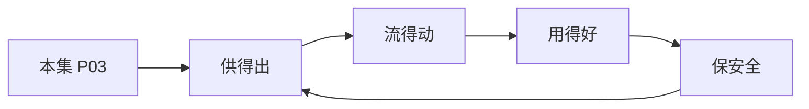

# P03 数据安全领域法律法规体系解读

← [[BV1ser5BDESU-总览]] | ← [[P02-公共数据开发利用及授权运营]] | 下一篇 → [[P04-个人信息匿名化制度与实践]]

## 视频信息

| 项目 | 内容 |
|------|------|
| 分集 | 数据安全领域法律法规体系解读 |
| 模块 | 政策与安全治理 |
| 时长 | 49 分 36 秒 |
| 链接 | [B 站 P3](https://www.bilibili.com/video/BV1ser5BDESU?p=3) |
| 官方文档 | [SecretFlow 文档](https://www.secretflow.org.cn/zh-CN/docs) |
| 内容来源 | 知识点增强（数据要素流通技术体系，非逐字转写） |

## 核心要点

1. **本 P 主题**：数据安全领域法律法规体系解读
2. **模块定位**：政策与安全治理
3. **考试/实践侧重**：数据安全法、个保法、网络安全法层级关系与核心义务
4. **笔记层级**：教程级（约 3003 字），含速览、图解、场景 Walkthrough、自测题
5. **学习建议**：先通读「3 分钟速览」与「图解」，再读「详细讲解」；动手项见 Checklist

> 以下内容基于数据要素流通与隐私计算技术体系撰写，对应 B 站分 P「数据安全领域法律法规体系解读」。**非 UP 逐字转写**；不看视频也可建立框架，看视频可对照「与视频对照表」深化。

## 本节在系列中的位置

**模块**：政策与安全治理 · 系列第 **P03/47** 集。

**建议前置**：[[公共数据开发利用及授权运营]]——建立本集所需背景。

**建议后续**：[[个人信息匿名化制度与实践]]——在本集能力之上继续深入。

依赖关系：政策(P01–P06) → 可信空间(P07–P08,P18) → 密态/隐私技术(P09–P24) → SecretFlow 工程(P25–P32) → 基础设施与案例(P33–P47)。

## 3 分钟速览

**数据安全领域法律法规体系解读** 是数据要素流通体系中的关键一课。读完本节你应能回答：① 核心概念定义；② 在「供得出—流得动—用得好—保安全」链条中的位置；③ 与隐私计算技术栈的衔接。考试/面试侧重：**数据安全法、个保法、网络安全法层级关系与核心义务**。

## 零基础导读

本节「数据安全领域法律法规体系解读」属于 **政策与安全治理**。即便未看视频，也应先建立**制度—技术—场景**三层视角：政策类章节回答「为什么允许流」；技术类章节回答「如何安全地算」；案例类章节回答「真实行业怎么落地」。

第一遍阅读请盯住三个问题：本集**解决什么痛点**？**关键参与方**是谁？**交付物或能力边界**是什么？第二遍阅读时，把术语表抄到 Obsidian 双链笔记，与前后分 P 交叉引用。

## 详细讲解

### 1. 法律法规体系层级

我国数据安全领域形成「三法三条例」为核心、部门规章与国标为支撑的体系：

| 层级 | 代表文件 | 施行时间 |
|------|----------|----------|
| 法律 | 《网络安全法》 | 2017.6 |
| 法律 | 《数据安全法》 | 2021.9 |
| 法律 | 《个人信息保护法》 | 2021.11 |
| 行政法规 | 《网络数据安全管理条例》（草案/征求意见） | 推进中 |
| 部门规章 | 数据出境安全评估办法、个人信息出境标准合同 | 2022–2023 |

### 2. 三法核心义务对照

| 维度 | 网络安全法 | 数据安全法 | 个人信息保护法 |
|------|-----------|-----------|---------------|
| 保护对象 | 网络运行安全 | 任何数据 | 个人信息 |
| 核心制度 | 等级保护 | 分类分级 | 告知同意 |
| 关键义务 | 关键信息基础设施 | 重要数据目录 | 最小必要 |
| 跨境 | 安全评估 | 安全评估 | 评估/认证/合同 |

### 3. 数据安全法要点

- **分类分级保护制度**：国家制定重要数据目录，各地区各部门确定本领域重要数据
- **数据处理活动安全义务**：建立健全管理制度、开展风险评估、定期报告
- **数据交易中介义务**：核验数据来源、留存交易记录
- **政务数据**：委托处理须监督，未经批准不得公开

### 4. 个人信息保护法要点

- **处理合法性基础**：告知+同意、合同必需、法定义务等七种情形
- **敏感个人信息**：生物识别、医疗健康、金融账户等需单独同意
- **权利保障**：查阅、复制、更正、删除、可携带
- **大型平台**：个人信息保护负责人、合规审计

### 5. 与数据要素流通的关系

流通不是「法外之地」——每次数据提供、委托处理、共同处理都需有**合法基础**和**安全义务**。隐私计算技术用于满足「最小必要」「目的限制」：只交付计算结果，不交付原始数据。

### 6. 考试/实践要点

- 区分「数据」与「个人信息」适用哪部法律
- 说出数据出境三条路径（评估、标准合同、认证）
- 企业合规清单：分类分级台账、DPIA、应急预案、人员培训

### 7. 配套标准

GB/T 35273 个人信息安全规范、GB/T 37988 数据安全能力成熟度模型（DSMM）与三法配套，企业可依此建设体系。

### 8. 违法责任

数据安全法最高千万罚款；个保法最高五千万或营业额 5%；刑法侵犯公民个人信息罪。合规是底线而非可选项。

### 9. 自测

画出三法适用 Venn 图；列举数据处理者五项法定义务。

### 深化理解（数据安全领域法律法规体系解读）

将本节概念放入「数据二十条」四原则框架：它主要支撑哪一条原则？若去掉该能力，哪类数据流通场景会受阻？用一句话向非技术经理解释本节价值。

## 图解

## 类比与直觉

数据要素政策像**交通规则**：先定道路（制度）、再发驾照（授权）、最后装护栏（安全技术）。没有规则，车（数据）跑得越快越危险。

## 例题与场景 Walkthrough

**场景：某市大数据局推进公共数据授权运营**

- **政策依据**：数据二十条、公共数据授权运营规范。
- **供得出**：交通局提供路况统计、医保局提供脱敏就诊汇总——先进目录、分级。
- **流得动**：通过可信数据空间连接器登记数据产品，API 或隐私计算方式交付。
- **用得好**：创业公司将路况+人口统计做成选址 SaaS。
- **保安全**：原始明细不出域；运营机构留存审计日志；使用方签署用途限制。
- **本集切入点**：数据安全领域法律法规体系解读 主要约束上述链条中的 **政策与安全治理** 环节。

## 常见误区

1. **「学完本集就会用隐语」**：SecretFlow 生态需多集串联（P19–P32），单集只是拼图一块。
2. **「隐私计算等于不上传数据」**：数据仍以密文、份额或授权方式参与计算，网络与算力开销客观存在。
3. **「TEE 绝对安全」**：TEE 依赖硬件与侧信道防护，需远程证明（P17）与补丁策略。
4. **「区块链解决一切确权」**：链适合存证与交易撮合，大规模计算仍在链下隐私计算引擎。

## 与视频对照表

| 视频段落（约） | 预期演示内容 | 笔记对应章节 |
|-------------|------------|------------|
| 开篇 0%–15% | 本集目标、背景、与前后集关系 | 本节位置、3 分钟速览 |
| 前段 15%–40% | 核心概念定义与架构图 | 零基础导读、详细讲解 |
| 中段 40%–70% | 原理展开、对比、政策/代码示例 | 图解、类比、Walkthrough |
| 后段 70%–90% | 案例、问答、易错点 | 常见误区、Checklist |
| 收尾 90%–100% | 总结、延伸资源 | 延伸阅读、自测题 |

> 本集总时长约 **49分36秒**。无官方外挂字幕时，以分 P 标题「数据安全领域法律法规体系解读」与上表主题对齐视频画面。

## 动手实践 Checklist

- [ ] 精读数据二十条原文 1 遍（国务院公报）
- [ ] 制作「三法」义务对照表
- [ ] 写出四原则各 1 个本地案例
- [ ] 与合规同事确认 1 个业务的数据分类分级
- [ ] 完成 5 道自测并口述给同事听

## 延伸阅读

- 国务院「关于构建数据基础制度更好发挥数据要素作用的意见」
- 《数据安全法》《个人信息保护法》
- 国家数据局「数据要素×」行动计划

## 自测题

1. **本集核心考点？**  
   **答**：数据安全法、个保法、网络安全法层级关系与核心义务。

2. **本集在四原则中的位置？**  
   **答**：主要对应制度与治理（供得出/保安全）。

3. **与 SecretFlow 的关系？**  
   **答**：提供合规与架构前提，后续技术集在其上落地。

4. **一项落地检查？**  
   **答**：是否有授权、是否最小必要、是否可审计——三者缺一不可。

5. **30 秒口述本集？**  
   **答**：用「输入→处理→输出」各一句话概括（见 Walkthrough）。

## 关键术语

| 术语 | 说明 |
|------|------|
| 数据要素 | 可参与社会化配置、创造价值的数字化资源 |
| 隐私计算 | 数据可用不可见前提下实现协作计算的技术体系 |
| 数据安全法 | 2021.9 施行，分类分级保护 |
| 个人信息保护法 | 2021.11 施行 |

## 与前后分 P 的衔接

- ← **公共数据开发利用及授权运营**（[[P02-公共数据开发利用及授权运营]]）
- → **个人信息匿名化制度与实践**（[[P04-个人信息匿名化制度与实践]]）

## 逐字转写
> 引擎: whisper | 状态: 已转写 | 格式: 段落化

### [00:00 - 00:53] 各位朋友大家好
各位朋友大家好，非常高兴今天能够有这个机会，来为大家分享，数据安全领域的法律法规体系解读，那么这是我的一个简单的自我介绍，在保证文本内容的准确的情况之下，使用了我年轻时候的照片，但是大家相信虽然胖了一点，但是确实是本人，这是我多年以前留学的时候的一张照片，当时可能还比较掀心，那么我们今天来为大家分享的主要内容，其实是三个大的板块，第一个部分，我们将会为大家来简单的介绍一下，数据安全领域法律法规的基本框架是什么样子的，第二我们将会以其中最为重要的数据，三反的前几条的内容来构建，为大家看得好，很像比较数据立法的这么一个立法目的。

### [00:53 - 01:46] 调整范围和调整对象到底是什么
调整范围和调整对象到底是什么，然后最后我们将会重点的，以数据安全法的一些核心制度，和一些代表性的案例为线索，来为大家介绍一下数据安全法，所规定的数据安全领域中的主要的安全制度，有哪一些，那么我们首先看两个简单的案例，第一个是徐玉安，徐玉是山东的一位高中生，在她毕业以后考上了大学，学家都正在高兴的时候却遭遇了毕业新诈骗，被骗走了学费，导致徐玉同学伤心欲绝，最终不幸的心脏咒停一事，这个事情也告诉我们，其实在某些情况之下，数据安全或者说个人信息的安全，不仅可能会关系到我们的财产，这种诈骗不仅谋财可能还会害命，那么我们看第二个案例。

### [01:46 - 02:37] 第二个案例是美国最大的燃油管道
第二个案例是美国最大的燃油管道运输商，运营商，他由于遭遇了什么呢，勒索软件的攻击，他的部分重要数据被加密了，必须要提供赎金才被解密，由于这么一个攻击事件，导致全美有接近一半的，这么一个输油管道网络出现了几个小时，甚至是十几个小时的暂停，对整个国家安全，社会经济的安全造成了一个重大的影响，所以通过这两个案子，我们会发现，其实数据安全不仅仅是关系到，个人的财产，企业的财产，实际上是对个人的生命安全，甚至是对于整个国家的，这么一个国家的主权安全，都会有重大的风险，那么我们国家，其实在数据的发展过程中间，也非常早就关注到了这么一个问题。

### [02:37 - 03:24] 通过法律立法的方式
通过法律立法的方式，进行的一些安全到底的完善，那么这个安全到底的完善，我把大概的框架，称之为叫N加3加2，所谓的N，实际上是只一般性的法律，但是中间对数据安全，进行的一些规定，比如说民法典，比如说刑法典，我们很早刑法典，就对网络安全，数据安全各的契机，保护进行了一些规定，那么还比如说，像反不正常竞争法等等，它也对数据做了一些相关的规定，那么这一些N，是一些一般性的法律，后面的3加2，这是专门性的法律，其中的3，就是最为重要的，我们称之为叫数据三法，里面主要就是网络安全法，数据安全法和个人信息保护法，他们是整个数据安全的基本框架，那么除此之外。

### [03:24 - 04:09] 还有两部国务院
还有两部国务院，所颁布的行政法规，来规定数据安全中间的，一些具体的领域，其中就是一个，是关键信息激动设施的安全，另外一个这是网络数据的安全，这是我们所说的N加3加2，成为一个大的框架，共同构建的数据安全中间，领域中的法律法规的，这么一个体系，那么在这个体系中间，最为重要的，当然是我们念的数据三法，那么数据三法，我们想要为大家，把其位的前几条，来做一个横向对比，实际上这个前几条，在很多这个，如果是咱们法学的一些同仁，在学习法律功能中间的时候，有时候就能忽略，而认为前几条比较务需，它没有规定具体的规范性的内容，但其实不是这样子的，我们看数据安全的前几条。

### [04:09 - 04:52] 其实可以很明确的从中间
其实可以很明确的从中间，发现很多这个有意识的地方，也解除我们过去的一些误解，比如说数据安全的立法目的，到底是什么，这个问题好像是很简单，数据安全立法目的，当然会为世卫的数据安全，真的是这样子的吗，如果仅仅是为数据安全，那么绝对化的数据安全是否存在，我们经常举个例子，就是我有一个调号码，这个调号码是一个数据，这个调号码也是一个个人信息，对不对，但是我把这个调号码，把它锁进保险规定面，不告诉任何人，那还有意义吗，实际上我们发现，这个没有意义了，我们为什么要规定数据立法，数据安全的防御规范，是因为我们处于数据经济时代，而数据经济时代的重点是什么。

### [04:52 - 05:46] 是要利用数据
是要利用数据，所以绝对化的安全保障，如果阻碍个利用的时候，实际上是有问题的，那我们看数据三法，到底怎么规定的，我们先看网安法，第一条这么规定的，叫保障网络安全，维护主权国家安全，社会利益，保护公民法正西亚组织合法权益，促进社会经济，经济社会信息化健康发展，我们看到有保障有维护，有保护还有促进，那我们看数据安全法，这里面就更加明确了，叫规范数据处理活动，保障数据安全，促进开发利用，数据的开发利用，保护个人组织的合法权益，维护国家主权安全的发展利益，中间规定的几个动作，第一个是规范行为，第二个是保障安全和权益，第三个就是促进开发利用。

### [05:46 - 06:34] 实际上这三个目的是必须的
实际上这三个目的是必须的，那我们再看个人信息保护法，它继续原用的这样的结构，叫做保护个人信息权益，规范个人信息处理活动，促进个人信息的合理利用，所以我们看到从数据三法的第一条，我们就会发现，实际上规范保护促进三者是一体的，我们在理解整个数据，安全的这么一个法律制度中间的时候，我们不能够绝对化的，僵化的去理解安全这个问题，安全保障不是唯一的目标，它是要跟规范行为和促进合理利用相结合的，那么这也会对我们后续的一些制度的理解，产生一些相关的影响，那我们第二个问题，那数据三法的适用范围是什么，它保护的对象又是什么呢。

### [06:34 - 07:20] 首先我们要看数据三法的调整范围
首先我们要看数据三法的调整范围，这和一般的法律就出现了一些微妙区别，也同时会对我们后面的一些制度，我们就会提到一些制度上的一些问题了，我们过去的传统的法律，我们无非就是数据或者数人，数据就是在中国大地上发生的事情，我们就管，数人就是对于中国人所涉及的问题，我们就管，但是我们看数据三法，网安法还相对来说是比较明确的，使用了什么数据管理，在中国的这么一些网络我们来管，但是我们看随着时代的法律，我们发现不太够了，然后在数据安全法，数据安全法的立法是比网安法稍微晚一点点的，我们看到我们不仅规定境内的，而且对境外的进行了一个什么。

### [07:20 - 08:09] 叫做保护性的一个保管理
叫做保护性的一个保管理，叫做是你如果在境外开展数据数据活动，但是损害了我们国家或者我们公民组织的权益的，我们同样可以管理，然后我们再进一步的看个人信息保护法，个人信息保护法，一方面来说还是以境内为主，但是同时它对境外相比数据安全法，又做了进一步的扩展，什么就是你除了说可能会危害到，我们的公民法人组织国家的力量之外，你如果是在境外对吧，处理我们国家自然能的个人信息活动，然后存在一些相关的情况的时候，也是需要使用个人信息保护法的，所以我们看到数据三法它体现出什么，就是代表了数据的流动性，我们过去很多行为，你在国内就在国内，在国外就国外。

### [08:09 - 08:56] 它其实连续信没有那么的强
它其实连续信没有那么的强，除了一些走私这么活动，它可能有很强的境内境外的连续信，但是数据由于它天然的流动性，网络由于它天然的流动性，实际上你完全只靠一个属地原则，只靠这个国境来进行区分，是不够的，所以我们看到在网安和数据安全，和个人信息保护法中间，它实际上都一定的扩展了属地原则，所以这是整个数据安全的法律规范，一个很重的原则，它其实具有一定的跨区讯息，有一定的国际性，我们后续看距离制度的时候发现这个问题，实际上国家与国家之间，关于数据管辖的一个冲突，是数据安全制度领域中间的，有一个某种程度上是一定它的一个特色。

### [08:56 - 09:43] 也会为我们数据安全法的适用
也会为我们数据安全法的适用，其实产生一些问题，我们后续再来解释，那么什么是数据呢，实际上我们看到，网安、数据、个人信息保护法，产生都做一些相关的界定，那么这里我们要注意一个有意思的特点，网络安全法，当时最早的时候界定的数据，讲的就是电子数据，这个没问题，因为它是以网络为主导的，但是到了数据安全法中间，以及后续的个人信息保护法中间，还来讲的时候，就有一个很重要的特点，它不极限于电子数据，是以电子和其他方式存储的，对信息的记录都属于数据，那么这里我们就要注意一个特点，都属于数据，那么紫字档案受不受数据安全法的管理，而我们今天有个签到本。

### [09:43 - 10:28] 我们讲说同学们来签到
我们讲说同学们来签到，有的签到本上面有对个人信息的签到，但这个本质，受不受个保护法的管理都受的，实际上我们这里尤其要注意的就是，实际上现在我们关注到，实践中大量的数据安全的泄漏，或者个人信息保护的泄漏，是怎么泄漏出来的呢，比如说疫情期间的一些流调数据，比如说有血管员拿了紫字档案，拍了照上传，发到了相亲相爱的家人，很多数据是这么流传出去的，所以紫字的数据的管理，不能够去忽视，这是我们对于数据，我们对于法律所要保护数据的界定，或者数安法的界定的时候，我们的一个重要的一个并解的内容，那么同时数安法对于数据的保护，还提了一个非常重的一个概念。

### [10:28 - 11:18] 叫做分级分类
叫做分级分类，分级分类就是把数据分为一般数据，重要数据和国家核心数据，它实际上是按照什么来分的呢，是有两种逻辑，第一个逻辑是它的重要程度，第二个逻辑是它如果一旦出问题，它的危害程度，重要程度和可能的危害风险程度，把它进行了分级分类，分成的简单的分是分为这三类，当然还有更多细节的分法，那么为什么要分级分类，这就是提到了我们一开始所讲的，绝对性的安全，实际上在数据经济和数据社会时代是不够的，我们还是要分类来看，一般的数据，我们可以稍微让它的安全制度，稍微宽松一点点来让它更好的利用，但是越是重要，或者是风险越大的数据，我们越要更高标准的。

### [11:18 - 12:06] 更严格的管理
更严格的管理，所以通过分级分类，实际上是进行一个分风险的分级管控，来给不同风险，不同重要性不同价值的数据，来匹配不同的管理制度，所以这也是我们为什么一开始就要结合第一条，我们来看，实际上这就和整个数据立法的立法目的，结合在一起，那么数据的分级分类，是这么一个基本的一个大的这么一个思路，我们再看下面一个数据中间比较特殊的，特别领域就是个人信息，个人信息应该说在整个数据中间，是相对来说比较特殊的，因为它一方面有风险，另外一方面离我们老百姓特别近，所以对于大家的获得感特别强，一旦被侵害了，我们个人感知是非常强的，那么个人信息。

### [12:06 - 12:50] 由这里面要注意一个重要的特点
由这里面要注意一个重要的特点，就是它是要与以识别或可识别的，自然人相关的信息，完全另明化的信息，它是不算个人信息的，要完全另明化的信息，比如说中国有14亿人，这个绝对的统计信息，实际上你是无法指定到，具体的个人的，我们所有人的报寒在里面，或者你说在广州这么个地方，有多少人具有什么样的一种特征，由于这是一个完全无法还原到具体个人的，因为你也不知道我说的是谁 对不对，但这时候就是一个另明化的信息，另明化的信息，统计性的信息是不受各办法的约束的，但是并不是所有的我们看到，去标识化的信息，就是另明化的信息，我们这提了两个概念，一个要去标识化。

### [12:50 - 13:44] 一个叫另明化
一个叫另明化，另明化是完全无法还原了，你不知道是谁，去标识化是你去了个标识，但是有可能你根据这个标识，还能确定到是谁，那这个时候，那这个信息，它就有可能仍然受到各办法的约束，这叫做去标识化，那么在这个过程中间，我们举个例子，比如说我们今天看到，有时候我们叫猛猛猛，或者叫李猛猛王猛猛，这些信息是去标识化的，还是另明化的呢，我们是要放到特定情况下来看的，比如说曾经我这有个案例，就是某一个小区打出了一个横幅，说猛猛小区挤挤动的，什么李猛，由于诈骗 被骗多少多少元，我们注意啊，这个横幅上的李猛，在结合他的动的楼洞信息，实际上是可以去还原到他的，因此这个信息。

### [13:44 - 14:23] 我们某种程度上来说
我们某种程度上来说，只认为它是个去标识化的信息，而不是一个完全另明化的信息，所以在整个各办法的处理作用中间，我们对于这个另明化和这个去标识化，是个比较复杂的问题，我们要注意去进行一定的区分，那么与这个个人信息相对应的进一步，是敏感个人信息，那就是由于涉及到生物识别，宗教信仰 特定身份，金融账户 行踪轨迹等等原因，以及不满未成，不满实事之后，所以的未成年人，由于这些原因，它比一般的个人信息更为重要，更为敏感的，然后我们把它定为敏感个人信息，那么敏感个人信息应该说，这些年来说也会对我们，我们日常生活中也会经常遇到。

### [14:23 - 15:11] 其中一个很重要的其实就是人脸识
其中一个很重要的其实就是人脸识别，人脸识别我们这两年其实看到了，很多越来越广的使用，但是从此也产生了一些争议，比如说我们这里可以看到，人脸识别的第一案，把郭斌 郭斌上也是个学者，郭斌老师，郭斌老师可能当时也是看到，这个国内的人脸识别的这么一个情况，他作为一个法学的一个老师，对学内比较敏感，我们看这个案子是什么呢，这个案例上是我们老师被称之为，叫人脸识别第一案，是讲郭老师他买了一个，也是动物园的双人脸卡，这个动物园的脸卡以前是靠按手印，按指纹，后来改成了人脸识别，郭老师说我不愿意把我的人脸给，那我要说推卡，动物园不同意，后来起诉了，最后法院认为。

### [15:11 - 15:57] 你如果要使用人脸识别
你如果要使用人脸识别，这涉及到敏感个人信息，你要他本人同意，人家不同意你不能强制，那怎么办，第一退钱，第二删除郭老师，当时存储过的所有的智慧信息，我们注意这个案子是2019年，然后是2019年，当时我们的各网法其实是没有通过的，但是法院已经从学里拿到层面，对人脸的这么一个敏感个人信息，实际上是进行了一定的关注，那么与此对应的是，我们看到是最高法院，也出台了关于人脸识别技术，处理的一个司法解释，我们也要注意这个司法解释很有意思，这个司法解释，实际上是在各网法社校前一天出来了，所以某种程度上来讲，它不是对各网法的解释。

### [15:57 - 16:39] 而是对于人脸的这么一个特殊的敏
而是对于人脸的这么一个特殊的敏感信息，在原有的法律的框架之下，就可以得出这么一个解释了，但是各网法只是一个更加明确的规定，那么在这里面，其实用一个很重要的一个特点是什么呢，其实就是物业的信息，这个物业的这些信息，应该是要提供一个替代性的选项的，比如说我们以前进出物业都必须人脸识别，而现在我们看到的是，进出物业你可以人脸识别，如果说某个人同意，但如果他不同意怎么办，你要给他提供一个替代性的选项，比如说你可以说半个卡，对不对，或者这种指纹，所以这也是为什么，我们给很多APP的开发者，我们进行一些沟通的时候，很多APP开发者，后面的问题。

### [16:39 - 17:22] 马老师我这个业务必须要人脸识别
马老师我这个业务必须要人脸识别，比如说银行那些APP，我不人脸识别，我不安全，那我必须要人脸识别，那你现在不能强迫我人脸识别，我一定要给一个替代性的选项的怎么办，我说你尊重消费者的选择权，你愿意人脸识别，我给你便利，你可以在网上办理，如果你始终不愿意人脸识别，没问题，我给你一个替代选项，你去线下办理，对吧，你不要把线下的办理的渠道给断掉了，如果有个消费者自己就一定，不愿意把人脸给你，他宁可自己麻烦，每天去跑营业厅，那你要给他提供一个替代的选项，如果你觉得每个营业厅，安排一个人脸的办理，线下的业务太麻烦，那你一个城市总有一个营业厅的办理，对不对。

### [17:22 - 18:06] 你给一个选择
你给一个选择，这实际上是各宝法，一个很重要的特点，就是你要给消费者，或者说给自然人一个选择的空间，那么我们看到下面，26条实际上是各宝法，一个进一步的规定，各宝法，我们注意到人脸识别，在这个现实中间，实际上是大量存在的，各宝法商，最后把它进一步的限定，是这种身份采集的，个人信息的采集设备，只能用于维护公共安全说必须，你只能用于安全，你才能够做这个人脸识别，除非老百姓自然能同意，否则你在公共场所也好，在其他地方也好，你布置这个摄像头，公共场所布置的是个摄像头，只能用于安全目的，有大家可能会问，除了安全目的，还有什么目的，音效目的，我们看到新闻报道过。

### [18:06 - 18:56] 很多受容户
很多受容户，安装的人脸识别设备，来为了解，所以我们看到一些新闻报道，甚至有些人买房的时候，带了一个头盔，这个也非常有意思，但是同时这也就告知了，我们一个问题，人脸识别的精准音效很好用，但是个人信息保护法，现在实际上是对它，进行了一个强有力的限定，因为它属于敏感，敏感的个人信息，所以需要得到一个，更高层级的保护，所以做了一个特别的限制，好 那么我们刚刚介绍了，整个各宝法，或者说我们说数据三法，基本的框架的基本的限制，基本的设置之后，我们下面我们来看一下，它们具体的制度讲了什么，当然今天因为时间的原因，我们很难将，三部法律的内容，全部讲一讲。

### [18:56 - 19:45] 那么我们主要今天讲一讲
那么我们主要今天讲一讲，数据安全法中间的，一些重要制度，和一些重要的内容，那么证明的重要制度，除了我们刚刚，刚刚介绍过的，分级分类之外，我们来看看，还有哪些具体的制度，我们看这里列了，三条制度，监测预警制度，应急处置制度，安全审查制度，使用这三个制度，都是一些很基础的，我们其实看这里，可以观察到，数据安全法的一个颗粒度，数据安全法的颗粒度，其实是比较大的，规定的还是宏观上的，一些安全制度，具体怎么落实呢，其实还是有很多，部门规章和具体的文件，去操作，那么在这三个制度中间，我们可以重点讲一下，安全审查制度，这个制度是非常有特色的，我们看到人们讲述的，叫做是。

### [19:45 - 20:40] 国家建立数据安全审查制度
国家建立数据安全审查制度，对影响或者可能影响，国家安全的数据安全制度活动，进行国家安全审查，注意了，第二款，依法做出的安全审查决定，为最终决定，什么意思呢，如果说我们是，学法律师朋友，这次就很敏感了，意味着，数据安全的国家审查，是不可以负义，也不可以输送的，它是一个最终决定，原因是因为，它关系到了国家安全，因此在某种程度上来讲，它会有一定的，国家安全的政治属性，这时候我们更强化的是，一省中省，叫做一个决定中省，不再去安排其他的，这么一个数据渠道了，这实际上是很类似于，一些跟海关，或者是一些体现出，比较强的国家，主权属性的一些制度中，所出现出来的，那么关于这个。

### [20:40 - 21:34] 数据安全审查之路
数据安全审查之路，实际上在我们的整个，最近的经验中间，已经有多次发生了，比如说，一个受到境外企业的，是美光，而涉及到境内企业的，大家也比较了解的，就是某出行企业，这个出行企业，它这个交通，当时还有很多交通数据，出行数据，然后在2021年，由于某一些事件，而且就是说，它还在境外去上市，等等原因，引发了一个，比较集中的爆发，那么当时国家，为了防范国家数据安全风险，维护国家安全，保障公共利益，实际上是一句，网络安全法，相关的法律法规，对它进行了，一个数据安全审查，那么在数据安全审查的最后，是认为它违反了，网络安全法，数据安全法和个人心理保护法，行政筹法法的。

### [21:34 - 22:23] 相关的法律法规
相关的法律法规，给予这个企业，予以80.26亿元的，一个高额的处罚，同时对它的，相关的领导人员，进行了个人的一个罚款，所以我们看到了，整个数据安全的，这个领域中间的，这么一个审查，它实际上是很有可能，会产生一个，非常强大的一个处罚后果的，这实际上也是，数据安全领域中间，一个比较一色的特点，那么我们看，其他国家也是如此，欧洲 基于GDPR，实际上是，做出了几个，巨大的巨额罚单，都是数亿欧元，甚至是十几亿欧元，这么一个处罚的可能，那么这种某种程度上来讲，它一个很重要的原因，是因为这些处罚，往往都是根据，这个企业的全球营收来算，根据它的全球营收。

### [22:23 - 23:05] 或者根据它的总营收来算
或者根据它的总营收来算，而这些数值的一些巨头，或者是重大的平台企业，它实际上在全球，有广泛的业务，所以它的总营收的比例，总营收的这个份额是很高的，所以当你这个法律规定，对它可以进一百分之二，百分之三 百分之四的处罚的时候，它实际上的这个费用，就非常的高，所以我们看到，在数据安全领域总监，我们经常会看到，一些天价罚单的存在，这实际上某种程度上来讲，一方面是展现了，对于数据安全的重视，另外一方面，其实反映的是，数字经济的活力，因为数字经济有这么大的盘子，有这么大的体量，才会出现，这么重大的一个处罚，所以数据安全，对于这么重大的数字经济，它同样也体现出了。

### [23:05 - 23:54] 一个很重要的一个作用
一个很重要的一个作用，那么第二个，我们再看相关的这么一个制度，那就是出口管制制度，出口管制制度，实际上就是意味着，某些数据你是不能出去的，我们也看到，我们国家在不断的出台，一些关于技术出口的，一些限制的名单，那么除了技术之外，数据本身，也是有一些进行管制的要求的，这里与之相关，还有对等反制制度，其实我们刚刚提到了，数据是涉及到跨境的，大量的数据，实际上涉及到境内境外的问题，而数据这个法律领域，天然的存在，跟国际斗争有一定的关系，待会我们会讲的，有些其他的制度，会更加明确，但在这里面，我们其实已经出现端理了，实际上在这个数据的，法律的治理过程中间。

### [23:54 - 24:42] 它有很多问题
它有很多问题，实际上是带有国际性的，甚至会成为国际斗争的一部分，我们具体来看，扣扣管制的这么一个制度，这个制度具体实现，它是很丰富的，但是我们看到，它暴露出的一些问题，有时候是通过一些，很特殊的各地暴露出来的，比如说我们看一下，这个案例，叫做数据出境限制的第一案，它对应的，除了我们刚刚所提到的，这个出境管制制度之外，还有一些相应的，出境限制的一些制度，这个案子，我们看到它的具体信息，其实来自于交电访谈，它非常的重要，进行了全面的这么一个报告，那么这个案子，大概是什么一个情况呢，其实讲的就是，有上海的一个科技公司，有一个员工，他被拉进了一个微信群。

### [24:42 - 25:42] 群里面有人说
群里面有人说，是一个境外企业，要委托中国公司，开展对一些数据的调研，但这里的数据调研，由于他们，疫情期间不能够来划，所以希望委托境内公司来进行，主要是收集，中国铁路的一些信号数据，包括物联网封窝和，GSMR的评普的一些数据，当时这个企业，为了赚钱，很快就答应了这个项目，但是其实他们当时，也出现了一些敏感，对这个案子的合法性，对这个项目的合法性，心中是有一些，有一些疑虑的，所以当时他们还请教了，公司的法务，而公司的法务，是明确告诉他有风险的，你们还要注意，但是我们看到这个公司，虽然说知道有风险，但是觉得收益还是很关的，怎么办，于是他们做了个办法。

### [25:42 - 26:29] 就是向境外企业问
就是向境外企业问，你们有没有一些，合法性的一些文件，要求对方来提供，但是境外企业，跟他们打太极，说这个东西没关系，怎么怎么样，不停地吹出他们尽快的，来完成这项工作，然后他们要求对方，实际上是完成这个工作，是通过一些普通设备，就可以的，比如说是一些简单的设备，这个设备不是什么间谍设备，就是很普通的设备，所以这个公司当时就有点放松了，觉得都是普通设备，没有关系对吧，然后利润很丰厚，于是他就开始，在做这个工作了，这个公司，即使是认为有合法性的疑虑，但是他同时还是开始，进行的操作，那么在这个过程中间，他们约定了两个阶段的合作，第一个阶段是固定采集。

### [26:29 - 27:19] 第二个阶段是要去到
第二个阶段是要去到，移动设备的各个地方，进行移动采集，然后这个采集过程中间，最开始是要求把数据，纯入硬盘，然后寄到海外，但是由于担心海外，在邮寄过程中间，出现一些问题，最后这个东西，不断的进一调整，最后甚至是出现了一些，远程端口，就是国内的公司在这里采集，境外的公司直接，通过端口，从国内来调取相关的数据，甚至可以登录，这些远程的端口，实际上到这一步的时候，我们就会发现，一步一步问题，是不是越来越大了，一开始是你采集，这些数据，你还可以自己整理，整理之后，如果有敏感性的，你可以把它提出一下，到后来，实际上这个境内公司，完全的成为了境外公司，采集的这么一个白手套。

### [27:19 - 28:06] 所有的数据从境内
所有的数据从境内，直接有流向的境外，没有经过审查，也没有合规的要求，而境内公司，以上不能控制，这些数据到底怎么办，所以在这种情况之下，其实境内公司对这个风险，其实是有越来越多的明确了，但是由于它的收益太高了，所以他们还是挺而走，现在做，这些数据一个月，采集到了数据，就达到了将近500期，最后呢，经过坚定发现，这些数据实际上是一些敏感数据，这些数据很有可能对国家安全，对我们的生产经营安全，造成严重的影响，而属于数据安全法里面，所规定的，静止出口的相关的一些数据，然后呢，最后呢，这个案子在处理过程中间，我们注意一下，这个案子比较有意思，在于是，这个案子最后。

### [28:06 - 28:56] 它是上到了刑事责任
它是上到了刑事责任，当然我们知道，刑法是非常特殊的一个法律，就是罪刑法定，所有的罪名，必须有法，由刑法来规定，最后呢，这个案子在刑法处理中间的时候，把它认定为，叫为境外刺探非法提供情报罪，这里的数据，同时构成了刑法上面，所说的情报，之后我们发现，这个数据出境，如果说，你没办法做好它的合规，你没有办法按照合规的，比如说合规要求来进行完善，它就是很有可能，触犯到刑法的，在这个案子中间，我们也看到了这个企业，其实一开始，他请教了法务，但是法务给了意见，他最终没有踩辣，他也没有做相关的合规的准备，就是为了利益行而走险，最终使得自己触犯到刑法。

### [28:56 - 29:44] 也同时给国家带来的巨大的损失
也同时给国家带来的巨大的损失，那么我们再看另外一个案子，这个案子或者叫案例吧，这个势力，这个势力相对来说，就是一个比较好的势力，那就是什么，特斯拉，特斯拉在中国建立的数据中心，实现所有的数据跟电话存储，我中国的数据，我在中国存储，我在中国的数据在中国训练，减少数据不必要的数据夸挤，大大增加了我们数据的安全的程度，这反过来也让中国的企业和中国的政府，对于中国的老百姓，对于特斯拉更加信任，对吧，你的数据都在我们的境内，那我们就可以更加安心地来进行使用，这是一个，我们说刚刚讲的这个负面案例，那么这里讲的是一个，相对来说，好，那么我们前面讲的是，数据夸挤。

### [29:44 - 30:35] 数据出入境的这么一个
数据出入境的这么一个，宏大的一个名题，那么在具体的工作中间，或者是我们在具体的，这个数据的管理中间，数据安全法，还规定了很多具体的，数据安全保护义务，实际上就说，你任何企业或者个人，你处理数据，你要完成相应的，这么一个数据安全保护的义务，建设相应的数据安全保护义务，建设相应的数据安全的保护制度，如果你没有建设，你没有去，没有去完成这么一些义务的话，你可能就会有相关的法律责任，那么我们这里可以看一下这个案例，第一个案例，是一个价培学校的数据安全违规案，广州警方发现，一个公司所开发的价培的平台，培训的平台存出了大量的，学员的姓名。

### [30:35 - 31:23] 身份证号手机号个人信息
身份证号 手机号 个人信息，但是这个公司没有按照，数据安全法的要求，去建立数据安全管理制度和操作规程，对于日常经营活动，采集到的大量个人信息，没有去标实话，也没有加密措施，系统甚至可以存在，Wave授权就可以访问的漏洞，这样一些严重的数据安全隐患，这意味着你这个平台上，存了这么多个人信息，你又不保管，就很容易泄露出去，产生数据和个人信息的安全风险，所以广州警方对于这个公司，进行了一个行政处罚，从这个处罚的额度上来看，我们更多的看，额度其实不高，更多的其实是警戒 告戒，我们其实现在越来越多的企业，我们其实是掌握了大量的个人信息的。

### [31:23 - 32:13] 很多时候我们的企业
很多时候我们的企业，又喜欢去采集，觉得采集的信息越多，我是不是以后更有价值，但你采集了之后，你能不能保护好，权力越大 责任越大，你掌握了越多的数据，你管理越多的数据，你拿了越多的数据，你就一定要管好它 保护好它，这是很重要的一点，数据领域中间，权力和义务和责任是相对应的，你拥有越多的数据，拥有越大的权力的同时，你就承担了，越大的数据安全保护意义，数据安全，数据它实际上是一题的，我们这样讨论一个问题，叫数据全属的问题，这个问题我们今天时间有限，我们不展开谈，但我们可以简单的讲一点，数据全属它实际上是全贼一体的东西，你拿到一个数据，你拥有一个数据。

### [32:13 - 33:06] 你首先拥有的是安全义务和责任
你首先拥有的是安全 义务和责任，之后才是利用数据开发利用，所可能享受到的一些乱和benefit，但是一开始的算是责任和义务，这其实也是对我们所有的数据处理者，悄想的一个紧重，那么第二个案子，我们看到的实际上是小区，刚刚那是企业，对吧，第二个我们看看小区，小区的物业公司中间，发现存了大量的人脸识别数据，车辆安全管理的数据，明文存储了相关的个人信息，其实这样的明文存储我们不少见，很多企业拿个XLR文档就存了，对吧，那这个XLR文档你加密了吗，没有的，同时大量的系统存在，登录账号弱口令，账号没有设置全线设置，登录账号弱口令，这个我们也很常见，对不对。

### [33:06 - 33:54] 你这个密码
你这个密码，一二三四五六，八八八八八八，这些弱口令是大量存在的，那也意味着任何人，只要打断这个电脑，都可以登录上去，所以说我们注意到了，整个相关的这么一个安全制度，其实在过去我们，应该说我们是有很多疏忽的，我们习以为常了，但是我们疏忽了，以前是没有出现安全事故，但是一旦出现的损失就会惨重，所以我们看到在这里面，泳洲市的公安部门，对这个公司进行的警告，这个没法款，先警告你，因为毕竟还没出事嘛，那么警告希望你改正，实际上我们看到这样的事情，在我们应该说生活中，或者说我们工作中是经常出现的，那么我们也希望每个听众，我们在作为这个研究者，或者作为法律试用者。

### [33:54 - 34:45] 试用的同时自己先做好
试用的同时自己先做好，回去看一看我们的这个公司，或者说我们自己的这个系统，我们的机构，我们有没有掌握相关的一些数据，尤其是一些敏感的重要的数据，那这些数据，我们有没有建议相应的保护机制，这种保护机制，不仅仅是技术上的，其实很重要的也是制度上的，比如说你说像登录账号弱口令，是因为技术不支持，复杂的口令吗，当然不是，其实更多的还是制度上面，没有更好的去落实，那么我们下一个讲的一个很重要的一个制度，其实是数据采集，或者是要数据收集的一个方式的制度，数据安全法，实际上对这个数据收集，是规定了几个比较特殊的，不叫特殊吧，几个一般性的要求，就是合法 正当。

### [34:45 - 35:28] 同时如果法律法规
同时如果法律法规，对它的目的和范围有限制的，还要在特定的目的和范围内进行收集，这里就要求我们的数据采集，你不能够非法 也不能不正当，不正当是对应的什么，对应的就是所谓的不正当的数据采集，这里面就涉及到不正当竞争的问题，待会我们有案例，我们回来详细聊一聊，实际上这个很有意思，不正当到底什么是正当，把隐身出了对数据，现在我们的保护方式，边界的一个规范，我们现在很多数据，我们先看到，我们现在法律上面，是没有规定数据全熟的，应该说我们的法律上面，暂时还没有明确规定，一个物权性的数据权，我们司法裁判中，如果遇到数据案件，我们怎么处理。

### [35:28 - 36:12] 只要是根据反不正当竞争法来处理
只要是根据反不正当竞争法来处理，那这里反不正当竞争法就意味着，你如果对数据采集，你是正当的，那就合了，如果你不正当，那你就不能去拿到这个数据，那对于数据的持有者，或者说我是拥有数据的人来说，我就如果对方的目的是正当的，那我就把数据要给他，如果对方的数据，对方拿的是不正当的，我就可以通过反法，来经历我自己的互惩和，来保护我的数据不流失，来保护我的这么一个数据，所谓的一个权数，所以这个正当这两个字，看起来很简单，其实里面是引发了，很多丰富的类似的，那么同时对比来看，数完法规定的，对于数据收集方式，是比较简单的，但是个人信息保护法，将会有更加详细的规定。

### [36:12 - 37:11] 由于数据
由于数据，个人信息相对而更特殊，它怎么采集，它的方式，各宝法就做了，非常详细的列举，这里我们不去展开了，好 那我们来看，我们刚刚讲到了不正当，如果是正当的，要求是正当，什么叫不正当，我们看第一个案子，这个案子叫做，数据交易满寿人商业，秘密侵权第一案，这个案子首先是讲的，某一个摩托车，汽车的制造商，原告，某与摩托车，和被告，某雅摩托车，两个都是，摩托车的生产出口企业，然后这个某雅出口公司，和这个第三方公司，签了一个合同，购买摩托车出口，前十位的企业数据，然后这个第三方数据公司，就提供了，包含某与公司在内的，各种详细的出口报单的情况，包括出口目的地，规格型号 排量。

### [37:11 - 38:04] 单价总价申报数量
单价 总价 申报数量，等等等等，具体的一些项目，然后某雅公司，在接收了，这么一个数据之后，同时还像其他的人，也披露和使用了，这些某与公司的数据，某与公司也不开心，这些数据，我的报关数据，你怎么可以获得呢，于是某与公司，就提出了法院，就原告，认为商业秘密倾全了，那么我们看法院，当时怎么裁判的，法院在裁判的时候，认为这个数据上面，是承载了很多的，个人信息，商业秘密和公共利益的，所以数据处理，数据使用者在使用，接收 控制 运用数据的时候，要有合理生生的义务，原告被告是竞争主体，有类似的外贸竞争模式，那么这个被告某雅公司，在看到你这个数据里面，有竞争企业的具体品牌。

### [38:04 - 38:51] 具体型号具体数量
具体型号 具体数量，具体单价，这一些特殊组合的时候，你是有伤，你自己对这些数据，你也觉得很敏感，对不对，你应该是要知道，这些数据，是侵害到别人的商业秘密的，所以你知道，这个侵害商业秘密，你还继续使用，你就应该去承担，一定的赔偿者的，于是法院最终，是赔偿，这个被告败述了，被告要给原告，赔一件钱，其实赔的也不多，但是这里面就体现出了什么，体现出了法院，对于这个中间，这个数据，到底够不够的商业秘密，它有一个，它的判断的一个观点和机制，形成了这么一个案例，这个案例当然是存在一定争议的，实际上关于数据，到底什么是正当，什么是不正当，他们的判断，其实是比较复杂的。

### [38:51 - 39:40] 我们看到反不正当竞争法
我们看到反不正当竞争法，在最近修改过的中间，其实专门增加了一条内容，是关于数据，关于这个不正当，采取数据的一个限定，而这个反不正当竞争法，在征求意见搞混的中间，这一条其实更丰富，理由大概将近，又七项的具体的列举，如果大家有兴趣，可以去看，这里面其实也可以，作为我们的理解，什么情况之下，数据采集是正当，什么时候不是正当的，一个扩展性的参考，那么与之相对应的，反不正当竞争法，领域都是数据采集的，或者说更著名的，影响更广的一个案子，就是微博书漫漫案，在微博书漫漫案里面，其实法院是对于，反法的一个利用，是产生的生源的影响，这里面这个案子，大概什么情况呢，就是微博。

### [39:40 - 40:29] 我们都知道
我们都知道，是一个社交媒体，卖卖是一个职场，社交的软件，或者说是一个，职场的社交软件，最早期的时候，微博和卖卖是合作的，微博可以，卖卖可以直接用，微博账号就登录，但是后来合作结束了，微博就不让卖卖，用他的账号登录了，那卖卖想个办法，你微博不让，我找用户，比如说我一个用户，我想登录卖卖，然后这时候卖卖，就会问你，那你愿不愿意，把你的微博的信息，迁移到我的卖卖上，用户同意了，于是卖卖就去微博上，爬这个用户的信息，爬取，爬了之后，把它复制到这个卖卖上去，这个过程中间，我们注意，卖卖是拿到了用户同意的，但是微博就说了，用户同意，我微博没同意，你这时候来爬我的数据，你构成了一个。

### [40:29 - 41:25] 不真当真正
不真当真正，于是两者，双方，来进行了这么一个诉讼，在这个过程中间，其实法院，就提出了一个，很重要的一个观点，法院认为，这个过程中间，实际上，卖卖去拿到微博的这个数据，微博对于这个数据的形成，是有贡献的，你这个东西，做去不是用户，我直接产生的，我用户跟用户，当然密切相关，但是企业在里面，微博在里面，也是有贡献的，于是法院，认为，如果你要正当的，去把这个数据拿到，其实你有一个，故状的过程，叫三重授权，这个三重授权，是什么意思，就是首先，用户要同意微博，把数据给出来，然后呢，微博也要同意，把数据给出来，最后，用户要再次同意，把这个数据落下去，给卖卖，等于说，用户要同意数据拿出来。

### [41:25 - 42:14] 微博要同意数据拿出来
微博要同意数据拿出来，用户还要同意，这个数据落下去，用户同意两次，企业同意一次，完成三重授权，才能构成一个，正当的数据过去，所以这个案子，能影响非常的深远，实际上也是得告诉我们，实际上我们在分析，一个数据的，你获取数据，是否正当的时候，它其实考虑的因素，还是挺丰富的，它既有个人的因素，也有企业的因素，好 那么我们再了解，完了这个数据的一个，获取的这么一个，正当性的问题之后，下面，我们要来看，一个非常有意识的，一个领域，我们刚刚提到，数据安全领域中的跨进行，国际斗争的重要性，我们在这两条中间，体现了零零精致，这两条实际上是一个，我们看有点像个镜像条款。

### [42:14 - 43:01] 它的意思是什么呢
它的意思是什么呢，第一个 三十五条，是说国家安全，国家公安机关，国家安全机关，依法调取数据的，应当按照国家有关规定，经过严格审批，依法进行有关的，组织个人，应该配合，这里面有两个层面的意思，第一个意思是，国家对于老百姓，对于企业要数据，不是说没有任何限制的，它是有明确的限定的，你要有法律依据，经过法定程序，由法定主体来进行才可以，数据是很有价值的，不是说国家随便就可以把他拿走的，你要拿走 一定要有法律依据，而且是要经过程序的，所以我们对老百姓的数据，对于企业的数据，是有很好的保护的，但是第二个来了，如果说，公安机关 国家安全机关，依法来找你要数据。

### [43:01 - 43:48] 你肯定是要配合的
你肯定是要配合的，对不对，这个35条实际上，就给了一个授权，那么与35条相对应，如果境外的机关，我们前面讲的是，我们国家的机关，找老百姓要数据，找企业要数据 要配合，那如果是境外的机关呢，如果是境外的司法机关，或者司法机关，找我们境内的主体要数据的，要经过我们国家的，主管机关批准才可以，你不能自己私自给出去，好了，我们这里想想看，这个从我们国家的角度来讲，当然似乎没有问题，但是我们想一想，那对于企业来讲，比如说像TikTok，TikTok比较特殊，它本身在境外，比如说我们境内有些企业，在美国上市的，在美国上市的时候，美国的证券机构，或者司法机构。

### [43:48 - 44:34] 司法机构是有可能
司法机构是有可能，向他们调数据的，调会计地账的，那这时候，它就必须要通过，我们国家的机构的同意，你才能把数据给出去，其实有些企业觉得，好像这样的是不是，这家企业的负担，让我们企业夹得中间不好做，但这个问题真不能怪我们，为什么不能怪我们，这个事情，某种程度上来讲，我们的数捐损法也是学的，学了谁呢，我们看美国的Cloud法案，这个案子是什么回事呢，2016年微软起诉了美国政府，为什么起诉，是发现美国政府，经常在调查中，使用一个叫，秘密指令的东西，用这个秘密指令，去调取微软云服务中的用户信息，而且还要求微软，不能告诉用户，你们掉了，好了 那微软就很麻烦了。

### [44:34 - 45:17] 我的数据
我的数据，我把我用户的数据，给了美国政府，美国政府也不能让我告诉用户，那以后，如果真的出了问题了，那岂不就微软被国，微软为了防止被国，就起诉美国政府，这个案子，打来打去，打来打去打了很久，最后出乎意料的解决了，那就是美国，直接立了一个Cloud法，这个法案立完之后，最高法院认为，本案已经没有实际意义了，因为法案，已经给了明确的法案，那我们看这个Cloud法案是什么，Cloud的法案，云法案，但其他的内容，是这个说写，就是澄清境外数据的，合法使用的法案，这个法案的内容，其实就很简单，就是美国的执法机关，可以调数据，调它境内的数据，比如说，调相关的。

### [45:17 - 46:06] 微软的服务器上的数据
微软的服务器上的数据，如果是境外的机关，像美国调数据的，要通过美国的统一，要通过美国的，事法协助等等，相关的程序和要求，其实和我们的数据，完全是类似的，所以你就会发现，其实确实，由于不同的国家，在数据的，这么一个管辖上，管辖范围的交跌，它确实都跨区域管辖了，而不是局限于，这么一个境内原则，确实会使企业，有可能会加在，两个国家中间危难，这实际上是，现在跨境企业，一个非常大的难题，但是我们必须要认知到，这也就是，国际现实，但是可喜的也是，其他各国之间，也在经过不同的企业商，在这个问题上面，达成一些企业，尽量的去给企业的，尤其是跨国企业，跨国的互联网数据企业。

### [46:06 - 46:54] 他们提供一些便利
他们提供一些便利，这中间有一些企业，已经完成了，有一些还在讨论当中，那么关于未来企业，应该至少认知到，这样的法律风险，是巨大存在的，这是个客观现实，所以我们看到，有很多企业，确实不容易出海的时候，那么我们要理解到，这么一个显示，同时在法律上，做好合规工作，还尽可能的去完成合规，保护好自己，否则又会出现法律风险，那么除此之外，我们看到数据安全法，还规定了很多具体的，一些制度，这里面可能比较有特点的，或有代表性的事实条，那就是关于，电子政务系统的，一些管理的要求，我们知道，其实我们国家的，电子政务，输入政府的建设，其实是比较先进的，在全世界范围内当，现在我个人认为。

### [46:54 - 47:42] 还是很有代表性的
还是很有代表性的，那么作为一个政府，它管理的这些数据，其实也具有高敏感的，一些特点，所以数据安全法，对于国家机关的，这么一个数据安全，或者说是电子政务的数据，有一些特殊的要求，那么这里，我们可以看个案例，这案例也挺有意思的，就是23年的时候，我一个科技公司，为一个县级市，开发运为系统的时候，没有经过，特克建设单位同意，把建设单位采集的，敏感业务数据，上传到自己，租用的公有云服务器上，造成的数据泄漏，这肯定是一个，严重违法的行动，最终被进行了新政处罚，那么这里实际上，也是我们这样讲的，一个问题，就是政务数据，不要离开政务域，然后我们经常，现在看到。

### [47:42 - 48:30] 通过公司合作的方式
通过公司合作的方式，其实有大量的，这么一个企业，政企合作，有很多企业是进入到了，电子政务的开发领域，这当然很重要，因为企业有技术，有实力，有企业来进行，电子政务的，相关的一些开发和运营，能够成本更低，但政务人中间，一定要注意，电子政务的数据的安全，这个数据不要离开政务域，而且企业，你只是作为一个服务商，进入到这个领域，你并不是说，获得了这些数据的控制权，其实这些数据，当我们先看到，制度上其实有很多，更安全的做法，比如说，双重DBE的一些双重确认，任何数据释放，需要不同的机构，共同的确认，又或者说是，我们看到一些要求，就是要求这个企业，对于这个数据，不能离开预管理。

### [48:30 - 49:16] 所有的数据
所有的数据，要在本预中间，企业可能获得，只是一个仿真数据，或者是一个逻辑目录，这个物理数据是不迁移的，通过这样的方式，在技术和制度上面，对于政务数据，提供一些更多的保护，因为政务数据，和一般的数据相比，它的敏感性 重要性，其实相对来说是更高的，好 那么这里，就是我们关于整个数据安全法，的重要的一些法律法规体系的，一个简单的介绍，那么由于时间有限，其实关于网络安全法，和个人信息保护法，还有很多丰富的内容，我们这一次没有办法去展开，包括像我们记得，刚刚有一点点到为止的，就是想数据的权属，数据的产权，数据的反不挣让竞争，等等，其实跟整个数据的法律法规。

### [49:16 - 49:31] 都是密切关联的
都是密切关联的，那么这一些，我们以后有机会，再为大家请您分享，那么也非常感谢大家，能够听到这里，谢谢大家，也祝愿大家能够在，未来数据治理的领域中间，获得更多的成就，谢谢。

## 来源说明

- ✅ B 站官方元数据（`Tools/BV1ser5BDESU-full.json`）
- ✅ 分 P 首帧封面（`Tools/bili-fetch/fetch-bilibili.js`）
- ✅ **教程级增强**：含图解/Mermaid、场景 Walkthrough、自测题（约 3003 字，2026-06-06）
- ⏳ 逐字转写：B 站 API 无外挂字幕轨；可选 Whisper/BiliNote 后续补充

## 关键截图

![[../../06-资源附件/video-notes-images/BV1ser5BDESU-P03-cover.jpg|B站首帧 P03]]
