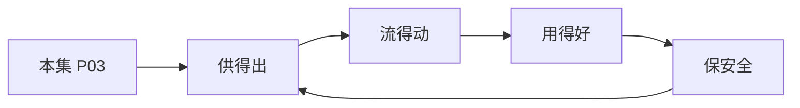

# P03 数据安全领域法律法规体系解读

← [[BV1ser5BDESU-总览]] | ← [[P02-公共数据开发利用及授权运营]] | 下一篇 → [[P04-个人信息匿名化制度与实践]]

## 视频信息

| 项目 | 内容 |
|------|------|
| 分集 | 数据安全领域法律法规体系解读 |
| 模块 | 政策与安全治理 |
| 时长 | 49 分 36 秒 |
| 链接 | [B 站 P3](https://www.bilibili.com/video/BV1ser5BDESU?p=3) |
| 官方文档 | [SecretFlow 文档](https://www.secretflow.org.cn/zh-CN/docs) |
| 内容来源 | 知识点增强（数据要素流通技术体系，非逐字转写） |

## 核心要点

1. **本 P 主题**：数据安全领域法律法规体系解读
2. **模块定位**：政策与安全治理
3. **考试/实践侧重**：数据安全法、个保法、网络安全法层级关系与核心义务
4. **笔记层级**：教程级（约 3003 字），含速览、图解、场景 Walkthrough、自测题
5. **学习建议**：先通读「3 分钟速览」与「图解」，再读「详细讲解」；动手项见 Checklist

> 以下内容基于数据要素流通与隐私计算技术体系撰写，对应 B 站分 P「数据安全领域法律法规体系解读」。**非 UP 逐字转写**；不看视频也可建立框架，看视频可对照「与视频对照表」深化。

## 本节在系列中的位置

**模块**：政策与安全治理 · 系列第 **P03/47** 集。

**建议前置**：[[公共数据开发利用及授权运营]]——建立本集所需背景。

**建议后续**：[[个人信息匿名化制度与实践]]——在本集能力之上继续深入。

依赖关系：政策(P01–P06) → 可信空间(P07–P08,P18) → 密态/隐私技术(P09–P24) → SecretFlow 工程(P25–P32) → 基础设施与案例(P33–P47)。

## 3 分钟速览

**数据安全领域法律法规体系解读** 是数据要素流通体系中的关键一课。读完本节你应能回答：① 核心概念定义；② 在「供得出—流得动—用得好—保安全」链条中的位置；③ 与隐私计算技术栈的衔接。考试/面试侧重：**数据安全法、个保法、网络安全法层级关系与核心义务**。

## 零基础导读

本节「数据安全领域法律法规体系解读」属于 **政策与安全治理**。即便未看视频，也应先建立**制度—技术—场景**三层视角：政策类章节回答「为什么允许流」；技术类章节回答「如何安全地算」；案例类章节回答「真实行业怎么落地」。

第一遍阅读请盯住三个问题：本集**解决什么痛点**？**关键参与方**是谁？**交付物或能力边界**是什么？第二遍阅读时，把术语表抄到 Obsidian 双链笔记，与前后分 P 交叉引用。

## 详细讲解

### 1. 法律法规体系层级

我国数据安全领域形成「三法三条例」为核心、部门规章与国标为支撑的体系：

| 层级 | 代表文件 | 施行时间 |
|------|----------|----------|
| 法律 | 《网络安全法》 | 2017.6 |
| 法律 | 《数据安全法》 | 2021.9 |
| 法律 | 《个人信息保护法》 | 2021.11 |
| 行政法规 | 《网络数据安全管理条例》（草案/征求意见） | 推进中 |
| 部门规章 | 数据出境安全评估办法、个人信息出境标准合同 | 2022–2023 |

### 2. 三法核心义务对照

| 维度 | 网络安全法 | 数据安全法 | 个人信息保护法 |
|------|-----------|-----------|---------------|
| 保护对象 | 网络运行安全 | 任何数据 | 个人信息 |
| 核心制度 | 等级保护 | 分类分级 | 告知同意 |
| 关键义务 | 关键信息基础设施 | 重要数据目录 | 最小必要 |
| 跨境 | 安全评估 | 安全评估 | 评估/认证/合同 |

### 3. 数据安全法要点

- **分类分级保护制度**：国家制定重要数据目录，各地区各部门确定本领域重要数据
- **数据处理活动安全义务**：建立健全管理制度、开展风险评估、定期报告
- **数据交易中介义务**：核验数据来源、留存交易记录
- **政务数据**：委托处理须监督，未经批准不得公开

### 4. 个人信息保护法要点

- **处理合法性基础**：告知+同意、合同必需、法定义务等七种情形
- **敏感个人信息**：生物识别、医疗健康、金融账户等需单独同意
- **权利保障**：查阅、复制、更正、删除、可携带
- **大型平台**：个人信息保护负责人、合规审计

### 5. 与数据要素流通的关系

流通不是「法外之地」——每次数据提供、委托处理、共同处理都需有**合法基础**和**安全义务**。隐私计算技术用于满足「最小必要」「目的限制」：只交付计算结果，不交付原始数据。

### 6. 考试/实践要点

- 区分「数据」与「个人信息」适用哪部法律
- 说出数据出境三条路径（评估、标准合同、认证）
- 企业合规清单：分类分级台账、DPIA、应急预案、人员培训

### 7. 配套标准

GB/T 35273 个人信息安全规范、GB/T 37988 数据安全能力成熟度模型（DSMM）与三法配套，企业可依此建设体系。

### 8. 违法责任

数据安全法最高千万罚款；个保法最高五千万或营业额 5%；刑法侵犯公民个人信息罪。合规是底线而非可选项。

### 9. 自测

画出三法适用 Venn 图；列举数据处理者五项法定义务。

### 深化理解（数据安全领域法律法规体系解读）

将本节概念放入「数据二十条」四原则框架：它主要支撑哪一条原则？若去掉该能力，哪类数据流通场景会受阻？用一句话向非技术经理解释本节价值。

## 图解

## 类比与直觉

数据要素政策像**交通规则**：先定道路（制度）、再发驾照（授权）、最后装护栏（安全技术）。没有规则，车（数据）跑得越快越危险。

## 例题与场景 Walkthrough

**场景：某市大数据局推进公共数据授权运营**

- **政策依据**：数据二十条、公共数据授权运营规范。
- **供得出**：交通局提供路况统计、医保局提供脱敏就诊汇总——先进目录、分级。
- **流得动**：通过可信数据空间连接器登记数据产品，API 或隐私计算方式交付。
- **用得好**：创业公司将路况+人口统计做成选址 SaaS。
- **保安全**：原始明细不出域；运营机构留存审计日志；使用方签署用途限制。
- **本集切入点**：数据安全领域法律法规体系解读 主要约束上述链条中的 **政策与安全治理** 环节。

## 常见误区

1. **「学完本集就会用隐语」**：SecretFlow 生态需多集串联（P19–P32），单集只是拼图一块。
2. **「隐私计算等于不上传数据」**：数据仍以密文、份额或授权方式参与计算，网络与算力开销客观存在。
3. **「TEE 绝对安全」**：TEE 依赖硬件与侧信道防护，需远程证明（P17）与补丁策略。
4. **「区块链解决一切确权」**：链适合存证与交易撮合，大规模计算仍在链下隐私计算引擎。

## 与视频对照表

| 视频段落（约） | 预期演示内容 | 笔记对应章节 |
|-------------|------------|------------|
| 开篇 0%–15% | 本集目标、背景、与前后集关系 | 本节位置、3 分钟速览 |
| 前段 15%–40% | 核心概念定义与架构图 | 零基础导读、详细讲解 |
| 中段 40%–70% | 原理展开、对比、政策/代码示例 | 图解、类比、Walkthrough |
| 后段 70%–90% | 案例、问答、易错点 | 常见误区、Checklist |
| 收尾 90%–100% | 总结、延伸资源 | 延伸阅读、自测题 |

> 本集总时长约 **49分36秒**。无官方外挂字幕时，以分 P 标题「数据安全领域法律法规体系解读」与上表主题对齐视频画面。

## 动手实践 Checklist

- [ ] 精读数据二十条原文 1 遍（国务院公报）
- [ ] 制作「三法」义务对照表
- [ ] 写出四原则各 1 个本地案例
- [ ] 与合规同事确认 1 个业务的数据分类分级
- [ ] 完成 5 道自测并口述给同事听

## 延伸阅读

- 国务院「关于构建数据基础制度更好发挥数据要素作用的意见」
- 《数据安全法》《个人信息保护法》
- 国家数据局「数据要素×」行动计划

## 自测题

1. **本集核心考点？**  
   **答**：数据安全法、个保法、网络安全法层级关系与核心义务。

2. **本集在四原则中的位置？**  
   **答**：主要对应制度与治理（供得出/保安全）。

3. **与 SecretFlow 的关系？**  
   **答**：提供合规与架构前提，后续技术集在其上落地。

4. **一项落地检查？**  
   **答**：是否有授权、是否最小必要、是否可审计——三者缺一不可。

5. **30 秒口述本集？**  
   **答**：用「输入→处理→输出」各一句话概括（见 Walkthrough）。

## 关键术语

| 术语 | 说明 |
|------|------|
| 数据要素 | 可参与社会化配置、创造价值的数字化资源 |
| 隐私计算 | 数据可用不可见前提下实现协作计算的技术体系 |
| 数据安全法 | 2021.9 施行，分类分级保护 |
| 个人信息保护法 | 2021.11 施行 |

## 与前后分 P 的衔接

- ← **公共数据开发利用及授权运营**（[[P02-公共数据开发利用及授权运营]]）
- → **个人信息匿名化制度与实践**（[[P04-个人信息匿名化制度与实践]]）

## 逐字转写
> 状态：待转写。运行 `Tools/transcribe/transcribe.ps1 -Bvid BV1ser5BDESU -Part 3` 补充。

## 来源说明

- ✅ B 站官方元数据（`Tools/BV1ser5BDESU-full.json`）
- ✅ 分 P 首帧封面（`Tools/bili-fetch/fetch-bilibili.js`）
- ✅ **教程级增强**：含图解/Mermaid、场景 Walkthrough、自测题（约 3003 字，2026-06-06）
- ⏳ 逐字转写：B 站 API 无外挂字幕轨；可选 Whisper/BiliNote 后续补充

## 关键截图

![[../../06-资源附件/video-notes-images/BV1ser5BDESU-P03-cover.jpg|B站首帧 P03]]
