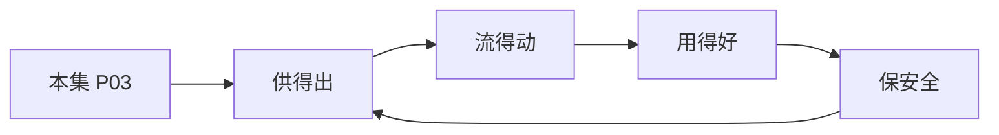

# P03 数据安全领域法律法规体系解读

← [[BV1ser5BDESU-总览]] | ← [[P02-公共数据开发利用及授权运营]] | 下一篇 → [[P04-个人信息匿名化制度与实践]]

## 视频信息

| 项目 | 内容 |
|------|------|
| 分集 | 数据安全领域法律法规体系解读 |
| 模块 | 政策与安全治理 |
| 时长 | 49 分 36 秒 |
| 链接 | [B 站 P3](https://www.bilibili.com/video/BV1ser5BDESU?p=3) |
| 官方文档 | [SecretFlow 文档](https://www.secretflow.org.cn/zh-CN/docs) |
| 内容来源 | 知识点增强（数据要素流通技术体系，非逐字转写） |

## 核心要点

1. **本 P 主题**：数据安全领域法律法规体系解读
2. **模块定位**：政策与安全治理
3. **考试/实践侧重**：数据安全法、个保法、网络安全法层级关系与核心义务
4. **笔记层级**：教程级（约 3003 字），含速览、图解、场景 Walkthrough、自测题
5. **学习建议**：先通读「3 分钟速览」与「图解」，再读「详细讲解」；动手项见 Checklist

> 以下内容基于数据要素流通与隐私计算技术体系撰写，对应 B 站分 P「数据安全领域法律法规体系解读」。**非 UP 逐字转写**；不看视频也可建立框架，看视频可对照「与视频对照表」深化。

## 本节在系列中的位置

**模块**：政策与安全治理 · 系列第 **P03/47** 集。

**建议前置**：[[公共数据开发利用及授权运营]]——建立本集所需背景。

**建议后续**：[[个人信息匿名化制度与实践]]——在本集能力之上继续深入。

依赖关系：政策(P01–P06) → 可信空间(P07–P08,P18) → 密态/隐私技术(P09–P24) → SecretFlow 工程(P25–P32) → 基础设施与案例(P33–P47)。

## 3 分钟速览

**数据安全领域法律法规体系解读** 是数据要素流通体系中的关键一课。读完本节你应能回答：① 核心概念定义；② 在「供得出—流得动—用得好—保安全」链条中的位置；③ 与隐私计算技术栈的衔接。考试/面试侧重：**数据安全法、个保法、网络安全法层级关系与核心义务**。

## 零基础导读

本节「数据安全领域法律法规体系解读」属于 **政策与安全治理**。即便未看视频，也应先建立**制度—技术—场景**三层视角：政策类章节回答「为什么允许流」；技术类章节回答「如何安全地算」；案例类章节回答「真实行业怎么落地」。

第一遍阅读请盯住三个问题：本集**解决什么痛点**？**关键参与方**是谁？**交付物或能力边界**是什么？第二遍阅读时，把术语表抄到 Obsidian 双链笔记，与前后分 P 交叉引用。

## 详细讲解

### 1. 法律法规体系层级

我国数据安全领域形成「三法三条例」为核心、部门规章与国标为支撑的体系：

| 层级 | 代表文件 | 施行时间 |
|------|----------|----------|
| 法律 | 《网络安全法》 | 2017.6 |
| 法律 | 《数据安全法》 | 2021.9 |
| 法律 | 《个人信息保护法》 | 2021.11 |
| 行政法规 | 《网络数据安全管理条例》（草案/征求意见） | 推进中 |
| 部门规章 | 数据出境安全评估办法、个人信息出境标准合同 | 2022–2023 |

### 2. 三法核心义务对照

| 维度 | 网络安全法 | 数据安全法 | 个人信息保护法 |
|------|-----------|-----------|---------------|
| 保护对象 | 网络运行安全 | 任何数据 | 个人信息 |
| 核心制度 | 等级保护 | 分类分级 | 告知同意 |
| 关键义务 | 关键信息基础设施 | 重要数据目录 | 最小必要 |
| 跨境 | 安全评估 | 安全评估 | 评估/认证/合同 |

### 3. 数据安全法要点

- **分类分级保护制度**：国家制定重要数据目录，各地区各部门确定本领域重要数据
- **数据处理活动安全义务**：建立健全管理制度、开展风险评估、定期报告
- **数据交易中介义务**：核验数据来源、留存交易记录
- **政务数据**：委托处理须监督，未经批准不得公开

### 4. 个人信息保护法要点

- **处理合法性基础**：告知+同意、合同必需、法定义务等七种情形
- **敏感个人信息**：生物识别、医疗健康、金融账户等需单独同意
- **权利保障**：查阅、复制、更正、删除、可携带
- **大型平台**：个人信息保护负责人、合规审计

### 5. 与数据要素流通的关系

流通不是「法外之地」——每次数据提供、委托处理、共同处理都需有**合法基础**和**安全义务**。隐私计算技术用于满足「最小必要」「目的限制」：只交付计算结果，不交付原始数据。

### 6. 考试/实践要点

- 区分「数据」与「个人信息」适用哪部法律
- 说出数据出境三条路径（评估、标准合同、认证）
- 企业合规清单：分类分级台账、DPIA、应急预案、人员培训

### 7. 配套标准

GB/T 35273 个人信息安全规范、GB/T 37988 数据安全能力成熟度模型（DSMM）与三法配套，企业可依此建设体系。

### 8. 违法责任

数据安全法最高千万罚款；个保法最高五千万或营业额 5%；刑法侵犯公民个人信息罪。合规是底线而非可选项。

### 9. 自测

画出三法适用 Venn 图；列举数据处理者五项法定义务。

### 深化理解（数据安全领域法律法规体系解读）

将本节概念放入「数据二十条」四原则框架：它主要支撑哪一条原则？若去掉该能力，哪类数据流通场景会受阻？用一句话向非技术经理解释本节价值。

## 图解

## 类比与直觉

数据要素政策像**交通规则**：先定道路（制度）、再发驾照（授权）、最后装护栏（安全技术）。没有规则，车（数据）跑得越快越危险。

## 例题与场景 Walkthrough

**场景：某市大数据局推进公共数据授权运营**

- **政策依据**：数据二十条、公共数据授权运营规范。
- **供得出**：交通局提供路况统计、医保局提供脱敏就诊汇总——先进目录、分级。
- **流得动**：通过可信数据空间连接器登记数据产品，API 或隐私计算方式交付。
- **用得好**：创业公司将路况+人口统计做成选址 SaaS。
- **保安全**：原始明细不出域；运营机构留存审计日志；使用方签署用途限制。
- **本集切入点**：数据安全领域法律法规体系解读 主要约束上述链条中的 **政策与安全治理** 环节。

## 常见误区

1. **「学完本集就会用隐语」**：SecretFlow 生态需多集串联（P19–P32），单集只是拼图一块。
2. **「隐私计算等于不上传数据」**：数据仍以密文、份额或授权方式参与计算，网络与算力开销客观存在。
3. **「TEE 绝对安全」**：TEE 依赖硬件与侧信道防护，需远程证明（P17）与补丁策略。
4. **「区块链解决一切确权」**：链适合存证与交易撮合，大规模计算仍在链下隐私计算引擎。

## 与视频对照表

| 视频段落（约） | 预期演示内容 | 笔记对应章节 |
|-------------|------------|------------|
| 开篇 0%–15% | 本集目标、背景、与前后集关系 | 本节位置、3 分钟速览 |
| 前段 15%–40% | 核心概念定义与架构图 | 零基础导读、详细讲解 |
| 中段 40%–70% | 原理展开、对比、政策/代码示例 | 图解、类比、Walkthrough |
| 后段 70%–90% | 案例、问答、易错点 | 常见误区、Checklist |
| 收尾 90%–100% | 总结、延伸资源 | 延伸阅读、自测题 |

> 本集总时长约 **49分36秒**。无官方外挂字幕时，以分 P 标题「数据安全领域法律法规体系解读」与上表主题对齐视频画面。

## 动手实践 Checklist

- [ ] 精读数据二十条原文 1 遍（国务院公报）
- [ ] 制作「三法」义务对照表
- [ ] 写出四原则各 1 个本地案例
- [ ] 与合规同事确认 1 个业务的数据分类分级
- [ ] 完成 5 道自测并口述给同事听

## 延伸阅读

- 国务院「关于构建数据基础制度更好发挥数据要素作用的意见」
- 《数据安全法》《个人信息保护法》
- 国家数据局「数据要素×」行动计划

## 自测题

1. **本集核心考点？**  
   **答**：数据安全法、个保法、网络安全法层级关系与核心义务。

2. **本集在四原则中的位置？**  
   **答**：主要对应制度与治理（供得出/保安全）。

3. **与 SecretFlow 的关系？**  
   **答**：提供合规与架构前提，后续技术集在其上落地。

4. **一项落地检查？**  
   **答**：是否有授权、是否最小必要、是否可审计——三者缺一不可。

5. **30 秒口述本集？**  
   **答**：用「输入→处理→输出」各一句话概括（见 Walkthrough）。

## 关键术语

| 术语 | 说明 |
|------|------|
| 数据要素 | 可参与社会化配置、创造价值的数字化资源 |
| 隐私计算 | 数据可用不可见前提下实现协作计算的技术体系 |
| 数据安全法 | 2021.9 施行，分类分级保护 |
| 个人信息保护法 | 2021.11 施行 |

## 与前后分 P 的衔接

- ← **公共数据开发利用及授权运营**（[[P02-公共数据开发利用及授权运营]]）
- → **个人信息匿名化制度与实践**（[[P04-个人信息匿名化制度与实践]]）

## 逐字转写
> 状态：已转写 · 引擎：whisper · BV1ser5BDESU P03

- **[00:00]** 各位朋友大家好
- **[00:02]** 非常高兴今天能够有这个机会
- **[00:04]** 来为大家分享
- **[00:06]** 数据安全领域的法律法规体系解读
- **[00:10]** 那么这是我的一个简单的自我介绍
- **[00:13]** 在保证文本内容的准确的情况之下
- **[00:17]** 使用了我年轻时候的照片
- **[00:19]** 但是大家相信虽然胖了一点
- **[00:21]** 但是确实是本人
- **[00:22]** 这是我多年以前留学的时候的一张照片
- **[00:26]** 当时可能还比较掀心
- **[00:29]** 那么我们今天来为大家分享的主要内容
- **[00:32]** 其实是三个大的板块
- **[00:34]** 第一个部分
- **[00:35]** 我们将会为大家来简单的介绍一下
- **[00:37]** 数据安全领域法律法规的基本框架是什么样子的
- **[00:41]** 第二我们将会以其中最为重要的数据
- **[00:45]** 三反的前几条的内容来构建
- **[00:48]** 为大家看得好
- **[00:49]** 很像比较数据立法的这么一个立法目的
- **[00:53]** 调整范围和调整对象到底是什么
- **[00:56]** 然后最后我们将会重点的
- **[00:58]** 以数据安全法的一些核心制度
- **[01:01]** 和一些代表性的案例为线索
- **[01:04]** 来为大家介绍一下数据安全法
- **[01:06]** 所规定的数据安全领域中的主要的安全制度
- **[01:10]** 有哪一些
- **[01:12]** 那么我们首先看两个简单的案例
- **[01:13]** 第一个是徐玉安
- **[01:15]** 徐玉是山东的一位高中生
- **[01:18]** 在她毕业以后考上了大学
- **[01:21]** 学家都正在高兴的时候却遭遇了毕业新诈骗
- **[01:25]** 被骗走了学费
- **[01:26]** 导致徐玉同学伤心欲绝
- **[01:29]** 最终不幸的心脏咒停一事
- **[01:32]** 这个事情也告诉我们
- **[01:33]** 其实在某些情况之下
- **[01:35]** 数据安全或者说个人信息的安全
- **[01:38]** 不仅可能会关系到我们的财产
- **[01:41]** 这种诈骗不仅谋财可能还会害命
- **[01:45]** 那么我们看第二个案例
- **[01:46]** 第二个案例是美国最大的燃油管道运输商
- **[01:50]** 运营商
- **[01:51]** 他由于遭遇了什么呢
- **[01:52]** 勒索软件的攻击
- **[01:54]** 他的部分重要数据被加密了
- **[01:56]** 必须要提供赎金才被解密
- **[01:59]** 由于这么一个攻击事件
- **[02:01]** 导致全美有接近一半的
- **[02:03]** 这么一个输油管道网络出现了几个小时
- **[02:07]** 甚至是十几个小时的暂停
- **[02:10]** 对整个国家安全
- **[02:11]** 社会经济的安全造成了一个重大的影响
- **[02:15]** 所以通过这两个案子
- **[02:16]** 我们会发现
- **[02:17]** 其实数据安全不仅仅是关系到
- **[02:19]** 个人的财产
- **[02:20]** 企业的财产
- **[02:21]** 实际上是对个人的生命安全
- **[02:23]** 甚至是对于整个国家的
- **[02:25]** 这么一个国家的主权安全
- **[02:28]** 都会有重大的风险
- **[02:30]** 那么我们国家
- **[02:31]** 其实在数据的发展过程中间
- **[02:33]** 也非常早就关注到了这么一个问题
- **[02:37]** 通过法律立法的方式
- **[02:39]** 进行的一些安全到底的完善
- **[02:41]** 那么这个安全到底的完善
- **[02:43]** 我把大概的框架
- **[02:45]** 称之为叫N加3加2
- **[02:47]** 所谓的N
- **[02:48]** 实际上是只一般性的法律
- **[02:50]** 但是中间对数据安全
- **[02:51]** 进行的一些规定
- **[02:52]** 比如说民法典
- **[02:54]** 比如说刑法典
- **[02:55]** 我们很早刑法典
- **[02:57]** 就对网络安全
- **[02:57]** 数据安全各的契机
- **[02:59]** 保护进行了一些规定
- **[03:01]** 那么还比如说
- **[03:02]** 像反不正常竞争法等等
- **[03:04]** 它也对数据做了一些相关的规定
- **[03:07]** 那么这一些N
- **[03:08]** 是一些一般性的法律
- **[03:09]** 后面的3加2
- **[03:10]** 这是专门性的法律
- **[03:11]** 其中的3
- **[03:12]** 就是最为重要的
- **[03:13]** 我们称之为叫数据三法
- **[03:15]** 里面主要就是网络安全法
- **[03:17]** 数据安全法和个人信息保护法
- **[03:20]** 他们是整个数据安全的基本框架
- **[03:23]** 那么除此之外
- **[03:24]** 还有两部国务院
- **[03:25]** 所颁布的行政法规
- **[03:27]** 来规定数据安全中间的
- **[03:29]** 一些具体的领域
- **[03:30]** 其中就是一个
- **[03:31]** 是关键信息激动设施的安全
- **[03:34]** 另外一个这是网络数据的安全
- **[03:37]** 这是我们所说的N加3加2
- **[03:39]** 成为一个大的框架
- **[03:40]** 共同构建的数据安全中间
- **[03:43]** 领域中的法律法规的
- **[03:44]** 这么一个体系
- **[03:45]** 那么在这个体系中间
- **[03:47]** 最为重要的
- **[03:47]** 当然是我们念的数据三法
- **[03:49]** 那么数据三法
- **[03:50]** 我们想要为大家
- **[03:51]** 把其位的前几条
- **[03:53]** 来做一个横向对比
- **[03:55]** 实际上这个前几条
- **[03:56]** 在很多这个
- **[03:57]** 如果是咱们法学的一些同仁
- **[03:59]** 在学习法律功能中间的时候
- **[04:01]** 有时候就能忽略
- **[04:02]** 而认为前几条比较务需
- **[04:04]** 它没有规定具体的规范性的内容
- **[04:06]** 但其实不是这样子的
- **[04:08]** 我们看数据安全的前几条
- **[04:09]** 其实可以很明确的从中间
- **[04:11]** 发现很多这个有意识的地方
- **[04:14]** 也解除我们过去的一些误解
- **[04:16]** 比如说数据安全的立法目的
- **[04:17]** 到底是什么
- **[04:18]** 这个问题好像是很简单
- **[04:20]** 数据安全立法目的
- **[04:21]** 当然会为世卫的数据安全
- **[04:23]** 真的是这样子的吗
- **[04:23]** 如果仅仅是为数据安全
- **[04:25]** 那么绝对化的数据安全是否存在
- **[04:28]** 我们经常举个例子
- **[04:29]** 就是我有一个调号码
- **[04:31]** 这个调号码是一个数据
- **[04:33]** 这个调号码也是一个个人信息
- **[04:34]** 对不对
- **[04:35]** 但是我把这个调号码
- **[04:36]** 把它锁进保险规定面
- **[04:38]** 不告诉任何人
- **[04:40]** 那还有意义吗
- **[04:41]** 实际上我们发现
- **[04:42]** 这个没有意义了
- **[04:44]** 我们为什么要规定数据立法
- **[04:47]** 数据安全的防御规范
- **[04:48]** 是因为我们处于数据经济时代
- **[04:50]** 而数据经济时代的重点是什么
- **[04:52]** 是要利用数据
- **[04:54]** 所以绝对化的安全保障
- **[04:55]** 如果阻碍个利用的时候
- **[04:56]** 实际上是有问题的
- **[04:58]** 那我们看数据三法
- **[04:59]** 到底怎么规定的
- **[05:00]** 我们先看网安法
- **[05:02]** 第一条这么规定的
- **[05:03]** 叫保障网络安全
- **[05:05]** 维护主权国家安全
- **[05:08]** 社会利益
- **[05:09]** 保护公民法正西亚组织合法权益
- **[05:11]** 促进社会经济
- **[05:14]** 经济社会信息化健康发展
- **[05:16]** 我们看到有保障有维护
- **[05:18]** 有保护还有促进
- **[05:20]** 那我们看数据安全法
- **[05:21]** 这里面就更加明确了
- **[05:23]** 叫规范数据处理活动
- **[05:26]** 保障数据安全
- **[05:28]** 促进开发利用
- **[05:30]** 数据的开发利用
- **[05:31]** 保护个人组织的合法权益
- **[05:33]** 维护国家主权安全的发展利益
- **[05:36]** 中间规定的几个动作
- **[05:37]** 第一个是规范行为
- **[05:39]** 第二个是保障安全和权益
- **[05:42]** 第三个就是促进开发利用
- **[05:46]** 实际上这三个目的是必须的
- **[05:48]** 那我们再看个人信息保护法
- **[05:49]** 它继续原用的这样的结构
- **[05:52]** 叫做保护个人信息权益
- **[05:54]** 规范个人信息处理活动
- **[05:56]** 促进个人信息的合理利用
- **[05:59]** 所以我们看到从数据三法的第一条
- **[06:01]** 我们就会发现
- **[06:02]** 实际上规范保护促进三者是一体的
- **[06:06]** 我们在理解整个数据
- **[06:08]** 安全的这么一个法律制度中间的时候
- **[06:11]** 我们不能够绝对化的
- **[06:12]** 僵化的去理解安全这个问题
- **[06:15]** 安全保障不是唯一的目标
- **[06:17]** 它是要跟规范行为和促进合理利用相结合的
- **[06:22]** 那么这也会对我们后续的一些制度的理解
- **[06:25]** 产生一些相关的影响
- **[06:28]** 那我们第二个问题
- **[06:29]** 那数据三法的适用范围是什么
- **[06:31]** 它保护的对象又是什么呢
- **[06:34]** 首先我们要看数据三法的调整范围
- **[06:37]** 这和一般的法律就出现了一些微妙区别
- **[06:41]** 也同时会对我们后面的一些制度
- **[06:43]** 我们就会提到一些制度上的一些问题了
- **[06:46]** 我们过去的传统的法律
- **[06:47]** 我们无非就是数据或者数人
- **[06:50]** 数据就是在中国大地上发生的事情
- **[06:53]** 我们就管
- **[06:54]** 数人就是对于中国人所涉及的问题
- **[06:56]** 我们就管
- **[06:58]** 但是我们看数据三法
- **[07:00]** 网安法还相对来说是比较明确的
- **[07:02]** 使用了什么数据管理
- **[07:04]** 在中国的这么一些网络我们来管
- **[07:07]** 但是我们看随着时代的法律
- **[07:09]** 我们发现不太够了
- **[07:10]** 然后在数据安全法
- **[07:11]** 数据安全法的立法是比网安法稍微晚一点点的
- **[07:14]** 我们看到我们不仅规定境内的
- **[07:17]** 而且对境外的进行了一个什么
- **[07:20]** 叫做保护性的一个保管理
- **[07:22]** 叫做是你如果在境外开展数据数据活动
- **[07:25]** 但是损害了我们国家或者我们公民组织的权益的
- **[07:29]** 我们同样可以管理
- **[07:31]** 然后我们再进一步的看个人信息保护法
- **[07:34]** 个人信息保护法
- **[07:36]** 一方面来说还是以境内为主
- **[07:38]** 但是同时它对境外相比数据安全法
- **[07:42]** 又做了进一步的扩展
- **[07:44]** 什么就是你除了说可能会危害到
- **[07:47]** 我们的公民法人组织国家的力量之外
- **[07:49]** 你如果是在境外对吧
- **[07:51]** 处理我们国家自然能的个人信息活动
- **[07:56]** 然后存在一些相关的情况的时候
- **[07:58]** 也是需要使用个人信息保护法的
- **[08:01]** 所以我们看到数据三法它体现出什么
- **[08:04]** 就是代表了数据的流动性
- **[08:06]** 我们过去很多行为
- **[08:07]** 你在国内就在国内
- **[08:08]** 在国外就国外
- **[08:09]** 它其实连续信没有那么的强
- **[08:11]** 除了一些走私这么活动
- **[08:13]** 它可能有很强的境内境外的连续信
- **[08:15]** 但是数据由于它天然的流动性
- **[08:17]** 网络由于它天然的流动性
- **[08:19]** 实际上你完全只靠一个属地原则
- **[08:23]** 只靠这个国境来进行区分
- **[08:25]** 是不够的
- **[08:26]** 所以我们看到在网安和数据安全
- **[08:29]** 和个人信息保护法中间
- **[08:31]** 它实际上都一定的扩展了属地原则
- **[08:34]** 所以这是整个数据安全的法律规范
- **[08:37]** 一个很重的原则
- **[08:39]** 它其实具有一定的跨区讯息
- **[08:41]** 有一定的国际性
- **[08:43]** 我们后续看距离制度的时候发现这个问题
- **[08:46]** 实际上国家与国家之间
- **[08:48]** 关于数据管辖的一个冲突
- **[08:50]** 是数据安全制度领域中间的
- **[08:53]** 有一个某种程度上是一定它的一个特色
- **[08:56]** 也会为我们数据安全法的适用
- **[08:57]** 其实产生一些问题
- **[08:59]** 我们后续再来解释
- **[09:01]** 那么什么是数据呢
- **[09:03]** 实际上我们看到
- **[09:04]** 网安、数据、个人信息保护法
- **[09:06]** 产生都做一些相关的界定
- **[09:08]** 那么这里我们要注意一个有意思的特点
- **[09:11]** 网络安全法
- **[09:13]** 当时最早的时候界定的数据
- **[09:15]** 讲的就是电子数据
- **[09:16]** 这个没问题
- **[09:17]** 因为它是以网络为主导的
- **[09:19]** 但是到了数据安全法中间
- **[09:21]** 以及后续的个人信息保护法中间
- **[09:23]** 还来讲的时候
- **[09:24]** 就有一个很重要的特点
- **[09:26]** 它不极限于电子数据
- **[09:29]** 是以电子和其他方式存储的
- **[09:32]** 对信息的记录都属于数据
- **[09:35]** 那么这里我们就要注意一个特点
- **[09:37]** 都属于数据
- **[09:38]** 那么紫字档案受不受数据安全法的管理
- **[09:41]** 而我们今天有个签到本
- **[09:43]** 我们讲说同学们来签到
- **[09:44]** 有的签到本上面有对个人信息的签到
- **[09:47]** 但这个本质
- **[09:48]** 受不受个保护法的管理都受的
- **[09:51]** 实际上我们这里尤其要注意的就是
- **[09:53]** 实际上现在我们关注到
- **[09:55]** 实践中大量的数据安全的泄漏
- **[09:57]** 或者个人信息保护的泄漏
- **[09:59]** 是怎么泄漏出来的呢
- **[10:01]** 比如说疫情期间的一些流调数据
- **[10:04]** 比如说有血管员拿了紫字档案
- **[10:06]** 拍了照上传
- **[10:07]** 发到了相亲相爱的家人
- **[10:09]** 很多数据是这么流传出去的
- **[10:11]** 所以紫字的数据的管理
- **[10:13]** 不能够去忽视
- **[10:15]** 这是我们对于数据
- **[10:17]** 我们对于法律所要保护数据的界定
- **[10:19]** 或者数安法的界定的时候
- **[10:20]** 我们的一个重要的一个并解的内容
- **[10:23]** 那么同时数安法对于数据的保护
- **[10:25]** 还提了一个非常重的一个概念
- **[10:28]** 叫做分级分类
- **[10:29]** 分级分类就是把数据分为一般数据
- **[10:32]** 重要数据和国家核心数据
- **[10:36]** 它实际上是按照什么来分的呢
- **[10:37]** 是有两种逻辑
- **[10:39]** 第一个逻辑是它的重要程度
- **[10:41]** 第二个逻辑是它如果一旦出问题
- **[10:44]** 它的危害程度
- **[10:46]** 重要程度和可能的危害风险程度
- **[10:49]** 把它进行了分级分类
- **[10:50]** 分成的简单的分是分为这三类
- **[10:52]** 当然还有更多细节的分法
- **[10:54]** 那么为什么要分级分类
- **[10:56]** 这就是提到了我们一开始所讲的
- **[10:58]** 绝对性的安全
- **[10:59]** 实际上在数据经济和数据社会时代是不够的
- **[11:03]** 我们还是要分类来看
- **[11:05]** 一般的数据
- **[11:07]** 我们可以稍微让它的安全制度
- **[11:09]** 稍微宽松一点点来让它更好的利用
- **[11:12]** 但是越是重要
- **[11:13]** 或者是风险越大的数据
- **[11:15]** 我们越要更高标准的
- **[11:18]** 更严格的管理
- **[11:19]** 所以通过分级分类
- **[11:21]** 实际上是进行一个分风险的分级管控
- **[11:24]** 来给不同风险
- **[11:26]** 不同重要性不同价值的数据
- **[11:28]** 来匹配不同的管理制度
- **[11:33]** 所以这也是我们为什么一开始就要结合第一条
- **[11:36]** 我们来看
- **[11:37]** 实际上这就和整个数据立法的立法目的
- **[11:40]** 结合在一起
- **[11:42]** 那么数据的分级分类
- **[11:43]** 是这么一个基本的一个大的这么一个思路
- **[11:47]** 我们再看下面一个数据中间比较特殊的
- **[11:50]** 特别领域就是个人信息
- **[11:52]** 个人信息应该说在整个数据中间
- **[11:54]** 是相对来说比较特殊的
- **[11:56]** 因为它一方面有风险
- **[11:57]** 另外一方面离我们老百姓特别近
- **[11:59]** 所以对于大家的获得感特别强
- **[12:01]** 一旦被侵害了
- **[12:02]** 我们个人感知是非常强的
- **[12:05]** 那么个人信息
- **[12:06]** 由这里面要注意一个重要的特点
- **[12:07]** 就是它是要与以识别或可识别的
- **[12:11]** 自然人相关的信息
- **[12:13]** 完全另明化的信息
- **[12:15]** 它是不算个人信息的
- **[12:17]** 要完全另明化的信息
- **[12:18]** 比如说中国有14亿人
- **[12:20]** 这个绝对的统计信息
- **[12:22]** 实际上你是无法指定到
- **[12:23]** 具体的个人的
- **[12:24]** 我们所有人的报寒在里面
- **[12:26]** 或者你说在广州这么个地方
- **[12:29]** 有多少人具有什么样的一种特征
- **[12:32]** 由于这是一个完全无法还原到具体个人的
- **[12:35]** 因为你也不知道我说的是谁 对不对
- **[12:36]** 但这时候就是一个另明化的信息
- **[12:39]** 另明化的信息
- **[12:40]** 统计性的信息是不受各办法的约束的
- **[12:42]** 但是并不是所有的我们看到
- **[12:46]** 去标识化的信息
- **[12:47]** 就是另明化的信息
- **[12:48]** 我们这提了两个概念
- **[12:49]** 一个要去标识化
- **[12:50]** 一个叫另明化
- **[12:52]** 另明化是完全无法还原了
- **[12:54]** 你不知道是谁
- **[12:55]** 去标识化是你去了个标识
- **[12:57]** 但是有可能你根据这个标识
- **[13:00]** 还能确定到是谁
- **[13:02]** 那这个时候
- **[13:04]** 那这个信息
- **[13:05]** 它就有可能仍然受到各办法的约束
- **[13:08]** 这叫做去标识化
- **[13:10]** 那么在这个过程中间
- **[13:11]** 我们举个例子
- **[13:12]** 比如说我们今天看到
- **[13:13]** 有时候我们叫猛猛猛
- **[13:15]** 或者叫李猛猛王猛猛
- **[13:18]** 这些信息是去标识化的
- **[13:19]** 还是另明化的呢
- **[13:21]** 我们是要放到特定情况下来看的
- **[13:23]** 比如说曾经我这有个案例
- **[13:25]** 就是某一个小区打出了一个横幅
- **[13:29]** 说猛猛小区挤挤动的
- **[13:31]** 什么李猛
- **[13:33]** 由于诈骗 被骗多少多少元
- **[13:36]** 我们注意啊
- **[13:37]** 这个横幅上的李猛
- **[13:38]** 在结合他的动的楼洞信息
- **[13:41]** 实际上是可以去还原到他的
- **[13:43]** 因此这个信息
- **[13:44]** 我们某种程度上来说
- **[13:45]** 只认为它是个去标识化的信息
- **[13:47]** 而不是一个完全另明化的信息
- **[13:50]** 所以在整个各办法的处理作用中间
- **[13:52]** 我们对于这个另明化和这个去标识化
- **[13:54]** 是个比较复杂的问题
- **[13:55]** 我们要注意去进行一定的区分
- **[13:58]** 那么与这个个人信息相对应的进一步
- **[14:00]** 是敏感个人信息
- **[14:02]** 那就是由于涉及到生物识别
- **[14:04]** 宗教信仰 特定身份
- **[14:05]** 金融账户 行踪轨迹等等原因
- **[14:08]** 以及不满未成
- **[14:09]** 不满实事之后
- **[14:10]** 所以的未成年人
- **[14:11]** 由于这些原因
- **[14:12]** 它比一般的个人信息更为重要
- **[14:14]** 更为敏感的
- **[14:15]** 然后我们把它定为敏感个人信息
- **[14:18]** 那么敏感个人信息应该说
- **[14:19]** 这些年来说也会对我们
- **[14:22]** 我们日常生活中也会经常遇到
- **[14:23]** 其中一个很重要的其实就是人脸识别
- **[14:26]** 人脸识别我们这两年其实看到了
- **[14:28]** 很多越来越广的使用
- **[14:31]** 但是从此也产生了一些争议
- **[14:33]** 比如说我们这里可以看到
- **[14:34]** 人脸识别的第一案
- **[14:36]** 把郭斌 郭斌上也是个学者
- **[14:38]** 郭斌老师
- **[14:39]** 郭斌老师可能当时也是看到
- **[14:41]** 这个国内的人脸识别的这么一个情况
- **[14:43]** 他作为一个法学的一个老师
- **[14:45]** 对学内比较敏感
- **[14:47]** 我们看这个案子是什么呢
- **[14:48]** 这个案例上是我们老师被称之为
- **[14:50]** 叫人脸识别第一案
- **[14:52]** 是讲郭老师他买了一个
- **[14:55]** 也是动物园的双人脸卡
- **[14:57]** 这个动物园的脸卡以前是靠按手印
- **[14:59]** 按指纹
- **[15:00]** 后来改成了人脸识别
- **[15:03]** 郭老师说我不愿意把我的人脸给
- **[15:06]** 那我要说推卡
- **[15:07]** 动物园不同意
- **[15:09]** 后来起诉了
- **[15:10]** 最后法院认为
- **[15:11]** 你如果要使用人脸识别
- **[15:15]** 这涉及到敏感个人信息
- **[15:16]** 你要他本人同意
- **[15:18]** 人家不同意你不能强制
- **[15:20]** 那怎么办
- **[15:20]** 第一退钱
- **[15:21]** 第二删除郭老师
- **[15:23]** 当时存储过的所有的智慧信息
- **[15:26]** 我们注意这个案子是2019年
- **[15:29]** 然后是2019年
- **[15:30]** 当时我们的各网法其实是没有通过的
- **[15:32]** 但是法院已经从学里拿到层面
- **[15:36]** 对人脸的这么一个敏感个人信息
- **[15:38]** 实际上是进行了一定的关注
- **[15:41]** 那么与此对应的是
- **[15:43]** 我们看到是最高法院
- **[15:44]** 也出台了关于人脸识别技术
- **[15:47]** 处理的一个司法解释
- **[15:49]** 我们也要注意这个司法解释很有意思
- **[15:50]** 这个司法解释
- **[15:51]** 实际上是在各网法社校前一天出来了
- **[15:54]** 所以某种程度上来讲
- **[15:55]** 它不是对各网法的解释
- **[15:57]** 而是对于人脸的这么一个特殊的敏感信息
- **[16:00]** 在原有的法律的框架之下
- **[16:02]** 就可以得出这么一个解释了
- **[16:03]** 但是各网法只是一个更加明确的规定
- **[16:06]** 那么在这里面
- **[16:07]** 其实用一个很重要的一个特点是什么呢
- **[16:10]** 其实就是物业的信息
- **[16:12]** 这个物业的这些信息
- **[16:14]** 应该是要提供一个替代性的选项的
- **[16:18]** 比如说我们以前进出物业都必须人脸识别
- **[16:21]** 而现在我们看到的是
- **[16:22]** 进出物业你可以人脸识别
- **[16:24]** 如果说某个人同意
- **[16:26]** 但如果他不同意怎么办
- **[16:27]** 你要给他提供一个替代性的选项
- **[16:30]** 比如说你可以说半个卡
- **[16:32]** 对不对
- **[16:33]** 或者这种指纹
- **[16:34]** 所以这也是为什么
- **[16:35]** 我们给很多APP的开发者
- **[16:36]** 我们进行一些沟通的时候
- **[16:38]** 很多APP开发者
- **[16:39]** 后面的问题
- **[16:39]** 马老师我这个业务必须要人脸识别
- **[16:42]** 比如说银行那些APP
- **[16:43]** 我不人脸识别
- **[16:44]** 我不安全
- **[16:45]** 那我必须要人脸识别
- **[16:46]** 那你现在不能强迫我人脸识别
- **[16:48]** 我一定要给一个替代性的选项的怎么办
- **[16:50]** 我说你尊重消费者的选择权
- **[16:53]** 你愿意人脸识别
- **[16:55]** 我给你便利
- **[16:56]** 你可以在网上办理
- **[16:57]** 如果你始终不愿意人脸识别
- **[16:59]** 没问题
- **[17:00]** 我给你一个替代选项
- **[17:01]** 你去线下办理
- **[17:02]** 对吧
- **[17:03]** 你不要把线下的办理的渠道给断掉了
- **[17:06]** 如果有个消费者自己就一定
- **[17:08]** 不愿意把人脸给你
- **[17:09]** 他宁可自己麻烦
- **[17:11]** 每天去跑营业厅
- **[17:12]** 那你要给他提供一个替代的选项
- **[17:15]** 如果你觉得每个营业厅
- **[17:16]** 安排一个人脸的办理
- **[17:17]** 线下的业务太麻烦
- **[17:18]** 那你一个城市总有一个营业厅的办理
- **[17:21]** 对不对
- **[17:22]** 你给一个选择
- **[17:23]** 这实际上是各宝法
- **[17:24]** 一个很重要的特点
- **[17:25]** 就是你要给消费者
- **[17:26]** 或者说给自然人一个选择的空间
- **[17:29]** 那么我们看到下面
- **[17:30]** 26条实际上是各宝法
- **[17:32]** 一个进一步的规定
- **[17:34]** 各宝法
- **[17:35]** 我们注意到人脸识别
- **[17:36]** 在这个现实中间
- **[17:37]** 实际上是大量存在的
- **[17:38]** 各宝法商
- **[17:39]** 最后把它进一步的限定
- **[17:41]** 是这种身份采集的
- **[17:42]** 个人信息的采集设备
- **[17:44]** 只能用于维护公共安全说必须
- **[17:48]** 你只能用于安全
- **[17:49]** 你才能够做这个人脸识别
- **[17:51]** 除非老百姓自然能同意
- **[17:53]** 否则你在公共场所也好
- **[17:55]** 在其他地方也好
- **[17:56]** 你布置这个摄像头
- **[17:57]** 公共场所布置的是个摄像头
- **[17:59]** 只能用于安全目的
- **[18:01]** 有大家可能会问
- **[18:02]** 除了安全目的
- **[18:03]** 还有什么目的
- **[18:04]** 音效目的
- **[18:05]** 我们看到新闻报道过
- **[18:06]** 很多受容户
- **[18:08]** 安装的人脸识别设备
- **[18:10]** 来为了解
- **[18:11]** 所以我们看到一些新闻报道
- **[18:12]** 甚至有些人买房的时候
- **[18:13]** 带了一个头盔
- **[18:14]** 这个也非常有意思
- **[18:16]** 但是同时这也就告知了
- **[18:18]** 我们一个问题
- **[18:19]** 人脸识别的精准音效很好用
- **[18:21]** 但是个人信息保护法
- **[18:22]** 现在实际上是对它
- **[18:23]** 进行了一个强有力的限定
- **[18:25]** 因为它属于敏感
- **[18:27]** 敏感的个人信息
- **[18:29]** 所以需要得到一个
- **[18:30]** 更高层级的保护
- **[18:31]** 所以做了一个特别的限制
- **[18:33]** 好 那么我们刚刚介绍了
- **[18:39]** 整个各宝法
- **[18:41]** 或者说我们说数据三法
- **[18:42]** 基本的框架的基本的限制
- **[18:44]** 基本的设置之后
- **[18:46]** 我们下面我们来看一下
- **[18:48]** 它们具体的制度讲了什么
- **[18:50]** 当然今天因为时间的原因
- **[18:52]** 我们很难将
- **[18:53]** 三部法律的内容
- **[18:55]** 全部讲一讲
- **[18:56]** 那么我们主要今天讲一讲
- **[18:58]** 数据安全法中间的
- **[19:00]** 一些重要制度
- **[19:01]** 和一些重要的内容
- **[19:03]** 那么证明的重要制度
- **[19:04]** 除了我们刚刚
- **[19:06]** 刚刚介绍过的
- **[19:08]** 分级分类之外
- **[19:09]** 我们来看看
- **[19:10]** 还有哪些具体的制度
- **[19:12]** 我们看这里列了
- **[19:13]** 三条制度
- **[19:14]** 监测预警制度
- **[19:15]** 应急处置制度
- **[19:17]** 安全审查制度
- **[19:19]** 使用这三个制度
- **[19:20]** 都是一些很基础的
- **[19:21]** 我们其实看这里
- **[19:22]** 可以观察到
- **[19:23]** 数据安全法的一个颗粒度
- **[19:25]** 数据安全法的颗粒度
- **[19:26]** 其实是比较大的
- **[19:28]** 规定的还是宏观上的
- **[19:30]** 一些安全制度
- **[19:31]** 具体怎么落实呢
- **[19:32]** 其实还是有很多
- **[19:33]** 部门规章和具体的文件
- **[19:34]** 去操作
- **[19:35]** 那么在这三个制度中间
- **[19:37]** 我们可以重点讲一下
- **[19:39]** 安全审查制度
- **[19:40]** 这个制度是非常有特色的
- **[19:43]** 我们看到人们讲述的
- **[19:44]** 叫做是
- **[19:45]** 国家建立数据安全审查制度
- **[19:47]** 对影响或者可能影响
- **[19:49]** 国家安全的数据安全制度活动
- **[19:51]** 进行国家安全审查
- **[19:53]** 注意了
- **[19:54]** 第二款
- **[19:55]** 依法做出的安全审查决定
- **[19:57]** 为最终决定
- **[19:59]** 什么意思呢
- **[20:00]** 如果说我们是
- **[20:01]** 学法律师朋友
- **[20:02]** 这次就很敏感了
- **[20:03]** 意味着
- **[20:04]** 数据安全的国家审查
- **[20:06]** 是不可以负义
- **[20:07]** 也不可以输送的
- **[20:08]** 它是一个最终决定
- **[20:10]** 原因是因为
- **[20:11]** 它关系到了国家安全
- **[20:13]** 因此在某种程度上来讲
- **[20:15]** 它会有一定的
- **[20:16]** 国家安全的政治属性
- **[20:19]** 这时候我们更强化的是
- **[20:21]** 一省中省
- **[20:22]** 叫做一个决定中省
- **[20:24]** 不再去安排其他的
- **[20:26]** 这么一个数据渠道了
- **[20:28]** 这实际上是很类似于
- **[20:30]** 一些跟海关
- **[20:31]** 或者是一些体现出
- **[20:34]** 比较强的国家
- **[20:35]** 主权属性的一些制度中
- **[20:37]** 所出现出来的
- **[20:38]** 那么关于这个
- **[20:40]** 数据安全审查之路
- **[20:41]** 实际上在我们的整个
- **[20:43]** 最近的经验中间
- **[20:44]** 已经有多次发生了
- **[20:46]** 比如说
- **[20:47]** 一个受到境外企业的
- **[20:48]** 是美光
- **[20:49]** 而涉及到境内企业的
- **[20:50]** 大家也比较了解的
- **[20:52]** 就是某出行企业
- **[20:54]** 这个出行企业
- **[20:56]** 它这个交通
- **[20:57]** 当时还有很多交通数据
- **[20:59]** 出行数据
- **[21:00]** 然后在2021年
- **[21:02]** 由于某一些事件
- **[21:04]** 而且就是说
- **[21:05]** 它还在境外去上市
- **[21:06]** 等等原因
- **[21:07]** 引发了一个
- **[21:09]** 比较集中的爆发
- **[21:11]** 那么当时国家
- **[21:12]** 为了防范国家数据安全风险
- **[21:14]** 维护国家安全
- **[21:15]** 保障公共利益
- **[21:17]** 实际上是一句
- **[21:19]** 网络安全法
- **[21:22]** 相关的法律法规
- **[21:24]** 对它进行了
- **[21:25]** 一个数据安全审查
- **[21:27]** 那么在数据安全审查的最后
- **[21:29]** 是认为它违反了
- **[21:31]** 网络安全法
- **[21:32]** 数据安全法和个人心理保护法
- **[21:33]** 行政筹法法的
- **[21:34]** 相关的法律法规
- **[21:35]** 给予这个企业
- **[21:37]** 予以80.26亿元的
- **[21:39]** 一个高额的处罚
- **[21:41]** 同时对它的
- **[21:42]** 相关的领导人员
- **[21:44]** 进行了个人的一个罚款
- **[21:47]** 所以我们看到了
- **[21:48]** 整个数据安全的
- **[21:50]** 这个领域中间的
- **[21:51]** 这么一个审查
- **[21:52]** 它实际上是很有可能
- **[21:54]** 会产生一个
- **[21:55]** 非常强大的一个处罚后果的
- **[21:57]** 这实际上也是
- **[21:58]** 数据安全领域中间
- **[21:59]** 一个比较一色的特点
- **[22:01]** 那么我们看
- **[22:02]** 其他国家也是如此
- **[22:03]** 欧洲 基于GDPR
- **[22:05]** 实际上是
- **[22:06]** 做出了几个
- **[22:07]** 巨大的巨额罚单
- **[22:09]** 都是数亿欧元
- **[22:11]** 甚至是十几亿欧元
- **[22:12]** 这么一个处罚的可能
- **[22:14]** 那么这种某种程度上来讲
- **[22:16]** 它一个很重要的原因
- **[22:17]** 是因为这些处罚
- **[22:18]** 往往都是根据
- **[22:19]** 这个企业的全球营收来算
- **[22:21]** 根据它的全球营收
- **[22:23]** 或者根据它的总营收来算
- **[22:24]** 而这些数值的一些巨头
- **[22:26]** 或者是重大的平台企业
- **[22:28]** 它实际上在全球
- **[22:29]** 有广泛的业务
- **[22:30]** 所以它的总营收的比例
- **[22:31]** 总营收的这个份额是很高的
- **[22:33]** 所以当你这个法律规定
- **[22:35]** 对它可以进一百分之二
- **[22:36]** 百分之三 百分之四的处罚的时候
- **[22:38]** 它实际上的这个费用
- **[22:40]** 就非常的高
- **[22:41]** 所以我们看到
- **[22:42]** 在数据安全领域总监
- **[22:43]** 我们经常会看到
- **[22:44]** 一些天价罚单的存在
- **[22:46]** 这实际上某种程度上来讲
- **[22:48]** 一方面是展现了
- **[22:49]** 对于数据安全的重视
- **[22:51]** 另外一方面
- **[22:52]** 其实反映的是
- **[22:53]** 数字经济的活力
- **[22:54]** 因为数字经济有这么大的盘子
- **[22:56]** 有这么大的体量
- **[22:57]** 才会出现
- **[22:58]** 这么重大的一个处罚
- **[23:00]** 所以数据安全
- **[23:01]** 对于这么重大的数字经济
- **[23:03]** 它同样也体现出了
- **[23:05]** 一个很重要的一个作用
- **[23:08]** 那么第二个
- **[23:09]** 我们再看相关的这么一个制度
- **[23:11]** 那就是出口管制制度
- **[23:13]** 出口管制制度
- **[23:14]** 实际上就是意味着
- **[23:15]** 某些数据你是不能出去的
- **[23:17]** 我们也看到
- **[23:18]** 我们国家在不断的出台
- **[23:20]** 一些关于技术出口的
- **[23:22]** 一些限制的名单
- **[23:24]** 那么除了技术之外
- **[23:25]** 数据本身
- **[23:26]** 也是有一些进行管制的要求的
- **[23:29]** 这里与之相关
- **[23:30]** 还有对等反制制度
- **[23:31]** 其实我们刚刚提到了
- **[23:32]** 数据是涉及到跨境的
- **[23:34]** 大量的数据
- **[23:35]** 实际上涉及到境内境外的问题
- **[23:37]** 而数据这个法律领域
- **[23:39]** 天然的存在
- **[23:41]** 跟国际斗争有一定的关系
- **[23:44]** 待会我们会讲的
- **[23:45]** 有些其他的制度
- **[23:46]** 会更加明确
- **[23:47]** 但在这里面
- **[23:48]** 我们其实已经出现端理了
- **[23:50]** 实际上在这个数据的
- **[23:52]** 法律的治理过程中间
- **[23:54]** 它有很多问题
- **[23:55]** 实际上是带有国际性的
- **[23:57]** 甚至会成为国际斗争的一部分
- **[24:01]** 我们具体来看
- **[24:03]** 扣扣管制的这么一个制度
- **[24:05]** 这个制度具体实现
- **[24:06]** 它是很丰富的
- **[24:07]** 但是我们看到
- **[24:08]** 它暴露出的一些问题
- **[24:10]** 有时候是通过一些
- **[24:11]** 很特殊的各地暴露出来的
- **[24:13]** 比如说我们看一下
- **[24:15]** 这个案例
- **[24:16]** 叫做数据出境限制的第一案
- **[24:18]** 它对应的
- **[24:19]** 除了我们刚刚所提到的
- **[24:21]** 这个出境管制制度之外
- **[24:23]** 还有一些相应的
- **[24:24]** 出境限制的一些制度
- **[24:26]** 这个案子
- **[24:27]** 我们看到它的具体信息
- **[24:28]** 其实来自于交电访谈
- **[24:30]** 它非常的重要
- **[24:31]** 进行了全面的这么一个报告
- **[24:33]** 那么这个案子
- **[24:34]** 大概是什么一个情况呢
- **[24:36]** 其实讲的就是
- **[24:37]** 有上海的一个科技公司
- **[24:39]** 有一个员工
- **[24:40]** 他被拉进了一个微信群
- **[24:42]** 群里面有人说
- **[24:43]** 是一个境外企业
- **[24:45]** 要委托中国公司
- **[24:47]** 开展对一些数据的调研
- **[24:51]** 但这里的数据调研
- **[24:52]** 由于他们
- **[24:54]** 疫情期间不能够来划
- **[24:56]** 所以希望委托境内公司来进行
- **[24:58]** 主要是收集
- **[25:00]** 中国铁路的一些信号数据
- **[25:02]** 包括物联网封窝和
- **[25:04]** GSMR的评普的一些数据
- **[25:07]** 当时这个企业
- **[25:08]** 为了赚钱
- **[25:09]** 很快就答应了这个项目
- **[25:11]** 但是其实他们当时
- **[25:13]** 也出现了一些敏感
- **[25:15]** 对这个案子的合法性
- **[25:17]** 对这个项目的合法性
- **[25:19]** 心中是有一些
- **[25:21]** 有一些疑虑的
- **[25:23]** 所以当时他们还请教了
- **[25:25]** 公司的法务
- **[25:26]** 而公司的法务
- **[25:27]** 是明确告诉他有风险的
- **[25:29]** 你们还要注意
- **[25:30]** 但是我们看到这个公司
- **[25:34]** 虽然说知道有风险
- **[25:36]** 但是觉得收益还是很关的
- **[25:39]** 怎么办
- **[25:40]** 于是他们做了个办法
- **[25:42]** 就是向境外企业问
- **[25:44]** 你们有没有一些
- **[25:45]** 合法性的一些文件
- **[25:46]** 要求对方来提供
- **[25:48]** 但是境外企业
- **[25:49]** 跟他们打太极
- **[25:50]** 说这个东西没关系
- **[25:51]** 怎么怎么样
- **[25:52]** 不停地吹出他们尽快的
- **[25:54]** 来完成这项工作
- **[25:56]** 然后他们要求对方
- **[25:57]** 实际上是完成这个工作
- **[25:59]** 是通过一些普通设备
- **[26:01]** 就可以的
- **[26:02]** 比如说是一些简单的设备
- **[26:04]** 这个设备不是什么间谍设备
- **[26:05]** 就是很普通的设备
- **[26:07]** 所以这个公司当时就有点放松了
- **[26:09]** 觉得都是普通设备
- **[26:10]** 没有关系对吧
- **[26:11]** 然后利润很丰厚
- **[26:13]** 于是他就开始
- **[26:15]** 在做这个工作了
- **[26:17]** 这个公司
- **[26:18]** 即使是认为有合法性的疑虑
- **[26:20]** 但是他同时还是开始
- **[26:22]** 进行的操作
- **[26:23]** 那么在这个过程中间
- **[26:25]** 他们约定了两个阶段的合作
- **[26:27]** 第一个阶段是固定采集
- **[26:29]** 第二个阶段是要去到
- **[26:31]** 移动设备的各个地方
- **[26:33]** 进行移动采集
- **[26:34]** 然后这个采集过程中间
- **[26:37]** 最开始是要求把数据
- **[26:38]** 纯入硬盘
- **[26:39]** 然后寄到海外
- **[26:41]** 但是由于担心海外
- **[26:43]** 在邮寄过程中间
- **[26:44]** 出现一些问题
- **[26:45]** 最后这个东西
- **[26:47]** 不断的进一调整
- **[26:48]** 最后甚至是出现了一些
- **[26:50]** 远程端口
- **[26:51]** 就是国内的公司在这里采集
- **[26:53]** 境外的公司直接
- **[26:55]** 通过端口
- **[26:56]** 从国内来调取相关的数据
- **[26:59]** 甚至可以登录
- **[27:00]** 这些远程的端口
- **[27:01]** 实际上到这一步的时候
- **[27:03]** 我们就会发现
- **[27:04]** 一步一步问题
- **[27:05]** 是不是越来越大了
- **[27:06]** 一开始是你采集
- **[27:07]** 这些数据
- **[27:08]** 你还可以自己整理
- **[27:09]** 整理之后
- **[27:10]** 如果有敏感性的
- **[27:11]** 你可以把它提出一下
- **[27:12]** 到后来
- **[27:13]** 实际上这个境内公司
- **[27:15]** 完全的成为了境外公司
- **[27:17]** 采集的这么一个白手套
- **[27:19]** 所有的数据从境内
- **[27:20]** 直接有流向的境外
- **[27:21]** 没有经过审查
- **[27:22]** 也没有合规的要求
- **[27:23]** 而境内公司
- **[27:24]** 以上不能控制
- **[27:25]** 这些数据到底怎么办
- **[27:27]** 所以在这种情况之下
- **[27:28]** 其实境内公司对这个风险
- **[27:30]** 其实是有越来越多的明确了
- **[27:32]** 但是由于它的收益太高了
- **[27:35]** 所以他们还是挺而走
- **[27:37]** 现在做
- **[27:38]** 这些数据一个月
- **[27:39]** 采集到了数据
- **[27:40]** 就达到了将近500期
- **[27:43]** 最后呢
- **[27:44]** 经过坚定发现
- **[27:45]** 这些数据实际上是一些敏感数据
- **[27:48]** 这些数据很有可能对国家安全
- **[27:50]** 对我们的生产经营安全
- **[27:52]** 造成严重的影响
- **[27:54]** 而属于数据安全法里面
- **[27:56]** 所规定的
- **[27:57]** 静止出口的相关的一些数据
- **[27:59]** 然后呢
- **[28:00]** 最后呢
- **[28:01]** 这个案子在处理过程中间
- **[28:02]** 我们注意一下
- **[28:03]** 这个案子比较有意思
- **[28:04]** 在于是
- **[28:05]** 这个案子最后
- **[28:06]** 它是上到了刑事责任
- **[28:07]** 当然我们知道
- **[28:08]** 刑法是非常特殊的一个法律
- **[28:10]** 就是罪刑法定
- **[28:11]** 所有的罪名
- **[28:13]** 必须有法
- **[28:14]** 由刑法来规定
- **[28:16]** 最后呢
- **[28:17]** 这个案子在刑法处理中间的时候
- **[28:19]** 把它认定为
- **[28:20]** 叫为境外刺探非法提供情报罪
- **[28:24]** 这里的数据
- **[28:25]** 同时构成了刑法上面
- **[28:26]** 所说的情报
- **[28:27]** 之后我们发现
- **[28:28]** 这个数据出境
- **[28:30]** 如果说
- **[28:31]** 你没办法做好它的合规
- **[28:33]** 你没有办法按照合规的
- **[28:35]** 比如说合规要求来进行完善
- **[28:37]** 它就是很有可能
- **[28:38]** 触犯到刑法的
- **[28:40]** 在这个案子中间
- **[28:41]** 我们也看到了这个企业
- **[28:42]** 其实一开始
- **[28:43]** 他请教了法务
- **[28:45]** 但是法务给了意见
- **[28:46]** 他最终没有踩辣
- **[28:48]** 他也没有做相关的合规的准备
- **[28:50]** 就是为了利益行而走险
- **[28:53]** 最终使得自己触犯到刑法
- **[28:56]** 也同时给国家带来的巨大的损失
- **[28:59]** 那么我们再看另外一个案子
- **[29:02]** 这个案子或者叫案例吧
- **[29:04]** 这个势力
- **[29:05]** 这个势力相对来说
- **[29:06]** 就是一个比较好的势力
- **[29:07]** 那就是什么
- **[29:08]** 特斯拉
- **[29:09]** 特斯拉在中国建立的数据中心
- **[29:12]** 实现所有的数据跟电话存储
- **[29:14]** 我中国的数据
- **[29:15]** 我在中国存储
- **[29:16]** 我在中国的数据在中国训练
- **[29:18]** 减少数据不必要的数据夸挤
- **[29:21]** 大大增加了我们数据的安全的程度
- **[29:24]** 这反过来也让中国的企业和中国的政府
- **[29:27]** 对于中国的老百姓
- **[29:28]** 对于特斯拉更加信任
- **[29:30]** 对吧
- **[29:31]** 你的数据都在我们的境内
- **[29:32]** 那我们就可以更加安心地来进行使用
- **[29:34]** 这是一个
- **[29:35]** 我们说刚刚讲的这个负面案例
- **[29:37]** 那么这里讲的是一个
- **[29:38]** 相对来说
- **[29:40]** 好
- **[29:41]** 那么我们前面讲的是
- **[29:43]** 数据夸挤
- **[29:44]** 数据出入境的这么一个
- **[29:45]** 宏大的一个名题
- **[29:46]** 那么在具体的工作中间
- **[29:49]** 或者是我们在具体的
- **[29:51]** 这个数据的管理中间
- **[29:53]** 数据安全法
- **[29:54]** 还规定了很多具体的
- **[29:56]** 数据安全保护义务
- **[29:58]** 实际上就说
- **[29:59]** 你任何企业或者个人
- **[30:00]** 你处理数据
- **[30:01]** 你要完成相应的
- **[30:03]** 这么一个数据安全保护的义务
- **[30:05]** 建设相应的数据安全保护义务
- **[30:08]** 建设相应的数据安全的保护制度
- **[30:11]** 如果你没有建设
- **[30:12]** 你没有去
- **[30:13]** 没有去完成这么一些义务的话
- **[30:15]** 你可能就会有相关的法律责任
- **[30:17]** 那么我们这里可以看一下这个案例
- **[30:20]** 第一个案例
- **[30:21]** 是一个价培学校的数据安全违规案
- **[30:24]** 广州警方发现
- **[30:26]** 一个公司所开发的价培的平台
- **[30:30]** 培训的平台存出了大量的
- **[30:33]** 学员的姓名
- **[30:35]** 身份证号 手机号 个人信息
- **[30:37]** 但是这个公司没有按照
- **[30:39]** 数据安全法的要求
- **[30:41]** 去建立数据安全管理制度和操作规程
- **[30:44]** 对于日常经营活动
- **[30:46]** 采集到的大量个人信息
- **[30:48]** 没有去标实话
- **[30:49]** 也没有加密措施
- **[30:50]** 系统甚至可以存在
- **[30:53]** Wave授权就可以访问的漏洞
- **[30:55]** 这样一些严重的数据安全隐患
- **[30:58]** 这意味着你这个平台上
- **[31:00]** 存了这么多个人信息
- **[31:01]** 你又不保管
- **[31:02]** 就很容易泄露出去
- **[31:04]** 产生数据和个人信息的安全风险
- **[31:06]** 所以广州警方对于这个公司
- **[31:09]** 进行了一个行政处罚
- **[31:11]** 从这个处罚的额度上来看
- **[31:13]** 我们更多的看
- **[31:14]** 额度其实不高
- **[31:15]** 更多的其实是警戒 告戒
- **[31:18]** 我们其实现在越来越多的企业
- **[31:20]** 我们其实是掌握了大量的个人信息的
- **[31:23]** 很多时候我们的企业
- **[31:24]** 又喜欢去采集
- **[31:25]** 觉得采集的信息越多
- **[31:27]** 我是不是以后更有价值
- **[31:29]** 但你采集了之后
- **[31:30]** 你能不能保护好
- **[31:32]** 权力越大 责任越大
- **[31:35]** 你掌握了越多的数据
- **[31:37]** 你管理越多的数据
- **[31:38]** 你拿了越多的数据
- **[31:39]** 你就一定要管好它 保护好它
- **[31:42]** 这是很重要的一点
- **[31:43]** 数据领域中间
- **[31:45]** 权力和义务和责任是相对应的
- **[31:49]** 你拥有越多的数据
- **[31:51]** 拥有越大的权力的同时
- **[31:53]** 你就承担了
- **[31:54]** 越大的数据安全保护意义
- **[31:56]** 数据安全
- **[31:57]** 数据它实际上是一题的
- **[32:00]** 我们这样讨论一个问题
- **[32:01]** 叫数据全属的问题
- **[32:03]** 这个问题我们今天时间有限
- **[32:05]** 我们不展开谈
- **[32:06]** 但我们可以简单的讲一点
- **[32:07]** 数据全属它实际上是全贼一体的东西
- **[32:10]** 你拿到一个数据
- **[32:12]** 你拥有一个数据
- **[32:13]** 你首先拥有的是安全 义务和责任
- **[32:17]** 之后才是利用数据开发利用
- **[32:20]** 所可能享受到的一些乱和benefit
- **[32:24]** 但是一开始的算是责任和义务
- **[32:27]** 这其实也是对我们所有的数据处理者
- **[32:29]** 悄想的一个紧重
- **[32:31]** 那么第二个案子
- **[32:32]** 我们看到的实际上是小区
- **[32:34]** 刚刚那是企业
- **[32:35]** 对吧
- **[32:36]** 第二个我们看看小区
- **[32:37]** 小区的物业公司中间
- **[32:39]** 发现存了大量的人脸识别数据
- **[32:42]** 车辆安全管理的数据
- **[32:45]** 明文存储了相关的个人信息
- **[32:48]** 其实这样的明文存储我们不少见
- **[32:50]** 很多企业拿个XLR文档就存了
- **[32:52]** 对吧
- **[32:53]** 那这个XLR文档你加密了吗
- **[32:55]** 没有的
- **[32:56]** 同时大量的系统存在
- **[32:58]** 登录账号弱口令
- **[33:00]** 账号没有设置全线设置
- **[33:02]** 登录账号弱口令
- **[33:04]** 这个我们也很常见
- **[33:05]** 对不对
- **[33:06]** 你这个密码
- **[33:07]** 一二三四五六
- **[33:08]** 八八八八八八
- **[33:10]** 这些弱口令是大量存在的
- **[33:13]** 那也意味着任何人
- **[33:14]** 只要打断这个电脑
- **[33:15]** 都可以登录上去
- **[33:16]** 所以说我们注意到了
- **[33:18]** 整个相关的这么一个安全制度
- **[33:21]** 其实在过去我们
- **[33:23]** 应该说我们是有很多疏忽的
- **[33:26]** 我们习以为常了
- **[33:27]** 但是我们疏忽了
- **[33:28]** 以前是没有出现安全事故
- **[33:30]** 但是一旦出现的损失就会惨重
- **[33:33]** 所以我们看到在这里面
- **[33:34]** 泳洲市的公安部门
- **[33:36]** 对这个公司进行的警告
- **[33:38]** 这个没法款
- **[33:39]** 先警告你
- **[33:40]** 因为毕竟还没出事嘛
- **[33:42]** 那么警告希望你改正
- **[33:44]** 实际上我们看到这样的事情
- **[33:45]** 在我们应该说生活中
- **[33:47]** 或者说我们工作中是经常出现的
- **[33:49]** 那么我们也希望每个听众
- **[33:51]** 我们在作为这个研究者
- **[33:53]** 或者作为法律试用者
- **[33:54]** 试用的同时自己先做好
- **[33:57]** 回去看一看我们的这个公司
- **[33:59]** 或者说我们自己的这个系统
- **[34:01]** 我们的机构
- **[34:02]** 我们有没有掌握相关的一些数据
- **[34:04]** 尤其是一些敏感的重要的数据
- **[34:06]** 那这些数据
- **[34:07]** 我们有没有建议相应的保护机制
- **[34:09]** 这种保护机制
- **[34:11]** 不仅仅是技术上的
- **[34:13]** 其实很重要的也是制度上的
- **[34:16]** 比如说你说像登录账号弱口令
- **[34:18]** 是因为技术不支持
- **[34:20]** 复杂的口令吗
- **[34:21]** 当然不是
- **[34:22]** 其实更多的还是制度上面
- **[34:24]** 没有更好的去落实
- **[34:28]** 那么我们下一个讲的一个很重要的一个制度
- **[34:31]** 其实是数据采集
- **[34:32]** 或者是要数据收集的一个方式的制度
- **[34:35]** 数据安全法
- **[34:36]** 实际上对这个数据收集
- **[34:38]** 是规定了几个比较特殊的
- **[34:40]** 不叫特殊吧
- **[34:41]** 几个一般性的要求
- **[34:42]** 就是合法 正当
- **[34:45]** 同时如果法律法规
- **[34:46]** 对它的目的和范围有限制的
- **[34:48]** 还要在特定的目的和范围内进行收集
- **[34:51]** 这里就要求我们的数据采集
- **[34:53]** 你不能够非法 也不能不正当
- **[34:56]** 不正当是对应的什么
- **[34:58]** 对应的就是所谓的不正当的数据采集
- **[35:02]** 这里面就涉及到不正当竞争的问题
- **[35:04]** 待会我们有案例
- **[35:05]** 我们回来详细聊一聊
- **[35:06]** 实际上这个很有意思
- **[35:08]** 不正当到底什么是正当
- **[35:10]** 把隐身出了对数据
- **[35:12]** 现在我们的保护方式
- **[35:13]** 边界的一个规范
- **[35:15]** 我们现在很多数据
- **[35:16]** 我们先看到
- **[35:17]** 我们现在法律上面
- **[35:18]** 是没有规定数据全熟的
- **[35:19]** 应该说我们的法律上面
- **[35:20]** 暂时还没有明确规定
- **[35:22]** 一个物权性的数据权
- **[35:24]** 我们司法裁判中
- **[35:26]** 如果遇到数据案件
- **[35:27]** 我们怎么处理
- **[35:28]** 只要是根据反不正当竞争法来处理
- **[35:30]** 那这里反不正当竞争法就意味着
- **[35:32]** 你如果对数据采集
- **[35:34]** 你是正当的
- **[35:35]** 那就合了
- **[35:36]** 如果你不正当
- **[35:37]** 那你就不能去拿到这个数据
- **[35:39]** 那对于数据的持有者
- **[35:40]** 或者说我是拥有数据的人来说
- **[35:42]** 我就如果对方的目的是正当的
- **[35:44]** 那我就把数据要给他
- **[35:46]** 如果对方的数据
- **[35:47]** 对方拿的是不正当的
- **[35:48]** 我就可以通过反法
- **[35:50]** 来经历我自己的互惩和
- **[35:52]** 来保护我的数据不流失
- **[35:53]** 来保护我的这么一个数据
- **[35:55]** 所谓的一个权数
- **[35:56]** 所以这个正当这两个字
- **[35:58]** 看起来很简单
- **[35:59]** 其实里面是引发了
- **[36:00]** 很多丰富的类似的
- **[36:01]** 那么同时对比来看
- **[36:03]** 数完法规定的
- **[36:04]** 对于数据收集方式
- **[36:07]** 是比较简单的
- **[36:08]** 但是个人信息保护法
- **[36:10]** 将会有更加详细的规定
- **[36:12]** 由于数据
- **[36:13]** 个人信息相对而更特殊
- **[36:15]** 它怎么采集
- **[36:16]** 它的方式
- **[36:17]** 各宝法就做了
- **[36:18]** 非常详细的列举
- **[36:19]** 这里我们不去展开了
- **[36:21]** 好 那我们来看
- **[36:25]** 我们刚刚讲到了不正当
- **[36:27]** 如果是正当的
- **[36:28]** 要求是正当
- **[36:29]** 什么叫不正当
- **[36:30]** 我们看第一个案子
- **[36:32]** 这个案子叫做
- **[36:33]** 数据交易满寿人商业
- **[36:35]** 秘密侵权第一案
- **[36:36]** 这个案子首先是讲的
- **[36:38]** 某一个摩托车
- **[36:40]** 汽车的制造商
- **[36:41]** 原告
- **[36:42]** 某与摩托车
- **[36:44]** 和被告
- **[36:45]** 某雅摩托车
- **[36:46]** 两个都是
- **[36:47]** 摩托车的生产出口企业
- **[36:49]** 然后这个某雅出口公司
- **[36:51]** 和这个第三方公司
- **[36:53]** 签了一个合同
- **[36:55]** 购买摩托车出口
- **[36:57]** 前十位的企业数据
- **[36:59]** 然后这个第三方数据公司
- **[37:01]** 就提供了
- **[37:02]** 包含某与公司在内的
- **[37:04]** 各种详细的出口报单的情况
- **[37:07]** 包括出口目的地
- **[37:09]** 规格型号 排量
- **[37:11]** 单价 总价 申报数量
- **[37:13]** 等等等等
- **[37:14]** 具体的一些项目
- **[37:15]** 然后某雅公司
- **[37:17]** 在接收了
- **[37:18]** 这么一个数据之后
- **[37:21]** 同时还像其他的人
- **[37:23]** 也披露和使用了
- **[37:24]** 这些某与公司的数据
- **[37:26]** 某与公司也不开心
- **[37:27]** 这些数据
- **[37:28]** 我的报关数据
- **[37:29]** 你怎么可以获得呢
- **[37:31]** 于是某与公司
- **[37:32]** 就提出了法院
- **[37:33]** 就原告
- **[37:34]** 认为商业秘密倾全了
- **[37:36]** 那么我们看法院
- **[37:38]** 当时怎么裁判的
- **[37:39]** 法院在裁判的时候
- **[37:41]** 认为这个数据上面
- **[37:42]** 是承载了很多的
- **[37:43]** 个人信息
- **[37:44]** 商业秘密和公共利益的
- **[37:46]** 所以数据处理
- **[37:47]** 数据使用者在使用
- **[37:49]** 接收 控制 运用数据的时候
- **[37:51]** 要有合理生生的义务
- **[37:53]** 原告被告是竞争主体
- **[37:55]** 有类似的外贸竞争模式
- **[37:58]** 那么这个被告某雅公司
- **[38:00]** 在看到你这个数据里面
- **[38:02]** 有竞争企业的具体品牌
- **[38:04]** 具体型号 具体数量
- **[38:06]** 具体单价
- **[38:07]** 这一些特殊组合的时候
- **[38:09]** 你是有伤
- **[38:10]** 你自己对这些数据
- **[38:12]** 你也觉得很敏感
- **[38:13]** 对不对
- **[38:14]** 你应该是要知道
- **[38:15]** 这些数据
- **[38:16]** 是侵害到别人的商业秘密的
- **[38:18]** 所以你知道
- **[38:19]** 这个侵害商业秘密
- **[38:20]** 你还继续使用
- **[38:21]** 你就应该去承担
- **[38:23]** 一定的赔偿者的
- **[38:24]** 于是法院最终
- **[38:26]** 是赔偿
- **[38:27]** 这个被告败述了
- **[38:28]** 被告要给原告
- **[38:30]** 赔一件钱
- **[38:31]** 其实赔的也不多
- **[38:32]** 但是这里面就体现出了什么
- **[38:34]** 体现出了法院
- **[38:36]** 对于这个中间
- **[38:37]** 这个数据
- **[38:38]** 到底够不够的商业秘密
- **[38:39]** 它有一个
- **[38:40]** 它的判断的一个观点和机制
- **[38:42]** 形成了这么一个案例
- **[38:43]** 这个案例当然是存在一定争议的
- **[38:45]** 实际上关于数据
- **[38:46]** 到底什么是正当
- **[38:47]** 什么是不正当
- **[38:48]** 他们的判断
- **[38:49]** 其实是比较复杂的
- **[38:51]** 我们看到反不正当竞争法
- **[38:53]** 在最近修改过的中间
- **[38:54]** 其实专门增加了一条内容
- **[38:56]** 是关于数据
- **[38:58]** 关于这个不正当
- **[38:59]** 采取数据的一个限定
- **[39:01]** 而这个反不正当竞争法
- **[39:03]** 在征求意见搞混的中间
- **[39:05]** 这一条其实更丰富
- **[39:06]** 理由大概将近
- **[39:07]** 又七项的具体的列举
- **[39:10]** 如果大家有兴趣
- **[39:11]** 可以去看
- **[39:12]** 这里面其实也可以
- **[39:13]** 作为我们的理解
- **[39:14]** 什么情况之下
- **[39:15]** 数据采集是正当
- **[39:16]** 什么时候不是正当的
- **[39:18]** 一个扩展性的参考
- **[39:20]** 那么与之相对应的
- **[39:22]** 反不正当竞争法
- **[39:24]** 领域都是数据采集的
- **[39:26]** 或者说更著名的
- **[39:29]** 影响更广的一个案子
- **[39:30]** 就是微博书漫漫案
- **[39:32]** 在微博书漫漫案里面
- **[39:33]** 其实法院是对于
- **[39:34]** 反法的一个利用
- **[39:35]** 是产生的生源的影响
- **[39:37]** 这里面这个案子
- **[39:38]** 大概什么情况呢
- **[39:39]** 就是微博
- **[39:40]** 我们都知道
- **[39:41]** 是一个社交媒体
- **[39:43]** 卖卖是一个职场
- **[39:44]** 社交的软件
- **[39:45]** 或者说是一个
- **[39:46]** 职场的社交软件
- **[39:48]** 最早期的时候
- **[39:49]** 微博和卖卖是合作的
- **[39:51]** 微博可以
- **[39:52]** 卖卖可以直接用
- **[39:53]** 微博账号就登录
- **[39:55]** 但是后来合作结束了
- **[39:57]** 微博就不让卖卖
- **[39:58]** 用他的账号登录了
- **[40:00]** 那卖卖想个办法
- **[40:01]** 你微博不让
- **[40:02]** 我找用户
- **[40:03]** 比如说我一个用户
- **[40:05]** 我想登录卖卖
- **[40:06]** 然后这时候卖卖
- **[40:07]** 就会问你
- **[40:08]** 那你愿不愿意
- **[40:09]** 把你的微博的信息
- **[40:10]** 迁移到我的卖卖上
- **[40:11]** 用户同意了
- **[40:12]** 于是卖卖就去微博上
- **[40:14]** 爬这个用户的信息
- **[40:15]** 爬取
- **[40:16]** 爬了之后
- **[40:17]** 把它复制到这个卖卖上去
- **[40:19]** 这个过程中间
- **[40:20]** 我们注意
- **[40:21]** 卖卖是拿到了用户同意的
- **[40:22]** 但是微博就说了
- **[40:24]** 用户同意
- **[40:25]** 我微博没同意
- **[40:26]** 你这时候来爬我的数据
- **[40:28]** 你构成了一个
- **[40:29]** 不真当真正
- **[40:30]** 于是两者
- **[40:31]** 双方
- **[40:32]** 来进行了这么一个诉讼
- **[40:34]** 在这个过程中间
- **[40:36]** 其实法院
- **[40:37]** 就提出了一个
- **[40:38]** 很重要的一个观点
- **[40:39]** 法院认为
- **[40:40]** 这个过程中间
- **[40:41]** 实际上
- **[40:42]** 卖卖去拿到微博的这个数据
- **[40:45]** 微博对于这个数据的形成
- **[40:47]** 是有贡献的
- **[40:48]** 你这个东西
- **[40:49]** 做去不是用户
- **[40:50]** 我直接产生的
- **[40:51]** 我用户跟用户
- **[40:52]** 当然密切相关
- **[40:53]** 但是企业在里面
- **[40:55]** 微博在里面
- **[40:56]** 也是有贡献的
- **[40:57]** 于是法院
- **[40:58]** 认为
- **[40:59]** 如果你要正当的
- **[41:00]** 去把这个数据拿到
- **[41:01]** 其实你有一个
- **[41:02]** 故状的过程
- **[41:03]** 叫三重授权
- **[41:04]** 这个三重授权
- **[41:06]** 是什么意思
- **[41:07]** 就是首先
- **[41:08]** 用户要同意微博
- **[41:10]** 把数据给出来
- **[41:11]** 然后呢
- **[41:13]** 微博也要同意
- **[41:14]** 把数据给出来
- **[41:16]** 最后
- **[41:17]** 用户要再次同意
- **[41:19]** 把这个数据落下去
- **[41:21]** 给卖卖
- **[41:22]** 等于说
- **[41:23]** 用户要同意数据拿出来
- **[41:25]** 微博要同意数据拿出来
- **[41:27]** 用户还要同意
- **[41:28]** 这个数据落下去
- **[41:30]** 用户同意两次
- **[41:31]** 企业同意一次
- **[41:32]** 完成三重授权
- **[41:34]** 才能构成一个
- **[41:35]** 正当的数据过去
- **[41:37]** 所以这个案子
- **[41:38]** 能影响非常的深远
- **[41:39]** 实际上也是得告诉我们
- **[41:41]** 实际上我们在分析
- **[41:42]** 一个数据的
- **[41:43]** 你获取数据
- **[41:45]** 是否正当的时候
- **[41:46]** 它其实考虑的因素
- **[41:47]** 还是挺丰富的
- **[41:48]** 它既有个人的因素
- **[41:49]** 也有企业的因素
- **[41:52]** 好 那么我们再了解
- **[41:54]** 完了这个数据的一个
- **[41:56]** 获取的这么一个
- **[41:58]** 正当性的问题之后
- **[41:59]** 下面
- **[42:00]** 我们要来看
- **[42:01]** 一个非常有意识的
- **[42:02]** 一个领域
- **[42:03]** 我们刚刚提到
- **[42:04]** 数据安全领域中的跨进行
- **[42:06]** 国际斗争的重要性
- **[42:08]** 我们在这两条中间
- **[42:09]** 体现了零零精致
- **[42:11]** 这两条实际上是一个
- **[42:12]** 我们看有点像个镜像条款
- **[42:14]** 它的意思是什么呢
- **[42:15]** 第一个 三十五条
- **[42:16]** 是说国家安全
- **[42:18]** 国家公安机关
- **[42:19]** 国家安全机关
- **[42:20]** 依法调取数据的
- **[42:22]** 应当按照国家有关规定
- **[42:24]** 经过严格审批
- **[42:26]** 依法进行有关的
- **[42:27]** 组织个人
- **[42:28]** 应该配合
- **[42:29]** 这里面有两个层面的意思
- **[42:30]** 第一个意思是
- **[42:32]** 国家对于老百姓
- **[42:33]** 对于企业要数据
- **[42:35]** 不是说没有任何限制的
- **[42:37]** 它是有明确的限定的
- **[42:39]** 你要有法律依据
- **[42:40]** 经过法定程序
- **[42:42]** 由法定主体来进行才可以
- **[42:44]** 数据是很有价值的
- **[42:46]** 不是说国家随便就可以把他拿走的
- **[42:48]** 你要拿走 一定要有法律依据
- **[42:50]** 而且是要经过程序的
- **[42:52]** 所以我们对老百姓的数据
- **[42:53]** 对于企业的数据
- **[42:54]** 是有很好的保护的
- **[42:56]** 但是第二个来了
- **[42:57]** 如果说
- **[42:58]** 公安机关 国家安全机关
- **[43:00]** 依法来找你要数据
- **[43:01]** 你肯定是要配合的
- **[43:02]** 对不对
- **[43:03]** 这个35条实际上
- **[43:04]** 就给了一个授权
- **[43:06]** 那么与35条相对应
- **[43:08]** 如果境外的机关
- **[43:09]** 我们前面讲的是
- **[43:10]** 我们国家的机关
- **[43:11]** 找老百姓要数据
- **[43:12]** 找企业要数据 要配合
- **[43:14]** 那如果是境外的机关呢
- **[43:16]** 如果是境外的司法机关
- **[43:18]** 或者司法机关
- **[43:19]** 找我们境内的主体要数据的
- **[43:21]** 要经过我们国家的
- **[43:23]** 主管机关批准才可以
- **[43:25]** 你不能自己私自给出去
- **[43:28]** 好了
- **[43:29]** 我们这里想想看
- **[43:31]** 这个从我们国家的角度来讲
- **[43:33]** 当然似乎没有问题
- **[43:35]** 但是我们想一想
- **[43:37]** 那对于企业来讲
- **[43:38]** 比如说像TikTok
- **[43:40]** TikTok比较特殊
- **[43:41]** 它本身在境外
- **[43:42]** 比如说我们境内有些企业
- **[43:44]** 在美国上市的
- **[43:45]** 在美国上市的时候
- **[43:46]** 美国的证券机构
- **[43:47]** 或者司法机构
- **[43:48]** 司法机构是有可能
- **[43:49]** 向他们调数据的
- **[43:50]** 调会计地账的
- **[43:51]** 那这时候
- **[43:52]** 它就必须要通过
- **[43:53]** 我们国家的机构的同意
- **[43:55]** 你才能把数据给出去
- **[43:57]** 其实有些企业觉得
- **[43:58]** 好像这样的是不是
- **[43:59]** 这家企业的负担
- **[44:00]** 让我们企业夹得中间不好做
- **[44:02]** 但这个问题真不能怪我们
- **[44:03]** 为什么不能怪我们
- **[44:05]** 这个事情
- **[44:06]** 某种程度上来讲
- **[44:07]** 我们的数捐损法也是学的
- **[44:09]** 学了谁呢
- **[44:10]** 我们看美国的Cloud法案
- **[44:12]** 这个案子是什么回事呢
- **[44:14]** 2016年微软起诉了美国政府
- **[44:18]** 为什么起诉
- **[44:19]** 是发现美国政府
- **[44:21]** 经常在调查中
- **[44:22]** 使用一个叫
- **[44:23]** 秘密指令的东西
- **[44:25]** 用这个秘密指令
- **[44:26]** 去调取微软云服务中的用户信息
- **[44:29]** 而且还要求微软
- **[44:31]** 不能告诉用户
- **[44:32]** 你们掉了
- **[44:33]** 好了 那微软就很麻烦了
- **[44:34]** 我的数据
- **[44:35]** 我把我用户的数据
- **[44:36]** 给了美国政府
- **[44:37]** 美国政府也不能让我告诉用户
- **[44:38]** 那以后
- **[44:39]** 如果真的出了问题了
- **[44:40]** 那岂不就微软被国
- **[44:42]** 微软为了防止被国
- **[44:43]** 就起诉美国政府
- **[44:44]** 这个案子
- **[44:45]** 打来打去
- **[44:46]** 打来打去打了很久
- **[44:47]** 最后出乎意料的解决了
- **[44:49]** 那就是美国
- **[44:50]** 直接立了一个Cloud法
- **[44:52]** 这个法案立完之后
- **[44:54]** 最高法院认为
- **[44:55]** 本案已经没有实际意义了
- **[44:57]** 因为法案
- **[44:58]** 已经给了明确的法案
- **[45:00]** 那我们看这个Cloud法案是什么
- **[45:01]** Cloud的法案
- **[45:02]** 云法案
- **[45:03]** 但其他的内容
- **[45:04]** 是这个说写
- **[45:05]** 就是澄清境外数据的
- **[45:07]** 合法使用的法案
- **[45:08]** 这个法案的内容
- **[45:10]** 其实就很简单
- **[45:11]** 就是美国的执法机关
- **[45:12]** 可以调数据
- **[45:14]** 调它境内的数据
- **[45:15]** 比如说
- **[45:16]** 调相关的
- **[45:17]** 微软的服务器上的数据
- **[45:19]** 如果是境外的机关
- **[45:21]** 像美国调数据的
- **[45:22]** 要通过美国的统一
- **[45:24]** 要通过美国的
- **[45:26]** 事法协助等等
- **[45:27]** 相关的程序和要求
- **[45:28]** 其实和我们的数据
- **[45:30]** 完全是类似的
- **[45:31]** 所以你就会发现
- **[45:32]** 其实确实
- **[45:33]** 由于不同的国家
- **[45:34]** 在数据的
- **[45:35]** 这么一个管辖上
- **[45:37]** 管辖范围的交跌
- **[45:38]** 它确实都跨区域管辖了
- **[45:40]** 而不是局限于
- **[45:41]** 这么一个境内原则
- **[45:43]** 确实会使企业
- **[45:45]** 有可能会加在
- **[45:46]** 两个国家中间危难
- **[45:47]** 这实际上是
- **[45:48]** 现在跨境企业
- **[45:49]** 一个非常大的难题
- **[45:51]** 但是我们必须要认知到
- **[45:52]** 这也就是
- **[45:53]** 国际现实
- **[45:54]** 但是可喜的也是
- **[45:56]** 其他各国之间
- **[45:57]** 也在经过不同的企业商
- **[45:59]** 在这个问题上面
- **[46:00]** 达成一些企业
- **[46:01]** 尽量的去给企业的
- **[46:03]** 尤其是跨国企业
- **[46:04]** 跨国的互联网数据企业
- **[46:06]** 他们提供一些便利
- **[46:08]** 这中间有一些企业
- **[46:10]** 已经完成了
- **[46:11]** 有一些还在讨论当中
- **[46:12]** 那么关于未来企业
- **[46:13]** 应该至少认知到
- **[46:14]** 这样的法律风险
- **[46:15]** 是巨大存在的
- **[46:16]** 这是个客观现实
- **[46:18]** 所以我们看到
- **[46:19]** 有很多企业
- **[46:20]** 确实不容易出海的时候
- **[46:21]** 那么我们要理解到
- **[46:22]** 这么一个显示
- **[46:23]** 同时在法律上
- **[46:24]** 做好合规工作
- **[46:25]** 还尽可能的去完成合规
- **[46:27]** 保护好自己
- **[46:28]** 否则又会出现法律风险
- **[46:30]** 那么除此之外
- **[46:34]** 我们看到数据安全法
- **[46:35]** 还规定了很多具体的
- **[46:37]** 一些制度
- **[46:39]** 这里面可能比较有特点的
- **[46:41]** 或有代表性的事实条
- **[46:42]** 那就是关于
- **[46:43]** 电子政务系统的
- **[46:45]** 一些管理的要求
- **[46:47]** 我们知道
- **[46:48]** 其实我们国家的
- **[46:49]** 电子政务
- **[46:50]** 输入政府的建设
- **[46:51]** 其实是比较先进的
- **[46:52]** 在全世界范围内当
- **[46:53]** 现在我个人认为
- **[46:54]** 还是很有代表性的
- **[46:56]** 那么作为一个政府
- **[46:57]** 它管理的这些数据
- **[46:58]** 其实也具有高敏感的
- **[47:00]** 一些特点
- **[47:01]** 所以数据安全法
- **[47:02]** 对于国家机关的
- **[47:04]** 这么一个数据安全
- **[47:06]** 或者说是电子政务的数据
- **[47:07]** 有一些特殊的要求
- **[47:09]** 那么这里
- **[47:10]** 我们可以看个案例
- **[47:11]** 这案例也挺有意思的
- **[47:13]** 就是23年的时候
- **[47:14]** 我一个科技公司
- **[47:15]** 为一个县级市
- **[47:17]** 开发运为系统的时候
- **[47:20]** 没有经过
- **[47:21]** 特克建设单位同意
- **[47:23]** 把建设单位采集的
- **[47:24]** 敏感业务数据
- **[47:25]** 上传到自己
- **[47:26]** 租用的公有云服务器上
- **[47:29]** 造成的数据泄漏
- **[47:30]** 这肯定是一个
- **[47:31]** 严重违法的行动
- **[47:33]** 最终被进行了新政处罚
- **[47:35]** 那么这里实际上
- **[47:36]** 也是我们这样讲的
- **[47:37]** 一个问题
- **[47:38]** 就是政务数据
- **[47:39]** 不要离开政务域
- **[47:40]** 然后我们经常
- **[47:41]** 现在看到
- **[47:42]** 通过公司合作的方式
- **[47:43]** 其实有大量的
- **[47:45]** 这么一个企业
- **[47:46]** 政企合作
- **[47:47]** 有很多企业是进入到了
- **[47:49]** 电子政务的开发领域
- **[47:50]** 这当然很重要
- **[47:51]** 因为企业有技术
- **[47:52]** 有实力
- **[47:53]** 有企业来进行
- **[47:54]** 电子政务的
- **[47:55]** 相关的一些开发和运营
- **[47:56]** 能够成本更低
- **[47:58]** 但政务人中间
- **[47:59]** 一定要注意
- **[48:00]** 电子政务的数据的安全
- **[48:02]** 这个数据不要离开政务域
- **[48:04]** 而且企业
- **[48:05]** 你只是作为一个服务商
- **[48:07]** 进入到这个领域
- **[48:08]** 你并不是说
- **[48:09]** 获得了这些数据的控制权
- **[48:11]** 其实这些数据
- **[48:13]** 当我们先看到
- **[48:14]** 制度上其实有很多
- **[48:15]** 更安全的做法
- **[48:16]** 比如说
- **[48:17]** 双重DBE的一些双重确认
- **[48:20]** 任何数据释放
- **[48:21]** 需要不同的机构
- **[48:22]** 共同的确认
- **[48:23]** 又或者说是
- **[48:25]** 我们看到一些要求
- **[48:26]** 就是要求这个企业
- **[48:28]** 对于这个数据
- **[48:29]** 不能离开预管理
- **[48:30]** 所有的数据
- **[48:31]** 要在本预中间
- **[48:32]** 企业可能获得
- **[48:33]** 只是一个仿真数据
- **[48:34]** 或者是一个逻辑目录
- **[48:36]** 这个物理数据是不迁移的
- **[48:39]** 通过这样的方式
- **[48:40]** 在技术和制度上面
- **[48:41]** 对于政务数据
- **[48:42]** 提供一些更多的保护
- **[48:44]** 因为政务数据
- **[48:45]** 和一般的数据相比
- **[48:46]** 它的敏感性 重要性
- **[48:47]** 其实相对来说是更高的
- **[48:51]** 好 那么这里
- **[48:52]** 就是我们关于整个数据安全法
- **[48:55]** 的重要的一些法律法规体系的
- **[48:57]** 一个简单的介绍
- **[48:59]** 那么由于时间有限
- **[49:00]** 其实关于网络安全法
- **[49:01]** 和个人信息保护法
- **[49:02]** 还有很多丰富的内容
- **[49:04]** 我们这一次没有办法去展开
- **[49:06]** 包括像我们记得
- **[49:07]** 刚刚有一点点到为止的
- **[49:09]** 就是想数据的权属
- **[49:11]** 数据的产权
- **[49:12]** 数据的反不挣让竞争
- **[49:13]** 等等
- **[49:14]** 其实跟整个数据的法律法规
- **[49:16]** 都是密切关联的
- **[49:18]** 那么这一些
- **[49:19]** 我们以后有机会
- **[49:20]** 再为大家请您分享
- **[49:21]** 那么也非常感谢大家
- **[49:23]** 能够听到这里
- **[49:24]** 谢谢大家
- **[49:25]** 也祝愿大家能够在
- **[49:27]** 未来数据治理的领域中间
- **[49:29]** 获得更多的成就
- **[49:30]** 谢谢

## 来源说明

- ✅ B 站官方元数据（`Tools/BV1ser5BDESU-full.json`）
- ✅ 分 P 首帧封面（`Tools/bili-fetch/fetch-bilibili.js`）
- ✅ **教程级增强**：含图解/Mermaid、场景 Walkthrough、自测题（约 3003 字，2026-06-06）
- ⏳ 逐字转写：B 站 API 无外挂字幕轨；可选 Whisper/BiliNote 后续补充

## 关键截图

![[../../06-资源附件/video-notes-images/BV1ser5BDESU-P03-cover.jpg|B站首帧 P03]]
