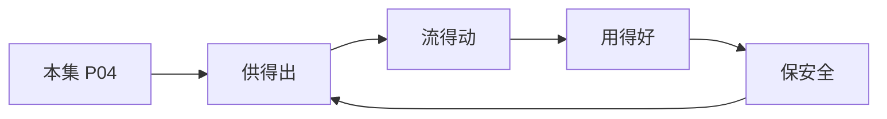

# P04 个人信息匿名化制度与实践

← [[BV1ser5BDESU-总览]] | ← [[P03-数据安全领域法律法规体系解读]] | 下一篇 → [[P05-数据流通安全治理中的制度与技术问题]]

## 视频信息

| 项目 | 内容 |
|------|------|
| 分集 | 个人信息匿名化制度与实践 |
| 模块 | 政策与安全治理 |
| 时长 | 48 分 51 秒 |
| 链接 | [B 站 P4](https://www.bilibili.com/video/BV1ser5BDESU?p=4) |
| 官方文档 | [SecretFlow 文档](https://www.secretflow.org.cn/zh-CN/docs) |
| 内容来源 | 知识点增强（数据要素流通技术体系，非逐字转写） |

## 核心要点

1. **本 P 主题**：个人信息匿名化制度与实践
2. **模块定位**：政策与安全治理
3. **考试/实践侧重**：匿名化与去标识化区别、k-匿名、l-多样性、t-接近性
4. **笔记层级**：教程级（约 2847 字），含速览、图解、场景 Walkthrough、自测题
5. **学习建议**：先通读「3 分钟速览」与「图解」，再读「详细讲解」；动手项见 Checklist

> 以下内容基于数据要素流通与隐私计算技术体系撰写，对应 B 站分 P「个人信息匿名化制度与实践」。**非 UP 逐字转写**；不看视频也可建立框架，看视频可对照「与视频对照表」深化。

## 本节在系列中的位置

**模块**：政策与安全治理 · 系列第 **P04/47** 集。

**建议前置**：[[数据安全领域法律法规体系解读]]——建立本集所需背景。

**建议后续**：[[数据流通安全治理中的制度与技术问题]]——在本集能力之上继续深入。

依赖关系：政策(P01–P06) → 可信空间(P07–P08,P18) → 密态/隐私技术(P09–P24) → SecretFlow 工程(P25–P32) → 基础设施与案例(P33–P47)。

## 3 分钟速览

**个人信息匿名化制度与实践** 是数据要素流通体系中的关键一课。读完本节你应能回答：① 核心概念定义；② 在「供得出—流得动—用得好—保安全」链条中的位置；③ 与隐私计算技术栈的衔接。考试/面试侧重：**匿名化与去标识化区别、k-匿名、l-多样性、t-接近性**。

## 零基础导读

本节「个人信息匿名化制度与实践」属于 **政策与安全治理**。即便未看视频，也应先建立**制度—技术—场景**三层视角：政策类章节回答「为什么允许流」；技术类章节回答「如何安全地算」；案例类章节回答「真实行业怎么落地」。

第一遍阅读请盯住三个问题：本集**解决什么痛点**？**关键参与方**是谁？**交付物或能力边界**是什么？第二遍阅读时，把术语表抄到 Obsidian 双链笔记，与前后分 P 交叉引用。

## 详细讲解

### 1. 概念区分

| 概念 | 定义 | 可逆性 |
|------|------|--------|
| 去标识化 | 移除或替换直接标识符 | 可能通过关联重识别 |
| 匿名化 | 无法识别或关联到特定个人 | 不可逆 |
| 假名化 | 以假名替代，保留映射表 | 可逆（需额外保护） |

《个人信息保护法》第 73 条明确定义匿名化：个人信息经过处理无法识别特定自然人且不能复原。

### 2. 匿名化技术路线

**统计脱敏**
- 抑制（删除）、泛化（年龄→年龄段）、微聚合
- k-匿名：每条准标识符组合至少与 k-1 条相同
- l-多样性：敏感属性在每个等价类中至少 l 个不同值
- t-接近性：敏感值分布接近总体分布

**差分隐私**：对查询结果或发布数据集加噪，满足 ε-差分隐私

**合成数据**：用生成模型产生统计特征相近的伪数据集

### 3. 匿名化合规要求

- 匿名化后的信息**不再属于个人信息**，可更自由流通
- 但需证明匿名化有效：GB/T 42460《信息安全技术 个人信息去标识化效果评估指南》
- 重识别风险评估：攻击者背景知识、辅助数据集、链接攻击

### 4. 实践流程

1. 识别直接标识符（姓名、身份证、手机号）与准标识符（邮编、生日、性别）
2. 选择脱敏策略（按场景平衡效用与风险）
3. 评估 k-匿名等指标
4. 记录处理日志，留存评估报告
5. 定期复评（新数据源可能提高重识别风险）

### 5. 常见误区

- 简单哈希手机号≠匿名化（彩虹表可破解）
- 删除姓名但保留精确 GPS 轨迹仍高风险
- 「群体级」发布也需防差分攻击

### 6. 考试/实践要点

- 能解释 k-匿名、l-多样性、t-接近性
- 区分去标识化与匿名化的法律后果
- 设计一个医疗统计报表场景的脱敏方案

### 7. 技术工具

常用工具：ARX、μ-ARGUS（k-匿名）、OpenDP（差分隐私）、合成数据 GAN。生产环境需评估算法参数与业务效用损失。

### 8. 与联邦学习

匿名化多用于**静态发布**；联邦学习用于**动态联合计算**。同一数据集可能先匿名化统计发布，再联邦训练模型。

### 9. 案例讨论

发布某市疫情统计表，应选 k-匿名还是差分隐私？权衡精度与重识别风险。

### 深化理解（个人信息匿名化制度与实践）

将本节概念放入「数据二十条」四原则框架：它主要支撑哪一条原则？若去掉该能力，哪类数据流通场景会受阻？用一句话向非技术经理解释本节价值。

## 图解

## 类比与直觉

数据要素政策像**交通规则**：先定道路（制度）、再发驾照（授权）、最后装护栏（安全技术）。没有规则，车（数据）跑得越快越危险。

## 例题与场景 Walkthrough

**场景：某市大数据局推进公共数据授权运营**

- **政策依据**：数据二十条、公共数据授权运营规范。
- **供得出**：交通局提供路况统计、医保局提供脱敏就诊汇总——先进目录、分级。
- **流得动**：通过可信数据空间连接器登记数据产品，API 或隐私计算方式交付。
- **用得好**：创业公司将路况+人口统计做成选址 SaaS。
- **保安全**：原始明细不出域；运营机构留存审计日志；使用方签署用途限制。
- **本集切入点**：个人信息匿名化制度与实践 主要约束上述链条中的 **政策与安全治理** 环节。

## 常见误区

1. **「学完本集就会用隐语」**：SecretFlow 生态需多集串联（P19–P32），单集只是拼图一块。
2. **「隐私计算等于不上传数据」**：数据仍以密文、份额或授权方式参与计算，网络与算力开销客观存在。
3. **「TEE 绝对安全」**：TEE 依赖硬件与侧信道防护，需远程证明（P17）与补丁策略。
4. **「区块链解决一切确权」**：链适合存证与交易撮合，大规模计算仍在链下隐私计算引擎。

## 与视频对照表

| 视频段落（约） | 预期演示内容 | 笔记对应章节 |
|-------------|------------|------------|
| 开篇 0%–15% | 本集目标、背景、与前后集关系 | 本节位置、3 分钟速览 |
| 前段 15%–40% | 核心概念定义与架构图 | 零基础导读、详细讲解 |
| 中段 40%–70% | 原理展开、对比、政策/代码示例 | 图解、类比、Walkthrough |
| 后段 70%–90% | 案例、问答、易错点 | 常见误区、Checklist |
| 收尾 90%–100% | 总结、延伸资源 | 延伸阅读、自测题 |

> 本集总时长约 **48分51秒**。无官方外挂字幕时，以分 P 标题「个人信息匿名化制度与实践」与上表主题对齐视频画面。

## 动手实践 Checklist

- [ ] 精读数据二十条原文 1 遍（国务院公报）
- [ ] 制作「三法」义务对照表
- [ ] 写出四原则各 1 个本地案例
- [ ] 与合规同事确认 1 个业务的数据分类分级
- [ ] 完成 5 道自测并口述给同事听

## 延伸阅读

- 国务院「关于构建数据基础制度更好发挥数据要素作用的意见」
- 《数据安全法》《个人信息保护法》
- 国家数据局「数据要素×」行动计划

## 自测题

1. **本集核心考点？**  
   **答**：匿名化与去标识化区别、k-匿名、l-多样性、t-接近性。

2. **本集在四原则中的位置？**  
   **答**：主要对应制度与治理（供得出/保安全）。

3. **与 SecretFlow 的关系？**  
   **答**：提供合规与架构前提，后续技术集在其上落地。

4. **一项落地检查？**  
   **答**：是否有授权、是否最小必要、是否可审计——三者缺一不可。

5. **30 秒口述本集？**  
   **答**：用「输入→处理→输出」各一句话概括（见 Walkthrough）。

## 关键术语

| 术语 | 说明 |
|------|------|
| 数据要素 | 可参与社会化配置、创造价值的数字化资源 |
| 隐私计算 | 数据可用不可见前提下实现协作计算的技术体系 |
| 去标识化 | 移除标识符但可重识别 |
| 匿名化 | 不可复原到特定个人 |

## 与前后分 P 的衔接

- ← **数据安全领域法律法规体系解读**（[[P03-数据安全领域法律法规体系解读]]）
- → **数据流通安全治理中的制度与技术问题**（[[P05-数据流通安全治理中的制度与技术问题]]）

## 来源说明

- ✅ B 站官方元数据（`Tools/BV1ser5BDESU-full.json`）
- ✅ 分 P 首帧封面（`Tools/bili-fetch/fetch-bilibili.js`）
- ✅ **教程级增强**：含图解/Mermaid、场景 Walkthrough、自测题（约 2847 字，2026-06-06）
- ⏳ 逐字转写：B 站 API 无外挂字幕轨；可选 Whisper/BiliNote 后续补充

## 关键截图

![[../../06-资源附件/video-notes-images/BV1ser5BDESU-P04-cover.jpg|B站首帧 P04]]
