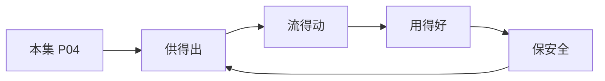

# P04 个人信息匿名化制度与实践

← [[BV1ser5BDESU-总览]] | ← [[P03-数据安全领域法律法规体系解读]] | 下一篇 → [[P05-数据流通安全治理中的制度与技术问题]]

## 视频信息

| 项目 | 内容 |
|------|------|
| 分集 | 个人信息匿名化制度与实践 |
| 模块 | 政策与安全治理 |
| 时长 | 48 分 51 秒 |
| 链接 | [B 站 P4](https://www.bilibili.com/video/BV1ser5BDESU?p=4) |
| 官方文档 | [SecretFlow 文档](https://www.secretflow.org.cn/zh-CN/docs) |
| 内容来源 | 知识点增强（数据要素流通技术体系，非逐字转写） |

## 核心要点

1. **本 P 主题**：个人信息匿名化制度与实践
2. **模块定位**：政策与安全治理
3. **考试/实践侧重**：匿名化与去标识化区别、k-匿名、l-多样性、t-接近性
4. **笔记层级**：教程级（约 2847 字），含速览、图解、场景 Walkthrough、自测题
5. **学习建议**：先通读「3 分钟速览」与「图解」，再读「详细讲解」；动手项见 Checklist

> 以下内容基于数据要素流通与隐私计算技术体系撰写，对应 B 站分 P「个人信息匿名化制度与实践」。**非 UP 逐字转写**；不看视频也可建立框架，看视频可对照「与视频对照表」深化。

## 本节在系列中的位置

**模块**：政策与安全治理 · 系列第 **P04/47** 集。

**建议前置**：[[数据安全领域法律法规体系解读]]——建立本集所需背景。

**建议后续**：[[数据流通安全治理中的制度与技术问题]]——在本集能力之上继续深入。

依赖关系：政策(P01–P06) → 可信空间(P07–P08,P18) → 密态/隐私技术(P09–P24) → SecretFlow 工程(P25–P32) → 基础设施与案例(P33–P47)。

## 3 分钟速览

**个人信息匿名化制度与实践** 是数据要素流通体系中的关键一课。读完本节你应能回答：① 核心概念定义；② 在「供得出—流得动—用得好—保安全」链条中的位置；③ 与隐私计算技术栈的衔接。考试/面试侧重：**匿名化与去标识化区别、k-匿名、l-多样性、t-接近性**。

## 零基础导读

本节「个人信息匿名化制度与实践」属于 **政策与安全治理**。即便未看视频，也应先建立**制度—技术—场景**三层视角：政策类章节回答「为什么允许流」；技术类章节回答「如何安全地算」；案例类章节回答「真实行业怎么落地」。

第一遍阅读请盯住三个问题：本集**解决什么痛点**？**关键参与方**是谁？**交付物或能力边界**是什么？第二遍阅读时，把术语表抄到 Obsidian 双链笔记，与前后分 P 交叉引用。

## 详细讲解

### 1. 概念区分

| 概念 | 定义 | 可逆性 |
|------|------|--------|
| 去标识化 | 移除或替换直接标识符 | 可能通过关联重识别 |
| 匿名化 | 无法识别或关联到特定个人 | 不可逆 |
| 假名化 | 以假名替代，保留映射表 | 可逆（需额外保护） |

《个人信息保护法》第 73 条明确定义匿名化：个人信息经过处理无法识别特定自然人且不能复原。

### 2. 匿名化技术路线

**统计脱敏**
- 抑制（删除）、泛化（年龄→年龄段）、微聚合
- k-匿名：每条准标识符组合至少与 k-1 条相同
- l-多样性：敏感属性在每个等价类中至少 l 个不同值
- t-接近性：敏感值分布接近总体分布

**差分隐私**：对查询结果或发布数据集加噪，满足 ε-差分隐私

**合成数据**：用生成模型产生统计特征相近的伪数据集

### 3. 匿名化合规要求

- 匿名化后的信息**不再属于个人信息**，可更自由流通
- 但需证明匿名化有效：GB/T 42460《信息安全技术 个人信息去标识化效果评估指南》
- 重识别风险评估：攻击者背景知识、辅助数据集、链接攻击

### 4. 实践流程

1. 识别直接标识符（姓名、身份证、手机号）与准标识符（邮编、生日、性别）
2. 选择脱敏策略（按场景平衡效用与风险）
3. 评估 k-匿名等指标
4. 记录处理日志，留存评估报告
5. 定期复评（新数据源可能提高重识别风险）

### 5. 常见误区

- 简单哈希手机号≠匿名化（彩虹表可破解）
- 删除姓名但保留精确 GPS 轨迹仍高风险
- 「群体级」发布也需防差分攻击

### 6. 考试/实践要点

- 能解释 k-匿名、l-多样性、t-接近性
- 区分去标识化与匿名化的法律后果
- 设计一个医疗统计报表场景的脱敏方案

### 7. 技术工具

常用工具：ARX、μ-ARGUS（k-匿名）、OpenDP（差分隐私）、合成数据 GAN。生产环境需评估算法参数与业务效用损失。

### 8. 与联邦学习

匿名化多用于**静态发布**；联邦学习用于**动态联合计算**。同一数据集可能先匿名化统计发布，再联邦训练模型。

### 9. 案例讨论

发布某市疫情统计表，应选 k-匿名还是差分隐私？权衡精度与重识别风险。

### 深化理解（个人信息匿名化制度与实践）

将本节概念放入「数据二十条」四原则框架：它主要支撑哪一条原则？若去掉该能力，哪类数据流通场景会受阻？用一句话向非技术经理解释本节价值。

## 图解

## 类比与直觉

数据要素政策像**交通规则**：先定道路（制度）、再发驾照（授权）、最后装护栏（安全技术）。没有规则，车（数据）跑得越快越危险。

## 例题与场景 Walkthrough

**场景：某市大数据局推进公共数据授权运营**

- **政策依据**：数据二十条、公共数据授权运营规范。
- **供得出**：交通局提供路况统计、医保局提供脱敏就诊汇总——先进目录、分级。
- **流得动**：通过可信数据空间连接器登记数据产品，API 或隐私计算方式交付。
- **用得好**：创业公司将路况+人口统计做成选址 SaaS。
- **保安全**：原始明细不出域；运营机构留存审计日志；使用方签署用途限制。
- **本集切入点**：个人信息匿名化制度与实践 主要约束上述链条中的 **政策与安全治理** 环节。

## 常见误区

1. **「学完本集就会用隐语」**：SecretFlow 生态需多集串联（P19–P32），单集只是拼图一块。
2. **「隐私计算等于不上传数据」**：数据仍以密文、份额或授权方式参与计算，网络与算力开销客观存在。
3. **「TEE 绝对安全」**：TEE 依赖硬件与侧信道防护，需远程证明（P17）与补丁策略。
4. **「区块链解决一切确权」**：链适合存证与交易撮合，大规模计算仍在链下隐私计算引擎。

## 与视频对照表

| 视频段落（约） | 预期演示内容 | 笔记对应章节 |
|-------------|------------|------------|
| 开篇 0%–15% | 本集目标、背景、与前后集关系 | 本节位置、3 分钟速览 |
| 前段 15%–40% | 核心概念定义与架构图 | 零基础导读、详细讲解 |
| 中段 40%–70% | 原理展开、对比、政策/代码示例 | 图解、类比、Walkthrough |
| 后段 70%–90% | 案例、问答、易错点 | 常见误区、Checklist |
| 收尾 90%–100% | 总结、延伸资源 | 延伸阅读、自测题 |

> 本集总时长约 **48分51秒**。无官方外挂字幕时，以分 P 标题「个人信息匿名化制度与实践」与上表主题对齐视频画面。

## 动手实践 Checklist

- [ ] 精读数据二十条原文 1 遍（国务院公报）
- [ ] 制作「三法」义务对照表
- [ ] 写出四原则各 1 个本地案例
- [ ] 与合规同事确认 1 个业务的数据分类分级
- [ ] 完成 5 道自测并口述给同事听

## 延伸阅读

- 国务院「关于构建数据基础制度更好发挥数据要素作用的意见」
- 《数据安全法》《个人信息保护法》
- 国家数据局「数据要素×」行动计划

## 自测题

1. **本集核心考点？**  
   **答**：匿名化与去标识化区别、k-匿名、l-多样性、t-接近性。

2. **本集在四原则中的位置？**  
   **答**：主要对应制度与治理（供得出/保安全）。

3. **与 SecretFlow 的关系？**  
   **答**：提供合规与架构前提，后续技术集在其上落地。

4. **一项落地检查？**  
   **答**：是否有授权、是否最小必要、是否可审计——三者缺一不可。

5. **30 秒口述本集？**  
   **答**：用「输入→处理→输出」各一句话概括（见 Walkthrough）。

## 关键术语

| 术语 | 说明 |
|------|------|
| 数据要素 | 可参与社会化配置、创造价值的数字化资源 |
| 隐私计算 | 数据可用不可见前提下实现协作计算的技术体系 |
| 去标识化 | 移除标识符但可重识别 |
| 匿名化 | 不可复原到特定个人 |

## 与前后分 P 的衔接

- ← **数据安全领域法律法规体系解读**（[[P03-数据安全领域法律法规体系解读]]）
- → **数据流通安全治理中的制度与技术问题**（[[P05-数据流通安全治理中的制度与技术问题]]）

## 逐字转写
> 引擎: whisper | 状态: 已转写 | 格式: 段落化

### [00:00 - 01:13] 大家好,我是对外经济贸易大学素
大家好,我是对外经济贸易大学素质经济与法律创新中心的主任，对外经济贸易大学法学院教授许可，非常高兴有机会在这里和大家分享，个人信息匿名化制度与实践，这一个重大又极迫的，法律问题，那么今天啊，我跟大家从四个方面，讨论，个人信息匿名化的制度，那么首先呢，跟大家讲一讲，个人信息匿名化的，限制的困，个人信息匿名化制度由来已久，早在，网络安全法制定过程之中，就把个人信息匿名化制度欠入在，42条，那么该条规定啊，经过处理，无法识别特定个人，且不能复原的，除外，那么42条这条在法律上被称之为淡书，他的目的呀，就是，为，个人信息的，数字化的利用，提供一个途径。

### [01:14 - 02:24] 那么我们看42条的
那么我们看42条的，前半句话，讲的是，不得泄漏篡改，毁损，其个人信息，未经同意，不得向他人提供个人信息，这些都是从保护的角度，对个人信息做了规定，那么第42条的淡书，又被称之为，大数据条款，其目的，就是为了缓和，个人信息保护的，颜柯，为了数字产业的发展，提供一个可行的途径，那么同样内容，出现在民法点的，1038条的淡书之中，到了个人信息保护法，制定的过程中啊，曾经有过争论，是否，把匿名化的个人信息，写入个人信息保护法，那么这里面在学界上和食物界上都有很多的观点，其中有观点认为，个人信息匿名化是一个非常，难以实现的目标，甚至有学者指出。

### [02:25 - 03:22] 个人信息匿名化是一个破碎的承诺
个人信息匿名化是一个破碎的承诺，因此，有不少学者，反对，在个人信息保护法的制定过程中，把，个人信息的匿名化，放在，条文之中，以避免，这一条款的，不当的使用，但是，全国的那法公伟，仍然坚持，个人信息保护，与个人信息利用的，基本原则，将，个人信息匿名化制度明确的，规定在了第四条，和第，第四条第四项里面，其立法目标呀，是遭然弱街的，那就是，通过匿名化制度，促进，个人信息，以及，负载个人信息的，数据，得到有效的利用。

### [03:25 - 04:23] 尽管呀
尽管呀，我们看到从，网络安全法，到个人信息保护法，都是图为个人信息，匿名化制度，建立一个制度上的框架，但遗憾的是呢，在实践中，这么一个被称之为大数据规则大数据条款的，制度啊，并没有，发挥作用，而是，明春时王，成为春儿不用的，僵尸条款，那么我们看看，这个功耗上的，数据，合规人的，治安时刻，那么到底什么叫做个人信息匿名化，能不能，不用遵照，个人信息保护法的，单独同意的要求，把它给出去，成为啊，大家关注的热点问题，甚至被称之为，治安时刻。

### [04:27 - 05:08] 那么
那么，为了解决这个问题，我们的，行业专家，发挥了，积极的作用，那么通过制定一些团体标准，包括呀，互联网广告，匿名化实止难，以及呀，刚刚成立的，国家，数标委，去建立一套，数据流通的，匿名化实施指南，以及数据流通的，匿名化，效果评估方法的标准，都在为个人信息匿名化，建立一个可行的，操作指引。

### [05:10 - 06:36] 但依然很遗憾
但依然很遗憾，这些团体标准，有的呢，尚未正式的发布，有的即使发布了，也没有成为，监管机构，和我们的，法院，广泛使用的，操作指南，那么由此啊，我们，可以进一步的去探讨，为什么，有了，我们的网络安全法，有了个人信息保护法，但却没有，真正的解决，个人信息匿名化的困境呢，那么我这里面呀，给大家，列出，几个理由，那么第一个理由，那就是，个人信息匿名化的边界，难以接近，匿名化信息和个人信息的核心差异啊，在于可实别性，但可实别永远不是一个非黑记牌，可实别永远是一个连续的光谱，他不只有黑白二色，而是在从黑，到白的过程中有大量的灰色区域，那么到底，这些，灰色区域的，个人信息。

### [06:37 - 06:40] 他俗不属于匿名化信息
他俗不属于匿名化信息，存在的广泛真理。

### [06:42 - 07:25] 那么第二个
那么第二个，实践中的困难是，个人信息保护法，对于匿名化的条款呀，非常之简单，他实际上是两个标准，一个标准是，无法识别，第二个标准是，不可复原，但无法识别和不款复原的，判断的主题，判断的方式，判断的手段，都语言不详，缺乏具体的解释，和操作职业，这也是法律，作为一个抽象规则，说不可避免的出现的，实施的困难，第三个。

### [07:27 - 07:30] 欠缺控制剩余风险的制度
欠缺控制剩余风险的制度。

### [07:32 - 08:47] 在个人信息保护法之间过程之中
在个人信息保护法之间过程之中，已经有大量的业界的专家反映，个人信息匿名化制度，在理论上，是存在的，在这现实中，几乎不可能，因为永远有着剩余风险的存在，大家经常举的例子，实际上就是谷歌的，公开了，匿名化个人信息的例子，在那个例子之中，谷歌，把已经匿名化的信息公之于众，但是很快的，这些信息都被重新的识别，到特定的自然，那么由此，学界逐渐形成公司，个人信息的匿名化，不可能是绝对的，也不可能，没有任何的，残余的风险，但是我的个人信息保护法，并没有针对，个人信息匿名化之后的残余风险，剩余风险，做出规定，那么由此引发了社会公众，和监管部门的担忧，那么如何化解。

### [08:48 - 09:53] 个人信息匿名化之后的不可控的剩
个人信息匿名化之后的不可控的剩余风险，那么成为啊，我们个人信息匿名化实施的一个，关键性的问题，第四个，个人信息匿名化在技术上，和去标识化呀，是相互混淆的，我估计的个人信息保护法，非常清楚的区分了匿名化，和去标识化两种制度，匿名化之后的个人信息，不属于个人信息，无需遵守，个人信息保护法，对于个人信息的一系列的监管要求，而去标识化的个人信息，仍然属于个人信息，个人信息保护法，并没有针对去标识化的个人信息，作出单独的规定，而是将去标识化，界定为，个人信息处理者，降低，个人信息识别，风险的，一种风险管控措施。

### [09:55 - 10:30] 这两种在法律上
这两种在法律上，竟然分明的，二分法，在实践中，却面临着一个尴尬的现实，那就是，大量的，个人信息匿名化技术，和去标识化的技术，往往是一样的，那么，当，其，采取去标识化的方法，进行匿名化的时候，那么由此而来的问题是，到底，它是一个，去标识化，还是一个，匿名化呢。

### [10:35 - 11:33] 正是因为上上种种的原因啊
正是因为上上种种的原因啊，个人信息匿名化条款，尽管，在法律上，早已存在，但是呢，存而不用，尤其是，当代，随着，人工智能大数据的发展，数据的交易流通，数据要输市场建构，数据的反复利用，迫在没几，但是因为，大量流通的，数据，是承载着，个人信息的更数据，如果没有办法破解，个人信息匿名化制度，就不太可能，形成一个，高效流通的，数据要输市场，那么，在这个背景下呀，我们讲，个人信息匿名化，一定要，在实践中得到解决。

### [11:36 - 11:54] 那么个人信息匿名化
那么个人信息匿名化，其实呀，它并不只是中国一个国家，所面临的问题，在全球范围，个人信息匿名化制度，始终，处于，各国家个人信息保护法，立法的，重点和难点问题。

### [11:56 - 12:26] 不同的国家
不同的国家，处于不同的监管考量，根据自己的，立法的，原理，和目标，其实采取了，不尽相同的，个人信息匿名化的实践，那么我们大致可以从两个维度，去观察，全球的经验，第一个维度是，由谁，去判断，个人信息，是否，进行的匿名化。

### [12:28 - 13:47] 那么根据足体的标准
那么根据足体的标准，可以分成，这四种不同的方案，第一个方案，是欧盟方案，它是最为严格的方案，他要求，如果世界上任何一个人，不能从，信息中识别出特定个人，则为匿名信息，那么这句话反过来理解就是，世界上如果有一个人能够识别，特定个人，他就不是，匿名化信息，这是最为严格的，匿名标准，那么第二个，方案是，英国和新加坡，所创设的，有动机入侵者的标准，那么这里面的有动机入侵者，指的并不是世界上任何一个人，而是，那些具备了，合理能力，能够适用，适当的资源，进行调查的人，那里面这里面的人，一般来说，我们讲的就是一个，社会公众，首先他不是一个专业人士，不要求是个专家，其次呀，他不要求。

### [13:48 - 14:12] 这个人
这个人，具备先前的知识，比如说，我和，毛甲，是朋友，我知道他有一个特殊的文生，在网上流传了一个照片，我看到了这个地方有特殊的文生，那么我由此判断，照片，里面的人啊，就是毛甲。

### [14:14 - 14:41] 但问题是
但问题是，一般公众，是不可能了解，毛甲，具有这一个，身体特征的，尽管我可以去识别到这个信息，但是呢，因为我动用了之前的，知识和信息啊，所以，我不符合这里面的，有动机入侵者的要求。

### [14:44 - 16:16] 那么产生的国家主要是英国和新加
那么产生的国家主要是英国和新加坡，第三个方案，指的是提供方的标准，这里面特别，出现在数据流通的场景下，当数据从，数据的提供者，流向，数据的接收方的时候，如果，对于数据的提供方而言，能够识别出特定信息，那么他就是一个，非匿名化信息，如果不能识别呢，他就是一个匿名化信息，那么与日本相对应的是美国的，接收方的标准，那么美国的接收方的标准要求，如果信息在接收方，和提供方之间进行了流动，只有，数据的接收方，不能识别特定个人的，那么他就是一种匿名化信息，我可以举一个简单的例子，假设，我把我的学校的，公盘，交给了，我的朋友，这个不公盘上没有姓名，没有照片，他只有学校的名称。

### [16:17 - 17:39] 以及我的
以及我的，单位的号码，假设我单位号码是001，那么对于接收方来说，他，不太可能，从，卡片上的数字，识别出特定个人，尽管我是知道特定的个人是谁了，那么在这个情况下，我们认为，对于接收方来说，他获得的就是一个匿名信息，这么一种接收方标准，是对于产业，和数据流通来说，最友好的标准，那么这个典型的，国家，就是美国，而且我们现在非常，新写的看到，在欧盟的最新的案例中，使用了，这个接收方标准，从而改变了，欧盟GDPR，所强调的，任何人的标准，我们来看一看这个案子，这个最新的案例，就是欧盟数据保护监督机构，EGPS，树，欧洲单一清算委员会，SRB的案子，这个案子非常简单，SRB。

### [17:40 - 17:58] 把关于个人的评论
把关于个人的评论，传输给外部评估机构得勤，那么对于这么一种，数据的传输，是不是违反了，个人信息保护法中的，个人的同意，以及告知的，这些内容呢。

### [18:01 - 18:06] 欧盟的
欧盟的，EGPS，认为，警管。

### [18:08 - 18:23] SRB
SRB，采取了一些假名化的措施，这些传输的，数据，仍然属于，个人数据，所以判定了，SRB，违法。

### [18:26 - 19:49] 那么2023年4月26号
那么2023年4月26号，普通法院，并没有支持，欧盟数据保护监督机构的，判断，而是认为，传输给德琴的数据，属于，匿名化的，个人数据，那么对于这么一个判决，EGPS不符，上述到欧盟法院，要求重新做出裁决，那么经过了，两年的审理，最近，欧盟法院做出了终审的判决，那么这个判决之所以重要，就是因为他处理了，匿名化的标准问题，那么首先，法院，重申了，个人数据包括了主观的意见评价和评论，也就是说他不只是事实的呈现，也包括了主观的评估，主观的意见，所以在这个案件之中，SRB，向第三方，德琴，传输的个人数据，属于，个人数据的概念。

### [19:52 - 20:37] 那么这里面
那么这里面，第二个问题就是，假名化不等于匿名，对于，SRB所主张的，采取了假名化的措施，所以他就是匿名化的一种主张，法院并没有认可，那么法院讲的是，在风险识别上，在判断标准上，要回到可识别性，是否构成个人数据，不能只看采取了拿写技术或措施，而是，要看，根本上他是否对于主体来说是可识别的。

### [20:40 - 21:54] 那么以下是法院这一次最大的创新
那么以下是法院这一次最大的创新点，它的创新点是区分了两种不同的视角，首先是数据控制者，也就是我们国家所讨论的，个人信息处理者的视角，假名后的评论依然属于个人数据，因为控制者仍然保留着附加信息或密钥，可以与特定的个人重新管理，但是，对于接受方来说，如果计数个措施有效阻断了合理条件下的再识别，那么，对于接受方而言，这些数据就不构成了个人数据，换言之，它就是一种匿名化之后的数据，那么这么一个，判决的结果，可以说，在根本上改变了我们讲的，匿名化数据和假名化数据的认定方法，终结了绝对化的匿名，而是采取了一个动态的，强调场景的匿名。

### [21:57 - 22:14] 好
好，那么刚才谈到的是识别的主体，所以我们可以看到，从全球的范围之内，欧盟有一个重大的转向，从我们讲的任何一个人，转向了数据的接受方。

### [22:16 - 22:42] 然后我们再来看行为标准
然后我们再来看行为标准，行为标准所解决的问题是，到底多大程度上，识别和多大程度上，复原，那么，刚才我们讲过，在技术大开的眼中，几乎任何经过匿名化的信息只要采取。

### [22:44 - 23:57] 所有的穷尽所有的可能
所有的穷尽所有的可能，就有，那么几率，重新识别到特定个人，那么对于这个问题，不同国家采取了不同的标准，有的标准是一般人标准，有的标准是高度可行的标准，有的标准是合理的可能的标准，那么从法律的角度来说，有一句法宴，叫做法律不强人所难，法律永远采取的是一般人的标准，或者说，合理可能的标准，而不太可能要穷尽所有的方式和方法，举个例子，我们说大海劳增，在理论上是可行的，只要我们不惜人力物力，不惜成本，就能在大海中找到，我们丢在大海里面的那根针，但是在法律上，不会认为大海劳增是一种合理的可能，因为他的成本远远超过了他的收益，所以法律上讲的可能性。

### [23:58 - 24:00] 一般都是合理的可能的
一般都是合理的可能的。

### [24:04 - 24:11] 那么以上
那么以上，我跟大家简单的回顾了全球，对于个人心情匿名化的。

### [24:14 - 24:22] 基本的一些进展
基本的一些进展，那么回到第三部分，个人心情匿名化，在我国该怎么去完善，怎么去实施。

### [24:27 - 25:41] 在第一部分
在第一部分，我跟大家讲了个人心情匿名化，有着这样那样的困境，那么究其实质，个人心情匿名化实际上，他有着三重的担心，这三重担心导致了各方，对于个人心情匿名化，他尽管一致的认可，但是在实践中落实下来，非常困难，第一个担心，是个人信息处理者的担心，他既担心个人心情匿名化措施，无法达到法律要求，我做了白做，也担心了，如果我遵守了，一些团体标准，行业标准，那又使得匿名的，信息，太多上市的利用价值，第二个担心是监管结构的担心，监管结构担心匿名化成为，个人信息处理者规避监管的工具，我国的监管部门，将个人信息保护，谋定在个人信息，这么一种法律的概念之上，如果通过匿名化。

### [25:42 - 26:02] 把信息
把信息，变为非个人信息，那么所有的监管的手段，都上市了抓手，所以监管结构，特别担心，企业，滥用，匿名化措施，导致监管目的落空。

### [26:04 - 26:36] 那用户其实也担心
那用户其实也担心，那就是说呀到底的匿名化是不是真的，你所谓的匿名化有没有，实现保护我个人的目标，那么面对这三重的担心呀，我们主张采取一种，从结果匿名，到过程匿名的方案，通过一系列的，程序性的设定，去解决这三重担心。

### [26:39 - 27:20] 那么第一重担心
那么第一重担心，是我们讲的个人信息处理者，往往是企业的担心，企业担心啊，我做了很多个人信息匿名的工作，但是呢，不认可，那么我做的工作，图征成本而没有带来好处，那么怎么解决，我们提出的方案是，建议一套事前的推定匿名的制度，也就是说，只要个人信息处理者，证明了采取的合格的匿名，化的技术设计，就应该推定匿名化有效。

### [27:23 - 27:32] 那么这么一种推定有效
那么这么一种推定有效，实际上就是让数据，和个人信息先跑起来，不要一开始呀，就为手为尾，不敢流动。

### [27:35 - 27:41] 解决了
解决了，大家不敢供给数据，不敢接收数据的担心。

### [27:43 - 29:04] 但是
但是，推定匿名，仍然不是最终匿名，推定匿名，还要看，他有没有达到法律上的标准，这就是刚才我们讲的，欧盟法院，他也指出，采取的假名化或匿名化的措施，不足以证明，他就是匿名化和假名化的数据，所以这里面，要有一个事后的判定匿名，那么这麽能事后的判定匿名，解决的谁的担心呢，他解决的是，监管机构的担心，监管机构，把握着，最后能否认定匿名的这么一个，大门，他如果觉得，你尽管采取了，事前的匿名化技术，但并不能最终的在法律上证明，他就是匿名化的，你仍然要承担相应的责任，但是我们也要指出，事后的判定匿名，并不是随机的，任意的发动的，他需要有法定的程序，从而有效的平衡了市场上。

### [29:05 - 30:17] 积极的推动匿名化技术的发展
积极的推动匿名化技术的发展，和监管机构去控制，匿名化标准的，这么两个难题，最后，面对着广泛存在的剩余的风险，我们需要一个系统的合规的匿名，匿名化并不是万事大吉，匿名化之后的个人信息，并不是一点风险，没有的个人信息，那么对于这些难以穷尽的风险，我们需要个人信息处理着，全面的履行合规义务，尽可能降低剩余风险的残留，最大程度的保护个人的权益，那么这就是我们称之为同心员结构，同心员结构分别对应着不同的，主体的担心，事先推定匿名，对应的是个人信息处理者，让个人信息处理者，勇于尝试匿名化技术，推动数据流动，事后判定匿名，对应者的是监管机构的担心。

### [30:19 - 30:36] 防范
防范，企业，滥用，匿名化技术造成监管的空白，最后一个是解决的是个人的担心，最大程度的保护个人，在匿名化过程之中的权益，不会受到侵害。

### [30:40 - 31:10] 那么
那么，我们简单的跟大家讲一讲，同心员的三个部分，第一个，事前的推定匿名，那么可以采取一些标准化的设计，通过一些差分隐私的技术，那么至于这里面讨论到的技术路径，仍然有赖于后续，通过我们的行业标准，最佳实践与落实。

### [31:13 - 31:35] 那么这么一种推定的效力
那么这么一种推定的效力，它可以使得处理者，在证明自己采取了国家标准，或者说最佳实践之后，无需承担后续的举动责任，为市场主体划定横线，促进数级要求市场的发展。

### [31:40 - 32:04] 同心员的第二部分
同心员的第二部分，是事后的判定匿名，刚才我们讲，事后的判定匿名，不能是一个随意的发动的过程，它的触发条件，往往发生在，合理怀疑，事前推定的匿名，失效的场景。

### [32:07 - 32:38] 而且这种失效的场景
而且这种失效的场景，可能已经造成了不良影响，包括引发了一些，个人或者是，个人信息处理者的一些关注，这种情况下，无论是监管机构，还是法院，都应当基于法律，而不是基于刚才我们所说的，行业标准，最佳实践作出判断。

### [32:40 - 32:54] 那么这里面
那么这里面，最重要的问题是，如何在法律上，将个人信息匿名化的两个标准，无法识别和不能复原，进一步的明确。

### [32:57 - 33:15] 那么
那么，从数据流通的角度，我们认为应当，顺应全球个人信息，匿名化制度的发展趋势，站在，接收方的角度。

### [33:17 - 33:18] 去判断
去判断。

### [33:21 - 34:21] 个人信息
个人信息，是不是，能够复原，是不是，无法识别，那么在识别方式上，应当是合理的进行，识别，而不是采取所有可能的手段，那么这么一种，判定的标准，于我们现在最新的标准，个人信息匿名化，处理指南，及评价办法，是一致的，那么根据这一个办法，我们可以看到，这里面的无法识别，就指的是，数据接收方在限定场景和设定风险，环境之下，数据不可识别特定自然，所以我们可以看到，它核心的一个点就是，数据接收方作为判断标准。

### [34:24 - 35:27] 那么对于不能复原
那么对于不能复原，它也强调了，是一个合理的技术和资源，而且，这里面的复原和识别，它们的对象是不同的，识别指的是特定自然人，而复原指的是特定的，个人的信息，我们举一个最简单的例子，假设，我们把，某人的，身份证号码，做了一个研码的处理，这是非常简单的一个假名化技术，那么对于，接收到这一个经过研码之后的，身份证号码的人来说，他如果接合其他的信息，比如说，第二号码，把这个人重新找到了，那么他就不符合，无法识别的要求。

### [35:29 - 36:09] 但是
但是，他尽管把这个人重新找到，他仍然不能，去把这个身份证号码，不足，他知道这个人叫张三，但他仍然不知道这个人的身份证号码，空缺的这几位到底什么，那么我们称之为，不能复原，那么匿名化要求两个条件，同时的具备才能构成，匿名化，那么有一个不具备，就不能实现匿名化的结果，那么刚才们举个例子，那显然，他就是一种我们讲的。

### [36:12 - 36:23] 非匿名化的结果
非匿名化的结果，或者反过来，他没有办法识别到张三这个人，但是他把他身份证号码进行了复原，那么我们也认为，他不构成匿名化。

### [36:26 - 37:26] 最后一个
最后一个，是系统的，格归匿名，系统合约匿名的，重心，是保护个人，所以这里面首当其冲的是，告诉个人，匿名化的，目击方式，也就是说，在我们的影视政策，个人信息处理规范里面，应当将，是否进行匿名，告诉个人，我们不能因为匿名化制度，将个人信息变成了非个人信息，就对个人，采取一个，不告知的方法，那么这个实际上就是，刚才我们看到的欧盟的，案例，他尽管他认可了，向第三方传输的，并不是个人信息，他仍然要求。

### [37:29 - 38:46] 数据的控制者
数据的控制者，向个人，与行告知义务，那么这里面我们要求，我们的，个人信息处理者，在进行匿名化的之前，要告诉个人，那么除了告诉，个人这么一个告知义务以外，还有两个重要的，程序性的要求，第一个，匿名化的评价，第二个是，个人信息保护的，评估，那么，匿名化评价，个人信息保护评估，这两个其实是不同的，匿名化评价，评价的是匿名化的效果，个人信息保护，营养评估，评估的是对个人，影响的程度，那么，匿名化的评价方法，主要评价的维度，就是刚才我们所谈到的，无法识别，不能复原，以及技术上的，对抗性的测试，它是由组织内部的合规团队，或者是第三方，独立执行的，它的目标，去判断，我们刚才所谈到的。

### [38:47 - 38:56] 这么一种
这么一种，事前的，系统性的匿名，能不能符合要求，如果符合要求，判断的通过。

### [39:00 - 39:25] 在系统合规匿名的
在系统合规匿名的，最后一部分，是关于禁止性的义务，特别是禁止再识别的义务，要采取有效措施，防止数据被重新识别，同时，禁止可能以个人造成重大影响的方式，去处理信息，保护个人信息权益。

### [39:29 - 39:52] 那么以上
那么以上，就是我们来讨论到的，三重匿名的方法，分别对应者，个人信息处理者，监管机构和个人的，对于匿名化的担心，那么最后，我跟大家简单的，分享一下，两个个人信息匿名化的，典型案例。

### [39:54 - 40:38] 第一个案例
第一个案例，是大家都非常熟悉的，广告的案例，传统的户外广告以静态，方式为主，广告主难以实现精准的投放，那么为了解决这个问题，我们需要个性化广告，那么个性化广告就要求我们采取一个，数据融合的方法，对于这么一种数据融合，如何去解决，其中所隐含的个人信息保护的难题，那么通过我们讲的，匿名化制度，就是一个重要的，技术解决方案。

### [40:40 - 40:41] 那么我们可以看到
那么我们可以看到。

### [40:43 - 41:15] 在
在，多方共同参与的，数据流通的场景中，包含了，广告主，户外的媒体方，和其他的数据的合作方，那么它进行流通的数据类型，包括了广告位的信息，广告主的订单的数据，互联网行为数据，位置支持库的数据，那么这里面，有很多属于个人的数据。

### [41:18 - 42:49] 那如何解决这个问题呢
那如何解决这个问题呢，还是回到刚才我们讲的，三个，同心源，首先就是采取一个合格的匿名化技术，那么这个合格的匿名化技术，主要就是，可信的数据空间，密文计算与隔离，以及统计化结果的输出，那么在这个三个要素里面，要注意，在一头一尾，化解了各方的担心，第一个，它把，数据进行了同态加密，采取了，差分隐私多方安全计算的方法，降低了个人信息，被重新识别的可能性，不仅如此，它里面加上一个非常重要的，可信的数据空间，那么在这个空间里面，由于没有更高维度的数据的接入，使得呀，将个人重新再识别，几乎不可能，最后，在输出的环节，呈现的是一个统计指标，不涉及到个人信息，那么有此我们发现。

### [42:50 - 43:38] 这么一种匿名化技术
这么一种匿名化技术，解决了我们所担心的，个人信息，复原和再识别的难题，于是同时为了进一步的去降低剩余风险，相关的，参与主体采取了访问控制与权限管理，审计和溯源，合同约束和用途限定的种种的方法，降低了剩余风险，那么由此呢，我们谈到的三重，不从，机制，技术机制，法律机制，和后续的合规管理机制，都得到满足。

### [43:42 - 43:58] 那么
那么，事前的匿名事后的可验证剩余风险可控，使得，个人信息保护和商业利益呀，得到了，同等的重视，得到了平衡。

### [44:00 - 44:52] 那么第二个
那么第二个，典型案例，是当前大家讨论也非常多的医疗领域的，匿名化的案子，那么我们都知道，最值钱的，个人信息，其实啊，就是我们的，医疗信息，但也正是因为如此，医疗信息，在流通中也面临着重大的，法律上的困难，如何更好地保护，个人的隐私，如何更好地保护，个人的，对于敏感，信息的，担心，那么由此成为我们讲的，医疗领域个人信息个人数据流动的大难题。

### [44:55 - 44:58] 那么在这个
那么在这个，场景下我们可以看到。

### [45:01 - 45:10] 主要采取的方式
主要采取的方式，就是，开密名的模型和专家组的，审批机制。

### [45:13 - 45:50] 这是一个
这是一个，我们看到的关于，胸部CQ的数据的立民化处理，那么在这里面有着，两个数据的主体，一个是医院，一个呢，就是我们所说的，医疗器械的赏伤，这里面存在的潜在的风险，当然是对于个人信息，尤其是个人敏感信息，带来的风险，那么为了解决这个问题，采取了开密名的方法，这个开等于5。

### [45:52 - 46:10] 采取了去标识的方法
采取了去标识的方法，那么，在，技术的方案实施之后，这里面最重要的方法，就是我们讲的，一个。

### [46:12 - 46:24] 医民化的效果的评价
医民化的效果的评价，通过专家组，去评价，医民效果，来去解决，可能的风险问题。

### [46:27 - 46:51] 那么
那么，在，合规保障，管理措施，和，技术方案三轨，旗下的，作用下呢，这个案例，实现了，可用不可实，不可复原的目标，提供了可复制的，医疗影响数据，医民化的流程，为行业的隐私保护，提供了示范。

### [46:55 - 48:18] 那么
那么，今天啊，我们花了，比较短的时间，和大家交流了，个人信息医民化制度的来龙去脉，分析了，全球范围之内，围绕着个人信息医民化的一些经验，和最新进展，提出了，个人信息医民化的，三个，前后相继的，制度的实践，最后啊，跟大家分享了两个案例，我想呢，个人信息医民化制度，关乎着，中国，数据要素市场发展的大局，是实现个人信息价值，和保护个人信息权益，最重要的，苏宁，那么对于这个问题呢，远远，还没有，彻底解决的时候，我们期待着，各位同仁，能够从技术，法律，产业，三个维度，探索，个人信息医民化制度的，破局之路，那么这里面，我给大家提供了我之前，完成了，两个工作，一篇是学书诺文，一篇是我们和。

### [48:18 - 48:42] 蚂蚁研究院
蚂蚁研究院，一起发布的个人信息医民化制度的卖币书，也期待大家能够多多的批评指证，好，以上呢，就是我今天和大家分享的主要内容，也期待着后续能有更多的机会和大家交流，学习，今天的分享到此为止，谢谢大家。

## 来源说明

- ✅ B 站官方元数据（`Tools/BV1ser5BDESU-full.json`）
- ✅ 分 P 首帧封面（`Tools/bili-fetch/fetch-bilibili.js`）
- ✅ **教程级增强**：含图解/Mermaid、场景 Walkthrough、自测题（约 2847 字，2026-06-06）
- ⏳ 逐字转写：B 站 API 无外挂字幕轨；可选 Whisper/BiliNote 后续补充

## 关键截图

![[../../06-资源附件/video-notes-images/BV1ser5BDESU-P04-cover.jpg|B站首帧 P04]]
