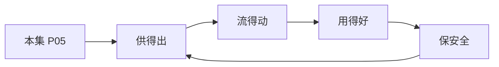

# P05 数据流通安全治理中的制度与技术问题

← [[BV1ser5BDESU-总览]] | ← [[P04-个人信息匿名化制度与实践]] | 下一篇 → [[P06-数据要素安全分级-隐私计算产品安全能力分级要求]]

## 视频信息

| 项目 | 内容 |
|------|------|
| 分集 | 数据流通安全治理中的制度与技术问题 |
| 模块 | 政策与安全治理 |
| 时长 | 44 分 04 秒 |
| 链接 | [B 站 P5](https://www.bilibili.com/video/BV1ser5BDESU?p=5) |
| 官方文档 | [SecretFlow 文档](https://www.secretflow.org.cn/zh-CN/docs) |
| 内容来源 | 知识点增强（数据要素流通技术体系，非逐字转写） |

## 核心要点

1. **本 P 主题**：数据流通安全治理中的制度与技术问题
2. **模块定位**：政策与安全治理
3. **考试/实践侧重**：流通前评估、分类分级、技术+制度协同治理
4. **笔记层级**：教程级（约 2908 字），含速览、图解、场景 Walkthrough、自测题
5. **学习建议**：先通读「3 分钟速览」与「图解」，再读「详细讲解」；动手项见 Checklist

> 以下内容基于数据要素流通与隐私计算技术体系撰写，对应 B 站分 P「数据流通安全治理中的制度与技术问题」。**非 UP 逐字转写**；不看视频也可建立框架，看视频可对照「与视频对照表」深化。

## 本节在系列中的位置

**模块**：政策与安全治理 · 系列第 **P05/47** 集。

**建议前置**：[[个人信息匿名化制度与实践]]——建立本集所需背景。

**建议后续**：[[数据要素安全分级：隐私计算产品安全能力分级要求]]——在本集能力之上继续深入。

依赖关系：政策(P01–P06) → 可信空间(P07–P08,P18) → 密态/隐私技术(P09–P24) → SecretFlow 工程(P25–P32) → 基础设施与案例(P33–P47)。

## 3 分钟速览

**数据流通安全治理中的制度与技术问题** 是数据要素流通体系中的关键一课。读完本节你应能回答：① 核心概念定义；② 在「供得出—流得动—用得好—保安全」链条中的位置；③ 与隐私计算技术栈的衔接。考试/面试侧重：**流通前评估、分类分级、技术+制度协同治理**。

## 零基础导读

本节「数据流通安全治理中的制度与技术问题」属于 **政策与安全治理**。即便未看视频，也应先建立**制度—技术—场景**三层视角：政策类章节回答「为什么允许流」；技术类章节回答「如何安全地算」；案例类章节回答「真实行业怎么落地」。

第一遍阅读请盯住三个问题：本集**解决什么痛点**？**关键参与方**是谁？**交付物或能力边界**是什么？第二遍阅读时，把术语表抄到 Obsidian 双链笔记，与前后分 P 交叉引用。

## 详细讲解

### 1. 流通安全治理框架

数据流通安全是「制度 + 技术」双轮驱动：制度划定红线与程序，技术保障「可用不可见」。治理贯穿**采集→存储→加工→传输→提供→公开→删除**全生命周期。

### 2. 制度层面关键机制

| 机制 | 内容 |
|------|------|
| 分类分级 | 按重要程度与敏感程度确定保护强度 |
| 安全评估 | 处理前评估风险，跨境/重要数据须评估 |
| 标准合同 | 委托处理、共同处理签订数据安全协议 |
| 备案登记 | 数据产品/资产登记，溯源确权 |
| 应急处置 | 泄露事件 24–72 小时报告与补救 |

### 3. 技术层面工具箱

| 技术 | 解决的问题 |
|------|-----------|
| 访问控制 | 谁能在何时以何种方式访问 |
| 使用控制 | 用途、次数、期限、环境约束 |
| 加密传输/存储 | 窃听与拖库风险 |
| 隐私计算 | 联合分析不暴露原始数据 |
| 审计溯源 | 行为留痕、事后追责 |
| 数据水印 | 泄露溯源 |

### 4. 流通场景风险矩阵

| 场景 | 主要风险 | 推荐技术组合 |
|------|----------|-------------|
| 跨企业联合建模 | 样本/特征泄露 | 联邦学习 + 安全聚合 |
| 多方对账 | 交集外元素泄露 | PSI |
| 联合统计 | 个体被推断 | 差分隐私 |
| 数据交易 | 二次转售、超范围使用 | 可信空间 + 使用控制 |
| 跨境传输 | 主权与合规 | 本地化 + 安全评估 |

### 5. 治理组织建议

- 设立**数据安全委员会**：法务、安全、业务、技术四方参与
- **数据管家（Data Steward）**：按域负责分类分级与质量
- **隐私工程（Privacy Engineering）**：将合规嵌入 SDLC

### 6. 考试/实践要点

- 画数据流通全生命周期及对应控制点
- 说明「制度与技术如何协同」举一个联合营销场景
- 列举数据流通前必做的三类评估：合规、安全、个人信息影响

### 7. DPIA 流程

数据保护影响评估：描述处理活动→必要性→风险识别→缓解措施→留存报告。跨境、敏感大规模处理须执行。

### 8. 零信任与数据

零信任架构「永不信任、持续验证」与数据使用控制理念一致：每次访问重新鉴权，最小权限。

### 9. 设计题

设计联合营销场景的数据流通控制表：角色、数据类型、法律依据、技术措施四列。

### 深化理解（数据流通安全治理中的制度与技术问题）

将本节概念放入「数据二十条」四原则框架：它主要支撑哪一条原则？若去掉该能力，哪类数据流通场景会受阻？用一句话向非技术经理解释本节价值。

## 图解

## 类比与直觉

数据要素政策像**交通规则**：先定道路（制度）、再发驾照（授权）、最后装护栏（安全技术）。没有规则，车（数据）跑得越快越危险。

## 例题与场景 Walkthrough

**场景：某市大数据局推进公共数据授权运营**

- **政策依据**：数据二十条、公共数据授权运营规范。
- **供得出**：交通局提供路况统计、医保局提供脱敏就诊汇总——先进目录、分级。
- **流得动**：通过可信数据空间连接器登记数据产品，API 或隐私计算方式交付。
- **用得好**：创业公司将路况+人口统计做成选址 SaaS。
- **保安全**：原始明细不出域；运营机构留存审计日志；使用方签署用途限制。
- **本集切入点**：数据流通安全治理中的制度与技术问题 主要约束上述链条中的 **政策与安全治理** 环节。

## 常见误区

1. **「学完本集就会用隐语」**：SecretFlow 生态需多集串联（P19–P32），单集只是拼图一块。
2. **「隐私计算等于不上传数据」**：数据仍以密文、份额或授权方式参与计算，网络与算力开销客观存在。
3. **「TEE 绝对安全」**：TEE 依赖硬件与侧信道防护，需远程证明（P17）与补丁策略。
4. **「区块链解决一切确权」**：链适合存证与交易撮合，大规模计算仍在链下隐私计算引擎。

## 与视频对照表

| 视频段落（约） | 预期演示内容 | 笔记对应章节 |
|-------------|------------|------------|
| 开篇 0%–15% | 本集目标、背景、与前后集关系 | 本节位置、3 分钟速览 |
| 前段 15%–40% | 核心概念定义与架构图 | 零基础导读、详细讲解 |
| 中段 40%–70% | 原理展开、对比、政策/代码示例 | 图解、类比、Walkthrough |
| 后段 70%–90% | 案例、问答、易错点 | 常见误区、Checklist |
| 收尾 90%–100% | 总结、延伸资源 | 延伸阅读、自测题 |

> 本集总时长约 **44分04秒**。无官方外挂字幕时，以分 P 标题「数据流通安全治理中的制度与技术问题」与上表主题对齐视频画面。

## 动手实践 Checklist

- [ ] 精读数据二十条原文 1 遍（国务院公报）
- [ ] 制作「三法」义务对照表
- [ ] 写出四原则各 1 个本地案例
- [ ] 与合规同事确认 1 个业务的数据分类分级
- [ ] 完成 5 道自测并口述给同事听

## 延伸阅读

- 国务院「关于构建数据基础制度更好发挥数据要素作用的意见」
- 《数据安全法》《个人信息保护法》
- 国家数据局「数据要素×」行动计划

## 自测题

1. **本集核心考点？**  
   **答**：流通前评估、分类分级、技术+制度协同治理。

2. **本集在四原则中的位置？**  
   **答**：主要对应制度与治理（供得出/保安全）。

3. **与 SecretFlow 的关系？**  
   **答**：提供合规与架构前提，后续技术集在其上落地。

4. **一项落地检查？**  
   **答**：是否有授权、是否最小必要、是否可审计——三者缺一不可。

5. **30 秒口述本集？**  
   **答**：用「输入→处理→输出」各一句话概括（见 Walkthrough）。

## 关键术语

| 术语 | 说明 |
|------|------|
| 数据要素 | 可参与社会化配置、创造价值的数字化资源 |
| 隐私计算 | 数据可用不可见前提下实现协作计算的技术体系 |
| 模块 | 政策与安全治理 |

## 与前后分 P 的衔接

- ← **个人信息匿名化制度与实践**（[[P04-个人信息匿名化制度与实践]]）
- → **数据要素安全分级：隐私计算产品安全能力分级要求**（[[P06-数据要素安全分级-隐私计算产品安全能力分级要求]]）

## 来源说明

- ✅ B 站官方元数据（`Tools/BV1ser5BDESU-full.json`）
- ✅ 分 P 首帧封面（`Tools/bili-fetch/fetch-bilibili.js`）
- ✅ **教程级增强**：含图解/Mermaid、场景 Walkthrough、自测题（约 2908 字，2026-06-06）
- ⏳ 逐字转写：B 站 API 无外挂字幕轨；可选 Whisper/BiliNote 后续补充

## 关键截图

![[../../06-资源附件/video-notes-images/BV1ser5BDESU-P05-cover.jpg|B站首帧 P05]]
