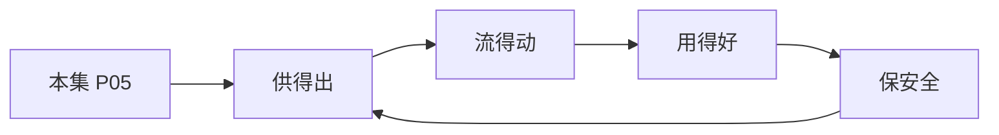

# P05 数据流通安全治理中的制度与技术问题

← [[BV1ser5BDESU-总览]] | ← [[P04-个人信息匿名化制度与实践]] | 下一篇 → [[P06-数据要素安全分级-隐私计算产品安全能力分级要求]]

## 视频信息

| 项目 | 内容 |
|------|------|
| 分集 | 数据流通安全治理中的制度与技术问题 |
| 模块 | 政策与安全治理 |
| 时长 | 44 分 04 秒 |
| 链接 | [B 站 P5](https://www.bilibili.com/video/BV1ser5BDESU?p=5) |
| 官方文档 | [SecretFlow 文档](https://www.secretflow.org.cn/zh-CN/docs) |
| 内容来源 | 知识点增强（数据要素流通技术体系，非逐字转写） |

## 核心要点

1. **本 P 主题**：数据流通安全治理中的制度与技术问题
2. **模块定位**：政策与安全治理
3. **考试/实践侧重**：流通前评估、分类分级、技术+制度协同治理
4. **笔记层级**：教程级（约 2908 字），含速览、图解、场景 Walkthrough、自测题
5. **学习建议**：先通读「3 分钟速览」与「图解」，再读「详细讲解」；动手项见 Checklist

> 以下内容基于数据要素流通与隐私计算技术体系撰写，对应 B 站分 P「数据流通安全治理中的制度与技术问题」。**非 UP 逐字转写**；不看视频也可建立框架，看视频可对照「与视频对照表」深化。

## 本节在系列中的位置

**模块**：政策与安全治理 · 系列第 **P05/47** 集。

**建议前置**：[[个人信息匿名化制度与实践]]——建立本集所需背景。

**建议后续**：[[数据要素安全分级：隐私计算产品安全能力分级要求]]——在本集能力之上继续深入。

依赖关系：政策(P01–P06) → 可信空间(P07–P08,P18) → 密态/隐私技术(P09–P24) → SecretFlow 工程(P25–P32) → 基础设施与案例(P33–P47)。

## 3 分钟速览

**数据流通安全治理中的制度与技术问题** 是数据要素流通体系中的关键一课。读完本节你应能回答：① 核心概念定义；② 在「供得出—流得动—用得好—保安全」链条中的位置；③ 与隐私计算技术栈的衔接。考试/面试侧重：**流通前评估、分类分级、技术+制度协同治理**。

## 零基础导读

本节「数据流通安全治理中的制度与技术问题」属于 **政策与安全治理**。即便未看视频，也应先建立**制度—技术—场景**三层视角：政策类章节回答「为什么允许流」；技术类章节回答「如何安全地算」；案例类章节回答「真实行业怎么落地」。

第一遍阅读请盯住三个问题：本集**解决什么痛点**？**关键参与方**是谁？**交付物或能力边界**是什么？第二遍阅读时，把术语表抄到 Obsidian 双链笔记，与前后分 P 交叉引用。

## 详细讲解

### 1. 流通安全治理框架

数据流通安全是「制度 + 技术」双轮驱动：制度划定红线与程序，技术保障「可用不可见」。治理贯穿**采集→存储→加工→传输→提供→公开→删除**全生命周期。

### 2. 制度层面关键机制

| 机制 | 内容 |
|------|------|
| 分类分级 | 按重要程度与敏感程度确定保护强度 |
| 安全评估 | 处理前评估风险，跨境/重要数据须评估 |
| 标准合同 | 委托处理、共同处理签订数据安全协议 |
| 备案登记 | 数据产品/资产登记，溯源确权 |
| 应急处置 | 泄露事件 24–72 小时报告与补救 |

### 3. 技术层面工具箱

| 技术 | 解决的问题 |
|------|-----------|
| 访问控制 | 谁能在何时以何种方式访问 |
| 使用控制 | 用途、次数、期限、环境约束 |
| 加密传输/存储 | 窃听与拖库风险 |
| 隐私计算 | 联合分析不暴露原始数据 |
| 审计溯源 | 行为留痕、事后追责 |
| 数据水印 | 泄露溯源 |

### 4. 流通场景风险矩阵

| 场景 | 主要风险 | 推荐技术组合 |
|------|----------|-------------|
| 跨企业联合建模 | 样本/特征泄露 | 联邦学习 + 安全聚合 |
| 多方对账 | 交集外元素泄露 | PSI |
| 联合统计 | 个体被推断 | 差分隐私 |
| 数据交易 | 二次转售、超范围使用 | 可信空间 + 使用控制 |
| 跨境传输 | 主权与合规 | 本地化 + 安全评估 |

### 5. 治理组织建议

- 设立**数据安全委员会**：法务、安全、业务、技术四方参与
- **数据管家（Data Steward）**：按域负责分类分级与质量
- **隐私工程（Privacy Engineering）**：将合规嵌入 SDLC

### 6. 考试/实践要点

- 画数据流通全生命周期及对应控制点
- 说明「制度与技术如何协同」举一个联合营销场景
- 列举数据流通前必做的三类评估：合规、安全、个人信息影响

### 7. DPIA 流程

数据保护影响评估：描述处理活动→必要性→风险识别→缓解措施→留存报告。跨境、敏感大规模处理须执行。

### 8. 零信任与数据

零信任架构「永不信任、持续验证」与数据使用控制理念一致：每次访问重新鉴权，最小权限。

### 9. 设计题

设计联合营销场景的数据流通控制表：角色、数据类型、法律依据、技术措施四列。

### 深化理解（数据流通安全治理中的制度与技术问题）

将本节概念放入「数据二十条」四原则框架：它主要支撑哪一条原则？若去掉该能力，哪类数据流通场景会受阻？用一句话向非技术经理解释本节价值。

## 图解

## 类比与直觉

数据要素政策像**交通规则**：先定道路（制度）、再发驾照（授权）、最后装护栏（安全技术）。没有规则，车（数据）跑得越快越危险。

## 例题与场景 Walkthrough

**场景：某市大数据局推进公共数据授权运营**

- **政策依据**：数据二十条、公共数据授权运营规范。
- **供得出**：交通局提供路况统计、医保局提供脱敏就诊汇总——先进目录、分级。
- **流得动**：通过可信数据空间连接器登记数据产品，API 或隐私计算方式交付。
- **用得好**：创业公司将路况+人口统计做成选址 SaaS。
- **保安全**：原始明细不出域；运营机构留存审计日志；使用方签署用途限制。
- **本集切入点**：数据流通安全治理中的制度与技术问题 主要约束上述链条中的 **政策与安全治理** 环节。

## 常见误区

1. **「学完本集就会用隐语」**：SecretFlow 生态需多集串联（P19–P32），单集只是拼图一块。
2. **「隐私计算等于不上传数据」**：数据仍以密文、份额或授权方式参与计算，网络与算力开销客观存在。
3. **「TEE 绝对安全」**：TEE 依赖硬件与侧信道防护，需远程证明（P17）与补丁策略。
4. **「区块链解决一切确权」**：链适合存证与交易撮合，大规模计算仍在链下隐私计算引擎。

## 与视频对照表

| 视频段落（约） | 预期演示内容 | 笔记对应章节 |
|-------------|------------|------------|
| 开篇 0%–15% | 本集目标、背景、与前后集关系 | 本节位置、3 分钟速览 |
| 前段 15%–40% | 核心概念定义与架构图 | 零基础导读、详细讲解 |
| 中段 40%–70% | 原理展开、对比、政策/代码示例 | 图解、类比、Walkthrough |
| 后段 70%–90% | 案例、问答、易错点 | 常见误区、Checklist |
| 收尾 90%–100% | 总结、延伸资源 | 延伸阅读、自测题 |

> 本集总时长约 **44分04秒**。无官方外挂字幕时，以分 P 标题「数据流通安全治理中的制度与技术问题」与上表主题对齐视频画面。

## 动手实践 Checklist

- [ ] 精读数据二十条原文 1 遍（国务院公报）
- [ ] 制作「三法」义务对照表
- [ ] 写出四原则各 1 个本地案例
- [ ] 与合规同事确认 1 个业务的数据分类分级
- [ ] 完成 5 道自测并口述给同事听

## 延伸阅读

- 国务院「关于构建数据基础制度更好发挥数据要素作用的意见」
- 《数据安全法》《个人信息保护法》
- 国家数据局「数据要素×」行动计划

## 自测题

1. **本集核心考点？**  
   **答**：流通前评估、分类分级、技术+制度协同治理。

2. **本集在四原则中的位置？**  
   **答**：主要对应制度与治理（供得出/保安全）。

3. **与 SecretFlow 的关系？**  
   **答**：提供合规与架构前提，后续技术集在其上落地。

4. **一项落地检查？**  
   **答**：是否有授权、是否最小必要、是否可审计——三者缺一不可。

5. **30 秒口述本集？**  
   **答**：用「输入→处理→输出」各一句话概括（见 Walkthrough）。

## 关键术语

| 术语 | 说明 |
|------|------|
| 数据要素 | 可参与社会化配置、创造价值的数字化资源 |
| 隐私计算 | 数据可用不可见前提下实现协作计算的技术体系 |
| 模块 | 政策与安全治理 |

## 与前后分 P 的衔接

- ← **个人信息匿名化制度与实践**（[[P04-个人信息匿名化制度与实践]]）
- → **数据要素安全分级：隐私计算产品安全能力分级要求**（[[P06-数据要素安全分级-隐私计算产品安全能力分级要求]]）

## 逐字转写
> 引擎: whisper | 状态: 已转写 | 格式: 段落化

### [00:03 - 00:57] 大家好,我是清华大学电子工程系
大家好,我是清华大学电子工程系的王岳，过去一年里,我在国家数据局参与了数据流通安全治理文件以及相关案例的编织工作，很高兴能有今天这个机会,以线上课程的方式和大家分享一下我的思考和体会，一起来看一看,数据流通安全治理中有哪些制度和技术问题，这节课呢,我们分成以下部分，首先,我们从数据要素及其流通需求入手,引出数据流通安全治理的基本问题及其重点内容，并概要性的介绍一下,在技术测如何通过数据技术制度的建设支撑数据流通安全治理，最后呢,对本节课的内容进行一个简单的小节，这节课,我们不涉及技术细节和操作性的指引。

### [00:57 - 02:05] 更希望能够呈现出这个新兴领域的
更希望能够呈现出这个新兴领域的基本问题和底层逻辑，希望对大家有所启发，数据流通安全治理与数据流通和数据治理都密切相关，我们发现,随着系统整合与业务协同的深化，数据流通的边界正在逐渐扩展，与此相伴随着,数据流通安全治理的范畴也在不断拓宽，粗略的话分一下,这个眼镜过程大体可以分成信息化阶段，系统整合阶段,跨主体协同阶段,要素化流通阶段，每个阶段的数据流通诉求不同,数据治理的任务也不相同，这个过程的起点可以从信息化说起，伴随着信息化,业务过程以数据的形式被记录，与业务相关的状态信息,控制信息,管理信息，都被基础系统保存了起来。

### [02:05 - 02:58] 有了数据,才有了我们后面关注的
有了数据,才有了我们后面关注的流通和治理的基础，但在这个阶段,数据还未能成为独立的价值载体，其价值依附于业务系统而存在，可以说,这个阶段的数据被业务系统框住了，随着信息化的进程,业务系统越来越多，当这些业务系统需要协同时，比如原料系统和生产系统配合,问题就出现了，每个业务系统都有自己的一套数据，在命名、编码,很多方面都不一致，彼此之间甚至无法理解,更谈不上协同，真是,我们不得不把数据从业务系统中抽出来，通过数据治理进行规及,整理，然后,构建一个数据资产系统,把它们管起来，注意,在这个时候出现了数据的第一次破壁。

### [02:58 - 04:00] 数据开始跨业务系统流动
数据开始跨业务系统流动，我们用数据治理实现跨系统的数据整合，进而以数据整合推动业务协同，在这个过程中,数据摆脱了对业务系统的衣服关系，催生出数据资产的概念，数据成为独立的价值载体，更进一步,当不同的利益主体之间出现了协作的要求，比如说,生产企业想要了解销售数据,以需定产，这是,数据需要再次破壁，也就是说,不同利益主体之间的协作要求，促使数据,跨越了主体的管理边界，注意,这和数据的第一次破壁有所不同，当数据跨越业务系统时，它还只是在单一主体内部流动，可以用管理的方法去协调，而当数据的流动发生在不同利益主体之间。

### [04:00 - 05:05] 主体间的信任问题、手艺分配问题
主体间的信任问题、手艺分配问题，风险和责任界定问题，就会变得突出起来，我们需要使用商业协议，对这些问题进行约定，借用经济学的数据，数据的第二次破壁，伴随着新的交易成本，故事还在继续，如果协作的主体不止一个，那就有点麻烦了，此时,主意的进行商业协议的谈判，成本就很高了，更进一步，在今天,我们希望数据真正融入经济循环，大规模的流通和应用起来，这就意味着,数据的应用环境是开放的，数据用户是不确定的，这时,靠数据持有者自己协调各方关系，就开始有些不太现实了，我们需要更灵活的机制，市场化的机制，这时,数据要素的概念就出现了。

### [05:05 - 06:09] 当数据作为生产要素进入经济循环
当数据作为生产要素进入经济循环，这就意味着,需要以低的交易成本，来推动数据跨越利益主体进行流动，实现数据的规模化流通与应用，此时,市场机制变得越来越重要，我们需要使用市场机制，来实现数据资源的配置，使用市场机制协调不同主体之间的风险，和收益关系，这就是数据要素提出的背景，在这里还有一个小问题，我们所说的更灵活的机制，是否只有交易,这一种形式呢，其实也不一定，记住,我们的核心诉求是要降低交易成本，因此借助技术手段，实现技术信任，进而构建起跨管理域的治理结构，也有助于我们实现上述的目标，这就引出了今天的主题，数据流通安全治理。

### [06:09 - 07:13] 从上述的诉求可以看出
从上述的诉求可以看出，数据要素的流通属性，催生出数据流通安全治理的需求，传统上,我们提到数据安全治理是，它往往只涉及到单一主体，发生在单一管理域的内部，此时,我们可以进行统一的规划和建设，也能够实现细致的管控，但当安全治理的诉求，拓展至多方主体时，主体间的信任基础和合作基础，开始变得薄弱起来，单一进行跨主体的细致管控，同时却需要更加清晰的划分，彼此之间的责任边界，并对过程进行监管，这是与传统的安全治理相比，跨主体的协调，称为难点，那么该怎么做呢，正是为了应对这些挑战，二五年的一月，六部门联合印发，关于完善数据流通安全治理，更好促进数据要素。

### [07:13 - 08:18] 市场化价值化的实施方案
市场化价值化的实施方案，希望能够以安全素发展，通过政策引导，疏通数据流通中，以安全风险累积，而形成的独点痛点问题，我参与了文件的编织工作，在编织的过程中，我们对数据流通的典型场景，和典型问题进行了疏离，所以我就以这些材料作为基础，以数据流通安全治理的政策，落地为切口，探讨一下，流通安全治理的基本问题，和底层逻辑，到这里，技术领域的同时可能有些困惑，数据安全治理更像是一个技术议题，最多和管理领域有些交叉，需要一些管理制度的支撑，怎么到了数据流通安全治理，会和国家政策联系在一起，政策在这里扮演了什么角色，又发挥一些什么作用呢，事实上。

### [08:18 - 09:22] 当我们谈到流通安全治理时
当我们谈到流通安全治理时，涉及到两个相关，但又不完全相同的概念，数据安全和数据合规，数据安全，关心数据有没有被泄漏，被滥用，被篡改，这些都是数据持有者，面对开放的数据流通应用环境，所面临的风险，但是当我们的站位再高一点，就会发现，数据流通不仅仅会影响，数据持有者的利益，也会卷入其他的利益相关方，会造成对他者权益的侵害，比如，用户数据的流通，就有可能会损害个人隐私，而数据的违规收集，可能会侵害数据源头企业的利益，所以，我们需要相关的规制，对涉及到多方，主体的用处行为进行规范，数据合规，也是数据流通，安全治理的一个重要目标，但，流通过程中的数据合规。

### [09:22 - 10:24] 比想象的更复杂
比想象的更复杂，这些年说到数据流通，安全合规，马上就会想到，原始数据不出于，数据可用不可浅，在技术上，马上就会映射到类似于隐私，计算的解决方案，做到这些就合规了，其实远远不是，我们举两个例子，涉及到个人信息的时候，数据采集呢，往往会遵循最小必要的原则，比如高德收集，轨迹信息，用于导航服务，这是必要的，但是他收集用户的属性信息，并进行存储，这可能就违规了，这时候就产生出争议了，然后如果，我们认为高德的营业范围，就是提供导航服务，那么他的最小必要就是，贵级信息，但是高德自己宣称自己是做出行服务的，我需要更好的了解用户，所以我需要用户的画像。

### [10:24 - 11:24] 我需要收集更多的用户属性信息
我需要收集更多的用户属性信息，所以你可以看得到，最小必要的原则，实际上在实施的过程中，和一系列的外部关系，都产生着影响，另外一方面，收集用户信息的时候，我们必须要获得授权，但是这件事，也比想象的更复杂，我们在做新的业务拓展的时候，其实往往面临，数据冷气动的问题，这时候我们希望借助，一些已经获得的用户数据，然后开展我们新的业务，但这个过程中，可能就会涉及到数据的超范围，因为我们在做授权的时候，我不仅仅是在宣称，你可以使用数据，我同时还在宣称，你应该在什么范围内，使用这些数据，而新的业务，并不在我这样的一个数据范围，所以呢，数据安全并不等于数据合规。

### [11:24 - 12:30] 数据合规
数据合规，需要法律，政策，和技术的配合，因此接下来，当我们讨论，数据流通安全治理的基本问题，会不断的出现法律，经济，政策方面的考量，跨领域的事业，对于数据流通安全治理而言，恐怕是必须，数据流通安全问题，可以从多个视角来审视，首先让我们来看看场景化的视角，在刚才所提到的，数据流通安全治理文件中，重点讨论了三个场景，分别涉及到个人数据，公共数据和企业数据的流通，每个场景下的重点问题，各有不同，首先来看一下个人数据的流通利用，在这里，因为个人信息保护法的存在，数据使用的合规性成为焦点，按照个保法的要求，设计个人信息使用时需要获得授权，对于其中的敏感信息。

### [12:30 - 13:26] 还需要单独同意
还需要单独同意，但是，跨主体的流通利用中，因为涉及到不同的法律主体，这一系列的授权往往难以完整的获得，举个例子，我们现在很多的医疗领域的，智能化应用，都希望使用诊疗数据，但是这件事，其实在合规上存在了一些困难，我们在医院看病的过程中，留下来的这些诊疗的数据，背后隐含着一个授权，就是授权医院，这些数据用于对患者的治疗服务，但是，这是有范围的，是用于对患者的治疗，而当我们把它延伸出来，延伸到一个科研领域，或者延伸到一个商业开发，用于去做一个医疗智能模型的训练的时候，这时候其实，就需要重新获得用户授权，但是这个授权甚至很难获得，你想想看。

### [13:26 - 14:32] 我们想补一个协议该怎么办呢
我们想补一个协议该怎么办呢，我们打电话，给留下记录的用户，重新获得他的确认，但，这个电话本身就是非法的，为什么呢，你从什么渠道知道这个用户的，电话信息呢，你怎么知道他得过这个病，这其实已经侵犯到了个人的因素，所以呢，为了规避这个授权的复杂性，一种想法，就是通过技术手段，对个人信息进行匿名化和脱敏，我们想办法去除其中的个人信息，使他可以当做一般数据来进行流通和利用，在个人信息保护法中，我们明确区分了，去标实化和匿名化，去标实化，指的是个人信息，经处理，在不借助外部信息的情况下，无法识别特定自然的，而匿名化，指的是个人信息，经过处理，无法识别，且不能还原。

### [14:32 - 15:34] 注意一下
注意一下，这里的差别，就在于是否引入外部的信息，在这个匿名化的定义中，没有给，识别和复原，附加任何限定条件，也就是这个外部信息，可能是任意的，这个在技术上，这种绝对的匿名化，在操作上存在困难，在业内认为更现实的，其实是一个相对的匿名化，我把数据加给我的，数据下游，我基于对下游企业的认识，认为，在他所持有的数据基础上，以这些数据，无法对我发送给他的数据，进行用户的还原，进行自然人的确定，那么在这个过程，我们就认为实现了匿名化，这种相对匿名化，其实是操作上可行的，而各宝法中的这种绝对化的匿名化，造成的一个结果，就是我们基本上没办法确定，加工到何种程度。

### [15:34 - 16:34] 可以认为是匿名化
可以认为是匿名化，在这里存在这一巨大的争议，我们具体看一下，这个问题可能会变得更清晰一些，我们有一些典型的，个人数据流通利用的场景，比如说，我们在做，跨平台的用户处打，我们在一个平台中，识别出了一些用户，然后我们希望在，另外的其他平台中，向这个用户投放广告，这就意味着在平台之间，需要对用户信息做一下交换，我们至少需要确认，我们所说的用户是同一个，对吧，在这个过程中，这种信息的交换，已经很明显了，另外一种情况下，我们可能会需要做联合建模，平台A持有着用户的，一部分行为数据，平台B持有另外一部分，行为数据，我们希望能够把这两部分的数据，综合起来。

### [16:34 - 17:46] 形成一个对用户更完整的画像
形成一个对用户更完整的画像，这个过程中间，其实也有用户的相关信息，从两个平台之间，进行流动，联邦学习隐私激乱，计算的技术，使得中间的数据流动，看上去是被加密的，但是，从最终的结果来看，我们其实势必，会有一部分的用户信息，在平台间进行了流动，这两种情况，在业务上，其实我们都必须要精确到，特定人，他其实都没有办法，在拖，我们前面所说的，匿名画的诉求，然后，他都需要在一定的意义上，服役用户的授权，而这件事在跨平台的过程中间，往往会非常困难，有的时候我们想规避这些事，然后，把这个特定的自然人，然后，转换成一个特定的群体，我们通过群体的聚合，我们把一个集成的，画像属性信息。

### [17:46 - 18:51] 作为数据产品对外进行
作为数据产品对外进行，数据服务，部分的规避了刚才所说的，特定用户，然后特定用户授权的问题，但是，他其实也没有办法说，完全避免，然后还原出个人信息，对吧 当我有大量的，面向群体的用户，数据产品的时候，时间的交集有可能会很小，所以在这过程中，我们其实也需要去指定，这种群体类产品，必须要基于多大的规模来做，这种群体的认定，来做这种数据的统计，在这过程中间，很多操作层面上的细节，目前都没有被确定下来，所以在目前来看，涉及到个人数据流通过程中，其实是有比较多的，有待解决的和规问题，所以，规截一下，其实面对个人数据的流通，它的焦点问题就是刚才，所说的匿名化和隐私保护。

### [18:51 - 20:06] 在这过程中间
在这过程中间，我们在想要使用，用户数据的时候必须要获得，用户授权，但是在多个主体之间，这种复杂的授权连络，如何建立 如何管理，都存在困难，我们如果想，我们就希望能够对数据，进行匿名化，但是就像刚才所说的，绝对匿名化是难以实现的，而相对匿名化在目前，没有法律和标准的切实依据，除此之外，数据脱敏有的时候也会成为一个问题，然后涉及到敏感数据的时候，我们需要获得单独的统议，但是脱敏目前也没有，业内标准，而且在数据脱敏，和业务所要求的数据，正路之间存在着矛盾，如果我们，确实完成了脱敏，有可能对于某些业务而言，它所关心的那些关键性的信息，也被摸出了，个人数据。

### [20:06 - 21:00] 安全合规问题
安全合规问题，其实是一个非常大的议题，几乎可以用一堂课来去讲解，然后在这里呢，我们没有办法做细致的展开，然后因为我们还要再看看，其他两个方面的场景，是公共数据流通和企业数据流通，对于公共数据而言，抛开其中，涉及到个人信息的部分不论，在这里呢，定责和监管是一个关键问题，公共数据的流通，涉及到了一个庞大的行政体系，在这里呢，权责是各方关注的焦点，但是因为数据流通的复杂性，权责的界定往往是高度场景化的，非常困难，对于市场主题而言，我们可以以产权为基础，通过谈判和协商，确定具体业务场景下的罪行边界，但是对于行政体系，这十分困难，而且呢。

### [21:00 - 22:11] 在行政体系中往往存在着多头监管
在行政体系中往往存在着多头监管，监管标准又不同意，在这个过程中间，又加剧了这样的一个问题，对于企业数据呢，就像刚才提到的，主体间的责任边界，往往是通过商业谈判，用合同或者协议的方式来进行约定，这时候的焦点在哪里呢，在信任上，我们不知道，数据的接触方，有没有能力，有没有意愿，妥善处理和保护，所接收到的数据，而信任的建立需要成本，而在这个过程中间的流通，其实是需要，合适的收益分配机制，来进行激励的，更进一步，落实到操作性上，数据流通安全，会涉及到，主体课题和过程，对于主体而言，最重要的就是责任界定，如何操作，我们有一些大的原则，但在实操上，往往是按照谁采集，谁共享。

### [22:11 - 23:15] 谁持有来确定责任主体
谁持有来确定责任主体，同时呢，因为追诉和定则的困难，在我们找不到，明确的责任主体时，板子，就会打在数源单位身上，对于课题而言，我们需要确定，什么数据可以流通，在什么范围流通，如何流通，这件事涉及到数据的分类分析，这又是一个在操作上，十分繁杂的工程，在目前也缺乏明确的指引，如果在这个过程中，还涉及到个人信息的话，那么就牵扯出前面，所说的授权问题，匿名化问题变得更加复杂，最后呢，流通的过程我们是需要监管的，但是这个监管，它会涉及到跨主体，跨管理喻的数据流动，监管本身的可操作性，也会变成一个问题，最后，从经济学的角度来审视，我们就会发现在这里。

### [23:15 - 24:28] 其实存在着收益和风险的错配
其实存在着收益和风险的错配，收益，更多是落在末端的，但是风险，确实由源头来承担，这种错配，导致整个流通过程中间的，动力不错，而另外一方面，我们其实看到了一个有趣的现象，在当前，数据的利用程度并不太高，在实践中，真正因为，安全责任边界引发的，实际纠纷并不多，真实发生的安全事件，没有成为我们现在事件中的真正，读点，但是它影响了什么，在这里，安全责任和安全风险，影响了共数方的预期，它怕出事，这个时候，降低了共数的意愿，所以，根据流通领域的安全问题，往往并不构成，一种实际的损害，而是一种不稳定的预期，不稳定的预期，影响共数新兴，最后站在技术的视角，来看数据流通安全。

### [24:28 - 25:32] 可以看到
可以看到，人工智能技术的兴起，正在引发新的，安全和合规问题，在大模型训练的过程中，爬取了大量内容网站的，但是它的训练成果，其实可能会构成对于，原内容网站的实质性替代，这种侵权行为，已经引发了大量的诉讼，同时，公寓的数据资源耗尽后，私寓数据越来越成为，推动人工智能技术发展的，稀缺资源，但是私寓数据的释放，需要数据，主体之间进行更深度的合作，也需要，方案的设计，另一方面，数据处理技术的发展，像区块链 隐私计算，可信数据空间等等，他们都为数据合规安全流通，提供了一些只称的条件，但是应该说，单纯依赖技术，是无法完全解决，现有的流通安全问题，同时新技术的安全问题。

### [25:32 - 26:42] 也在持续的涌现中
也在持续的涌现中，因此，数据流通安全治理，需要对流通，所涉及的主体进行协调，对课题，进行管控，对过程进行监管，同时还需要跨管理，与进行协同，并引入第三方的专业服务，这不是一个单纯的技术问题，或制度问题，需要机制体制，标准规范技术体系，协同推进，下面我们只是简单的，展开来看一看，对于主体协调，首先是建立信任，在这里常用的有三种手段，第一种是制度信任，我们可以通过购建正规的环境，标准的程序，形成规范化的交付情境，通过认证，担保来为信任提供保障，其次我还可能借助市场的手段，在市场中通过重复的交易，在过程中留下反馈和评价，来形成声誉，最后呢，也是现在更流行的一种方式。

### [26:42 - 27:48] 就是我们用技术的方式
就是我们用技术的方式，来建立信任，我们通过区块链，可信计算环境，来构建起一种不可抵赖的，不可篡改的信任环境，在这过程中来支持，主体之间的相互交互，在信任的基础之上，其实下面就要做责任的界定，就像刚才说的，普通安全风险造成的，其实不是一种实质性的损害，而是改变了用户的预期，所以我们需要对预期进行管理，在这里，单纯通过技术手段，其实我们没有办法，提供绝对的安全保障，难以完全改变，共属者的预期，而通过制度手段，设置风险的限度，服以技术和市场的手段，削弱风险的影响，通过清晰而有限度的，安全责任边界来稳定预期，可能是一种更，有操作性的方式，所以呢，数据流通安全治理。

### [27:48 - 28:49] 需要综合运用多种手段
需要综合运用多种手段，推动主体之间的信任界，建立与责任界定，信任建立和责任界定，其实，不仅仅和主体有关，也涉及到对流通课题，也就是数据的管控，从管理学的角度来讲，我们其实是需要，具体化数据的载体，然后，用这个载体来作为管理的基本单元，并且确定管理的力度，对于数据流通而言，重构这样一种流通的数据载体，是有可能降低信任建立的成本的，一方面呢，我们信任的建立困难，是来源于信息的不对称，我们事先也不知道，在这过程中间数据的质量如何，数据的可用性怎么样，我们，通过重建，我们在这过程中间的信息在IT，引入更加标准化的，流通标的50有可能，帮助降低这种信息不对称的。

### [28:49 - 29:47] 另外一方面呢
另外一方面呢，我们通过这种数据加工过程，如果我们能形成一种，通用化的数据中间键，它可能会更适合，我们刚才所说的这种数据流通，一方面呢，在这个过程中间，这种标准化的，中间键我们可以附加一些跟，流通有关的额外信息，帮助我们做信息的追溯，另外一方面，它的通用化程度增加，就有可能增加交易的评次和用户数量，还是交易频度的增加，用户数量的拓展，更有利于实现，刚才我们所说的，基于市场反馈形成出来的信用，责任界定，当前责任界定的一个难点，就是责任链条太长了，连带责任过多，当我们的管理对象是一个，特定的信息的时候，它往往会，贯穿多个主体，然后它是有条很长的。

### [29:47 - 30:50] 一个生命周期一个流程的
一个生命周期一个流程的，但是如果我们管理的是，特定形态的数据，这个链条就可能会被切断，我们可以通过数据加工，使得我们数据的内容，结构 形式，产生实质性的改变，这样的一种情况下，就形成了衍生数据，在我们现在新的，产权，制度的设计下，我们倾向于，为衍生数据独立考虑，它的持有权 适用权和经营权，这就为我们，新的流通标的物，和新的管理对象，创造了一个制度基础，需要构建面向流通的，标准化的载体，推动主体附近 与责任界定，过程监管，也是一项重要的任务，面对目前不断推高的监管成本，其实我们可能需要去，考虑改变一些思路了，我们在过去处理，这种类型的问题的时候。

### [30:50 - 31:46] 其实是在用管理的思路
其实是在用管理的思路，我们试图自顶向下的，去推移某种强制性的规范，然后呢 但是在，用管理领域内更倾向于，用治理来代替管理，治理更像是一种，自己向上的一种，管理构建，然后它希望我们能够形成，一种各付其责的一个体系，通过多元主体的协商，来实现一个特定的管理目标，我们希望能够分解和落实，安全责任，然后推动我们在这个，安全治理体系中间，多元主体之间的协同工资，一个全新的安全生态，在这个过程中间呢，监管和技术可能都面临着，角色上的一系列调整，在监管，它有可能从我们原来的行为规制，改变成为一种仲裁的角色，当我们主体之间发生，利益冲突的时候，这种。

### [31:46 - 32:47] 主体之间自发的协商
主体之间自发的协商，没有办法完完全全去触及的时候，监管可能会在这个过程中间介入，然后，在多元主体发生冲突的时候，其实我们有的时候，也涉及到取证，故证，通过证据来加强我们之间，博弈和协商的力度，这个过程中技术可能会发生一作用，我们各方主体，都可能在利用技术工具，来获取证据，然后帮助我们在协商，谈判 证裁中，获得更有利于自己的位置，除此之外呢，现在这个推动技术监管，也成为了一个重要的，一个方向，我们在新的安全这里体系中，出了很多新的监管工具，对吧，可以通过这种安全的审计，安全的监测，然后运用一些杀核的技术，来进行新的业务的尝试，监管对象。

### [32:47 - 33:48] 我们其实也在发生了变化
我们其实也在发生了变化，就像刚才所说的，在这一轮的技术变革中间，我们就会发现，很多新的东西出现了，我们出现了衍生数据，出现了人工智能，我们同时技术平台变得，原来也复杂，这些可能都构成了新的监管对象，并且衍生出新的监管问题，所以呢，数据流通安全治理，我们可能需要创新的监管体系，推动数据流通，安全领域内的协同工具，除此之外，我们可以意识到，解决数据的流通问题，好像不仅仅是要，处理数据内容的跨主题流动，事实上，为了保障数据流通的安全和规，我们其实需要四种不同的流通，第一个，就是我们刚才所说的数据内容的流通，我们希望实现内容互通互联，并且确保在这样的一个。

### [33:48 - 34:42] 互通互联过程中间的安全
互通互联过程中间的安全，但除此之外呢，我们就会发现，编幕其实也有同样的问题，在现在，因为数据本身是多变的，然后是在不断的积累，不断的更新的，只有数据的持有者，比较了解这件事，所以从数据编幕的维护的角度来讲，由数据持有者来做更好，但是这样的一种情况下，我们就会产生大量，分散的编幕系统，然后如何做这样的一种，编幕的一个综合管理，然后更好的实现，在这个分布式的条件下的，分类分析管控，然后就变成了一个比较重要的议题，除此之外呢，其实我们刚才所说的，在数据使用过程中授权，是件非常非常重要的事，在跨主体数据流动的过程中间，不同管理域之间对授权。

### [34:42 - 35:44] 其实可能会有必要的要求
其实可能会有必要的要求，比如说，当我们公共数据想要服务于，这时候就遇到相关的问题，金融领域内对授权，往往有更严格的要求，然后这个过程中，公共领数据领域内的授权，如何转换去适应，金融领域的要求，这时候我们就发现在授权上，我们也有互通互联的问题，除此之外呢，从安全管控的角度来讲，我们希望能够实现，跨管理域的数据追踪，溯源和监管，所以我们希望，在不同管理域之间，也构建起这样一种，联通的关系，所以呢，其实我们可能需要去综合运用，各种手段，来促进上述这种，联通关系的构建，首先技术体系是必不可少的，但技术体系的构建呢，可能又需要这种，标准规范的支撑。

### [35:44 - 36:47] 除此之外这种技术体系
除此之外这种技术体系，可能最终需要落实成为，一种平台类型的技术设施，后面我们可以看到，在这样的一种数据流通利用的环境下，我们如果想要实现更好的，安全和规，实现更好的管控，某种意义下的数据技术设施，变得必不可少，所以呢数据流通安全，需要有效的去推动，不同主体之间，不同管理域之间的互通互联，然后要实现数据的互通，边母的互通，授权的互通合管，最后呢，我们还需要去协调好，市场和技术的手段，怎么说呢，就是我们前面也在说，其实，当我们的安全风险不确定的时候，我们面对的，其实是一个预期管理的问题，这个问题在技术上，非常难处理，但是市场上是怎么做的呢。

### [36:47 - 37:51] 其实是有类似的参照物的
其实是有类似的参照物的，事实上，然后面对市场中间的各类风险，用，保险，来确定风险的边界，是一个非常长间的手段，我们不再确定，我们对不确定的风险，我们用保险，做个边界，我们最终把它转换成成本了，付出对应的保险费用，这个风险就变得可控了，对吧，然后所以呢，其实数据保险，是在这个过程中间一个很重要的，市场化手段，它能够将不确定的风险，转换成一个有借的成本，而且在这个过程中间，安全风险的评估，然后它可能就是保险公司的，核心竞争力，保险公司在商业化的环境下，是有动力，去推动风险评估模型的进化，实行的这个手艺，除此之外呢，像刚才所说的，在流通过程中涉及到安全风险的时候。

### [37:51 - 38:49] 有大量的争议
有大量的争议，这时候需要取证固证对吧，然后我们又会发现，在技术上实现一种，非常完备的溯源和取证的手段，其实很困难，但是其实它非常像，我们在传统的法律领域内，我们做弹道的鉴定，然后做指纹的鉴定，它并不宣传自己，有绝对的可靠性，但是，它对于我们相关的这种，法律诉讼是有参考意义的，所以，面对溯源也许我们也需要，一种鉴定服务，然后它可以为我们在这过程中间的争议，责任边界上发生的冲突，来提供取证服务，固证的服务，在这个过程中间，我们发现了溯源的模型，这是个技术成果，但它可能也可以变成，这种鉴定服务的核心精神力，通过引入这样的一种市场化的机制，我们又会发现。

### [38:49 - 40:03] 技术手段
技术手段，是可以通过市场主体来发挥作用的，我们用技术手段去，推动第三方专业服务的，能力提升，然后同时，这个第三方的，专业服务，它所创造的市场收益，会对技术进步，构成一种正向的激励，所以，数据流通安全，我们也需要去培育，第三方专业服务生态，去协调好市场，和技术之间的关系，因此呢，构建完整的数据流通，安全治理体系，需要技术制度，市场的协同，刚才我们所说，是开发的一个，支撑条件，而国家数据基础设施的提出，就是一种重要的支撑，国家数据基础设施，是数据基础制度，和先进基础落地的一个重要载体，它建设的核心目标之一，就是去支持，高小合规的数据要速流从，下面我们对于。

### [40:03 - 41:01] 国家数据基础设施进行下盖览
国家数据基础设施进行下盖览，在这里呢，也不打算去介绍，通过对于数据技术设施的，架构的，一些简单的分析，来看一看，我们前面提到的流通安全问题，以及在这过程中的，这些治理的需求，在技术上是怎样去被回应的，在这个国家数据，基础设施的架构中最底层，是我们网络和算力的，资源支持，再往上是一个技术性的底座，旁边的这一排，是一个安全保障技术，它偏向于，传统的网络安全和数据安全，而我们前面关心的在流通过程中，发生的那些安全问题和合规问题，它主要是在，数据流通相关技术中间去处理的，在这里呢，这个，技术设施的规划中间，只出了六条的技术路径，是数场,数据空间。

### [41:01 - 42:05] 数连网和数据元件
数连网和数据元件，此外呢其实，当年有两条技术路径，就是隐私计算和区块链，它其实是一个共行的技术，我们抛开这两个不谈，来简单的看一看，就是其余的四条技术路线，对于数据安全之力，发挥了一些什么样的作用，就前面提到，数据流通安全之力，主要涉及到主体协调，课题管控,过程监管和跨语协同，这四项人物，同时呢，对于数据流通而言，我们也有数场,数据元件，数据空间,数连网，四条专业化的技术路线，那么他们之间的关系是什么呢，从我个人来看，我觉得呢，在这里，数场，为各下人物提供了，基础性的管理评验，还在这基础之上呢，数据元件，测重于课题管控和过程监管，它以元件，作为流通的。

### [42:05 - 43:05] 标准化标的物
标准化标的物，建立起了基于元件的，全周期的管理体系，这个管理体系和我们整个流通过程，是连在一起的，而另外一方面呢，数据空间测重于，主体协调和过程监管，它实现了空间内，主体的认证和互信，完成了对空间内，数据流转的管理和追踪，数连网呢，它是以数字对象作为一个基本的管理单元，重点解决数字对象的标识，编目，跨语检索 融合利用等问题，它和我们前面所说的，跨语的管理协同，有一定的关系，但是也并没有完全的覆盖，应该说在现阶段，国家数据技术设施，还不是一个成熟的技术方案，但是从它大致的布局，可以看出，数据流通安全合规问题，它的应为思路是怎样的，因为时间原因呢。

### [43:05 - 44:00] 到这里就要跟大家说再见了
到这里就要跟大家说再见了，简单回顾一下，这些课程，这些可从数据要素说起，数据要素重点关注，跨利主体的数据流通，和市场化的数据资源配置，而数据流通安全治理，是实现这样一种，高效合规数据要素流通的重要手段，数据流通安全治理，安全治理需要解决，主机协调，科技管控，过程监管，跨与协同，这一系列终点的问题，这些问题都需要落在建设上，落在规划上，在这里呢，国家数据技术设施的规划和建设，为数据流通，安全治理，提供了支撑调责，好的这节课就到这里了，再次感谢各位耐心的，听完这节课，希望对大家有帮助，有机发，再见。

## 来源说明

- ✅ B 站官方元数据（`Tools/BV1ser5BDESU-full.json`）
- ✅ 分 P 首帧封面（`Tools/bili-fetch/fetch-bilibili.js`）
- ✅ **教程级增强**：含图解/Mermaid、场景 Walkthrough、自测题（约 2908 字，2026-06-06）
- ⏳ 逐字转写：B 站 API 无外挂字幕轨；可选 Whisper/BiliNote 后续补充

## 关键截图

![[../../06-资源附件/video-notes-images/BV1ser5BDESU-P05-cover.jpg|B站首帧 P05]]
