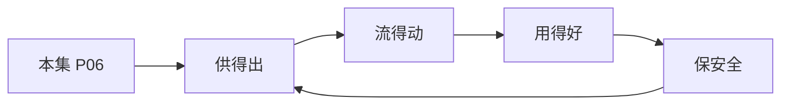

# P06 数据要素安全分级：隐私计算产品安全能力分级要求

← [[BV1ser5BDESU-总览]] | ← [[P05-数据流通安全治理中的制度与技术问题]] | 下一篇 → [[P07-可信数据空间标准体系]]

## 视频信息

| 项目 | 内容 |
|------|------|
| 分集 | 数据要素安全分级：隐私计算产品安全能力分级要求 |
| 模块 | 政策与安全治理 |
| 时长 | 13 分 38 秒 |
| 链接 | [B 站 P6](https://www.bilibili.com/video/BV1ser5BDESU?p=6) |
| 官方文档 | [SecretFlow 文档](https://www.secretflow.org.cn/zh-CN/docs) |
| 内容来源 | 知识点增强（数据要素流通技术体系，非逐字转写） |

## 核心要点

1. **本 P 主题**：数据要素安全分级：隐私计算产品安全能力分级要求
2. **模块定位**：政策与安全治理
3. **考试/实践侧重**：隐私计算产品安全能力分级、基础/增强/高安全等级
4. **笔记层级**：教程级（约 2905 字），含速览、图解、场景 Walkthrough、自测题
5. **学习建议**：先通读「3 分钟速览」与「图解」，再读「详细讲解」；动手项见 Checklist

> 以下内容基于数据要素流通与隐私计算技术体系撰写，对应 B 站分 P「数据要素安全分级：隐私计算产品安全能力分级要求」。**非 UP 逐字转写**；不看视频也可建立框架，看视频可对照「与视频对照表」深化。

## 本节在系列中的位置

**模块**：政策与安全治理 · 系列第 **P06/47** 集。

**建议前置**：[[数据流通安全治理中的制度与技术问题]]——建立本集所需背景。

**建议后续**：[[可信数据空间标准体系]]——在本集能力之上继续深入。

依赖关系：政策(P01–P06) → 可信空间(P07–P08,P18) → 密态/隐私技术(P09–P24) → SecretFlow 工程(P25–P32) → 基础设施与案例(P33–P47)。

## 3 分钟速览

**数据要素安全分级：隐私计算产品安全能力分级要求** 是数据要素流通体系中的关键一课。读完本节你应能回答：① 核心概念定义；② 在「供得出—流得动—用得好—保安全」链条中的位置；③ 与隐私计算技术栈的衔接。考试/面试侧重：**隐私计算产品安全能力分级、基础/增强/高安全等级**。

## 零基础导读

本节「数据要素安全分级：隐私计算产品安全能力分级要求」属于 **政策与安全治理**。即便未看视频，也应先建立**制度—技术—场景**三层视角：政策类章节回答「为什么允许流」；技术类章节回答「如何安全地算」；案例类章节回答「真实行业怎么落地」。

第一遍阅读请盯住三个问题：本集**解决什么痛点**？**关键参与方**是谁？**交付物或能力边界**是什么？第二遍阅读时，把术语表抄到 Obsidian 双链笔记，与前后分 P 交叉引用。

## 详细讲解

### 1. 分级目的

《信息安全技术 隐私计算产品安全能力分级要求》（相关标准体系）对隐私计算产品进行**安全能力分级**，帮助使用方按场景选型和供应商对标，避免「过度采购」或「能力不足」。

### 2. 典型分级维度

| 维度 | 考察内容 |
|------|----------|
| 密码算法 | 国密/国际算法合规性、密钥长度、随机源 |
| 安全模型 | 半诚实/恶意敌手假设、可证明安全 |
| 通信安全 | TLS、双向认证、防重放 |
| 身份认证 | 多因素、证书体系、与 PKI 集成 |
| 审计 | 日志完整性、不可抵赖 |
| 可用性 | 高可用、容灾、性能基线 |

### 3. 能力等级（概念框架）

| 等级 | 适用场景 | 能力特征 |
|------|----------|----------|
| 基础级 | 内部低敏数据协作 | 半诚实模型、基础加密通信 |
| 增强级 | 跨机构商业合作 | 恶意安全或诚实多数、完整审计 |
| 高安全级 | 政务、金融、医疗 | 硬件信任根 TEE、远程证明、国密全栈 |

### 4. 产品选型清单

1. 明确业务场景的安全模型（参与方是否互信）
2. 核对算法清单是否满足行业监管（金融需国密）
3. 验证是否支持**元数据隔离**（任务描述不泄露业务细节）
4. 检查**互操作性**：能否与可信数据空间连接器对接
5. 要求第三方安全测评报告或等保测评关联

### 5. 与数据要素分级的关系

- **数据分类分级**（数据本身敏感程度）决定需要什么级别的隐私计算产品
- 高敏感数据（重要数据、敏感个人信息）应选高安全级产品 + TEE/远程证明
- 分级结果写入**数据流通合约**作为技术约束

### 6. 考试/实践要点

- 区分数据分级与产品分级的对象差异
- 说明半诚实与恶意敌手模型对协议设计的影响
- 给金融联合风控场景推荐分级并说明理由

### 7. 认证测评

隐私计算产品可参照等保、密评、行业测评（如金融科技认证）。采购招标文件应明确**最低能力等级**。

### 8. 供应链安全

开源组件漏洞（如 OpenSSL）影响隐私计算栈。建议 SBOM、定期渗透测试、安全开发生命周期 SDL。

### 9. 选型表

为政务数据融合场景填写：敌手模型、数据量级、延迟要求、推荐产品等级。

### 深化理解（数据要素安全分级：隐私计算产品安全能力分级要求）

将本节概念放入「数据二十条」四原则框架：它主要支撑哪一条原则？若去掉该能力，哪类数据流通场景会受阻？用一句话向非技术经理解释本节价值。

## 图解

## 类比与直觉

数据要素政策像**交通规则**：先定道路（制度）、再发驾照（授权）、最后装护栏（安全技术）。没有规则，车（数据）跑得越快越危险。

## 例题与场景 Walkthrough

**场景：某市大数据局推进公共数据授权运营**

- **政策依据**：数据二十条、公共数据授权运营规范。
- **供得出**：交通局提供路况统计、医保局提供脱敏就诊汇总——先进目录、分级。
- **流得动**：通过可信数据空间连接器登记数据产品，API 或隐私计算方式交付。
- **用得好**：创业公司将路况+人口统计做成选址 SaaS。
- **保安全**：原始明细不出域；运营机构留存审计日志；使用方签署用途限制。
- **本集切入点**：数据要素安全分级：隐私计算产品安全能力分级要求 主要约束上述链条中的 **政策与安全治理** 环节。

## 常见误区

1. **「学完本集就会用隐语」**：SecretFlow 生态需多集串联（P19–P32），单集只是拼图一块。
2. **「隐私计算等于不上传数据」**：数据仍以密文、份额或授权方式参与计算，网络与算力开销客观存在。
3. **「TEE 绝对安全」**：TEE 依赖硬件与侧信道防护，需远程证明（P17）与补丁策略。
4. **「区块链解决一切确权」**：链适合存证与交易撮合，大规模计算仍在链下隐私计算引擎。

## 与视频对照表

| 视频段落（约） | 预期演示内容 | 笔记对应章节 |
|-------------|------------|------------|
| 开篇 0%–15% | 本集目标、背景、与前后集关系 | 本节位置、3 分钟速览 |
| 前段 15%–40% | 核心概念定义与架构图 | 零基础导读、详细讲解 |
| 中段 40%–70% | 原理展开、对比、政策/代码示例 | 图解、类比、Walkthrough |
| 后段 70%–90% | 案例、问答、易错点 | 常见误区、Checklist |
| 收尾 90%–100% | 总结、延伸资源 | 延伸阅读、自测题 |

> 本集总时长约 **13分38秒**。无官方外挂字幕时，以分 P 标题「数据要素安全分级：隐私计算产品安全能力分级要求」与上表主题对齐视频画面。

## 动手实践 Checklist

- [ ] 精读数据二十条原文 1 遍（国务院公报）
- [ ] 制作「三法」义务对照表
- [ ] 写出四原则各 1 个本地案例
- [ ] 与合规同事确认 1 个业务的数据分类分级
- [ ] 完成 5 道自测并口述给同事听

## 延伸阅读

- 国务院「关于构建数据基础制度更好发挥数据要素作用的意见」
- 《数据安全法》《个人信息保护法》
- 国家数据局「数据要素×」行动计划

## 自测题

1. **本集核心考点？**  
   **答**：隐私计算产品安全能力分级、基础/增强/高安全等级。

2. **本集在四原则中的位置？**  
   **答**：主要对应制度与治理（供得出/保安全）。

3. **与 SecretFlow 的关系？**  
   **答**：提供合规与架构前提，后续技术集在其上落地。

4. **一项落地检查？**  
   **答**：是否有授权、是否最小必要、是否可审计——三者缺一不可。

5. **30 秒口述本集？**  
   **答**：用「输入→处理→输出」各一句话概括（见 Walkthrough）。

## 关键术语

| 术语 | 说明 |
|------|------|
| 数据要素 | 可参与社会化配置、创造价值的数字化资源 |
| 隐私计算 | 数据可用不可见前提下实现协作计算的技术体系 |
| 安全分级 | 按敏感程度划分保护等级 |
| 产品分级 | 隐私计算产品能力等级 |

## 与前后分 P 的衔接

- ← **数据流通安全治理中的制度与技术问题**（[[P05-数据流通安全治理中的制度与技术问题]]）
- → **可信数据空间标准体系**（[[P07-可信数据空间标准体系]]）

## 逐字转写
> 引擎: whisper | 状态: 已转写 | 格式: 段落化

### [00:00 - 00:49] 大家好我是来自深圳国家金融科医
大家好 我是来自深圳国家金融科医测评中心的罗峰，很高兴在数据要素可信流通技术目科的第八奖中，跟大家做一个隐息算产品，安全内分析要求的标准解读及分享，本次分享主要从标准编制背景 编制思路，标准内容 以及标准应用实践 四个方向进行讲解，去年1月份 我们看到国家数据局等部门，发布了数据要素乘30行动计划，2024至2026年，文中在强调要深化数据空间，影子计算 缺化链等技术的应用，促进数据合规的高效流通及使用，那么影子计算对于数据流通的价值在哪里呢，我们认为影子计算不仅仅是数据要素流通的旧设施之一，通过密码学 可信应件等技术。

### [00:49 - 01:35] 实现了数据要素的安全可控流通及
实现了数据要素的安全可控 流通及融合，同时 影子计算还是推动各方，尤其是数据持有方进行数据要素流通的一个重要引擎，因其在技术层面上将其数据持有权和使用权进行了拆分，保障了数据持有者在数据流通过程中的基本权益，相较于一般的软件产品的设计考量，可能更多是有限考虑产品的一个功能实现，是否符合用户的需求及习惯，那么再其次再考虑软件的一个整体的坚弱性和可高性，储备事业强奸管或者强安全需求的行业，否则产品的安全考量相对较弱，主要是通过一些漏洒或者常见的一些加固措施，去保障产品整体的安全性。

### [01:36 - 02:23] 而影子计算产品的我们认为天然就
而影子计算产品的我们认为天然就有高安全的一个基本需求，不管应用于什么行业，那么安全始终是起最基本最核心的一个诉求，其次才是性能上的提升以及功能上的实现，我们认为从宏观的视角上来看，影子计算产业的发展，其本质就是一个不断提高安全水位，不断面临安全可振挑战的一个过程，也是一个从可信再到普及应用的一个过程，只有过去各方保护监管机构的一个信任，确信使用相关产品不会造成属于泄漏的前提下，才有可能实现大规模深层次的属于要素流通，所以我们看到影子计算的一个标准体系在前期建设中，那么主要围绕也是最先开展的研究内容。

### [02:24 - 03:03] 也是影子计算的安全性的相关的一
也是影子计算的安全性的相关的一个要求，但是影子计算技术路线是多样的，安全特性也不一，各技术路线在实现方式，性能安全成本开销应用长性的方面，都有比较明显的差异性和优缺点，难以一概要论，所以前期的安全标准体系建设中，基本都是针对某一技术路线，例如多方安全 铃帮学习 可行指引环境，在特定的技术路线的应用场景下，然后进行一个标准的编制，提出一些具体的安全要求。

### [03:05 - 04:03] 对标准比较了解的同学可能知道
对标准比较了解的同学可能知道，标准需要具有一定的适应性，对安全标准来说，我们安全要求一上来就定得太高，那么要求影子计算产品具备安全可证，其实不太现实的，也起到任何推动作用，定得太低 但也不行，所以标准的编制要符合当时标准编制的，实际的技术应用发展形化，以及实际的应用的需求，但随着技术的不断眼镜，产品应用及市场需求的不断力发展，我们发现其实部分的投谱企业，在产品的安全性上，其实已经高于此前的一些标准的一些要求了，但基于统一的安全的词兵基准，所构建的标准，已经很难去区分标准，就是产品和产品之间的安全差异性，那么导致注重安全产品的厂商。

### [04:04 - 05:03] 反而体现不出来产品安全性上的一
反而体现不出来产品安全性上的一些优势，那么最终导致整个影子计算产业，难以良性循环和发展，这个时候继续一套安全分级标准，让各机构及自身能力，向更高的安全要求去对齐，从而促进整个影子计算产业的安全水位的提升，那么如何去构建一个安全分级标准，这里有两种方式，一种相对比较简单和直接，就是在原有的各技术路线下的标准体系，体系组织上去构建安全分级标准，例如构建通话安全计算 安全分级标准，联盟学习安全分级标准，那么这种标准的构建方式，相对来说编制难度和公度量，相对来说较低，因为只要在原有的标准安全要求之上，那么结合实际的一个技术的一个发展和需求。

### [05:03 - 06:03] 那么提出一些安全增强要求即可
那么提出一些安全增强要求即可，但是缺点是缺乏统一的安全性度量标准，使得标准和标准之间，对于同一安全级别的定义，可能会存在明显差异，最终使得标准应用的情况下，应用的场景当中，那么不同技术路线产品之间，也无法进行很像的一个安全性比较，第二种方式是尝试构建统一的安全性度量标准，那么再通过统一的标准去构建通用的，是用于不同技术路线的安全分级标准，却拉通所有也许算产品的安全性水位，这种中间方式的好处，在于不受限于特定的这些路线，但难度和挑战也会大得多，经过研讨的我们最终还是决定采用第二种方式，作为标准的一个研制路径，经过长期的标准研制和修订。

### [06:03 - 06:42] 在2024年2月份的时候
在2024年2月份的时候，由深圳国家军会设部中心联合蚂蚁充量动舰，等8家业内的头部机构，联合发布了隐私算产品安全能力分级要求标准，该标准也是首个拉通，并适用于不同隐私算技术路线的，同样安全分级标准，结合不同应用场景，对安全等级进行了五级的划分，并提出具体要求，该标准也是为产品的开发方和使用方，在产品的设计，产品的选型的过程当中，提供了相关的指引。

### [06:45 - 07:46] 那构建统一的安全分级标准
那构建统一的安全分级标准，首先要考虑的是，如何给予安全分级维度，解安全分级界线，设计出统一的安全分级框架，安全分级框架的设计是否合理，会直接影响整个标准的指向及应用，在安全分级界线设计方面，需要从我考虑多个因素，比如说在就是层面上，要考虑安全安全跨度的合理性，每级的安全跨度差异性不应太大，那么从定义层面上，要考虑边界描述的行情性，需要定义的边界，教维清晰且亦理解，从最后的标准的应用层面上来考虑，要具备场景的适宜性，不同的安全等级，需要能够满足不同的应用场景的差异化的安全需求，但是具体的后面，什么应用场景，需要达到什么样的安全水位。

### [07:47 - 08:48] 这个主要受限于
这个主要受限于，主要受到应用场景中参与方的可信度，共享数据的价值，以所属行业的安全特性，各个因素的影响，在安全分级维度方面，我们不再以具体的技术路线的，安全时间特性，作为品牌安全程度的一个考验方式，从整个安全性的，更为底散本质的角度去释放，从公积视角看，其实就是品牌它的工具成本和收益，那么从防疫视角来看，就是看它整个产品的工具体育能力，以及它风险的管控能力，在工具成本方面，我们进行了非参与方攻击和参与方攻击，位置攻击和椅子攻击两个维度花分，我们可以看到，为参与方的攻击成本，却要远高于非参与方，虽然二一参与方能够实施，更多的内部的攻击路径。

### [08:49 - 09:56] 攻击方式和攻击效果
攻击方式和攻击效果，可能会更好，但首先，该攻击方式，是需要取得其他机构的一个信任，及授权的，尤其是在多个机构的联合参与的情况下，可能这个成本会更高，而非参与方的算，只能实施一些外部的攻击，可能攻击的手段方式极为有限，但是前期的攻击成本要少得多，而椅子攻击和位置攻击相比，以及攻击，其实只基于已有的攻击方式，而位置攻击的实施或实施的攻击，其实是一个以示答案，进行复限的一个过程，而位置攻击，其实就更像林队的落洞挖掘，或者非队的落洞挖掘，是一种探索未公开的一个攻击路径，因为前期的探索成本会比较高，所以相对的它的攻击成本要远高于，椅子攻击。

### [09:57 - 10:57] 椅子攻击其实也存在明显的攻击成
椅子攻击其实也存在明显的攻击成本上的差异，比如攻击人员的水平的要求，然后攻击设备的要求，还有其他包括攻击条件的要求，为此我们进一步将椅子攻击，划分为了一般水平攻击以及高水平攻击，一般水平攻击实施一般的程序开发运为人员，或者硬件的设计人员，通过一些常见的攻击攻击，然后能够实施的一些攻击，包括一些伪造一些软件，或者基于硬件上的一些差异和硬件数据的读取，等实施的一些较低成本的一些攻击，而高水平攻击是指需要专业的一些理论的基础，以及一些专业的攻击设备，以及其他一些一般水平攻击无法实现的攻击类型，例如一些技术专家通过复杂的数学方式。

### [10:58 - 11:55] 实施的一些算法类的攻击
实施的一些算法类的攻击，包括这种软硬件的一些篡法攻击，以及一些化机构的合谋的攻击等等，那么在攻击的收益方面看，那么我们分为了非约定型一些路和约定型一些路，非约定型一些路是指，行业内没有约定的可泄露的一些信息，是指数据石油者，对数据石油者会造成较大的这个利损失的信息，例如这些原始数据的泄漏，或者基于一些中间泄漏的一些信息，能够推导出一些有价值的信息的信息，都属于非约定信息，那么对于攻击者来说是收益最大的，也是实施各类攻击的最终的一个目的，那么该类信息的泄漏，因为我们认为是不可接受的，但某些特定的中间结果的泄漏。

### [11:55 - 12:57] 基于该中间信息其实难以进行
基于该中间信息其实难以进行，因为数据会一些有价值信息的推导，那么这些信息我们认为是对数据石油者，会造成太大的实质性的权益损害的，我们认为是可接受的一个信息泄漏的一个影响，至于什么样的中间数据，多少中间数据会直接或间接，推导出多少原始信息或者有价值的信息，这其实需要一套严谨的方法论，进行可量化的验证，也是整个标准在后续落地过程当中，相对比较难的一个部分，那么通过结合攻击成本以及攻击收益，进行分析其实可以很清楚的判断，哪些是严重风险，那么比如说非参与方的一般水平攻击，它直接导致了肥脸信息，包括这种原数据或者有价值的中间信息泄漏。

### [12:58 - 13:36] 这种风险我们认为就是一些严重风
这种风险我们认为就是一些严重风险，是首先需要满足的一些或者保护的一个方面，参与方的一些位置攻击，去获取一些约定信息的泄漏或者非约定信息的泄漏，那么由于一些成本我们已经非常高了，所以这一块我们认为是一些低风险的方面，然后适用于一些更高安全的拥有场景，去制定相关的一些安全要求。

## 来源说明

- ✅ B 站官方元数据（`Tools/BV1ser5BDESU-full.json`）
- ✅ 分 P 首帧封面（`Tools/bili-fetch/fetch-bilibili.js`）
- ✅ **教程级增强**：含图解/Mermaid、场景 Walkthrough、自测题（约 2905 字，2026-06-06）
- ⏳ 逐字转写：B 站 API 无外挂字幕轨；可选 Whisper/BiliNote 后续补充

## 关键截图

![[../../06-资源附件/video-notes-images/BV1ser5BDESU-P06-cover.jpg|B站首帧 P06]]
