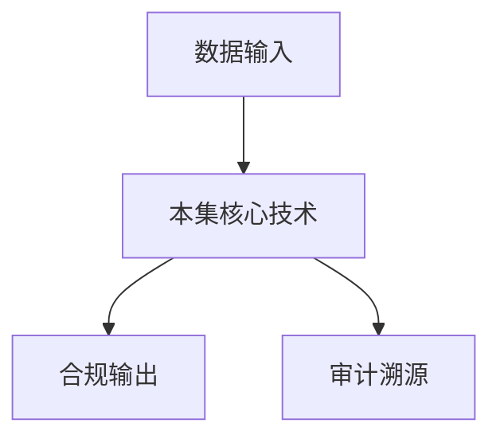

# P07 可信数据空间标准体系

← [[BV1ser5BDESU-总览]] | ← [[P06-数据要素安全分级-隐私计算产品安全能力分级要求]] | 下一篇 → [[P08-可信数据空间整体能力]]

## 视频信息

| 项目 | 内容 |
|------|------|
| 分集 | 可信数据空间标准体系 |
| 模块 | 可信数据空间标准 |
| 时长 | 36 分 54 秒 |
| 链接 | [B 站 P7](https://www.bilibili.com/video/BV1ser5BDESU?p=7) |
| 官方文档 | [SecretFlow 文档](https://www.secretflow.org.cn/zh-CN/docs) |
| 内容来源 | 知识点增强（数据要素流通技术体系，非逐字转写） |

## 核心要点

1. **本 P 主题**：可信数据空间标准体系
2. **模块定位**：可信数据空间标准
3. **考试/实践侧重**：可信数据空间标准体系、参与方、功能架构
4. **笔记层级**：教程级（约 2859 字），含速览、图解、场景 Walkthrough、自测题
5. **学习建议**：先通读「3 分钟速览」与「图解」，再读「详细讲解」；动手项见 Checklist

> 以下内容基于数据要素流通与隐私计算技术体系撰写，对应 B 站分 P「可信数据空间标准体系」。**非 UP 逐字转写**；不看视频也可建立框架，看视频可对照「与视频对照表」深化。

## 本节在系列中的位置

**模块**：可信数据空间标准 · 系列第 **P07/47** 集。

**建议前置**：[[数据要素安全分级：隐私计算产品安全能力分级要求]]——建立本集所需背景。

**建议后续**：[[可信数据空间整体能力]]——在本集能力之上继续深入。

依赖关系：政策(P01–P06) → 可信空间(P07–P08,P18) → 密态/隐私技术(P09–P24) → SecretFlow 工程(P25–P32) → 基础设施与案例(P33–P47)。

## 3 分钟速览

**可信数据空间标准体系** 是数据要素流通体系中的关键一课。读完本节你应能回答：① 核心概念定义；② 在「供得出—流得动—用得好—保安全」链条中的位置；③ 与隐私计算技术栈的衔接。考试/面试侧重：**可信数据空间标准体系、参与方、功能架构**。

## 零基础导读

本节「可信数据空间标准体系」属于 **可信数据空间标准**。即便未看视频，也应先建立**制度—技术—场景**三层视角：政策类章节回答「为什么允许流」；技术类章节回答「如何安全地算」；案例类章节回答「真实行业怎么落地」。

第一遍阅读请盯住三个问题：本集**解决什么痛点**？**关键参与方**是谁？**交付物或能力边界**是什么？第二遍阅读时，把术语表抄到 Obsidian 双链笔记，与前后分 P 交叉引用。

## 详细讲解

### 1. 可信数据空间定义

可信数据空间（Trusted Data Space, TDS）是基于共识规则、联接多方主体，实现数据资源共享共用的一种数据流通基础设施。国家数据局推动标准体系建设，目标是**可信管控、资源交互、价值创造**三位一体。

### 2. 标准体系架构

| 层次 | 标准类型 | 示例方向 |
|------|----------|----------|
| 基础通用 | 术语、参考架构 | 概念模型、参与方角色 |
| 能力建设 | 功能要求 | 身份、目录、合约、审计 |
| 互联互通 | 接口协议 | 连接器互通、跨空间漫游 |
| 安全合规 | 安全要求 | 分类分级、密码应用、评估 |
| 应用指南 | 行业实施 | 金融、医疗、汽车等 |

### 3. 核心参与方

- **数据提供方**：拥有数据资源，制定使用策略
- **数据使用方**：按合约申请使用
- **数据服务方**：清洗、标注、建模等增值服务
- **空间运营方**：平台运营、生态治理
- **监管方**：合规监督（可选接入审计视图）

### 4. 功能架构五层

1. **接入层**：连接器、API 网关
2. **身份层**：DID、CA、联邦身份
3. **目录层**：资源登记、发现、语义映射
4. **合约层**：数字合约、策略协商、智能执行
5. **审计层**：行为日志、存证、溯源

### 5. 与隐私计算的关系

可信数据空间是「流通治理壳」，隐私计算是「计算引擎」。连接器将数据产品送入 TEE/MPC/联邦环境执行，结果回传并写审计日志。

### 6. 考试/实践要点

- 画出 TDS 参考架构五层
- 说明连接器在标准体系中的位置
- 对比 TDS 与传统数据交易所的差异：强调持续使用控制而非一次性交割

### 8. 国际标准的对标

IDSA（国际数据空间协会）、GAIA-X 欧洲数据空间与我国可信数据空间理念相通，互联互通需**语义互操作**与**信任联邦**。

### 9. 里程碑

关注全国数据标准化技术委员会发布草案；参与行业团标试点可抢占生态位。

### 10. 参与方准入

空间运营方应建立参与方准入：法人资质、安全能力认证、过往违规记录审查。退出机制包括违约摘牌、数据下架与合约清算，防止劣质数据污染生态。

### 深化理解（可信数据空间标准体系）

将本节概念放入「数据二十条」四原则框架：它主要支撑哪一条原则？若去掉该能力，哪类数据流通场景会受阻？用一句话向非技术经理解释本节价值。

## 图解

## 类比与直觉

可信数据空间像**带门禁的联合办公室**：各方自带文件（数据）进共享会议室，按合约使用、出门留痕，原始文件不随便复印带走。

## 例题与场景 Walkthrough

**场景：两家机构联合建模（不共享明文）**

1. **样本对齐**：若双方仅有交集用户有价值，先用 PSI（P21/P28）对齐 ID。
2. **特征拼接**：纵向联邦（P24）下 A 方持标签、B 方持特征，梯度通过安全聚合更新。
3. **训练执行**：在 SecretFlow SPU（P27）上完成密态前向/反向，或 TEE 内明文训练（P11–P17）。
4. **模型发布**：输出评分服务；模型参数经评估后按需出域，训练数据永不出域。
5. **本集关联**：可信数据空间标准体系 提供其中 **可信数据空间标准体系** 能力。

## 常见误区

1. **「学完本集就会用隐语」**：SecretFlow 生态需多集串联（P19–P32），单集只是拼图一块。
2. **「隐私计算等于不上传数据」**：数据仍以密文、份额或授权方式参与计算，网络与算力开销客观存在。
3. **「TEE 绝对安全」**：TEE 依赖硬件与侧信道防护，需远程证明（P17）与补丁策略。
4. **「区块链解决一切确权」**：链适合存证与交易撮合，大规模计算仍在链下隐私计算引擎。

## 与视频对照表

| 视频段落（约） | 预期演示内容 | 笔记对应章节 |
|-------------|------------|------------|
| 开篇 0%–15% | 本集目标、背景、与前后集关系 | 本节位置、3 分钟速览 |
| 前段 15%–40% | 核心概念定义与架构图 | 零基础导读、详细讲解 |
| 中段 40%–70% | 原理展开、对比、政策/代码示例 | 图解、类比、Walkthrough |
| 后段 70%–90% | 案例、问答、易错点 | 常见误区、Checklist |
| 收尾 90%–100% | 总结、延伸资源 | 延伸阅读、自测题 |

> 本集总时长约 **36分54秒**。无官方外挂字幕时，以分 P 标题「可信数据空间标准体系」与上表主题对齐视频画面。

## 动手实践 Checklist

- [ ] 复述本集 3 个定义（不看笔记）
- [ ] 根据 Walkthrough 写 200 字场景短文
- [ ] 对照视频确认 1 个架构图/演示
- [ ] 在总览思维导图中标注本集节点
- [ ] 完成自测 Q1/Q5

## 延伸阅读

- [SecretFlow 文档中心](https://www.secretflow.org.cn/zh-CN/docs)
- TC609 可信数据空间相关标准
- 本系列相邻 2 个分 P 笔记

## 自测题

1. **本集核心考点？**  
   **答**：可信数据空间标准体系、参与方、功能架构。

2. **本集在四原则中的位置？**  
   **答**：偏流得动基础设施。

3. **与 SecretFlow 的关系？**  
   **答**：提供合规与架构前提，后续技术集在其上落地。

4. **一项落地检查？**  
   **答**：是否有授权、是否最小必要、是否可审计——三者缺一不可。

5. **30 秒口述本集？**  
   **答**：用「输入→处理→输出」各一句话概括（见 Walkthrough）。

## 关键术语

| 术语 | 说明 |
|------|------|
| 数据要素 | 可参与社会化配置、创造价值的数字化资源 |
| 隐私计算 | 数据可用不可见前提下实现协作计算的技术体系 |
| 使用控制 | 约定用途、次数、期限 |
| 连接器 | 参与方接入节点 |

## 与前后分 P 的衔接

- ← **数据要素安全分级：隐私计算产品安全能力分级要求**（[[P06-数据要素安全分级-隐私计算产品安全能力分级要求]]）
- → **可信数据空间整体能力**（[[P08-可信数据空间整体能力]]）

## 逐字转写
> 状态：待转写。运行 `Tools/transcribe/transcribe.ps1 -Bvid BV1ser5BDESU -Part 7` 补充。

## 来源说明

- ✅ B 站官方元数据（`Tools/BV1ser5BDESU-full.json`）
- ✅ 分 P 首帧封面（`Tools/bili-fetch/fetch-bilibili.js`）
- ✅ **教程级增强**：含图解/Mermaid、场景 Walkthrough、自测题（约 2859 字，2026-06-06）
- ⏳ 逐字转写：B 站 API 无外挂字幕轨；可选 Whisper/BiliNote 后续补充

## 关键截图

![[../../06-资源附件/video-notes-images/BV1ser5BDESU-P07-cover.jpg|B站首帧 P07]]
