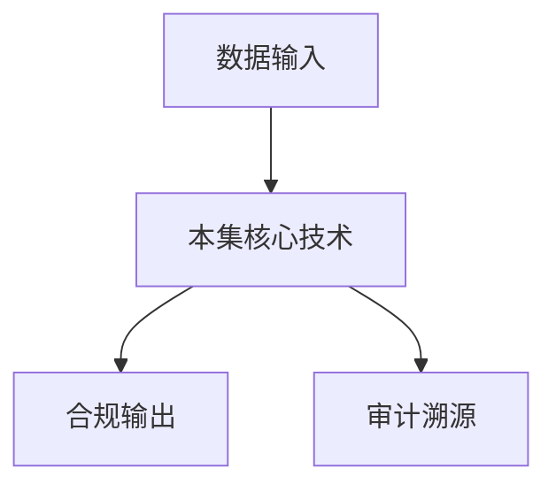

# P07 可信数据空间标准体系

← [[BV1ser5BDESU-总览]] | ← [[P06-数据要素安全分级-隐私计算产品安全能力分级要求]] | 下一篇 → [[P08-可信数据空间整体能力]]

## 视频信息

| 项目 | 内容 |
|------|------|
| 分集 | 可信数据空间标准体系 |
| 模块 | 可信数据空间标准 |
| 时长 | 36 分 54 秒 |
| 链接 | [B 站 P7](https://www.bilibili.com/video/BV1ser5BDESU?p=7) |
| 官方文档 | [SecretFlow 文档](https://www.secretflow.org.cn/zh-CN/docs) |
| 内容来源 | 知识点增强（数据要素流通技术体系，非逐字转写） |

## 核心要点

1. **本 P 主题**：可信数据空间标准体系
2. **模块定位**：可信数据空间标准
3. **考试/实践侧重**：可信数据空间标准体系、参与方、功能架构
4. **笔记层级**：教程级（约 2859 字），含速览、图解、场景 Walkthrough、自测题
5. **学习建议**：先通读「3 分钟速览」与「图解」，再读「详细讲解」；动手项见 Checklist

> 以下内容基于数据要素流通与隐私计算技术体系撰写，对应 B 站分 P「可信数据空间标准体系」。**非 UP 逐字转写**；不看视频也可建立框架，看视频可对照「与视频对照表」深化。

## 本节在系列中的位置

**模块**：可信数据空间标准 · 系列第 **P07/47** 集。

**建议前置**：[[数据要素安全分级：隐私计算产品安全能力分级要求]]——建立本集所需背景。

**建议后续**：[[可信数据空间整体能力]]——在本集能力之上继续深入。

依赖关系：政策(P01–P06) → 可信空间(P07–P08,P18) → 密态/隐私技术(P09–P24) → SecretFlow 工程(P25–P32) → 基础设施与案例(P33–P47)。

## 3 分钟速览

**可信数据空间标准体系** 是数据要素流通体系中的关键一课。读完本节你应能回答：① 核心概念定义；② 在「供得出—流得动—用得好—保安全」链条中的位置；③ 与隐私计算技术栈的衔接。考试/面试侧重：**可信数据空间标准体系、参与方、功能架构**。

## 零基础导读

本节「可信数据空间标准体系」属于 **可信数据空间标准**。即便未看视频，也应先建立**制度—技术—场景**三层视角：政策类章节回答「为什么允许流」；技术类章节回答「如何安全地算」；案例类章节回答「真实行业怎么落地」。

第一遍阅读请盯住三个问题：本集**解决什么痛点**？**关键参与方**是谁？**交付物或能力边界**是什么？第二遍阅读时，把术语表抄到 Obsidian 双链笔记，与前后分 P 交叉引用。

## 详细讲解

### 1. 可信数据空间定义

可信数据空间（Trusted Data Space, TDS）是基于共识规则、联接多方主体，实现数据资源共享共用的一种数据流通基础设施。国家数据局推动标准体系建设，目标是**可信管控、资源交互、价值创造**三位一体。

### 2. 标准体系架构

| 层次 | 标准类型 | 示例方向 |
|------|----------|----------|
| 基础通用 | 术语、参考架构 | 概念模型、参与方角色 |
| 能力建设 | 功能要求 | 身份、目录、合约、审计 |
| 互联互通 | 接口协议 | 连接器互通、跨空间漫游 |
| 安全合规 | 安全要求 | 分类分级、密码应用、评估 |
| 应用指南 | 行业实施 | 金融、医疗、汽车等 |

### 3. 核心参与方

- **数据提供方**：拥有数据资源，制定使用策略
- **数据使用方**：按合约申请使用
- **数据服务方**：清洗、标注、建模等增值服务
- **空间运营方**：平台运营、生态治理
- **监管方**：合规监督（可选接入审计视图）

### 4. 功能架构五层

1. **接入层**：连接器、API 网关
2. **身份层**：DID、CA、联邦身份
3. **目录层**：资源登记、发现、语义映射
4. **合约层**：数字合约、策略协商、智能执行
5. **审计层**：行为日志、存证、溯源

### 5. 与隐私计算的关系

可信数据空间是「流通治理壳」，隐私计算是「计算引擎」。连接器将数据产品送入 TEE/MPC/联邦环境执行，结果回传并写审计日志。

### 6. 考试/实践要点

- 画出 TDS 参考架构五层
- 说明连接器在标准体系中的位置
- 对比 TDS 与传统数据交易所的差异：强调持续使用控制而非一次性交割

### 8. 国际标准的对标

IDSA（国际数据空间协会）、GAIA-X 欧洲数据空间与我国可信数据空间理念相通，互联互通需**语义互操作**与**信任联邦**。

### 9. 里程碑

关注全国数据标准化技术委员会发布草案；参与行业团标试点可抢占生态位。

### 10. 参与方准入

空间运营方应建立参与方准入：法人资质、安全能力认证、过往违规记录审查。退出机制包括违约摘牌、数据下架与合约清算，防止劣质数据污染生态。

### 深化理解（可信数据空间标准体系）

将本节概念放入「数据二十条」四原则框架：它主要支撑哪一条原则？若去掉该能力，哪类数据流通场景会受阻？用一句话向非技术经理解释本节价值。

## 图解

## 类比与直觉

可信数据空间像**带门禁的联合办公室**：各方自带文件（数据）进共享会议室，按合约使用、出门留痕，原始文件不随便复印带走。

## 例题与场景 Walkthrough

**场景：两家机构联合建模（不共享明文）**

1. **样本对齐**：若双方仅有交集用户有价值，先用 PSI（P21/P28）对齐 ID。
2. **特征拼接**：纵向联邦（P24）下 A 方持标签、B 方持特征，梯度通过安全聚合更新。
3. **训练执行**：在 SecretFlow SPU（P27）上完成密态前向/反向，或 TEE 内明文训练（P11–P17）。
4. **模型发布**：输出评分服务；模型参数经评估后按需出域，训练数据永不出域。
5. **本集关联**：可信数据空间标准体系 提供其中 **可信数据空间标准体系** 能力。

## 常见误区

1. **「学完本集就会用隐语」**：SecretFlow 生态需多集串联（P19–P32），单集只是拼图一块。
2. **「隐私计算等于不上传数据」**：数据仍以密文、份额或授权方式参与计算，网络与算力开销客观存在。
3. **「TEE 绝对安全」**：TEE 依赖硬件与侧信道防护，需远程证明（P17）与补丁策略。
4. **「区块链解决一切确权」**：链适合存证与交易撮合，大规模计算仍在链下隐私计算引擎。

## 与视频对照表

| 视频段落（约） | 预期演示内容 | 笔记对应章节 |
|-------------|------------|------------|
| 开篇 0%–15% | 本集目标、背景、与前后集关系 | 本节位置、3 分钟速览 |
| 前段 15%–40% | 核心概念定义与架构图 | 零基础导读、详细讲解 |
| 中段 40%–70% | 原理展开、对比、政策/代码示例 | 图解、类比、Walkthrough |
| 后段 70%–90% | 案例、问答、易错点 | 常见误区、Checklist |
| 收尾 90%–100% | 总结、延伸资源 | 延伸阅读、自测题 |

> 本集总时长约 **36分54秒**。无官方外挂字幕时，以分 P 标题「可信数据空间标准体系」与上表主题对齐视频画面。

## 动手实践 Checklist

- [ ] 复述本集 3 个定义（不看笔记）
- [ ] 根据 Walkthrough 写 200 字场景短文
- [ ] 对照视频确认 1 个架构图/演示
- [ ] 在总览思维导图中标注本集节点
- [ ] 完成自测 Q1/Q5

## 延伸阅读

- [SecretFlow 文档中心](https://www.secretflow.org.cn/zh-CN/docs)
- TC609 可信数据空间相关标准
- 本系列相邻 2 个分 P 笔记

## 自测题

1. **本集核心考点？**  
   **答**：可信数据空间标准体系、参与方、功能架构。

2. **本集在四原则中的位置？**  
   **答**：偏流得动基础设施。

3. **与 SecretFlow 的关系？**  
   **答**：提供合规与架构前提，后续技术集在其上落地。

4. **一项落地检查？**  
   **答**：是否有授权、是否最小必要、是否可审计——三者缺一不可。

5. **30 秒口述本集？**  
   **答**：用「输入→处理→输出」各一句话概括（见 Walkthrough）。

## 关键术语

| 术语 | 说明 |
|------|------|
| 数据要素 | 可参与社会化配置、创造价值的数字化资源 |
| 隐私计算 | 数据可用不可见前提下实现协作计算的技术体系 |
| 使用控制 | 约定用途、次数、期限 |
| 连接器 | 参与方接入节点 |

## 与前后分 P 的衔接

- ← **数据要素安全分级：隐私计算产品安全能力分级要求**（[[P06-数据要素安全分级-隐私计算产品安全能力分级要求]]）
- → **可信数据空间整体能力**（[[P08-可信数据空间整体能力]]）

## 逐字转写
> 引擎: whisper | 状态: 已转写 | 格式: 段落化

### [00:00 - 00:48] 各位好欢迎来到数据要素可惜流通
各位好 欢迎来到数据要素可惜流通技术目客，我是来自中国星期通信研究院与计算与大数据研究所的严述，接下来我们要一起学习可信数据空间这个系列的课程，本堂课由我为大家介绍可信数据空间的标准体系，我会为大家介绍四个方面的内容，可信数据空间的发展背景，从数据基础车师到可信数据空间，可信数据空间的技术架构以及它涉及到的相关各类标准，其中的第三四部分主要介绍目前全国数标位已经发布，合众在转写中的相关的一些国家标准和技术文件，我们知道我们国家高度重视数据要素的发展，把数据视作数字经济中必不可少的生产要素。

### [00:48 - 01:39] 国家发布了一系列的政策文件来推
国家发布了一系列的政策文件来推动数据要素的发展，由于数据要素它具有流动性高，可复制非消耗 非竞争 通用性强等等各种不同的特性，为了更好的释放数据要素的价值，推动数据要素在不同的行业和场景中使用和附有，形成所谓的数据要素成熟效用，我们也需要一系列的基础设施来推动这个过程，就像农业经济时代需要水利灌溉，工业时代需要这种铁路 公路 电网，以及数字经济时代需要能源 算力 网络一样，数据要素时代也需要推动数据要素价值释放的基础设施，这就是国家数据局提出来的数据基础设施的概念，那么世界上的主要国家和地区。

### [01:39 - 02:30] 包括美国英国欧盟日本等等
包括美国 英国 欧盟 日本等等，也都很重视数据要素价值释放，对于数据基础设施的概念和建设路径，也开展了多方面的探索的研究，当然总体来说还没有形成共识，这里面尤其要介绍的是欧盟提出的数据空间这个概念，当然这个跟我们现在介绍的可信数据空间的概念并不完全一致，但是它创造之初就是为了营造可信环境 连接行业主体，因此欧盟的数据空间可以作为我国构建数据基础设施的参考之一，它提出的这种数据连接器和双重认证体系的概念，也对我们国家可信数据空间的发展具有重要的参考意义，我国为了解决数据要素流通的这些难题，产业界其实也提出了很多的技术路线。

### [02:30 - 03:14] 接下来介绍的可信数据空间就是其
接下来介绍的可信数据空间就是其中重要的代表路线之一，那么接下来我们来介绍从数据基础设施到可信数据空间这个概念的发展，就像我刚才提的 我们国家提出了国家数据基础设施的这个概念，所以也在相关的政策文件里面提出了国家数据基础设施发展的愿景目标，国家数据基础设施是数据基础制度和先前技术落地的一个重要载体，也是我们国家在数据要素方面发展的未来的一个重要的抓手，它可以分成在五个方面的重要的目标，在数据流通利用方面，希望建成支持全国一地块数据市场，保障数据安全自由流动的流通利用设施。

### [03:14 - 04:04] 形成在协通联动规模流通高效利用
形成在协通联动 规模流通 高效利用 规范可信方面，的数据流通利用的规模服务体系，同时在算力底座 网络支撑 安全和应用方面，也都有相应的目标的表述，最终实现汇通海量数据 汇集千行百亿，汇建数字未来的这样的一个美好愿景，这些都在我们国家去年底发布的，国家数据基础设施建设指引这个文件中有所提及，这个文件中同时还规定了国家数据基础设施的主要构成，它包括了网络算力 在此之上，国家数据流通的这么一个底座，其中还包括了国家层 行业层 企业层，等不同层级的这样的一个内容，可以看出来这是一个很庞大的 很复杂的这么一个体系。

### [04:04 - 04:55] 都是为了实现我们国家数据要素
都是为了实现我们国家数据要素，可是流通的这样一个总的目标，从技术角度来看，在算力和网络支撑下 数据流通利用设施，是国家数据基础设施的一个核心的内容，数据流通利用设施它包括了，核心数据空间 数场 数据元件 数连网 区块连网络，隐私保护计算平台等等六种不同的技术设施，可以说这些设施或者说这些技术路线，都是目前有一定用途在一些场景里面，能发挥关键作用的这样的一些数据流通利用的技术，其中呢 核心数据空间就是我们，接下来要重点介绍的其中的这个技术路线之一，那么什么是核心数据空间，国家已经发布了核心数据空间的行动计划。

### [04:55 - 05:42] 对于核心数据空间的概念其实也有
对于核心数据空间的概念其实也有一定的共识，那么核心数据空间是基于共识规则，连接多方主体实现数据资源共享共用的一种，数据流通利用基础设施，就像我刚才说的 核心数据空间，它也是我们国家数据计划是体系里面的重要的一环，它其中包括了三大核心的这样的一些功能流，可以说就是三大核心功能，第一个是核心管控，它也是强化全流程数据流通信任管控的这样的一个功能实现，第二个是资源交互流，就是建立数据互联互通的机制，第三个是价值共创流，也就是凑进多场景数据价值的实现，如果这么说比较抽象的话，大家可以想象通过核心管控流。

### [05:42 - 06:35] 我们参与方在接入到核心数据空间
我们参与方在接入到核心数据空间里面之后，它会有相应的认证和参与管理的这么一个过程，你是谁，你在这里面有一个认证，我参与哪些环节有一个全过程的动态管控，我做了那些动作，这里面有全场景的存证溯源，在资源交互这个层面，它其实是从数据的全生命中区域去进行表达的，数据接入发布发现转换交互，以及分析等等，这样的一些过程都可以在可侣数据空间中实现，同时数据资源的价值的释放过程，比如说去一些数据开发方的合作，数据供需方的这样的一些挫护等等，这些都是可侣数据空间提供的一些增值的功能，所以这个就是我们，国家数据就是指引里面。

### [06:35 - 07:24] 移到的可侣数据空间的一个架构
移到的可侣数据空间的一个架构，也是它相关的一些概念，它在可侣管控资源交互价值共创的方面，其实都有相应的这样的一些功能，那么可侣数据空间在数据就事室中的位置，我们认为它是国家数据就事室的一部分，它包括可侣数据空间服务平台，以及与服务平台对接的接入连接器，如果我们把国家数据就事室，想象成一个很大的这样的一个内容，那么我们可侣数据空间，它在其中占有重要的一环，每一个空间它包含了，空间的服务的平台就相当于是为空间提供管理能力的，这样的一些业务节点，同时以及相关的接入连接器，去在平台和连接器之间，去进行信息的交互。

### [07:25 - 08:10] 同时可侣数据空间与其他数据流通
同时可侣数据空间与其他数据流通利用的计数设施，也可以去做相应的交互，在继承国家数据就事业务节点，接入连接器基本要求的这个技术上，可侣数据空间及和自身的技术特征，又进行了一定的功能扩展，这也就是我们后面谈到的，它的附用了很多国家数据就事室的标准体系，那么目前可侣数据空间也构成了自己的标准体系，这个都有相应的文件，首先可侣数据空间它是国家数据就事室的一部分，它符合国家数据就事室整体的架构，国家数据就事室的标准，对于可侣数据空间来说都有一定的约束，可侣数据空间的标准体系在此之上，也进行了一些参考和夫人构建，从而形成了那么前。

### [08:10 - 09:02] 咱们看到的可侣数据空间标准体系
咱们看到的可侣数据空间标准体系，一个很大的这样一个内容，它包含了技术通用，功能技术，业务运营，安全保障，努力评价，应用服务，这六大块的内容，同时在功能技术方面，又详细的规定了，我们下面列出来的这一系列的标准，这其中有一些是附用国家数据，就是事标准体系里面的内容，有一些是自己独特的内容，这里面打勾的内容是已经发布的，这样的一些技术文件，可以看到体系还是非常庞大的，所以我们接下来会介绍其中最重要的，这个技术架构这样的一个标准，它规范了可侣数据空间，究竟应该长什么样，提供什么样的功能，以及后面功能技术方面，业务运营方面，能力平价的方面，目前已经发布的。

### [09:02 - 09:09] 这样一些主要的标准的内容
这样一些主要的标准的内容，下面我们来介绍，可侣数据空间的技术架构。

### [09:11 - 09:56] 首先这个标准的组成
首先这个标准的组成，这个标准是TX609，也就是全国数据标准化技术委员会里，一个重要的技术文件，规定了可侣数据空间的技术架构，它包含六个部分的内容，分别是数与定义，概述 功能组件 交互关系，业务组成 安全要求，也可以看到这个就是我们目前，对于可侣数据空间技术架构方面的，一个根本遵循的文件，在数与定义方面，它明确定义了，可侣数据空间中的核心的数语，包括核心 数字合约，水源控制等等这样的一些概念，在概述方面，它是从各个视角，阐述了核心数据空间，然后它明确了，可侣数据空间的内涵 外严 特征，以及它与国家数据就设施的关系，在功能组件方面。

### [09:56 - 10:10] 描述了构成可侣数据空间系统的
描述了构成可侣数据空间系统的，核心功能组件，在交互关系方面，也描述了可侣数据空间，各个功能组件之间的交互关系，以及可侣数据空间的业务流程，可侣数据空间的安全要求等等。

### [10:13 - 11:04] 首先我们来看
首先我们来看，可侣数据空间服务平台的主要功能，刚才也提到了，每个可侣数据空间，都是由可侣数据空间服务平台，和相应的接入连接器，进行组合而成的，那么可侣数据空间服务平台，它就是我们可侣数据空间的一个核心，就是管理这个空间功能的，这样的一个重要的核心的内容，它应该具备身份管理，接入连接器管理，目录管理，数字合约管理，可侣数据空间的管理，数据使用控制，以及国际空间，过通网关系的功能，当然这些标准目前都还是草案，后面可能有进一步的修改，可能对功能也会有相应的增加和删改，但是目前其中身份管理，接入连接器的管理，目录管理，和附用区域行业功能节点的相关能力。

### [11:04 - 11:51] 区域行业功能节点
区域行业功能节点，这也是国家数据计划室里面，提出的一个重要的概念，是区域和行业，参与到国家数据计划室里面的，这样的一些关键的管理平台，所以可侣数据空间服务平台，也与这些区域行业功能节点，有相关的关系，并且在其基础之上，结合了可侣数据空间的业务需求，去进行拓展，当然国际空间不同网关，这个是一个可选功能，如果服务平台觉得有必要的话，可以去建设，这个就是我们看到的，它的主要的一个功能列表，其中身份管理，它就是面向这个空间中的各种用户，来提供身份注册和调的服务，接入连接器管理是其中最重要的一环，还可以通过嵌套或者调取接口的方式。

### [11:51 - 12:41] 去实现对肯定数据空间中的连接器
去实现对肯定数据空间中的连接器，提供注册和调相应的服务，目录管理就是对这个器上的数据产品，提供登记和目录教验的服务，还有空间管理，数字合约管理，数据使用控制等等，这里面特别想看到的数字合约管理，它跟我们以往遇到的区块链里面的，智能合约还是不太一样的，区块链里面的智能合约，更多的是只要符合一定的条件，它合约就会自动执行，而这里面的数字合约更多的就是，它提供一个接触数据提供方和使用方，去完成这个错和合约签署的这么一个功能，比如说我们要做一件事情，那么它可能要签署相应的合约，那它这个合约如何签署，如何备案，如何解除等等。

### [12:41 - 13:29] 这些东西是在数字合约管理的这么
这些东西是在数字合约管理的这么一个功能，使用控制也是其中很重要的一个功能，实现我们对数据本身的使用和控制，按需使用 按需控制，那么总体上来说，肯定数据空间服务平台，要按照国家数据旧事实的三统一的要求，来保持身份标识目录，和区域行业功能解点的互联互通，这也是肯定数据空间作为，国家数据就是重要的一环，所必须要遵循的一个功能，并且肯定数据空间服务平台，应该跟其他的流通业务节点去互联互通，在实际数据流通业务过程中，可以按需付，附用其他业务节点的功能，比如说数据交易 开发应用，数据托稳 存证审计等等，这些在其他的功能平台上，有实现相应的业务功能。

### [13:29 - 14:18] 那么我们可信数据空间的服务平台
那么我们可信数据空间的服务平台，就应该可以通过节点的方式，来附用到其中的功能，当然你也可以根据实际的业务需求，去做相应的功能的集成，接入连接器是博伦管理状态之外，这个可信数据空间的核心的建设组建，也是我们后面很多标志里面，重要的一个相应的内容，接入连接器是用户接入，可信数据空间服务平台，访问和使用，可信数据空间资源的入口，大家可以这么理解它，接入连接器，它加入可信数据空间的时候，应该遵行05号标准，就是接入连接器相关的标准，并且采取扩展模式进行接入，它需要扩展的功能，包括数据交付，数据资源管理，数据产品管理，数字合约管理和数据。

### [14:18 - 15:11] 使用控制这五项的功能
使用控制这五项的功能，可以看出来，接入连接器是实现我们数据空间的管理平台，和外部的数据资源，去进行交互的这样的一个核心的抓手，所以它应该具备我们提到的这样一些功能，那本身，接入连接器也要具备身份管理，数据产品管理，数据资源管理，数据合约管理，数据交付和数据使用控制，这样一些内容，大家可以看到，这个每一项其实都是连接器，在进行数据的这样的一个流通利用过程中，必不可少的一个环节，可行数据空间里面的数据的流通和利用，是通过连接器来进行实际产生的，这里面我们还要看到，可行数据空间服务平台，和区域行业工程节点的交互的内容，也是我们刚才提到的。

### [15:11 - 16:02] 可行数据空间的系统接口
可行数据空间的系统接口，分为南北向的接口，和这种东西向的接口，这个其实就是我们上下连通的接口，和横向连通的接口，在标准里面叫做南北向接口，和东西向接口，其中南北向接口，包括了区域行业工程节点，和可行数据空间服务平台之间，以及可行数据空间服务平台，与接入连接器之间的这么一个接口，所以大家可以理解，区域行业工程节点是最上层的，它下面一层就是通过我们的连接器，它提供的相应功能去做连接，这个中间就是一个南北向接口，那么在这层和可行数据空间服务平台之间，也是通过连接器来实现接入的，这也是一个南北向的一个接口，所以这也就是说，可行数据空间服务平台。

### [16:02 - 16:56] 它通过接入连接器实现了相关的功
它通过接入连接器实现了相关的功能，同时可以与区域和行业功能节点去对接，这个每一项都是一个相互交互的过程，那么区域行业功能节点，它可以向可行数据空间服务平台，来提供的所需要的各种业务服务，比如说身份注册 身份更新，等了这样一些身份的接口，数据虽然登记，登记的更新产品的登记，等了这样一些实现登记业务的，这样一些功能，目录查询 标识解析 监测，数据上报等等，看见所有的这样一些管理功能，它其实也是通过区域行业功能节点，所需要的这样一些功能，都是通过我们肯定数据空间服务平台，和接入连接器之间的交互来实现的，那么这个接口之间的要求。

### [16:56 - 17:45] 是要按照这个02号标准
是要按照这个02号标准，在这个标准上去实现了，大家都可以看到相应的标准，这里面我们举个例子，就是数据相关的流程，它是怎么进来的好，数据相关的流程，其实从产品上架开始，然后经过产品的申请，合约的签订，合约的备案，数据交付 使用控制等等，一点点的去实现，而可信数据空间服务平台，它也可以通过嵌套或者调取接口的方式，来代理区域行业功能节点，并且面向接入连接器提供各种各样的一些功能，这个就是我们看到的，它跟区域行业功能节点之间，去进行交互的这么一个例子，那接入连接器之间本身，它其实也通过，接入连接器之间的交互，去实现这种东西向的接口。

### [17:45 - 18:30] 可是数据空间之间的它的接口
可是数据空间之间的它的接口，应该符合也是零五向的这样的一个标准，接入连接器之间的接口规范，在此之上去进行拓展，拓展之后的接口，要包括身份接口，数字合约接口，数据目录接口，数据交付接口，使用控制接口等等，可以看到这每一个接口，其实有不同的各种各样的类型，它都是实现一个连接交互的这么一个过程，其中数据目录的接口，负责接入连接器之间，数据目录的这样的一些信息的交互，身份接口，就是接入连接器之间，用户身份信息的交互，用以教验这个数据用户的身份，数据交付接口，负责连完成接入连接器之间的，数据产品的交付，还有数字合约的接口，和使用控制的接口。

### [18:30 - 19:15] 可以看到我们所有的功能之间
可以看到我们所有的功能之间，半团涉及到跨足迟的这些业务，其实都是通过各种各样的接口，来实现交互的，刚才我们看到的这个南北向的接口，是业务，也就是说区域行业功能接点，和我们的管理平台，以及接入连接器之间的交互，那么东西向的，就是不同的科技数据空间之间，以及科技数据空间内部的，不同的同级接口之间，它去做身份，做合约，做目录，做交付，做控制等等，都是通过东西向的接入连接器，去进行交互的，这里面我们梳理出来了一个，科技数据空间的业务流程，就是我们真正的去做一件事情的时候，它其实还有一个，逻辑科技数据空间的这么一个概念。

### [19:15 - 20:01] 比如说我们现在建立了一个科技数
比如说我们现在建立了一个科技数据空间，在这个空间上，要开展一个相应的数据流通的业务，那么首先，你要对这个科技数据空间进行登记，在这个国家数据救测师，或者相应的区域行业这个平台里面，去登记我们期间开展的业务，以及相应的身份，然后这就涉及到，我们区域行业功能接点的，这个相关的操作，那么登记成功之后，就相当于发现了科技数据空间，也就是它接入到了国家数据救测师的主体里面，当然这些每一项都是需要通过标准来实现的，同时，发现的科技数据空间的过程，也就是说我们创建了一个，逻辑科技的科技数据空间，在此之上去开展实际的数据流通，利用的过程。

### [20:01 - 20:43] 这个就是我们技术架构这个标准里
这个就是我们技术架构这个标准里面，一个相应的流程图，大家可以看到标准里面，会有详细的对于业务流程，在这么一个表述，但是简单的理解，就是我们凡是要实现一个数据流通的业务，都需要登记科技数据空间，发现科技数据空间，然后创建一个逻辑可信的数据，逻辑的科技数据空间，并且在此之上去实现真正的业务的流通，这个就是我们技术架构的这样一个内容，这也是我们科技数据空间比较核心的一个内容，当然因为这里面有很多技术细节的内容，在此无法去一一展开，所以大家还是希望把这个，数标委的这系列的这个标准，尤其是我们技术架构标准，以及它设计到的一些。

### [20:43 - 21:31] 里面的连接到的一些标准
里面的连接到的一些标准，可以去详细的去看看，这样可能更好的理解我上面讲的一些内容，好 那接下来我们就来介绍，科技数据空间其他的各类标准，也就是我们在标准体系里面，看到的除了技术架构之外的，其他的已经发布的这样的一些标准，那么如果说技术架构这个标准，是一个科技数据空间最重要的一个核心标准，去介绍了科技数据空间长什么样，那么剩下的标准就是，它在实际的开展业务的过程中，有哪些其他的功能的要求，这些功能怎么实现，以及相关的安全运营的方面的，比如说业务保障等等，一些各种各样的一些标准，首先是功能技术类的里面的标准，这里面有一个共性技术要求。

### [21:31 - 22:24] 它其实就是为整体数据技术设施
它其实就是为整体数据技术设施，建设所需要遵循的一个整体的要求，比如说它需要互联互通，需要标识界新鲜等等，这个是一个总的一个技术的要求，那么特性技术要求，它包括了很多的文件，其中以发布的，是我们这个数字合约的技术要求，和使用控制技术要求，这两个是功能技术类里面，最重要的特性技术要求，目前还有带编制的这项文件，空间互操作指南，国际国共通关技术要求等等，我们可以看到的这个数字合约技术，它其实就像我刚才提到的，它是我们实现数据流通过程中的一个，责业保障的一个重要的一环，所以呢，国家数标委专门用一个标准来去规范，它应该包括哪些内容。

### [22:24 - 23:13] 就是数字合约的概念
就是数字合约的概念，描述语言基本属性结构和内容等等，以及它在管理要求，安全要求业务流程和接口方面的，各种各样的内容，以及目前使用控制技术，作为我们数据流通利用，在管理数据空间里核心的这样的一项技术，所以它的功能要求交互过程安全需求，也得到了一个重要的一个专门的体现，那么对于数字合约技术要求来说，这个标准提出了数字合约的概念是什么，数字合约是以数字化形式明确约定的，数据提供方数据使用方数据服务方的，相关参与方在数据使用环节过程中的权益，和义务，并且通过结构化的策略形式，对数据的使用条件，用途方式 环定要求等方面，就进行详细规定。

### [23:13 - 24:04] 就像我刚才说的
就像我刚才说的，它跟数字我们区块链里面的智能合约，是有区别的，那么数字合约的基本属性是可解释性，不可否认性，可追溯性，可执行性，不可篡改性，可扩展性，这个跟区块链的智能合约，是有相近的内容的，意思它也用了合约这两个字，但是它更多的是服务于我们肯定数据空间之中，业务过程的实现，是服务于这个功能的，数字合约应该包括合约信息和合约策略两部分，这也就是对数字合约的内容的定义，其中合约信息为描述合约基本属性的信息下，合约策略以结构化形式定义了，对于合约标的控制规则，就是说一个数字合约，包括了描述它基本信息的这样一段字符，以及它真正的去执行策略时候的。

### [24:04 - 24:54] 这个相关的一段结构化的一个文字
这个相关的一段结构化的一个文字，包括了它的标币，策略执行的节点，操作行为 约束条件 扩展信息等等，我们在右边可以看到，它的对于合约长什么样，其实这个标准给出了很详细的这样的一个示范，那么数字合约的管理和安全要求，也是这个标准里面重要的部分，它只在通过规范，来规范合约全顺利周期的流程，来确保合约从创建到解除的每个环节，可追溯 可验证 可执行，就是真正的我们把合约叫做一个合约，是通过它的管理要求和安全要求来实现的，这里面我们可以看到，它也给出了可行数据空间服务平台，接入连接器之间的相关的一个接口的拓扑，这里面也给出了数字合约控制。

### [24:54 - 25:43] 或者数字合约管理
或者数字合约管理，在其中的签约的内容，在可行数据空间服务平台里面，数字合约是需要管理的，或者它与使用控制之间是有相关的连接性的，那么在接口内部，其实也可以用到数字合约的管理，也就相当于我们每个节点的内部，你要实现数据使用控制的功能，那么都可以用到数字合约，或者说都需要用到数字合约，那么管理要求里面也是明确的，数字合约的业务流程，组建之间的技术介绍，合约信息策略的内容，还有合约应用的参考场景等等，这里面就包含了合约如何创建，如何去多个参议方之间，如何协商签署合约，合约在哪里备案，怎么旅行，遇到什么样的条件去终止等等。

### [25:43 - 26:32] 这个在标准里面都有它详细的功能
这个在标准里面都有它详细的功能要求，每一下都应该做点些事情，在标准里面都有详细的内容，那么安全要求方面的，对于数字合约技术要求来说，数字合约的安全性是决定了我们，科技数据空间，它的安全性的一个重要一环，所以这个数字合约里面，它要求了合约的版整性，合约的真实性，合约的机密性以及旅行安全，那么这个是作为安全要求的内容，那么除了数字合约之外，使用控制技术，这个是目前已经发布的，这样一个重要的技术文件，由于连接器的能力的差异，那使用控制它需要有不同的这个模式，使用控制时间模式，包括连接器间的交互，以及和服务平台辅助实现，这样的两种的模式。

### [26:32 - 27:21] 也就是我们看到的两种不同的模式
也就是我们看到的两种不同的模式，首先是接入连接器之间的使用控制交互，这个在我们刚才上面的图里面也有所体现，接入连接器之间，它也需要通过使用控制技术来进行交互，这个图就体现了，接入连接器提供的一个数据应用环境，它究竟在里面是走了哪些的流程，包括合约协商 数据交互 执行反馈，这每一下过程中，其实都是通过合约，以及相应的使用控制技术来实现的，这个操作的准确性，那么第二种的就是，可以数据公开服务平台辅助，接入连接器来进行实现的，这个同样右边的这个图，也有相应的过程，可以看到这两个不同的模式，它有不同的场景，可能根据需要去选择相应的模式。

### [27:21 - 28:07] 同样这个文件里面
同样这个文件里面，也提出了使用控制技术的功能要求和安全要求，使用控制技术的功能要求，包括了对于数据使用环境，控制策略执行以及使用存证的，这样的一些分别的要求，并且在接入连接器，和我刚才提到了肯定数据公开服务平台，这两种模式下都有相应的功能要求，这里面我们就不一一去念了，在标准里面都有详细的展开，安全要求的就包括了使用环境，控制策略 数据 产品 日子 存证，等等这方面的一些要求，这也是为了保证我们使用控制的可执行性，有效性 安全性和核心性，所必要的这样的一些环境，那么以上就是特性技术要求，目前已经公布的数字合约，和使用控制技术要求的。

### [28:07 - 29:00] 这两项的标准的主要的结构
这两项的标准的主要的结构，那么在业务运营内，安全保证类标准里面，目前也有很多已经发布的，这样的一些标准和正在编制的一些标准，首先是业务运营内，这个就是说我们各个参与主体，如何参与到我们的，可行数据空间的架构里面来，那么他在这里面想要去介入，需要遵循哪些要求，想要去运营，需要遵循哪些要求，以及想要真正实施业务，那他应该遵循什么样的模式，和什么样的流程，这个就是我们业务运营内的标准，目前接入管理要求，这个标准已经发布，运营管理要求和实施业务实施指南，正在编制过程中，接入管理要求，待会我们想去介绍，运营管理要求，更多的是规范的，数据技术设施的管理。

### [29:00 - 29:43] 运营服务等方面的
运营 服务等方面的，这样的一些基本要求，包括主体 技术 流程，跨域操作等等，他适用于各个相关的数据技术设施，全过程的规划设计及运营管理，那么我们可行数据空间，作为数据技术设施的重要的一个技术路线，他也要复用运营管理的要求，而可行数据空间业务实施指南，它是可行数据空间的一个相应的技术文件，它相当于是数据设施之外的，这样的一个技术文件，它本身规范了可行数据空间业务的实施模式，这个跟我们一开始介绍的，可行数据空间概念里面的三个流，是对应的，它明确了可行数据空间的角色活动，业务流程，多角色的这个协同机制，服务模式等等，通过这个标准来解决。

### [29:43 - 30:31] 目前困扰可行数据空间的
目前困扰可行数据空间的，这种运营角色不清晰，业务价格不同意，业务流程碎片化，业务技术脱节等等，这样的一些问题，那么还有一类是安全保障类的标准，这个目前有一个标准已经发布，两个标准正在编制，而且这些都是数据设施的大标准，可行数据空间也是附用这个相关的标准，其中就包括我们将会介绍的，安全能力的通用要求，以及目前正在编制的，运营日式管理的技术要求，和密码应用的技术要求，这个还可以看到，比如说运营日式管理的技术要求，它规范了数据就设施中，支撑数据的收集存储管理，处理和分析等一系列活动的，这种相关的硬件，软件，还有网络的设备了，这样的一些日子的要求。

### [30:31 - 31:24] 然后密码应用的技术要求
然后密码应用的技术要求，就是规范了数据就设施中，密码应用的技术要做哪些事情，比如说它这个相关的技术，它相关的应用保障等等，那么我们下面，逐一去介绍业务运营类里面的，接入管理要求和安全保障类的，这个通用能力要求，这就是接入管理这个标准，它规定了数据就设施中，业务节点接入连接器，在接入区域和行业工程节点过程中的，技术管理，安全以及合规方面的一些要求，它是从业务运营的角度，而不是技术的角度去展开的，我们看到它的标准，包括了数据定义管理要求和接入要求，在数据定义方面的明确了，管理主体注册地这两个数据，那管理要求就包括了这个管理主体。

### [31:24 - 32:16] 管理制度注册地管理接入申请
管理制度注册地管理接入申请，常态化管理，接入注销等等伪度去进行要求，接入的要求就是，接入连接器的业务节点，它连接器之间，究竟应该怎么接入，包括你的服务的要求，信息公式业务管理，信息商报还要服务退出等分明的，这样的一些要求，那么安全保障类目前已经发布的标准，是安全能力的通用要求，这个也是数据入设施下面的一个件，它包括了五大板块，分别是安全能力的框架，组织建设能力，制度流程能力，技术工具能力和人员能力要求，这个也是实现整个数据入设施，安全能力的一个很重要的一个指南，安全能力框架明确的整体性和动态性，全生命周期覆盖，内生安全，体积化和协同防护等等。

### [32:16 - 33:06] 这种我们数据进入设施的
这种我们数据进入设施的，一个安全原则，或者说安全能力的一个原则，并且组织建设能力，还描述了岗位设置人员配备，等等这样的一些安全建设能力的要求，制度流程是包含我们安全管理过程中的，制度管理 流程管理，持续改进控制方面的这样的一些要求，然后技术工具能力是安全能力，要求里面很重要的一方，它描述了目楼安全 身份安全，数据安全 标识安全，行业和区工的节点 业务节点，接入连接器 网络和算力等方面的，这样的一些安全能力的技术工具的要求，以及我们符合 能力符合性，安全意识教育等等，这样的一些人员能力的要求，这个是我们安全领域的一个标准，除此之外。

### [33:06 - 33:52] 还有能力评价类和应用服务类的
还有能力评价类和应用服务类的，这样的一个标准，目前在能力评价类，只有技术能力评价规范，这个科技数据空间的标准，是已经发布的，还正在编制的是，包括了我们科技数据空间的，运营管理能力评价，应用服务成效评价，以及安全保障能力评价，可以看到这类的标准，更多的是去评价一个科技数据空间，它在技术方面 运营方面，应用方面 安全方面的，各种各样的能力体现的如何，比如说运营能力标准，运营管理能力标准，它其实就是评价，科技数据空间的运营能力体系，它给出了运营能力评价的模型，评价的流程 评价的内容，分析评价方法等等，而应用服务成效评价，去尝试规范。

### [33:52 - 34:36] 科技数据空间的应用服务的成效
科技数据空间的应用服务的成效，它适用于组织对于，科技数据空间的应用服务的，这样的一个监督和考核，安全保证能力评价，更多的是给出了，安全保证能力的一个评价，也就是我们刚才提到的，这样的一些安全保护的一些内容，它最近完成的如何，在这里面给出了，评价的要素 评价的流程，评价的内容和评价的方法等等，而这个技术能力，我们待会会介绍它，应用服务类的标准，其实目前包括了两个，一个是应用服务的分析要求，还有一个是应用服务的指南，一个相当于是给出了，我们应用服务应该包含哪类，不同的级别，它的应用的等级应该是包括，哪些级 每一个是大概什么样子，以及应用服务指南。

### [34:36 - 35:24] 就真正在做的过程中
就真正在做的过程中，应该去做哪些事情，这个就是这两块的标准，那么对于这个技术能力评价的规范，它目前是包括五部分的内容，概述分析说明，肯定是用空间服务平台，接入连接器和安全，也就是我们刚才提到的各类的要素，不管是服务平台和接入连接器，也相关的安全，在这里面都有技术能力的评价，概述就是从这三方面，提出对肯定数据空间技术能力，进行评价的整体的总体的要求，而分析说明，它是依据刚才我们提到的，重点介绍的技术价格的标准，通过对三个方面中各项子能力域，去进行兴奋下来打分，来评价，给出各个子能力域，它是基础级还是扩展级的，这样的一个评价的结论。

### [35:26 - 36:13] 那肯定数据空间服务平台
那肯定数据空间服务平台，就是针对肯定数据空间服务平台的身份管理，接入连接器管理，目录管理等等，这11个部分去分别的行动评价，接入连接器，它是针对接入连接器的身份管理，数据资源管理，数据产品管理等等，这7个部分进行评价，以及在安全方面，有针对数字合约安全，数据产品安全，空间运行安全的这三个部分，进行评价的安全部分，也就是通过这样的几块内容来整体评价，这个肯定数据空间，在技术能力方面就能做得怎样，所以其他的标准也类似，都是去评价一个肯定数据空间，在运营安全案等方面的相关的，各种各样的一些要求，那么以上我们就介绍了，目前肯定数据空间的标准体系。

### [36:13 - 36:50] 还有其中很重要的一些标准的整个
还有其中很重要的一些标准的整个的内容，这个标准的介绍其实是比较索粹，也比较深入的这么一个过程，如果不看，在手头上看到这些标准，可能很多内容因为讲的比较快，可能方便理解，所以如果大家对这部分内容感兴趣，可以把我们目前全国数标委，已经公布的这样的一些技术文件拿起来，一起去细致的去看一下，相信我上面讲了一些不太清楚的地方，大家通过这个仔细的阅读也都能得到相应些理解，那么我们这堂课就到这里，谢谢大家。

## 来源说明

- ✅ B 站官方元数据（`Tools/BV1ser5BDESU-full.json`）
- ✅ 分 P 首帧封面（`Tools/bili-fetch/fetch-bilibili.js`）
- ✅ **教程级增强**：含图解/Mermaid、场景 Walkthrough、自测题（约 2859 字，2026-06-06）
- ⏳ 逐字转写：B 站 API 无外挂字幕轨；可选 Whisper/BiliNote 后续补充

## 关键截图

![[../../06-资源附件/video-notes-images/BV1ser5BDESU-P07-cover.jpg|B站首帧 P07]]
