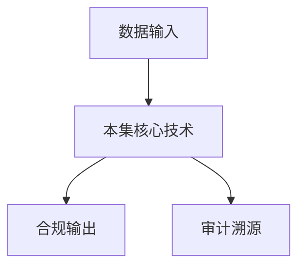

# P08 可信数据空间整体能力

← [[BV1ser5BDESU-总览]] | ← [[P07-可信数据空间标准体系]] | 下一篇 → [[P09-密态计算概念介绍]]

## 视频信息

| 项目 | 内容 |
|------|------|
| 分集 | 可信数据空间整体能力 |
| 模块 | 可信数据空间标准 |
| 时长 | 35 分 15 秒 |
| 链接 | [B 站 P8](https://www.bilibili.com/video/BV1ser5BDESU?p=8) |
| 官方文档 | [SecretFlow 文档](https://www.secretflow.org.cn/zh-CN/docs) |
| 内容来源 | 知识点增强（数据要素流通技术体系，非逐字转写） |

## 核心要点

1. **本 P 主题**：可信数据空间整体能力
2. **模块定位**：可信数据空间标准
3. **考试/实践侧重**：身份认证、使用控制、审计溯源、互联互通
4. **笔记层级**：教程级（约 2772 字），含速览、图解、场景 Walkthrough、自测题
5. **学习建议**：先通读「3 分钟速览」与「图解」，再读「详细讲解」；动手项见 Checklist

> 以下内容基于数据要素流通与隐私计算技术体系撰写，对应 B 站分 P「可信数据空间整体能力」。**非 UP 逐字转写**；不看视频也可建立框架，看视频可对照「与视频对照表」深化。

## 本节在系列中的位置

**模块**：可信数据空间标准 · 系列第 **P08/47** 集。

**建议前置**：[[可信数据空间标准体系]]——建立本集所需背景。

**建议后续**：[[密态计算概念介绍]]——在本集能力之上继续深入。

依赖关系：政策(P01–P06) → 可信空间(P07–P08,P18) → 密态/隐私技术(P09–P24) → SecretFlow 工程(P25–P32) → 基础设施与案例(P33–P47)。

## 3 分钟速览

**可信数据空间整体能力** 是数据要素流通体系中的关键一课。读完本节你应能回答：① 核心概念定义；② 在「供得出—流得动—用得好—保安全」链条中的位置；③ 与隐私计算技术栈的衔接。考试/面试侧重：**身份认证、使用控制、审计溯源、互联互通**。

## 零基础导读

本节「可信数据空间整体能力」属于 **可信数据空间标准**。即便未看视频，也应先建立**制度—技术—场景**三层视角：政策类章节回答「为什么允许流」；技术类章节回答「如何安全地算」；案例类章节回答「真实行业怎么落地」。

第一遍阅读请盯住三个问题：本集**解决什么痛点**？**关键参与方**是谁？**交付物或能力边界**是什么？第二遍阅读时，把术语表抄到 Obsidian 双链笔记，与前后分 P 交叉引用。

## 详细讲解

### 1. 整体能力框架

可信数据空间整体能力覆盖「进得来、看得见、管得住、流得动、算得准、可追溯」。本 P 从运营视角介绍空间应具备的平台级能力，是 P07 标准体系的具体化落地。

### 2. 六大核心能力

| 能力 | 说明 | 关键技术 |
|------|------|----------|
| 可信接入 | 多方身份认证、设备信任 | PKI、远程证明、连接器 |
| 资源管理 | 目录、登记、版本、质量 | 元数据标准、数据资产台账 |
| 使用控制 | 用途/期限/次数/环境约束 | 数字合约、策略引擎、ODRL |
| 安全计算 | 空间内协作分析 | 联邦学习、MPC、TEE |
| 价值计量 | 贡献度、定价、结算 | 区块链存证、计量模型 |
| 审计溯源 | 全链路留痕 | 不可篡改日志、证据链 |

### 3. 数字合约与策略执行

**数字合约**将法律条款转化为机器可执行策略：
- 允许的操作：统计、建模、查询
- 禁止的操作：下载原始数据、二次分发
- 约束条件：时间窗、结果粒度、输出格式
- 违约处理：自动熔断、告警、追责

### 4. 互联互通能力

- **域内互通**：同一运营方下多连接器互认
- **跨域漫游**：不同空间间联邦目录、合约转译
- **与隐私计算平台对接**：Kuscia/SecretFlow 作为计算后端

### 5. 运营指标

| 指标 | 目标 |
|------|------|
| 接入时延 | 新参与方 onboarding < N 工作日 |
| 合约执行率 | 策略违规自动拦截 100% |
| 审计覆盖率 | 关键操作 100% 留痕 |
| 可用性 | 平台 SLA ≥ 99.9% |

### 6. 考试/实践要点

- 列举六大能力并各举一个技术实现
- 解释「使用控制」与「访问控制」区别
- 设计一个跨行企业营销场景的空间能力需求表

### 7. SLA 与运营

空间运营方应公布 SLA、投诉渠道、争议仲裁。参与方数据质量纠纷需**质量标签**与第三方认证支撑。

### 8. 商业模式

空间可收取接入费、交易佣金、算力费、增值服务费。公共数据空间可能政府补贴+市场化增值服务结合。

### 深化理解（可信数据空间整体能力）

将本节概念放入「数据二十条」四原则框架：它主要支撑哪一条原则？若去掉该能力，哪类数据流通场景会受阻？用一句话向非技术经理解释本节价值。

## 图解

## 类比与直觉

可信数据空间像**带门禁的联合办公室**：各方自带文件（数据）进共享会议室，按合约使用、出门留痕，原始文件不随便复印带走。

## 例题与场景 Walkthrough

**场景：两家机构联合建模（不共享明文）**

1. **样本对齐**：若双方仅有交集用户有价值，先用 PSI（P21/P28）对齐 ID。
2. **特征拼接**：纵向联邦（P24）下 A 方持标签、B 方持特征，梯度通过安全聚合更新。
3. **训练执行**：在 SecretFlow SPU（P27）上完成密态前向/反向，或 TEE 内明文训练（P11–P17）。
4. **模型发布**：输出评分服务；模型参数经评估后按需出域，训练数据永不出域。
5. **本集关联**：可信数据空间整体能力 提供其中 **身份认证** 能力。

## 常见误区

1. **「学完本集就会用隐语」**：SecretFlow 生态需多集串联（P19–P32），单集只是拼图一块。
2. **「隐私计算等于不上传数据」**：数据仍以密文、份额或授权方式参与计算，网络与算力开销客观存在。
3. **「TEE 绝对安全」**：TEE 依赖硬件与侧信道防护，需远程证明（P17）与补丁策略。
4. **「区块链解决一切确权」**：链适合存证与交易撮合，大规模计算仍在链下隐私计算引擎。

## 与视频对照表

| 视频段落（约） | 预期演示内容 | 笔记对应章节 |
|-------------|------------|------------|
| 开篇 0%–15% | 本集目标、背景、与前后集关系 | 本节位置、3 分钟速览 |
| 前段 15%–40% | 核心概念定义与架构图 | 零基础导读、详细讲解 |
| 中段 40%–70% | 原理展开、对比、政策/代码示例 | 图解、类比、Walkthrough |
| 后段 70%–90% | 案例、问答、易错点 | 常见误区、Checklist |
| 收尾 90%–100% | 总结、延伸资源 | 延伸阅读、自测题 |

> 本集总时长约 **35分15秒**。无官方外挂字幕时，以分 P 标题「可信数据空间整体能力」与上表主题对齐视频画面。

## 动手实践 Checklist

- [ ] 复述本集 3 个定义（不看笔记）
- [ ] 根据 Walkthrough 写 200 字场景短文
- [ ] 对照视频确认 1 个架构图/演示
- [ ] 在总览思维导图中标注本集节点
- [ ] 完成自测 Q1/Q5

## 延伸阅读

- [SecretFlow 文档中心](https://www.secretflow.org.cn/zh-CN/docs)
- TC609 可信数据空间相关标准
- 本系列相邻 2 个分 P 笔记

## 自测题

1. **本集核心考点？**  
   **答**：身份认证、使用控制、审计溯源、互联互通。

2. **本集在四原则中的位置？**  
   **答**：偏流得动基础设施。

3. **与 SecretFlow 的关系？**  
   **答**：提供合规与架构前提，后续技术集在其上落地。

4. **一项落地检查？**  
   **答**：是否有授权、是否最小必要、是否可审计——三者缺一不可。

5. **30 秒口述本集？**  
   **答**：用「输入→处理→输出」各一句话概括（见 Walkthrough）。

## 关键术语

| 术语 | 说明 |
|------|------|
| 数据要素 | 可参与社会化配置、创造价值的数字化资源 |
| 隐私计算 | 数据可用不可见前提下实现协作计算的技术体系 |
| 使用控制 | 约定用途、次数、期限 |
| 连接器 | 参与方接入节点 |

## 与前后分 P 的衔接

- ← **可信数据空间标准体系**（[[P07-可信数据空间标准体系]]）
- → **密态计算概念介绍**（[[P09-密态计算概念介绍]]）

## 逐字转写
> 状态：待转写。运行 `Tools/transcribe/transcribe.ps1 -Bvid BV1ser5BDESU -Part 8` 补充。

## 来源说明

- ✅ B 站官方元数据（`Tools/BV1ser5BDESU-full.json`）
- ✅ 分 P 首帧封面（`Tools/bili-fetch/fetch-bilibili.js`）
- ✅ **教程级增强**：含图解/Mermaid、场景 Walkthrough、自测题（约 2772 字，2026-06-06）
- ⏳ 逐字转写：B 站 API 无外挂字幕轨；可选 Whisper/BiliNote 后续补充

## 关键截图

![[../../06-资源附件/video-notes-images/BV1ser5BDESU-P08-cover.jpg|B站首帧 P08]]
